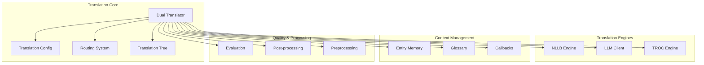
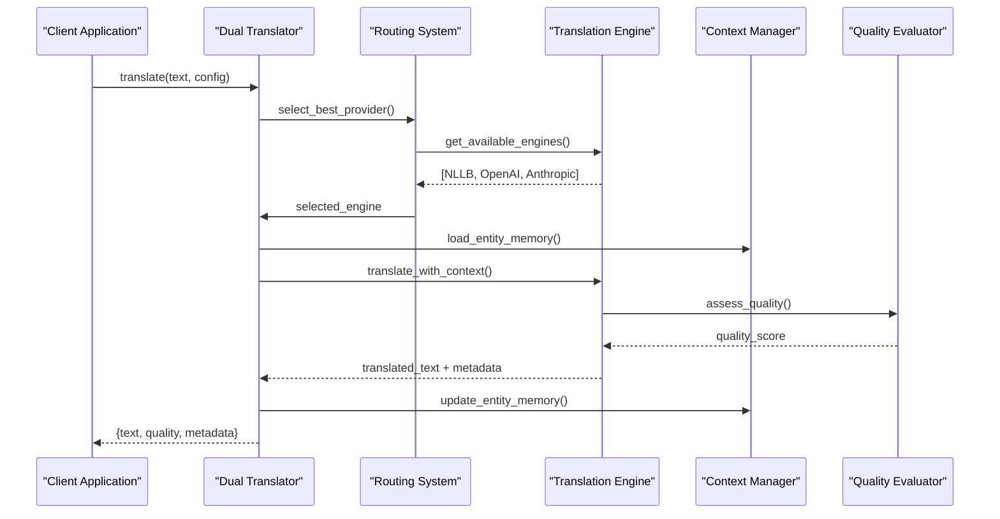
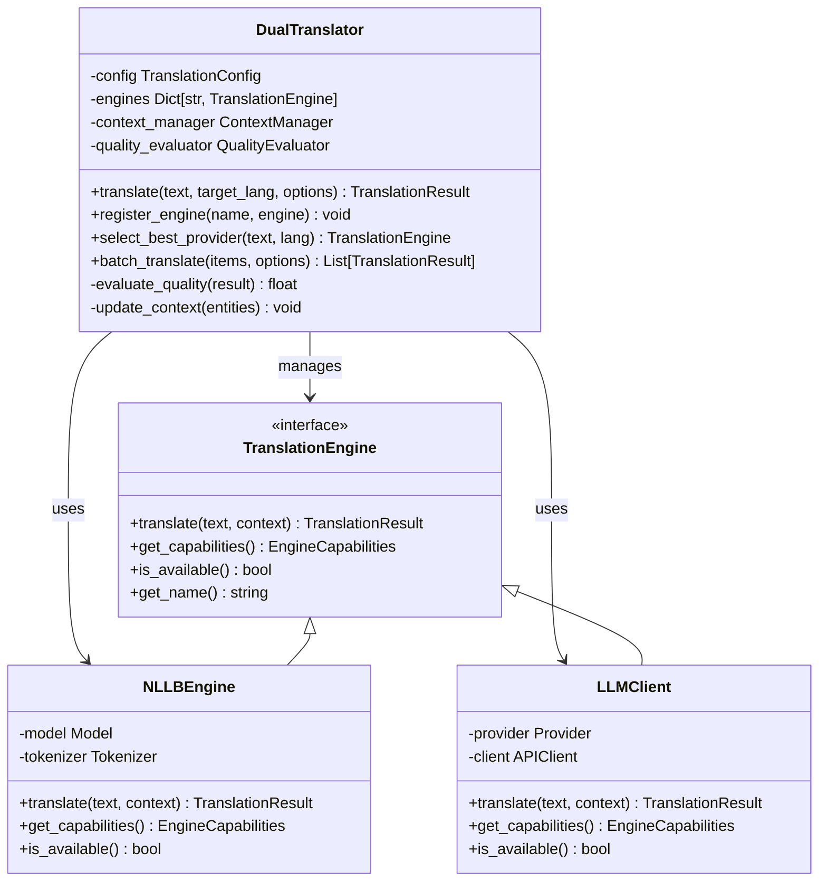
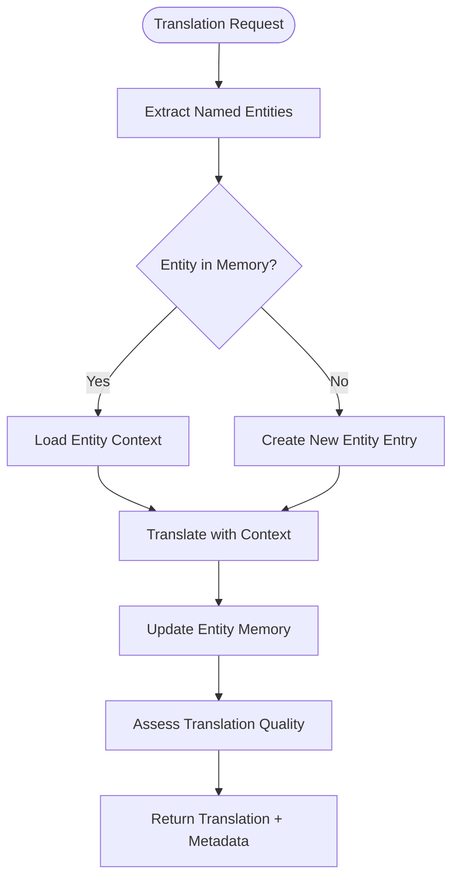
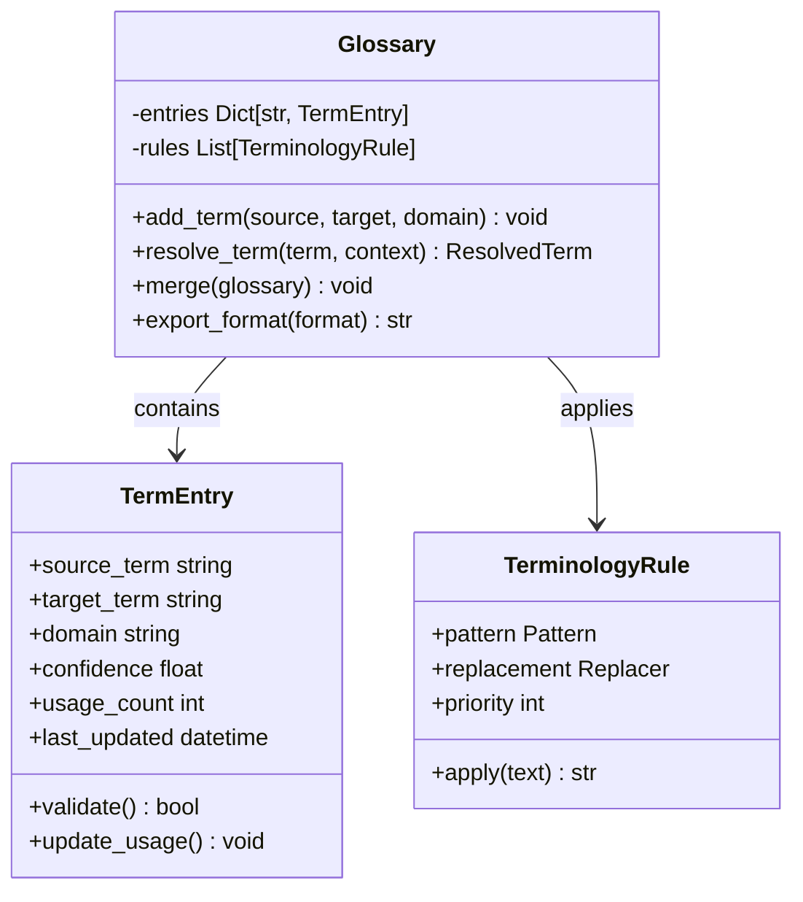
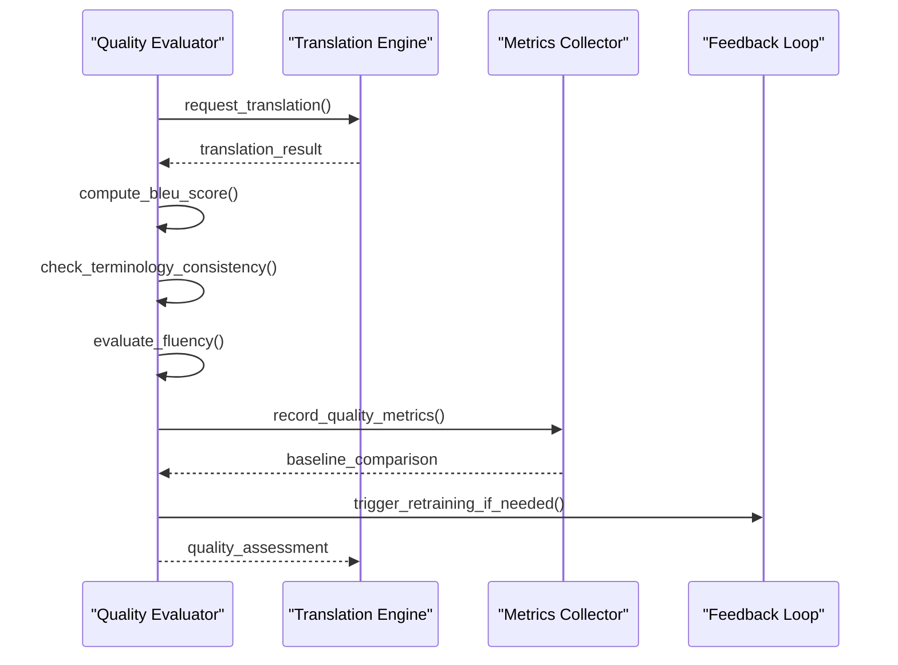
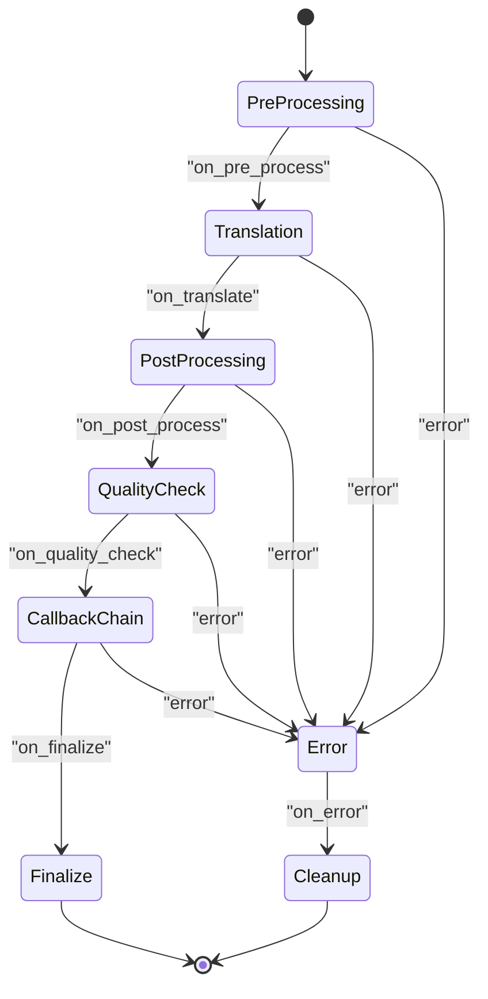
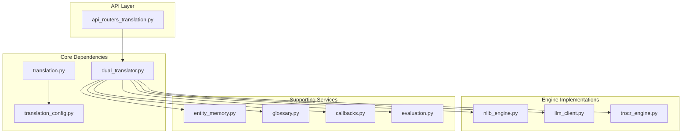

# Translation Services

<cite>
**Referenced Files in This Document**
- [dual_translator.py](file://src/local_deepl/core/dual_translator.py)
- [translation.py](file://src/local_deepl/core/translation.py)
- [nllb_engine.py](file://src/local_deepl/core/nllb_engine.py)
- [entity_memory.py](file://src/local_deepl/core/entity_memory.py)
- [glossary.py](file://src/local_deepl/core/glossary.py)
- [translation_config.py](file://src/local_deepl/core/translation_config.py)
- [callbacks.py](file://src/local_deepl/core/callbacks.py)
- [evaluation.py](file://src/local_deepl/core/evaluation.py)
- [routing.py](file://src/local_deepl/core/routing.py)
- [translation_tree.py](file://src/local_deepl/core/translation_tree.py)
- [llm_client.py](file://src/local_deepl/core/llm_client.py)
- [trocr_engine.py](file://src/local_deepl/core/trocr_engine.py)
- [postprocess.py](file://src/local_deepl/core/postprocess.py)
- [preprocessing.py](file://src/local_deepl/core/preprocessing.py)
- [api_routers_translation.py](file://src/local_deepl/api/routers/translation.py)
- [test_translation_callbacks.py](file://tests/test_translation_callbacks.py)
- [test_translation_evaluator.py](file://tests/test_translation_evaluator.py)
</cite>

## Table of Contents
1. [Introduction](#introduction)
2. [Project Structure](#project-structure)
3. [Core Components](#core-components)
4. [Architecture Overview](#architecture-overview)
5. [Detailed Component Analysis](#detailed-component-analysis)
6. [Dependency Analysis](#dependency-analysis)
7. [Performance Considerations](#performance-considerations)
8. [Troubleshooting Guide](#troubleshooting-guide)
9. [Conclusion](#conclusion)
10. [Appendices](#appendices)

## Introduction

LocalDeepL's translation services subsystem provides a sophisticated, pluggable architecture that supports both local machine learning models (NLLB - No Language Left Behind) and cloud-based APIs (OpenAI, Anthropic). The system is designed around a dual translator approach that enables seamless switching between different translation backends while maintaining context preservation, entity memory management, and terminology consistency across translations.

The architecture emphasizes flexibility through its plugin-based design, allowing developers to implement custom translation providers while leveraging built-in quality assessment mechanisms, callback systems, and performance optimization strategies. This document provides comprehensive coverage of the translation subsystem's components, configuration options, and best practices for achieving high-quality multilingual translations.

## Project Structure

The translation services are organized within the core module hierarchy, with clear separation of concerns between translation engines, context management, and API interfaces. The main components include the dual translator orchestrator, individual translation engines, context and entity management, glossary support, and evaluation frameworks.

**Diagram sources**
- [dual_translator.py:1-50](file://src/local_deepl/core/dual_translator.py#L1-L50)
- [translation.py:1-50](file://src/local_deepl/core/translation.py#L1-L50)
- [nllb_engine.py:1-50](file://src/local_deepl/core/nllb_engine.py#L1-L50)

**Section sources**
- [dual_translator.py:1-100](file://src/local_deepl/core/dual_translator.py#L1-L100)
- [translation.py:1-100](file://src/local_deepl/core/translation.py#L1-L100)

## Core Components

### Dual Translator System

The dual translator serves as the central orchestrator for managing multiple translation backends. It implements a strategy pattern that allows dynamic selection between local NLLB models and cloud-based LLM APIs based on configuration, availability, and performance requirements.

Key responsibilities include:
- Backend selection and routing logic
- Context preservation across translation batches
- Entity memory coordination
- Quality assessment integration
- Performance monitoring and fallback mechanisms

### Translation Configuration Management

The translation configuration system provides a unified interface for managing provider-specific settings, including API keys, model parameters, rate limiting, and fallback configurations. It supports hot-reloading of settings and validates provider compatibility.

### Context Preservation Mechanisms

The context preservation system maintains translation consistency across documents and sessions through:
- Entity memory tracking for proper noun handling
- Glossary-based terminology enforcement
- Session-scoped context windows
- Cross-document reference resolution

**Section sources**
- [dual_translator.py:1-200](file://src/local_deepl/core/dual_translator.py#L1-L200)
- [translation_config.py:1-150](file://src/local_deepl/core/translation_config.py#L1-L150)
- [entity_memory.py:1-100](file://src/local_deepl/core/entity_memory.py#L1-L100)

## Architecture Overview

The translation architecture follows a layered approach with clear separation between the orchestration layer, engine implementations, and supporting services. The dual translator acts as the primary entry point, delegating actual translation work to specialized engines while managing cross-cutting concerns like context, quality, and performance.

**Diagram sources**
- [dual_translator.py:50-150](file://src/local_deepl/core/dual_translator.py#L50-L150)
- [routing.py:1-100](file://src/local_deepl/core/routing.py#L1-L100)
- [nllb_engine.py:1-100](file://src/local_deepl/core/nllb_engine.py#L1-L100)

## Detailed Component Analysis

### Dual Translator Implementation

The dual translator implements a sophisticated routing mechanism that considers multiple factors when selecting translation providers:

**Diagram sources**
- [dual_translator.py:1-200](file://src/local_deepl/core/dual_translator.py#L1-L200)
- [nllb_engine.py:1-150](file://src/local_deepl/core/nllb_engine.py#L1-L150)
- [llm_client.py:1-100](file://src/local_deepl/core/llm_client.py#L1-L100)

### Entity Memory Management

The entity memory system provides intelligent tracking of named entities and terminology across translation sessions:

**Diagram sources**
- [entity_memory.py:1-200](file://src/local_deepl/core/entity_memory.py#L1-L200)
- [glossary.py:1-150](file://src/local_deepl/core/glossary.py#L1-L150)

### Glossary and Terminology Management

The glossary system enforces terminology consistency through hierarchical matching and priority-based resolution:

**Diagram sources**
- [glossary.py:1-200](file://src/local_deepl/core/glossary.py#L1-L200)

### Quality Assessment Framework

The quality assessment system provides multi-dimensional evaluation of translation outputs:

**Diagram sources**
- [evaluation.py:1-150](file://src/local_deepl/core/evaluation.py#L1-L150)
- [test_translation_evaluator.py:1-100](file://tests/test_translation_evaluator.py#L1-L100)

### Callback System Integration

The callback system enables extensible processing hooks throughout the translation pipeline:

**Diagram sources**
- [callbacks.py:1-200](file://src/local_deepl/core/callbacks.py#L1-L200)
- [test_translation_callbacks.py:1-150](file://tests/test_translation_callbacks.py#L1-L150)

## Dependency Analysis

The translation subsystem exhibits a well-structured dependency graph with clear separation between core functionality and optional features:

**Diagram sources**
- [dual_translator.py:1-50](file://src/local_deepl/core/dual_translator.py#L1-L50)
- [api_routers_translation.py:1-100](file://src/local_deepl/api/routers/translation.py#L1-L100)

**Section sources**
- [dual_translator.py:1-100](file://src/local_deepl/core/dual_translator.py#L1-L100)
- [routing.py:1-100](file://src/local_deepl/core/routing.py#L1-L100)

## Performance Considerations

### Batch Processing Optimization

The translation system implements several performance optimization strategies:

- **Intelligent Batching**: Automatic grouping of related text segments to maximize context utilization
- **Connection Pooling**: Efficient reuse of model connections and API client instances
- **Caching Strategies**: Multi-level caching for frequently used translations and entity mappings
- **Asynchronous Processing**: Non-blocking operations for I/O intensive tasks
- **Memory Management**: Lazy loading of large models and context windows

### Resource Management

- **Model Loading**: On-demand loading of NLLB models with configurable memory limits
- **API Rate Limiting**: Intelligent throttling and retry mechanisms for cloud providers
- **Context Window Management**: Dynamic adjustment of context size based on available resources
- **Garbage Collection**: Proper cleanup of translation artifacts and temporary data

### Monitoring and Profiling

The system includes comprehensive logging and metrics collection for:
- Translation latency tracking
- Quality score trends
- Resource utilization monitoring
- Error rate analysis
- Provider performance comparison

## Troubleshooting Guide

### Common Issues and Solutions

#### Provider Connection Problems
- Verify API credentials and network connectivity
- Check rate limit configurations and quota usage
- Implement proper error handling and fallback mechanisms

#### Memory Issues with Large Documents
- Adjust batch sizes and context window parameters
- Enable streaming processing for very large inputs
- Monitor memory usage and implement cleanup strategies

#### Quality Degradation
- Review glossary entries and terminology consistency
- Check entity memory accuracy and update frequency
- Analyze quality metrics and adjust evaluation thresholds

#### Performance Bottlenecks
- Profile translation pipeline stages
- Optimize batch processing parameters
- Consider hardware acceleration options

**Section sources**
- [evaluation.py:1-100](file://src/local_deepl/core/evaluation.py#L1-L100)
- [test_translation_evaluator.py:1-100](file://tests/test_translation_evaluator.py#L1-L100)

## Conclusion

LocalDeepL's translation services subsystem provides a robust, extensible foundation for multilingual translation workflows. The dual translator architecture successfully balances the strengths of local models and cloud APIs while maintaining context consistency and terminology accuracy. The comprehensive callback system, quality assessment framework, and performance optimization strategies make it suitable for production deployments requiring high-quality, reliable translations.

The pluggable design enables easy integration of new translation providers while the extensive configuration options allow fine-tuning for specific use cases. The emphasis on context preservation and entity memory ensures consistent terminology across large documents and translation projects.

## Appendices

### Configuration Examples

#### Basic Provider Setup
Configure default translation providers with fallback mechanisms and quality thresholds.

#### Custom Translation Backend Implementation
Implement the translation engine interface to add support for new providers or specialized models.

#### Glossary Management
Define domain-specific terminology and manage translation consistency across projects.

### API Reference

#### Translation Service Endpoints
RESTful API endpoints for programmatic access to translation services.

#### Callback Interface Specification
Documentation for implementing custom callbacks and processing hooks.

#### Quality Assessment Metrics
Available quality metrics and evaluation criteria for translation output assessment.