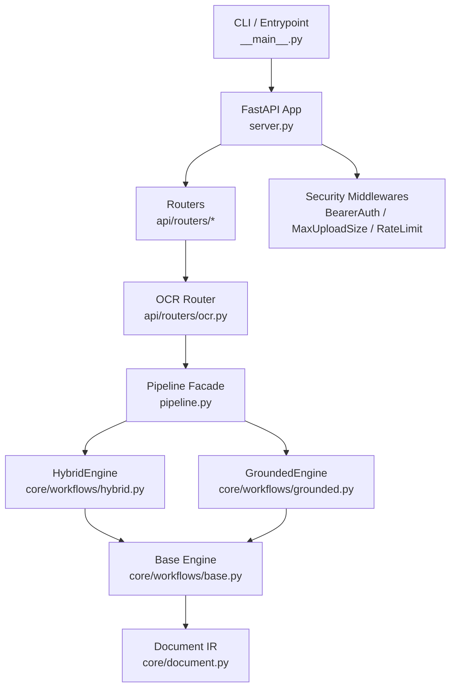
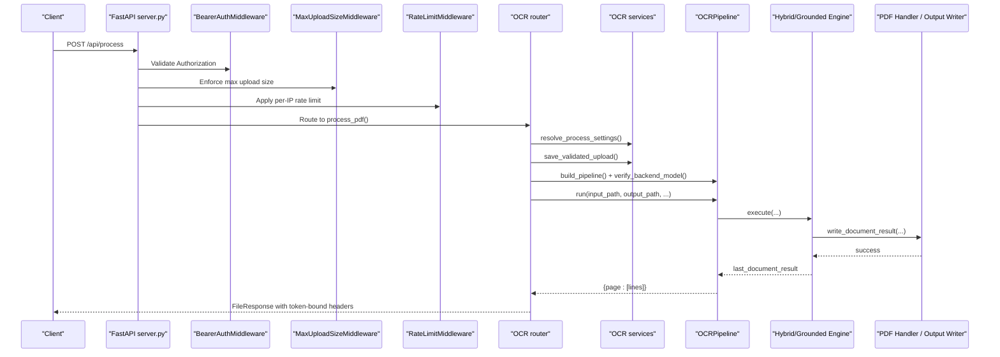
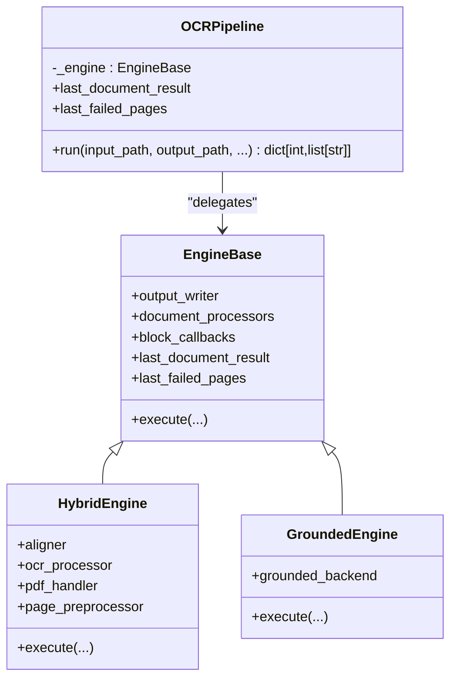
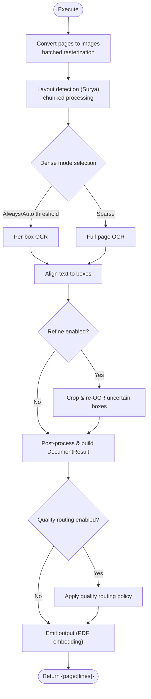
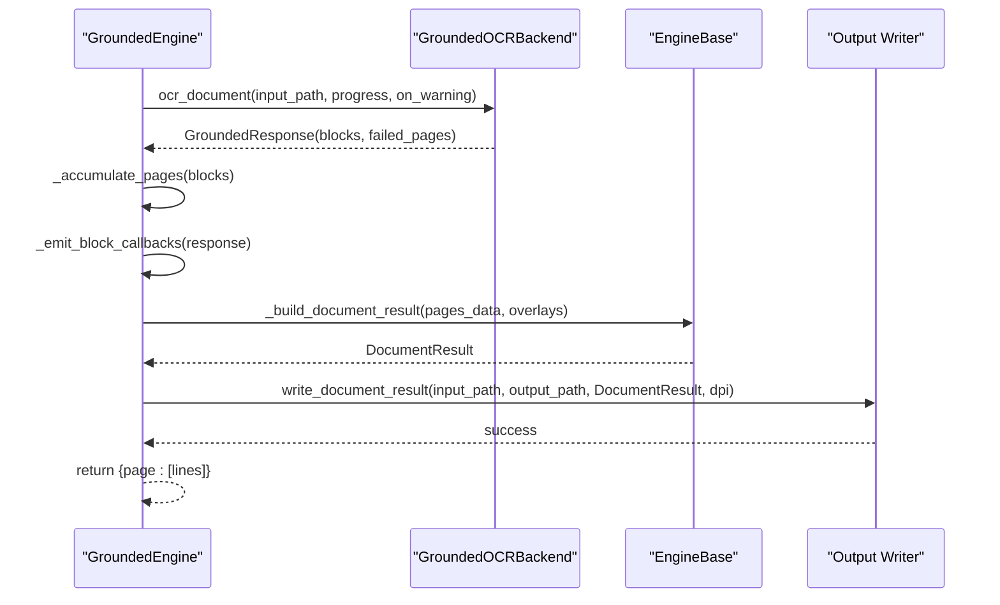
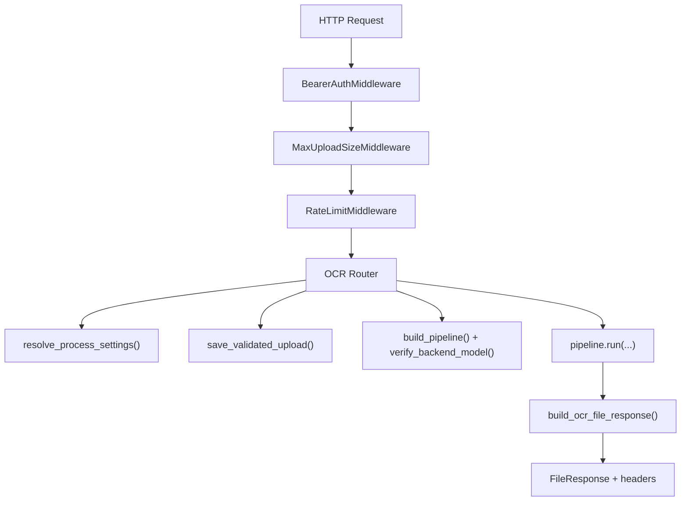
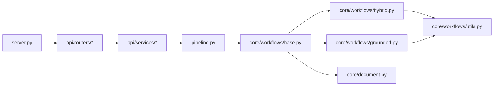

# Voice Transcription System

<cite>
**Referenced Files in This Document**
- [README.md](file://README.md)
- [ARCHITECTURE.md](file://ARCHITECTURE.md)
- [pyproject.toml](file://pyproject.toml)
- [src/omniscribe/__main__.py](file://src/omniscribe/__main__.py)
- [src/omniscribe/server.py](file://src/omniscribe/server.py)
- [src/omniscribe/pipeline.py](file://src/omniscribe/pipeline.py)
- [src/omniscribe/core/workflows/base.py](file://src/omniscribe/core/workflows/base.py)
- [src/omniscribe/core/workflows/hybrid.py](file://src/omniscribe/core/workflows/hybrid.py)
- [src/omniscribe/core/workflows/grounded.py](file://src/omniscribe/core/workflows/grounded.py)
- [src/omniscribe/core/document.py](file://src/omniscribe/core/document.py)
- [src/omniscribe/api/routers/ocr.py](file://src/omniscribe/api/routers/ocr.py)
- [src/omniscribe/api/services/security_middleware.py](file://src/omniscribe/api/services/security_middleware.py)
- [src/omniscribe/api/services/security_config.py](file://src/omniscribe/api/services/security_config.py)
- [src/omniscribe/core/workflows/utils.py](file://src/omniscribe/core/workflows/utils.py)
</cite>

## Table of Contents
1. [Introduction](#introduction)
2. [Project Structure](#project-structure)
3. [Core Components](#core-components)
4. [Architecture Overview](#architecture-overview)
5. [Detailed Component Analysis](#detailed-component-analysis)
6. [Dependency Analysis](#dependency-analysis)
7. [Performance Considerations](#performance-considerations)
8. [Troubleshooting Guide](#troubleshooting-guide)
9. [Conclusion](#conclusion)
10. [Appendices](#appendices)

## Introduction
OmniScribe is a Python-based OCR and document intelligence system that transforms scanned PDFs and images into searchable, selectable PDFs using local vision-language models. The supported product workflow is the FastAPI Web UI and API; the legacy CLI entrypoint has been deprecated. The core pipeline supports two modes:
- Hybrid path: layout detection (Surya), sparse full-page VLM OCR, DP alignment, optional refine, post-processing, and embedding into a sandwich PDF.
- Grounded path: bbox-native VLM OCR directly returning positioned text blocks.

The system also exposes rich APIs for configuration, job history, artifacts, translation, extraction, and transcription extras.

**Section sources**
- [README.md:1-116](file://README.md#L1-L116)
- [ARCHITECTURE.md:1-120](file://ARCHITECTURE.md#L1-L120)

## Project Structure
At a high level:
- Entry points: `__main__.py` delegates to `server.main`, which starts the ASGI app via uvicorn.
- Server: `server.py` creates the FastAPI application, mounts routers, applies security middlewares, and serves static assets.
- Pipeline facade: `pipeline.py` provides `OCRPipeline`, delegating to either `HybridEngine` or `GroundedEngine`.
- Core workflows: `core/workflows/` contains shared base engine logic and concrete engines.
- API layer: `api/routers/` expose HTTP endpoints; `api/services/` encapsulate settings, response assembly, jobs, progress, and artifact stores.
- Security: `api/services/security_middleware.py` and `security_config.py` implement auth, upload size limits, and rate limiting.

**Diagram sources**
- [src/omniscribe/__main__.py:1-7](file://src/omniscribe/__main__.py#L1-L7)
- [src/omniscribe/server.py:64-150](file://src/omniscribe/server.py#L64-L150)
- [src/omniscribe/pipeline.py:38-91](file://src/omniscribe/pipeline.py#L38-L91)
- [src/omniscribe/core/workflows/base.py:52-104](file://src/omniscribe/core/workflows/base.py#L52-L104)
- [src/omniscribe/core/workflows/hybrid.py:43-90](file://src/omniscribe/core/workflows/hybrid.py#L43-L90)
- [src/omniscribe/core/workflows/grounded.py:25-46](file://src/omniscribe/core/workflows/grounded.py#L25-L46)
- [src/omniscribe/core/document.py:77-116](file://src/omniscribe/core/document.py#L77-L116)

**Section sources**
- [ARCHITECTURE.md:1-96](file://ARCHITECTURE.md#L1-L96)
- [src/omniscribe/server.py:64-150](file://src/omniscribe/server.py#L64-L150)

## Core Components
- OCRPipeline facade selects between HybridEngine and GroundedEngine based on injected components. It normalizes parameters and forwards callbacks for progress and warnings.
- Base engine defines shared state, cross-page merge, spellcheck, and emission to output writers.
- HybridEngine orchestrates Surya layout detection, sparse/dense OCR, refinement, post-processing, quality routing, and PDF embedding.
- GroundedEngine calls a bbox-native backend, accumulates pages, emits per-block events, and builds the final result.
- Document IR (`DocumentResult`, `DocumentPage`, `DocumentBlock`) standardizes normalized bounding boxes and reading order across processors.

Key extension points:
- Aligner, OCR processor, PDF handler, output writer, grounded backend, document processors, page preprocessor, and block callbacks are injectable into the pipeline.

**Section sources**
- [src/omniscribe/pipeline.py:38-161](file://src/omniscribe/pipeline.py#L38-L161)
- [src/omniscribe/core/workflows/base.py:52-260](file://src/omniscribe/core/workflows/base.py#L52-L260)
- [src/omniscribe/core/workflows/hybrid.py:43-165](file://src/omniscribe/core/workflows/hybrid.py#L43-L165)
- [src/omniscribe/core/workflows/grounded.py:25-154](file://src/omniscribe/core/workflows/grounded.py#L25-L154)
- [src/omniscribe/core/document.py:43-146](file://src/omniscribe/core/document.py#L43-L146)

## Architecture Overview
The system follows an ASGI-first design with FastAPI at the edge, middleware enforcing security, and thin routers delegating to services and the pipeline. The pipeline uses engines to process documents and write outputs.

**Diagram sources**
- [src/omniscribe/server.py:98-150](file://src/omniscribe/server.py#L98-L150)
- [src/omniscribe/api/services/security_middleware.py:132-230](file://src/omniscribe/api/services/security_middleware.py#L132-L230)
- [src/omniscribe/api/routers/ocr.py:255-400](file://src/omniscribe/api/routers/ocr.py#L255-L400)
- [src/omniscribe/pipeline.py:100-161](file://src/omniscribe/pipeline.py#L100-L161)
- [src/omniscribe/core/workflows/base.py:219-260](file://src/omniscribe/core/workflows/base.py#L219-L260)

## Detailed Component Analysis

### OCRPipeline Facade
- Selects GroundedEngine when a grounded backend is provided; otherwise requires aligner and ocr_processor for HybridEngine.
- Normalizes dense_mode and other options, forwards block_callbacks for per-block events, and exposes last_document_result and last_failed_pages.

**Diagram sources**
- [src/omniscribe/pipeline.py:38-91](file://src/omniscribe/pipeline.py#L38-L91)
- [src/omniscribe/core/workflows/base.py:52-104](file://src/omniscribe/core/workflows/base.py#L52-L104)
- [src/omniscribe/core/workflows/hybrid.py:43-90](file://src/omniscribe/core/workflows/hybrid.py#L43-L90)
- [src/omniscribe/core/workflows/grounded.py:25-46](file://src/omniscribe/core/workflows/grounded.py#L25-L46)

**Section sources**
- [src/omniscribe/pipeline.py:38-161](file://src/omniscribe/pipeline.py#L38-L161)

### HybridEngine Workflow
- Converts input to per-page images with bounded memory batches.
- Detects layout via Surya in chunks.
- Chooses dense vs sparse OCR per page based on thresholds.
- Runs concurrent OCR tasks, emits per-block and per-page callbacks.
- Optionally refines empty boxes on sparse pages.
- Builds DocumentResult, runs document processors, applies quality routing, and emits output.

**Diagram sources**
- [src/omniscribe/core/workflows/hybrid.py:69-165](file://src/omniscribe/core/workflows/hybrid.py#L69-L165)
- [src/omniscribe/core/workflows/hybrid.py:166-223](file://src/omniscribe/core/workflows/hybrid.py#L166-L223)
- [src/omniscribe/core/workflows/hybrid.py:265-298](file://src/omniscribe/core/workflows/hybrid.py#L265-L298)
- [src/omniscribe/core/workflows/hybrid.py:317-423](file://src/omniscribe/core/workflows/hybrid.py#L317-L423)
- [src/omniscribe/core/workflows/hybrid.py:424-493](file://src/omniscribe/core/workflows/hybrid.py#L424-L493)

**Section sources**
- [src/omniscribe/core/workflows/hybrid.py:43-623](file://src/omniscribe/core/workflows/hybrid.py#L43-L623)

### GroundedEngine Workflow
- Calls backend’s ocr_document to get bbox-native blocks.
- Accumulates pages, emits per-block and per-page callbacks.
- Builds DocumentResult with block metadata overlays and emits output.

**Diagram sources**
- [src/omniscribe/core/workflows/grounded.py:78-143](file://src/omniscribe/core/workflows/grounded.py#L78-L143)
- [src/omniscribe/core/workflows/base.py:167-218](file://src/omniscribe/core/workflows/base.py#L167-L218)

**Section sources**
- [src/omniscribe/core/workflows/grounded.py:25-154](file://src/omniscribe/core/workflows/grounded.py#L25-L154)

### API Layer and Security
- OCR router validates form fields, resolves settings, saves uploads, constructs pipeline, runs it, records job history, and returns a file response with token-bound headers.
- Security middlewares enforce bearer tokens per route group, reject oversized uploads early, and apply per-IP rate limiting.

**Diagram sources**
- [src/omniscribe/api/routers/ocr.py:255-400](file://src/omniscribe/api/routers/ocr.py#L255-L400)
- [src/omniscribe/api/services/security_middleware.py:132-230](file://src/omniscribe/api/services/security_middleware.py#L132-L230)
- [src/omniscribe/api/services/security_middleware.py:232-355](file://src/omniscribe/api/services/security_middleware.py#L232-L355)
- [src/omniscribe/api/services/security_middleware.py:357-399](file://src/omniscribe/api/services/security_middleware.py#L357-L399)

**Section sources**
- [src/omniscribe/api/routers/ocr.py:255-600](file://src/omniscribe/api/routers/ocr.py#L255-L600)
- [src/omniscribe/api/services/security_middleware.py:1-399](file://src/omniscribe/api/services/security_middleware.py#L1-L399)
- [src/omniscribe/api/services/security_config.py:168-289](file://src/omniscribe/api/services/security_config.py#L168-L289)

### Document IR and Processors
- DocumentResult holds pages and blocks with normalized bboxes and reading order.
- Engines convert pages_data to DocumentResult, then back to legacy format for writers.
- Optional document processors can reorder, annotate, or rewrite blocks before embedding.

**Section sources**
- [src/omniscribe/core/document.py:77-146](file://src/omniscribe/core/document.py#L77-L146)
- [src/omniscribe/core/workflows/base.py:167-218](file://src/omniscribe/core/workflows/base.py#L167-L218)

## Dependency Analysis
- Server depends on FastAPI, routers, and security middlewares.
- Routers depend on services for settings, response assembly, jobs, and artifacts.
- Pipeline depends on engines; engines depend on aligner, OCR processor, PDF handler, and output writer.
- Utilities provide confidence estimation, page range parsing, and image decoding helpers.

**Diagram sources**
- [src/omniscribe/server.py:64-150](file://src/omniscribe/server.py#L64-L150)
- [src/omniscribe/api/routers/ocr.py:255-400](file://src/omniscribe/api/routers/ocr.py#L255-L400)
- [src/omniscribe/pipeline.py:38-161](file://src/omniscribe/pipeline.py#L38-L161)
- [src/omniscribe/core/workflows/base.py:52-260](file://src/omniscribe/core/workflows/base.py#L52-L260)
- [src/omniscribe/core/workflows/hybrid.py:43-165](file://src/omniscribe/core/workflows/hybrid.py#L43-L165)
- [src/omniscribe/core/workflows/grounded.py:25-154](file://src/omniscribe/core/workflows/grounded.py#L25-L154)
- [src/omniscribe/core/workflows/utils.py:1-109](file://src/omniscribe/core/workflows/utils.py#L1-L109)
- [src/omniscribe/core/document.py:77-146](file://src/omniscribe/core/document.py#L77-L146)

**Section sources**
- [ARCHITECTURE.md:97-136](file://ARCHITECTURE.md#L97-L136)

## Performance Considerations
- HybridEngine uses batched rasterization and chunked layout detection to bound memory and GPU pressure.
- Dense-mode and refine paths decode page images once and reuse PIL images across boxes.
- Grounded path converts PDF pixmaps directly to Pillow images for thumbnails.
- Concurrency is controlled via semaphores and TaskGroup for OCR tasks.

[No sources needed since this section provides general guidance]

## Troubleshooting Guide
Common issues and resolutions:
- Unauthorized requests: Ensure correct Bearer token per route group; check environment variables for per-service tokens.
- Upload too large: Adjust OMNISCRIBE_MAX_UPLOAD_MB; the middleware returns 413 with hints.
- Rate limited: Tune OMNISCRIBE_RATE_LIMIT_PER_MIN; requests exceeding the window receive 429.
- SSRF protection: api_base must not be a disallowed target; requests to unsafe URLs are rejected.
- Job cancellation: For async jobs, cancel pending or running jobs; terminal states are idempotent.

**Section sources**
- [src/omniscribe/api/services/security_middleware.py:132-230](file://src/omniscribe/api/services/security_middleware.py#L132-L230)
- [src/omniscribe/api/services/security_middleware.py:232-355](file://src/omniscribe/api/services/security_middleware.py#L232-L355)
- [src/omniscribe/api/services/security_middleware.py:357-399](file://src/omniscribe/api/services/security_middleware.py#L357-L399)
- [src/omniscribe/api/routers/ocr.py:441-582](file://src/omniscribe/api/routers/ocr.py#L441-L582)

## Conclusion
OmniScribe provides a robust, extensible OCR and document intelligence platform with clear separation between API, services, and core workflows. The dual-engine architecture supports both hybrid and grounded OCR paths, while security middlewares ensure safe operation. The modular design enables customization through injectable components and document processors.

[No sources needed since this section summarizes without analyzing specific files]

## Appendices
- Installation and usage instructions are available in the README.
- Additional features include async translation, glossary imports, and transcription extras.

**Section sources**
- [README.md:18-50](file://README.md#L18-L50)
- [pyproject.toml:41-95](file://pyproject.toml#L41-L95)