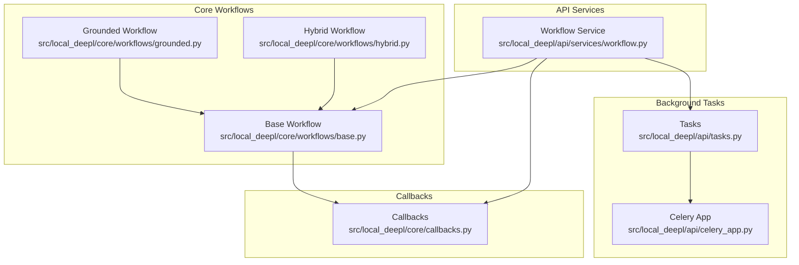
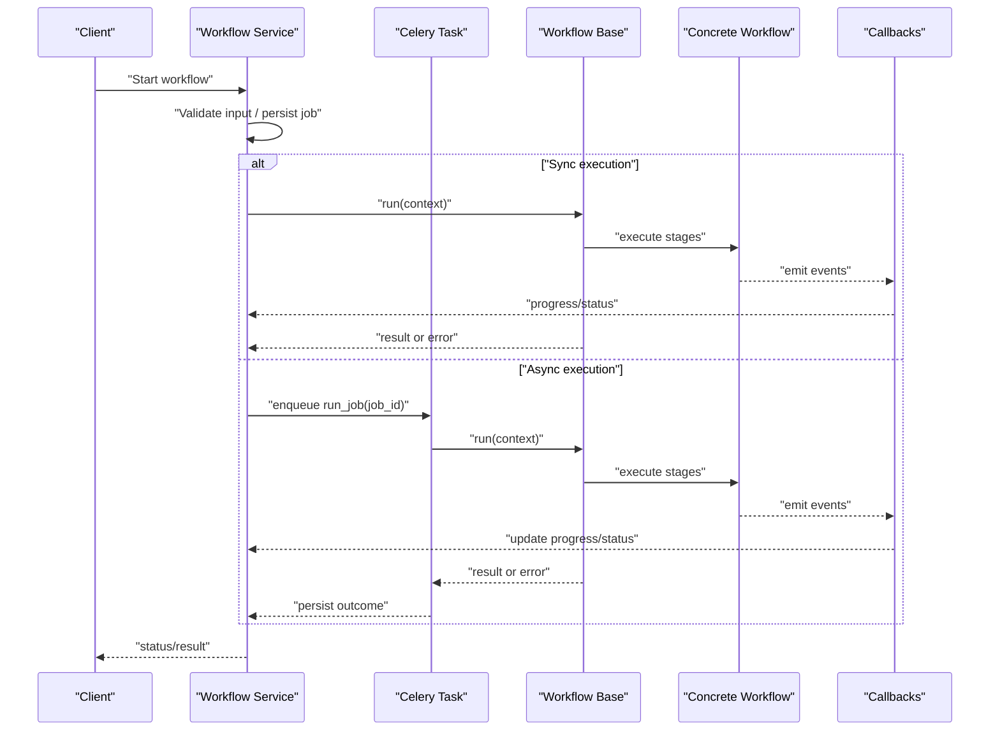
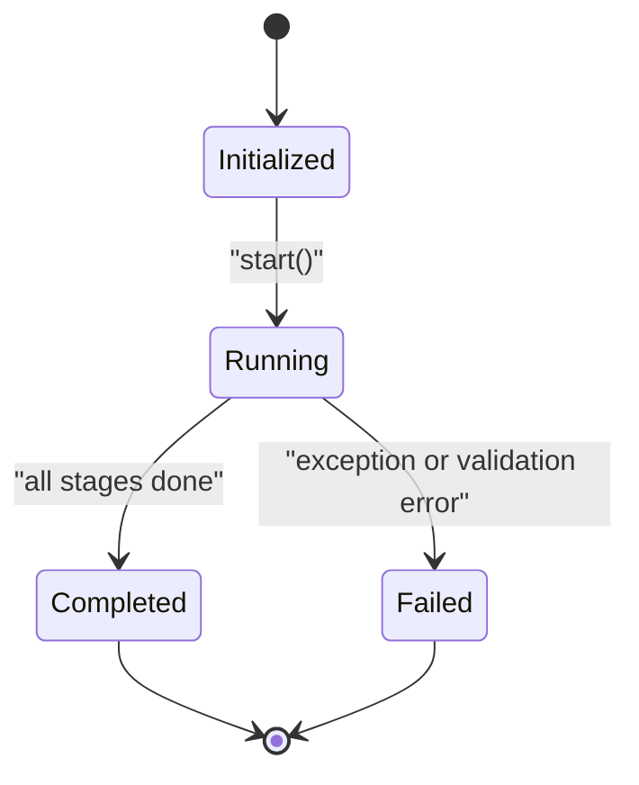
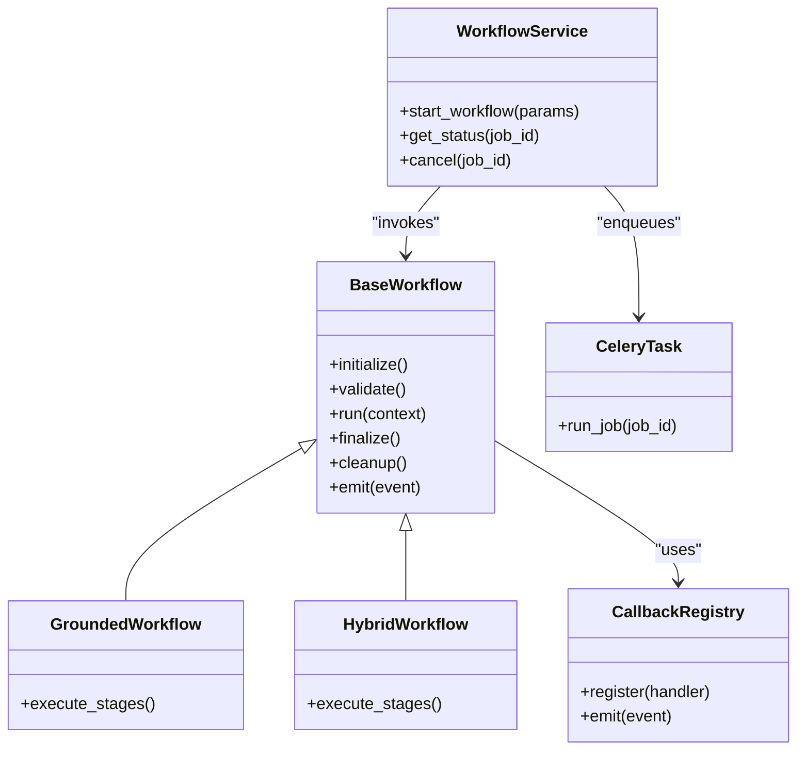

# Base Workflow Framework

<cite>
**Referenced Files in This Document**
- [base.py](file://src/local_deepl/core/workflows/base.py)
- [grounded.py](file://src/local_deepl/core/workflows/grounded.py)
- [hybrid.py](file://src/local_deepl/core/workflows/hybrid.py)
- [callbacks.py](file://src/local_deepl/core/callbacks.py)
- [workflow.py](file://src/local_deepl/api/services/workflow.py)
- [tasks.py](file://src/local_deepl/api/tasks.py)
- [celery_app.py](file://src/local_deepl/api/celery_app.py)
- [test_workflows_base.py](file://tests/test_workflows_base.py)
- [test_workflows_callback_decoupling.py](file://tests/test_workflows_callback_decoupling.py)
- [test_workflows_grounded.py](file://tests/test_workflows_grounded.py)
- [test_workflows_hybrid.py](file://tests/test_workflows_hybrid.py)
</cite>

## Table of Contents
1. [Introduction](#introduction)
2. [Project Structure](#project-structure)
3. [Core Components](#core-components)
4. [Architecture Overview](#architecture-overview)
5. [Detailed Component Analysis](#detailed-component-analysis)
6. [Dependency Analysis](#dependency-analysis)
7. [Performance Considerations](#performance-considerations)
8. [Troubleshooting Guide](#troubleshooting-guide)
9. [Conclusion](#conclusion)
10. [Appendices](#appendices)

## Introduction
This document explains LocalDeepL’s base workflow framework, focusing on the abstract workflow interface, lifecycle management, and orchestration patterns used across OCR and translation pipelines. It covers the workflow state machine, callback mechanisms, error handling strategies, and provides guidance for implementing custom workflows, managing context, integrating with external services, optimizing performance, enabling parallel execution, monitoring progress, testing, and debugging.

## Project Structure
The workflow framework is implemented under core/workflows and integrates with API services and background tasks:
- Abstract base and concrete implementations: src/local_deepl/core/workflows
- Callbacks and eventing: src/local_deepl/core/callbacks.py
- API service layer orchestrating workflows: src/local_deepl/api/services/workflow.py
- Background task integration (Celery): src/local_deepl/api/tasks.py, celery_app.py
- Tests validating behavior: tests/test_workflows_*.py

**Diagram sources**
- [base.py](file://src/local_deepl/core/workflows/base.py)
- [grounded.py](file://src/local_deepl/core/workflows/grounded.py)
- [hybrid.py](file://src/local_deepl/core/workflows/hybrid.py)
- [callbacks.py](file://src/local_deepl/core/callbacks.py)
- [workflow.py](file://src/local_deepl/api/services/workflow.py)
- [tasks.py](file://src/local_deepl/api/tasks.py)
- [celery_app.py](file://src/local_deepl/api/celery_app.py)

**Section sources**
- [base.py](file://src/local_deepl/core/workflows/base.py)
- [grounded.py](file://src/local_deepl/core/workflows/grounded.py)
- [hybrid.py](file://src/local_deepl/core/workflows/hybrid.py)
- [callbacks.py](file://src/local_deepl/core/callbacks.py)
- [workflow.py](file://src/local_deepl/api/services/workflow.py)
- [tasks.py](file://src/local_deepl/api/tasks.py)
- [celery_app.py](file://src/local_deepl/api/celery_app.py)

## Core Components
- Abstract base workflow: defines the lifecycle hooks, state transitions, context management, and callback dispatching that all workflows must follow.
- Concrete workflows: grounded and hybrid variants implement domain-specific steps while reusing the base orchestration.
- Callback system: decouples side effects (logging, metrics, UI updates) from workflow logic via a pluggable callback registry.
- API service: exposes endpoints to start, monitor, and manage workflows; optionally delegates long-running runs to Celery tasks.
- Background tasks: run workflows asynchronously using Celery, providing resilience and scalability.

Key responsibilities:
- Lifecycle: initialize, validate inputs, execute stages, finalize outputs, cleanup.
- State machine: track current phase, errors, and completion status.
- Context: pass shared data between stages safely.
- Callbacks: emit events at key points for observability and integration.
- Error handling: consistent propagation, retry policies, and finalization guarantees.

**Section sources**
- [base.py](file://src/local_deepl/core/workflows/base.py)
- [grounded.py](file://src/local_deepl/core/workflows/grounded.py)
- [hybrid.py](file://src/local_deepl/core/workflows/hybrid.py)
- [callbacks.py](file://src/local_deepl/core/callbacks.py)
- [workflow.py](file://src/local_deepl/api/services/workflow.py)
- [tasks.py](file://src/local_deepl/api/tasks.py)

## Architecture Overview
The workflow framework follows a layered architecture:
- API layer triggers workflow execution via service methods.
- Service layer validates requests, manages persistence/state, and invokes the appropriate workflow implementation.
- Workflow base class coordinates stage execution, emits callbacks, and maintains state.
- Concrete workflows implement domain-specific processing steps.
- Celery tasks can run workflows off the request thread for long-running jobs.

**Diagram sources**
- [workflow.py](file://src/local_deepl/api/services/workflow.py)
- [tasks.py](file://src/local_deepl/api/tasks.py)
- [celery_app.py](file://src/local_deepl/api/celery_app.py)
- [base.py](file://src/local_deepl/core/workflows/base.py)
- [grounded.py](file://src/local_deepl/core/workflows/grounded.py)
- [hybrid.py](file://src/local_deepl/core/workflows/hybrid.py)
- [callbacks.py](file://src/local_deepl/core/callbacks.py)

## Detailed Component Analysis

### Abstract Base Workflow
Responsibilities:
- Define lifecycle hooks for initialization, validation, stage execution, and finalization.
- Maintain a state machine tracking phases such as initialized, running, completed, failed.
- Provide a context object to share data across stages.
- Dispatch callbacks at well-defined points (start, step, progress, complete, error).
- Centralize error handling and ensure cleanup even on failures.

Lifecycle flow:
- Initialize: set up resources and validate configuration.
- Validate: check inputs and preconditions.
- Execute: iterate through stages, updating state and emitting callbacks.
- Finalize: produce outputs, release resources, and record results.
- Cleanup: guarantee resource release and state reset.

Error handling strategy:
- Wrap stage execution with try/except to capture exceptions.
- Transition to failed state and emit error callbacks.
- Ensure finalization and cleanup are always executed.

Context management:
- Use a mutable context object passed to each stage.
- Enforce read/write boundaries where needed.
- Support per-stage isolation if required by concrete implementations.

**Diagram sources**
- [base.py](file://src/local_deepl/core/workflows/base.py)

**Section sources**
- [base.py](file://src/local_deepl/core/workflows/base.py)

### Grounded Workflow
Purpose:
- Implements an OCR-centric pipeline optimized for grounded text extraction.
- Extends the base workflow to add OCR-specific stages (preprocessing, detection, recognition, grounding).
- Integrates with OCR clients and processors defined elsewhere in the codebase.

Key behaviors:
- Overrides stage implementations to perform OCR operations.
- Emits detailed progress callbacks for image-level and line-level processing.
- Handles OCR-specific errors (e.g., unsupported formats, model loading issues).

Integration points:
- Uses OCR client and processor modules.
- Leverages callbacks for real-time progress reporting.

**Section sources**
- [grounded.py](file://src/local_deepl/core/workflows/grounded.py)
- [callbacks.py](file://src/local_deepl/core/callbacks.py)

### Hybrid Workflow
Purpose:
- Combines multiple OCR strategies and post-processing steps to improve robustness.
- Extends the base workflow to orchestrate parallel or fallback strategies.

Key behaviors:
- Selects among OCR engines based on configuration or content characteristics.
- Merges results and applies consistency checks.
- Provides advanced callbacks for strategy selection and merging outcomes.

Parallel execution:
- May run multiple OCR passes concurrently when beneficial.
- Coordinates result aggregation and conflict resolution.

**Section sources**
- [hybrid.py](file://src/local_deepl/core/workflows/hybrid.py)
- [callbacks.py](file://src/local_deepl/core/callbacks.py)

### Callback System
Design:
- Pluggable callback registry allows decoupled side effects (logging, metrics, UI updates).
- Events include lifecycle milestones and granular progress updates.
- Supports synchronous and asynchronous handlers depending on deployment.

Usage patterns:
- Register custom callbacks during workflow initialization.
- Emit events at critical points to update external systems.
- Handle errors in callbacks without breaking workflow execution.

**Section sources**
- [callbacks.py](file://src/local_deepl/core/callbacks.py)
- [base.py](file://src/local_deepl/core/workflows/base.py)

### API Service Orchestration
Responsibilities:
- Expose endpoints to start, query, and cancel workflows.
- Manage job persistence and state synchronization.
- Decide between synchronous execution and Celery-based async execution.
- Translate workflow callbacks into API responses or WebSocket updates.

Integration:
- Calls workflow.run() directly or enqueues a Celery task.
- Persists job metadata and progress updates.
- Returns structured results or error summaries.

**Section sources**
- [workflow.py](file://src/local_deepl/api/services/workflow.py)
- [tasks.py](file://src/local_deepl/api/tasks.py)
- [celery_app.py](file://src/local_deepl/api/celery_app.py)

### Background Tasks (Celery)
Responsibilities:
- Run workflows off the request thread to avoid blocking.
- Provide retries and fault tolerance for long-running jobs.
- Persist intermediate progress and final outcomes.

Configuration:
- Worker concurrency and queue routing affect throughput.
- Timeouts and retry policies should be tuned per workload.

**Section sources**
- [tasks.py](file://src/local_deepl/api/tasks.py)
- [celery_app.py](file://src/local_deepl/api/celery_app.py)

## Dependency Analysis
The workflow components have clear separation of concerns:
- Base workflow depends only on callbacks and minimal core utilities.
- Concrete workflows depend on base workflow and domain-specific modules (OCR, translation).
- API service depends on workflow implementations and background tasks.
- Celery app wires tasks to the service layer.

**Diagram sources**
- [base.py](file://src/local_deepl/core/workflows/base.py)
- [grounded.py](file://src/local_deepl/core/workflows/grounded.py)
- [hybrid.py](file://src/local_deepl/core/workflows/hybrid.py)
- [callbacks.py](file://src/local_deepl/core/callbacks.py)
- [workflow.py](file://src/local_deepl/api/services/workflow.py)
- [tasks.py](file://src/local_deepl/api/tasks.py)

**Section sources**
- [base.py](file://src/local_deepl/core/workflows/base.py)
- [grounded.py](file://src/local_deepl/core/workflows/grounded.py)
- [hybrid.py](file://src/local_deepl/core/workflows/hybrid.py)
- [callbacks.py](file://src/local_deepl/core/callbacks.py)
- [workflow.py](file://src/local_deepl/api/services/workflow.py)
- [tasks.py](file://src/local_deepl/api/tasks.py)

## Performance Considerations
- Parallel execution:
  - Use concurrent stages where possible (e.g., independent OCR passes).
  - Limit concurrency to avoid resource contention (memory, GPU).
- Batch processing:
  - Group small documents to amortize overhead.
  - Stream large documents to reduce memory footprint.
- Resource management:
  - Reuse models and connections across runs.
  - Release temporary files promptly.
- Monitoring:
  - Emit fine-grained progress callbacks for accurate dashboards.
  - Track latency and throughput per stage.
- Backpressure:
  - Apply rate limiting to external services.
  - Queue jobs with bounded worker pools.

[No sources needed since this section provides general guidance]

## Troubleshooting Guide
Common issues and resolutions:
- Workflow stuck in running state:
  - Check callback emissions and worker logs.
  - Verify Celery workers are healthy and consuming tasks.
- Memory spikes:
  - Reduce batch size or concurrency.
  - Ensure temporary artifacts are cleaned up.
- External service timeouts:
  - Increase timeouts or implement retries with backoff.
  - Add circuit breakers for failing services.
- Inconsistent results:
  - Inspect merge logic in hybrid workflows.
  - Enable detailed logging per stage.

Testing strategies:
- Unit tests for base workflow lifecycle and state transitions.
- Mock callbacks to assert event emission order and payloads.
- Integration tests with lightweight OCR providers or stubs.
- End-to-end tests covering API service and Celery task paths.

Debugging tips:
- Enable verbose logging in workflow stages.
- Capture context snapshots before and after critical steps.
- Use test fixtures to reproduce edge cases deterministically.

**Section sources**
- [test_workflows_base.py](file://tests/test_workflows_base.py)
- [test_workflows_callback_decoupling.py](file://tests/test_workflows_callback_decoupling.py)
- [test_workflows_grounded.py](file://tests/test_workflows_grounded.py)
- [test_workflows_hybrid.py](file://tests/test_workflows_hybrid.py)

## Conclusion
LocalDeepL’s base workflow framework provides a robust, extensible foundation for orchestrating complex OCR and translation pipelines. By adhering to the abstract interface, leveraging callbacks, and utilizing parallel execution patterns, teams can build reliable, observable, and high-performance workflows. The provided tests and service integrations demonstrate best practices for production readiness.

[No sources needed since this section summarizes without analyzing specific files]

## Appendices

### Implementing a Custom Workflow
Steps:
- Extend the base workflow class.
- Override lifecycle hooks to define your stages.
- Use the context object to pass data between stages.
- Emit callbacks for progress and errors.
- Integrate with external services via dedicated stage methods.
- Add unit tests for each stage and overall lifecycle.

Example references:
- See base workflow lifecycle hooks and context usage.
- Review grounded and hybrid implementations for patterns.

**Section sources**
- [base.py](file://src/local_deepl/core/workflows/base.py)
- [grounded.py](file://src/local_deepl/core/workflows/grounded.py)
- [hybrid.py](file://src/local_deepl/core/workflows/hybrid.py)

### Managing Workflow Context
Guidelines:
- Keep context immutable where possible; create copies for isolated stages.
- Avoid storing large objects in context; prefer file-backed artifacts.
- Document expected keys and types for cross-stage communication.

**Section sources**
- [base.py](file://src/local_deepl/core/workflows/base.py)

### Integrating with External Services
Patterns:
- Wrap external calls in dedicated stage methods with retries and timeouts.
- Emit error callbacks to surface failures upstream.
- Cache responses when safe to reduce load.

**Section sources**
- [base.py](file://src/local_deepl/core/workflows/base.py)
- [callbacks.py](file://src/local_deepl/core/callbacks.py)

### Monitoring and Observability
Recommendations:
- Emit structured events with timestamps and IDs.
- Aggregate metrics per stage (latency, success rate).
- Persist job states and results for auditability.

**Section sources**
- [callbacks.py](file://src/local_deepl/core/callbacks.py)
- [workflow.py](file://src/local_deepl/api/services/workflow.py)