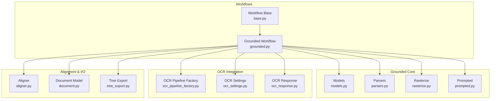
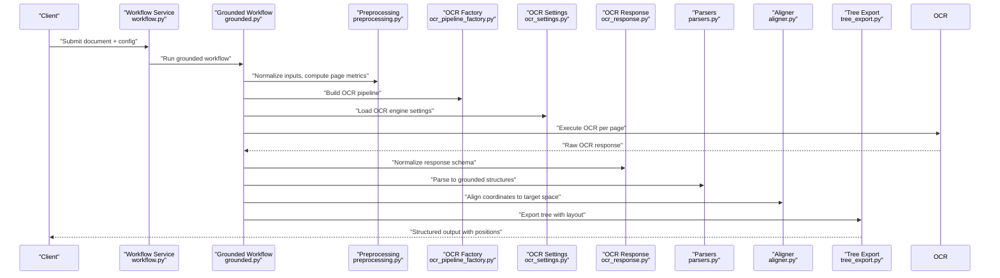
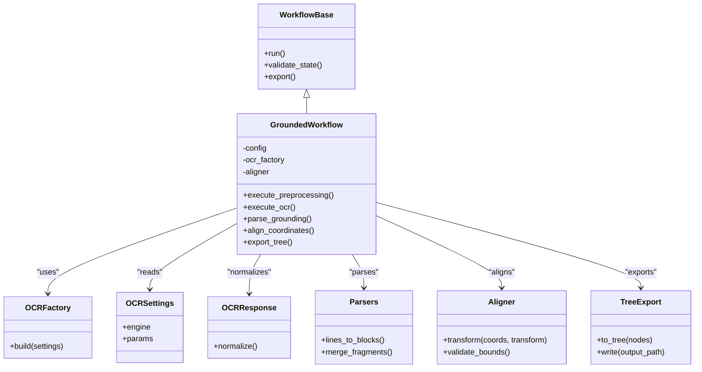
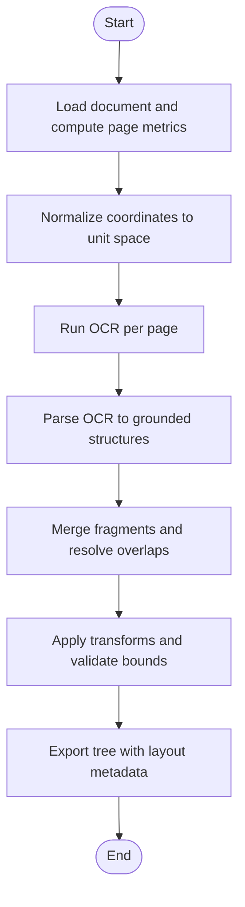
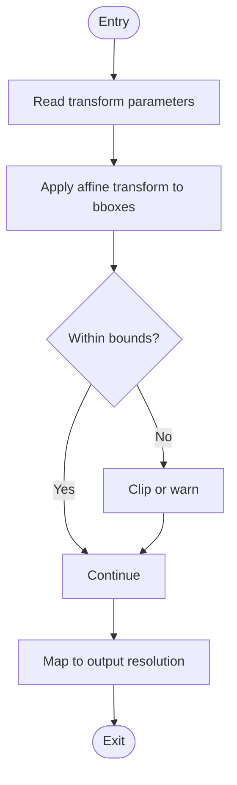
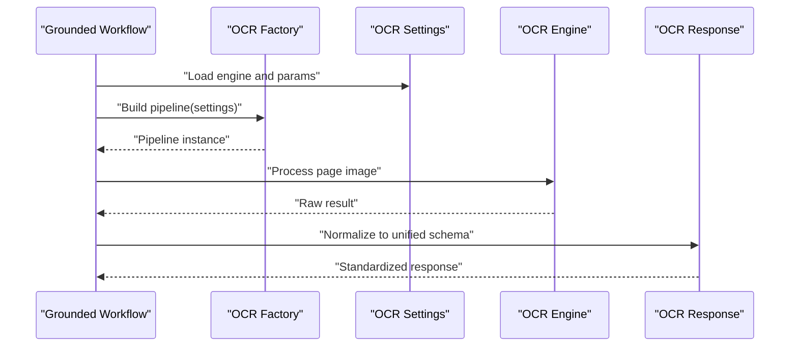
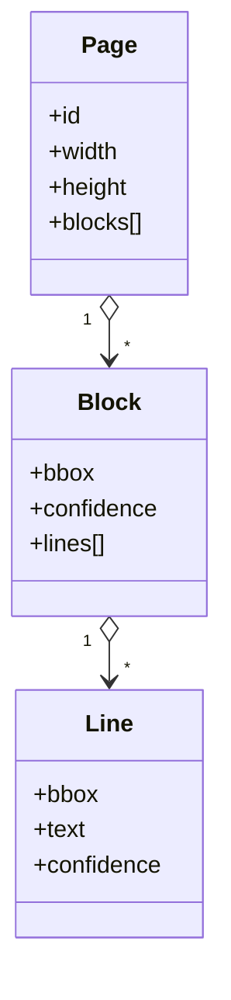
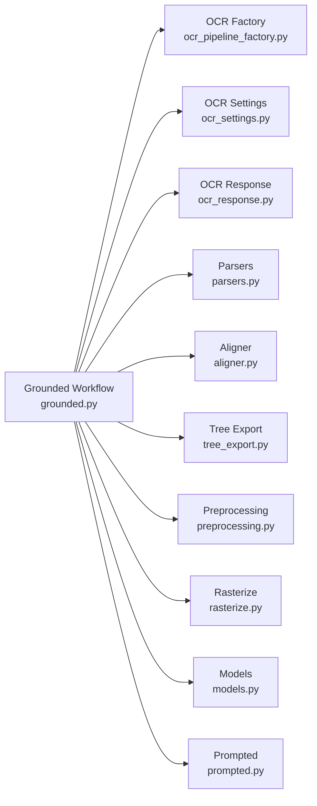

# Grounded Workflow Strategy

<cite>
**Referenced Files in This Document**
- [grounded.py](file://src/local_deepl/core/workflows/grounded.py)
- [base.py](file://src/local_deepl/core/workflows/base.py)
- [models.py](file://src/local_deepl/core/grounded/models.py)
- [parsers.py](file://src/local_deepl/core/grounded/parsers.py)
- [rasterize.py](file://src/local_deepl/core/grounded/rasterize.py)
- [prompted.py](file://src/local_deepl/core/grounded/prompted.py)
- [ocr_pipeline_factory.py](file://src/local_deepl/api/services/ocr_pipeline_factory.py)
- [ocr_settings.py](file://src/local_deepl/api/services/ocr_settings.py)
- [ocr_response.py](file://src/local_deepl/api/services/ocr_response.py)
- [workflow.py](file://src/local_deepl/api/services/workflow.py)
- [aligner.py](file://src/local_deepl/core/aligner.py)
- [preprocessing.py](file://src/local_deepl/core/preprocessing.py)
- [postprocess.py](file://src/local_deepl/core/postprocess.py)
- [document.py](file://src/local_deepl/core/document.py)
- [tree_export.py](file://src/local_deepl/core/tree_export.py)
- [debug_alignment.py](file://scripts/debug_alignment.py)
- [visualize_bboxes.py](file://scripts/visualize_bboxes.py)
- [test_workflows_grounded.py](file://tests/test_workflows_grounded.py)
</cite>

## Table of Contents
1. [Introduction](#introduction)
2. [Project Structure](#project-structure)
3. [Core Components](#core-components)
4. [Architecture Overview](#architecture-overview)
5. [Detailed Component Analysis](#detailed-component-analysis)
6. [Dependency Analysis](#dependency-analysis)
7. [Performance Considerations](#performance-considerations)
8. [Troubleshooting Guide](#troubleshooting-guide)
9. [Conclusion](#conclusion)
10. [Appendices](#appendices)

## Introduction
This document explains LocalDeepL’s grounded workflow strategy for spatial-aware text extraction and layout-preserving translation. It focuses on how the system integrates OCR engines, preserves positional accuracy, and coordinates processing across complex layouts. You will learn to configure grounded workflows for different document types, balance accuracy versus speed, and troubleshoot alignment issues while managing performance and memory for large documents.

## Project Structure
The grounded workflow is implemented under core modules and exposed via API services:
- Workflows orchestrate end-to-end processing and integrate OCR, grounding, and export.
- Grounded subpackage defines models, parsers, rasterization, and prompting utilities used by the workflow.
- OCR integration is configured through factory and settings services.
- Alignment utilities ensure coordinate consistency across pipeline stages.
- Scripts provide debugging and visualization aids for bounding boxes and alignment.

**Diagram sources**
- [base.py](file://src/local_deepl/core/workflows/base.py)
- [grounded.py](file://src/local_deepl/core/workflows/grounded.py)
- [models.py](file://src/local_deepl/core/grounded/models.py)
- [parsers.py](file://src/local_deepl/core/grounded/parsers.py)
- [rasterize.py](file://src/local_deepl/core/grounded/rasterize.py)
- [prompted.py](file://src/local_deepl/core/grounded/prompted.py)
- [ocr_pipeline_factory.py](file://src/local_deepl/api/services/ocr_pipeline_factory.py)
- [ocr_settings.py](file://src/local_deepl/api/services/ocr_settings.py)
- [ocr_response.py](file://src/local_deepl/api/services/ocr_response.py)
- [aligner.py](file://src/local_deepl/core/aligner.py)
- [document.py](file://src/local_deepl/core/document.py)
- [tree_export.py](file://src/local_deepl/core/tree_export.py)

**Section sources**
- [grounded.py](file://src/local_deepl/core/workflows/grounded.py)
- [base.py](file://src/local_deepl/core/workflows/base.py)
- [models.py](file://src/local_deepl/core/grounded/models.py)
- [parsers.py](file://src/local_deepl/core/grounded/parsers.py)
- [rasterize.py](file://src/local_deepl/core/grounded/rasterize.py)
- [prompted.py](file://src/local_deepl/core/grounded/prompted.py)
- [ocr_pipeline_factory.py](file://src/local_deepl/api/services/ocr_pipeline_factory.py)
- [ocr_settings.py](file://src/local_deepl/api/services/ocr_settings.py)
- [ocr_response.py](file://src/local_deepl/api/services/ocr_response.py)
- [aligner.py](file://src/local_deepl/core/aligner.py)
- [document.py](file://src/local_deepl/core/document.py)
- [tree_export.py](file://src/local_deepl/core/tree_export.py)

## Core Components
- Grounded Workflow: Orchestrates OCR, grounding, and translation with strict coordinate tracking. It composes preprocessing, OCR execution, response parsing, alignment, and export steps.
- Grounded Models: Define structured representations for lines, blocks, and pages with bounding boxes and confidence scores.
- Parsers: Convert OCR responses into grounded structures, normalizing coordinates and merging fragments where appropriate.
- Rasterize: Produces page images or crops from input documents to feed OCR engines consistently.
- Prompted: Provides prompts or instructions for LLM-assisted post-processing when needed.
- OCR Integration: Configures OCR backends via a factory, settings, and standardized response schema.
- Aligner: Ensures consistent coordinate systems across preprocessing, OCR, and output stages.
- Document and Tree Export: Maintain document structure and export grounded results preserving layout.

Key responsibilities:
- Spatial awareness: All text elements carry normalized coordinates relative to page size.
- Layout preservation: Block and line hierarchies are maintained throughout the pipeline.
- Coordinate-based processing: Transformations (scaling, rotation, cropping) are applied deterministically and tracked.

**Section sources**
- [grounded.py](file://src/local_deepl/core/workflows/grounded.py)
- [models.py](file://src/local_deepl/core/grounded/models.py)
- [parsers.py](file://src/local_deepl/core/grounded/parsers.py)
- [rasterize.py](file://src/local_deepl/core/grounded/rasterize.py)
- [prompted.py](file://src/local_deepl/core/grounded/prompted.py)
- [ocr_pipeline_factory.py](file://src/local_deepl/api/services/ocr_pipeline_factory.py)
- [ocr_settings.py](file://src/local_deepl/api/services/ocr_settings.py)
- [ocr_response.py](file://src/local_deepl/api/services/ocr_response.py)
- [aligner.py](file://src/local_deepl/core/aligner.py)
- [document.py](file://src/local_deepl/core/document.py)
- [tree_export.py](file://src/local_deepl/core/tree_export.py)

## Architecture Overview
The grounded workflow follows a linear, stage-gated pipeline with explicit state passing and validation at each step.

**Diagram sources**
- [workflow.py](file://src/local_deepl/api/services/workflow.py)
- [grounded.py](file://src/local_deepl/core/workflows/grounded.py)
- [preprocessing.py](file://src/local_deepl/core/preprocessing.py)
- [ocr_pipeline_factory.py](file://src/local_deepl/api/services/ocr_pipeline_factory.py)
- [ocr_settings.py](file://src/local_deepl/api/services/ocr_settings.py)
- [ocr_response.py](file://src/local_deepl/api/services/ocr_response.py)
- [parsers.py](file://src/local_deepl/core/grounded/parsers.py)
- [aligner.py](file://src/local_deepl/core/aligner.py)
- [tree_export.py](file://src/local_deepl/core/tree_export.py)

## Detailed Component Analysis

### Grounded Workflow Orchestration
The grounded workflow composes preprocessing, OCR, parsing, alignment, and export. It enforces coordinate normalization and validates intermediate states to maintain positional fidelity.

**Diagram sources**
- [base.py](file://src/local_deepl/core/workflows/base.py)
- [grounded.py](file://src/local_deepl/core/workflows/grounded.py)
- [ocr_pipeline_factory.py](file://src/local_deepl/api/services/ocr_pipeline_factory.py)
- [ocr_settings.py](file://src/local_deepl/api/services/ocr_settings.py)
- [ocr_response.py](file://src/local_deepl/api/services/ocr_response.py)
- [parsers.py](file://src/local_deepl/core/grounded/parsers.py)
- [aligner.py](file://src/local_deepl/core/aligner.py)
- [tree_export.py](file://src/local_deepl/core/tree_export.py)

**Section sources**
- [grounded.py](file://src/local_deepl/core/workflows/grounded.py)
- [base.py](file://src/local_deepl/core/workflows/base.py)
- [ocr_pipeline_factory.py](file://src/local_deepl/api/services/ocr_pipeline_factory.py)
- [ocr_settings.py](file://src/local_deepl/api/services/ocr_settings.py)
- [ocr_response.py](file://src/local_deepl/api/services/ocr_response.py)
- [parsers.py](file://src/local_deepl/core/grounded/parsers.py)
- [aligner.py](file://src/local_deepl/core/aligner.py)
- [tree_export.py](file://src/local_deepl/core/tree_export.py)

### Spatial-Aware Text Extraction and Layout Preservation
Spatial awareness is achieved by:
- Normalizing page dimensions and computing consistent coordinate spaces.
- Representing text as hierarchical nodes (pages > blocks > lines) with bounding boxes.
- Preserving order and adjacency relationships during parsing and alignment.

**Diagram sources**
- [preprocessing.py](file://src/local_deepl/core/preprocessing.py)
- [rasterize.py](file://src/local_deepl/core/grounded/rasterize.py)
- [parsers.py](file://src/local_deepl/core/grounded/parsers.py)
- [aligner.py](file://src/local_deepl/core/aligner.py)
- [tree_export.py](file://src/local_deepl/core/tree_export.py)

**Section sources**
- [preprocessing.py](file://src/local_deepl/core/preprocessing.py)
- [rasterize.py](file://src/local_deepl/core/grounded/rasterize.py)
- [parsers.py](file://src/local_deepl/core/grounded/parsers.py)
- [aligner.py](file://src/local_deepl/core/aligner.py)
- [tree_export.py](file://src/local_deepl/core/tree_export.py)

### Coordinate-Based Processing and Alignment
Coordinate transformations must be deterministic and reversible where applicable. The aligner ensures that:
- All bounding boxes are transformed consistently with page-level operations (scale, rotate, crop).
- Out-of-bounds detections trigger corrective actions or warnings.
- Final coordinates are mapped to the desired output resolution.

**Diagram sources**
- [aligner.py](file://src/local_deepl/core/aligner.py)

**Section sources**
- [aligner.py](file://src/local_deepl/core/aligner.py)

### OCR Integration Points
The workflow uses an OCR factory to build pipelines based on settings and standardizes responses for downstream parsing.

**Diagram sources**
- [ocr_pipeline_factory.py](file://src/local_deepl/api/services/ocr_pipeline_factory.py)
- [ocr_settings.py](file://src/local_deepl/api/services/ocr_settings.py)
- [ocr_response.py](file://src/local_deepl/api/services/ocr_response.py)

**Section sources**
- [ocr_pipeline_factory.py](file://src/local_deepl/api/services/ocr_pipeline_factory.py)
- [ocr_settings.py](file://src/local_deepl/api/services/ocr_settings.py)
- [ocr_response.py](file://src/local_deepl/api/services/ocr_response.py)

### Data Models for Grounded Structures
Grounded models define entities such as pages, blocks, and lines with associated geometry and confidence. These structures enable precise reconstruction of layout and support downstream tasks like translation with positional fidelity.

**Diagram sources**
- [models.py](file://src/local_deepl/core/grounded/models.py)

**Section sources**
- [models.py](file://src/local_deepl/core/grounded/models.py)

### Prompted Post-Processing
When needed, prompted utilities can refine extracted text or resolve ambiguities using LLM guidance without altering spatial metadata.

**Section sources**
- [prompted.py](file://src/local_deepl/core/grounded/prompted.py)

## Dependency Analysis
The grounded workflow depends on OCR configuration, parsing, alignment, and export components. The following diagram highlights key dependencies and their roles.

**Diagram sources**
- [grounded.py](file://src/local_deepl/core/workflows/grounded.py)
- [ocr_pipeline_factory.py](file://src/local_deepl/api/services/ocr_pipeline_factory.py)
- [ocr_settings.py](file://src/local_deepl/api/services/ocr_settings.py)
- [ocr_response.py](file://src/local_deepl/api/services/ocr_response.py)
- [parsers.py](file://src/local_deepl/core/grounded/parsers.py)
- [aligner.py](file://src/local_deepl/core/aligner.py)
- [tree_export.py](file://src/local_deepl/core/tree_export.py)
- [preprocessing.py](file://src/local_deepl/core/preprocessing.py)
- [rasterize.py](file://src/local_deepl/core/grounded/rasterize.py)
- [models.py](file://src/local_deepl/core/grounded/models.py)
- [prompted.py](file://src/local_deepl/core/grounded/prompted.py)

**Section sources**
- [grounded.py](file://src/local_deepl/core/workflows/grounded.py)
- [ocr_pipeline_factory.py](file://src/local_deepl/api/services/ocr_pipeline_factory.py)
- [ocr_settings.py](file://src/local_deepl/api/services/ocr_settings.py)
- [ocr_response.py](file://src/local_deepl/api/services/ocr_response.py)
- [parsers.py](file://src/local_deepl/core/grounded/parsers.py)
- [aligner.py](file://src/local_deepl/core/aligner.py)
- [tree_export.py](file://src/local_deepl/core/tree_export.py)
- [preprocessing.py](file://src/local_deepl/core/preprocessing.py)
- [rasterize.py](file://src/local_deepl/core/grounded/rasterize.py)
- [models.py](file://src/local_deepl/core/grounded/models.py)
- [prompted.py](file://src/local_deepl/core/grounded/prompted.py)

## Performance Considerations
- Batch processing: Process pages in batches to reduce overhead and improve throughput.
- Memory management: Stream page images and release buffers after OCR; avoid holding full-document tensors in memory.
- OCR tuning: Adjust engine-specific parameters (e.g., DPI, segmentation mode) to balance accuracy and speed.
- Caching: Cache rasterized pages and OCR responses for repeated runs.
- Parallelism: Use concurrent workers for independent pages while respecting resource limits.
- Output streaming: Incrementally write exported trees to disk to avoid large in-memory structures.

[No sources needed since this section provides general guidance]

## Troubleshooting Guide
Common issues and remedies:
- Misaligned bounding boxes: Verify coordinate normalization and transformation parameters; use debug tools to visualize boxes.
- Fragmented lines: Tune parser merge thresholds and overlap handling.
- Low confidence regions: Increase OCR resolution or adjust engine settings; consider prompted refinement.
- Large document slowdown: Enable batching, limit concurrent workers, and stream exports.

Useful scripts:
- Debug alignment and visualize bounding boxes to diagnose coordinate drift.
- Inspect grounded lines and compare against expected layout.

**Section sources**
- [debug_alignment.py](file://scripts/debug_alignment.py)
- [visualize_bboxes.py](file://scripts/visualize_bboxes.py)
- [test_workflows_grounded.py](file://tests/test_workflows_grounded.py)

## Conclusion
LocalDeepL’s grounded workflow delivers robust, spatially aware text extraction with strong layout preservation. By enforcing coordinate normalization, structured parsing, and careful alignment, it maintains positional accuracy across OCR and translation stages. With proper configuration and performance tuning, it scales effectively to large documents while supporting diverse document types.

[No sources needed since this section summarizes without analyzing specific files]

## Appendices

### Configuration Examples
- Scanned PDFs:
  - Set OCR engine to high-resolution mode.
  - Enable aggressive fragment merging.
  - Use batch size tuned to GPU/CPU capacity.
- Digital PDFs:
  - Prefer native text extraction if available; fallback to OCR only for embedded images.
  - Reduce rasterization to minimize overhead.
- Handwritten notes:
  - Increase OCR sensitivity and enable prompted refinement.
  - Allow larger merge windows to reconstruct fragmented strokes.

[No sources needed since this section provides general guidance]

### Accuracy vs Speed Trade-offs
- Higher DPI and stricter segmentation improve accuracy but increase processing time and memory usage.
- Aggressive merging reduces line count and speeds up downstream tasks but may lose fine-grained layout details.
- Use prompted post-processing selectively to correct ambiguous regions without re-running full OCR.

[No sources needed since this section provides general guidance]