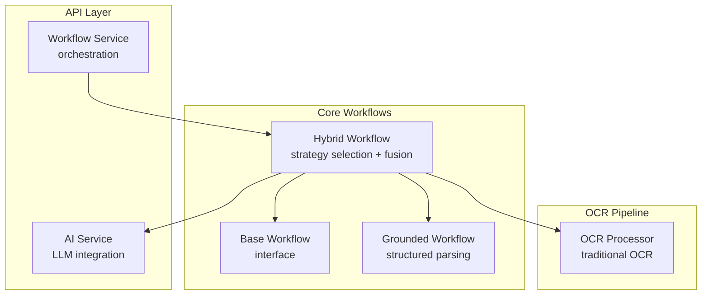
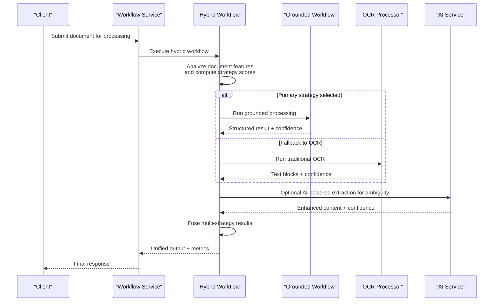
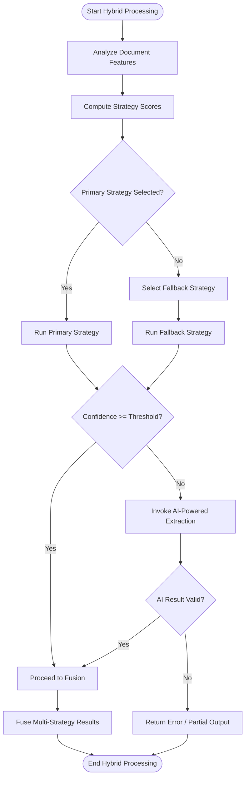
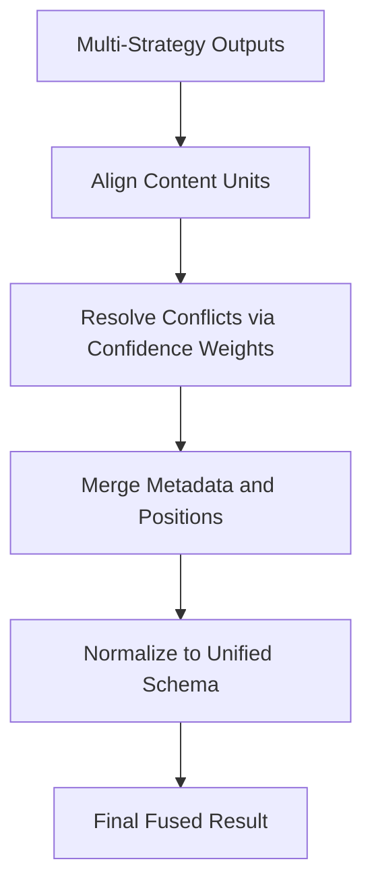
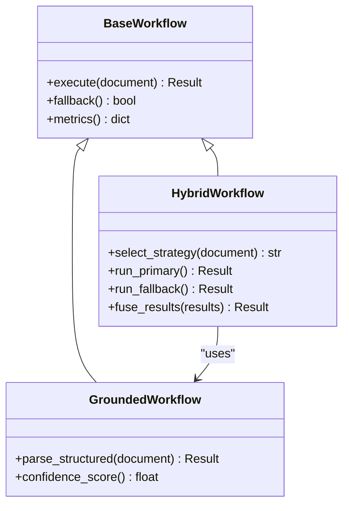
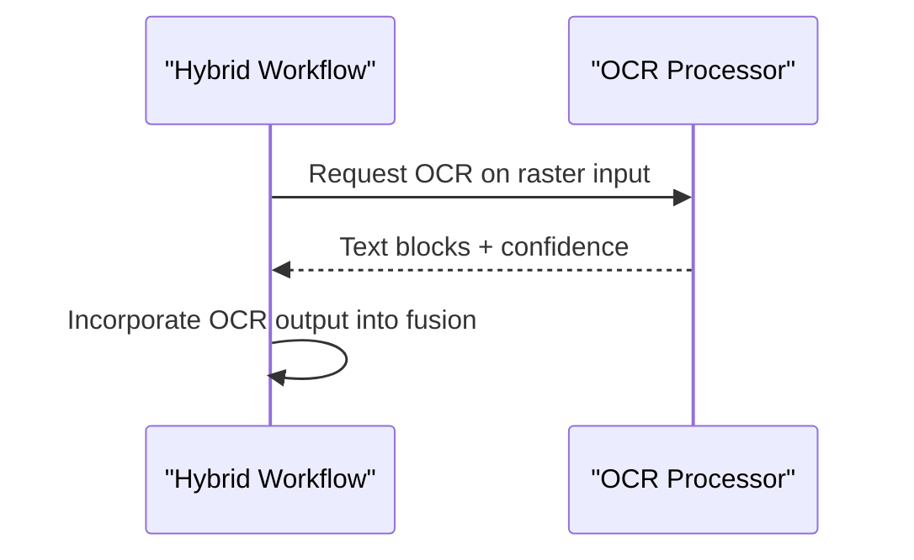
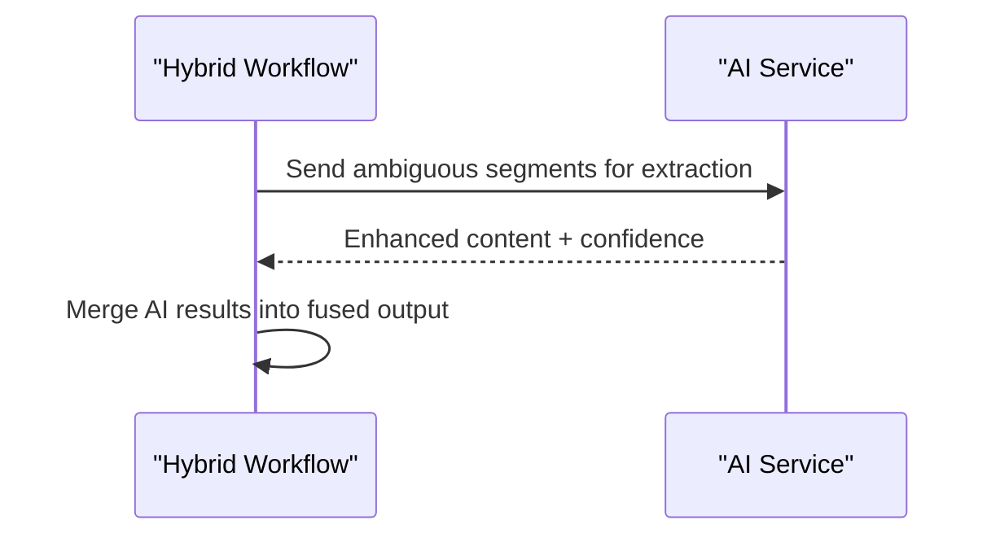
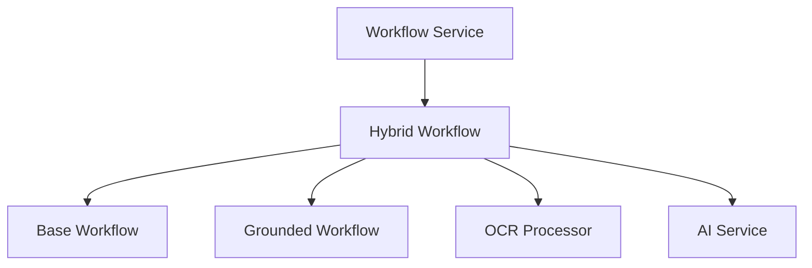

# Hybrid Workflow Strategy

<cite>
**Referenced Files in This Document**
- [hybrid.py](file://src/local_deepl/core/workflows/hybrid.py)
- [base.py](file://src/local_deepl/core/workflows/base.py)
- [grounded.py](file://src/local_deepl/core/workflows/grounded.py)
- [ocr_processor.py](file://src/local_deepl/core/ocr/processor.py)
- [ai_service.py](file://src/local_deepl/api/services/ai.py)
- [workflow_service.py](file://src/local_deepl/api/services/workflow.py)
- [test_workflows_hybrid.py](file://tests/test_workflows_hybrid.py)
</cite>

## Table of Contents
1. [Introduction](#introduction)
2. [Project Structure](#project-structure)
3. [Core Components](#core-components)
4. [Architecture Overview](#architecture-overview)
5. [Detailed Component Analysis](#detailed-component-analysis)
6. [Dependency Analysis](#dependency-analysis)
7. [Performance Considerations](#performance-considerations)
8. [Troubleshooting Guide](#troubleshooting-guide)
9. [Conclusion](#conclusion)
10. [Appendices](#appendices)

## Introduction
This document explains LocalDeepL’s hybrid workflow strategy, which combines multiple processing strategies to optimize extraction and translation outcomes across diverse document types. The hybrid approach integrates:
- Grounded processing (structured, model-aware parsing)
- Traditional OCR (raster-based text recognition)
- AI-powered extraction (LLM-assisted understanding and synthesis)

The goal is to improve accuracy and robustness by selecting the best strategy per document or page, applying fallbacks when needed, and fusing results into a coherent output.

## Project Structure
The hybrid workflow is implemented under the core workflows module and exposed via API services. Key locations include:
- Core workflow implementations: src/local_deepl/core/workflows
- OCR pipeline entry point: src/local_deepl/core/ocr/processor.py
- AI service integration: src/local_deepl/api/services/ai.py
- Workflow orchestration service: src/local_deepl/api/services/workflow.py
- Tests for hybrid behavior: tests/test_workflows_hybrid.py

**Diagram sources**
- [workflow_service.py](file://src/local_deepl/api/services/workflow.py)
- [hybrid.py](file://src/local_deepl/core/workflows/hybrid.py)
- [base.py](file://src/local_deepl/core/workflows/base.py)
- [grounded.py](file://src/local_deepl/core/workflows/grounded.py)
- [ocr_processor.py](file://src/local_deepl/core/ocr/processor.py)
- [ai_service.py](file://src/local_deepl/api/services/ai.py)

**Section sources**
- [hybrid.py](file://src/local_deepl/core/workflows/hybrid.py)
- [base.py](file://src/local_deepl/core/workflows/base.py)
- [grounded.py](file://src/local_deepl/core/workflows/grounded.py)
- [ocr_processor.py](file://src/local_deepl/core/ocr/processor.py)
- [ai_service.py](file://src/local_deepl/api/services/ai.py)
- [workflow_service.py](file://src/local_deepl/api/services/workflow.py)

## Core Components
- Base Workflow: Defines the common interface and lifecycle hooks used by all strategies.
- Hybrid Workflow: Implements decision logic, fallback handling, and result fusion across grounded, traditional OCR, and AI-powered extraction.
- Grounded Workflow: Executes structured, model-aware parsing optimized for documents with embedded structure.
- OCR Processor: Provides traditional raster-based OCR capabilities as a fallback or complementary path.
- AI Service: Supplies LLM-based extraction and reasoning to enhance ambiguous or mixed-content pages.
- Workflow Service: Exposes orchestration endpoints that invoke the hybrid workflow and manage job state.

Key responsibilities:
- Strategy selection based on document characteristics and confidence signals
- Fallback chaining when primary strategies fail or underperform
- Fusion of outputs from multiple strategies into a unified representation
- Metrics collection for monitoring and tuning

**Section sources**
- [base.py](file://src/local_deepl/core/workflows/base.py)
- [hybrid.py](file://src/local_deepl/core/workflows/hybrid.py)
- [grounded.py](file://src/local_deepl/core/workflows/grounded.py)
- [ocr_processor.py](file://src/local_deepl/core/ocr/processor.py)
- [ai_service.py](file://src/local_deepl/api/services/ai.py)
- [workflow_service.py](file://src/local_deepl/api/services/workflow.py)

## Architecture Overview
The hybrid workflow orchestrates multiple strategies and merges their outputs. It uses confidence metrics and heuristics to choose the most suitable strategy per document or page, applies fallbacks, and produces a fused result.

**Diagram sources**
- [workflow_service.py](file://src/local_deepl/api/services/workflow.py)
- [hybrid.py](file://src/local_deepl/core/workflows/hybrid.py)
- [grounded.py](file://src/local_deepl/core/workflows/grounded.py)
- [ocr_processor.py](file://src/local_deepl/core/ocr/processor.py)
- [ai_service.py](file://src/local_deepl/api/services/ai.py)

## Detailed Component Analysis

### Hybrid Workflow Decision Logic
The hybrid workflow evaluates document characteristics and computes strategy scores to select the optimal processing path. It supports:
- Per-page or per-document strategy selection
- Confidence thresholds to trigger fallbacks
- Weighted combination of outputs during fusion

**Diagram sources**
- [hybrid.py](file://src/local_deepl/core/workflows/hybrid.py)

**Section sources**
- [hybrid.py](file://src/local_deepl/core/workflows/hybrid.py)

### Result Fusion Algorithm
Fusion combines outputs from grounded, OCR, and AI-powered extraction into a unified representation. Typical steps include:
- Aligning content units across strategies
- Resolving conflicts using confidence-weighted voting
- Merging metadata and positional information
- Producing final normalized structures

**Diagram sources**
- [hybrid.py](file://src/local_deepl/core/workflows/hybrid.py)

**Section sources**
- [hybrid.py](file://src/local_deepl/core/workflows/hybrid.py)

### Grounded Workflow Integration
The grounded workflow provides structured parsing optimized for documents with embedded structure. It contributes high-confidence results when applicable and participates in fusion alongside other strategies.

**Diagram sources**
- [base.py](file://src/local_deepl/core/workflows/base.py)
- [grounded.py](file://src/local_deepl/core/workflows/grounded.py)
- [hybrid.py](file://src/local_deepl/core/workflows/hybrid.py)

**Section sources**
- [base.py](file://src/local_deepl/core/workflows/base.py)
- [grounded.py](file://src/local_deepl/core/workflows/grounded.py)
- [hybrid.py](file://src/local_deepl/core/workflows/hybrid.py)

### OCR Processor Integration
Traditional OCR serves as a robust fallback for raster-heavy or scanned documents. It supplies text blocks and confidence metrics that inform strategy selection and fusion.

**Diagram sources**
- [ocr_processor.py](file://src/local_deepl/core/ocr/processor.py)
- [hybrid.py](file://src/local_deepl/core/workflows/hybrid.py)

**Section sources**
- [ocr_processor.py](file://src/local_deepl/core/ocr/processor.py)
- [hybrid.py](file://src/local_deepl/core/workflows/hybrid.py)

### AI-Powered Extraction Integration
AI-powered extraction leverages LLM capabilities to resolve ambiguities and enrich content. It is invoked conditionally based on confidence thresholds and document complexity.

**Diagram sources**
- [ai_service.py](file://src/local_deepl/api/services/ai.py)
- [hybrid.py](file://src/local_deepl/core/workflows/hybrid.py)

**Section sources**
- [ai_service.py](file://src/local_deepl/api/services/ai.py)
- [hybrid.py](file://src/local_deepl/core/workflows/hybrid.py)

### Practical Configuration Examples
- Mixed-content documents: Configure hybrid workflow to prioritize grounded processing for structured sections, fall back to OCR for raster pages, and use AI-powered extraction for ambiguous areas.
- Tuning strategy weights: Adjust confidence thresholds and fusion weights to balance speed vs. accuracy based on document characteristics.
- Monitoring performance metrics: Track per-strategy confidence, fallback frequency, and fusion quality to iteratively refine configuration.

[No sources needed since this section provides general guidance]

## Dependency Analysis
The hybrid workflow depends on base interfaces, grounded parsing, OCR processing, and AI services. The API layer exposes orchestration endpoints that coordinate these components.

**Diagram sources**
- [hybrid.py](file://src/local_deepl/core/workflows/hybrid.py)
- [base.py](file://src/local_deepl/core/workflows/base.py)
- [grounded.py](file://src/local_deepl/core/workflows/grounded.py)
- [ocr_processor.py](file://src/local_deepl/core/ocr/processor.py)
- [ai_service.py](file://src/local_deepl/api/services/ai.py)
- [workflow_service.py](file://src/local_deepl/api/services/workflow.py)

**Section sources**
- [hybrid.py](file://src/local_deepl/core/workflows/hybrid.py)
- [base.py](file://src/local_deepl/core/workflows/base.py)
- [grounded.py](file://src/local_deepl/core/workflows/grounded.py)
- [ocr_processor.py](file://src/local_deepl/core/ocr/processor.py)
- [ai_service.py](file://src/local_deepl/api/services/ai.py)
- [workflow_service.py](file://src/local_deepl/api/services/workflow.py)

## Performance Considerations
- Prefer grounded processing for structured documents to reduce latency and improve accuracy.
- Use OCR as a fallback only when necessary; cache intermediate results where possible.
- Invoke AI-powered extraction selectively to avoid unnecessary overhead.
- Monitor confidence metrics and adjust thresholds to minimize fallbacks while maintaining quality.

[No sources needed since this section provides general guidance]

## Troubleshooting Guide
Common issues and resolutions:
- Low confidence across strategies: Review document preprocessing and ensure appropriate strategy selection thresholds.
- Frequent fallbacks: Tune strategy weights and consider enabling AI-powered extraction for ambiguous segments.
- Fusion inconsistencies: Validate alignment logic and conflict resolution rules; inspect per-strategy outputs for anomalies.

**Section sources**
- [test_workflows_hybrid.py](file://tests/test_workflows_hybrid.py)

## Conclusion
LocalDeepL’s hybrid workflow strategy enhances extraction and translation accuracy by intelligently combining grounded processing, traditional OCR, and AI-powered extraction. Through robust decision logic, fallback mechanisms, and result fusion, it adapts to diverse document types and delivers superior outcomes compared to single-strategy approaches.

[No sources needed since this section summarizes without analyzing specific files]

## Appendices
- Example test coverage for hybrid behavior can be found in the test suite.

**Section sources**
- [test_workflows_hybrid.py](file://tests/test_workflows_hybrid.py)