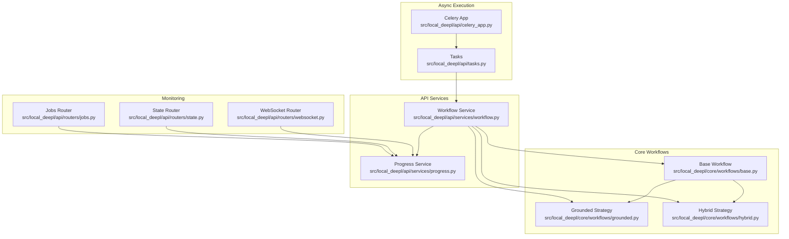
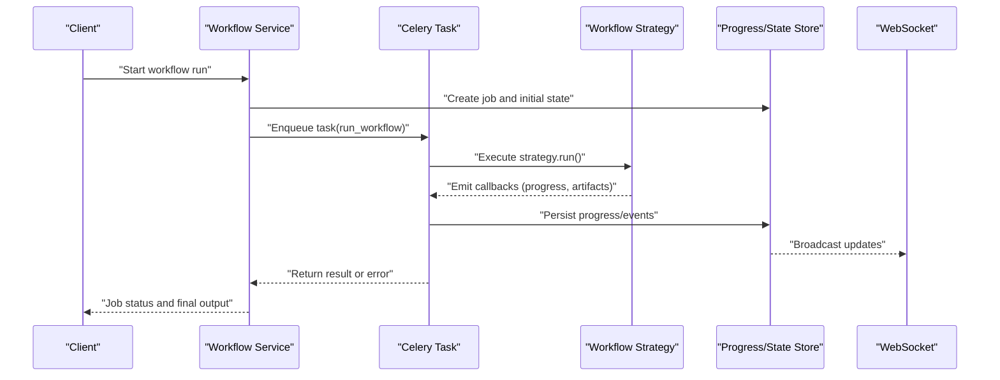
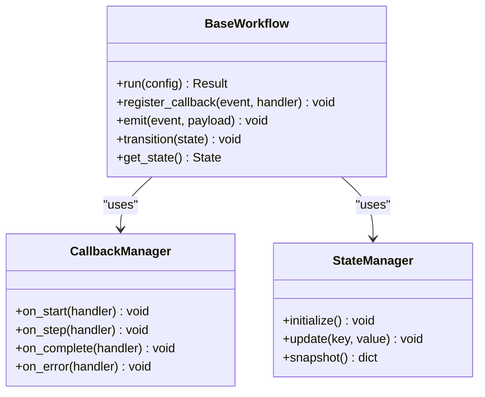
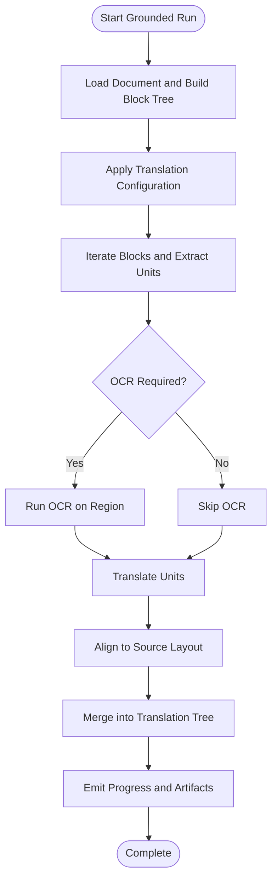
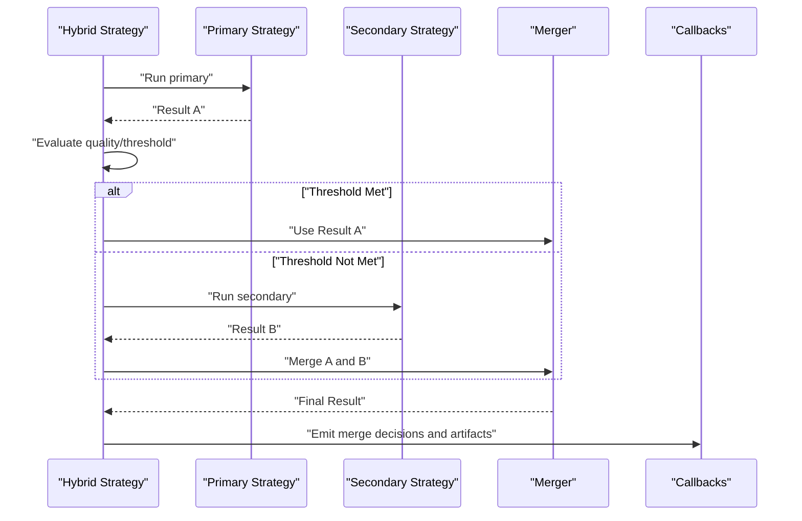
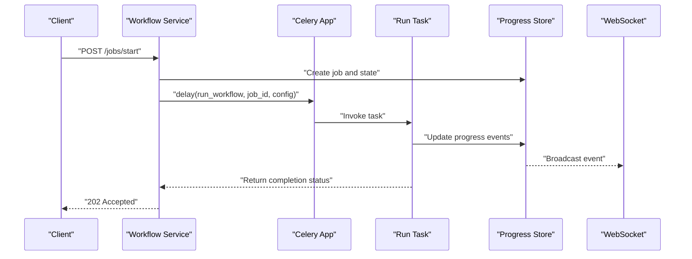
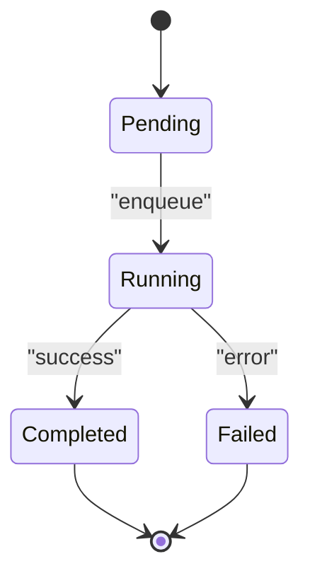
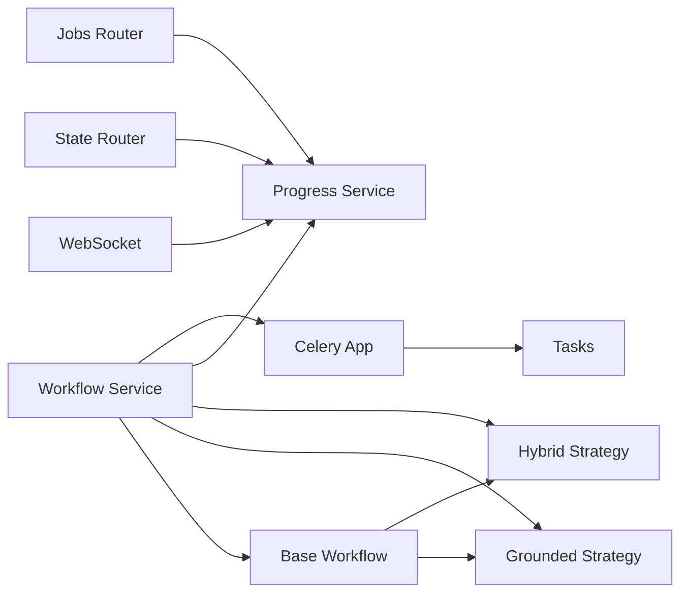

# Workflow Orchestration

<cite>
**Referenced Files in This Document**
- [base.py](file://src/local_deepl/core/workflows/base.py)
- [grounded.py](file://src/local_deepl/core/workflows/grounded.py)
- [hybrid.py](file://src/local_deepl/core/workflows/hybrid.py)
- [callbacks.py](file://src/local_deepl/core/callbacks.py)
- [workflow.py](file://src/local_deepl/api/services/workflow.py)
- [tasks.py](file://src/local_deepl/api/tasks.py)
- [celery_app.py](file://src/local_deepl/api/celery_app.py)
- [progress.py](file://src/local_deepl/api/services/progress.py)
- [websocket.py](file://src/local_deepl/api/routers/websocket.py)
- [state.py](file://src/local_deepl/api/routers/state.py)
- [jobs.py](file://src/local_deepl/api/routers/jobs.py)
- [translation_config.py](file://src/local_deepl/core/translation_config.py)
- [document.py](file://src/local_deepl/core/document.py)
- [block_tree.py](file://src/local_deepl/core/block_tree.py)
- [translation_tree.py](file://src/local_deepl/core/translation_tree.py)
</cite>

## Table of Contents
1. [Introduction](#introduction)
2. [Project Structure](#project-structure)
3. [Core Components](#core-components)
4. [Architecture Overview](#architecture-overview)
5. [Detailed Component Analysis](#detailed-component-analysis)
6. [Dependency Analysis](#dependency-analysis)
7. [Performance Considerations](#performance-considerations)
8. [Troubleshooting Guide](#troubleshooting-guide)
9. [Conclusion](#conclusion)
10. [Appendices](#appendices)

## Introduction
This document explains LocalDeepL’s workflow orchestration system with a focus on:
- The base workflow framework and its composition patterns
- The grounded workflow strategy for spatial-aware processing
- The hybrid workflow that combines multiple strategies
- Callback mechanisms, state management, and monitoring
- Creating custom workflows and strategies
- Handling failures and ensuring robustness
- Performance considerations including parallelization and observability

The goal is to provide both high-level understanding and actionable guidance for extending and operating the workflow system effectively.

## Project Structure
The workflow orchestration spans core logic (strategy implementations), API services (execution and persistence), and real-time monitoring (websockets and progress).

**Diagram sources**
- [base.py](file://src/local_deepl/core/workflows/base.py)
- [grounded.py](file://src/local_deepl/core/workflows/grounded.py)
- [hybrid.py](file://src/local_deepl/core/workflows/hybrid.py)
- [workflow.py](file://src/local_deepl/api/services/workflow.py)
- [progress.py](file://src/local_deepl/api/services/progress.py)
- [celery_app.py](file://src/local_deepl/api/celery_app.py)
- [tasks.py](file://src/local_deepl/api/tasks.py)
- [websocket.py](file://src/local_deepl/api/routers/websocket.py)
- [state.py](file://src/local_deepl/api/routers/state.py)
- [jobs.py](file://src/local_deepl/api/routers/jobs.py)

**Section sources**
- [base.py](file://src/local_deepl/core/workflows/base.py)
- [grounded.py](file://src/local_deepl/core/workflows/grounded.py)
- [hybrid.py](file://src/local_deepl/core/workflows/hybrid.py)
- [workflow.py](file://src/local_deepl/api/services/workflow.py)
- [progress.py](file://src/local_deepl/api/services/progress.py)
- [celery_app.py](file://src/local_deepl/api/celery_app.py)
- [tasks.py](file://src/local_deepl/api/tasks.py)
- [websocket.py](file://src/local_deepl/api/routers/websocket.py)
- [state.py](file://src/local_deepl/api/routers/state.py)
- [jobs.py](file://src/local_deepl/api/routers/jobs.py)

## Core Components
- Base workflow framework: Defines the execution contract, lifecycle hooks, callback dispatching, and state transitions used by all strategies.
- Grounded workflow strategy: Implements spatial-aware processing using block trees and translation trees to preserve layout and alignment during OCR and translation.
- Hybrid workflow strategy: Composes multiple strategies (e.g., grounded plus alternative paths) and merges results while maintaining consistency and traceability.
- Callbacks: Decoupled event-driven hooks for progress, errors, and intermediate artifacts.
- API service layer: Orchestrates workflow runs, persists state, and integrates with async workers.
- Monitoring: Real-time progress updates via websockets and REST endpoints.

Key data models and structures:
- Translation configuration and options
- Document and block tree representations
- Translation tree for structured outputs
- Progress events and job states

**Section sources**
- [base.py](file://src/local_deepl/core/workflows/base.py)
- [grounded.py](file://src/local_deepl/core/workflows/grounded.py)
- [hybrid.py](file://src/local_deepl/core/workflows/hybrid.py)
- [callbacks.py](file://src/local_deepl/core/callbacks.py)
- [translation_config.py](file://src/local_deepl/core/translation_config.py)
- [document.py](file://src/local_deepl/core/document.py)
- [block_tree.py](file://src/local_deepl/core/block_tree.py)
- [translation_tree.py](file://src/local_deepl/core/translation_tree.py)

## Architecture Overview
The orchestration architecture separates concerns across layers:
- Strategy layer: Concrete workflow strategies implement the base contract.
- Service layer: Manages execution context, callbacks, and persistence.
- Worker layer: Celery-based tasks execute long-running steps asynchronously.
- Monitoring layer: WebSockets and REST APIs expose live progress and state.

**Diagram sources**
- [workflow.py](file://src/local_deepl/api/services/workflow.py)
- [tasks.py](file://src/local_deepl/api/tasks.py)
- [celery_app.py](file://src/local_deepl/api/celery_app.py)
- [progress.py](file://src/local_deepl/api/services/progress.py)
- [websocket.py](file://src/local_deepl/api/routers/websocket.py)

## Detailed Component Analysis

### Base Workflow Framework
Responsibilities:
- Define the abstract interface for workflow strategies
- Manage lifecycle hooks (start, step, complete, fail)
- Dispatch callbacks to registered handlers
- Maintain execution state and ensure consistent transitions
- Provide utilities for composing steps and handling errors

Composition patterns:
- Step-based pipelines where each step can be independently retried
- Strategy composition via decorators or wrappers
- Pluggable callbacks for logging, metrics, and side effects

Error handling:
- Centralized exception mapping to user-friendly statuses
- Retry policies per step
- Fallback strategies when configured

**Diagram sources**
- [base.py](file://src/local_deepl/core/workflows/base.py)
- [callbacks.py](file://src/local_deepl/core/callbacks.py)

**Section sources**
- [base.py](file://src/local_deepl/core/workflows/base.py)
- [callbacks.py](file://src/local_deepl/core/callbacks.py)

### Grounded Workflow Strategy
Purpose:
- Perform spatial-aware processing by leveraging block trees and translation trees
- Preserve layout fidelity during OCR and translation
- Align source and target content based on geometric relationships

Key behaviors:
- Parse documents into blocks and compute bounding boxes
- Map translation units to blocks for precise alignment
- Rasterize or process images only when necessary to maintain quality
- Merge aligned outputs back into structured documents

Integration points:
- Uses translation configuration to select engines and parameters
- Emits progress events for each block processed
- Supports fallbacks if OCR fails for specific regions

**Diagram sources**
- [grounded.py](file://src/local_deepl/core/workflows/grounded.py)
- [document.py](file://src/local_deepl/core/document.py)
- [block_tree.py](file://src/local_deepl/core/block_tree.py)
- [translation_tree.py](file://src/local_deepl/core/translation_tree.py)
- [translation_config.py](file://src/local_deepl/core/translation_config.py)

**Section sources**
- [grounded.py](file://src/local_deepl/core/workflows/grounded.py)
- [document.py](file://src/local_deepl/core/document.py)
- [block_tree.py](file://src/local_deepl/core/block_tree.py)
- [translation_tree.py](file://src/local_deepl/core/translation_tree.py)
- [translation_config.py](file://src/local_deepl/core/translation_config.py)

### Hybrid Workflow Strategy
Purpose:
- Combine multiple strategies (e.g., grounded plus an alternative path) to improve robustness and accuracy
- Select best results through scoring or deterministic rules
- Maintain provenance and traceability across merged outputs

Key behaviors:
- Execute primary strategy first; if thresholds are not met, trigger secondary strategy
- Normalize outputs to a common schema before merging
- Record decision logs and reasons for selection
- Support partial success with clear indicators

**Diagram sources**
- [hybrid.py](file://src/local_deepl/core/workflows/hybrid.py)
- [callbacks.py](file://src/local_deepl/core/callbacks.py)

**Section sources**
- [hybrid.py](file://src/local_deepl/core/workflows/hybrid.py)
- [callbacks.py](file://src/local_deepl/core/callbacks.py)

### API Service Layer and Async Execution
Responsibilities:
- Expose endpoints to start, monitor, and retrieve workflow jobs
- Persist job metadata and progress
- Enqueue Celery tasks for long-running operations
- Integrate with WebSocket broadcasting for real-time updates

Execution flow:
- Client calls API to start a workflow
- Service creates job record and emits initial state
- Celery worker executes the chosen strategy
- Worker pushes progress events to the store
- WebSocket clients receive live updates

**Diagram sources**
- [workflow.py](file://src/local_deepl/api/services/workflow.py)
- [celery_app.py](file://src/local_deepl/api/celery_app.py)
- [tasks.py](file://src/local_deepl/api/tasks.py)
- [progress.py](file://src/local_deepl/api/services/progress.py)
- [websocket.py](file://src/local_deepl/api/routers/websocket.py)

**Section sources**
- [workflow.py](file://src/local_deepl/api/services/workflow.py)
- [celery_app.py](file://src/local_deepl/api/celery_app.py)
- [tasks.py](file://src/local_deepl/api/tasks.py)
- [progress.py](file://src/local_deepl/api/services/progress.py)
- [websocket.py](file://src/local_deepl/api/routers/websocket.py)

### Monitoring and State Management
Features:
- Job state tracking with well-defined transitions
- Real-time progress streaming via WebSocket
- REST endpoints to query job details and history
- Event-driven notifications for critical milestones

**Diagram sources**
- [state.py](file://src/local_deepl/api/routers/state.py)
- [jobs.py](file://src/local_deepl/api/routers/jobs.py)
- [progress.py](file://src/local_deepl/api/services/progress.py)

**Section sources**
- [state.py](file://src/local_deepl/api/routers/state.py)
- [jobs.py](file://src/local_deepl/api/routers/jobs.py)
- [progress.py](file://src/local_deepl/api/services/progress.py)

## Dependency Analysis
Relationships between components:
- Strategies depend on base framework and shared data models
- API service depends on strategies, progress store, and async workers
- Monitoring depends on progress store and WebSocket transport

**Diagram sources**
- [base.py](file://src/local_deepl/core/workflows/base.py)
- [grounded.py](file://src/local_deepl/core/workflows/grounded.py)
- [hybrid.py](file://src/local_deepl/core/workflows/hybrid.py)
- [workflow.py](file://src/local_deepl/api/services/workflow.py)
- [progress.py](file://src/local_deepl/api/services/progress.py)
- [celery_app.py](file://src/local_deepl/api/celery_app.py)
- [tasks.py](file://src/local_deepl/api/tasks.py)
- [websocket.py](file://src/local_deepl/api/routers/websocket.py)
- [state.py](file://src/local_deepl/api/routers/state.py)
- [jobs.py](file://src/local_deepl/api/routers/jobs.py)

**Section sources**
- [base.py](file://src/local_deepl/core/workflows/base.py)
- [grounded.py](file://src/local_deepl/core/workflows/grounded.py)
- [hybrid.py](file://src/local_deepl/core/workflows/hybrid.py)
- [workflow.py](file://src/local_deepl/api/services/workflow.py)
- [progress.py](file://src/local_deepl/api/services/progress.py)
- [celery_app.py](file://src/local_deepl/api/celery_app.py)
- [tasks.py](file://src/local_deepl/api/tasks.py)
- [websocket.py](file://src/local_deepl/api/routers/websocket.py)
- [state.py](file://src/local_deepl/api/routers/state.py)
- [jobs.py](file://src/local_deepl/api/routers/jobs.py)

## Performance Considerations
- Parallelization:
  - Use Celery workers to distribute heavy tasks (OCR, translation) across processes
  - Batch blocks where possible to reduce overhead
  - Tune concurrency limits per resource type (CPU-bound vs I/O-bound)
- Memory management:
  - Stream large documents instead of loading entirely into memory
  - Release intermediate artifacts promptly
- Caching:
  - Cache OCR results and translation lookups keyed by region fingerprints
  - Reuse model instances across tasks to avoid cold starts
- Observability:
  - Emit granular progress events to enable fine-grained monitoring
  - Log decision points in hybrid strategy for post-mortem analysis
- Robustness:
  - Implement retries with exponential backoff for transient failures
  - Fail fast on invalid inputs and return actionable errors

[No sources needed since this section provides general guidance]

## Troubleshooting Guide
Common issues and resolutions:
- Workflow stalls:
  - Check job state and recent progress events
  - Inspect worker logs for exceptions
  - Verify Celery broker connectivity and queue health
- Partial failures:
  - Review hybrid strategy logs for threshold evaluations
  - Validate input document integrity and block parsing
- Memory pressure:
  - Reduce batch sizes and increase worker count cautiously
  - Monitor peak memory usage and adjust pool settings
- WebSocket disconnects:
  - Ensure proper reconnection logic on client side
  - Confirm server-side broadcast pipeline is active

Operational checks:
- Confirm progress store is writable and accessible
- Validate WebSocket router is mounted and authenticated if required
- Ensure job IDs are unique and persisted consistently

**Section sources**
- [progress.py](file://src/local_deepl/api/services/progress.py)
- [websocket.py](file://src/local_deepl/api/routers/websocket.py)
- [jobs.py](file://src/local_deepl/api/routers/jobs.py)
- [state.py](file://src/local_deepl/api/routers/state.py)

## Conclusion
LocalDeepL’s workflow orchestration provides a flexible, extensible foundation for document processing:
- The base framework standardizes lifecycle and callbacks
- Grounded strategy ensures spatial fidelity
- Hybrid strategy improves resilience and quality
- API services and monitoring deliver production-grade operation
Adopting the patterns described here enables building custom strategies, scaling efficiently, and maintaining visibility into complex processing pipelines.

[No sources needed since this section summarizes without analyzing specific files]

## Appendices

### Creating Custom Workflows
Steps:
- Subclass the base workflow and implement the run method
- Register callbacks for progress and errors
- Compose steps with retry and fallback policies
- Emit structured events for monitoring

Implementation references:
- Base workflow contract and lifecycle hooks
- Callback registration and emission
- Strategy-specific integration points

**Section sources**
- [base.py](file://src/local_deepl/core/workflows/base.py)
- [callbacks.py](file://src/local_deepl/core/callbacks.py)

### Implementing Workflow Strategies
Guidelines:
- Follow the base interface and use shared data models
- Leverage block trees and translation trees for structure
- Emit detailed progress events at meaningful checkpoints
- Handle errors gracefully and report actionable diagnostics

References:
- Grounded strategy implementation patterns
- Hybrid strategy composition and merging

**Section sources**
- [grounded.py](file://src/local_deepl/core/workflows/grounded.py)
- [hybrid.py](file://src/local_deepl/core/workflows/hybrid.py)

### Handling Workflow Failures
Best practices:
- Distinguish transient vs permanent failures
- Apply retries with bounded attempts and backoff
- Capture diagnostic artifacts for failed runs
- Surface user-friendly messages and recovery steps

References:
- Error handling in base framework
- Progress and state transitions on failure

**Section sources**
- [base.py](file://src/local_deepl/core/workflows/base.py)
- [progress.py](file://src/local_deepl/api/services/progress.py)
- [state.py](file://src/local_deepl/api/routers/state.py)