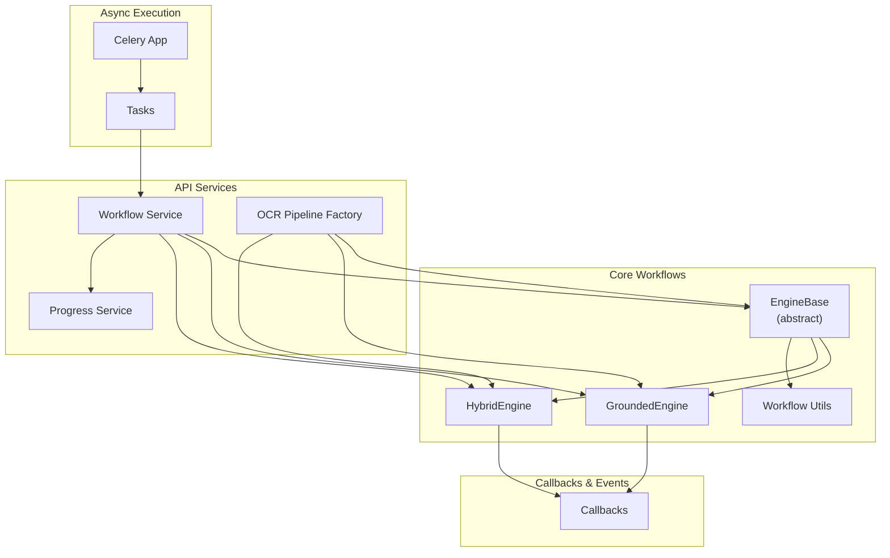
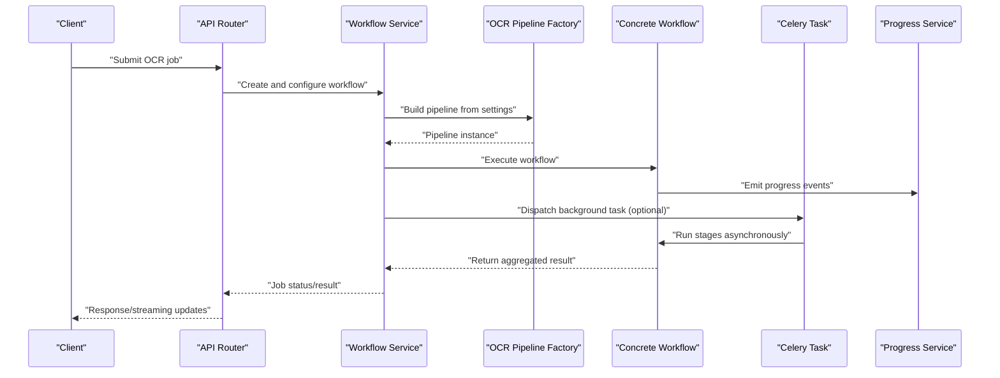
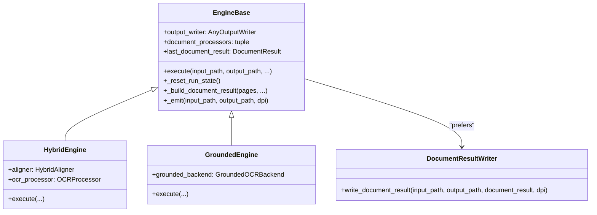
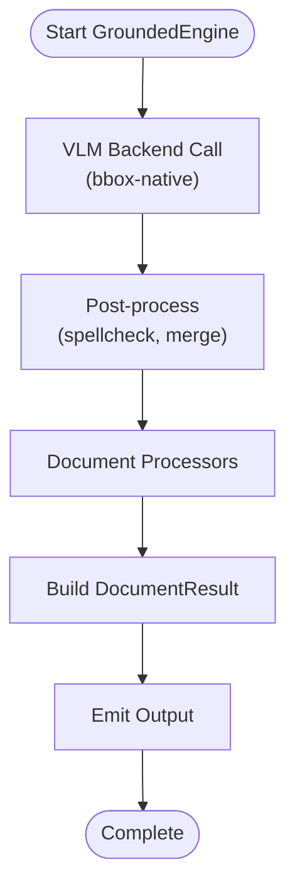
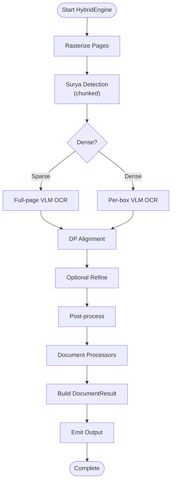
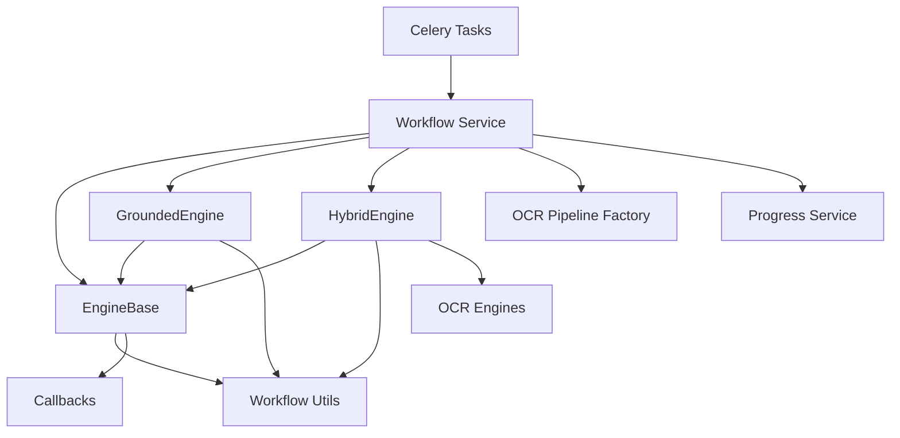

# Workflow System and Orchestration

<cite>
**Referenced Files in This Document**
- [base.py](file://src/local_deepl/core/workflows/base.py)
- [grounded.py](file://src/local_deepl/core/workflows/grounded.py)
- [hybrid.py](file://src/local_deepl/core/workflows/hybrid.py)
- [utils.py](file://src/local_deepl/core/workflows/utils.py)
- [callbacks.py](file://src/local_deepl/core/callbacks.py)
- [celery_app.py](file://src/local_deepl/api/celery_app.py)
- [tasks.py](file://src/local_deepl/api/tasks.py)
- [workflow.py](file://src/local_deepl/api/services/workflow.py)
- [ocr_pipeline_factory.py](file://src/local_deepl/api/services/ocr_pipeline_factory.py)
- [progress.py](file://src/local_deepl/api/services/progress.py)
- [test_workflows_base.py](file://tests/test_workflows_base.py)
- [test_workflows_grounded.py](file://tests/test_workflows_grounded.py)
- [test_workflows_hybrid.py](file://tests/test_workflows_hybrid.py)
</cite>

## Table of Contents
1. [Introduction](#introduction)
2. [Project Structure](#project-structure)
3. [Core Components](#core-components)
4. [Architecture Overview](#architecture-overview)
5. [Detailed Component Analysis](#detailed-component-analysis)
6. [Dependency Analysis](#dependency-analysis)
7. [Performance Considerations](#performance-considerations)
8. [Troubleshooting Guide](#troubleshooting-guide)
9. [Conclusion](#conclusion)
10. [Appendices](#appendices)

## Introduction
This document explains the workflow system and orchestration layer that drives OCR processing across multiple strategies. It covers:
- The base workflow architecture, including abstract base classes, lifecycle management, and execution patterns
- The grounded OCR workflow with layout-preserving processing strategies
- The hybrid workflow combining multiple OCR approaches
- Composition patterns, parameter passing, and result aggregation
- Callback mechanisms for progress tracking and error handling
- Integration with Celery for asynchronous task execution
- Performance optimization techniques and debugging guidance

The goal is to make the system approachable for beginners while providing sufficient technical depth for experienced developers extending or customizing workflows.

## Project Structure
The workflow system lives under src/local_deepl/core/workflows and integrates with API services and Celery tasks. Key files include:
- Base workflow abstraction and utilities
- Concrete implementations: grounded and hybrid
- Callbacks for progress and events
- Celery app and tasks for async orchestration
- API service layer wiring workflows into HTTP endpoints

**Diagram sources**
- [base.py](file://src/local_deepl/core/workflows/base.py)
- [grounded.py](file://src/local_deepl/core/workflows/grounded.py)
- [hybrid.py](file://src/local_deepl/core/workflows/hybrid.py)
- [utils.py](file://src/local_deepl/core/workflows/utils.py)
- [callbacks.py](file://src/local_deepl/core/callbacks.py)
- [workflow.py](file://src/local_deepl/api/services/workflow.py)
- [ocr_pipeline_factory.py](file://src/local_deepl/api/services/ocr_pipeline_factory.py)
- [progress.py](file://src/local_deepl/api/services/progress.py)
- [celery_app.py](file://src/local_deepl/api/celery_app.py)
- [tasks.py](file://src/local_deepl/api/tasks.py)

**Section sources**
- [base.py](file://src/local_deepl/core/workflows/base.py)
- [grounded.py](file://src/local_deepl/core/workflows/grounded.py)
- [hybrid.py](file://src/local_deepl/core/workflows/hybrid.py)
- [utils.py](file://src/local_deepl/core/workflows/utils.py)
- [callbacks.py](file://src/local_deepl/core/callbacks.py)
- [workflow.py](file://src/local_deepl/api/services/workflow.py)
- [ocr_pipeline_factory.py](file://src/local_deepl/api/services/ocr_pipeline_factory.py)
- [progress.py](file://src/local_deepl/api/services/progress.py)
- [celery_app.py](file://src/local_deepl/api/celery_app.py)
- [tasks.py](file://src/local_deepl/api/tasks.py)

## Core Components
- EngineBase: Abstract foundation defining lifecycle hooks, execution pattern, output writing, and callback integration points.
- GroundedEngine: Layout-preserving OCR strategy using a bbox-native VLM backend (skips Surya detection and DP alignment).
- HybridEngine: Orchestrates Surya detection → VLM OCR → DP alignment → optional refine → post-process → output.
- Callbacks: Event-driven hooks for progress updates, warnings, and errors.
- Workflow Service: API-facing orchestrator that composes workflows and manages state.
- OCR Pipeline Factory: Creates configured pipeline instances based on settings.
- Progress Service: Tracks and exposes job progress via APIs/websockets.
- Celery App and Tasks: Asynchronous execution backbone for long-running workflows.

Key responsibilities:
- Lifecycle: initialization, pre-processing, core execution, post-processing, cleanup
- Execution patterns: sequential stages, parallel fan-out/fan-in, conditional branching
- Parameter passing: configuration objects, context dictionaries, and typed inputs
- Result aggregation: merging outputs, conflict resolution, confidence scoring
- Error handling: retries, fallbacks, graceful degradation, detailed diagnostics

**Section sources**
- [base.py](file://src/local_deepl/core/workflows/base.py)
- [grounded.py](file://src/local_deepl/core/workflows/grounded.py)
- [hybrid.py](file://src/local_deepl/core/workflows/hybrid.py)
- [callbacks.py](file://src/local_deepl/core/callbacks.py)
- [workflow.py](file://src/local_deepl/api/services/workflow.py)
- [ocr_pipeline_factory.py](file://src/local_deepl/api/services/ocr_pipeline_factory.py)
- [progress.py](file://src/local_deepl/api/services/progress.py)

## Architecture Overview
The workflow system follows a layered architecture:
- API layer exposes endpoints that delegate to the Workflow Service
- Workflow Service composes concrete workflows and coordinates callbacks and progress
- Concrete workflows implement specific OCR strategies
- Celery executes long-running tasks asynchronously
- Progress service provides real-time status updates

**Diagram sources**
- [workflow.py](file://src/local_deepl/api/services/workflow.py)
- [ocr_pipeline_factory.py](file://src/local_deepl/api/services/ocr_pipeline_factory.py)
- [celery_app.py](file://src/local_deepl/api/celery_app.py)
- [tasks.py](file://src/local_deepl/api/tasks.py)
- [progress.py](file://src/local_deepl/api/services/progress.py)

## Detailed Component Analysis

### EngineBase: Abstract Foundation
EngineBase defines the contract and lifecycle for all engines:
- Initialization: accepts output_writer, document_processors, and optional block_callbacks
- Run-scoped state: `last_document_result`, `last_failed_pages` reset at the top of every `execute` call
- Text-only post-processing helpers: `_cross_page_merge`, `_run_spellcheck`
- The post-process → assemble → emit pipeline: `_build_document_result` and `_emit`
- Output writing: supports both a legacy 4-arg callable (`OutputWriter`) and the rich `DocumentResultWriter` protocol
- Callback integration: `ProgressCallback`, `WarningCallback`, and `BlockCallbackSet`

**Diagram sources**
- [base.py](file://src/local_deepl/core/workflows/base.py)

**Section sources**
- [base.py](file://src/local_deepl/core/workflows/base.py)

### GroundedEngine: Bbox-Native VLM OCR
GroundedEngine implements a single-call VLM OCR strategy:
- Backend call: sends the full document image to a bbox-native VLM backend
- No Surya detection, no DP alignment, no refine — the model returns (bbox, text) pairs directly
- Post-processing: spellcheck, cross-page merge, confidence estimation
- Output: structured content with preserved layout metadata via `_build_document_result` and `_emit`

It uses callbacks to report per-page progress and intermediate artifacts.

**Diagram sources**
- [grounded.py](file://src/local_deepl/core/workflows/grounded.py)

**Section sources**
- [grounded.py](file://src/local_deepl/core/workflows/grounded.py)

### HybridEngine: Surya Detection + VLM OCR + DP Alignment
HybridEngine implements the default multi-stage OCR pipeline:
- Rasterization: converts PDF pages to images via `PDFHandler`
- Detection: Surya layout detection identifies text regions (chunked by `DETECT_CHUNK_SIZE`)
- OCR: VLM-based OCR via `OCRProcessor` (full-page for sparse, per-box for dense)
- Alignment: DP alignment maps OCR text to detected boxes via `HybridAligner`
- Refine: optional second-pass OCR on low-confidence boxes
- Dense mode: `dense_mode="auto"` switches to per-box OCR when box count exceeds `dense_threshold`
- Post-processing: spellcheck, cross-page merge, confidence estimation
- Document processors: optional `DocumentProcessor` pipeline (reading_order, quality, structure, section, layout, table)
- Output: `_build_document_result` → `_emit` via `AnyOutputWriter`

It leverages EngineBase's shared post-process and emit machinery.

**Diagram sources**
- [hybrid.py](file://src/local_deepl/core/workflows/hybrid.py)

**Section sources**
- [hybrid.py](file://src/local_deepl/core/workflows/hybrid.py)

### Callbacks and Progress Tracking
Callbacks provide event-driven communication between workflows and observers:
- Progress events: percentage complete, current stage, item counts
- Warning events: non-fatal issues, degraded performance indicators
- Error events: exceptions, retry attempts, failure reasons
- Completion events: final result, summary metrics, artifacts

The Progress Service exposes these events via APIs and websockets for real-time UI updates.

**Section sources**
- [callbacks.py](file://src/local_deepl/core/callbacks.py)
- [progress.py](file://src/local_deepl/api/services/progress.py)

### Workflow Service and API Integration
The Workflow Service acts as the central coordinator:
- Receives requests from API routers
- Configures workflows using OCR Pipeline Factory
- Manages job state and lifecycle
- Integrates with Celery for async execution
- Streams progress updates via Progress Service

It ensures consistent error handling, logging, and response formatting.

**Section sources**
- [workflow.py](file://src/local_deepl/api/services/workflow.py)
- [ocr_pipeline_factory.py](file://src/local_deepl/api/services/ocr_pipeline_factory.py)

### Celery Integration and Async Execution
Celery enables background processing of long-running workflows:
- Celery App configures workers and brokers
- Tasks wrap workflow execution with retry logic and monitoring
- Results are stored and polled by clients
- Health checks and worker management ensure reliability

This decouples API responsiveness from processing time.

**Section sources**
- [celery_app.py](file://src/local_deepl/api/celery_app.py)
- [tasks.py](file://src/local_deepl/api/tasks.py)

## Dependency Analysis
Workflows depend on shared utilities, callbacks, and external OCR engines. The dependency graph shows clear separation of concerns and minimal coupling.

**Diagram sources**
- [base.py](file://src/local_deepl/core/workflows/base.py)
- [grounded.py](file://src/local_deepl/core/workflows/grounded.py)
- [hybrid.py](file://src/local_deepl/core/workflows/hybrid.py)
- [utils.py](file://src/local_deepl/core/workflows/utils.py)
- [callbacks.py](file://src/local_deepl/core/callbacks.py)
- [workflow.py](file://src/local_deepl/api/services/workflow.py)
- [ocr_pipeline_factory.py](file://src/local_deepl/api/services/ocr_pipeline_factory.py)
- [progress.py](file://src/local_deepl/api/services/progress.py)
- [celery_app.py](file://src/local_deepl/api/celery_app.py)
- [tasks.py](file://src/local_deepl/api/tasks.py)

**Section sources**
- [base.py](file://src/local_deepl/core/workflows/base.py)
- [grounded.py](file://src/local_deepl/core/workflows/grounded.py)
- [hybrid.py](file://src/local_deepl/core/workflows/hybrid.py)
- [utils.py](file://src/local_deepl/core/workflows/utils.py)
- [callbacks.py](file://src/local_deepl/core/callbacks.py)
- [workflow.py](file://src/local_deepl/api/services/workflow.py)
- [ocr_pipeline_factory.py](file://src/local_deepl/api/services/ocr_pipeline_factory.py)
- [progress.py](file://src/local_deepl/api/services/progress.py)
- [celery_app.py](file://src/local_deepl/api/celery_app.py)
- [tasks.py](file://src/local_deepl/api/tasks.py)

## Performance Considerations
- Parallelism: Use fan-out/fan-in patterns in HybridEngine to run independent strategies concurrently
- Caching: Cache intermediate results like rasterized pages and parsed blocks
- Memory management: Stream large documents page-by-page to avoid memory spikes
- Resource limits: Configure OCR engine timeouts and concurrency limits
- Profiling: Monitor CPU and memory usage during long runs
- Batch processing: Group small jobs to amortize overhead
- Lazy loading: Defer expensive operations until needed

[No sources needed since this section provides general guidance]

## Troubleshooting Guide
Common issues and resolutions:
- Callbacks not firing: Verify callback registration and event emission points
- Progress stalls: Check worker health and queue backlog
- Low OCR confidence: Inspect input quality and try alternative strategies
- Memory errors: Reduce batch size or enable streaming mode
- Celery failures: Review task logs and retry policies
- Inconsistent results: Enable diagnostics and compare per-strategy outputs

Use test suites to validate behavior:
- Base workflow tests verify lifecycle and callback integration
- Grounded workflow tests check layout preservation and parsing accuracy
- Hybrid workflow tests validate strategy selection and aggregation logic

**Section sources**
- [test_workflows_base.py](file://tests/test_workflows_base.py)
- [test_workflows_grounded.py](file://tests/test_workflows_grounded.py)
- [test_workflows_hybrid.py](file://tests/test_workflows_hybrid.py)

## Conclusion
The workflow system provides a robust, extensible foundation for OCR processing. By separating concerns through abstract base classes, leveraging callbacks for observability, and integrating with Celery for scalability, it supports both simple and complex use cases. Developers can extend the system by implementing new strategies, composing workflows, and customizing execution patterns while maintaining consistency and reliability.

[No sources needed since this section summarizes without analyzing specific files]

## Appendices

### Example: Workflow Instantiation and Configuration
- Instantiate EngineBase subclass (HybridEngine or GroundedEngine) with injected components
- Register callbacks for progress and error handling
- Execute workflow synchronously or dispatch to Celery for async processing
- Monitor progress via Progress Service endpoints

### Example: Custom Workflow Development
- Extend EngineBase and implement the `execute` method
- Define custom stages and execution logic
- Integrate with existing callbacks and progress tracking
- Test thoroughly using provided test utilities

### Example: Parameter Passing Mechanisms
- Use configuration objects for static settings
- Pass runtime parameters via context dictionaries
- Validate inputs early in preprocessing phase
- Propagate parameters through stages consistently

### Example: Result Aggregation Strategies
- Merge outputs using confidence-weighted voting
- Resolve conflicts with priority rules or human review flags
- Preserve metadata and provenance information
- Generate unified schema for downstream consumption

[No sources needed since this section provides conceptual guidance]