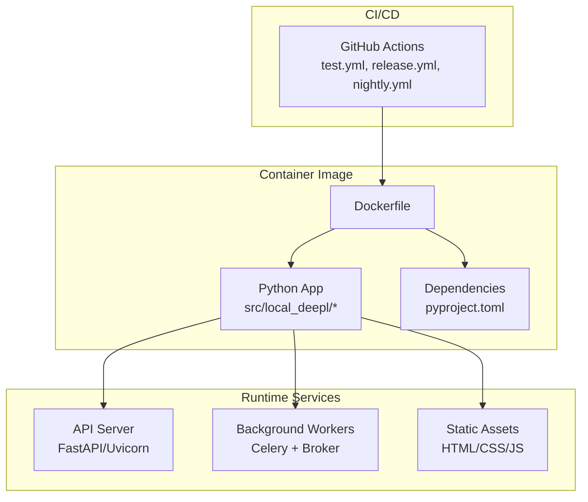
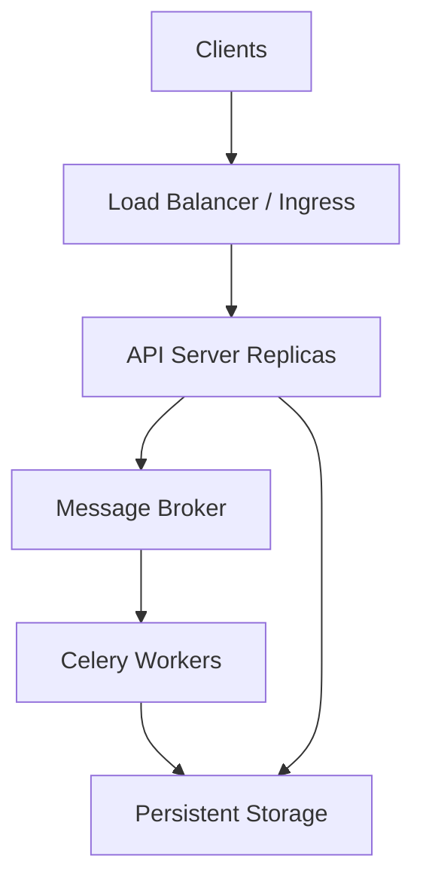
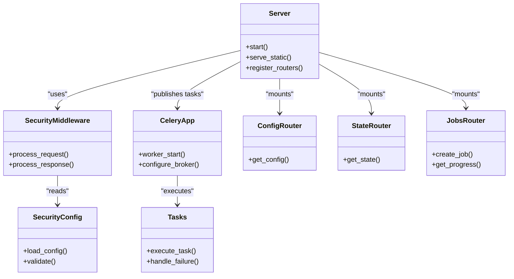
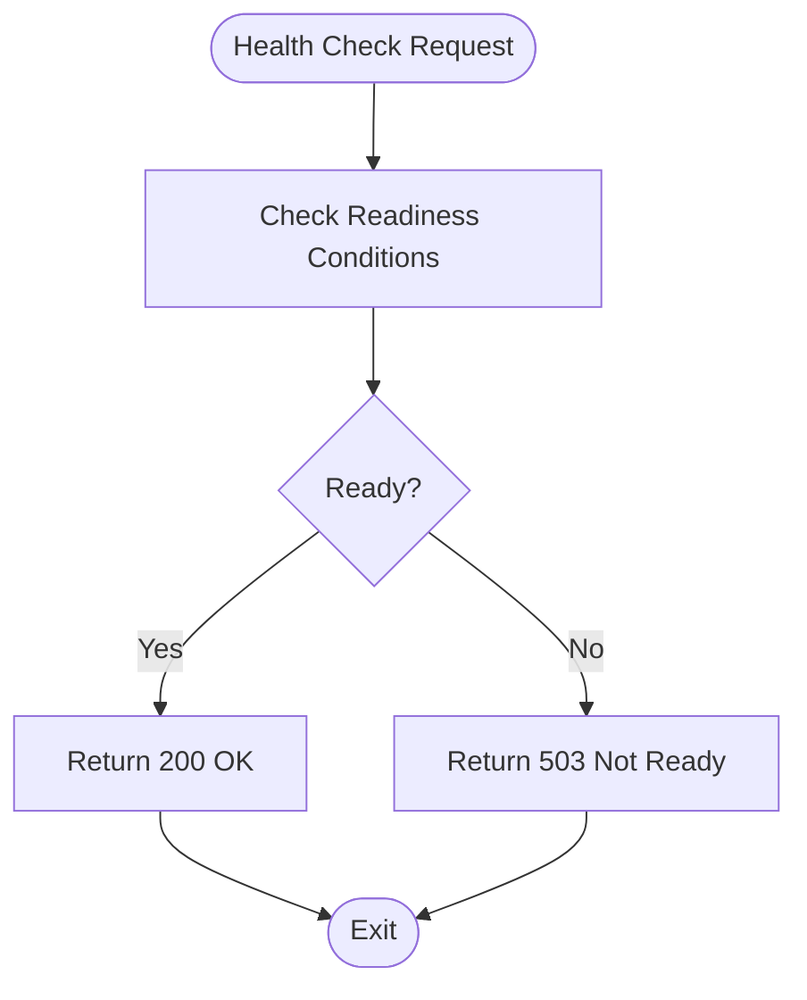

# Deployment & Operations

<cite>
**Referenced Files in This Document**
- [Dockerfile](file://Dockerfile)
- [compose.yaml](file://compose.yaml)
- [pyproject.toml](file://pyproject.toml)
- [src/local_deepl/server.py](file://src/local_deepl/server.py)
- [src/local_deepl/api/celery_app.py](file://src/local_deepl/api/celery_app.py)
- [src/local_deepl/api/tasks.py](file://src/local_deepl/api/tasks.py)
- [src/local_deepl/api/services/security_middleware.py](file://src/local_deepl/api/services/security_middleware.py)
- [src/local_deepl/api/services/security_config.py](file://src/local_deepl/api/services/security_config.py)
- [src/local_deepl/api/routers/config.py](file://src/local_deepl/api/routers/config.py)
- [src/local_deepl/api/routers/state.py](file://src/local_deepl/api/routers/state.py)
- [src/local_deepl/api/routers/jobs.py](file://src/local_deepl/api/routers/jobs.py)
- [.github/workflows/test.yml](file://.github/workflows/test.yml)
- [.github/workflows/release.yml](file://.github/workflows/release.yml)
- [.github/workflows/nightly.yml](file://.github/workflows/nightly.yml)
</cite>

## Table of Contents
1. [Introduction](#introduction)
2. [Project Structure](#project-structure)
3. [Core Components](#core-components)
4. [Architecture Overview](#architecture-overview)
5. [Detailed Component Analysis](#detailed-component-analysis)
6. [Dependency Analysis](#dependency-analysis)
7. [Performance Considerations](#performance-considerations)
8. [Troubleshooting Guide](#troubleshooting-guide)
9. [Conclusion](#conclusion)
10. [Appendices](#appendices)

## Introduction
This document provides production-focused deployment and operational guidance for LocalDeepL. It covers containerization with Docker, Kubernetes deployment patterns, cloud platform integration, scaling strategies for API servers and background workers, load balancing, health checks, monitoring and observability (logging, metrics, alerting), environment configuration, backup and disaster recovery, performance tuning, CI/CD pipelines, automated testing, and release management. The content is grounded in the repository’s existing artifacts such as the Dockerfile, Compose file, application server entrypoint, Celery worker setup, security middleware, and GitHub Actions workflows.

## Project Structure
LocalDeepL follows a modular Python application layout:
- Application server and routers under src/local_deepl
- Background tasks via Celery under src/local_deepl/api
- Security middleware and configuration under src/local_deepl/api/services
- Containerization artifacts at the repository root (Dockerfile, compose.yaml)
- CI/CD workflows under .github/workflows

**Diagram sources**
- [Dockerfile](file://Dockerfile)
- [compose.yaml](file://compose.yaml)
- [pyproject.toml](file://pyproject.toml)
- [src/local_deepl/server.py](file://src/local_deepl/server.py)
- [src/local_deepl/api/celery_app.py](file://src/local_deepl/api/celery_app.py)
- [src/local_deepl/api/tasks.py](file://src/local_deepl/api/tasks.py)
- [.github/workflows/test.yml](file://.github/workflows/test.yml)
- [.github/workflows/release.yml](file://.github/workflows/release.yml)
- [.github/workflows/nightly.yml](file://.github/workflows/nightly.yml)

**Section sources**
- [Dockerfile](file://Dockerfile)
- [compose.yaml](file://compose.yaml)
- [pyproject.toml](file://pyproject.toml)
- [src/local_deepl/server.py](file://src/local_deepl/server.py)
- [src/local_deepl/api/celery_app.py](file://src/local_deepl/api/celery_app.py)
- [src/local_deepl/api/tasks.py](file://src/local_deepl/api/tasks.py)
- [.github/workflows/test.yml](file://.github/workflows/test.yml)
- [.github/workflows/release.yml](file://.github/workflows/release.yml)
- [.github/workflows/nightly.yml](file://.github/workflows/nightly.yml)

## Core Components
- API Server: FastAPI-based HTTP service exposing translation, OCR, jobs, and state endpoints. Serves static assets and integrates security middleware.
- Background Workers: Celery workers consuming long-running or CPU-bound tasks offloaded from the API.
- Security Middleware: Request/response processing for authentication, authorization, and request validation.
- Configuration Router: Exposes runtime configuration endpoints to clients.
- State Router: Provides process-level and job-related state information.
- Jobs Router: Manages job lifecycle and progress tracking.

Operational implications:
- API server should be horizontally scaled behind a load balancer.
- Workers should be independently scaled based on queue depth and task duration.
- Health and readiness probes must target appropriate endpoints.
- Logging and metrics should be emitted by both API and workers.

**Section sources**
- [src/local_deepl/server.py](file://src/local_deepl/server.py)
- [src/local_deepl/api/celery_app.py](file://src/local_deepl/api/celery_app.py)
- [src/local_deepl/api/tasks.py](file://src/local_deepl/api/tasks.py)
- [src/local_deepl/api/services/security_middleware.py](file://src/local_deepl/api/services/security_middleware.py)
- [src/local_deepl/api/services/security_config.py](file://src/local_deepl/api/services/security_config.py)
- [src/local_deepl/api/routers/config.py](file://src/local_deepl/api/routers/config.py)
- [src/local_deepl/api/routers/state.py](file://src/local_deepl/api/routers/state.py)
- [src/local_deepl/api/routers/jobs.py](file://src/local_deepl/api/routers/jobs.py)

## Architecture Overview
The system consists of an API server, one or more Celery workers, and optional shared storage/broker services. In production, the API server runs behind a reverse proxy/load balancer that terminates TLS and routes traffic to multiple replicas. Workers consume tasks asynchronously and may write results to persistent storage.

[No sources needed since this diagram shows conceptual workflow, not actual code structure]

## Detailed Component Analysis

### Containerization with Docker
- Build context includes the Python application and dependencies defined in pyproject.toml.
- The image should expose the API port(s) used by the server and serve static files.
- Recommended practices:
  - Use a minimal base image and pin versions.
  - Install only production dependencies.
  - Run as non-root user where possible.
  - Set environment variables for configuration and secrets via runtime injection.

Operational notes:
- Ensure the container exposes the correct ports and health endpoints.
- Configure resource limits in orchestration layers.
- Use multi-stage builds if applicable to reduce image size.

**Section sources**
- [Dockerfile](file://Dockerfile)
- [pyproject.toml](file://pyproject.toml)

### Kubernetes Deployment Patterns
- Deployments:
  - API server Deployment with horizontal pod autoscaling (HPA) targeting CPU/memory or custom metrics.
  - Worker Deployment with HPA driven by queue length or custom metrics.
- Services:
  - ClusterIP Service for internal access; NodePort/LoadBalancer or Ingress for external access.
- ConfigMaps and Secrets:
  - Store configuration and credentials separately from images.
- Probes:
  - Liveness and readiness probes pointing to lightweight endpoints.
- Resource Management:
  - Requests and limits sized according to workload characteristics.
- Storage:
  - PersistentVolumeClaims for artifacts and logs if required.

Health check strategy:
- Readiness probe verifies dependency availability and warm-up completion.
- Liveness probe ensures the process remains responsive.

Scaling considerations:
- Scale API replicas based on request rate and latency.
- Scale workers based on queue depth and task throughput.

**Section sources**
- [src/local_deepl/server.py](file://src/local_deepl/server.py)
- [src/local_deepl/api/celery_app.py](file://src/local_deepl/api/celery_app.py)
- [src/local_deepl/api/tasks.py](file://src/local_deepl/api/tasks.py)

### Cloud Platform Integration
- Managed Kubernetes (GKE/EKS/AKS):
  - Use managed Ingress controllers and auto-scalers.
  - Integrate with cloud logging/metrics collectors.
- Serverless Containers (Cloud Run, Azure Container Apps):
  - Configure concurrency, CPU/memory, and autoscaling thresholds.
  - Mount secrets and config via platform-native mechanisms.
- Object Storage:
  - Persist artifacts and outputs using cloud object stores.
- Message Broker:
  - Use managed brokers (e.g., Redis, RabbitMQ) for reliability and HA.

Security:
- Enforce least privilege IAM roles.
- Use secret managers and avoid embedding credentials in images.

**Section sources**
- [src/local_deepl/server.py](file://src/local_deepl/server.py)
- [src/local_deepl/api/celery_app.py](file://src/local_deepl/api/celery_app.py)
- [src/local_deepl/api/tasks.py](file://src/local_deepl/api/tasks.py)

### Scaling Strategies
- API Servers:
  - Horizontal scaling behind a load balancer.
  - Tune concurrency settings and worker threads per replica.
  - Use connection pooling for downstream services.
- Background Workers:
  - Separate queues for different task types.
  - Autoscale based on queue depth or custom metrics.
  - Implement graceful shutdown and idempotent retries.

Load balancing:
- Layer 7 routing with path-based rules for API endpoints.
- Sticky sessions are generally unnecessary for stateless APIs.

Health checks:
- Lightweight endpoint returning 200 OK when ready.
- Dependency-aware readiness checks (e.g., broker connectivity).

**Section sources**
- [src/local_deepl/server.py](file://src/local_deepl/server.py)
- [src/local_deepl/api/celery_app.py](file://src/local_deepl/api/celery_app.py)
- [src/local_deepl/api/tasks.py](file://src/local_deepl/api/tasks.py)

### Monitoring and Observability
- Logging:
  - Structured JSON logs with correlation IDs.
  - Centralized log aggregation (e.g., Loki, CloudWatch, Stackdriver).
- Metrics:
  - Export Prometheus-compatible metrics for request rates, latencies, error rates, queue lengths, and worker utilization.
- Tracing:
  - Distributed tracing across API and workers for end-to-end visibility.
- Alerting:
  - Alerts on high error rates, latency SLO breaches, queue backlogs, and worker failures.

Implementation tips:
- Instrument API endpoints with standard metrics.
- Emit worker-specific metrics (tasks processed, retry counts).
- Ensure logs include contextual data without sensitive information.

**Section sources**
- [src/local_deepl/server.py](file://src/local_deepl/server.py)
- [src/local_deepl/api/celery_app.py](file://src/local_deepl/api/celery_app.py)
- [src/local_deepl/api/tasks.py](file://src/local_deepl/api/tasks.py)

### Configuration Examples by Environment
- Development:
  - Minimal resources, verbose logging, local broker/storage.
- Staging:
  - Production-like topology with smaller scale, feature flags enabled.
- Production:
  - High availability, strict security, robust monitoring, autoscaling.

Configuration management:
- Use environment variables and ConfigMaps/Secrets.
- Avoid hardcoding secrets in images.
- Validate configuration at startup and fail fast on invalid values.

**Section sources**
- [src/local_deepl/api/services/security_config.py](file://src/local_deepl/api/services/security_config.py)
- [src/local_deepl/api/routers/config.py](file://src/local_deepl/api/routers/config.py)

### Backup and Disaster Recovery
- Data Backups:
  - Periodic snapshots of persistent volumes and object storage buckets.
  - Versioned backups with retention policies.
- Broker and State:
  - Enable persistence and replication for message brokers.
  - Regularly test restore procedures.
- RTO/RPO:
  - Define recovery time objectives and recovery point objectives.
  - Automate failover and rehydration of state.

**Section sources**
- [src/local_deepl/api/tasks.py](file://src/local_deepl/api/tasks.py)

### Performance Tuning Guidelines
- API Server:
  - Adjust concurrency and worker processes based on CPU and memory profiles.
  - Enable keep-alive and tune timeouts.
- Workers:
  - Parallelism tuned to task I/O vs CPU bound nature.
  - Batch processing where feasible.
- Dependencies:
  - Connection pooling and caching for downstream services.
  - Offload heavy computations to specialized workers.

**Section sources**
- [src/local_deepl/server.py](file://src/local_deepl/server.py)
- [src/local_deepl/api/celery_app.py](file://src/local_deepl/api/celery_app.py)
- [src/local_deepl/api/tasks.py](file://src/local_deepl/api/tasks.py)

### CI/CD Pipeline Configuration
- Automated Testing:
  - Unit tests, integration tests, and security scans on pull requests.
- Build Artifacts:
  - Build container images with pinned dependencies and SBOM generation.
- Release Management:
  - Tagged releases with changelog generation.
  - Promote artifacts through environments with approvals.

Quality gates:
- Code linting, type checking, and vulnerability scanning.
- Test coverage thresholds and artifact signing.

**Section sources**
- [.github/workflows/test.yml](file://.github/workflows/test.yml)
- [.github/workflows/release.yml](file://.github/workflows/release.yml)
- [.github/workflows/nightly.yml](file://.github/workflows/nightly.yml)

### Automated Testing Strategy
- Unit Tests:
  - Isolated tests for core logic and utilities.
- Integration Tests:
  - End-to-end flows against ephemeral services.
- Regression and Nightly Runs:
  - Extended suites and performance regressions.

Test data:
- Use fixtures and deterministic inputs.
- Mock external dependencies where appropriate.

**Section sources**
- [.github/workflows/test.yml](file://.github/workflows/test.yml)
- [.github/workflows/nightly.yml](file://.github/workflows/nightly.yml)

### Release Management Processes
- Versioning:
  - Semantic versioning with tags.
- Changelogs:
  - Auto-generated from commit messages or PR descriptions.
- Rollbacks:
  - Immutable artifacts and quick rollback procedures.
- Canary Releases:
  - Gradual rollout with monitoring and automatic rollback on anomalies.

**Section sources**
- [.github/workflows/release.yml](file://.github/workflows/release.yml)

## Dependency Analysis
The following diagram maps key runtime components and their relationships within the application.

**Diagram sources**
- [src/local_deepl/server.py](file://src/local_deepl/server.py)
- [src/local_deepl/api/services/security_middleware.py](file://src/local_deepl/api/services/security_middleware.py)
- [src/local_deepl/api/services/security_config.py](file://src/local_deepl/api/services/security_config.py)
- [src/local_deepl/api/celery_app.py](file://src/local_deepl/api/celery_app.py)
- [src/local_deepl/api/tasks.py](file://src/local_deepl/api/tasks.py)
- [src/local_deepl/api/routers/config.py](file://src/local_deepl/api/routers/config.py)
- [src/local_deepl/api/routers/state.py](file://src/local_deepl/api/routers/state.py)
- [src/local_deepl/api/routers/jobs.py](file://src/local_deepl/api/routers/jobs.py)

**Section sources**
- [src/local_deepl/server.py](file://src/local_deepl/server.py)
- [src/local_deepl/api/services/security_middleware.py](file://src/local_deepl/api/services/security_middleware.py)
- [src/local_deepl/api/services/security_config.py](file://src/local_deepl/api/services/security_config.py)
- [src/local_deepl/api/celery_app.py](file://src/local_deepl/api/celery_app.py)
- [src/local_deepl/api/tasks.py](file://src/local_deepl/api/tasks.py)
- [src/local_deepl/api/routers/config.py](file://src/local_deepl/api/routers/config.py)
- [src/local_deepl/api/routers/state.py](file://src/local_deepl/api/routers/state.py)
- [src/local_deepl/api/routers/jobs.py](file://src/local_deepl/api/routers/jobs.py)

## Performance Considerations
- Right-size containers with accurate CPU/memory requests and limits.
- Use autoscaling policies aligned with SLOs.
- Prefer asynchronous processing for long-running operations.
- Cache frequently accessed data and minimize cold starts.
- Monitor tail latencies and optimize hot paths.

[No sources needed since this section provides general guidance]

## Troubleshooting Guide
Common issues and resolutions:
- API unresponsive:
  - Check liveness/readiness probes and dependency connectivity.
- Worker stalls:
  - Inspect queue depth, broker health, and task errors.
- High error rates:
  - Review structured logs and traces for failing endpoints.
- Resource exhaustion:
  - Analyze CPU/memory usage and adjust limits or scale out.

Operational checks:
- Verify environment variables and secrets injection.
- Confirm network policies and ingress routing.
- Validate disk space and storage permissions.

**Section sources**
- [src/local_deepl/server.py](file://src/local_deepl/server.py)
- [src/local_deepl/api/celery_app.py](file://src/local_deepl/api/celery_app.py)
- [src/local_deepl/api/tasks.py](file://src/local_deepl/api/tasks.py)

## Conclusion
LocalDeepL is designed for scalable, observable, and secure operation in production. By leveraging containerization, orchestrator-native autoscaling, robust monitoring, and disciplined CI/CD, teams can deploy confidently across environments. Adhering to the guidelines in this document will help ensure reliability, maintainability, and performance at scale.

[No sources needed since this section summarizes without analyzing specific files]

## Appendices

### Health Check Implementation Flow

[No sources needed since this diagram shows conceptual workflow, not actual code structure]