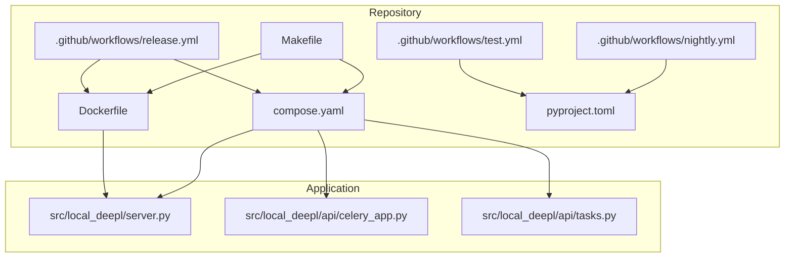
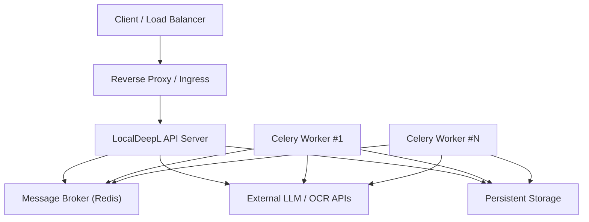
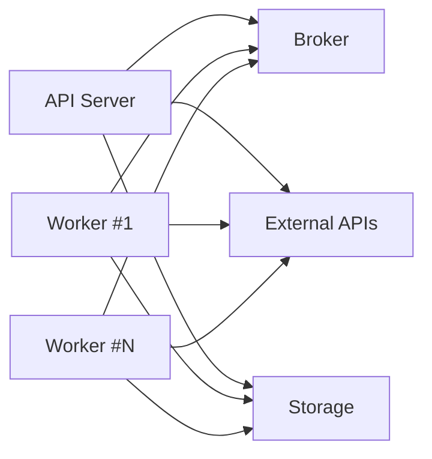

# Deployment and Operations

<cite>
**Referenced Files in This Document**
- [Dockerfile](file://Dockerfile)
- [compose.yaml](file://compose.yaml)
- [.github/workflows/test.yml](file://.github/workflows/test.yml)
- [.github/workflows/release.yml](file://.github/workflows/release.yml)
- [.github/workflows/nightly.yml](file://.github/workflows/nightly.yml)
- [src/local_deepl/server.py](file://src/local_deepl/server.py)
- [src/local_deepl/api/celery_app.py](file://src/local_deepl/api/celery_app.py)
- [src/local_deepl/api/tasks.py](file://src/local_deepl/api/tasks.py)
- [pyproject.toml](file://pyproject.toml)
- [Makefile](file://Makefile)
</cite>

## Table of Contents
1. [Introduction](#introduction)
2. [Project Structure](#project-structure)
3. [Core Components](#core-components)
4. [Architecture Overview](#architecture-overview)
5. [Detailed Component Analysis](#detailed-component-analysis)
6. [Dependency Analysis](#dependency-analysis)
7. [Performance Considerations](#performance-considerations)
8. [Troubleshooting Guide](#troubleshooting-guide)
9. [Conclusion](#conclusion)
10. [Appendices](#appendices)

## Introduction
This document provides a comprehensive guide to deploying and operating LocalDeepL in production. It covers Docker containerization, Docker Compose orchestration, CI/CD pipelines for automated testing, building, and releasing, as well as operational best practices including environment configuration, scaling strategies, monitoring and logging, health checks, metrics collection, secrets management, and blue-green deployments. The guidance is grounded in the repository’s actual deployment artifacts and application components.

## Project Structure
LocalDeepL includes explicit deployment assets:
- A Docker image definition for the application server and workers
- A Docker Compose file for orchestrating services
- GitHub Actions workflows for test, release, and nightly automation
- Python packaging and build configuration
- A Makefile for common development and operational tasks

**Diagram sources**
- [Dockerfile](file://Dockerfile)
- [compose.yaml](file://compose.yaml)
- [.github/workflows/test.yml](file://.github/workflows/test.yml)
- [.github/workflows/release.yml](file://.github/workflows/release.yml)
- [.github/workflows/nightly.yml](file://.github/workflows/nightly.yml)
- [pyproject.toml](file://pyproject.toml)
- [Makefile](file://Makefile)
- [src/local_deepl/server.py](file://src/local_deepl/server.py)
- [src/local_deepl/api/celery_app.py](file://src/local_deepl/api/celery_app.py)
- [src/local_deepl/api/tasks.py](file://src/local_deepl/api/tasks.py)

**Section sources**
- [Dockerfile](file://Dockerfile)
- [compose.yaml](file://compose.yaml)
- [.github/workflows/test.yml](file://.github/workflows/test.yml)
- [.github/workflows/release.yml](file://.github/workflows/release.yml)
- [.github/workflows/nightly.yml](file://.github/workflows/nightly.yml)
- [pyproject.toml](file://pyproject.toml)
- [Makefile](file://Makefile)

## Core Components
- Application server: FastAPI-based HTTP service exposing REST endpoints and static UI assets.
- Background workers: Celery workers executing long-running jobs (OCR, translation, exports).
- Task definitions: Celery task implementations for pipeline steps.
- Build and packaging: Python project configuration and dependencies.
- Orchestration: Docker Compose defining services, networks, volumes, and runtime configuration.
- CI/CD: GitHub Actions workflows for tests, releases, and nightly builds.

Key responsibilities:
- Server handles requests, validates inputs, coordinates OCR and translation workflows, and returns results or job IDs.
- Workers consume tasks from a broker (e.g., Redis), process documents, and update progress/state.
- Compose ties together the server, worker, and broker with shared networks and persistent storage where needed.
- CI/CD automates linting, tests, image builds, and publishing.

**Section sources**
- [src/local_deepl/server.py](file://src/local_deepl/server.py)
- [src/local_deepl/api/celery_app.py](file://src/local_deepl/api/celery_app.py)
- [src/local_deepl/api/tasks.py](file://src/local_deepl/api/tasks.py)
- [pyproject.toml](file://pyproject.toml)

## Architecture Overview
The production architecture typically consists of:
- API server container serving HTTP traffic
- One or more Celery worker containers processing background jobs
- Message broker (e.g., Redis) for task queueing
- Optional external services (LLM providers, OCR engines) accessed via network

[No sources needed since this diagram shows conceptual workflow, not actual code structure]

## Detailed Component Analysis

### Docker Containerization Strategy
- Single-purpose images are recommended: separate images for the API server and Celery workers if resource profiles differ significantly.
- Multi-stage builds can reduce image size by separating build-time dependencies from runtime.
- Non-root user execution improves security posture.
- Environment variables should be injected at runtime rather than baked into images.
- Healthcheck instructions enable orchestrators to detect readiness and liveness.

Operational considerations:
- Pin base images and dependency versions for reproducibility.
- Use minimal runtime images and install only what is required.
- Cache layers effectively to speed up rebuilds.
- Ensure time zone and locale settings are consistent across environments.

**Section sources**
- [Dockerfile](file://Dockerfile)

### Docker Compose Orchestration
Compose defines:
- Services: API server, Celery worker(s), and message broker
- Networks: isolated networking between services
- Volumes: persistent data for queues, artifacts, or caches
- Environment variables: per-service configuration
- Healthchecks and restart policies: resilience and self-healing
- Resource limits: CPU/memory constraints to prevent contention

Scaling patterns:
- Horizontal scaling of workers by increasing replicas
- Separate broker and storage backends for high availability
- Read-only root filesystems for servers where possible

**Section sources**
- [compose.yaml](file://compose.yaml)

### CI/CD Pipeline Configuration
GitHub Actions workflows automate:
- Test execution on pull requests and pushes
- Building Docker images and pushing to registries
- Tagging and releasing artifacts
- Nightly builds for validation and artifact generation

Best practices:
- Cache dependencies to speed up runs
- Run unit, integration, and security scans
- Publish images with semantic version tags and digests
- Gate releases on successful test suites and approvals

**Section sources**
- [.github/workflows/test.yml](file://.github/workflows/test.yml)
- [.github/workflows/release.yml](file://.github/workflows/release.yml)
- [.github/workflows/nightly.yml](file://.github/workflows/nightly.yml)

### Application Entry Points and Runtime
- Server entry point initializes the web framework, mounts routers, and configures middleware.
- Celery app configures the broker URL, concurrency, and task routing.
- Tasks define long-running operations such as OCR, translation, and export.

Runtime configuration:
- Environment variables control ports, logging levels, feature flags, and external service credentials.
- Graceful shutdown handling ensures in-flight jobs complete or fail safely.

**Section sources**
- [src/local_deepl/server.py](file://src/local_deepl/server.py)
- [src/local_deepl/api/celery_app.py](file://src/local_deepl/api/celery_app.py)
- [src/local_deepl/api/tasks.py](file://src/local_deepl/api/tasks.py)

### Build and Packaging
- pyproject.toml defines dependencies, scripts, and metadata.
- Makefile centralizes commands for building, testing, linting, and deployment helpers.

Recommendations:
- Keep dependency lists tight and audited.
- Use lockfiles to ensure deterministic builds.
- Provide reusable Make targets for CI and local dev.

**Section sources**
- [pyproject.toml](file://pyproject.toml)
- [Makefile](file://Makefile)

## Dependency Analysis
Service relationships and external dependencies:
- API server depends on Celery client libraries and external APIs.
- Workers depend on the same task libraries and external APIs.
- Broker provides asynchronous messaging; persistence may be enabled for durability.
- Storage holds artifacts, logs, and temporary files.

[No sources needed since this diagram shows conceptual workflow, not actual code structure]

## Performance Considerations
- Concurrency tuning: Adjust worker concurrency based on CPU cores and I/O characteristics.
- Memory limits: Set appropriate memory reservations and limits to avoid OOM kills.
- Caching: Enable response caching and model caching where applicable.
- Network optimization: Use internal networks for broker communication and minimize egress.
- Batch processing: Group small tasks to reduce overhead.
- Monitoring: Track queue depth, latency percentiles, error rates, and resource utilization.

[No sources needed since this section provides general guidance]

## Troubleshooting Guide
Common issues and resolutions:
- Connection failures to broker: Verify broker URL, network policies, and credentials.
- Worker crashes: Inspect worker logs, check memory usage, and validate task payloads.
- Slow responses: Profile API endpoints, optimize OCR/translation calls, and tune concurrency.
- Disk pressure: Monitor storage usage and implement log rotation and artifact cleanup.
- Health check failures: Validate readiness probes, dependency availability, and warm-up times.

Operational tips:
- Centralize logs and correlate traces across services.
- Use structured logging and include request/job IDs.
- Implement retries with exponential backoff for transient errors.
- Maintain runbooks for incident response and recovery procedures.

[No sources needed since this section provides general guidance]

## Conclusion
LocalDeepL’s deployment model leverages Docker and Docker Compose to encapsulate the API server and background workers, while GitHub Actions automates testing, building, and releasing. Production readiness hinges on robust configuration management, observability, scaling strategies, and resilient infrastructure. Following the guidance in this document will help you deploy, operate, and scale LocalDeepL confidently.

[No sources needed since this section summarizes without analyzing specific files]

## Appendices

### Environment Variables Management
- Use environment files or secret managers to inject configuration at runtime.
- Separate configuration for dev, staging, and prod environments.
- Validate required variables at startup and fail fast with clear messages.
- Rotate secrets regularly and audit access.

[No sources needed since this section provides general guidance]

### Scaling Strategies
- Scale workers horizontally to handle increased load.
- Use autoscaling policies based on queue depth and CPU/memory metrics.
- Partition queues by workload type to isolate critical paths.
- Employ horizontal pod autoscaling in Kubernetes-like environments.

[No sources needed since this section provides general guidance]

### Monitoring and Logging Setup
- Expose health check endpoints for readiness and liveness probes.
- Collect metrics such as request latency, error rates, queue length, and worker throughput.
- Centralize logs with a logging backend and create dashboards for key indicators.
- Set alerts for anomalies and degradation.

[No sources needed since this section provides general guidance]

### Blue-Green Deployments
- Maintain two identical environments (blue and green).
- Route traffic to the active environment and switch during maintenance windows.
- Pre-warm the inactive environment to reduce cold start latency.
- Rollback instantly by switching traffic back to the previous environment.

[No sources needed since this section provides general guidance]

### Secrets and Configuration in Production
- Store secrets in secure vaults or platform-native secret stores.
- Avoid committing secrets to repositories.
- Use least-privilege principles for service accounts and permissions.
- Audit and rotate secrets periodically.

[No sources needed since this section provides general guidance]