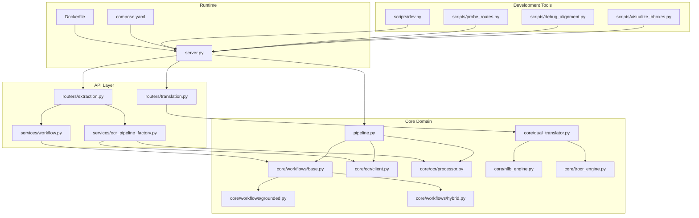
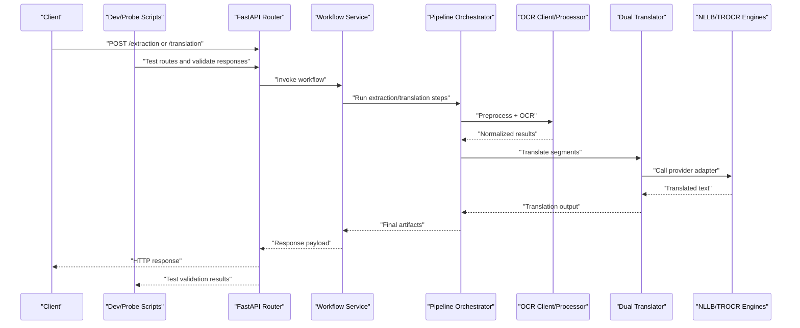
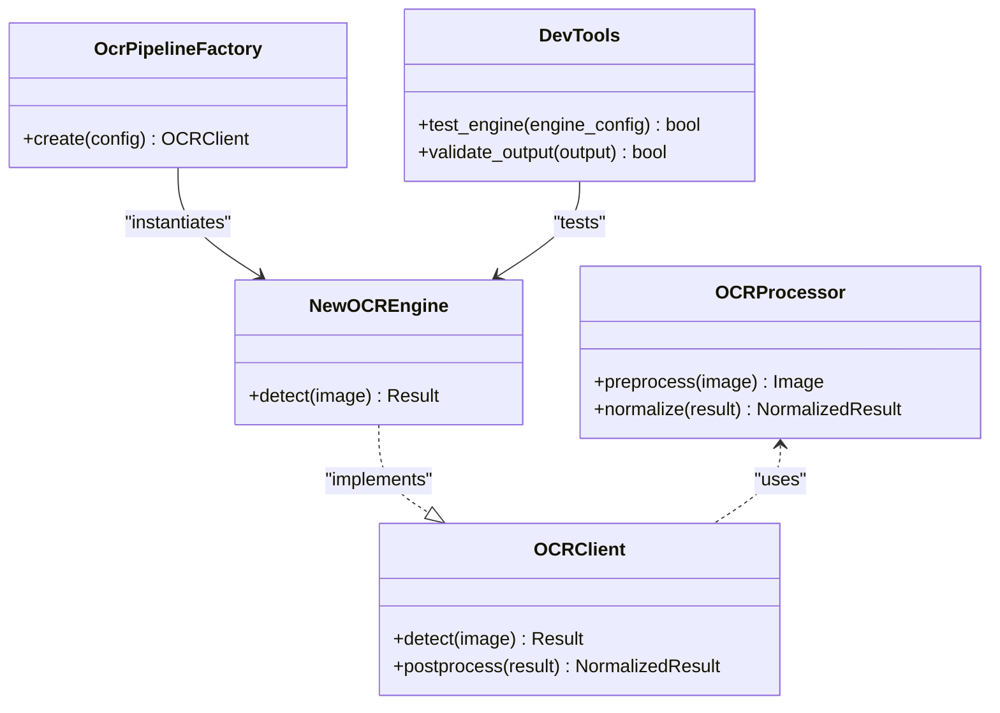
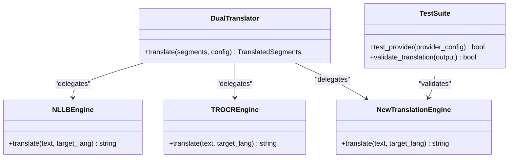
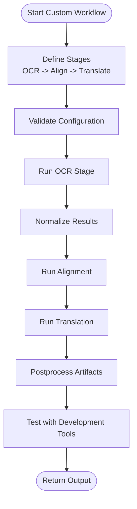
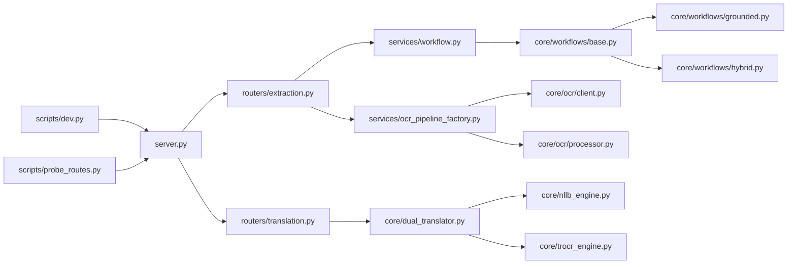

# Developer Guide

<cite>
**Referenced Files in This Document**
- [README.md](file://README.md)
- [ARCHITECTURE.md](file://ARCHITECTURE.md)
- [pyproject.toml](file://pyproject.toml)
- [.pre-commit-config.yaml](file://.pre-commit-config.yaml)
- [Dockerfile](file://Dockerfile)
- [compose.yaml](file://compose.yaml)
- [scripts/dev.py](file://scripts/dev.py)
- [scripts/probe_routes.py](file://scripts/probe_routes.py)
- [src/omniscribe/server.py](file://src/omniscribe/server.py)
- [src/omniscribe/pipeline.py](file://src/omniscribe/pipeline.py)
- [src/omniscribe/core/ocr/client.py](file://src/omniscribe/core/ocr/client.py)
- [src/omniscribe/core/ocr/processor.py](file://src/omniscribe/core/ocr/processor.py)
- [src/omniscribe/core/workflows/base.py](file://src/omniscribe/core/workflows/base.py)
- [src/omniscribe/core/workflows/grounded.py](file://src/omniscribe/core/workflows/grounded.py)
- [src/omniscribe/core/workflows/hybrid.py](file://src/omniscribe/core/workflows/hybrid.py)
- [src/omniscribe/api/routers/extraction.py](file://src/omniscribe/api/routers/extraction.py)
- [src/omniscribe/api/routers/translation.py](file://src/omniscribe/api/routers/translation.py)
- [src/omniscribe/api/services/ocr_pipeline_factory.py](file://src/omniscribe/api/services/ocr_pipeline_factory.py)
- [src/omniscribe/api/services/workflow.py](file://src/omniscribe/api/services/workflow.py)
- [src/omniscribe/core/dual_translator.py](file://src/omniscribe/core/dual_translator.py)
- [src/omniscribe/core/nllb_engine.py](file://src/omniscribe/core/nllb_engine.py)
- [src/omniscribe/core/trocr_engine.py](file://src/omniscribe/core/trocr_engine.py)
- [tests/conftest.py](file://tests/conftest.py)
- [tests/test_integration.py](file://tests/test_integration.py)
- [tests/test_ocr.py](file://tests/test_ocr.py)
- [tests/test_workflows_base.py](file://tests/test_workflows_base.py)
- [tests/test_workflows_grounded.py](file://tests/test_workflows_grounded.py)
- [tests/test_workflows_hybrid.py](file://tests/test_workflows_hybrid.py)
- [tests/test_glossary_imports_route.py](file://tests/test_glossary_imports_route.py)
- [tests/test_chunked_runner.py](file://tests/test_chunked_runner.py)
- [tests/test_security_qa.py](file://tests/test_security_qa.py)
- [tests/test_env.py](file://tests/test_env.py)
- [scripts/debug_alignment.py](file://scripts/debug_alignment.py)
- [scripts/visualize_bboxes.py](file://scripts/visualize_bboxes.py)
</cite>

## Update Summary
**Changes Made**
- Added new development tools section covering dev.py and probe_routes.py scripts
- Enhanced testing strategy section with new test files for glossary imports, chunked processing, and security features
- Updated environment variable handling documentation with improved configuration management
- Added new debugging and development workflow tools to the troubleshooting guide
- Expanded API testing capabilities with dedicated route probing utilities

## Table of Contents
1. Introduction
2. Project Structure
3. Core Components
4. Architecture Overview
5. Detailed Component Analysis
6. Development Tools and Environment Setup
7. Testing Strategy and Quality Assurance
8. Dependency Analysis
9. Performance Considerations
10. Troubleshooting Guide
11. Conclusion
12. Appendices

## Introduction
This Developer Guide explains how to contribute to LocalDeepL, set up a local development environment, understand the code organization and architectural conventions, and extend functionality with new OCR engines, translation providers, and processing workflows. It also documents testing strategies, debugging techniques, profiling methods, and standards for code review, commits, and documentation. The guide now includes comprehensive coverage of new development tools including the dev.py script, API testing utilities, and enhanced testing infrastructure.

## Project Structure
LocalDeepL is organized into clear layers:
- API layer (FastAPI routers, services, schemas)
- Core domain logic (OCR, workflows, translation, document processing)
- Utilities and resources
- Tests and scripts for evaluation and debugging
- Build and deployment artifacts



**Diagram sources**
- [src/omniscribe/server.py](file://src/omniscribe/server.py)
- [src/omniscribe/pipeline.py](file://src/omniscribe/pipeline.py)
- [src/omniscribe/api/routers/extraction.py](file://src/omniscribe/api/routers/extraction.py)
- [src/omniscribe/api/routers/translation.py](file://src/omniscribe/api/routers/translation.py)
- [src/omniscribe/api/services/ocr_pipeline_factory.py](file://src/omniscribe/api/services/ocr_pipeline_factory.py)
- [src/omniscribe/api/services/workflow.py](file://src/omniscribe/api/services/workflow.py)
- [src/omniscribe/core/workflows/base.py](file://src/omniscribe/core/workflows/base.py)
- [src/omniscribe/core/workflows/grounded.py](file://src/omniscribe/core/workflows/grounded.py)
- [src/omniscribe/core/workflows/hybrid.py](file://src/omniscribe/core/workflows/hybrid.py)
- [src/omniscribe/core/ocr/client.py](file://src/omniscribe/core/ocr/client.py)
- [src/omniscribe/core/ocr/processor.py](file://src/omniscribe/core/ocr/processor.py)
- [src/omniscribe/core/dual_translator.py](file://src/omniscribe/core/dual_translator.py)
- [src/omniscribe/core/nllb_engine.py](file://src/omniscribe/core/nllb_engine.py)
- [src/omniscribe/core/trocr_engine.py](file://src/omniscribe/core/trocr_engine.py)
- [scripts/dev.py](file://scripts/dev.py)
- [scripts/probe_routes.py](file://scripts/probe_routes.py)
- [scripts/debug_alignment.py](file://scripts/debug_alignment.py)
- [scripts/visualize_bboxes.py](file://scripts/visualize_bboxes.py)
- [Dockerfile](file://Dockerfile)
- [compose.yaml](file://compose.yaml)

**Section sources**
- [README.md](file://README.md)
- [ARCHITECTURE.md](file://ARCHITECTURE.md)
- [pyproject.toml](file://pyproject.toml)

## Core Components
- Server entrypoint and application wiring
- Pipeline orchestration for extraction and translation
- OCR client and processor abstractions
- Workflow base and concrete implementations (grounded, hybrid)
- Translation subsystem with dual translator and engine adapters
- Development tools for local development and API testing

Key responsibilities:
- server.py: FastAPI app initialization, middleware, static assets, and startup/shutdown hooks
- pipeline.py: End-to-end orchestration across OCR, alignment, translation, and export
- core/ocr/client.py: Abstraction over OCR backends
- core/ocr/processor.py: Pre/post-processing and OCR result normalization
- core/workflows/base.py: Abstract workflow interface and shared utilities
- core/workflows/grounded.py and hybrid.py: Concrete strategies combining OCR, grounding, and translation
- api/routers/*: HTTP endpoints for extraction and translation
- api/services/*: Service-layer composition and configuration
- core/dual_translator.py: Multi-provider translation coordination
- core/nllb_engine.py and core/trocr_engine.py: Provider-specific adapters
- scripts/dev.py: Development server with hot reloading and debugging support
- scripts/probe_routes.py: API endpoint testing and validation utility

**Section sources**
- [src/omniscribe/server.py](file://src/omniscribe/server.py)
- [src/omniscribe/pipeline.py](file://src/omniscribe/pipeline.py)
- [src/omniscribe/core/ocr/client.py](file://src/omniscribe/core/ocr/client.py)
- [src/omniscribe/core/ocr/processor.py](file://src/omniscribe/core/ocr/processor.py)
- [src/omniscribe/core/workflows/base.py](file://src/omniscribe/core/workflows/base.py)
- [src/omniscribe/core/workflows/grounded.py](file://src/omniscribe/core/workflows/grounded.py)
- [src/omniscribe/core/workflows/hybrid.py](file://src/omniscribe/core/workflows/hybrid.py)
- [src/omniscribe/api/routers/extraction.py](file://src/omniscribe/api/routers/extraction.py)
- [src/omniscribe/api/routers/translation.py](file://src/omniscribe/api/routers/translation.py)
- [src/omniscribe/api/services/ocr_pipeline_factory.py](file://src/omniscribe/api/services/ocr_pipeline_factory.py)
- [src/omniscribe/api/services/workflow.py](file://src/omniscribe/api/services/workflow.py)
- [src/omniscribe/core/dual_translator.py](file://src/omniscribe/core/dual_translator.py)
- [src/omniscribe/core/nllb_engine.py](file://src/omniscribe/core/nllb_engine.py)
- [src/omniscribe/core/trocr_engine.py](file://src/omniscribe/core/trocr_engine.py)
- [scripts/dev.py](file://scripts/dev.py)
- [scripts/probe_routes.py](file://scripts/probe_routes.py)

## Architecture Overview
The system follows a layered architecture:
- API layer exposes REST endpoints and composes service calls
- Services coordinate pipelines and workflows
- Core provides reusable domain components (OCR, translation, workflows)
- Engines implement provider-specific logic
- Development tools provide local development and testing capabilities
- Runtime packaging via Docker and Compose



**Diagram sources**
- [src/omniscribe/api/routers/extraction.py](file://src/omniscribe/api/routers/extraction.py)
- [src/omniscribe/api/routers/translation.py](file://src/omniscribe/api/routers/translation.py)
- [src/omniscribe/api/services/workflow.py](file://src/omniscribe/api/services/workflow.py)
- [src/omniscribe/pipeline.py](file://src/omniscribe/pipeline.py)
- [src/omniscribe/core/ocr/client.py](file://src/omniscribe/core/ocr/client.py)
- [src/omniscribe/core/ocr/processor.py](file://src/omniscribe/core/ocr/processor.py)
- [src/omniscribe/core/dual_translator.py](file://src/omniscribe/core/dual_translator.py)
- [src/omniscribe/core/nllb_engine.py](file://src/omniscribe/core/nllb_engine.py)
- [src/omniscribe/core/trocr_engine.py](file://src/omniscribe/core/trocr_engine.py)
- [scripts/dev.py](file://scripts/dev.py)
- [scripts/probe_routes.py](file://scripts/probe_routes.py)

## Detailed Component Analysis

### Development Environment Setup
- Use the Python project configuration to manage dependencies and tooling.
- Containerized runtime is provided via Docker and Compose for consistent environments.
- Pre-commit hooks enforce formatting and linting before commits.
- New development tools streamline local development and testing workflows.

Recommended steps:
- Install dependencies using the project's dependency file.
- Configure environment variables for OCR and translation providers.
- Run the development server using the dev.py script for hot reloading.
- Use probe_routes.py for API testing and validation.
- Enable pre-commit hooks to maintain code quality.

**Updated** Added new development tools for streamlined local development and API testing.

**Section sources**
- [pyproject.toml](file://pyproject.toml)
- [Dockerfile](file://Dockerfile)
- [compose.yaml](file://compose.yaml)
- [.pre-commit-config.yaml](file://.pre-commit-config.yaml)
- [scripts/dev.py](file://scripts/dev.py)
- [scripts/probe_routes.py](file://scripts/probe_routes.py)

### Code Organization Principles
- Layered separation: API routers delegate to services; services compose core components.
- Clear module boundaries: OCR, workflows, translation, and utilities are isolated.
- Configuration-driven behavior: Providers and engines selected via settings.
- Extensibility points: Factory patterns for OCR pipelines and abstract interfaces for workflows and engines.
- Development tools are organized in separate scripts directory for easy access.

**Updated** Added development tools organization to code structure principles.

**Section sources**
- [src/omniscribe/api/services/ocr_pipeline_factory.py](file://src/omniscribe/api/services/ocr_pipeline_factory.py)
- [src/omniscribe/core/workflows/base.py](file://src/omniscribe/core/workflows/base.py)
- [src/omniscribe/core/dual_translator.py](file://src/omniscribe/core/dual_translator.py)
- [scripts/dev.py](file://scripts/dev.py)
- [scripts/probe_routes.py](file://scripts/probe_routes.py)

### Architectural Conventions
- Workflows implement a common base interface for consistency.
- OCR clients encapsulate backend differences; processors normalize outputs.
- Translation uses a dual translator that coordinates multiple engines.
- Routers focus on request/response handling and validation.
- Development tools follow consistent patterns for server interaction and testing.

**Updated** Added development tools architectural conventions.

**Section sources**
- [src/omniscribe/core/workflows/base.py](file://src/omniscribe/core/workflows/base.py)
- [src/omniscribe/core/workflows/grounded.py](file://src/omniscribe/core/workflows/grounded.py)
- [src/omniscribe/core/workflows/hybrid.py](file://src/omniscribe/core/workflows/hybrid.py)
- [src/omniscribe/core/ocr/client.py](file://src/omniscribe/core/ocr/client.py)
- [src/omniscribe/core/ocr/processor.py](file://src/omniscribe/core/ocr/processor.py)
- [src/omniscribe/core/dual_translator.py](file://src/omniscribe/core/dual_translator.py)
- [scripts/dev.py](file://scripts/dev.py)
- [scripts/probe_routes.py](file://scripts/probe_routes.py)

### Testing Strategy and Quality Assurance
- Unit tests validate individual components such as OCR, workflows, and translation.
- Integration tests exercise end-to-end flows through the API and pipeline.
- Shared fixtures and test configuration centralize setup.
- Enhanced testing suite includes specialized tests for glossary imports, chunked processing, and security features.
- Environment variable handling is thoroughly tested for robustness.

Guidelines:
- Place unit tests near the modules they cover.
- Use fixtures for sample inputs and mock external providers when needed.
- Prefer deterministic assertions for OCR and translation outputs where possible.
- Test new development tools alongside core functionality.
- Validate API routes using the probe_routes.py utility.

**Updated** Enhanced testing strategy with new test categories and development tool testing.

**Section sources**
- [tests/conftest.py](file://tests/conftest.py)
- [tests/test_ocr.py](file://tests/test_ocr.py)
- [tests/test_workflows_base.py](file://tests/test_workflows_base.py)
- [tests/test_workflows_grounded.py](file://tests/test_workflows_grounded.py)
- [tests/test_workflows_hybrid.py](file://tests/test_workflows_hybrid.py)
- [tests/test_integration.py](file://tests/test_integration.py)
- [tests/test_glossary_imports_route.py](file://tests/test_glossary_imports_route.py)
- [tests/test_chunked_runner.py](file://tests/test_chunked_runner.py)
- [tests/test_security_qa.py](file://tests/test_security_qa.py)
- [tests/test_env.py](file://tests/test_env.py)

### Adding a New OCR Engine
Steps:
- Implement an OCR client adhering to the existing abstraction.
- Provide preprocessing and postprocessing hooks if needed.
- Register the engine via the OCR pipeline factory.
- Add unit tests covering detection, normalization, and error paths.
- Optionally add integration tests against sample documents.
- Test the new engine using the development server and probe utilities.



**Updated** Added development tool integration to OCR engine extension process.

**Diagram sources**
- [src/omniscribe/core/ocr/client.py](file://src/omniscribe/core/ocr/client.py)
- [src/omniscribe/core/ocr/processor.py](file://src/omniscribe/core/ocr/processor.py)
- [src/omniscribe/api/services/ocr_pipeline_factory.py](file://src/omniscribe/api/services/ocr_pipeline_factory.py)
- [scripts/dev.py](file://scripts/dev.py)
- [scripts/probe_routes.py](file://scripts/probe_routes.py)

**Section sources**
- [src/omniscribe/core/ocr/client.py](file://src/omniscribe/core/ocr/client.py)
- [src/omniscribe/core/ocr/processor.py](file://src/omniscribe/core/ocr/processor.py)
- [src/omniscribe/api/services/ocr_pipeline_factory.py](file://src/omniscribe/api/services/ocr_pipeline_factory.py)
- [tests/test_ocr.py](file://tests/test_ocr.py)
- [scripts/dev.py](file://scripts/dev.py)
- [scripts/probe_routes.py](file://scripts/probe_routes.py)

### Adding a New Translation Provider
Steps:
- Create an engine adapter implementing the expected interface.
- Integrate with the dual translator by registering the new engine.
- Add unit tests for translation requests, retries, and error handling.
- Include integration tests with mocked provider responses.
- Validate the new provider using development tools and test suites.



**Updated** Added testing suite integration to translation provider extension process.

**Diagram sources**
- [src/omniscribe/core/dual_translator.py](file://src/omniscribe/core/dual_translator.py)
- [src/omniscribe/core/nllb_engine.py](file://src/omniscribe/core/nllb_engine.py)
- [src/omniscribe/core/trocr_engine.py](file://src/omniscribe/core/trocr_engine.py)
- [tests/test_translation_callbacks.py](file://tests/test_translation_callbacks.py)

**Section sources**
- [src/omniscribe/core/dual_translator.py](file://src/omniscribe/core/dual_translator.py)
- [src/omniscribe/core/nllb_engine.py](file://src/omniscribe/core/nllb_engine.py)
- [src/omniscribe/core/trocr_engine.py](file://src/omniscribe/core/trocr_engine.py)
- [tests/test_translation_callbacks.py](file://tests/test_translation_callbacks.py)

### Extending Processing Workflows
Steps:
- Subclass the workflow base to define custom stages.
- Compose OCR, alignment, and translation steps as needed.
- Wire the workflow via the workflow service and expose it through an API router.
- Add tests for each stage and end-to-end scenarios.
- Use development tools to test workflow performance and reliability.



**Updated** Added development tool testing to workflow extension process.

**Diagram sources**
- [src/omniscribe/core/workflows/base.py](file://src/omniscribe/core/workflows/base.py)
- [src/omniscribe/core/workflows/grounded.py](file://src/omniscribe/core/workflows/grounded.py)
- [src/omniscribe/core/workflows/hybrid.py](file://src/omniscribe/core/workflows/hybrid.py)
- [src/omniscribe/api/services/workflow.py](file://src/omniscribe/api/services/workflow.py)
- [scripts/dev.py](file://scripts/dev.py)

**Section sources**
- [src/omniscribe/core/workflows/base.py](file://src/omniscribe/core/workflows/base.py)
- [src/omniscribe/core/workflows/grounded.py](file://src/omniscribe/core/workflows/grounded.py)
- [src/omniscribe/core/workflows/hybrid.py](file://src/omniscribe/core/workflows/hybrid.py)
- [src/omniscribe/api/services/workflow.py](file://src/omniscribe/api/services/workflow.py)
- [tests/test_workflows_base.py](file://tests/test_workflows_base.py)
- [tests/test_workflows_grounded.py](file://tests/test_workflows_grounded.py)
- [tests/test_workflows_hybrid.py](file://tests/test_workflows_hybrid.py)
- [scripts/dev.py](file://scripts/dev.py)

### API Extension Patterns
- Add new endpoints under api/routers with request/response schemas.
- Delegate business logic to services in api/services.
- Use the pipeline orchestrator for complex operations.
- Ensure proper error handling and status codes.
- Test new endpoints using probe_routes.py for validation.

**Updated** Added API testing with probe_routes.py utility.

**Section sources**
- [src/omniscribe/api/routers/extraction.py](file://src/omniscribe/api/routers/extraction.py)
- [src/omniscribe/api/routers/translation.py](file://src/omniscribe/api/routers/translation.py)
- [src/omniscribe/pipeline.py](file://src/omniscribe/pipeline.py)
- [scripts/probe_routes.py](file://scripts/probe_routes.py)

## Development Tools and Environment Setup

### Development Server with Hot Reloading
The dev.py script provides a comprehensive development environment with:
- Automatic code reloading when files change
- Enhanced logging and debugging output
- Development-specific configuration options
- Integration with testing utilities

Usage:
```bash
python scripts/dev.py --reload --debug
```

### API Testing and Validation
The probe_routes.py utility enables comprehensive API testing:
- Automated endpoint discovery and testing
- Response validation against expected schemas
- Performance benchmarking capabilities
- Error scenario simulation

Usage:
```bash
python scripts/probe_routes.py --endpoint /api/extraction --method POST
```

### Development Workflow Integration
- Use dev.py for local development with hot reloading
- Run probe_routes.py to validate API changes
- Execute test suites to ensure code quality
- Use debug scripts for detailed analysis of OCR and translation processes

**Section sources**
- [scripts/dev.py](file://scripts/dev.py)
- [scripts/probe_routes.py](file://scripts/probe_routes.py)

## Dependency Analysis
High-level dependencies:
- server.py depends on routers and services
- routers depend on services and schemas
- services depend on core components (workflows, OCR, translation)
- engines implement provider-specific logic used by higher layers
- development tools depend on server APIs for testing and validation



**Updated** Added development tools to dependency graph.

**Diagram sources**
- [src/omniscribe/server.py](file://src/omniscribe/server.py)
- [src/omniscribe/api/routers/extraction.py](file://src/omniscribe/api/routers/extraction.py)
- [src/omniscribe/api/routers/translation.py](file://src/omniscribe/api/routers/translation.py)
- [src/omniscribe/api/services/workflow.py](file://src/omniscribe/api/services/workflow.py)
- [src/omniscribe/api/services/ocr_pipeline_factory.py](file://src/omniscribe/api/services/ocr_pipeline_factory.py)
- [src/omniscribe/core/workflows/base.py](file://src/omniscribe/core/workflows/base.py)
- [src/omniscribe/core/workflows/grounded.py](file://src/omniscribe/core/workflows/grounded.py)
- [src/omniscribe/core/workflows/hybrid.py](file://src/omniscribe/core/workflows/hybrid.py)
- [src/omniscribe/core/ocr/client.py](file://src/omniscribe/core/ocr/client.py)
- [src/omniscribe/core/ocr/processor.py](file://src/omniscribe/core/ocr/processor.py)
- [src/omniscribe/core/dual_translator.py](file://src/omniscribe/core/dual_translator.py)
- [src/omniscribe/core/nllb_engine.py](file://src/omniscribe/core/nllb_engine.py)
- [src/omniscribe/core/trocr_engine.py](file://src/omniscribe/core/trocr_engine.py)
- [scripts/dev.py](file://scripts/dev.py)
- [scripts/probe_routes.py](file://scripts/probe_routes.py)

**Section sources**
- [src/omniscribe/server.py](file://src/omniscribe/server.py)
- [src/omniscribe/api/routers/extraction.py](file://src/omniscribe/api/routers/extraction.py)
- [src/omniscribe/api/routers/translation.py](file://src/omniscribe/api/routers/translation.py)
- [src/omniscribe/api/services/workflow.py](file://src/omniscribe/api/services/workflow.py)
- [src/omniscribe/api/services/ocr_pipeline_factory.py](file://src/omniscribe/api/services/ocr_pipeline_factory.py)
- [src/omniscribe/core/workflows/base.py](file://src/omniscribe/core/workflows/base.py)
- [src/omniscribe/core/workflows/grounded.py](file://src/omniscribe/core/workflows/grounded.py)
- [src/omniscribe/core/workflows/hybrid.py](file://src/omniscribe/core/workflows/hybrid.py)
- [src/omniscribe/core/ocr/client.py](file://src/omniscribe/core/ocr/client.py)
- [src/omniscribe/core/ocr/processor.py](file://src/omniscribe/core/ocr/processor.py)
- [src/omniscribe/core/dual_translator.py](file://src/omniscribe/core/dual_translator.py)
- [src/omniscribe/core/nllb_engine.py](file://src/omniscribe/core/nllb_engine.py)
- [src/omniscribe/core/trocr_engine.py](file://src/omniscribe/core/trocr_engine.py)
- [scripts/dev.py](file://scripts/dev.py)
- [scripts/probe_routes.py](file://scripts/probe_routes.py)

## Performance Considerations
- Profile hotspots in OCR and translation stages using standard Python profilers.
- Cache repeated translations and OCR results where appropriate.
- Batch process large documents to reduce overhead.
- Tune concurrency limits for OCR and translation providers.
- Monitor memory usage during image-heavy workflows.
- Use development tools to identify performance bottlenecks during local development.

[No sources needed since this section provides general guidance]

## Troubleshooting Guide
Debugging techniques:
- Use debug scripts to inspect intermediate outputs and bounding boxes.
- Visualize detection results to validate OCR accuracy.
- Check logs from routers and services for errors and timing information.
- Run targeted unit tests for suspected components.
- Use dev.py for enhanced debugging with hot reloading.
- Utilize probe_routes.py for API endpoint testing and validation.

Common checks:
- Verify provider credentials and network connectivity.
- Confirm input image formats and sizes.
- Validate configuration keys for engines and workflows.
- Test environment variable configuration using test utilities.
- Use development tools to isolate and reproduce issues.

**Updated** Added new development tools to troubleshooting workflow.

**Section sources**
- [scripts/debug_alignment.py](file://scripts/debug_alignment.py)
- [scripts/visualize_bboxes.py](file://scripts/visualize_bboxes.py)
- [tests/test_integration.py](file://tests/test_integration.py)
- [scripts/dev.py](file://scripts/dev.py)
- [scripts/probe_routes.py](file://scripts/probe_routes.py)

## Conclusion
LocalDeepL's layered design and extensible interfaces make it straightforward to add new OCR engines, translation providers, and workflows. The new development tools including dev.py and probe_routes.py significantly enhance the development experience with hot reloading, API testing, and debugging capabilities. Follow the established conventions, write comprehensive tests, and use the provided debugging tools to iterate quickly. Maintain code quality with pre-commit hooks and adhere to the documented commit and review practices.

[No sources needed since this section summarizes without analyzing specific files]

## Appendices

### Commit and Review Standards
- Use descriptive commit messages and link related issues.
- Keep changes focused and atomic.
- Ensure all tests pass and coverage remains stable.
- Request reviews for significant refactors or new integrations.
- Test new development tools alongside core functionality.

**Updated** Added development tool testing requirements.

**Section sources**
- [.pre-commit-config.yaml](file://.pre-commit-config.yaml)
- [README.md](file://README.md)

### Documentation Standards
- Update relevant docs when adding features or changing APIs.
- Include examples and usage notes for new components.
- Keep diagrams and READMEs aligned with implementation.
- Document new development tools and their usage patterns.

**Updated** Added development tool documentation requirements.

**Section sources**
- [ARCHITECTURE.md](file://ARCHITECTURE.md)
- [README.md](file://README.md)

### Development Tool Usage Examples

#### Using the Development Server
```bash
# Start development server with hot reloading
python scripts/dev.py --reload --debug

# Configure environment variables
export LOCALDEEPL_OCR_PROVIDER=your_provider
export LOCALDEEPL_TRANSLATION_PROVIDER=your_provider

# Test with development tools
python scripts/probe_routes.py --endpoint /api/extraction --method POST
```

#### Testing New Features
```bash
# Run specific test suites
pytest tests/test_glossary_imports_route.py -v
pytest tests/test_chunked_runner.py -v
pytest tests/test_security_qa.py -v

# Validate API endpoints
python scripts/probe_routes.py --all --verbose
```

**Section sources**
- [scripts/dev.py](file://scripts/dev.py)
- [scripts/probe_routes.py](file://scripts/probe_routes.py)
- [tests/test_glossary_imports_route.py](file://tests/test_glossary_imports_route.py)
- [tests/test_chunked_runner.py](file://tests/test_chunked_runner.py)
- [tests/test_security_qa.py](file://tests/test_security_qa.py)