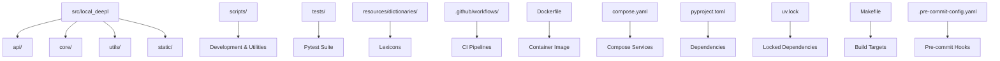
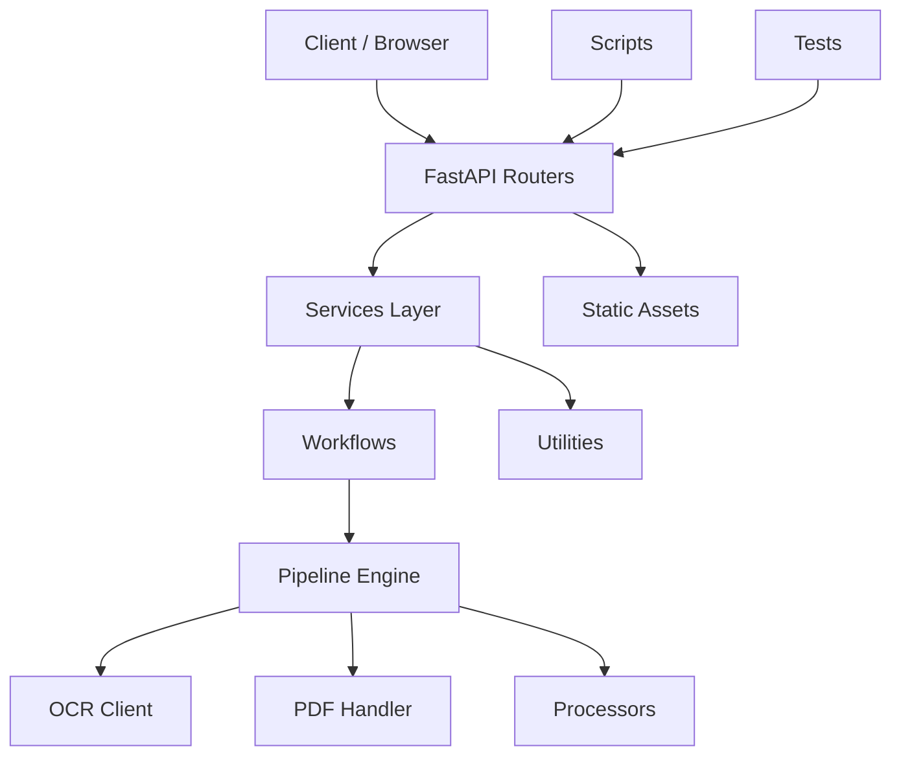
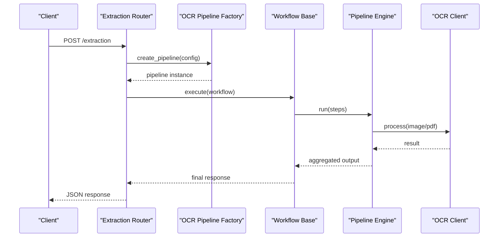
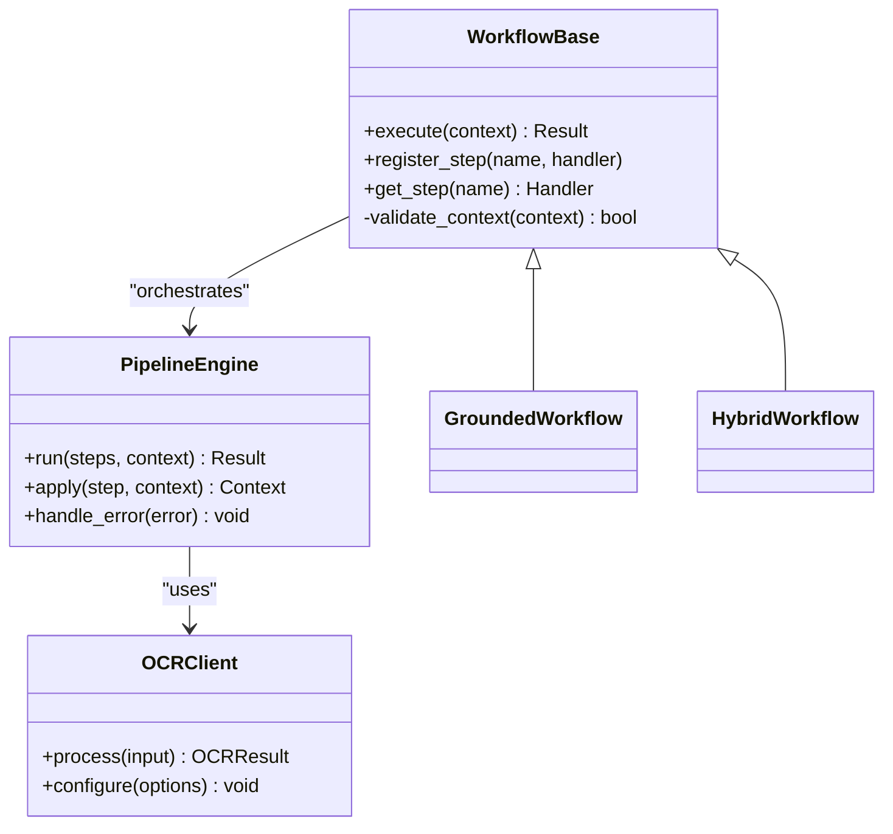
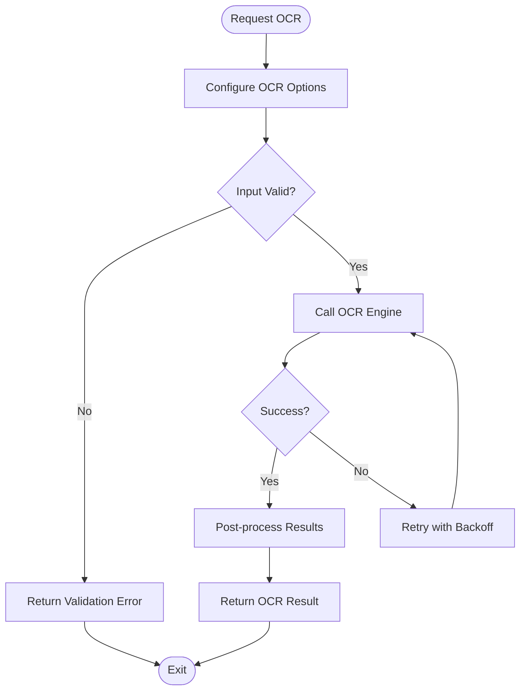
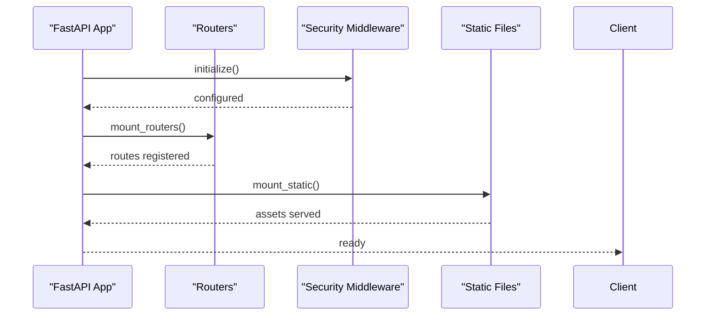
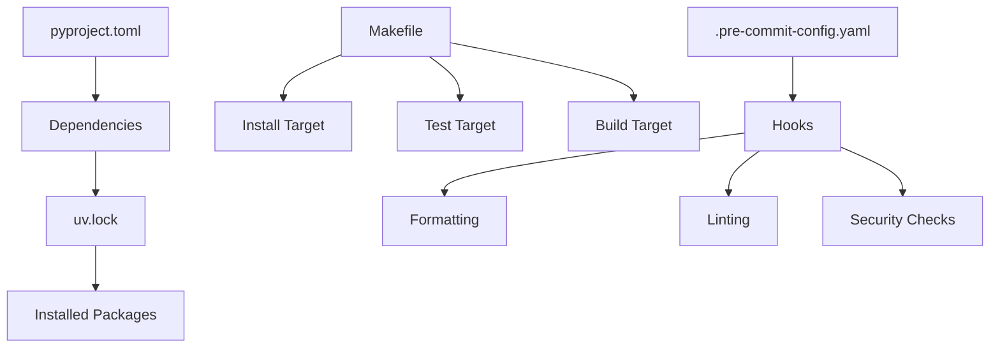

# Developer Guide

<cite>
**Referenced Files in This Document**
- [README.md](file://README.md)
- [pyproject.toml](file://pyproject.toml)
- [uv.lock](file://uv.lock)
- [Makefile](file://Makefile)
- [.pre-commit-config.yaml](file://.pre-commit-config.yaml)
- [Dockerfile](file://Dockerfile)
- [compose.yaml](file://compose.yaml)
- [src/local_deepl/server.py](file://src/local_deepl/server.py)
- [src/local_deepl/pipeline.py](file://src/local_deepl/pipeline.py)
- [src/local_deepl/core/workflows/base.py](file://src/local_deepl/core/workflows/base.py)
- [src/local_deepl/core/ocr/client.py](file://src/local_deepl/core/ocr/client.py)
- [src/local_deepl/api/routers/extraction.py](file://src/local_deepl/api/routers/extraction.py)
- [src/local_deepl/api/services/ocr_pipeline_factory.py](file://src/local_deepl/api/services/ocr_pipeline_factory.py)
- [scripts/dev.py](file://scripts/dev.py)
- [tests/conftest.py](file://tests/conftest.py)
- [tests/test_integration.py](file://tests/test_integration.py)
- [tests/test_ocr.py](file://tests/test_ocr.py)
</cite>

## Table of Contents
1. Introduction
2. Project Structure
3. Core Components
4. Architecture Overview
5. Detailed Component Analysis
6. Dependency Analysis
7. Performance Considerations
8. Troubleshooting Guide
9. Conclusion
10. Appendices

## Introduction
This Developer Guide explains how to set up a local development environment for LocalDeepL, how the codebase is organized, and how to contribute effectively. It covers Python environment configuration with uv, dependency management, pre-commit hooks, build system via Makefile targets, testing practices, and guidelines for extending functionality such as adding new OCR engines. The guide also provides debugging techniques, common issues, and code review processes to help maintain high quality and consistency across contributions.

## Project Structure
LocalDeepL follows a modular structure that separates API layers, core processing logic, utilities, static assets, scripts, tests, and configuration:
- src/local_deepl: Main application package containing API routers, services, core modules (OCR, PDF, processors, workflows), and utilities.
- scripts: Development and utility scripts for debugging, evaluation, visualization, and fixtures.
- tests: Pytest-based test suite with fixtures and integration tests.
- resources/dictionaries: Lexicons and dictionaries used by postprocessing or translation features.
- docs/superpowers: Design specs and plans for advanced features.
- .github/workflows: CI pipelines for nightly builds, releases, and tests.
- Dockerfile and compose.yaml: Containerization and orchestration for development and deployment.
- pyproject.toml and uv.lock: Dependency definitions and lock file managed by uv.
- Makefile: Build and development automation targets.
- .pre-commit-config.yaml: Pre-commit hooks for code quality and formatting.

**Section sources**
- [README.md](file://README.md)
- [pyproject.toml](file://pyproject.toml)
- [uv.lock](file://uv.lock)
- [Makefile](file://Makefile)
- [.pre-commit-config.yaml](file://.pre-commit-config.yaml)
- [Dockerfile](file://Dockerfile)
- [compose.yaml](file://compose.yaml)

## Core Components
Key components include:
- API layer: FastAPI routers and services exposing endpoints for extraction, jobs, OCR, translation, artifacts, and state management.
- Core modules: OCR client, processors, workflows, PDF handling, grounding, alignment, translation engines, and document models.
- Utilities: File and image helpers, security utilities, and progress bar patches.
- Static assets: Frontend HTML/CSS/JS served alongside the API.
- Scripts: Development tools for debugging, evaluation, and fixture generation.
- Tests: Comprehensive pytest suite covering unit, integration, and workflow behaviors.

**Section sources**
- [src/local_deepl/server.py](file://src/local_deepl/server.py)
- [src/local_deepl/pipeline.py](file://src/local_deepl/pipeline.py)
- [src/local_deepl/core/workflows/base.py](file://src/local_deepl/core/workflows/base.py)
- [src/local_deepl/core/ocr/client.py](file://src/local_deepl/core/ocr/client.py)
- [src/local_deepl/api/routers/extraction.py](file://src/local_deepl/api/routers/extraction.py)
- [src/local_deepl/api/services/ocr_pipeline_factory.py](file://src/local_deepl/api/services/ocr_pipeline_factory.py)

## Architecture Overview
LocalDeepL uses a layered architecture:
- API routers receive requests and delegate to services.
- Services orchestrate workflows and pipeline execution.
- Core modules implement OCR, PDF processing, grounding, translation, and document manipulation.
- Utilities provide cross-cutting concerns like file handling, image processing, and security.
- Static assets are served for the web interface.
- Scripts support development tasks and evaluation.
- Tests validate behavior across units and integrations.

**Diagram sources**
- [src/local_deepl/server.py](file://src/local_deepl/server.py)
- [src/local_deepl/api/routers/extraction.py](file://src/local_deepl/api/routers/extraction.py)
- [src/local_deepl/api/services/ocr_pipeline_factory.py](file://src/local_deepl/api/services/ocr_pipeline_factory.py)
- [src/local_deepl/core/workflows/base.py](file://src/local_deepl/core/workflows/base.py)
- [src/local_deepl/core/ocr/client.py](file://src/local_deepl/core/ocr/client.py)

## Detailed Component Analysis

### API Layer and Extraction Flow
The API exposes endpoints for document extraction and related operations. Requests flow through routers into services which coordinate workflows and pipeline execution.

**Diagram sources**
- [src/local_deepl/api/routers/extraction.py](file://src/local_deepl/api/routers/extraction.py)
- [src/local_deepl/api/services/ocr_pipeline_factory.py](file://src/local_deepl/api/services/ocr_pipeline_factory.py)
- [src/local_deepl/core/workflows/base.py](file://src/local_deepl/core/workflows/base.py)
- [src/local_deepl/core/ocr/client.py](file://src/local_deepl/core/ocr/client.py)

**Section sources**
- [src/local_deepl/api/routers/extraction.py](file://src/local_deepl/api/routers/extraction.py)
- [src/local_deepl/api/services/ocr_pipeline_factory.py](file://src/local_deepl/api/services/ocr_pipeline_factory.py)
- [src/local_deepl/core/workflows/base.py](file://src/local_deepl/core/workflows/base.py)
- [src/local_deepl/core/ocr/client.py](file://src/local_deepl/core/ocr/client.py)

### Workflows and Pipeline Orchestration
Workflows define sequences of processing steps. The base workflow class provides common behavior and extension points. The pipeline engine coordinates step execution and data passing.

**Diagram sources**
- [src/local_deepl/core/workflows/base.py](file://src/local_deepl/core/workflows/base.py)
- [src/local_deepl/core/ocr/client.py](file://src/local_deepl/core/ocr/client.py)

**Section sources**
- [src/local_deepl/core/workflows/base.py](file://src/local_deepl/core/workflows/base.py)
- [src/local_deepl/pipeline.py](file://src/local_deepl/pipeline.py)

### OCR Client and Resilience
The OCR client encapsulates OCR engine interactions, including configuration and error handling. Resilience strategies ensure robustness against transient failures.

**Diagram sources**
- [src/local_deepl/core/ocr/client.py](file://src/local_deepl/core/ocr/client.py)

**Section sources**
- [src/local_deepl/core/ocr/client.py](file://src/local_deepl/core/ocr/client.py)

### Server Initialization and Static Assets
The server initializes the FastAPI application, mounts routers, and serves static assets. It integrates middleware for security and CORS.

**Diagram sources**
- [src/local_deepl/server.py](file://src/local_deepl/server.py)

**Section sources**
- [src/local_deepl/server.py](file://src/local_deepl/server.py)

## Dependency Analysis
LocalDeepL manages dependencies using pyproject.toml and uv.lock. The Makefile provides targets for installing dependencies, running tests, and building containers. Pre-commit hooks enforce code quality standards.

**Diagram sources**
- [pyproject.toml](file://pyproject.toml)
- [uv.lock](file://uv.lock)
- [Makefile](file://Makefile)
- [.pre-commit-config.yaml](file://.pre-commit-config.yaml)

**Section sources**
- [pyproject.toml](file://pyproject.toml)
- [uv.lock](file://uv.lock)
- [Makefile](file://Makefile)
- [.pre-commit-config.yaml](file://.pre-commit-config.yaml)

## Performance Considerations
- Use efficient OCR backends and configure timeouts appropriately.
- Cache frequently accessed resources like dictionaries and models where possible.
- Optimize image preprocessing to reduce memory usage and improve throughput.
- Leverage asynchronous processing for long-running tasks when applicable.
- Monitor resource consumption during development and production deployments.

[No sources needed since this section provides general guidance]

## Troubleshooting Guide
Common development issues and solutions:
- Environment setup problems: Ensure Python version compatibility and use uv for consistent dependency resolution.
- Import errors: Verify module paths and package initialization files.
- Test failures: Check fixtures and mock configurations; run tests in isolation to identify flaky behavior.
- Debugging APIs: Use development scripts to simulate requests and inspect intermediate outputs.
- Pre-commit hook failures: Review linting and formatting rules; fix reported issues before committing.

**Section sources**
- [scripts/dev.py](file://scripts/dev.py)
- [tests/conftest.py](file://tests/conftest.py)
- [tests/test_integration.py](file://tests/test_integration.py)
- [tests/test_ocr.py](file://tests/test_ocr.py)

## Conclusion
This guide provides a comprehensive overview of LocalDeepL's development environment, architecture, and contribution practices. By following the outlined setup procedures, coding standards, and testing approaches, contributors can effectively extend functionality, maintain code quality, and collaborate efficiently within the project.

[No sources needed since this section summarizes without analyzing specific files]

## Appendices

### Development Setup with uv
- Install uv if not already available.
- Create and activate a virtual environment using uv.
- Install dependencies from pyproject.toml and uv.lock.
- Run development server and verify static assets load correctly.

**Section sources**
- [pyproject.toml](file://pyproject.toml)
- [uv.lock](file://uv.lock)
- [Makefile](file://Makefile)

### Pre-commit Hook Configuration
- Install pre-commit hooks defined in .pre-commit-config.yaml.
- Configure hooks for formatting, linting, and security checks.
- Commit changes after resolving any hook-reported issues.

**Section sources**
- [.pre-commit-config.yaml](file://.pre-commit-config.yaml)

### Adding New Features
- Extend existing workflows or create new ones following the base class patterns.
- Implement new OCR engines by adhering to the client interface.
- Add API endpoints under appropriate routers and services.
- Write comprehensive tests covering unit and integration scenarios.
- Update documentation and examples as needed.

**Section sources**
- [src/local_deepl/core/workflows/base.py](file://src/local_deepl/core/workflows/base.py)
- [src/local_deepl/core/ocr/client.py](file://src/local_deepl/core/ocr/client.py)
- [src/local_deepl/api/routers/extraction.py](file://src/local_deepl/api/routers/extraction.py)
- [tests/test_integration.py](file://tests/test_integration.py)

### Testing Framework and Practices
- Use pytest for test organization and execution.
- Leverage fixtures in conftest.py for shared test data.
- Follow naming conventions for test files and functions.
- Include both unit and integration tests for critical paths.

**Section sources**
- [tests/conftest.py](file://tests/conftest.py)
- [tests/test_integration.py](file://tests/test_integration.py)
- [tests/test_ocr.py](file://tests/test_ocr.py)

### Build System and Makefile Targets
- Use make install to set up dependencies.
- Run make test to execute the test suite.
- Execute make build for containerized builds.
- Utilize other targets for development utilities and cleanup.

**Section sources**
- [Makefile](file://Makefile)

### Containerization and Deployment
- Build Docker images using the provided Dockerfile.
- Use compose.yaml for local service orchestration.
- Configure environment variables for different deployment targets.

**Section sources**
- [Dockerfile](file://Dockerfile)
- [compose.yaml](file://compose.yaml)