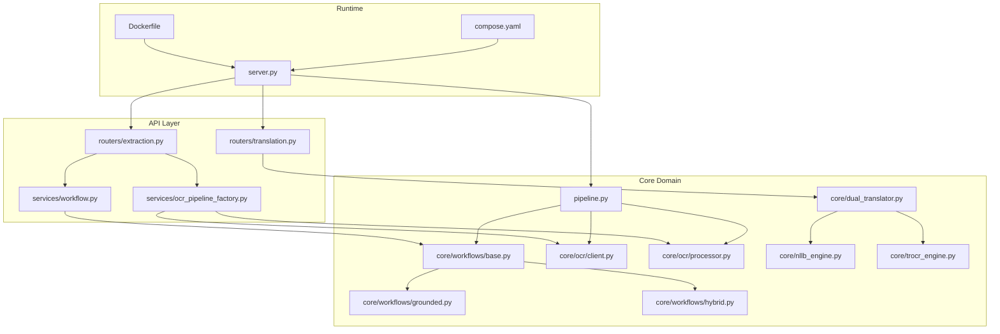
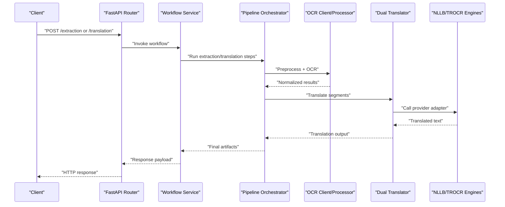
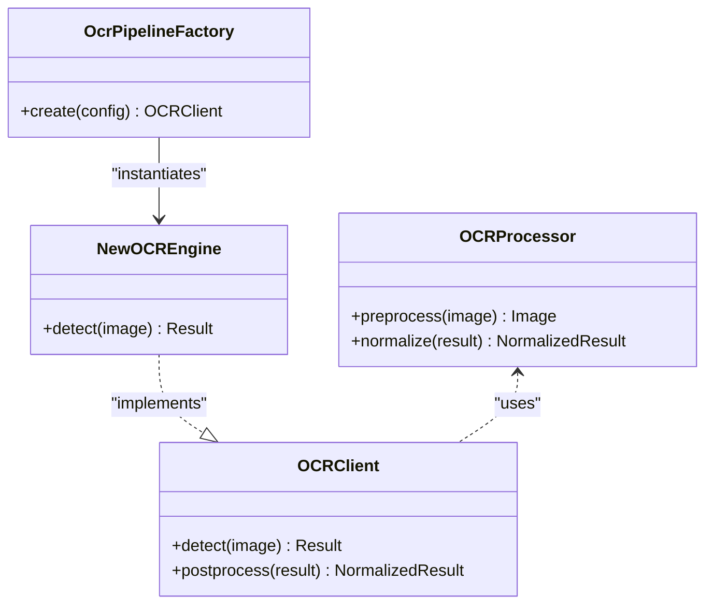
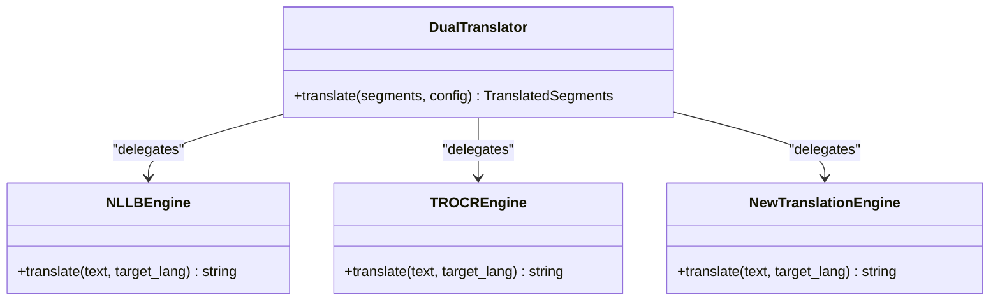
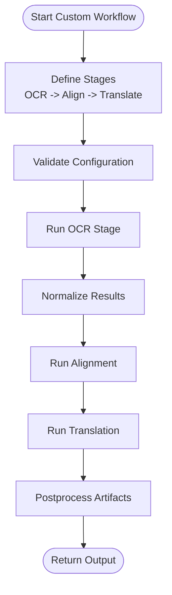
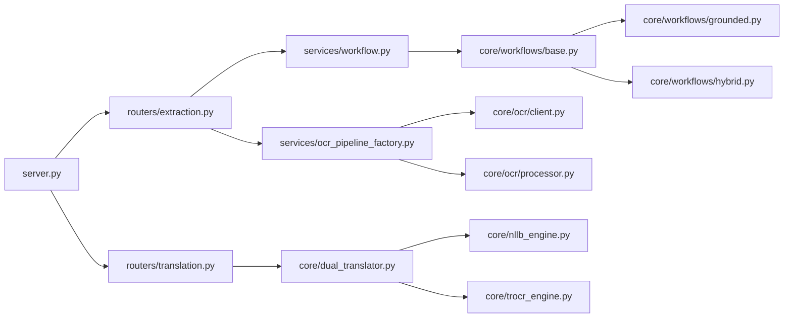

# Developer Guide

<cite>
**Referenced Files in This Document**
- [README.md](file://README.md)
- [ARCHITECTURE.md](file://ARCHITECTURE.md)
- [pyproject.toml](file://pyproject.toml)
- [.pre-commit-config.yaml](file://.pre-commit-config.yaml)
- [Dockerfile](file://Dockerfile)
- [compose.yaml](file://compose.yaml)
- [src/local_deepl/server.py](file://src/local_deepl/server.py)
- [src/local_deepl/pipeline.py](file://src/local_deepl/pipeline.py)
- [src/local_deepl/core/ocr/client.py](file://src/local_deepl/core/ocr/client.py)
- [src/local_deepl/core/ocr/processor.py](file://src/local_deepl/core/ocr/processor.py)
- [src/local_deepl/core/workflows/base.py](file://src/local_deepl/core/workflows/base.py)
- [src/local_deepl/core/workflows/grounded.py](file://src/local_deepl/core/workflows/grounded.py)
- [src/local_deepl/core/workflows/hybrid.py](file://src/local_deepl/core/workflows/hybrid.py)
- [src/local_deepl/api/routers/extraction.py](file://src/local_deepl/api/routers/extraction.py)
- [src/local_deepl/api/routers/translation.py](file://src/local_deepl/api/routers/translation.py)
- [src/local_deepl/api/services/ocr_pipeline_factory.py](file://src/local_deepl/api/services/ocr_pipeline_factory.py)
- [src/local_deepl/api/services/workflow.py](file://src/local_deepl/api/services/workflow.py)
- [src/local_deepl/core/dual_translator.py](file://src/local_deepl/core/dual_translator.py)
- [src/local_deepl/core/nllb_engine.py](file://src/local_deepl/core/nllb_engine.py)
- [src/local_deepl/core/trocr_engine.py](file://src/local_deepl/core/trocr_engine.py)
- [tests/conftest.py](file://tests/conftest.py)
- [tests/test_integration.py](file://tests/test_integration.py)
- [tests/test_ocr.py](file://tests/test_ocr.py)
- [tests/test_workflows_base.py](file://tests/test_workflows_base.py)
- [tests/test_workflows_grounded.py](file://tests/test_workflows_grounded.py)
- [tests/test_workflows_hybrid.py](file://tests/test_workflows_hybrid.py)
- [scripts/debug_alignment.py](file://scripts/debug_alignment.py)
- [scripts/visualize_bboxes.py](file://scripts/visualize_bboxes.py)
</cite>

## Table of Contents
1. Introduction
2. Project Structure
3. Core Components
4. Architecture Overview
5. Detailed Component Analysis
6. Dependency Analysis
7. Performance Considerations
8. Troubleshooting Guide
9. Conclusion
10. Appendices

## Introduction
This Developer Guide explains how to contribute to LocalDeepL, set up a local development environment, understand the code organization and architectural conventions, and extend functionality with new OCR engines, translation providers, and processing workflows. It also documents testing strategies, debugging techniques, profiling methods, and standards for code review, commits, and documentation.

## Project Structure
LocalDeepL is organized into clear layers:
- API layer (FastAPI routers, services, schemas)
- Core domain logic (OCR, workflows, translation, document processing)
- Utilities and resources
- Tests and scripts for evaluation and debugging
- Build and deployment artifacts

**Diagram sources**
- [src/local_deepl/server.py](file://src/local_deepl/server.py)
- [src/local_deepl/pipeline.py](file://src/local_deepl/pipeline.py)
- [src/local_deepl/api/routers/extraction.py](file://src/local_deepl/api/routers/extraction.py)
- [src/local_deepl/api/routers/translation.py](file://src/local_deepl/api/routers/translation.py)
- [src/local_deepl/api/services/ocr_pipeline_factory.py](file://src/local_deepl/api/services/ocr_pipeline_factory.py)
- [src/local_deepl/api/services/workflow.py](file://src/local_deepl/api/services/workflow.py)
- [src/local_deepl/core/workflows/base.py](file://src/local_deepl/core/workflows/base.py)
- [src/local_deepl/core/workflows/grounded.py](file://src/local_deepl/core/workflows/grounded.py)
- [src/local_deepl/core/workflows/hybrid.py](file://src/local_deepl/core/workflows/hybrid.py)
- [src/local_deepl/core/ocr/client.py](file://src/local_deepl/core/ocr/client.py)
- [src/local_deepl/core/ocr/processor.py](file://src/local_deepl/core/ocr/processor.py)
- [src/local_deepl/core/dual_translator.py](file://src/local_deepl/core/dual_translator.py)
- [src/local_deepl/core/nllb_engine.py](file://src/local_deepl/core/nllb_engine.py)
- [src/local_deepl/core/trocr_engine.py](file://src/local_deepl/core/trocr_engine.py)
- [Dockerfile](file://Dockerfile)
- [compose.yaml](file://compose.yaml)

**Section sources**
- [README.md](file://README.md)
- [ARCHITECTURE.md](file://ARCHITECTURE.md)
- [pyproject.toml](file://pyproject.toml)

## Core Components
- Server entrypoint and application wiring
- Pipeline orchestration for extraction and translation
- OCR client and processor abstractions
- Workflow base and concrete implementations (grounded, hybrid)
- Translation subsystem with dual translator and engine adapters

Key responsibilities:
- server.py: FastAPI app initialization, middleware, static assets, and startup/shutdown hooks
- pipeline.py: End-to-end orchestration across OCR, alignment, translation, and export
- core/ocr/client.py: Abstraction over OCR backends
- core/ocr/processor.py: Pre/post-processing and OCR result normalization
- core/workflows/base.py: Abstract workflow interface and shared utilities
- core/workflows/grounded.py and hybrid.py: Concrete strategies combining OCR, grounding, and translation
- api/routers/*: HTTP endpoints for extraction and translation
- api/services/*: Service-layer composition and configuration
- core/dual_translator.py: Multi-provider translation coordination
- core/nllb_engine.py and core/trocr_engine.py: Provider-specific adapters

**Section sources**
- [src/local_deepl/server.py](file://src/local_deepl/server.py)
- [src/local_deepl/pipeline.py](file://src/local_deepl/pipeline.py)
- [src/local_deepl/core/ocr/client.py](file://src/local_deepl/core/ocr/client.py)
- [src/local_deepl/core/ocr/processor.py](file://src/local_deepl/core/ocr/processor.py)
- [src/local_deepl/core/workflows/base.py](file://src/local_deepl/core/workflows/base.py)
- [src/local_deepl/core/workflows/grounded.py](file://src/local_deepl/core/workflows/grounded.py)
- [src/local_deepl/core/workflows/hybrid.py](file://src/local_deepl/core/workflows/hybrid.py)
- [src/local_deepl/api/routers/extraction.py](file://src/local_deepl/api/routers/extraction.py)
- [src/local_deepl/api/routers/translation.py](file://src/local_deepl/api/routers/translation.py)
- [src/local_deepl/api/services/ocr_pipeline_factory.py](file://src/local_deepl/api/services/ocr_pipeline_factory.py)
- [src/local_deepl/api/services/workflow.py](file://src/local_deepl/api/services/workflow.py)
- [src/local_deepl/core/dual_translator.py](file://src/local_deepl/core/dual_translator.py)
- [src/local_deepl/core/nllb_engine.py](file://src/local_deepl/core/nllb_engine.py)
- [src/local_deepl/core/trocr_engine.py](file://src/local_deepl/core/trocr_engine.py)

## Architecture Overview
The system follows a layered architecture:
- API layer exposes REST endpoints and composes service calls
- Services coordinate pipelines and workflows
- Core provides reusable domain components (OCR, translation, workflows)
- Engines implement provider-specific logic
- Runtime packaging via Docker and Compose

**Diagram sources**
- [src/local_deepl/api/routers/extraction.py](file://src/local_deepl/api/routers/extraction.py)
- [src/local_deepl/api/routers/translation.py](file://src/local_deepl/api/routers/translation.py)
- [src/local_deepl/api/services/workflow.py](file://src/local_deepl/api/services/workflow.py)
- [src/local_deepl/pipeline.py](file://src/local_deepl/pipeline.py)
- [src/local_deepl/core/ocr/client.py](file://src/local_deepl/core/ocr/client.py)
- [src/local_deepl/core/ocr/processor.py](file://src/local_deepl/core/ocr/processor.py)
- [src/local_deepl/core/dual_translator.py](file://src/local_deepl/core/dual_translator.py)
- [src/local_deepl/core/nllb_engine.py](file://src/local_deepl/core/nllb_engine.py)
- [src/local_deepl/core/trocr_engine.py](file://src/local_deepl/core/trocr_engine.py)

## Detailed Component Analysis

### Development Environment Setup
- Use the Python project configuration to manage dependencies and tooling.
- Containerized runtime is provided via Docker and Compose for consistent environments.
- Pre-commit hooks enforce formatting and linting before commits.

Recommended steps:
- Install dependencies using the project’s dependency file.
- Configure environment variables for OCR and translation providers.
- Run the server locally or via Docker Compose.
- Enable pre-commit hooks to maintain code quality.

**Section sources**
- [pyproject.toml](file://pyproject.toml)
- [Dockerfile](file://Dockerfile)
- [compose.yaml](file://compose.yaml)
- [.pre-commit-config.yaml](file://.pre-commit-config.yaml)

### Code Organization Principles
- Layered separation: API routers delegate to services; services compose core components.
- Clear module boundaries: OCR, workflows, translation, and utilities are isolated.
- Configuration-driven behavior: Providers and engines selected via settings.
- Extensibility points: Factory patterns for OCR pipelines and abstract interfaces for workflows and engines.

**Section sources**
- [src/local_deepl/api/services/ocr_pipeline_factory.py](file://src/local_deepl/api/services/ocr_pipeline_factory.py)
- [src/local_deepl/core/workflows/base.py](file://src/local_deepl/core/workflows/base.py)
- [src/local_deepl/core/dual_translator.py](file://src/local_deepl/core/dual_translator.py)

### Architectural Conventions
- Workflows implement a common base interface for consistency.
- OCR clients encapsulate backend differences; processors normalize outputs.
- Translation uses a dual translator that coordinates multiple engines.
- Routers focus on request/response handling and validation.

**Section sources**
- [src/local_deepl/core/workflows/base.py](file://src/local_deepl/core/workflows/base.py)
- [src/local_deepl/core/workflows/grounded.py](file://src/local_deepl/core/workflows/grounded.py)
- [src/local_deepl/core/workflows/hybrid.py](file://src/local_deepl/core/workflows/hybrid.py)
- [src/local_deepl/core/ocr/client.py](file://src/local_deepl/core/ocr/client.py)
- [src/local_deepl/core/ocr/processor.py](file://src/local_deepl/core/ocr/processor.py)
- [src/local_deepl/core/dual_translator.py](file://src/local_deepl/core/dual_translator.py)

### Testing Strategy
- Unit tests validate individual components such as OCR, workflows, and translation.
- Integration tests exercise end-to-end flows through the API and pipeline.
- Shared fixtures and test configuration centralize setup.

Guidelines:
- Place unit tests near the modules they cover.
- Use fixtures for sample inputs and mock external providers when needed.
- Prefer deterministic assertions for OCR and translation outputs where possible.

**Section sources**
- [tests/conftest.py](file://tests/conftest.py)
- [tests/test_ocr.py](file://tests/test_ocr.py)
- [tests/test_workflows_base.py](file://tests/test_workflows_base.py)
- [tests/test_workflows_grounded.py](file://tests/test_workflows_grounded.py)
- [tests/test_workflows_hybrid.py](file://tests/test_workflows_hybrid.py)
- [tests/test_integration.py](file://tests/test_integration.py)

### Adding a New OCR Engine
Steps:
- Implement an OCR client adhering to the existing abstraction.
- Provide preprocessing and postprocessing hooks if needed.
- Register the engine via the OCR pipeline factory.
- Add unit tests covering detection, normalization, and error paths.
- Optionally add integration tests against sample documents.

**Diagram sources**
- [src/local_deepl/core/ocr/client.py](file://src/local_deepl/core/ocr/client.py)
- [src/local_deepl/core/ocr/processor.py](file://src/local_deepl/core/ocr/processor.py)
- [src/local_deepl/api/services/ocr_pipeline_factory.py](file://src/local_deepl/api/services/ocr_pipeline_factory.py)

**Section sources**
- [src/local_deepl/core/ocr/client.py](file://src/local_deepl/core/ocr/client.py)
- [src/local_deepl/core/ocr/processor.py](file://src/local_deepl/core/ocr/processor.py)
- [src/local_deepl/api/services/ocr_pipeline_factory.py](file://src/local_deepl/api/services/ocr_pipeline_factory.py)
- [tests/test_ocr.py](file://tests/test_ocr.py)

### Adding a New Translation Provider
Steps:
- Create an engine adapter implementing the expected interface.
- Integrate with the dual translator by registering the new engine.
- Add unit tests for translation requests, retries, and error handling.
- Include integration tests with mocked provider responses.

**Diagram sources**
- [src/local_deepl/core/dual_translator.py](file://src/local_deepl/core/dual_translator.py)
- [src/local_deepl/core/nllb_engine.py](file://src/local_deepl/core/nllb_engine.py)
- [src/local_deepl/core/trocr_engine.py](file://src/local_deepl/core/trocr_engine.py)

**Section sources**
- [src/local_deepl/core/dual_translator.py](file://src/local_deepl/core/dual_translator.py)
- [src/local_deepl/core/nllb_engine.py](file://src/local_deepl/core/nllb_engine.py)
- [src/local_deepl/core/trocr_engine.py](file://src/local_deepl/core/trocr_engine.py)
- [tests/test_translation_callbacks.py](file://tests/test_translation_callbacks.py)

### Extending Processing Workflows
Steps:
- Subclass the workflow base to define custom stages.
- Compose OCR, alignment, and translation steps as needed.
- Wire the workflow via the workflow service and expose it through an API router.
- Add tests for each stage and end-to-end scenarios.

**Diagram sources**
- [src/local_deepl/core/workflows/base.py](file://src/local_deepl/core/workflows/base.py)
- [src/local_deepl/core/workflows/grounded.py](file://src/local_deepl/core/workflows/grounded.py)
- [src/local_deepl/core/workflows/hybrid.py](file://src/local_deepl/core/workflows/hybrid.py)
- [src/local_deepl/api/services/workflow.py](file://src/local_deepl/api/services/workflow.py)

**Section sources**
- [src/local_deepl/core/workflows/base.py](file://src/local_deepl/core/workflows/base.py)
- [src/local_deepl/core/workflows/grounded.py](file://src/local_deepl/core/workflows/grounded.py)
- [src/local_deepl/core/workflows/hybrid.py](file://src/local_deepl/core/workflows/hybrid.py)
- [src/local_deepl/api/services/workflow.py](file://src/local_deepl/api/services/workflow.py)
- [tests/test_workflows_base.py](file://tests/test_workflows_base.py)
- [tests/test_workflows_grounded.py](file://tests/test_workflows_grounded.py)
- [tests/test_workflows_hybrid.py](file://tests/test_workflows_hybrid.py)

### API Extension Patterns
- Add new endpoints under api/routers with request/response schemas.
- Delegate business logic to services in api/services.
- Use the pipeline orchestrator for complex operations.
- Ensure proper error handling and status codes.

**Section sources**
- [src/local_deepl/api/routers/extraction.py](file://src/local_deepl/api/routers/extraction.py)
- [src/local_deepl/api/routers/translation.py](file://src/local_deepl/api/routers/translation.py)
- [src/local_deepl/pipeline.py](file://src/local_deepl/pipeline.py)

## Dependency Analysis
High-level dependencies:
- server.py depends on routers and services
- routers depend on services and schemas
- services depend on core components (workflows, OCR, translation)
- engines implement provider-specific logic used by higher layers

**Diagram sources**
- [src/local_deepl/server.py](file://src/local_deepl/server.py)
- [src/local_deepl/api/routers/extraction.py](file://src/local_deepl/api/routers/extraction.py)
- [src/local_deepl/api/routers/translation.py](file://src/local_deepl/api/routers/translation.py)
- [src/local_deepl/api/services/workflow.py](file://src/local_deepl/api/services/workflow.py)
- [src/local_deepl/api/services/ocr_pipeline_factory.py](file://src/local_deepl/api/services/ocr_pipeline_factory.py)
- [src/local_deepl/core/workflows/base.py](file://src/local_deepl/core/workflows/base.py)
- [src/local_deepl/core/workflows/grounded.py](file://src/local_deepl/core/workflows/grounded.py)
- [src/local_deepl/core/workflows/hybrid.py](file://src/local_deepl/core/workflows/hybrid.py)
- [src/local_deepl/core/ocr/client.py](file://src/local_deepl/core/ocr/client.py)
- [src/local_deepl/core/ocr/processor.py](file://src/local_deepl/core/ocr/processor.py)
- [src/local_deepl/core/dual_translator.py](file://src/local_deepl/core/dual_translator.py)
- [src/local_deepl/core/nllb_engine.py](file://src/local_deepl/core/nllb_engine.py)
- [src/local_deepl/core/trocr_engine.py](file://src/local_deepl/core/trocr_engine.py)

**Section sources**
- [src/local_deepl/server.py](file://src/local_deepl/server.py)
- [src/local_deepl/api/routers/extraction.py](file://src/local_deepl/api/routers/extraction.py)
- [src/local_deepl/api/routers/translation.py](file://src/local_deepl/api/routers/translation.py)
- [src/local_deepl/api/services/workflow.py](file://src/local_deepl/api/services/workflow.py)
- [src/local_deepl/api/services/ocr_pipeline_factory.py](file://src/local_deepl/api/services/ocr_pipeline_factory.py)
- [src/local_deepl/core/workflows/base.py](file://src/local_deepl/core/workflows/base.py)
- [src/local_deepl/core/workflows/grounded.py](file://src/local_deepl/core/workflows/grounded.py)
- [src/local_deepl/core/workflows/hybrid.py](file://src/local_deepl/core/workflows/hybrid.py)
- [src/local_deepl/core/ocr/client.py](file://src/local_deepl/core/ocr/client.py)
- [src/local_deepl/core/ocr/processor.py](file://src/local_deepl/core/ocr/processor.py)
- [src/local_deepl/core/dual_translator.py](file://src/local_deepl/core/dual_translator.py)
- [src/local_deepl/core/nllb_engine.py](file://src/local_deepl/core/nllb_engine.py)
- [src/local_deepl/core/trocr_engine.py](file://src/local_deepl/core/trocr_engine.py)

## Performance Considerations
- Profile hotspots in OCR and translation stages using standard Python profilers.
- Cache repeated translations and OCR results where appropriate.
- Batch process large documents to reduce overhead.
- Tune concurrency limits for OCR and translation providers.
- Monitor memory usage during image-heavy workflows.

[No sources needed since this section provides general guidance]

## Troubleshooting Guide
Debugging techniques:
- Use debug scripts to inspect intermediate outputs and bounding boxes.
- Visualize detection results to validate OCR accuracy.
- Check logs from routers and services for errors and timing information.
- Run targeted unit tests for suspected components.

Common checks:
- Verify provider credentials and network connectivity.
- Confirm input image formats and sizes.
- Validate configuration keys for engines and workflows.

**Section sources**
- [scripts/debug_alignment.py](file://scripts/debug_alignment.py)
- [scripts/visualize_bboxes.py](file://scripts/visualize_bboxes.py)
- [tests/test_integration.py](file://tests/test_integration.py)

## Conclusion
LocalDeepL’s layered design and extensible interfaces make it straightforward to add new OCR engines, translation providers, and workflows. Follow the established conventions, write comprehensive tests, and use the provided debugging tools to iterate quickly. Maintain code quality with pre-commit hooks and adhere to the documented commit and review practices.

[No sources needed since this section summarizes without analyzing specific files]

## Appendices

### Commit and Review Standards
- Use descriptive commit messages and link related issues.
- Keep changes focused and atomic.
- Ensure all tests pass and coverage remains stable.
- Request reviews for significant refactors or new integrations.

**Section sources**
- [.pre-commit-config.yaml](file://.pre-commit-config.yaml)
- [README.md](file://README.md)

### Documentation Standards
- Update relevant docs when adding features or changing APIs.
- Include examples and usage notes for new components.
- Keep diagrams and READMEs aligned with implementation.

**Section sources**
- [ARCHITECTURE.md](file://ARCHITECTURE.md)
- [README.md](file://README.md)