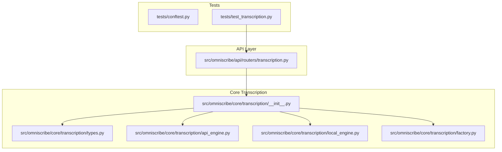
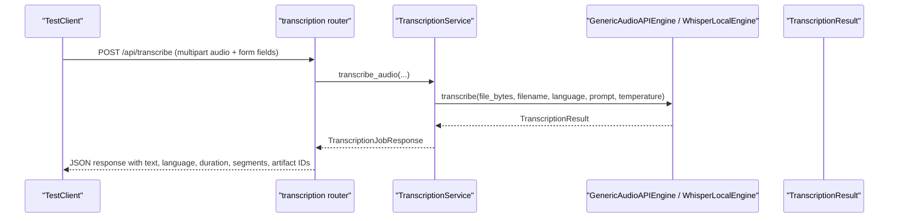
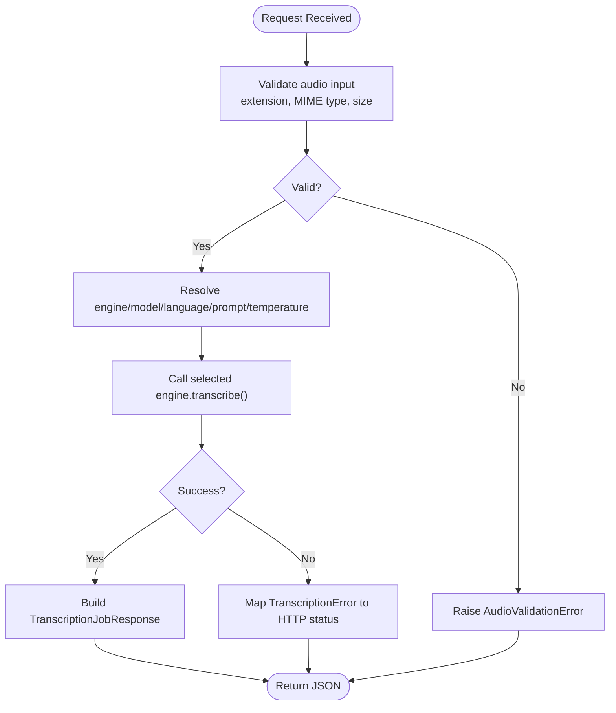
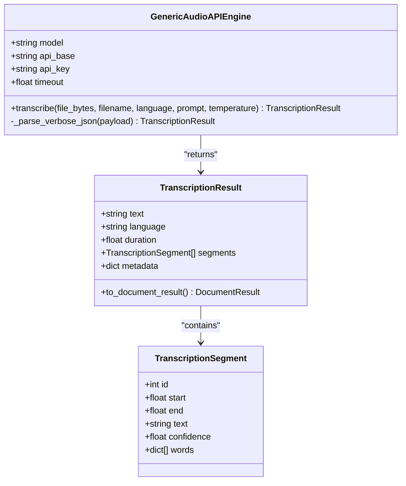
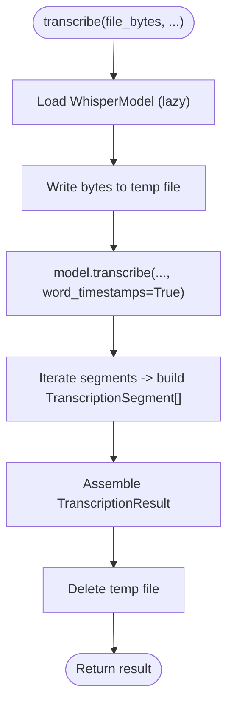
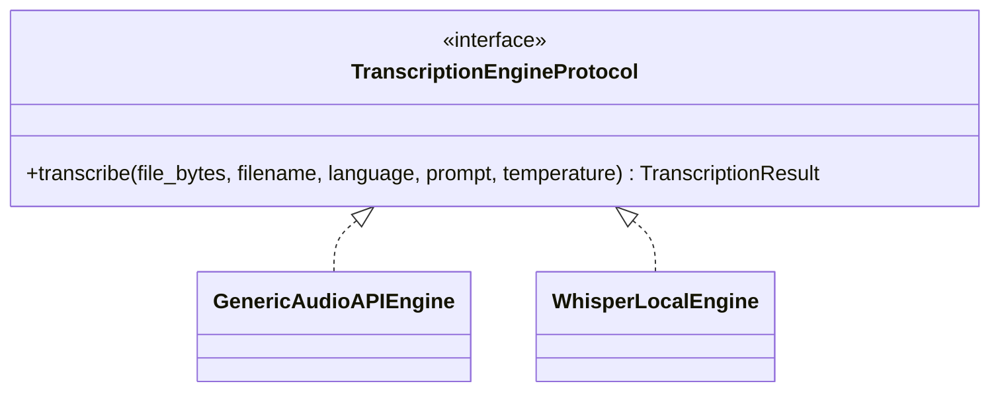
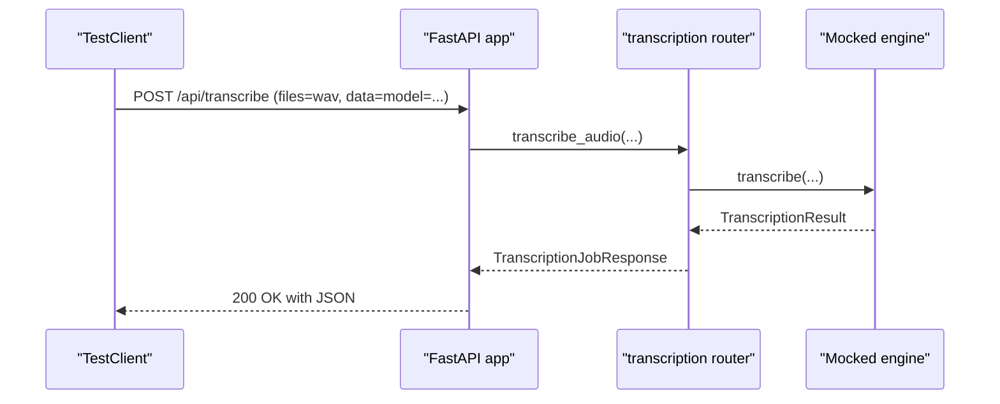
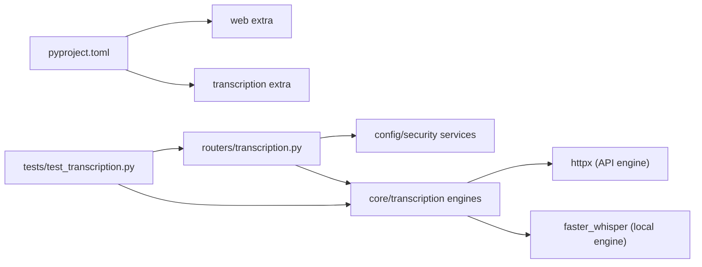

# Transcription Testing Suite

<cite>
**Referenced Files in This Document**
- [README.md](file://README.md)
- [ARCHITECTURE.md](file://ARCHITECTURE.md)
- [pyproject.toml](file://pyproject.toml)
- [tests/conftest.py](file://tests/conftest.py)
- [tests/test_transcription.py](file://tests/test_transcription.py)
- [src/omniscribe/api/routers/transcription.py](file://src/omniscribe/api/routers/transcription.py)
- [src/omniscribe/core/transcription/__init__.py](file://src/omniscribe/core/transcription/__init__.py)
- [src/omniscribe/core/transcription/types.py](file://src/omniscribe/core/transcription/types.py)
- [src/omniscribe/core/transcription/api_engine.py](file://src/omniscribe/core/transcription/api_engine.py)
- [src/omniscribe/core/transcription/local_engine.py](file://src/omniscribe/core/transcription/local_engine.py)
- [src/omniscribe/core/transcription/factory.py](file://src/omniscribe/core/transcription/factory.py)
</cite>

## Table of Contents
1. [Introduction](#introduction)
2. [Project Structure](#project-structure)
3. [Core Components](#core-components)
4. [Architecture Overview](#architecture-overview)
5. [Detailed Component Analysis](#detailed-component-analysis)
6. [Dependency Analysis](#dependency-analysis)
7. [Performance Considerations](#performance-considerations)
8. [Troubleshooting Guide](#troubleshooting-guide)
9. [Conclusion](#conclusion)

## Introduction
This document describes the Transcription Testing Suite for OmniScribe’s voice transcription feature. It explains how tests validate the FastAPI transcription endpoints, engine selection, input validation, error handling, and integration with both remote OpenAI-compatible APIs and a local faster-whisper engine. It also maps the test fixtures, shared configuration, and security middleware behavior to the production code paths.

## Project Structure
The transcription testing suite centers on:
- A FastAPI router that exposes /api/transcribe and configuration endpoints
- Core transcription engines (remote API and local whisper)
- Shared types and validation utilities
- Pytest fixtures and unit/integration tests

**Diagram sources**
- [tests/test_transcription.py:1-191](file://tests/test_transcription.py#L1-L191)
- [src/omniscribe/api/routers/transcription.py:1-153](file://src/omniscribe/api/routers/transcription.py#L1-L153)
- [src/omniscribe/core/transcription/__init__.py:1-38](file://src/omniscribe/core/transcription/__init__.py#L1-L38)
- [src/omniscribe/core/transcription/types.py:1-90](file://src/omniscribe/core/transcription/types.py#L1-L90)
- [src/omniscribe/core/transcription/api_engine.py:1-142](file://src/omniscribe/core/transcription/api_engine.py#L1-L142)
- [src/omniscribe/core/transcription/local_engine.py:1-122](file://src/omniscribe/core/transcription/local_engine.py#L1-L122)
- [src/omniscribe/core/transcription/factory.py:1-41](file://src/omniscribe/core/transcription/factory.py#L1-L41)

**Section sources**
- [README.md:1-116](file://README.md#L1-L116)
- [ARCHITECTURE.md:1-430](file://ARCHITECTURE.md#L1-L430)
- [pyproject.toml:1-261](file://pyproject.toml#L1-L261)

## Core Components
- Router: Exposes /api/transcribe, model discovery, and config endpoints; validates inputs and delegates to a service layer.
- Engines:
  - GenericAudioAPIEngine: Calls an OpenAI-compatible /v1/audio/transcriptions endpoint with retries and error mapping.
  - WhisperLocalEngine: Uses faster-whisper locally when available.
- Types: Defines TranscriptionSegment, TranscriptionResult, and TranscriptionError; includes conversion to DocumentResult for downstream processing.
- Validation: Enforces allowed audio extensions, MIME types, and size limits; raises typed errors with HTTP status codes.
- Factory: Selects the appropriate engine based on configuration or auto-detection.

**Section sources**
- [src/omniscribe/api/routers/transcription.py:1-153](file://src/omniscribe/api/routers/transcription.py#L1-L153)
- [src/omniscribe/core/transcription/api_engine.py:1-142](file://src/omniscribe/core/transcription/api_engine.py#L1-L142)
- [src/omniscribe/core/transcription/local_engine.py:1-122](file://src/omniscribe/core/transcription/local_engine.py#L1-L122)
- [src/omniscribe/core/transcription/types.py:1-90](file://src/omniscribe/core/transcription/types.py#L1-L90)
- [src/omniscribe/core/transcription/factory.py:1-41](file://src/omniscribe/core/transcription/factory.py#L1-L41)
- [src/omniscribe/core/transcription/__init__.py:1-38](file://src/omniscribe/core/transcription/__init__.py#L1-L38)

## Architecture Overview
The transcription flow integrates the FastAPI router, optional security middleware, and core engines. Tests mock network calls and assert response shapes, while also validating auth enforcement and configuration endpoints.

**Diagram sources**
- [src/omniscribe/api/routers/transcription.py:26-70](file://src/omniscribe/api/routers/transcription.py#L26-L70)
- [src/omniscribe/core/transcription/api_engine.py:39-111](file://src/omniscribe/core/transcription/api_engine.py#L39-L111)
- [src/omniscribe/core/transcription/local_engine.py:56-121](file://src/omniscribe/core/transcription/local_engine.py#L56-L121)
- [src/omniscribe/core/transcription/types.py:32-90](file://src/omniscribe/core/transcription/types.py#L32-L90)

## Detailed Component Analysis

### Router Endpoints and Error Handling
- POST /api/transcribe: Accepts multipart audio and form parameters; resolves engine/model from request or runtime config; returns structured JSON with artifact identifiers.
- GET /api/models/transcription: Attempts to fetch models from configured api_base; falls back to a curated list.
- GET/POST /api/config/transcription: Reads and updates runtime transcription settings; masks sensitive keys.
- Error mapping: AudioValidationError and TranscriptionError are converted to HTTP responses; generic exceptions return stable server error envelopes.

**Diagram sources**
- [src/omniscribe/api/routers/transcription.py:26-70](file://src/omniscribe/api/routers/transcription.py#L26-L70)
- [src/omniscribe/core/transcription/validation.py:1-200](file://src/omniscribe/core/transcription/validation.py#L1-L200)

**Section sources**
- [src/omniscribe/api/routers/transcription.py:1-153](file://src/omniscribe/api/routers/transcription.py#L1-L153)

### Remote API Engine
- Sends multipart POST to /v1/audio/transcriptions with verbose_json format.
- Retries transient errors with exponential backoff; maps 401/403/404 to specific TranscriptionError messages.
- Parses segments into TranscriptionSegment objects and aggregates full text.

**Diagram sources**
- [src/omniscribe/core/transcription/api_engine.py:20-142](file://src/omniscribe/core/transcription/api_engine.py#L20-L142)
- [src/omniscribe/core/transcription/types.py:20-90](file://src/omniscribe/core/transcription/types.py#L20-L90)

**Section sources**
- [src/omniscribe/core/transcription/api_engine.py:1-142](file://src/omniscribe/core/transcription/api_engine.py#L1-L142)
- [src/omniscribe/core/transcription/types.py:1-90](file://src/omniscribe/core/transcription/types.py#L1-L90)

### Local Whisper Engine
- Loads faster-whisper lazily; raises a typed error if the optional extra is missing.
- Writes audio bytes to a temporary file, transcribes with word timestamps, and constructs segments.
- Cleans up temp files after transcription.

**Diagram sources**
- [src/omniscribe/core/transcription/local_engine.py:24-122](file://src/omniscribe/core/transcription/local_engine.py#L24-L122)

**Section sources**
- [src/omniscribe/core/transcription/local_engine.py:1-122](file://src/omniscribe/core/transcription/local_engine.py#L1-L122)

### Factory and Protocol
- get_transcription_engine selects between API and local engines based on engine_type or auto-detection.
- TranscriptionEngineProtocol defines the interface for engines.

**Diagram sources**
- [src/omniscribe/core/transcription/factory.py:12-41](file://src/omniscribe/core/transcription/factory.py#L12-L41)
- [src/omniscribe/core/transcription/api_engine.py:20-142](file://src/omniscribe/core/transcription/api_engine.py#L20-L142)
- [src/omniscribe/core/transcription/local_engine.py:24-122](file://src/omniscribe/core/transcription/local_engine.py#L24-L122)

**Section sources**
- [src/omniscribe/core/transcription/factory.py:1-41](file://src/omniscribe/core/transcription/factory.py#L1-L41)

### Test Suite Highlights
- Input validation tests cover supported extensions, MIME types, and size limits.
- Engine factory tests verify correct instantiation and attribute propagation.
- Endpoint tests mock engine.transcribe and assert response shape including artifact IDs.
- Config endpoint tests ensure read/write semantics and key masking.
- Auth middleware tests enforce Bearer token requirements for transcription routes.

**Diagram sources**
- [tests/test_transcription.py:117-147](file://tests/test_transcription.py#L117-L147)
- [src/omniscribe/api/routers/transcription.py:26-70](file://src/omniscribe/api/routers/transcription.py#L26-L70)

**Section sources**
- [tests/test_transcription.py:1-191](file://tests/test_transcription.py#L1-L191)

## Dependency Analysis
- Optional extras:
  - transcription: enables faster-whisper local engine.
  - web: enables FastAPI, uvicorn, websockets, multipart parsing.
- Router depends on config and security services; engines depend on httpx (API) or faster-whisper (local).
- Tests rely on pytest-asyncio and FastAPI TestClient.

**Diagram sources**
- [pyproject.toml:41-95](file://pyproject.toml#L41-L95)
- [src/omniscribe/api/routers/transcription.py:1-153](file://src/omniscribe/api/routers/transcription.py#L1-L153)
- [src/omniscribe/core/transcription/api_engine.py:1-142](file://src/omniscribe/core/transcription/api_engine.py#L1-L142)
- [src/omniscribe/core/transcription/local_engine.py:1-122](file://src/omniscribe/core/transcription/local_engine.py#L1-L122)

**Section sources**
- [pyproject.toml:1-261](file://pyproject.toml#L1-L261)

## Performance Considerations
- API engine retries transient errors with short delays; consider tuning timeout and max attempts for high-latency endpoints.
- Local engine loads the model lazily and writes temporary files; ensure sufficient disk space and fast I/O for large audio files.
- Segment iteration builds lists in memory; for very long audio, monitor memory usage.

[No sources needed since this section provides general guidance]

## Troubleshooting Guide
- Missing optional dependencies:
  - Local engine raises a typed error if faster-whisper is not installed; install the transcription extra.
- Authentication failures:
  - 401/403 responses indicate invalid or missing API keys; verify headers and tokens.
- Model not found:
  - 404 indicates unsupported model or endpoint; check api_base and model name.
- Upload validation:
  - Unsupported extension/MIME or oversized files raise AudioValidationError with appropriate HTTP status.

**Section sources**
- [src/omniscribe/core/transcription/local_engine.py:18-41](file://src/omniscribe/core/transcription/local_engine.py#L18-L41)
- [src/omniscribe/core/transcription/api_engine.py:79-111](file://src/omniscribe/core/transcription/api_engine.py#L79-L111)
- [tests/test_transcription.py:19-36](file://tests/test_transcription.py#L19-L36)

## Conclusion
The Transcription Testing Suite comprehensively validates the voice transcription feature across input validation, engine selection, API interactions, configuration management, and security enforcement. By mocking external dependencies and asserting structured responses, it ensures reliability and maintainability of both remote and local transcription paths.