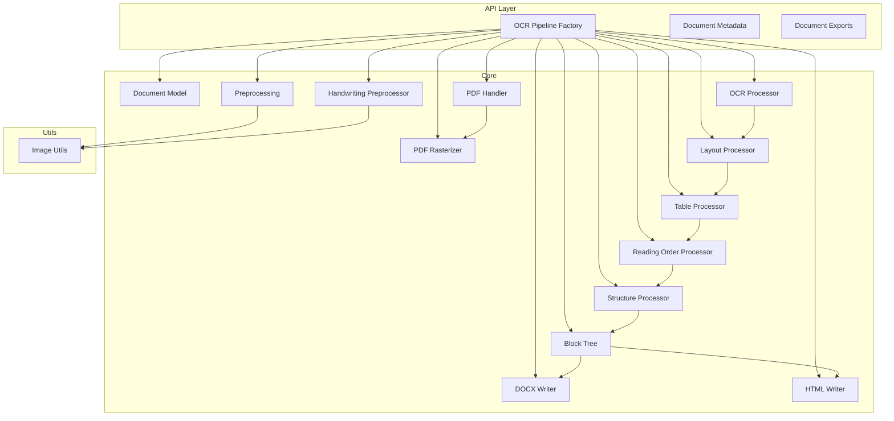
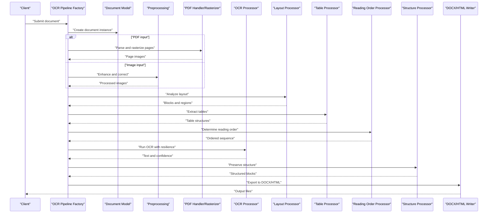
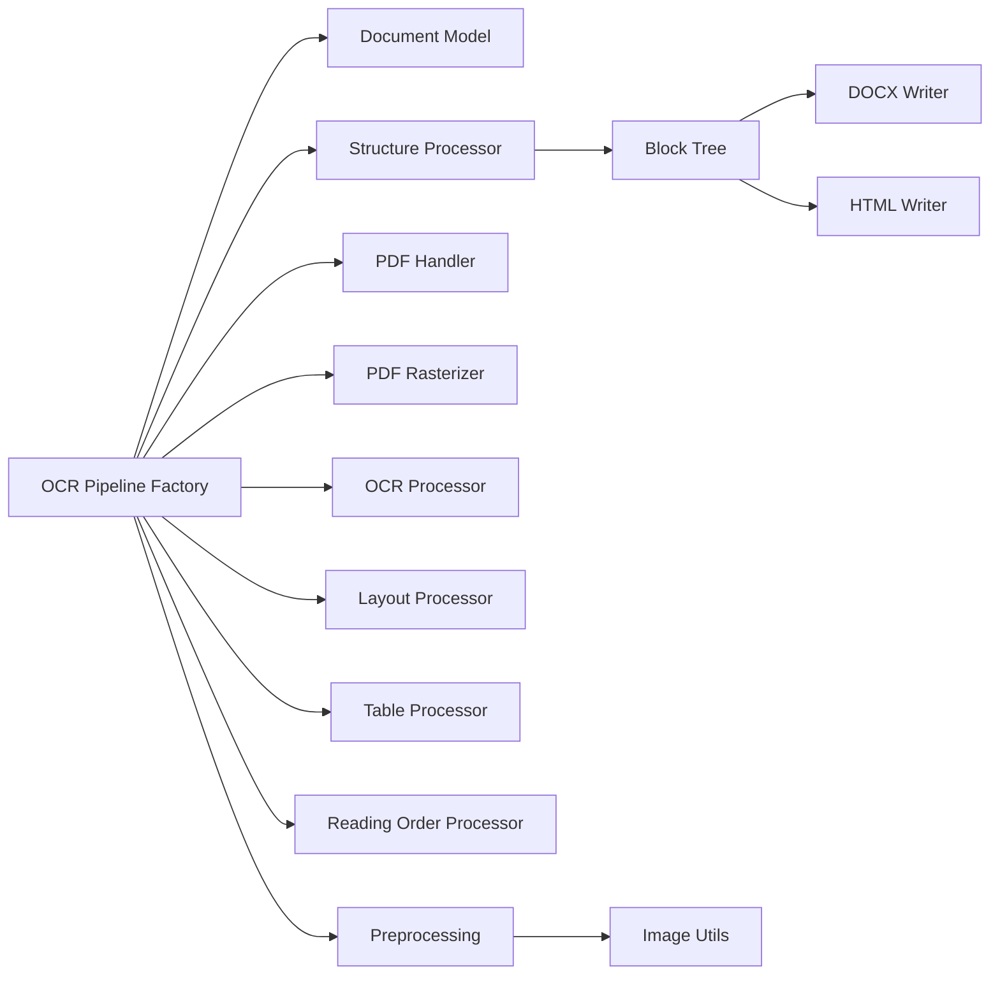
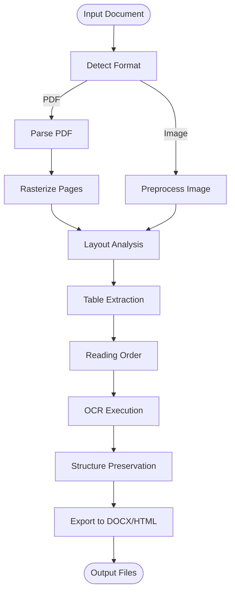

# Document Processing Features

<cite>
**Referenced Files in This Document**
- [README.md](file://README.md)
- [ARCHITECTURE.md](file://ARCHITECTURE.md)
- [server.py](file://src/local_deepl/server.py)
- [pipeline.py](file://src/local_deepl/pipeline.py)
- [document.py](file://src/local_deepl/core/document.py)
- [preprocessing.py](file://src/local_deepl/core/preprocessing.py)
- [handwriting_preprocessor.py](file://src/local_deepl/core/handwriting_preprocessor.py)
- [pdf/handler.py](file://src/local_deepl/core/pdf/handler.py)
- [pdf/rasterizer.py](file://src/local_deepl/core/pdf/rasterizer.py)
- [ocr/processor.py](file://src/local_deepl/core/ocr/processor.py)
- [ocr/client.py](file://src/local_deepl/core/ocr/client.py)
- [processors/layout.py](file://src/local_deepl/core/processors/layout.py)
- [processors/table.py](file://src/local_deepl/core/processors/table.py)
- [processors/reading_order.py](file://src/local_deepl/core/processors/reading_order.py)
- [processors/structure.py](file://src/local_deepl/core/processors/structure.py)
- [processors/quality.py](file://src/local_deepl/core/processors/quality.py)
- [core/block_tree.py](file://src/local_deepl/core/block_tree.py)
- [core/docx_writer.py](file://src/local_deepl/core/docx_writer.py)
- [core/html_writer.py](file://src/local_deepl/core/html_writer.py)
- [api/services/ocr_pipeline_factory.py](file://src/local_deepl/api/services/ocr_pipeline_factory.py)
- [api/services/document_metadata.py](file://src/local_deepl/api/services/document_metadata.py)
- [api/services/document_exports.py](file://src/local_deepl/api/services/document_exports.py)
- [utils/image.py](file://src/local_deepl/utils/image.py)
- [scripts/inspect_pdf.py](file://scripts/inspect_pdf.py)
- [scripts/debug_image_input.py](file://scripts/debug_image_input.py)
</cite>

## Table of Contents
1. [Introduction](#introduction)
2. [Project Structure](#project-structure)
3. [Core Components](#core-components)
4. [Architecture Overview](#architecture-overview)
5. [Detailed Component Analysis](#detailed-component-analysis)
6. [Dependency Analysis](#dependency-analysis)
7. [Performance Considerations](#performance-considerations)
8. [Troubleshooting Guide](#troubleshooting-guide)
9. [Conclusion](#conclusion)
10. [Appendices](#appendices)

## Introduction
This document explains LocalDeepL’s document processing capabilities with a focus on multi-format support, layout analysis, table extraction, and preprocessing for images and handwritten text. It covers how PDFs are handled, how images are enhanced and oriented, how reading order is determined, and how structure is preserved across outputs such as DOCX and HTML. It also provides configuration guidance, performance tips, and troubleshooting strategies for complex layouts, low-quality scans, and mixed-content documents.

## Project Structure
LocalDeepL organizes document processing into layered modules:
- API layer exposes endpoints and orchestrates jobs and exports.
- Core layers implement OCR, PDF handling, preprocessing, processors (layout, tables, reading order), and writers.
- Utilities provide image helpers and file utilities.
- Scripts assist with inspection and debugging of inputs and outputs.

**Diagram sources**
- [api/services/ocr_pipeline_factory.py](file://src/local_deepl/api/services/ocr_pipeline_factory.py)
- [api/services/document_metadata.py](file://src/local_deepl/api/services/document_metadata.py)
- [api/services/document_exports.py](file://src/local_deepl/api/services/document_exports.py)
- [core/document.py](file://src/local_deepl/core/document.py)
- [core/preprocessing.py](file://src/local_deepl/core/preprocessing.py)
- [core/handwriting_preprocessor.py](file://src/local_deepl/core/handwriting_preprocessor.py)
- [core/pdf/handler.py](file://src/local_deepl/core/pdf/handler.py)
- [core/pdf/rasterizer.py](file://src/local_deepl/core/pdf/rasterizer.py)
- [core/ocr/processor.py](file://src/local_deepl/core/ocr/processor.py)
- [core/processors/layout.py](file://src/local_deepl/core/processors/layout.py)
- [core/processors/table.py](file://src/local_deepl/core/processors/table.py)
- [core/processors/reading_order.py](file://src/local_deepl/core/processors/reading_order.py)
- [core/processors/structure.py](file://src/local_deepl/core/processors/structure.py)
- [core/block_tree.py](file://src/local_deepl/core/block_tree.py)
- [core/docx_writer.py](file://src/local_deepl/core/docx_writer.py)
- [core/html_writer.py](file://src/local_deepl/core/html_writer.py)
- [utils/image.py](file://src/local_deepl/utils/image.py)

**Section sources**
- [README.md](file://README.md)
- [ARCHITECTURE.md](file://ARCHITECTURE.md)
- [server.py](file://src/local_deepl/server.py)
- [pipeline.py](file://src/local_deepl/pipeline.py)

## Core Components
- Document model: central representation of pages, blocks, and metadata used throughout the pipeline.
- Preprocessing: image enhancement, noise reduction, orientation correction, and handwriting-specific enhancements.
- PDF handler and rasterizer: parse PDFs, extract embedded content, and render pages to images for OCR.
- OCR processor: coordinates OCR engines and resilience strategies.
- Processors: layout detection, table extraction, reading order determination, and structure preservation.
- Writers: export structured results to DOCX and HTML while preserving layout semantics.

Key responsibilities and relationships are implemented across the core modules listed above.

**Section sources**
- [core/document.py](file://src/local_deepl/core/document.py)
- [core/preprocessing.py](file://src/local_deepl/core/preprocessing.py)
- [core/handwriting_preprocessor.py](file://src/local_deepl/core/handwriting_preprocessor.py)
- [core/pdf/handler.py](file://src/local_deepl/core/pdf/handler.py)
- [core/pdf/rasterizer.py](file://src/local_deepl/core/pdf/rasterizer.py)
- [core/ocr/processor.py](file://src/local_deepl/core/ocr/processor.py)
- [core/processors/layout.py](file://src/local_deepl/core/processors/layout.py)
- [core/processors/table.py](file://src/local_deepl/core/processors/table.py)
- [core/processors/reading_order.py](file://src/local_deepl/core/processors/reading_order.py)
- [core/processors/structure.py](file://src/local_deepl/core/processors/structure.py)
- [core/docx_writer.py](file://src/local_deepl/core/docx_writer.py)
- [core/html_writer.py](file://src/local_deepl/core/html_writer.py)

## Architecture Overview
The document processing pipeline is orchestrated by an OCR pipeline factory that selects appropriate handlers and processors based on input type and settings. The flow typically includes:
- Input ingestion and format detection
- PDF rasterization or direct image preprocessing
- Layout analysis and block segmentation
- Table extraction and structure inference
- Reading order determination
- OCR execution with resilience
- Export to target formats

**Diagram sources**
- [api/services/ocr_pipeline_factory.py](file://src/local_deepl/api/services/ocr_pipeline_factory.py)
- [core/document.py](file://src/local_deepl/core/document.py)
- [core/preprocessing.py](file://src/local_deepl/core/preprocessing.py)
- [core/pdf/handler.py](file://src/local_deepl/core/pdf/handler.py)
- [core/pdf/rasterizer.py](file://src/local_deepl/core/pdf/rasterizer.py)
- [core/ocr/processor.py](file://src/local_deepl/core/ocr/processor.py)
- [core/processors/layout.py](file://src/local_deepl/core/processors/layout.py)
- [core/processors/table.py](file://src/local_deepl/core/processors/table.py)
- [core/processors/reading_order.py](file://src/local_deepl/core/processors/reading_order.py)
- [core/processors/structure.py](file://src/local_deepl/core/processors/structure.py)
- [core/docx_writer.py](file://src/local_deepl/core/docx_writer.py)
- [core/html_writer.py](file://src/local_deepl/core/html_writer.py)

## Detailed Component Analysis

### Multi-Format Document Support
- PDF handling: parsing, page enumeration, and rasterization to images suitable for OCR.
- Image processing: direct ingestion of common image formats with preprocessing steps.
- Mixed content: combining scanned pages, embedded text, and images within a single document.

Configuration examples:
- Selecting PDF vs image input paths and output directories.
- Adjusting rasterization resolution and color mode for better OCR accuracy.
- Enabling or disabling specific processors based on document characteristics.

**Section sources**
- [core/pdf/handler.py](file://src/local_deepl/core/pdf/handler.py)
- [core/pdf/rasterizer.py](file://src/local_deepl/core/pdf/rasterizer.py)
- [core/preprocessing.py](file://src/local_deepl/core/preprocessing.py)
- [scripts/inspect_pdf.py](file://scripts/inspect_pdf.py)
- [scripts/debug_image_input.py](file://scripts/debug_image_input.py)

### Preprocessing Techniques
- Image enhancement: contrast normalization, gamma correction, and sharpening to improve OCR quality.
- Noise reduction: median filtering and adaptive thresholding to remove artifacts from low-quality scans.
- Orientation correction: deskew and rotation detection to align text horizontally.
- Handwritten text preprocessing: specialized filters and binarization tuned for cursive and varied stroke widths.

Optimization tips:
- Use moderate DPI to balance speed and accuracy.
- Apply denoising only when necessary to avoid over-smoothing fine details.
- Validate orientation corrections visually for complex layouts.

**Section sources**
- [core/preprocessing.py](file://src/local_deepl/core/preprocessing.py)
- [core/handwriting_preprocessor.py](file://src/local_deepl/core/handwriting_preprocessor.py)
- [utils/image.py](file://src/local_deepl/utils/image.py)

### Layout Analysis System
- Block segmentation: identifies paragraphs, headings, lists, and other structural elements.
- Region classification: distinguishes text, images, and tables within pages.
- Reading order determination: computes logical sequence using spatial heuristics and graph traversal.

Best practices:
- Tune block size thresholds for dense documents.
- Combine layout signals with OCR confidence to refine boundaries.
- Validate reading order against expected patterns for forms and columns.

**Section sources**
- [core/processors/layout.py](file://src/local_deepl/core/processors/layout.py)
- [core/processors/reading_order.py](file://src/local_deepl/core/processors/reading_order.py)
- [core/block_tree.py](file://src/local_deepl/core/block_tree.py)

### Table Extraction Algorithms
- Detection: identifies tabular regions via grid lines, alignment cues, and spacing patterns.
- Parsing: reconstructs rows and columns, handling merged cells and nested structures.
- Validation: cross-checks cell alignments and content consistency.

Recommendations:
- Increase contrast and reduce noise before table detection.
- Adjust tolerance parameters for skewed or low-resolution scans.
- Post-process extracted tables to fix minor misalignments.

**Section sources**
- [core/processors/table.py](file://src/local_deepl/core/processors/table.py)

### Structure Preservation Techniques
- Block tree construction: maintains hierarchical relationships among sections, paragraphs, and inline elements.
- Semantic tagging: preserves headings, lists, and captions for downstream use.
- Export fidelity: ensures DOCX and HTML outputs reflect original structure accurately.

Guidelines:
- Preserve metadata like font sizes and styles where feasible.
- Use consistent naming conventions for exported elements.
- Validate outputs with visual inspection tools.

**Section sources**
- [core/block_tree.py](file://src/local_deepl/core/block_tree.py)
- [core/processors/structure.py](file://src/local_deepl/core/processors/structure.py)
- [core/docx_writer.py](file://src/local_deepl/core/docx_writer.py)
- [core/html_writer.py](file://src/local_deepl/core/html_writer.py)

### OCR Integration and Resilience
- Engine coordination: manages multiple OCR backends and fallback strategies.
- Confidence scoring: evaluates recognition quality and triggers reprocessing if needed.
- Error handling: retries, timeouts, and graceful degradation for unstable environments.

Configuration advice:
- Set timeout and retry limits appropriate for batch workloads.
- Enable fallback engines for languages or scripts not supported by primary OCR.
- Monitor confidence metrics to adjust preprocessing parameters.

**Section sources**
- [core/ocr/processor.py](file://src/local_deepl/core/ocr/processor.py)
- [core/ocr/client.py](file://src/local_deepl/core/ocr/client.py)

### Output Formats and Writers
- DOCX writer: produces editable documents with preserved layout and styles.
- HTML writer: generates web-friendly markup with semantic tags and embedded assets.
- Export customization: control inclusion of metadata, images, and table representations.

Tips:
- Choose DOCX for editing workflows and HTML for publishing.
- Optimize image embedding to balance file size and quality.
- Validate exported files with standard viewers and validators.

**Section sources**
- [core/docx_writer.py](file://src/local_deepl/core/docx_writer.py)
- [core/html_writer.py](file://src/local_deepl/core/html_writer.py)
- [api/services/document_exports.py](file://src/local_deepl/api/services/document_exports.py)

## Dependency Analysis
The pipeline components exhibit clear separation of concerns:
- API services depend on core modules for orchestration and data transformation.
- Core modules rely on utilities for image operations and file handling.
- Writers consume structured block trees produced by processors.

**Diagram sources**
- [api/services/ocr_pipeline_factory.py](file://src/local_deepl/api/services/ocr_pipeline_factory.py)
- [core/document.py](file://src/local_deepl/core/document.py)
- [core/preprocessing.py](file://src/local_deepl/core/preprocessing.py)
- [core/pdf/handler.py](file://src/local_deepl/core/pdf/handler.py)
- [core/pdf/rasterizer.py](file://src/local_deepl/core/pdf/rasterizer.py)
- [core/ocr/processor.py](file://src/local_deepl/core/ocr/processor.py)
- [core/processors/layout.py](file://src/local_deepl/core/processors/layout.py)
- [core/processors/table.py](file://src/local_deepl/core/processors/table.py)
- [core/processors/reading_order.py](file://src/local_deepl/core/processors/reading_order.py)
- [core/processors/structure.py](file://src/local_deepl/core/processors/structure.py)
- [core/block_tree.py](file://src/local_deepl/core/block_tree.py)
- [core/docx_writer.py](file://src/local_deepl/core/docx_writer.py)
- [core/html_writer.py](file://src/local_deepl/core/html_writer.py)
- [utils/image.py](file://src/local_deepl/utils/image.py)

**Section sources**
- [api/services/ocr_pipeline_factory.py](file://src/local_deepl/api/services/ocr_pipeline_factory.py)
- [core/document.py](file://src/local_deepl/core/document.py)
- [core/block_tree.py](file://src/local_deepl/core/block_tree.py)

## Performance Considerations
- Batch processing: process multiple documents concurrently while managing memory usage.
- Resolution tuning: lower DPI speeds up rasterization but may reduce OCR accuracy; find a balanced setting per workload.
- Cache intermediate results: reuse preprocessed images and layout analyses when possible.
- Stream large PDFs: avoid loading entire documents into memory; process page-by-page.
- Monitor OCR latency: set timeouts and fallbacks to prevent bottlenecks.

[No sources needed since this section provides general guidance]

## Troubleshooting Guide
Common issues and resolutions:
- Poor OCR accuracy on low-quality scans: increase contrast, apply denoising, and correct orientation before OCR.
- Incorrect reading order in multi-column layouts: adjust layout thresholds and validate block segmentation.
- Table extraction failures: enhance edges, reduce noise, and tune detection tolerances.
- Large document slowdowns: enable streaming, limit concurrent tasks, and optimize rasterization settings.
- Format-specific errors: verify input file integrity and ensure supported codecs are available.

Useful diagnostics:
- Inspect PDF structure and page count.
- Visualize bounding boxes and block trees to confirm segmentation.
- Review OCR confidence scores and logs for failure points.

**Section sources**
- [scripts/inspect_pdf.py](file://scripts/inspect_pdf.py)
- [scripts/debug_image_input.py](file://scripts/debug_image_input.py)
- [core/ocr/processor.py](file://src/local_deepl/core/ocr/processor.py)
- [core/processors/layout.py](file://src/local_deepl/core/processors/layout.py)
- [core/processors/table.py](file://src/local_deepl/core/processors/table.py)

## Conclusion
LocalDeepL provides a robust, modular document processing pipeline supporting PDFs, images, and handwritten text. Its preprocessing, layout analysis, table extraction, and structure preservation features enable high-fidelity OCR and export to editable formats. By tuning preprocessing and processor parameters, monitoring OCR confidence, and following the troubleshooting guidance, users can achieve reliable results across diverse document types and qualities.

[No sources needed since this section summarizes without analyzing specific files]

## Appendices

### Configuration Examples
- PDF rasterization: set DPI, color mode, and page range.
- Preprocessing: enable denoising, deskew, and contrast enhancement.
- OCR resilience: configure retries, timeouts, and fallback engines.
- Export options: choose DOCX or HTML, include images, and preserve styles.

[No sources needed since this section provides general guidance]

### Data Flow Diagram

[No sources needed since this diagram shows conceptual workflow, not actual code structure]