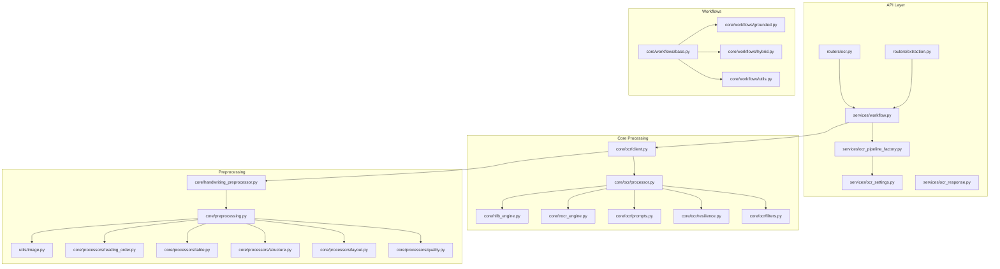
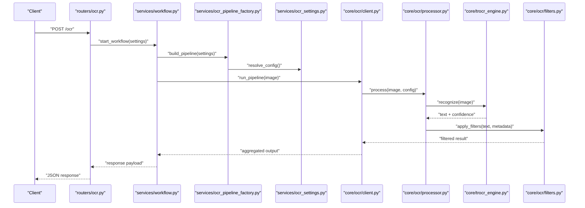
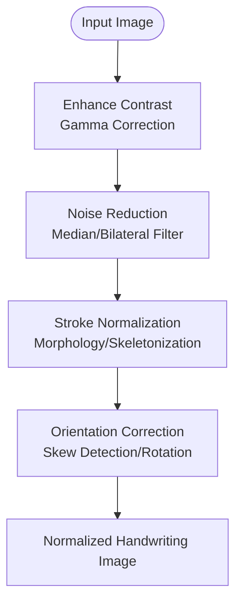
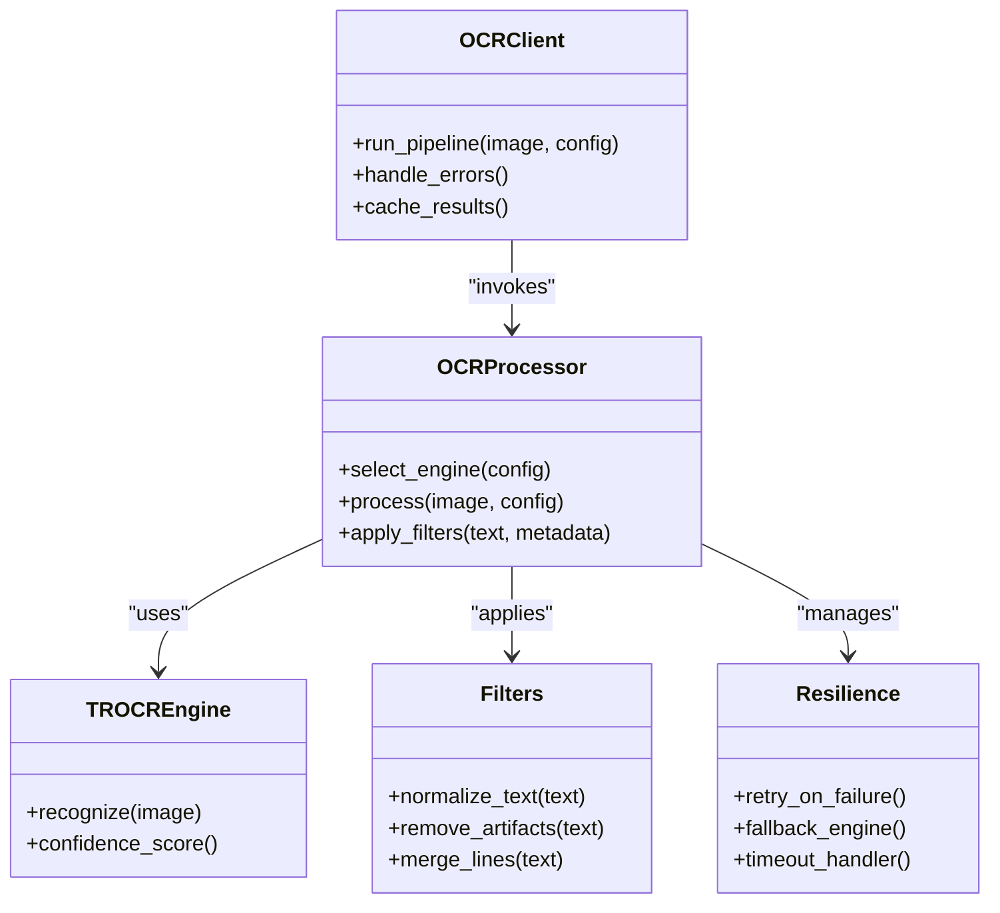
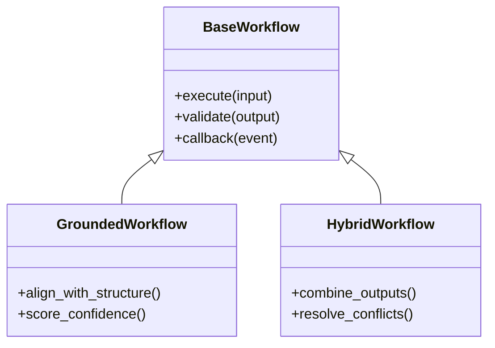
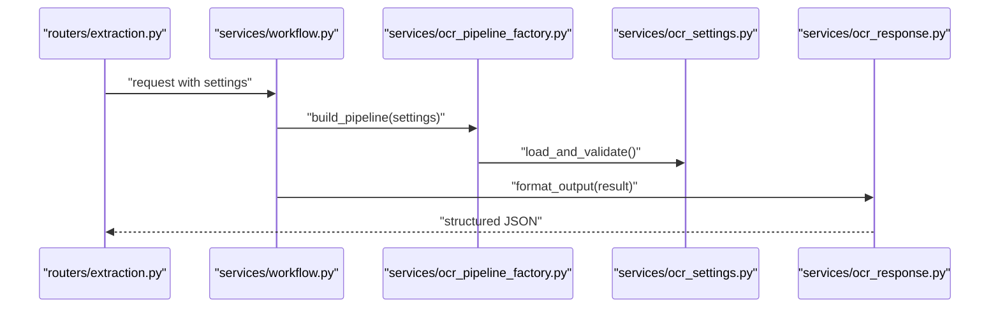
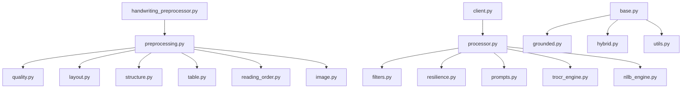

# Handwritten Text Recognition

<cite>
**Referenced Files in This Document**
- [handwriting_preprocessor.py](file://src/local_deepl/core/handwriting_preprocessor.py)
- [preprocessing.py](file://src/local_deepl/core/preprocessing.py)
- [quality.py](file://src/local_deepl/core/processors/quality.py)
- [layout.py](file://src/local_deepl/core/processors/layout.py)
- [structure.py](file://src/local_deepl/core/processors/structure.py)
- [table.py](file://src/local_deepl/core/processors/table.py)
- [reading_order.py](file://src/local_deepl/core/processors/reading_order.py)
- [client.py](file://src/local_deepl/core/ocr/client.py)
- [processor.py](file://src/local_deepl/core/ocr/processor.py)
- [filters.py](file://src/local_deepl/core/ocr/filters.py)
- [resilience.py](file://src/local_deepl/core/ocr/resilience.py)
- [prompts.py](file://src/local_deepl/core/ocr/prompts.py)
- [trocr_engine.py](file://src/local_deepl/core/trocr_engine.py)
- [nllb_engine.py](file://src/local_deepl/core/nllb_engine.py)
- [workflow.py](file://src/local_deepl/api/services/workflow.py)
- [ocr_pipeline_factory.py](file://src/local_deepl/api/services/ocr_pipeline_factory.py)
- [ocr_settings.py](file://src/local_deepl/api/services/ocr_settings.py)
- [ocr_response.py](file://src/local_deepl/api/services/ocr_response.py)
- [extraction.py](file://src/local_deepl/api/routers/extraction.py)
- [ocr.py](file://src/local_deepl/api/routers/ocr.py)
- [grounded.py](file://src/local_deepl/core/workflows/grounded.py)
- [hybrid.py](file://src/local_deepl/core/workflows/hybrid.py)
- [base.py](file://src/local_deepl/core/workflows/base.py)
- [utils.py](file://src/local_deepl/core/workflows/utils.py)
- [document.py](file://src/local_deepl/core/document.py)
- [image.py](file://src/local_deepl/utils/image.py)
- [test_ocr_trocr_integration.py](file://tests/test_ocr_trocr_integration.py)
- [ground_truth_handwritten.json](file://tests/fixtures/ground_truth_handwritten.json)
</cite>

## Table of Contents
1. [Introduction](#introduction)
2. [Project Structure](#project-structure)
3. [Core Components](#core-components)
4. [Architecture Overview](#architecture-overview)
5. [Detailed Component Analysis](#detailed-component-analysis)
6. [Dependency Analysis](#dependency-analysis)
7. [Performance Considerations](#performance-considerations)
8. [Troubleshooting Guide](#troubleshooting-guide)
9. [Conclusion](#conclusion)
10. [Appendices](#appendices)

## Introduction
This document explains LocalDeepL’s handwritten text recognition (HTR) capabilities with a focus on the preprocessing pipeline tailored for handwriting, integration with OCR engines optimized for cursive and mixed content, confidence scoring, configuration options, and practical usage patterns. It covers image enhancement, noise reduction, stroke normalization, orientation correction, language-specific optimizations, quality thresholds, and troubleshooting strategies to improve accuracy across varying legibility levels.

## Project Structure
LocalDeepL organizes HTR-related functionality under core modules for preprocessing, OCR processing, workflows, and API services:
- Preprocessing and image utilities handle enhancement, denoising, binarization, deskewing, and layout-aware segmentation.
- OCR client and processor orchestrate engine selection, execution, filtering, and resilience.
- Workflows define end-to-end pipelines including grounded and hybrid approaches that combine OCR outputs with structured reasoning.
- API services expose configuration, pipeline factory, response modeling, and router endpoints for ingestion and extraction.

**Diagram sources**
- [ocr.py](file://src/local_deepl/api/routers/ocr.py)
- [extraction.py](file://src/local_deepl/api/routers/extraction.py)
- [workflow.py](file://src/local_deepl/api/services/workflow.py)
- [ocr_pipeline_factory.py](file://src/local_deepl/api/services/ocr_pipeline_factory.py)
- [ocr_settings.py](file://src/local_deepl/api/services/ocr_settings.py)
- [ocr_response.py](file://src/local_deepl/api/services/ocr_response.py)
- [client.py](file://src/local_deepl/core/ocr/client.py)
- [processor.py](file://src/local_deepl/core/ocr/processor.py)
- [filters.py](file://src/local_deepl/core/ocr/filters.py)
- [resilience.py](file://src/local_deepl/core/ocr/resilience.py)
- [prompts.py](file://src/local_deepl/core/ocr/prompts.py)
- [trocr_engine.py](file://src/local_deepl/core/trocr_engine.py)
- [nllb_engine.py](file://src/local_deepl/core/nllb_engine.py)
- [handwriting_preprocessor.py](file://src/local_deepl/core/handwriting_preprocessor.py)
- [preprocessing.py](file://src/local_deepl/core/preprocessing.py)
- [quality.py](file://src/local_deepl/core/processors/quality.py)
- [layout.py](file://src/local_deepl/core/processors/layout.py)
- [structure.py](file://src/local_deepl/core/processors/structure.py)
- [table.py](file://src/local_deepl/core/processors/table.py)
- [reading_order.py](file://src/local_deepl/core/processors/reading_order.py)
- [image.py](file://src/local_deepl/utils/image.py)
- [base.py](file://src/local_deepl/core/workflows/base.py)
- [grounded.py](file://src/local_deepl/core/workflows/grounded.py)
- [hybrid.py](file://src/local_deepl/core/workflows/hybrid.py)
- [utils.py](file://src/local_deepl/core/workflows/utils.py)

**Section sources**
- [handwriting_preprocessor.py](file://src/local_deepl/core/handwriting_preprocessor.py)
- [preprocessing.py](file://src/local_deepl/core/preprocessing.py)
- [client.py](file://src/local_deepl/core/ocr/client.py)
- [processor.py](file://src/local_deepl/core/ocr/processor.py)
- [trocr_engine.py](file://src/local_deepl/core/trocr_engine.py)
- [workflow.py](file://src/local_deepl/api/services/workflow.py)
- [ocr_pipeline_factory.py](file://src/local_deepl/api/services/ocr_pipeline_factory.py)
- [ocr_settings.py](file://src/local_deepl/api/services/ocr_settings.py)
- [ocr_response.py](file://src/local_deepl/api/services/ocr_response.py)
- [extraction.py](file://src/local_deepl/api/routers/extraction.py)
- [ocr.py](file://src/local_deepl/api/routers/ocr.py)

## Core Components
- Handwriting preprocessor: specialized enhancements for cursive and low-quality scans, including contrast stretching, adaptive thresholding, stroke thinning, and orientation correction.
- General preprocessing: image normalization, noise reduction, binarization, deskew, and layout-aware segmentation.
- OCR client and processor: orchestrates OCR engine calls, applies filters, manages retries, and aggregates results with confidence metrics.
- Engines: TROCR for handwriting-focused recognition; NLLB for translation post-processing when needed.
- Workflows: base, grounded, and hybrid pipelines combining OCR outputs with structure-aware reasoning and validation.
- API services: configuration-driven pipeline construction, request/response schemas, and workflow orchestration.

**Section sources**
- [handwriting_preprocessor.py](file://src/local_deepl/core/handwriting_preprocessor.py)
- [preprocessing.py](file://src/local_deepl/core/preprocessing.py)
- [client.py](file://src/local_deepl/core/ocr/client.py)
- [processor.py](file://src/local_deepl/core/ocr/processor.py)
- [trocr_engine.py](file://src/local_deepl/core/trocr_engine.py)
- [nllb_engine.py](file://src/local_deepl/core/nllb_engine.py)
- [base.py](file://src/local_deepl/core/workflows/base.py)
- [grounded.py](file://src/local_deepl/core/workflows/grounded.py)
- [hybrid.py](file://src/local_deepl/core/workflows/hybrid.py)
- [ocr_pipeline_factory.py](file://src/local_deepl/api/services/ocr_pipeline_factory.py)
- [ocr_settings.py](file://src/local_deepl/api/services/ocr_settings.py)
- [ocr_response.py](file://src/local_deepl/api/services/ocr_response.py)

## Architecture Overview
The HTR architecture integrates preprocessing, OCR, and workflow layers:
- Input images or PDFs are routed through the API layer into the workflow service.
- The workflow constructs an OCR pipeline using the pipeline factory and settings.
- The OCR client invokes the processor which selects appropriate engines (TROCR for handwriting).
- Preprocessing is applied before OCR; post-processing includes filtering, alignment, and confidence scoring.
- Optional translation via NLLB can be applied after recognition.

**Diagram sources**
- [ocr.py](file://src/local_deepl/api/routers/ocr.py)
- [workflow.py](file://src/local_deepl/api/services/workflow.py)
- [ocr_pipeline_factory.py](file://src/local_deepl/api/services/ocr_pipeline_factory.py)
- [ocr_settings.py](file://src/local_deepl/api/services/ocr_settings.py)
- [client.py](file://src/local_deepl/core/ocr/client.py)
- [processor.py](file://src/local_deepl/core/ocr/processor.py)
- [trocr_engine.py](file://src/local_deepl/core/trocr_engine.py)
- [filters.py](file://src/local_deepl/core/ocr/filters.py)

## Detailed Component Analysis

### Handwriting Preprocessor
Specialized preprocessing for handwriting focuses on:
- Image enhancement: contrast adjustment, gamma correction, and local histogram equalization to improve legibility.
- Noise reduction: median and bilateral filtering to suppress speckle while preserving strokes.
- Stroke normalization: morphological operations and skeletonization to standardize line thickness and connectivity.
- Orientation correction: skew detection and rotation correction to align baseline and improve reading order.

**Diagram sources**
- [handwriting_preprocessor.py](file://src/local_deepl/core/handwriting_preprocessor.py)
- [preprocessing.py](file://src/local_deepl/core/preprocessing.py)
- [quality.py](file://src/local_deepl/core/processors/quality.py)
- [image.py](file://src/local_deepl/utils/image.py)

**Section sources**
- [handwriting_preprocessor.py](file://src/local_deepl/core/handwriting_preprocessor.py)
- [preprocessing.py](file://src/local_deepl/core/preprocessing.py)
- [quality.py](file://src/local_deepl/core/processors/quality.py)
- [image.py](file://src/local_deepl/utils/image.py)

### OCR Client and Processor
- Client coordinates pipeline execution, caching, and error handling.
- Processor selects engines based on input characteristics and settings, applies filters, and aggregates results.
- Resilience mechanisms include retries, fallback strategies, and timeout management.
- Prompts guide structured outputs when LLM-assisted steps are used.

**Diagram sources**
- [client.py](file://src/local_deepl/core/ocr/client.py)
- [processor.py](file://src/local_deepl/core/ocr/processor.py)
- [trocr_engine.py](file://src/local_deepl/core/trocr_engine.py)
- [filters.py](file://src/local_deepl/core/ocr/filters.py)
- [resilience.py](file://src/local_deepl/core/ocr/resilience.py)
- [prompts.py](file://src/local_deepl/core/ocr/prompts.py)

**Section sources**
- [client.py](file://src/local_deepl/core/ocr/client.py)
- [processor.py](file://src/local_deepl/core/ocr/processor.py)
- [filters.py](file://src/local_deepl/core/ocr/filters.py)
- [resilience.py](file://src/local_deepl/core/ocr/resilience.py)
- [prompts.py](file://src/local_deepl/core/ocr/prompts.py)
- [trocr_engine.py](file://src/local_deepl/core/trocr_engine.py)

### Workflows: Grounded and Hybrid
- Base workflow defines common lifecycle hooks and state management.
- Grounded workflow integrates OCR outputs with grounded structures for improved accuracy and traceability.
- Hybrid workflow combines multiple strategies (e.g., OCR + rule-based corrections) to handle mixed printed and handwritten content.

**Diagram sources**
- [base.py](file://src/local_deepl/core/workflows/base.py)
- [grounded.py](file://src/local_deepl/core/workflows/grounded.py)
- [hybrid.py](file://src/local_deepl/core/workflows/hybrid.py)
- [utils.py](file://src/local_deepl/core/workflows/utils.py)

**Section sources**
- [base.py](file://src/local_deepl/core/workflows/base.py)
- [grounded.py](file://src/local_deepl/core/workflows/grounded.py)
- [hybrid.py](file://src/local_deepl/core/workflows/hybrid.py)
- [utils.py](file://src/local_deepl/core/workflows/utils.py)

### API Services and Configuration
- Workflow service orchestrates end-to-end processing, invoking pipeline factory and managing progress.
- Pipeline factory builds OCR pipelines based on settings, selecting engines and preprocessing steps.
- Settings module provides configuration options for handwriting styles, languages, and quality thresholds.
- Response module models standardized outputs including confidence scores and metadata.

**Diagram sources**
- [extraction.py](file://src/local_deepl/api/routers/extraction.py)
- [workflow.py](file://src/local_deepl/api/services/workflow.py)
- [ocr_pipeline_factory.py](file://src/local_deepl/api/services/ocr_pipeline_factory.py)
- [ocr_settings.py](file://src/local_deepl/api/services/ocr_settings.py)
- [ocr_response.py](file://src/local_deepl/api/services/ocr_response.py)

**Section sources**
- [extraction.py](file://src/local_deepl/api/routers/extraction.py)
- [workflow.py](file://src/local_deepl/api/services/workflow.py)
- [ocr_pipeline_factory.py](file://src/local_deepl/api/services/ocr_pipeline_factory.py)
- [ocr_settings.py](file://src/local_deepl/api/services/ocr_settings.py)
- [ocr_response.py](file://src/local_deepl/api/services/ocr_response.py)

## Dependency Analysis
Key dependencies and relationships:
- Preprocessing depends on image utilities and quality processors.
- OCR client depends on processor, filters, resilience, and prompts.
- Engines (TROCR, NLLB) are invoked by the processor based on configuration.
- Workflows depend on base utilities and may integrate with OCR outputs.

**Diagram sources**
- [handwriting_preprocessor.py](file://src/local_deepl/core/handwriting_preprocessor.py)
- [preprocessing.py](file://src/local_deepl/core/preprocessing.py)
- [quality.py](file://src/local_deepl/core/processors/quality.py)
- [layout.py](file://src/local_deepl/core/processors/layout.py)
- [structure.py](file://src/local_deepl/core/processors/structure.py)
- [table.py](file://src/local_deepl/core/processors/table.py)
- [reading_order.py](file://src/local_deepl/core/processors/reading_order.py)
- [image.py](file://src/local_deepl/utils/image.py)
- [client.py](file://src/local_deepl/core/ocr/client.py)
- [processor.py](file://src/local_deepl/core/ocr/processor.py)
- [filters.py](file://src/local_deepl/core/ocr/filters.py)
- [resilience.py](file://src/local_deepl/core/ocr/resilience.py)
- [prompts.py](file://src/local_deepl/core/ocr/prompts.py)
- [trocr_engine.py](file://src/local_deepl/core/trocr_engine.py)
- [nllb_engine.py](file://src/local_deepl/core/nllb_engine.py)
- [base.py](file://src/local_deepl/core/workflows/base.py)
- [grounded.py](file://src/local_deepl/core/workflows/grounded.py)
- [hybrid.py](file://src/local_deepl/core/workflows/hybrid.py)
- [utils.py](file://src/local_deepl/core/workflows/utils.py)

**Section sources**
- [handwriting_preprocessor.py](file://src/local_deepl/core/handwriting_preprocessor.py)
- [preprocessing.py](file://src/local_deepl/core/preprocessing.py)
- [client.py](file://src/local_deepl/core/ocr/client.py)
- [processor.py](file://src/local_deepl/core/ocr/processor.py)
- [trocr_engine.py](file://src/local_deepl/core/trocr_engine.py)
- [nllb_engine.py](file://src/local_deepl/core/nllb_engine.py)
- [base.py](file://src/local_deepl/core/workflows/base.py)
- [grounded.py](file://src/local_deepl/core/workflows/grounded.py)
- [hybrid.py](file://src/local_deepl/core/workflows/hybrid.py)

## Performance Considerations
- Preprocessing cost vs. accuracy trade-offs: aggressive denoising and skeletonization can slow processing but improve recognition for faint strokes.
- Engine selection: TROCR excels for handwriting but may require higher resolution inputs; balance DPI and crop sizes.
- Caching and batching: reuse intermediate results where possible to reduce redundant computations.
- Memory management: process large documents in chunks to avoid memory pressure during rasterization and OCR.
- Parallelism: leverage concurrent tasks for independent pages or regions when supported by the pipeline.

[No sources needed since this section provides general guidance]

## Troubleshooting Guide
Common issues and remedies:
- Low legibility: increase contrast enhancement and apply adaptive thresholding; consider multi-pass preprocessing.
- Cursive misrecognition: enable stroke normalization and adjust skeletonization parameters; use TROCR with handwriting-specific prompts.
- Mixed printed and handwritten: prefer hybrid workflow to combine OCR strengths and rule-based corrections.
- Orientation errors: ensure skew detection is active; rotate images to correct baseline before OCR.
- Confidence thresholds: tune minimum confidence to filter unreliable segments; review filtered outputs and reprocess if necessary.
- Language-specific optimization: select appropriate language models and dictionaries; validate character sets and diacritics.

Practical examples:
- Handwritten notes: use high contrast enhancement, moderate denoising, and TROCR with cursive prompts.
- Forms with fields: apply layout-aware segmentation and reading order correction; set stricter confidence thresholds for field values.
- Letters with varying legibility: adopt hybrid workflow; preprocess each region individually and merge results.

**Section sources**
- [handwriting_preprocessor.py](file://src/local_deepl/core/handwriting_preprocessor.py)
- [preprocessing.py](file://src/local_deepl/core/preprocessing.py)
- [quality.py](file://src/local_deepl/core/processors/quality.py)
- [layout.py](file://src/local_deepl/core/processors/layout.py)
- [reading_order.py](file://src/local_deepl/core/processors/reading_order.py)
- [trocr_engine.py](file://src/local_deepl/core/trocr_engine.py)
- [filters.py](file://src/local_deepl/core/ocr/filters.py)
- [resilience.py](file://src/local_deepl/core/ocr/resilience.py)
- [ocr_settings.py](file://src/local_deepl/api/services/ocr_settings.py)
- [test_ocr_trocr_integration.py](file://tests/test_ocr_trocr_integration.py)
- [ground_truth_handwritten.json](file://tests/fixtures/ground_truth_handwritten.json)

## Conclusion
LocalDeepL’s HTR pipeline combines specialized preprocessing, robust OCR orchestration, and flexible workflows to deliver accurate recognition across diverse handwriting styles and document types. By tuning preprocessing parameters, selecting appropriate engines, and configuring confidence thresholds, users can optimize performance for handwritten notes, forms, and letters. The modular architecture supports iterative improvements and integration with additional engines or post-processing steps.

[No sources needed since this section summarizes without analyzing specific files]

## Appendices
- Configuration reference: consult ocr_settings.py for available options related to handwriting styles, language models, and quality thresholds.
- Testing and evaluation: use test fixtures and scripts to benchmark accuracy and refine parameters.
- Integration examples: refer to routers and workflow services for API usage patterns and response formats.

**Section sources**
- [ocr_settings.py](file://src/local_deepl/api/services/ocr_settings.py)
- [test_ocr_trocr_integration.py](file://tests/test_ocr_trocr_integration.py)
- [ground_truth_handwritten.json](file://tests/fixtures/ground_truth_handwritten.json)
- [extraction.py](file://src/local_deepl/api/routers/extraction.py)
- [workflow.py](file://src/local_deepl/api/services/workflow.py)