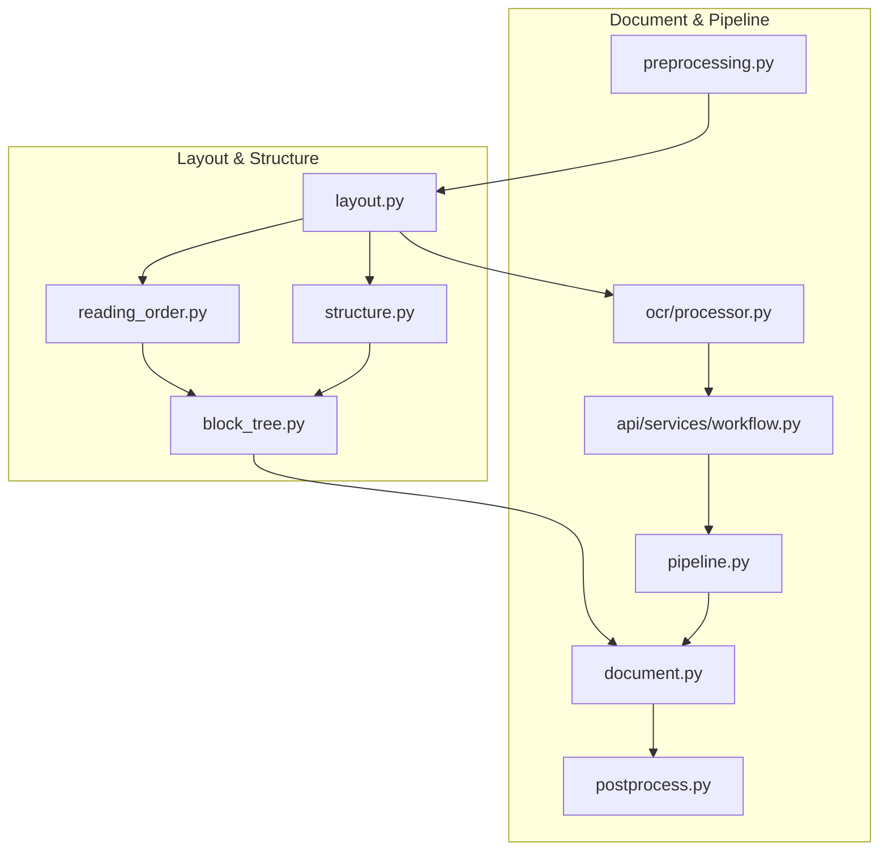
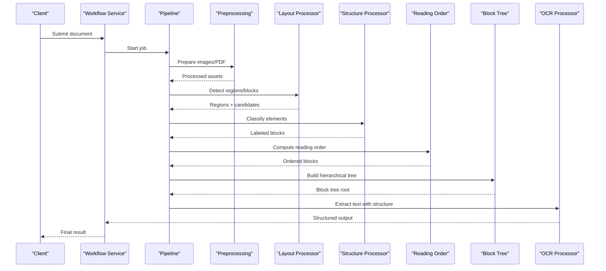
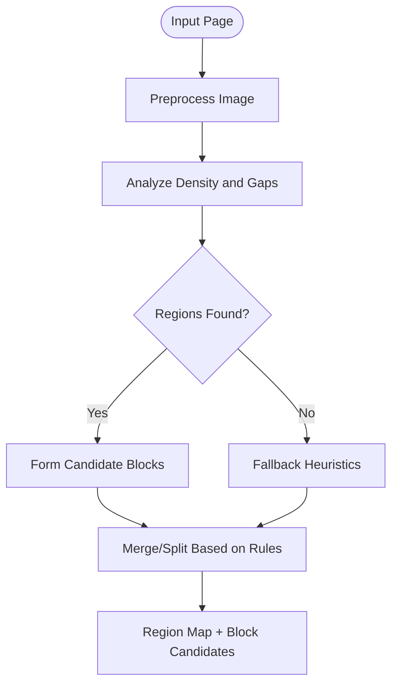
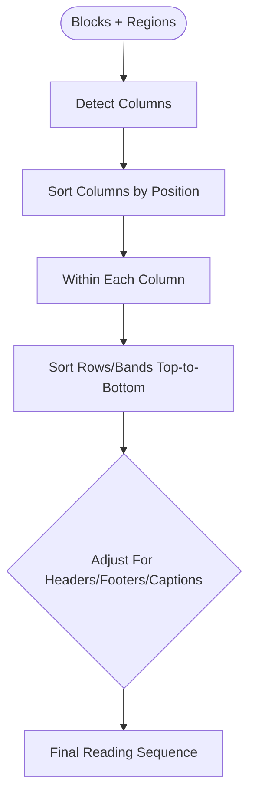
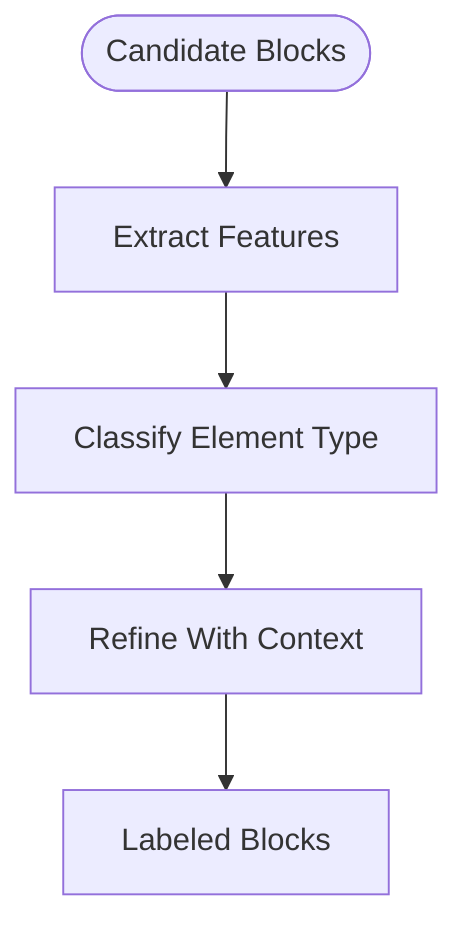
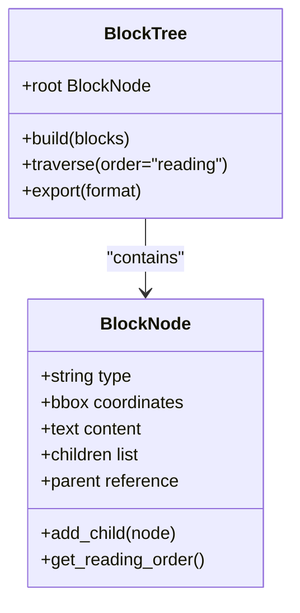
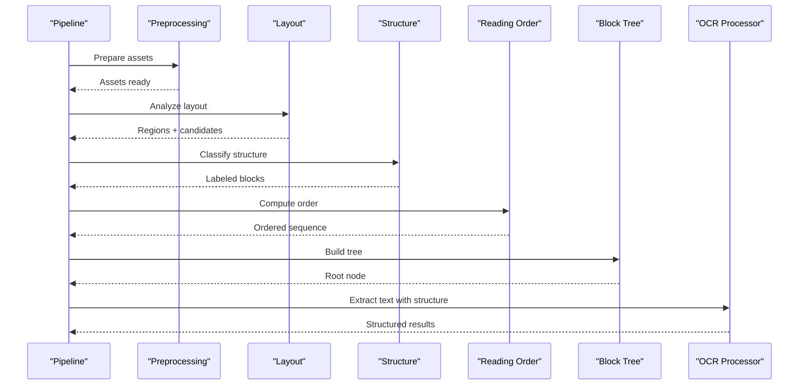
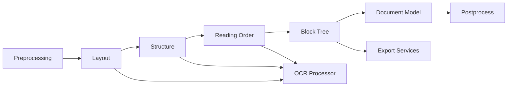

# Layout Analysis and Structure Detection

<cite>
**Referenced Files in This Document**
- [layout.py](file://src/local_deepl/core/processors/layout.py)
- [reading_order.py](file://src/local_deepl/core/processors/reading_order.py)
- [structure.py](file://src/local_deepl/core/processors/structure.py)
- [block_tree.py](file://src/local_deepl/core/block_tree.py)
- [document.py](file://src/local_deepl/core/document.py)
- [preprocessing.py](file://src/local_deepl/core/preprocessing.py)
- [postprocess.py](file://src/local_deepl/core/postprocess.py)
- [pipeline.py](file://src/local_deepl/pipeline.py)
- [processor.py](file://src/local_deepl/core/ocr/processor.py)
- [workflow.py](file://src/local_deepl/api/services/workflow.py)
</cite>

## Table of Contents
1. [Introduction](#introduction)
2. [Project Structure](#project-structure)
3. [Core Components](#core-components)
4. [Architecture Overview](#architecture-overview)
5. [Detailed Component Analysis](#detailed-component-analysis)
6. [Dependency Analysis](#dependency-analysis)
7. [Performance Considerations](#performance-considerations)
8. [Troubleshooting Guide](#troubleshooting-guide)
9. [Conclusion](#conclusion)
10. [Appendices](#appendices)

## Introduction
This document explains LocalDeepL’s layout analysis and structure detection system. It covers how the system identifies document regions, text blocks, headers, footers, and other structural elements; how reading order is determined; how the block tree is generated to preserve hierarchical structure; and how configuration options tune sensitivity and handle complex layouts such as multi-column pages and overlapping content. Practical guidance for different document types (forms, reports, magazines) and strategies for mixed content and embedded objects are included.

## Project Structure
The layout and structure detection logic is primarily implemented under core processors and supporting modules:
- Layout detection and region segmentation
- Reading order determination
- Structural element classification (headers, footers, columns, tables)
- Block tree generation and hierarchy preservation
- Integration with OCR pipeline and workflows

**Diagram sources**
- [layout.py](file://src/local_deepl/core/processors/layout.py)
- [reading_order.py](file://src/local_deepl/core/processors/reading_order.py)
- [structure.py](file://src/local_deepl/core/processors/structure.py)
- [block_tree.py](file://src/local_deepl/core/block_tree.py)
- [document.py](file://src/local_deepl/core/document.py)
- [pipeline.py](file://src/local_deepl/pipeline.py)
- [preprocessing.py](file://src/local_deepl/core/preprocessing.py)
- [postprocess.py](file://src/local_deepl/core/postprocess.py)
- [processor.py](file://src/local_deepl/core/ocr/processor.py)
- [workflow.py](file://src/local_deepl/api/services/workflow.py)

**Section sources**
- [layout.py](file://src/local_deepl/core/processors/layout.py)
- [reading_order.py](file://src/local_deepl/core/processors/reading_order.py)
- [structure.py](file://src/local_deepl/core/processors/structure.py)
- [block_tree.py](file://src/local_deepl/core/block_tree.py)
- [document.py](file://src/local_deepl/core/document.py)
- [pipeline.py](file://src/local_deepl/pipeline.py)
- [preprocessing.py](file://src/local_deepl/core/preprocessing.py)
- [postprocess.py](file://src/local_deepl/core/postprocess.py)
- [processor.py](file://src/local_deepl/core/ocr/processor.py)
- [workflow.py](file://src/local_deepl/api/services/workflow.py)

## Core Components
- Layout detection: Segments pages into regions and candidate text blocks using geometric and visual cues.
- Reading order: Computes a sequence that respects natural reading flow across columns, sections, and nested structures.
- Structure classification: Labels blocks as headers, footers, body text, captions, lists, tables, and more.
- Block tree: Builds a hierarchical representation preserving parent-child relationships among blocks.
- Pipeline integration: Coordinates preprocessing, OCR, postprocessing, and export while maintaining structure.

Key responsibilities and interactions:
- Preprocessing prepares images/PDFs and exposes parameters affecting detection sensitivity.
- Layout produces initial regions and block candidates.
- Structure refines labels and merges/splits blocks where needed.
- Reading order orders blocks for extraction and translation.
- Block tree encapsulates the final hierarchical model used by downstream consumers.

**Section sources**
- [preprocessing.py](file://src/local_deepl/core/preprocessing.py)
- [layout.py](file://src/local_deepl/core/processors/layout.py)
- [structure.py](file://src/local_deepl/core/processors/structure.py)
- [reading_order.py](file://src/local_deepl/core/processors/reading_order.py)
- [block_tree.py](file://src/local_deepl/core/block_tree.py)

## Architecture Overview
The layout and structure detection pipeline integrates with the broader OCR workflow. The following sequence shows how a page flows through preprocessing, layout analysis, structure classification, reading order computation, and block tree construction before being consumed by the OCR processor and exported.

**Diagram sources**
- [workflow.py](file://src/local_deepl/api/services/workflow.py)
- [pipeline.py](file://src/local_deepl/pipeline.py)
- [preprocessing.py](file://src/local_deepl/core/preprocessing.py)
- [layout.py](file://src/local_deepl/core/processors/layout.py)
- [structure.py](file://src/local_deepl/core/processors/structure.py)
- [reading_order.py](file://src/local_deepl/core/processors/reading_order.py)
- [block_tree.py](file://src/local_deepl/core/block_tree.py)
- [processor.py](file://src/local_deepl/core/ocr/processor.py)

## Detailed Component Analysis

### Layout Detection
Layout detection segments pages into regions and candidate text blocks. It uses geometric heuristics, density analysis, and optional image-based cues to identify potential text areas. Key behaviors include:
- Region segmentation based on whitespace gaps and alignment patterns
- Candidate block formation from connected components or rasterized features
- Handling of multi-column pages by detecting column boundaries
- Sensitivity tuning via thresholds for gap size, line spacing, and component merging

Configuration aspects typically exposed:
- Gap threshold for separating columns and paragraphs
- Minimum block area to filter noise
- Merging rules for fragmented lines
- Column detection sensitivity

**Diagram sources**
- [layout.py](file://src/local_deepl/core/processors/layout.py)
- [preprocessing.py](file://src/local_deepl/core/preprocessing.py)

**Section sources**
- [layout.py](file://src/local_deepl/core/processors/layout.py)
- [preprocessing.py](file://src/local_deepl/core/preprocessing.py)

### Reading Order Determination
Reading order establishes the correct sequence for text extraction, respecting natural reading flow across columns, sections, and nested structures. Logic includes:
- Column detection and ordering left-to-right (or language-specific direction)
- Vertical scanning within columns with top-to-bottom progression
- Handling of interleaved content by prioritizing main body over sidebars
- Adjusting order for headers/footers and captions relative to their associated content

**Diagram sources**
- [reading_order.py](file://src/local_deepl/core/processors/reading_order.py)

**Section sources**
- [reading_order.py](file://src/local_deepl/core/processors/reading_order.py)

### Structure Classification
Structure classification labels blocks as semantic elements such as headers, footers, body text, captions, lists, and tables. It leverages:
- Positional cues (top/bottom margins for headers/footers)
- Typography signals (font size, boldness, alignment)
- Content patterns (list markers, table-like grids)
- Contextual relationships (captions near figures)

**Diagram sources**
- [structure.py](file://src/local_deepl/core/processors/structure.py)

**Section sources**
- [structure.py](file://src/local_deepl/core/processors/structure.py)

### Block Tree Generation
The block tree builds a hierarchical representation preserving parent-child relationships among blocks. It ensures:
- Nested structures (sections, subsections, lists) are represented as subtrees
- Tables and figures maintain internal structure (rows, cells, captions)
- Reading order is consistent with traversal of the tree
- Downstream consumers can navigate and extract content semantically

**Diagram sources**
- [block_tree.py](file://src/local_deepl/core/block_tree.py)
- [document.py](file://src/local_deepl/core/document.py)

**Section sources**
- [block_tree.py](file://src/local_deepl/core/block_tree.py)
- [document.py](file://src/local_deepl/core/document.py)

### Pipeline Integration
The pipeline orchestrates preprocessing, layout analysis, structure classification, reading order computation, and OCR processing. It maintains state and artifacts across stages and supports callbacks for progress and debugging.

**Diagram sources**
- [pipeline.py](file://src/local_deepl/pipeline.py)
- [preprocessing.py](file://src/local_deepl/core/preprocessing.py)
- [layout.py](file://src/local_deepl/core/processors/layout.py)
- [structure.py](file://src/local_deepl/core/processors/structure.py)
- [reading_order.py](file://src/local_deepl/core/processors/reading_order.py)
- [block_tree.py](file://src/local_deepl/core/block_tree.py)
- [processor.py](file://src/local_deepl/core/ocr/processor.py)

**Section sources**
- [pipeline.py](file://src/local_deepl/pipeline.py)
- [processor.py](file://src/local_deepl/core/ocr/processor.py)

## Dependency Analysis
Layout and structure detection depends on preprocessing outputs and feeds into OCR and export stages. The following diagram highlights key dependencies and data flow between modules.

**Diagram sources**
- [preprocessing.py](file://src/local_deepl/core/preprocessing.py)
- [layout.py](file://src/local_deepl/core/processors/layout.py)
- [structure.py](file://src/local_deepl/core/processors/structure.py)
- [reading_order.py](file://src/local_deepl/core/processors/reading_order.py)
- [block_tree.py](file://src/local_deepl/core/block_tree.py)
- [document.py](file://src/local_deepl/core/document.py)
- [postprocess.py](file://src/local_deepl/core/postprocess.py)
- [processor.py](file://src/local_deepl/core/ocr/processor.py)

**Section sources**
- [preprocessing.py](file://src/local_deepl/core/preprocessing.py)
- [layout.py](file://src/local_deepl/core/processors/layout.py)
- [structure.py](file://src/local_deepl/core/processors/structure.py)
- [reading_order.py](file://src/local_deepl/core/processors/reading_order.py)
- [block_tree.py](file://src/local_deepl/core/block_tree.py)
- [document.py](file://src/local_deepl/core/document.py)
- [postprocess.py](file://src/local_deepl/core/postprocess.py)
- [processor.py](file://src/local_deepl/core/ocr/processor.py)

## Performance Considerations
- Preprocessing quality directly impacts layout accuracy; ensure appropriate scaling and denoising for scanned documents.
- Tuning gap thresholds and merge rules reduces false positives and fragmentation in dense layouts.
- Multi-column detection benefits from explicit column width constraints to avoid misclassification.
- Reading order computation should be optimized for large pages by limiting unnecessary sorting passes.
- Block tree construction should avoid deep recursion on extremely nested structures; consider iterative approaches if needed.

[No sources needed since this section provides general guidance]

## Troubleshooting Guide
Common issues and remedies:
- Overlapping content: Increase separation thresholds and enable overlap resolution rules in layout detection.
- Misclassified headers/footers: Adjust positional heuristics and refine typography-based classifiers.
- Incorrect reading order: Validate column detection and row band sorting; adjust for language-specific directions.
- Fragmented blocks: Tune merging rules and minimum block area filters.
- Mixed content (forms, tables, images): Use structure classification to isolate tables and figures; apply specialized handling for form fields.

**Section sources**
- [layout.py](file://src/local_deepl/core/processors/layout.py)
- [structure.py](file://src/local_deepl/core/processors/structure.py)
- [reading_order.py](file://src/local_deepl/core/processors/reading_order.py)
- [block_tree.py](file://src/local_deepl/core/block_tree.py)

## Conclusion
LocalDeepL’s layout analysis and structure detection system provides robust segmentation, classification, and ordering of document elements, enabling accurate text extraction and hierarchical representation. By tuning preprocessing and processor parameters, users can adapt the system to diverse document types and complex layouts, ensuring reliable performance across forms, reports, and magazines.

[No sources needed since this section summarizes without analyzing specific files]

## Appendices

### Configuration Options for Customization
- Sensitivity thresholds: Control gap detection, block merging, and column splitting.
- Column handling: Enable multi-column mode and set width constraints.
- Overlap resolution: Define rules for resolving intersecting regions.
- Structural heuristics: Adjust header/footer detection and caption association.

[No sources needed since this section provides general guidance]

### Examples by Document Type
- Forms: Emphasize field detection and label association; use structure classification to separate prompts from inputs.
- Reports: Focus on section hierarchy and table extraction; ensure reading order respects headings and captions.
- Magazines: Handle multi-column layouts and mixed media; prioritize body text and captions while isolating ads and sidebars.

[No sources needed since this section provides general guidance]