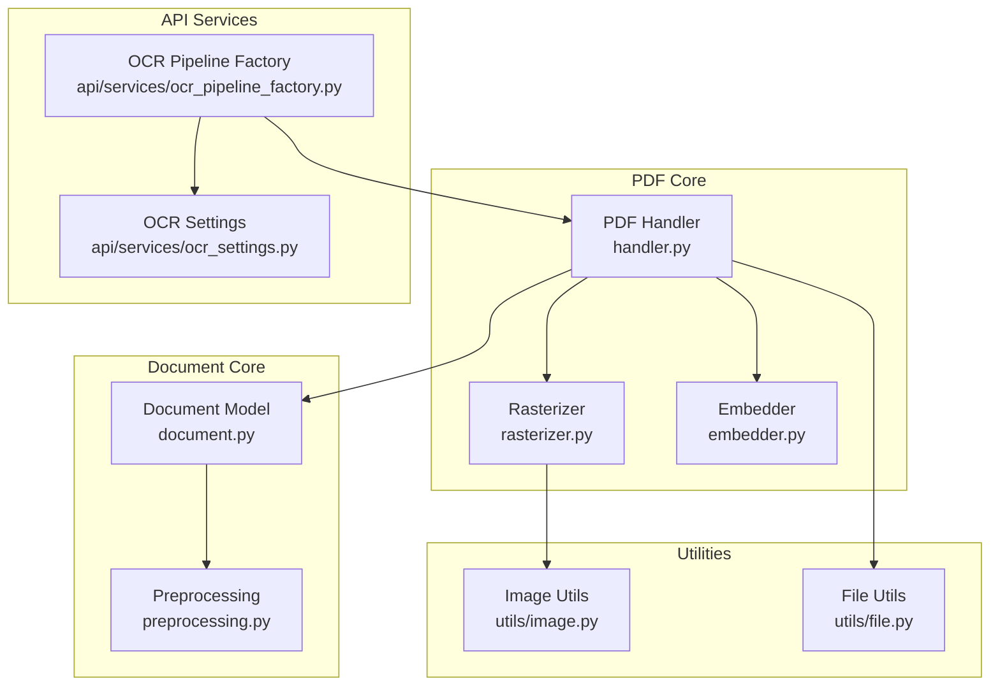
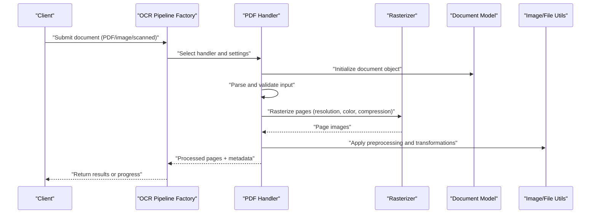
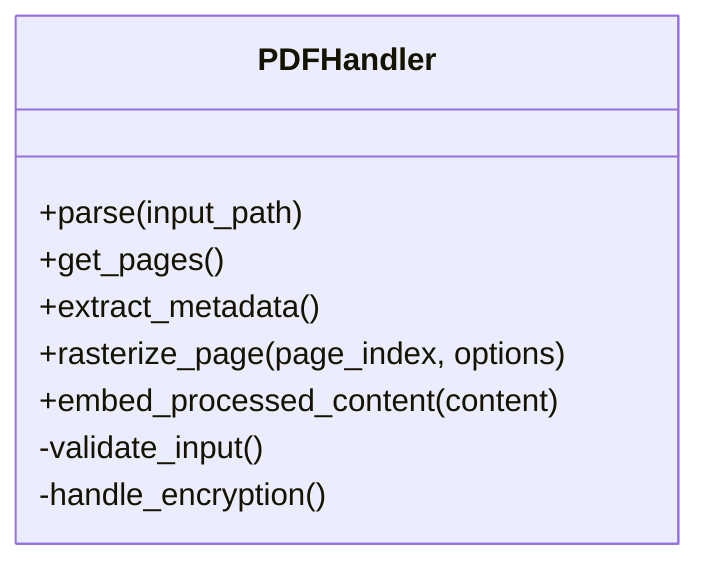
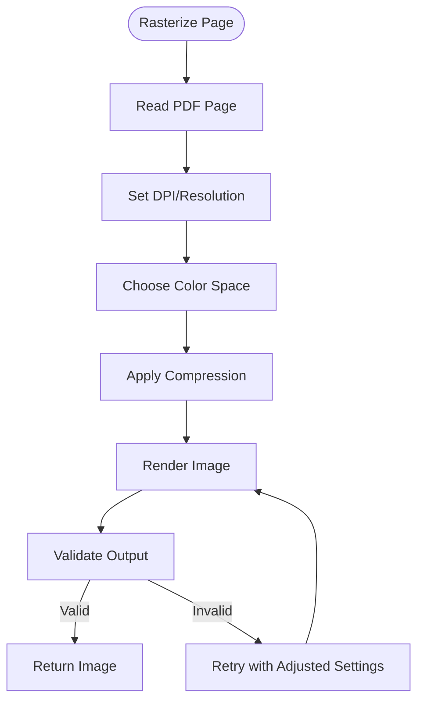
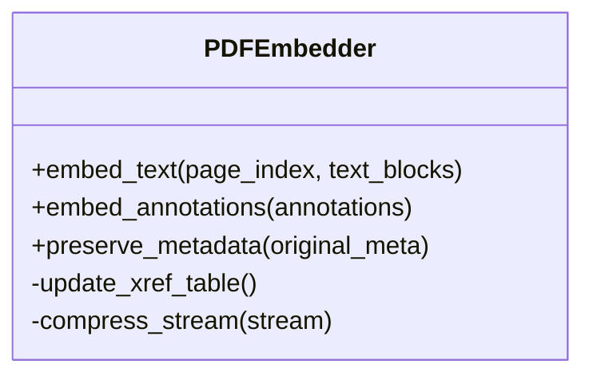
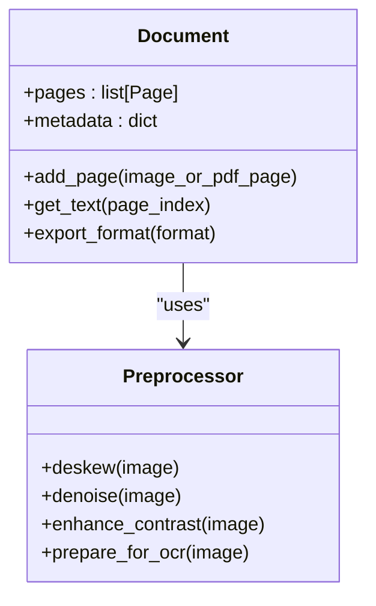
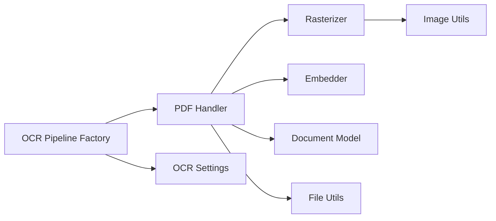

# PDF and Multi-Format Document Handling

<cite>
**Referenced Files in This Document**
- [handler.py](file://src/local_deepl/core/pdf/handler.py)
- [rasterizer.py](file://src/local_deepl/core/pdf/rasterizer.py)
- [embedder.py](file://src/local_deepl/core/pdf/embedder.py)
- [document.py](file://src/local_deepl/core/document.py)
- [preprocessing.py](file://src/local_deepl/core/preprocessing.py)
- [image.py](file://src/local_deepl/utils/image.py)
- [file.py](file://src/local_deepl/utils/file.py)
- [ocr_pipeline_factory.py](file://src/local_deepl/api/services/ocr_pipeline_factory.py)
- [ocr_settings.py](file://src/local_deepl/api/services/ocr_settings.py)
- [test_pdf.py](file://tests/test_pdf.py)
</cite>

## Table of Contents
1. [Introduction](#introduction)
2. [Project Structure](#project-structure)
3. [Core Components](#core-components)
4. [Architecture Overview](#architecture-overview)
5. [Detailed Component Analysis](#detailed-component-analysis)
6. [Dependency Analysis](#dependency-analysis)
7. [Performance Considerations](#performance-considerations)
8. [Troubleshooting Guide](#troubleshooting-guide)
9. [Conclusion](#conclusion)
10. [Appendices](#appendices)

## Introduction
This document explains how LocalDeepL handles PDFs and multi-format documents, focusing on the PDF handler architecture, page extraction, metadata management, and rasterization to images. It also covers supported input formats, configuration examples, error handling strategies for corrupted or encrypted files, performance optimization techniques for large documents, and practical batch processing workflows with memory management guidance.

## Project Structure
LocalDeepL organizes document handling under core modules:
- PDF-specific logic resides in src/local_deepl/core/pdf (handler, rasterizer, embedder).
- General document model and preprocessing live in src/local_deepl/core/document.py and src/local_deepl/core/preprocessing.py.
- Utilities for image and file operations are in src/local_deepl/utils.
- API services orchestrate OCR pipelines and settings selection based on input type.

**Diagram sources**
- [handler.py](file://src/local_deepl/core/pdf/handler.py)
- [rasterizer.py](file://src/local_deepl/core/pdf/rasterizer.py)
- [embedder.py](file://src/local_deepl/core/pdf/embedder.py)
- [document.py](file://src/local_deepl/core/document.py)
- [preprocessing.py](file://src/local_deepl/core/preprocessing.py)
- [image.py](file://src/local_deepl/utils/image.py)
- [file.py](file://src/local_deepl/utils/file.py)
- [ocr_pipeline_factory.py](file://src/local_deepl/api/services/ocr_pipeline_factory.py)
- [ocr_settings.py](file://src/local_deepl/api/services/ocr_settings.py)

**Section sources**
- [handler.py](file://src/local_deepl/core/pdf/handler.py)
- [rasterizer.py](file://src/local_deepl/core/pdf/rasterizer.py)
- [embedder.py](file://src/local_deepl/core/pdf/embedder.py)
- [document.py](file://src/local_deepl/core/document.py)
- [preprocessing.py](file://src/local_deepl/core/preprocessing.py)
- [image.py](file://src/local_deepl/utils/image.py)
- [file.py](file://src/local_deepl/utils/file.py)
- [ocr_pipeline_factory.py](file://src/local_deepl/api/services/ocr_pipeline_factory.py)
- [ocr_settings.py](file://src/local_deepl/api/services/ocr_settings.py)

## Core Components
- PDF Handler: Orchestrates parsing, page iteration, metadata extraction, and coordination with rasterization and embedding.
- Rasterizer: Converts PDF pages to images with configurable resolution, color space, and compression.
- Embedder: Manages embedding of processed content back into PDF artifacts when needed.
- Document Model: Represents a document abstraction across formats, including pages, metadata, and extracted text.
- Preprocessing: Applies format-specific preprocessing steps before OCR or translation.
- Utilities: Provide robust image manipulation and file I/O helpers.
- API Services: Select appropriate OCR pipeline and settings based on input type and configuration.

**Section sources**
- [handler.py](file://src/local_deepl/core/pdf/handler.py)
- [rasterizer.py](file://src/local_deepl/core/pdf/rasterizer.py)
- [embedder.py](file://src/local_deepl/core/pdf/embedder.py)
- [document.py](file://src/local_deepl/core/document.py)
- [preprocessing.py](file://src/local_deepl/core/preprocessing.py)
- [image.py](file://src/local_deepl/utils/image.py)
- [file.py](file://src/local_deepl/utils/file.py)
- [ocr_pipeline_factory.py](file://src/local_deepl/api/services/ocr_pipeline_factory.py)
- [ocr_settings.py](file://src/local_deepl/api/services/ocr_settings.py)

## Architecture Overview
The PDF processing pipeline integrates multiple components to support diverse inputs and outputs:

**Diagram sources**
- [ocr_pipeline_factory.py](file://src/local_deepl/api/services/ocr_pipeline_factory.py)
- [handler.py](file://src/local_deepl/core/pdf/handler.py)
- [rasterizer.py](file://src/local_deepl/core/pdf/rasterizer.py)
- [document.py](file://src/local_deepl/core/document.py)
- [image.py](file://src/local_deepl/utils/image.py)
- [file.py](file://src/local_deepl/utils/file.py)

## Detailed Component Analysis

### PDF Handler
Responsibilities:
- Parse input documents (PDF, images, scanned files).
- Extract pages and metadata (title, author, creation date, page count).
- Coordinate rasterization and embedding processes.
- Manage errors for corrupted or unsupported files.

Key behaviors:
- Input validation and format detection.
- Page enumeration and safe iteration.
- Metadata aggregation and normalization.
- Error propagation for encryption, corruption, and unsupported features.

**Diagram sources**
- [handler.py](file://src/local_deepl/core/pdf/handler.py)

**Section sources**
- [handler.py](file://src/local_deepl/core/pdf/handler.py)

### Rasterizer
Responsibilities:
- Convert PDF pages to high-quality images.
- Support configurable DPI/resolution, color spaces (RGB, grayscale), and compression (JPEG, PNG).
- Handle anti-aliasing and scaling for optimal OCR accuracy.

Configuration highlights:
- Resolution control via DPI settings.
- Color space selection based on input characteristics.
- Compression trade-offs between quality and size.

**Diagram sources**
- [rasterizer.py](file://src/local_deepl/core/pdf/rasterizer.py)

**Section sources**
- [rasterizer.py](file://src/local_deepl/core/pdf/rasterizer.py)

### Embedder
Responsibilities:
- Embed processed text or annotations back into PDF artifacts.
- Preserve original layout and formatting where possible.
- Support incremental updates without full re-rendering.

Usage patterns:
- Post-OCR annotation insertion.
- Metadata preservation during round-trip editing.

**Diagram sources**
- [embedder.py](file://src/local_deepl/core/pdf/embedder.py)

**Section sources**
- [embedder.py](file://src/local_deepl/core/pdf/embedder.py)

### Document Model and Preprocessing
- Document Model: Unified representation for all input types, abstracting differences between PDF, images, and scanned documents.
- Preprocessing: Applies format-specific enhancements such as deskewing, noise reduction, contrast adjustment, and OCR-ready transformations.

**Diagram sources**
- [document.py](file://src/local_deepl/core/document.py)
- [preprocessing.py](file://src/local_deepl/core/preprocessing.py)

**Section sources**
- [document.py](file://src/local_deepl/core/document.py)
- [preprocessing.py](file://src/local_deepl/core/preprocessing.py)

### Utilities: Image and File Operations
- Image utilities provide robust manipulation functions for resizing, cropping, format conversion, and quality optimization.
- File utilities handle secure reading/writing, temporary storage, and cleanup for large documents.

Best practices:
- Use streaming for large files to avoid memory spikes.
- Implement retry logic for transient I/O failures.
- Validate file integrity before processing.

**Section sources**
- [image.py](file://src/local_deepl/utils/image.py)
- [file.py](file://src/local_deepl/utils/file.py)

### API Services: OCR Pipeline Factory and Settings
- OCR Pipeline Factory selects appropriate processing pipelines based on input type and configuration.
- OCR Settings define parameters like language, output format, and OCR engine preferences.

Integration points:
- Dynamic pipeline selection for PDF vs. image inputs.
- Configuration-driven behavior for different document types.

**Section sources**
- [ocr_pipeline_factory.py](file://src/local_deepl/api/services/ocr_pipeline_factory.py)
- [ocr_settings.py](file://src/local_deepl/api/services/ocr_settings.py)

## Dependency Analysis
The PDF processing system exhibits clear separation of concerns with minimal coupling:

**Diagram sources**
- [handler.py](file://src/local_deepl/core/pdf/handler.py)
- [rasterizer.py](file://src/local_deepl/core/pdf/rasterizer.py)
- [embedder.py](file://src/local_deepl/core/pdf/embedder.py)
- [document.py](file://src/local_deepl/core/document.py)
- [image.py](file://src/local_deepl/utils/image.py)
- [file.py](file://src/local_deepl/utils/file.py)
- [ocr_pipeline_factory.py](file://src/local_deepl/api/services/ocr_pipeline_factory.py)
- [ocr_settings.py](file://src/local_deepl/api/services/ocr_settings.py)

**Section sources**
- [handler.py](file://src/local_deepl/core/pdf/handler.py)
- [rasterizer.py](file://src/local_deepl/core/pdf/rasterizer.py)
- [embedder.py](file://src/local_deepl/core/pdf/embedder.py)
- [document.py](file://src/local_deepl/core/document.py)
- [image.py](file://src/local_deepl/utils/image.py)
- [file.py](file://src/local_deepl/utils/file.py)
- [ocr_pipeline_factory.py](file://src/local_deepl/api/services/ocr_pipeline_factory.py)
- [ocr_settings.py](file://src/local_deepl/api/services/ocr_settings.py)

## Performance Considerations
Optimization techniques for large documents:
- Stream processing: Process pages incrementally rather than loading entire documents into memory.
- Adaptive resolution: Use lower DPI for thumbnails and higher DPI only for detailed analysis.
- Parallel rasterization: Process multiple pages concurrently where resources allow.
- Memory pooling: Reuse image buffers and temporary files to reduce allocation overhead.
- Compression tuning: Balance between file size and OCR accuracy based on use case.

Batch processing recommendations:
- Chunk large documents into manageable segments.
- Implement progress tracking and checkpointing for long-running jobs.
- Use background workers for non-blocking processing.

**Section sources**
- [rasterizer.py](file://src/local_deepl/core/pdf/rasterizer.py)
- [image.py](file://src/local_deepl/utils/image.py)
- [file.py](file://src/local_deepl/utils/file.py)

## Troubleshooting Guide
Common issues and solutions:
- Corrupted PDFs: Validate file integrity before processing; implement fallback to image-based parsing.
- Encrypted PDFs: Prompt for passwords or use stored credentials securely; handle decryption failures gracefully.
- Format compatibility: Detect unsupported formats early and provide clear error messages.
- Memory exhaustion: Monitor memory usage and implement automatic chunking for large files.
- OCR accuracy: Adjust preprocessing parameters based on document quality and language.

Error handling strategies:
- Implement try-catch blocks around critical operations.
- Log detailed error information for debugging.
- Provide user-friendly error messages with actionable suggestions.

**Section sources**
- [handler.py](file://src/local_deepl/core/pdf/handler.py)
- [test_pdf.py](file://tests/test_pdf.py)

## Conclusion
LocalDeepL’s PDF and multi-format document handling provides a robust, extensible architecture for processing diverse document types. The modular design enables flexible configuration, efficient resource management, and comprehensive error handling. By following the recommended practices for performance optimization and troubleshooting, users can effectively process large document sets while maintaining high quality and reliability.

## Appendices

### Configuration Examples
- PDF Processing: Configure DPI, color space, and compression settings for optimal OCR results.
- Image Enhancement: Apply deskewing, denoising, and contrast enhancement for scanned documents.
- Batch Jobs: Define chunk sizes, parallelism levels, and progress reporting for large datasets.

### Supported Formats
- PDF: Native support with metadata extraction and page navigation.
- Images: JPEG, PNG, TIFF with automatic orientation detection.
- Scanned Documents: Enhanced preprocessing for low-quality scans.

### Practical Workflows
- Single Document Processing: Upload → Analyze → OCR → Export.
- Batch Processing: Queue documents → Process in chunks → Aggregate results.
- Real-time Processing: Stream upload → Immediate OCR → Live preview.