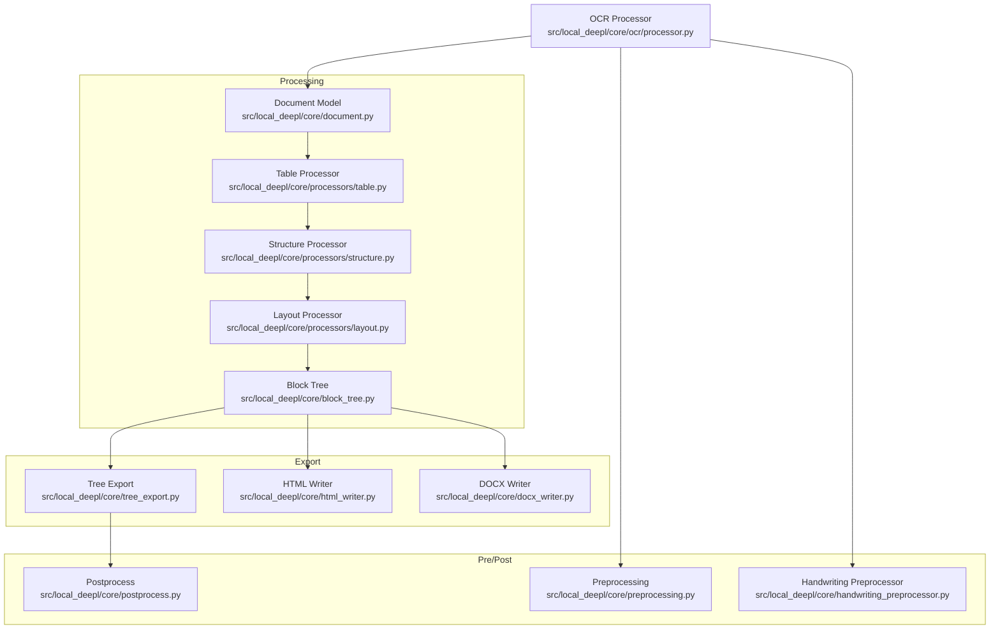
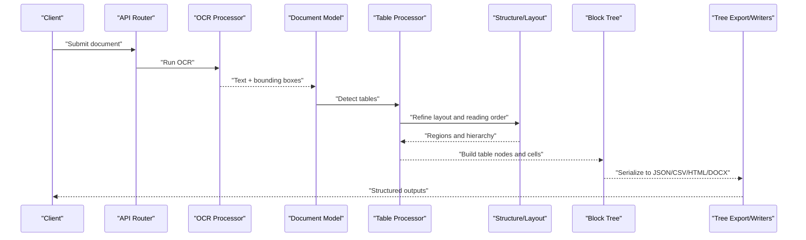
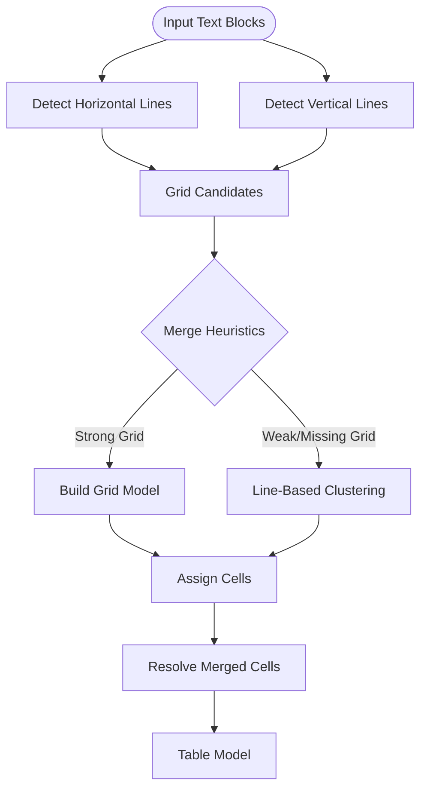
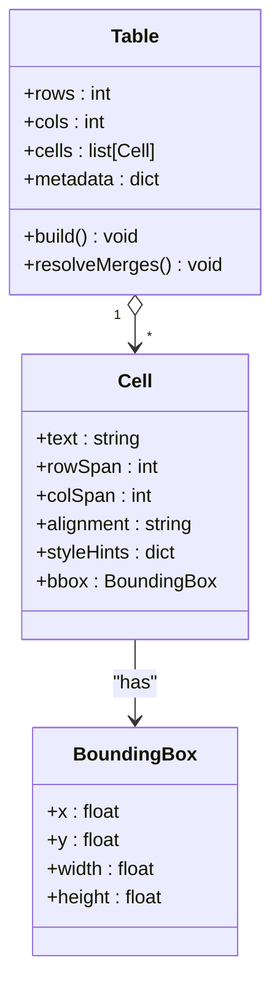
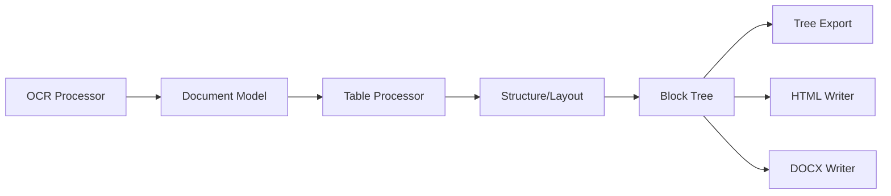

# Table Extraction and Processing

<cite>
**Referenced Files in This Document**
- [table.py](file://src/local_deepl/core/processors/table.py)
- [structure.py](file://src/local_deepl/core/processors/structure.py)
- [layout.py](file://src/local_deepl/core/processors/layout.py)
- [document.py](file://src/local_deepl/core/document.py)
- [block_tree.py](file://src/local_deepl/core/block_tree.py)
- [tree_export.py](file://src/local_deepl/core/tree_export.py)
- [html_writer.py](file://src/local_deepl/core/html_writer.py)
- [docx_writer.py](file://src/local_deepl/core/docx_writer.py)
- [postprocess.py](file://src/local_deepl/core/postprocess.py)
- [preprocessing.py](file://src/local_deepl/core/preprocessing.py)
- [handwriting_preprocessor.py](file://src/local_deepl/core/handwriting_preprocessor.py)
- [ocr_processor.py](file://src/local_deepl/core/ocr/processor.py)
- [test_table_extraction_run_via_processors.py](file://tests/test_table_extraction_run_via_processors.py)
</cite>

## Table of Contents
1. [Introduction](#introduction)
2. [Project Structure](#project-structure)
3. [Core Components](#core-components)
4. [Architecture Overview](#architecture-overview)
5. [Detailed Component Analysis](#detailed-component-analysis)
6. [Dependency Analysis](#dependency-analysis)
7. [Performance Considerations](#performance-considerations)
8. [Troubleshooting Guide](#troubleshooting-guide)
9. [Conclusion](#conclusion)
10. [Appendices](#appendices)

## Introduction
This document explains LocalDeepL’s table extraction and processing capabilities. It covers how tables are detected (grid-based and line-based), how cell content is parsed with merged cells and formatting preserved, supported output formats (structured JSON, CSV, HTML), configuration options for sensitivity and complex structures, and practical guidance for spreadsheets, forms, reports, poor-quality scans, handwritten tables, and multi-page tables.

## Project Structure
Table-related functionality is implemented across the core processors and writers:
- Detection and parsing live in the table processor and structure/layout processors.
- The block tree represents hierarchical document elements including tables.
- Exporters convert structured data to JSON, CSV, HTML, and DOCX.
- Pre- and post-processing modules improve robustness for challenging inputs.

**Diagram sources**
- [table.py](file://src/local_deepl/core/processors/table.py)
- [structure.py](file://src/local_deepl/core/processors/structure.py)
- [layout.py](file://src/local_deepl/core/processors/layout.py)
- [document.py](file://src/local_deepl/core/document.py)
- [block_tree.py](file://src/local_deepl/core/block_tree.py)
- [tree_export.py](file://src/local_deepl/core/tree_export.py)
- [html_writer.py](file://src/local_deepl/core/html_writer.py)
- [docx_writer.py](file://src/local_deepl/core/docx_writer.py)
- [postprocess.py](file://src/local_deepl/core/postprocess.py)
- [preprocessing.py](file://src/local_deepl/core/preprocessing.py)
- [handwriting_preprocessor.py](file://src/local_deepl/core/handwriting_preprocessor.py)
- [ocr_processor.py](file://src/local_deepl/core/ocr/processor.py)

**Section sources**
- [table.py](file://src/local_deepl/core/processors/table.py)
- [structure.py](file://src/local_deepl/core/processors/structure.py)
- [layout.py](file://src/local_deepl/core/processors/layout.py)
- [document.py](file://src/local_deepl/core/document.py)
- [block_tree.py](file://src/local_deepl/core/block_tree.py)
- [tree_export.py](file://src/local_deepl/core/tree_export.py)
- [html_writer.py](file://src/local_deepl/core/html_writer.py)
- [docx_writer.py](file://src/local_deepl/core/docx_writer.py)
- [postprocess.py](file://src/local_deepl/core/postprocess.py)
- [preprocessing.py](file://src/local_deepl/core/preprocessing.py)
- [handwriting_preprocessor.py](file://src/local_deepl/core/handwriting_preprocessor.py)
- [ocr_processor.py](file://src/local_deepl/core/ocr/processor.py)

## Core Components
- Table Processor: Detects tabular regions using grid and line cues, builds a table model, resolves merged cells, and preserves cell metadata such as alignment and style hints.
- Structure and Layout Processors: Refine region boundaries, reading order, and hierarchy that feed into table detection and cell assignment.
- Block Tree: Hierarchical representation of document blocks; tables are nodes with child cell nodes.
- Tree Export: Serializes the block tree into structured JSON and CSV representations.
- Writers: Convert the block tree to HTML and DOCX, preserving table semantics where possible.
- Pre/Post Processing: Enhance image quality and normalize text to improve OCR accuracy and downstream parsing.

Key responsibilities:
- Detection: Identify candidate tables via geometric heuristics and line/grid analysis.
- Parsing: Assign text spans to cells, handle merges, and retain formatting hints.
- Export: Provide multiple output formats tailored to different use cases.

**Section sources**
- [table.py](file://src/local_deepl/core/processors/table.py)
- [structure.py](file://src/local_deepl/core/processors/structure.py)
- [layout.py](file://src/local_deepl/core/processors/layout.py)
- [block_tree.py](file://src/local_deepl/core/block_tree.py)
- [tree_export.py](file://src/local_deepl/core/tree_export.py)
- [html_writer.py](file://src/local_deepl/core/html_writer.py)
- [docx_writer.py](file://src/local_deepl/core/docx_writer.py)
- [postprocess.py](file://src/local_deepl/core/postprocess.py)
- [preprocessing.py](file://src/local_deepl/core/preprocessing.py)

## Architecture Overview
The table pipeline integrates OCR results with geometric analysis to produce structured table outputs.

**Diagram sources**
- [ocr_processor.py](file://src/local_deepl/core/ocr/processor.py)
- [document.py](file://src/local_deepl/core/document.py)
- [table.py](file://src/local_deepl/core/processors/table.py)
- [structure.py](file://src/local_deepl/core/processors/structure.py)
- [layout.py](file://src/local_deepl/core/processors/layout.py)
- [block_tree.py](file://src/local_deepl/core/block_tree.py)
- [tree_export.py](file://src/local_deepl/core/tree_export.py)
- [html_writer.py](file://src/local_deepl/core/html_writer.py)
- [docx_writer.py](file://src/local_deepl/core/docx_writer.py)

## Detailed Component Analysis

### Table Detection Algorithms
LocalDeepL supports two complementary strategies:
- Grid-based detection: Uses horizontal and vertical line segments to infer grid lines and cell boundaries. Effective for clean digital documents and well-scanned PDFs.
- Line-based detection: Relies on text baseline alignment, spacing patterns, and column clustering when explicit grid lines are missing or broken.

These strategies are combined to increase recall and precision across varied inputs.

**Diagram sources**
- [table.py](file://src/local_deepl/core/processors/table.py)
- [structure.py](file://src/local_deepl/core/processors/structure.py)
- [layout.py](file://src/local_deepl/core/processors/layout.py)

**Section sources**
- [table.py](file://src/local_deepl/core/processors/table.py)
- [structure.py](file://src/local_deepl/core/processors/structure.py)
- [layout.py](file://src/local_deepl/core/processors/layout.py)

### Table Parsing and Cell Handling
Parsing converts raw text spans into structured cells:
- Cell assignment uses spatial overlap between text blocks and inferred grid/line regions.
- Merged cells are resolved by detecting spanning regions and propagating content consistently.
- Formatting hints (alignment, bold/italic indicators if present) are retained in cell metadata for export fidelity.

**Diagram sources**
- [table.py](file://src/local_deepl/core/processors/table.py)
- [block_tree.py](file://src/local_deepl/core/block_tree.py)

**Section sources**
- [table.py](file://src/local_deepl/core/processors/table.py)
- [block_tree.py](file://src/local_deepl/core/block_tree.py)

### Output Formats and Use Cases
- Structured JSON: Ideal for programmatic consumption, analytics pipelines, and downstream transformations. Captures rows, columns, merged cells, and metadata.
- CSV: Best for spreadsheet import and simple data workflows; flattens merged cells and may require post-processing for normalization.
- HTML Tables: Suitable for web rendering and rich-text previews; preserves basic table semantics and some styling hints.
- DOCX: For editable documents with embedded tables; retains structure and limited formatting.

Export pathways:
- Tree Export serializes the block tree to JSON/CSV.
- HTML Writer renders tables with appropriate tags and attributes.
- DOCX Writer embeds tables into Word documents.

**Section sources**
- [tree_export.py](file://src/local_deepl/core/tree_export.py)
- [html_writer.py](file://src/local_deepl/core/html_writer.py)
- [docx_writer.py](file://src/local_deepl/core/docx_writer.py)

### Configuration Options
Sensitivity and behavior can be tuned through configuration parameters typically exposed via OCR settings and pipeline configuration:
- Sensitivity thresholds for line detection and grid merging.
- Minimum row/column counts to accept a candidate table.
- Rules for handling nested tables and varying column widths.
- Flags to enable/disable specific detection strategies.

These options influence recall/precision trade-offs and robustness across document types.

**Section sources**
- [ocr_processor.py](file://src/local_deepl/core/ocr/processor.py)
- [table.py](file://src/local_deepl/core/processors/table.py)

### Examples Across Document Types
- Spreadsheets: High likelihood of strong grid lines; grid-based detection performs best.
- Forms: Mixed layouts with aligned fields; line-based clustering helps recover tabular structure.
- Reports: Complex headers, footers, and multi-column sections; combination strategy improves accuracy.

Validation and iteration:
- Use test harnesses to run table extraction via processors and inspect outputs.
- Adjust sensitivity thresholds based on observed false positives/negatives.

**Section sources**
- [test_table_extraction_run_via_processors.py](file://tests/test_table_extraction_run_via_processors.py)

### Post-Processing Techniques
Common steps to clean and normalize extracted tables:
- Trim whitespace and unify delimiters.
- Normalize numeric formats and dates.
- Resolve inconsistent merged cell representations.
- Align column names and types across rows.
- Handle missing values and outliers.

These steps improve downstream analytics and integration reliability.

**Section sources**
- [postprocess.py](file://src/local_deepl/core/postprocess.py)

## Dependency Analysis
Table processing depends on OCR outputs, layout refinement, and the block tree for serialization.

**Diagram sources**
- [ocr_processor.py](file://src/local_deepl/core/ocr/processor.py)
- [document.py](file://src/local_deepl/core/document.py)
- [table.py](file://src/local_deepl/core/processors/table.py)
- [structure.py](file://src/local_deepl/core/processors/structure.py)
- [layout.py](file://src/local_deepl/core/processors/layout.py)
- [block_tree.py](file://src/local_deepl/core/block_tree.py)
- [tree_export.py](file://src/local_deepl/core/tree_export.py)
- [html_writer.py](file://src/local_deepl/core/html_writer.py)
- [docx_writer.py](file://src/local_deepl/core/docx_writer.py)

**Section sources**
- [ocr_processor.py](file://src/local_deepl/core/ocr/processor.py)
- [document.py](file://src/local_deepl/core/document.py)
- [table.py](file://src/local_deepl/core/processors/table.py)
- [structure.py](file://src/local_deepl/core/processors/structure.py)
- [layout.py](file://src/local_deepl/core/processors/layout.py)
- [block_tree.py](file://src/local_deepl/core/block_tree.py)
- [tree_export.py](file://src/local_deepl/core/tree_export.py)
- [html_writer.py](file://src/local_deepl/core/html_writer.py)
- [docx_writer.py](file://src/local_deepl/core/docx_writer.py)

## Performance Considerations
- Prefer grid-based detection for high-quality digital documents to reduce computational overhead.
- Limit candidate table regions early using size and density filters.
- Cache intermediate geometric features (lines, clusters) when reprocessing similar pages.
- Batch exports to avoid repeated traversals of the block tree.
- Tune sensitivity thresholds to balance recall and runtime.

## Troubleshooting Guide
Common issues and remedies:
- Poor-quality scans: Apply preprocessing (deskew, denoise, contrast enhancement) before OCR.
- Handwritten tables: Enable handwriting-specific preprocessor and rely more on line-based clustering.
- Multi-page tables: Ensure consistent column detection across pages and merge fragments during export.
- Nested tables: Configure rules to prevent over-segmentation and preserve parent-child relationships.
- Varying column widths: Use adaptive clustering and tolerance thresholds for alignment.

Use validation scripts and tests to iterate on configurations and verify outputs.

**Section sources**
- [preprocessing.py](file://src/local_deepl/core/preprocessing.py)
- [handwriting_preprocessor.py](file://src/local_deepl/core/handwriting_preprocessor.py)
- [test_table_extraction_run_via_processors.py](file://tests/test_table_extraction_run_via_processors.py)

## Conclusion
LocalDeepL’s table extraction combines grid and line-based detection with robust parsing and flexible exports. By tuning sensitivity and leveraging pre/post-processing, it handles diverse document types and challenging inputs while delivering structured outputs suitable for analytics, web rendering, and document editing.

## Appendices
- Practical tips:
  - Start with default sensitivity and adjust thresholds incrementally.
  - Validate outputs against ground truth samples when available.
  - Use JSON for programmatic pipelines, CSV for quick imports, HTML for previews, and DOCX for editable artifacts.