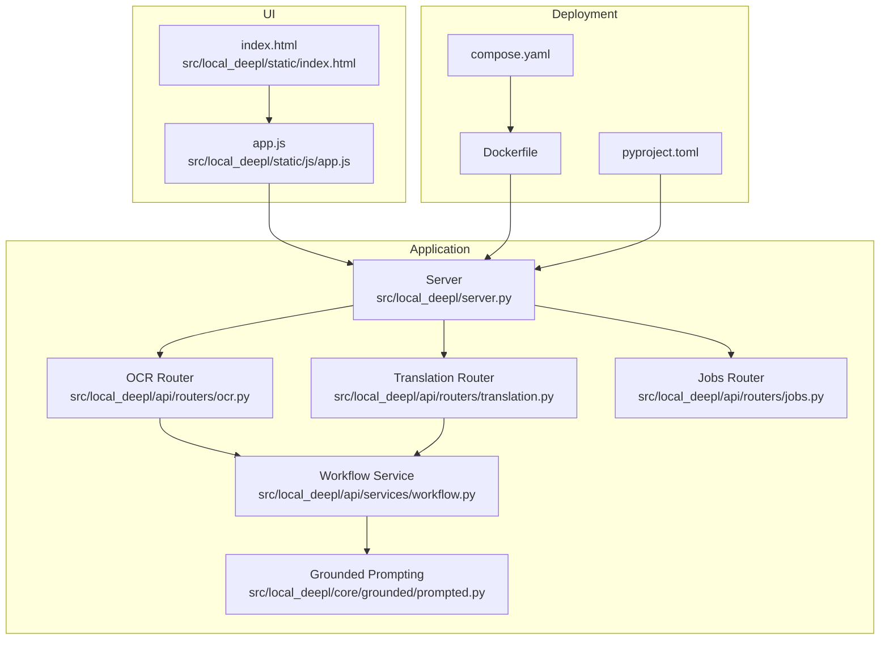
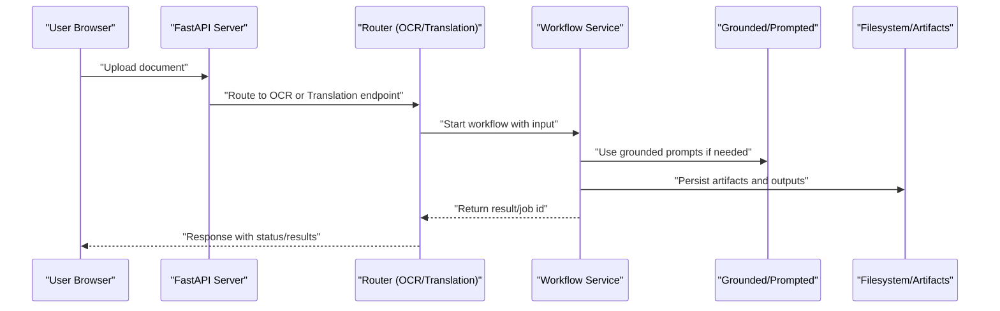
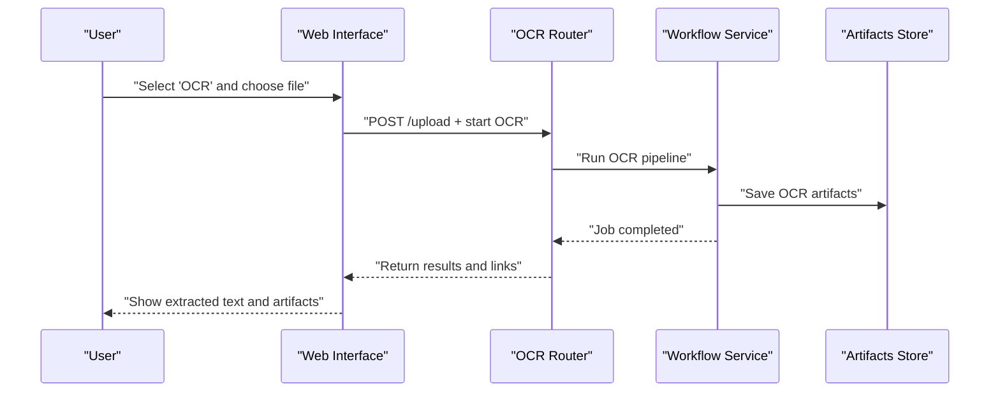
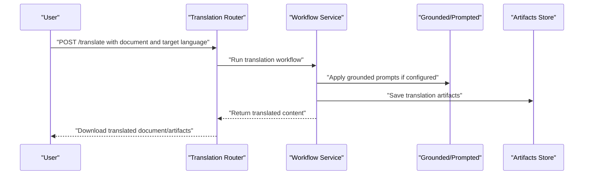
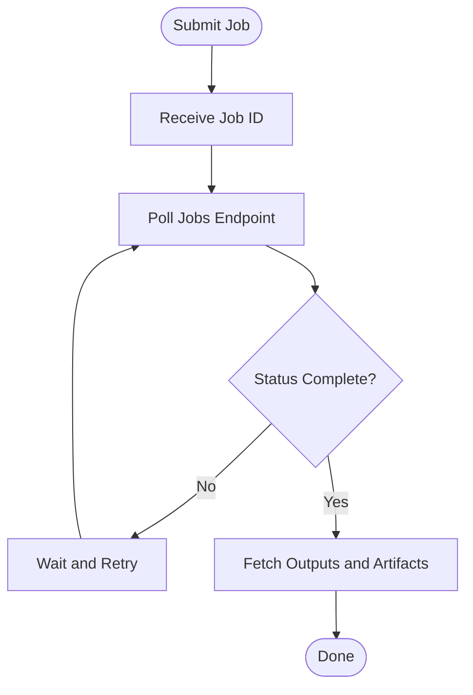
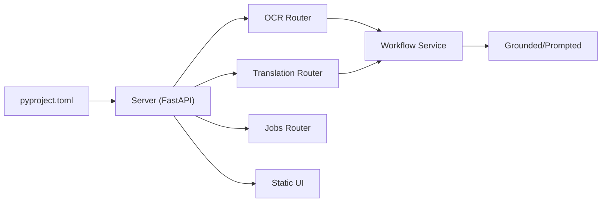

# Getting Started

<cite>
**Referenced Files in This Document**
- [README.md](file://README.md)
- [Dockerfile](file://Dockerfile)
- [compose.yaml](file://compose.yaml)
- [pyproject.toml](file://pyproject.toml)
- [src/local_deepl/server.py](file://src/local_deepl/server.py)
- [src/local_deepl/api/routers/ocr.py](file://src/local_deepl/api/routers/ocr.py)
- [src/local_deepl/api/routers/translation.py](file://src/local_deepl/api/routers/translation.py)
- [src/local_deepl/api/routers/jobs.py](file://src/local_deepl/api/routers/jobs.py)
- [src/local_deepl/api/services/workflow.py](file://src/local_deepl/api/services/workflow.py)
- [src/local_deepl/core/grounded/prompted.py](file://src/local_deepl/core/grounded/prompted.py)
- [src/local_deepl/static/index.html](file://src/local_deepl/static/index.html)
- [src/local_deepl/static/js/app.js](file://src/local_deepl/static/js/app.js)
</cite>

## Table of Contents
1. [Introduction](#introduction)
2. [Project Structure](#project-structure)
3. [Core Components](#core-components)
4. [Architecture Overview](#architecture-overview)
5. [Detailed Component Analysis](#detailed-component-analysis)
6. [Dependency Analysis](#dependency-analysis)
7. [Performance Considerations](#performance-considerations)
8. [Troubleshooting Guide](#troubleshooting-guide)
9. [Conclusion](#conclusion)
10. [Appendices](#appendices)

## Introduction
LocalDeepL is a local-first document processing and translation system. It extracts text from documents (including scanned images via OCR), aligns content, and translates it while preserving structure. The project provides:
- A FastAPI-based server with REST endpoints for OCR, translation, and job management
- An optional web interface for uploading documents and viewing results
- Flexible workflows that can combine OCR, grounding, and translation steps
- Docker support for quick deployment

This guide helps you install LocalDeepL, configure it, run the server, upload documents, and perform your first OCR and translation tasks.

## Project Structure
At a high level:
- src/local_deepl contains the application code (server, API routers, services, core logic, static UI assets)
- Dockerfile and compose.yaml provide containerized deployment options
- pyproject.toml defines Python dependencies and packaging metadata
- README.md includes overview and usage notes

**Diagram sources**
- [src/local_deepl/server.py](file://src/local_deepl/server.py)
- [src/local_deepl/api/routers/ocr.py](file://src/local_deepl/api/routers/ocr.py)
- [src/local_deepl/api/routers/translation.py](file://src/local_deepl/api/routers/translation.py)
- [src/local_deepl/api/routers/jobs.py](file://src/local_deepl/api/routers/jobs.py)
- [src/local_deepl/api/services/workflow.py](file://src/local_deepl/api/services/workflow.py)
- [src/local_deepl/core/grounded/prompted.py](file://src/local_deepl/core/grounded/prompted.py)
- [src/local_deepl/static/index.html](file://src/local_deepl/static/index.html)
- [src/local_deepl/static/js/app.js](file://src/local_deepl/static/js/app.js)
- [Dockerfile](file://Dockerfile)
- [compose.yaml](file://compose.yaml)
- [pyproject.toml](file://pyproject.toml)

**Section sources**
- [README.md](file://README.md)
- [Dockerfile](file://Dockerfile)
- [compose.yaml](file://compose.yaml)
- [pyproject.toml](file://pyproject.toml)
- [src/local_deepl/server.py](file://src/local_deepl/server.py)

## Core Components
- Server entrypoint: Initializes the FastAPI app and mounts routers and static files.
- API routers: Expose endpoints for OCR, translation, jobs, and configuration.
- Workflow service: Orchestrates multi-step pipelines (OCR, alignment, translation).
- Grounded prompting: Provides LLM-driven grounding utilities used by workflows.
- Static UI: Web interface to upload documents and view results.

Key responsibilities:
- Upload and manage documents
- Run OCR on image-based inputs
- Translate extracted or structured content
- Track job progress and artifacts

**Section sources**
- [src/local_deepl/server.py](file://src/local_deepl/server.py)
- [src/local_deepl/api/routers/ocr.py](file://src/local_deepl/api/routers/ocr.py)
- [src/local_deepl/api/routers/translation.py](file://src/local_deepl/api/routers/translation.py)
- [src/local_deepl/api/routers/jobs.py](file://src/local_deepl/api/routers/jobs.py)
- [src/local_deepl/api/services/workflow.py](file://src/local_deepl/api/services/workflow.py)
- [src/local_deepl/core/grounded/prompted.py](file://src/local_deepl/core/grounded/prompted.py)
- [src/local_deepl/static/index.html](file://src/local_deepl/static/index.html)
- [src/local_deepl/static/js/app.js](file://src/local_deepl/static/js/app.js)

## Architecture Overview
The typical request flow:
- Client uploads a document via the web UI or directly calls the API
- The server routes the request to the appropriate router (OCR or Translation)
- The workflow service coordinates processing steps (OCR, alignment, translation)
- Results and artifacts are stored and returned to the client

**Diagram sources**
- [src/local_deepl/server.py](file://src/local_deepl/server.py)
- [src/local_deepl/api/routers/ocr.py](file://src/local_deepl/api/routers/ocr.py)
- [src/local_deepl/api/routers/translation.py](file://src/local_deepl/api/routers/translation.py)
- [src/local_deepl/api/services/workflow.py](file://src/local_deepl/api/services/workflow.py)
- [src/local_deepl/core/grounded/prompted.py](file://src/local_deepl/core/grounded/prompted.py)

## Detailed Component Analysis

### Installation Methods
Choose one of the following methods based on your environment.

- Using pip (Python virtual environment)
  - Create and activate a Python virtual environment
  - Install the package using the project’s dependency definition
  - Start the server using the provided entrypoint command
  - Access the web interface at the default host/port

- Using Docker
  - Build the image from the provided Dockerfile
  - Run the container exposing the server port
  - Open the web interface at the mapped host/port

- Using Docker Compose
  - Use compose.yaml to build and run the service
  - Open the web interface at the mapped host/port

Prerequisites:
- Python 3.x compatible with the project’s dependency specification
- Docker and Docker Compose (if using containerized deployment)
- Sufficient disk space for models and artifacts

Environment variables:
- Review the server and configuration modules for supported settings (for example, ports, model paths, logging levels). Set them before starting the server.

Common setup issues:
- Missing dependencies or incompatible Python version
- Port conflicts when running the server locally
- Insufficient permissions to write artifact directories
- Network restrictions preventing model downloads (if applicable)

**Section sources**
- [pyproject.toml](file://pyproject.toml)
- [Dockerfile](file://Dockerfile)
- [compose.yaml](file://compose.yaml)
- [src/local_deepl/server.py](file://src/local_deepl/server.py)

### Basic Configuration Options
- Server host and port
- Logging verbosity
- Paths for models and artifacts
- Security-related flags (if enabled)

Set these via environment variables before launching the server. Refer to the server initialization and configuration modules for available keys and defaults.

**Section sources**
- [src/local_deepl/server.py](file://src/local_deepl/server.py)

### First-Time User Workflow
1. Start the server using your chosen installation method.
2. Open the web interface in your browser.
3. Upload a document (PDF, DOCX, or image).
4. Choose an operation:
   - OCR: Extract text from scanned pages
   - Translation: Translate existing text content
5. Monitor job progress and download results or artifacts.

If you prefer direct API usage:
- Upload a file to the upload endpoint
- Trigger OCR or translation via their respective endpoints
- Poll job status until completion
- Retrieve outputs and artifacts

**Section sources**
- [src/local_deepl/static/index.html](file://src/local_deepl/static/index.html)
- [src/local_deepl/static/js/app.js](file://src/local_deepl/static/js/app.js)
- [src/local_deepl/api/routers/ocr.py](file://src/local_deepl/api/routers/ocr.py)
- [src/local_deepl/api/routers/translation.py](file://src/local_deepl/api/routers/translation.py)
- [src/local_deepl/api/routers/jobs.py](file://src/local_deepl/api/routers/jobs.py)

### Practical Examples

#### Example 1: Upload and OCR a Scanned PDF
- Upload the scanned PDF via the web UI or API
- Invoke the OCR endpoint
- Wait for the job to complete
- Download the extracted text and any intermediate artifacts

**Diagram sources**
- [src/local_deepl/static/index.html](file://src/local_deepl/static/index.html)
- [src/local_deepl/static/js/app.js](file://src/local_deepl/static/js/app.js)
- [src/local_deepl/api/routers/ocr.py](file://src/local_deepl/api/routers/ocr.py)
- [src/local_deepl/api/services/workflow.py](file://src/local_deepl/api/services/workflow.py)

#### Example 2: Translate Existing Text Content
- Upload a document containing extractable text (e.g., DOCX or digital PDF)
- Invoke the translation endpoint with target language
- Retrieve translated output and aligned artifacts

**Diagram sources**
- [src/local_deepl/api/routers/translation.py](file://src/local_deepl/api/routers/translation.py)
- [src/local_deepl/api/services/workflow.py](file://src/local_deepl/api/services/workflow.py)
- [src/local_deepl/core/grounded/prompted.py](file://src/local_deepl/core/grounded/prompted.py)

#### Example 3: Job Progress Monitoring
- After submitting a job, poll the jobs endpoint for status updates
- Use the returned job ID to check progress and retrieve final outputs

**Diagram sources**
- [src/local_deepl/api/routers/jobs.py](file://src/local_deepl/api/routers/jobs.py)

## Dependency Analysis
LocalDeepL depends on:
- FastAPI and related ASGI components for the HTTP server
- Optional Celery for background tasks (if enabled)
- OCR and translation engines as defined in the core modules
- Static frontend assets served by the server

**Diagram sources**
- [pyproject.toml](file://pyproject.toml)
- [src/local_deepl/server.py](file://src/local_deepl/server.py)
- [src/local_deepl/api/routers/ocr.py](file://src/local_deepl/api/routers/ocr.py)
- [src/local_deepl/api/routers/translation.py](file://src/local_deepl/api/routers/translation.py)
- [src/local_deepl/api/routers/jobs.py](file://src/local_deepl/api/routers/jobs.py)
- [src/local_deepl/api/services/workflow.py](file://src/local_deepl/api/services/workflow.py)
- [src/local_deepl/core/grounded/prompted.py](file://src/local_deepl/core/grounded/prompted.py)
- [src/local_deepl/static/index.html](file://src/local_deepl/static/index.html)

**Section sources**
- [pyproject.toml](file://pyproject.toml)
- [src/local_deepl/server.py](file://src/local_deepl/server.py)

## Performance Considerations
- Prefer digital documents over scanned images when possible to reduce OCR overhead
- Use batch operations where supported to minimize repeated model loads
- Allocate sufficient CPU/GPU resources for OCR and translation workloads
- Tune logging verbosity to avoid excessive I/O in production
- Cache frequently used artifacts to speed up repeated workflows

[No sources needed since this section provides general guidance]

## Troubleshooting Guide
- Server fails to start
  - Check for port conflicts and ensure the selected host/port is available
  - Verify environment variables are set correctly
  - Review logs for missing dependencies or configuration errors

- OCR produces poor results
  - Ensure input images are clear and legible
  - Adjust OCR-specific settings if exposed via configuration
  - Validate that required OCR models or binaries are present

- Translation fails or returns empty output
  - Confirm the source document contains extractable text
  - Check target language compatibility and model availability
  - Inspect job logs and artifacts for error details

- Web interface cannot connect to the server
  - Verify the server is running and accessible at the expected address
  - Check CORS or security middleware settings if customizing deployment

**Section sources**
- [src/local_deepl/server.py](file://src/local_deepl/server.py)
- [src/local_deepl/api/routers/ocr.py](file://src/local_deepl/api/routers/ocr.py)
- [src/local_deepl/api/routers/translation.py](file://src/local_deepl/api/routers/translation.py)
- [src/local_deepl/api/routers/jobs.py](file://src/local_deepl/api/routers/jobs.py)

## Conclusion
You now have the essentials to install LocalDeepL, run the server, upload documents, and perform OCR and translation workflows. For advanced customization, explore the configuration options and workflow services. If you encounter issues, consult the troubleshooting guide and review logs and artifacts for diagnostics.

[No sources needed since this section summarizes without analyzing specific files]

## Appendices

### Quick Commands Reference
- Install via pip: use the project’s dependency specification to install into a virtual environment
- Start the server: launch the FastAPI server using the provided entrypoint
- Docker: build and run the container using the Dockerfile
- Compose: run the service using compose.yaml

**Section sources**
- [pyproject.toml](file://pyproject.toml)
- [Dockerfile](file://Dockerfile)
- [compose.yaml](file://compose.yaml)
- [src/local_deepl/server.py](file://src/local_deepl/server.py)