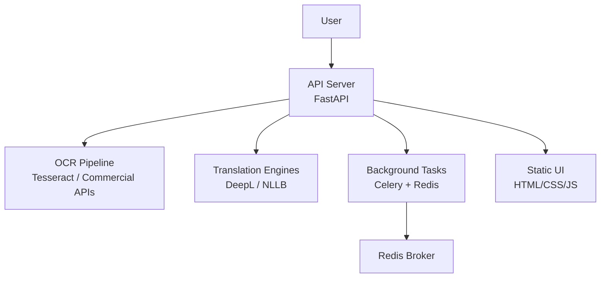
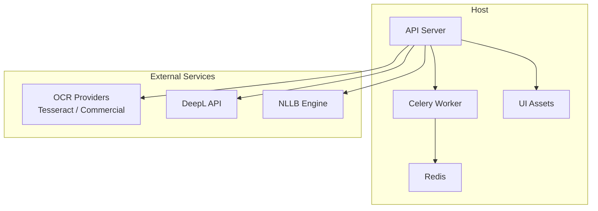
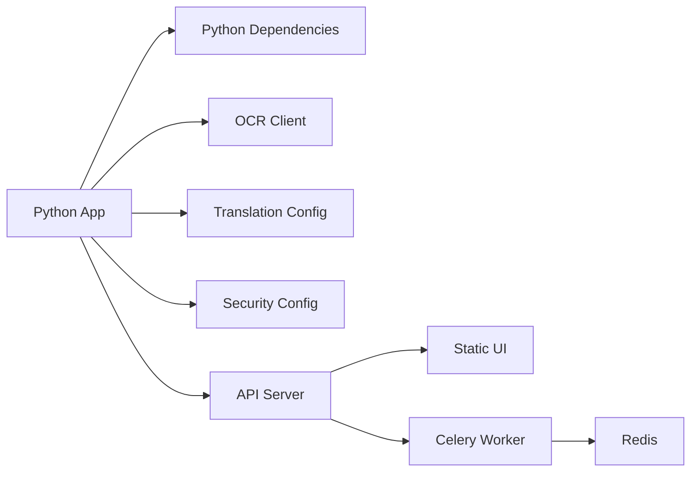

# Installation and Setup

<cite>
**Referenced Files in This Document**
- [README.md](file://README.md)
- [Dockerfile](file://Dockerfile)
- [compose.yaml](file://compose.yaml)
- [pyproject.toml](file://pyproject.toml)
- [.pre-commit-config.yaml](file://.pre-commit-config.yaml)
- [Makefile](file://Makefile)
- [install.ps1](file://install.ps1)
- [src/local_deepl/server.py](file://src/local_deepl/server.py)
- [src/local_deepl/api/services/security_config.py](file://src/local_deepl/api/services/security_config.py)
- [src/local_deepl/core/ocr/client.py](file://src/local_deepl/core/ocr/client.py)
- [src/local_deepl/core/nllb_engine.py](file://src/local_deepl/core/nllb_engine.py)
- [src/local_deepl/core/translation_config.py](file://src/local_deepl/core/translation_config.py)
</cite>

## Table of Contents
1. [Introduction](#introduction)
2. [Project Structure](#project-structure)
3. [Core Components](#core-components)
4. [Architecture Overview](#architecture-overview)
5. [Detailed Component Analysis](#detailed-component-analysis)
6. [Dependency Analysis](#dependency-analysis)
7. [Performance Considerations](#performance-considerations)
8. [Troubleshooting Guide](#troubleshooting-guide)
9. [Conclusion](#conclusion)
10. [Appendices](#appendices)

## Introduction
This document provides a complete installation and setup guide for LocalDeepL, covering system requirements, multiple installation methods (pip from source, Docker container, and Docker Compose), environment configuration for OCR engines and translation services, verification steps, common issues, development setup, security configuration, and initial user setup.

## Project Structure
LocalDeepL is a Python application with an API server, OCR pipeline, translation engines, and optional background tasks. It can be run directly via Python or containerized using Docker and orchestrated with Docker Compose.

[No sources needed since this diagram shows conceptual workflow, not actual code structure]

## Core Components
- API server: FastAPI-based HTTP/WebSocket endpoints for OCR, translation, jobs, artifacts, and configuration.
- OCR subsystem: Pluggable clients supporting Tesseract and commercial OCR providers.
- Translation subsystem: DeepL client and local NLLB engine integration.
- Background processing: Celery worker for long-running tasks with Redis broker.
- Static assets: Web UI files served by the API server.

Key entry points and configuration modules are defined in the server module, security configuration, OCR client, translation config, and NLLB engine.

**Section sources**
- [src/local_deepl/server.py](file://src/local_deepl/server.py)
- [src/local_deepl/api/services/security_config.py](file://src/local_deepl/api/services/security_config.py)
- [src/local_deepl/core/ocr/client.py](file://src/local_deepl/core/ocr/client.py)
- [src/local_deepl/core/translation_config.py](file://src/local_deepl/core/translation_config.py)
- [src/local_deepl/core/nllb_engine.py](file://src/local_deepl/core/nllb_engine.py)

## Architecture Overview
The runtime architecture consists of the API server orchestrating OCR and translation workflows, optionally offloading heavy work to Celery workers backed by Redis. The static web interface is served alongside the API.

**Diagram sources**
- [src/local_deepl/server.py](file://src/local_deepl/server.py)
- [compose.yaml](file://compose.yaml)

**Section sources**
- [compose.yaml](file://compose.yaml)
- [src/local_deepl/server.py](file://src/local_deepl/server.py)

## Detailed Component Analysis

### System Requirements
- Python: Use a compatible version as specified by the project’s package configuration. Ensure your environment matches the required Python version before installing dependencies.
- Optional native dependencies:
  - Tesseract OCR: Install the Tesseract binary on your system if you plan to use the Tesseract OCR engine.
- External services:
  - DeepL API key for cloud translation.
  - Redis for Celery task broker (required when running workers).
- Docker:
  - Docker Engine for containerized deployment.
  - Docker Compose for multi-service orchestration.

Verify your Python version and availability of external binaries/services before proceeding.

**Section sources**
- [pyproject.toml](file://pyproject.toml)
- [Dockerfile](file://Dockerfile)

### Installation Methods

#### Pip Installation from Source
- Prepare a virtual environment with the correct Python version.
- Install the package from the repository root using the project’s packaging configuration.
- If using Tesseract locally, ensure the Tesseract binary is installed and discoverable by the OCR client.
- Configure environment variables for OCR and translation services as described in the Environment Configuration section.
- Start the API server using the provided command or script.

Verification:
- Confirm the API server starts and serves the static UI.
- Test OCR endpoints with a sample image/PDF.
- Test translation endpoints with a sample text payload.

**Section sources**
- [pyproject.toml](file://pyproject.toml)
- [Makefile](file://Makefile)
- [src/local_deepl/server.py](file://src/local_deepl/server.py)

#### Docker Container Deployment
- Build the image using the provided Dockerfile or pull the published image if available.
- Run the container with necessary environment variables for OCR and translation services.
- Expose the API port and mount any required volumes for persistent data.

Verification:
- Access the API health endpoint and UI through the exposed port.
- Submit a test OCR job and confirm completion.

**Section sources**
- [Dockerfile](file://Dockerfile)

#### Docker Compose Setup
- Use the provided compose file to start the API server, Celery worker, and Redis together.
- Provide environment variables for all services (OCR, translation, database connections if applicable).
- Optionally configure networking and volume mounts for persistence.

Verification:
- Check that all services are healthy.
- Send a request to the API and verify background tasks are processed by the worker.

**Section sources**
- [compose.yaml](file://compose.yaml)

### Environment Configuration

#### OCR Engines
- Tesseract:
  - Install the Tesseract binary on the host or within the container.
  - Ensure the OCR client can locate the Tesseract executable.
- Commercial OCR APIs:
  - Provide required credentials and endpoints via environment variables consumed by the OCR client.

Configuration references:
- OCR client initialization and provider selection.

**Section sources**
- [src/local_deepl/core/ocr/client.py](file://src/local_deepl/core/ocr/client.py)

#### Translation Services
- DeepL:
  - Set the DeepL API key and any regional or model options via environment variables.
- NLLB:
  - Configure the NLLB engine parameters such as model path or runtime settings.

Configuration references:
- Translation configuration module.
- NLLB engine module.

**Section sources**
- [src/local_deepl/core/translation_config.py](file://src/local_deepl/core/translation_config.py)
- [src/local_deepl/core/nllb_engine.py](file://src/local_deepl/core/nllb_engine.py)

#### Database Connections
- If using a persistent store for jobs/artifacts, configure connection strings via environment variables consumed by the application.
- For Docker Compose, ensure the database service is reachable and credentials are set.

Note: Verify whether the application uses a database backend; if so, provide appropriate connection details.

**Section sources**
- [compose.yaml](file://compose.yaml)

### Verification Procedures
- Health check:
  - Call the API health/status endpoint to confirm the server is running.
- OCR test:
  - Upload a sample image or PDF and verify OCR output.
- Translation test:
  - Send a short text payload to the translation endpoint and validate the response.
- Background tasks:
  - Trigger a long-running job and confirm it completes via the worker logs.

**Section sources**
- [src/local_deepl/server.py](file://src/local_deepl/server.py)

### Common Installation Issues and Solutions
- Python version mismatch:
  - Ensure your Python version matches the requirement specified in the project configuration.
- Missing Tesseract binary:
  - Install Tesseract and ensure it is on PATH or configured correctly for the OCR client.
- Missing external service credentials:
  - Provide valid API keys and endpoints for OCR and translation services.
- Redis connectivity:
  - When using Celery, ensure Redis is running and accessible at the configured host/port.
- Docker networking:
  - In Compose setups, verify service names and ports match the expected configuration.

**Section sources**
- [pyproject.toml](file://pyproject.toml)
- [compose.yaml](file://compose.yaml)
- [src/local_deepl/core/ocr/client.py](file://src/local_deepl/core/ocr/client.py)

### Development Environment Setup
- Pre-commit hooks:
  - Install and configure pre-commit hooks using the provided configuration file.
- Testing dependencies:
  - Install test requirements and run the test suite to validate the environment.
- Utility scripts:
  - Use the Makefile targets for common development tasks like linting, building fixtures, and running tests.

Verification:
- Run pre-commit checks on staged files.
- Execute the test suite and confirm all tests pass.

**Section sources**
- [.pre-commit-config.yaml](file://.pre-commit-config.yaml)
- [Makefile](file://Makefile)

### Security Configuration and Initial User Setup
- Security middleware and configuration:
  - Review and adjust security settings such as authentication, authorization, and CORS policies.
- Initial user setup:
  - Create an admin or default user account if supported by the application’s user management features.
- Secrets management:
  - Store sensitive values (API keys, DB credentials) securely via environment variables or secret managers.

**Section sources**
- [src/local_deepl/api/services/security_config.py](file://src/local_deepl/api/services/security_config.py)

## Dependency Analysis
LocalDeepL depends on:
- Python packages defined in the project configuration.
- Optional native libraries (e.g., Tesseract).
- External services (DeepL, Redis, OCR providers).
- Docker and Docker Compose for containerized deployments.

**Diagram sources**
- [pyproject.toml](file://pyproject.toml)
- [compose.yaml](file://compose.yaml)

**Section sources**
- [pyproject.toml](file://pyproject.toml)
- [compose.yaml](file://compose.yaml)

## Performance Considerations
- Use Celery workers for CPU-intensive OCR and translation tasks to keep the API responsive.
- Cache frequently used resources where possible (e.g., models, dictionaries).
- Tune OCR preprocessing and translation batch sizes based on workload characteristics.
- Monitor Redis and worker queues to prevent bottlenecks.

[No sources needed since this section provides general guidance]

## Troubleshooting Guide
- API server fails to start:
  - Check environment variables and service connectivity.
  - Inspect logs for missing dependencies or misconfigurations.
- OCR errors:
  - Validate Tesseract installation and paths.
  - Verify commercial OCR credentials and endpoints.
- Translation failures:
  - Confirm DeepL API key validity and rate limits.
  - Check NLLB engine configuration and model availability.
- Celery worker not processing tasks:
  - Ensure Redis is reachable and credentials are correct.
  - Verify worker process is running and consuming tasks.

**Section sources**
- [src/local_deepl/server.py](file://src/local_deepl/server.py)
- [src/local_deepl/core/ocr/client.py](file://src/local_deepl/core/ocr/client.py)
- [src/local_deepl/core/nllb_engine.py](file://src/local_deepl/core/nllb_engine.py)

## Conclusion
You now have the information needed to install, configure, and operate LocalDeepL via pip, Docker, or Docker Compose. Follow the verification steps to ensure everything works, consult the troubleshooting guide for common issues, and leverage the development setup to contribute or extend the system.

## Appendices

### Quick Start Checklist
- Install Python and dependencies.
- Install Tesseract if using local OCR.
- Configure OCR and translation environment variables.
- Start the API server (directly or via Docker/Compose).
- Verify health, OCR, and translation endpoints.
- Run Celery worker with Redis if using background tasks.

[No sources needed since this section summarizes without analyzing specific files]