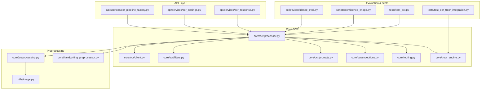
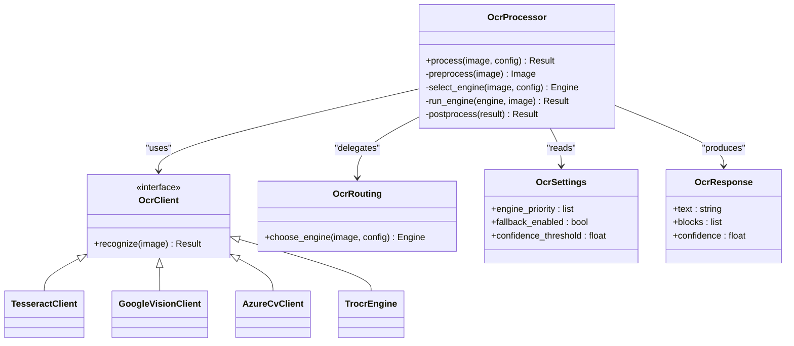
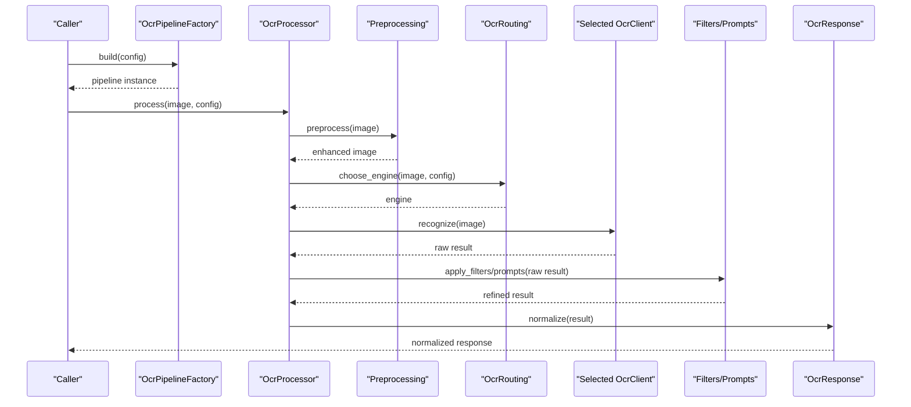
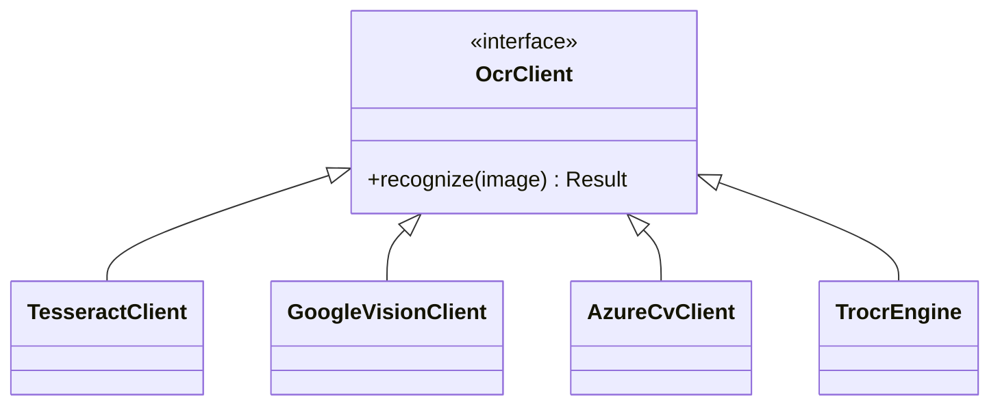
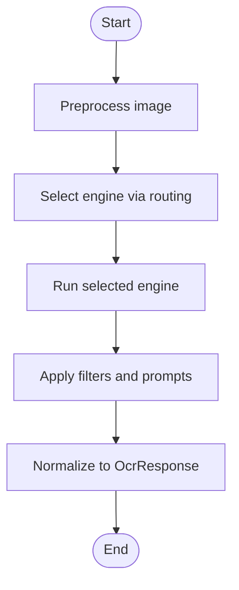
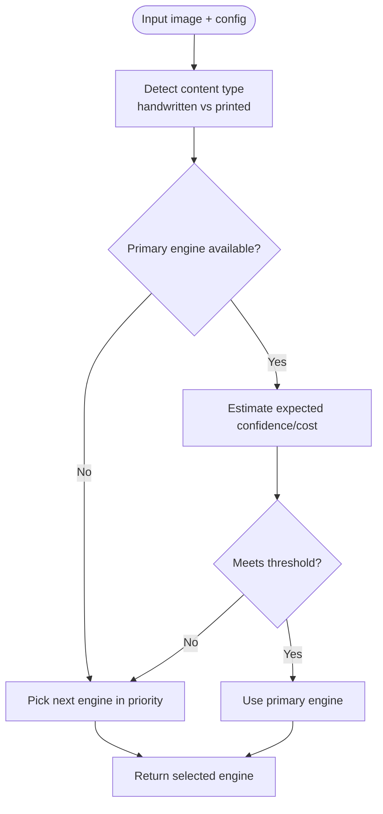
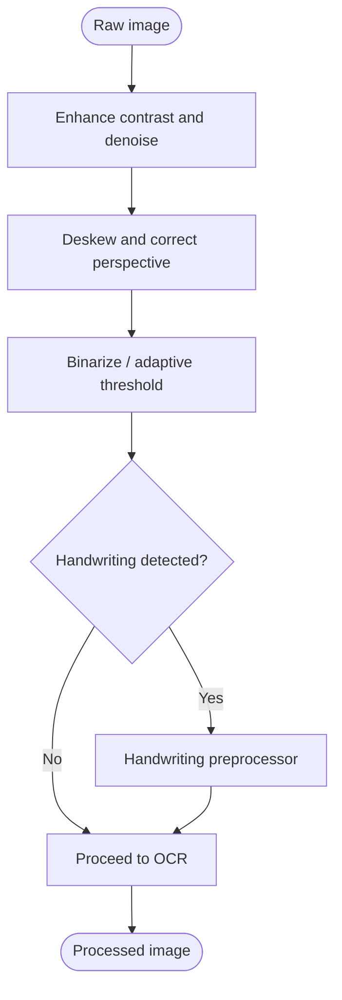
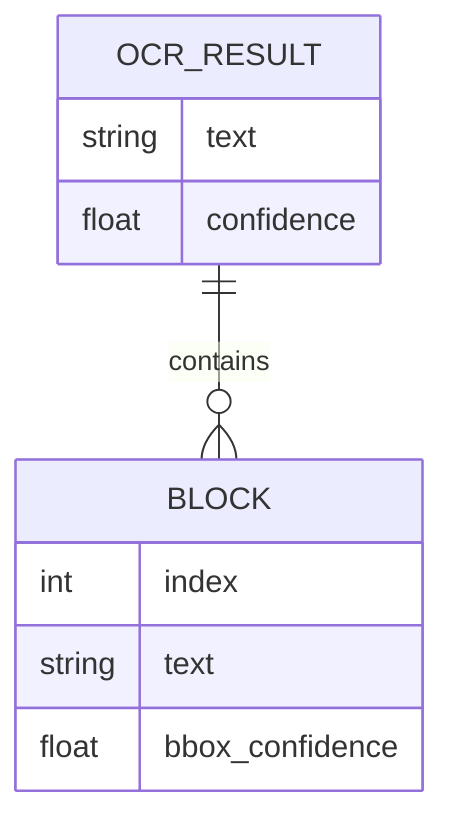
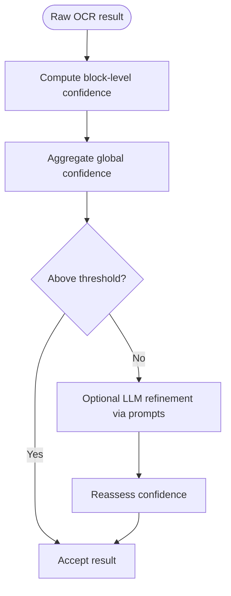
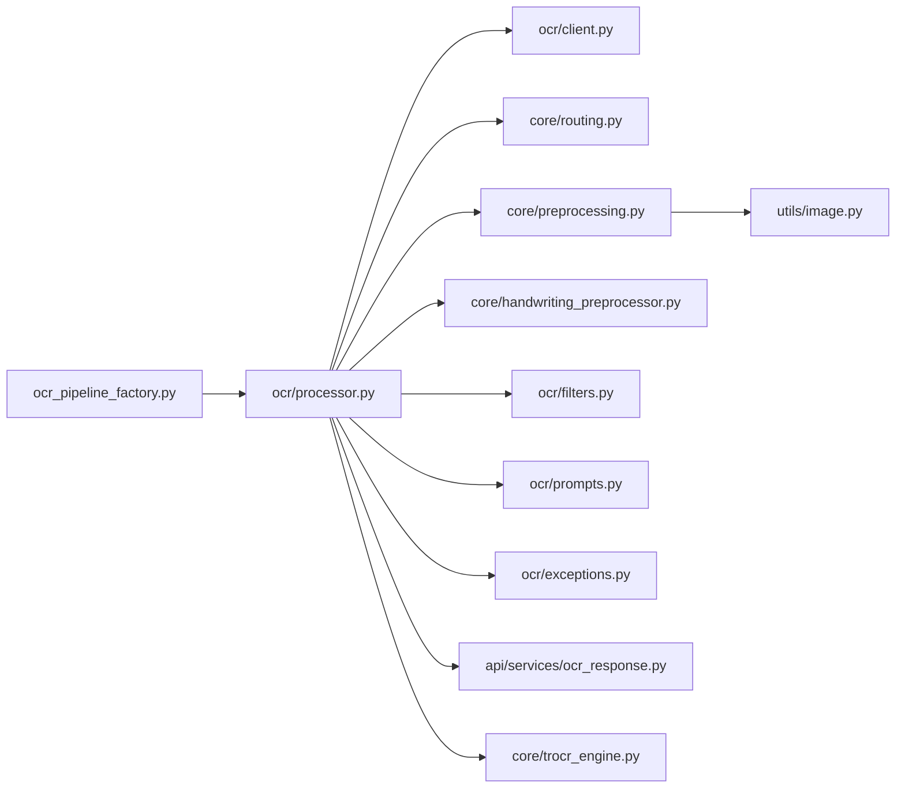

# OCR Engine Integration

<cite>
**Referenced Files in This Document**
- [src/local_deepl/core/ocr/client.py](file://src/local_deepl/core/ocr/client.py)
- [src/local_deepl/core/ocr/processor.py](file://src/local_deepl/core/ocr/processor.py)
- [src/local_deepl/core/ocr/filters.py](file://src/local_deepl/core/ocr/filters.py)
- [src/local_deepl/core/ocr/prompts.py](file://src/local_deepl/core/ocr/prompts.py)
- [src/local_deepl/core/ocr/exceptions.py](file://src/local_deepl/core/ocr/exceptions.py)
- [src/local_deepl/api/services/ocr_pipeline_factory.py](file://src/local_deepl/api/services/ocr_pipeline_factory.py)
- [src/local_deepl/api/services/ocr_response.py](file://src/local_deepl/api/services/ocr_response.py)
- [src/local_deepl/api/services/ocr_settings.py](file://src/local_deepl/api/services/ocr_settings.py)
- [src/local_deepl/core/routing.py](file://src/local_deepl/core/routing.py)
- [src/local_deepl/core/trocr_engine.py](file://src/local_deepl/core/trocr_engine.py)
- [src/local_deepl/core/preprocessing.py](file://src/local_deepl/core/preprocessing.py)
- [src/local_deepl/core/handwriting_preprocessor.py](file://src/local_deepl/core/handwriting_preprocessor.py)
- [src/local_deepl/utils/image.py](file://src/local_deepl/utils/image.py)
- [scripts/confidence_eval.py](file://scripts/confidence_eval.py)
- [scripts/confidence_image.py](file://scripts/confidence_image.py)
- [tests/test_ocr.py](file://tests/test_ocr.py)
- [tests/test_ocr_trocr_integration.py](file://tests/test_ocr_trocr_integration.py)
</cite>

## Table of Contents
1. [Introduction](#introduction)
2. [Project Structure](#project-structure)
3. [Core Components](#core-components)
4. [Architecture Overview](#architecture-overview)
5. [Detailed Component Analysis](#detailed-component-analysis)
6. [Dependency Analysis](#dependency-analysis)
7. [Performance Considerations](#performance-considerations)
8. [Troubleshooting Guide](#troubleshooting-guide)
9. [Conclusion](#conclusion)
10. [Appendices](#appendices)

## Introduction
This document explains LocalDeepL’s pluggable OCR engine integration with a focus on multi-engine support and intelligent routing. It covers the architecture that supports Tesseract, Google Vision, Azure Computer Vision, and local TROCR models; the selection algorithms and confidence scoring; quality assessment mechanisms; image preprocessing and handwriting recognition; layout preservation; configuration examples; performance tuning; cost optimization strategies; and fallback mechanisms when primary engines fail.

## Project Structure
The OCR subsystem is organized into:
- Core OCR clients and processors for each backend
- A pipeline factory to assemble processing stages
- Routing logic to select engines based on content type and quality signals
- Preprocessing utilities for image enhancement and handwriting-specific steps
- Response normalization and settings management
- Evaluation scripts and tests for confidence and integration validation



**Diagram sources**
- [src/local_deepl/api/services/ocr_pipeline_factory.py](file://src/local_deepl/api/services/ocr_pipeline_factory.py)
- [src/local_deepl/api/services/ocr_settings.py](file://src/local_deepl/api/services/ocr_settings.py)
- [src/local_deepl/api/services/ocr_response.py](file://src/local_deepl/api/services/ocr_response.py)
- [src/local_deepl/core/ocr/client.py](file://src/local_deepl/core/ocr/client.py)
- [src/local_deepl/core/ocr/processor.py](file://src/local_deepl/core/ocr/processor.py)
- [src/local_deepl/core/ocr/filters.py](file://src/local_deepl/core/ocr/filters.py)
- [src/local_deepl/core/ocr/prompts.py](file://src/local_deepl/core/ocr/prompts.py)
- [src/local_deepl/core/ocr/exceptions.py](file://src/local_deepl/core/ocr/exceptions.py)
- [src/local_deepl/core/routing.py](file://src/local_deepl/core/routing.py)
- [src/local_deepl/core/trocr_engine.py](file://src/local_deepl/core/trocr_engine.py)
- [src/local_deepl/core/preprocessing.py](file://src/local_deepl/core/preprocessing.py)
- [src/local_deepl/core/handwriting_preprocessor.py](file://src/local_deepl/core/handwriting_preprocessor.py)
- [src/local_deepl/utils/image.py](file://src/local_deepl/utils/image.py)
- [scripts/confidence_eval.py](file://scripts/confidence_eval.py)
- [scripts/confidence_image.py](file://scripts/confidence_image.py)
- [tests/test_ocr.py](file://tests/test_ocr.py)
- [tests/test_ocr_trocr_integration.py](file://tests/test_ocr_trocr_integration.py)

**Section sources**
- [src/local_deepl/api/services/ocr_pipeline_factory.py](file://src/local_deepl/api/services/ocr_pipeline_factory.py)
- [src/local_deepl/core/ocr/processor.py](file://src/local_deepl/core/ocr/processor.py)
- [src/local_deepl/core/routing.py](file://src/local_deepl/core/routing.py)
- [src/local_deepl/core/preprocessing.py](file://src/local_deepl/core/preprocessing.py)
- [src/local_deepl/core/handwriting_preprocessor.py](file://src/local_deepl/core/handwriting_preprocessor.py)
- [src/local_deepl/utils/image.py](file://src/local_deepl/utils/image.py)
- [scripts/confidence_eval.py](file://scripts/confidence_eval.py)
- [scripts/confidence_image.py](file://scripts/confidence_image.py)
- [tests/test_ocr.py](file://tests/test_ocr.py)
- [tests/test_ocr_trocr_integration.py](file://tests/test_ocr_trocr_integration.py)

## Core Components
- Pluggable OCR clients: Encapsulate per-backend calls (Tesseract, Google Vision, Azure Computer Vision, TROCR). Each client exposes a common interface for text extraction, bounding boxes, and optional confidence scores.
- OCR processor: Orchestrates preprocessing, engine selection, execution, post-processing, and response normalization.
- Routing: Implements engine selection policies based on input characteristics (e.g., handwritten vs printed), availability, and cost constraints.
- Preprocessing: Image enhancement, deskew, binarization, and handwriting-specific transforms.
- Filters and prompts: Optional filtering of results and prompt templates for LLM-assisted refinement or grounding.
- Exceptions: Standardized error types for timeouts, rate limits, and unsupported formats.
- Pipeline factory: Builds an end-to-end pipeline from configured components.
- Settings and responses: Configuration schema and normalized output structures.

Key responsibilities and interactions are visualized below.



**Diagram sources**
- [src/local_deepl/core/ocr/processor.py](file://src/local_deepl/core/ocr/processor.py)
- [src/local_deepl/core/ocr/client.py](file://src/local_deepl/core/ocr/client.py)
- [src/local_deepl/core/routing.py](file://src/local_deepl/core/routing.py)
- [src/local_deepl/api/services/ocr_settings.py](file://src/local_deepl/api/services/ocr_settings.py)
- [src/local_deepl/api/services/ocr_response.py](file://src/local_deepl/api/services/ocr_response.py)
- [src/local_deepl/core/trocr_engine.py](file://src/local_deepl/core/trocr_engine.py)

**Section sources**
- [src/local_deepl/core/ocr/processor.py](file://src/local_deepl/core/ocr/processor.py)
- [src/local_deepl/core/ocr/client.py](file://src/local_deepl/core/ocr/client.py)
- [src/local_deepl/core/routing.py](file://src/local_deepl/core/routing.py)
- [src/local_deepl/api/services/ocr_settings.py](file://src/local_deepl/api/services/ocr_settings.py)
- [src/local_deepl/api/services/ocr_response.py](file://src/local_deepl/api/services/ocr_response.py)
- [src/local_deepl/core/trocr_engine.py](file://src/local_deepl/core/trocr_engine.py)

## Architecture Overview
The OCR pipeline integrates multiple backends behind a unified interface. The processor coordinates preprocessing, selects an engine via routing, executes recognition, applies filters, and normalizes outputs. Fallbacks are supported by the routing layer and settings.



**Diagram sources**
- [src/local_deepl/api/services/ocr_pipeline_factory.py](file://src/local_deepl/api/services/ocr_pipeline_factory.py)
- [src/local_deepl/core/ocr/processor.py](file://src/local_deepl/core/ocr/processor.py)
- [src/local_deepl/core/routing.py](file://src/local_deepl/core/routing.py)
- [src/local_deepl/core/preprocessing.py](file://src/local_deepl/core/preprocessing.py)
- [src/local_deepl/core/ocr/filters.py](file://src/local_deepl/core/ocr/filters.py)
- [src/local_deepl/core/ocr/prompts.py](file://src/local_deepl/core/ocr/prompts.py)
- [src/local_deepl/api/services/ocr_response.py](file://src/local_deepl/api/services/ocr_response.py)

## Detailed Component Analysis

### Pluggable OCR Clients
Each backend implements a common recognition interface. The client module defines the contract and shared behaviors such as error mapping and retry semantics.

- Responsibilities:
  - Convert images to backend-specific formats
  - Invoke APIs or local models
  - Parse responses into a unified structure with text, blocks, and optional confidence
  - Normalize errors into standardized exceptions



**Diagram sources**
- [src/local_deepl/core/ocr/client.py](file://src/local_deepl/core/ocr/client.py)
- [src/local_deepl/core/trocr_engine.py](file://src/local_deepl/core/trocr_engine.py)

**Section sources**
- [src/local_deepl/core/ocr/client.py](file://src/local_deepl/core/ocr/client.py)
- [src/local_deepl/core/trocr_engine.py](file://src/local_deepl/core/trocr_engine.py)

### OCR Processor
The processor orchestrates the full workflow: preprocessing, engine selection, execution, post-processing, and response normalization. It also manages retries and fallbacks according to configuration.



**Diagram sources**
- [src/local_deepl/core/ocr/processor.py](file://src/local_deepl/core/ocr/processor.py)
- [src/local_deepl/core/ocr/filters.py](file://src/local_deepl/core/ocr/filters.py)
- [src/local_deepl/core/ocr/prompts.py](file://src/local_deepl/core/ocr/prompts.py)
- [src/local_deepl/api/services/ocr_response.py](file://src/local_deepl/api/services/ocr_response.py)

**Section sources**
- [src/local_deepl/core/ocr/processor.py](file://src/local_deepl/core/ocr/processor.py)
- [src/local_deepl/core/ocr/filters.py](file://src/local_deepl/core/ocr/filters.py)
- [src/local_deepl/core/ocr/prompts.py](file://src/local_deepl/core/ocr/prompts.py)
- [src/local_deepl/api/services/ocr_response.py](file://src/local_deepl/api/services/ocr_response.py)

### Intelligent Routing and Engine Selection
Routing determines which engine to use based on:
- Input characteristics (e.g., detected handwriting vs printed text)
- Engine availability and health
- Cost constraints and priority ordering
- Confidence thresholds and fallback rules



**Diagram sources**
- [src/local_deepl/core/routing.py](file://src/local_deepl/core/routing.py)
- [src/local_deepl/api/services/ocr_settings.py](file://src/local_deepl/api/services/ocr_settings.py)

**Section sources**
- [src/local_deepl/core/routing.py](file://src/local_deepl/core/routing.py)
- [src/local_deepl/api/services/ocr_settings.py](file://src/local_deepl/api/services/ocr_settings.py)

### Image Preprocessing and Handwriting Recognition
Preprocessing improves OCR accuracy across engines:
- Deskewing, noise reduction, contrast/brightness adjustment
- Binarization and adaptive thresholding
- Handwriting-specific enhancements (stroke normalization, segmentation aids)



**Diagram sources**
- [src/local_deepl/core/preprocessing.py](file://src/local_deepl/core/preprocessing.py)
- [src/local_deepl/core/handwriting_preprocessor.py](file://src/local_deepl/core/handwriting_preprocessor.py)
- [src/local_deepl/utils/image.py](file://src/local_deepl/utils/image.py)

**Section sources**
- [src/local_deepl/core/preprocessing.py](file://src/local_deepl/core/preprocessing.py)
- [src/local_deepl/core/handwriting_preprocessor.py](file://src/local_deepl/core/handwriting_preprocessor.py)
- [src/local_deepl/utils/image.py](file://src/local_deepl/utils/image.py)

### Layout Preservation and Grounded Outputs
Layout-aware outputs preserve spatial relationships using blocks and bounding boxes. Normalized responses include structured elements suitable for downstream translation and export.



**Diagram sources**
- [src/local_deepl/api/services/ocr_response.py](file://src/local_deepl/api/services/ocr_response.py)

**Section sources**
- [src/local_deepl/api/services/ocr_response.py](file://src/local_deepl/api/services/ocr_response.py)

### Quality Assessment and Confidence Scoring
Quality assessment combines:
- Per-block and global confidence scores
- Heuristics based on character distribution and line coherence
- Optional LLM-based checks via prompts for difficult cases

Evaluation scripts provide utilities to compute and visualize confidence metrics.



**Diagram sources**
- [src/local_deepl/core/ocr/prompts.py](file://src/local_deepl/core/ocr/prompts.py)
- [scripts/confidence_eval.py](file://scripts/confidence_eval.py)
- [scripts/confidence_image.py](file://scripts/confidence_image.py)

**Section sources**
- [src/local_deepl/core/ocr/prompts.py](file://src/local_deepl/core/ocr/prompts.py)
- [scripts/confidence_eval.py](file://scripts/confidence_eval.py)
- [scripts/confidence_image.py](file://scripts/confidence_image.py)

### Error Handling and Fallback Mechanisms
Standardized exceptions capture backend failures (timeouts, rate limits, invalid inputs). The processor and routing layer implement fallback chains and retries.

```mermaid
sequenceDiagram
participant Proc as "OcrProcessor"
participant Eng as "Primary Engine"
participant Alt as "Fallback Engine"
participant Ex as "Exceptions"
Proc->>Eng : recognize(image)
Eng-->>Proc : raises Exception
Proc->>Ex : map to standard error
Proc->>Alt : recognize(image)
Alt-->>Proc : success
Proc-->>Caller : normalized response
```

**Diagram sources**
- [src/local_deepl/core/ocr/exceptions.py](file://src/local_deepl/core/ocr/exceptions.py)
- [src/local_deepl/core/ocr/processor.py](file://src/local_deepl/core/ocr/processor.py)

**Section sources**
- [src/local_deepl/core/ocr/exceptions.py](file://src/local_deepl/core/ocr/exceptions.py)
- [src/local_deepl/core/ocr/processor.py](file://src/local_deepl/core/ocr/processor.py)

## Dependency Analysis
The following diagram shows key dependencies among OCR components and supporting modules.



**Diagram sources**
- [src/local_deepl/api/services/ocr_pipeline_factory.py](file://src/local_deepl/api/services/ocr_pipeline_factory.py)
- [src/local_deepl/core/ocr/processor.py](file://src/local_deepl/core/ocr/processor.py)
- [src/local_deepl/core/ocr/client.py](file://src/local_deepl/core/ocr/client.py)
- [src/local_deepl/core/routing.py](file://src/local_deepl/core/routing.py)
- [src/local_deepl/core/preprocessing.py](file://src/local_deepl/core/preprocessing.py)
- [src/local_deepl/core/handwriting_preprocessor.py](file://src/local_deepl/core/handwriting_preprocessor.py)
- [src/local_deepl/core/ocr/filters.py](file://src/local_deepl/core/ocr/filters.py)
- [src/local_deepl/core/ocr/prompts.py](file://src/local_deepl/core/ocr/prompts.py)
- [src/local_deepl/core/ocr/exceptions.py](file://src/local_deepl/core/ocr/exceptions.py)
- [src/local_deepl/api/services/ocr_response.py](file://src/local_deepl/api/services/ocr_response.py)
- [src/local_deepl/utils/image.py](file://src/local_deepl/utils/image.py)
- [src/local_deepl/core/trocr_engine.py](file://src/local_deepl/core/trocr_engine.py)

**Section sources**
- [src/local_deepl/api/services/ocr_pipeline_factory.py](file://src/local_deepl/api/services/ocr_pipeline_factory.py)
- [src/local_deepl/core/ocr/processor.py](file://src/local_deepl/core/ocr/processor.py)
- [src/local_deepl/core/ocr/client.py](file://src/local_deepl/core/ocr/client.py)
- [src/local_deepl/core/routing.py](file://src/local_deepl/core/routing.py)
- [src/local_deepl/core/preprocessing.py](file://src/local_deepl/core/preprocessing.py)
- [src/local_deepl/core/handwriting_preprocessor.py](file://src/local_deepl/core/handwriting_preprocessor.py)
- [src/local_deepl/core/ocr/filters.py](file://src/local_deepl/core/ocr/filters.py)
- [src/local_deepl/core/ocr/prompts.py](file://src/local_deepl/core/ocr/prompts.py)
- [src/local_deepl/core/ocr/exceptions.py](file://src/local_deepl/core/ocr/exceptions.py)
- [src/local_deepl/api/services/ocr_response.py](file://src/local_deepl/api/services/ocr_response.py)
- [src/local_deepl/utils/image.py](file://src/local_deepl/utils/image.py)
- [src/local_deepl/core/trocr_engine.py](file://src/local_deepl/core/trocr_engine.py)

## Performance Considerations
- Prefer local engines (TROCR) for high-volume, privacy-sensitive workloads to reduce latency and network overhead.
- Use cloud engines selectively for challenging content (e.g., complex layouts or low-quality scans) where higher accuracy justifies cost.
- Tune preprocessing parameters to balance speed and accuracy; avoid over-processing simple documents.
- Cache repeated requests and reuse model instances where applicable.
- Monitor confidence scores and route low-confidence pages to stronger engines automatically.

[No sources needed since this section provides general guidance]

## Troubleshooting Guide
Common issues and resolutions:
- Timeouts or rate limits from cloud providers: Enable retries and fallbacks; adjust concurrency and request sizes.
- Poor handwriting recognition: Ensure handwriting preprocessing is enabled; consider switching to TROCR or cloud handwriting-capable engines.
- Low confidence scores: Review preprocessing settings; enable LLM-based refinement via prompts if necessary.
- Missing layout information: Verify that block-level outputs are preserved and not stripped during post-processing.
- Backend initialization failures: Check credentials and environment variables; validate model paths for local engines.

Validation references:
- Unit and integration tests cover core OCR flows and TROCR integration.
- Evaluation scripts help diagnose confidence and image preprocessing effectiveness.

**Section sources**
- [tests/test_ocr.py](file://tests/test_ocr.py)
- [tests/test_ocr_trocr_integration.py](file://tests/test_ocr_trocr_integration.py)
- [scripts/confidence_eval.py](file://scripts/confidence_eval.py)
- [scripts/confidence_image.py](file://scripts/confidence_image.py)

## Conclusion
LocalDeepL’s OCR integration provides a robust, pluggable architecture that supports multiple backends and intelligent routing. By combining preprocessing, confidence-driven selection, and fallback mechanisms, it balances accuracy, cost, and reliability across diverse document types. The modular design enables easy extension to new engines and fine-tuning of quality and performance characteristics.

[No sources needed since this section summarizes without analyzing specific files]

## Appendices

### Configuration Examples
- Tesseract
  - Set engine priority to include Tesseract first for fast, local processing.
  - Configure language packs and tessdata paths as required by your deployment.
- Google Vision
  - Provide authentication credentials and set appropriate API quotas.
  - Use for complex layouts or when higher accuracy is needed.
- Azure Computer Vision
  - Provide subscription keys and endpoint URLs.
  - Enable region-specific endpoints to minimize latency.
- TROCR (local)
  - Point to local model weights and ensure GPU/CPU resources are allocated.
  - Ideal for handwriting-heavy documents and privacy-sensitive environments.

[No sources needed since this section provides general guidance]

### Performance Tuning Parameters
- Preprocessing thresholds (binarization, denoise strength)
- Concurrency limits for cloud API calls
- Confidence thresholds for automatic fallback
- Model quantization or batching options for local engines

[No sources needed since this section provides general guidance]

### Cost Optimization Strategies
- Route low-risk documents to local engines (Tesseract/TROCR).
- Reserve cloud engines for edge cases or quality-critical pages.
- Implement caching for repeated pages and batch processing where possible.
- Monitor usage and adjust routing policies based on observed accuracy and costs.

[No sources needed since this section provides general guidance]