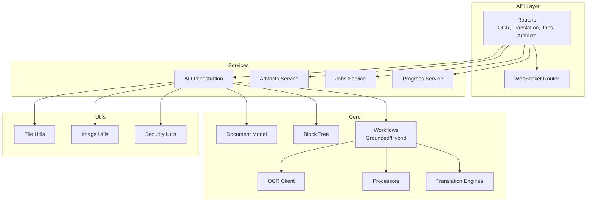
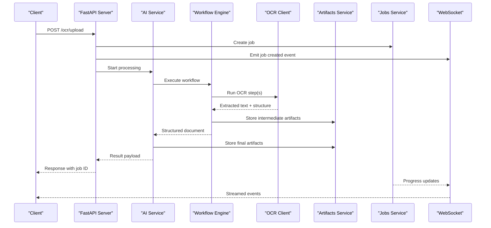
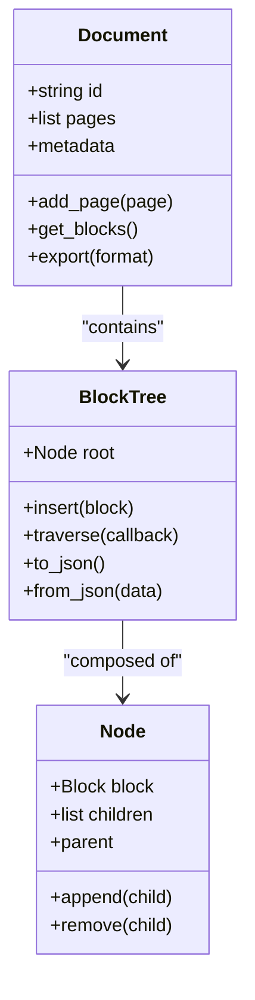
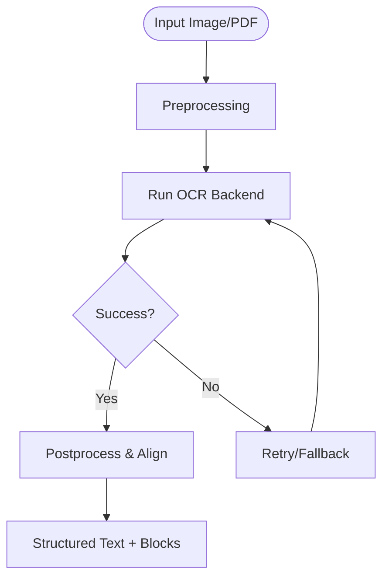
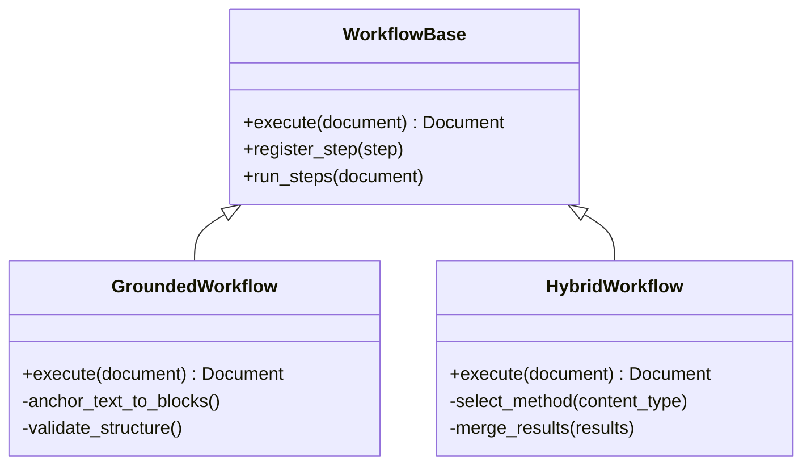
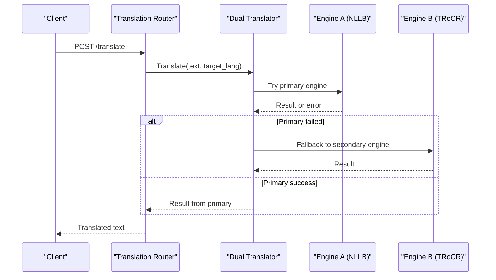
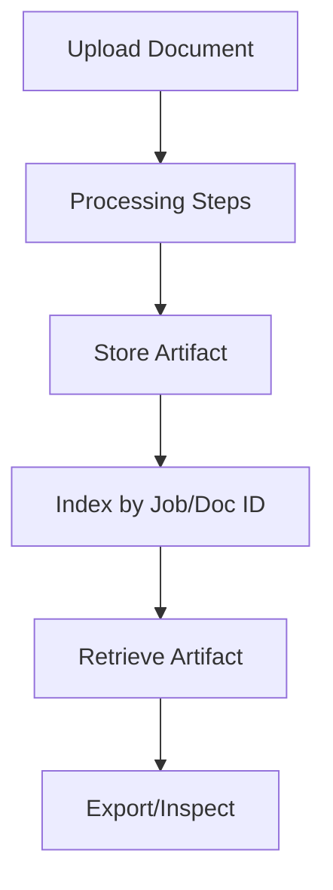
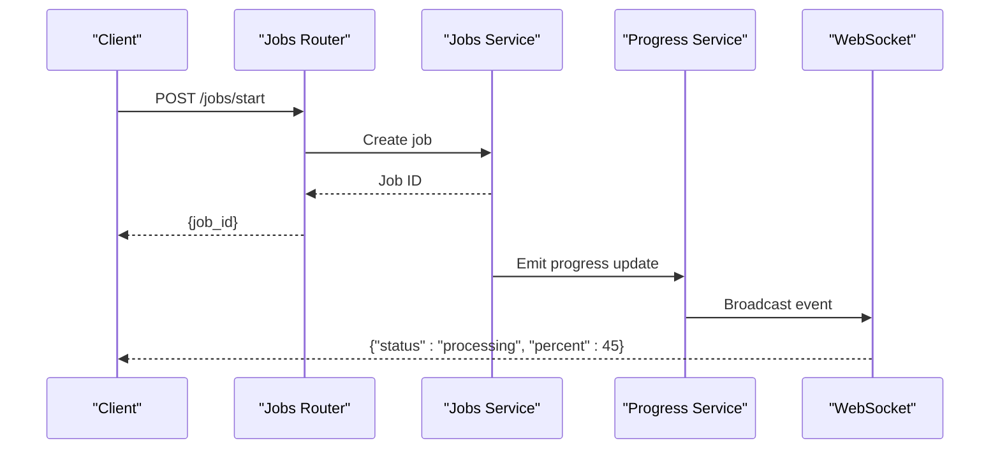
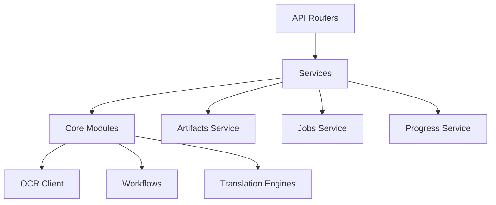

# Introduction and Core Concepts

<cite>
**Referenced Files in This Document**
- [README.md](file://README.md)
- [ARCHITECTURE.md](file://ARCHITECTURE.md)
- [server.py](file://src/local_deepl/server.py)
- [pipeline.py](file://src/local_deepl/pipeline.py)
- [document.py](file://src/local_deepl/core/document.py)
- [block_tree.py](file://src/local_deepl/core/block_tree.py)
- [workflows/base.py](file://src/local_deepl/core/workflows/base.py)
- [workflows/grounded.py](file://src/local_deepl/core/workflows/grounded.py)
- [workflows/hybrid.py](file://src/local_deepl/core/workflows/hybrid.py)
- [ocr/client.py](file://src/local_deepl/core/ocr/client.py)
- [ocr/processor.py](file://src/local_deepl/core/ocr/processor.py)
- [ai.py](file://src/local_deepl/api/services/ai.py)
- [artifacts.py](file://src/local_deepl/api/services/artifacts.py)
- [jobs.py](file://src/local_deepl/api/services/jobs.py)
- [progress.py](file://src/local_deepl/api/services/progress.py)
- [websocket.py](file://src/local_deepl/api/routers/websocket.py)
- [translation.py](file://src/local_deepl/core/translation.py)
- [dual_translator.py](file://src/local_deepl/core/dual_translator.py)
- [nllb_engine.py](file://src/local_deepl/core/nllb_engine.py)
- [trocr_engine.py](file://src/local_deepl/core/trocr_engine.py)
</cite>

## Table of Contents
1. [Introduction](#introduction)
2. [Project Structure](#project-structure)
3. [Core Components](#core-components)
4. [Architecture Overview](#architecture-overview)
5. [Detailed Component Analysis](#detailed-component-analysis)
6. [Dependency Analysis](#dependency-analysis)
7. [Performance Considerations](#performance-considerations)
8. [Troubleshooting Guide](#troubleshooting-guide)
9. [Conclusion](#conclusion)

## Introduction
LocalDeepL is a sophisticated OCR and document processing service with translation capabilities built on FastAPI. It ingests documents (images, PDFs, and other formats), extracts text and structure via OCR and layout analysis, optionally translates content through pluggable engines, and exposes results through REST APIs and real-time WebSocket updates. The system emphasizes robustness, modularity, and extensibility, allowing users to choose between different processing strategies such as grounded or hybrid workflows depending on their accuracy and performance needs.

Key objectives:
- Provide high-quality OCR for scanned images, PDFs, and mixed-content documents
- Support structured extraction (blocks, tables, sections) and export to multiple formats
- Offer translation services with configurable engines and glossaries
- Enable real-time progress tracking and interactive workflows via WebSockets
- Maintain an artifacts system for intermediate and final outputs that can be inspected and reused

This section introduces core concepts and terminology used throughout the codebase to help both newcomers and experienced users understand how LocalDeepL processes documents end-to-end.

**Section sources**
- [README.md](file://README.md)
- [ARCHITECTURE.md](file://ARCHITECTURE.md)
- [server.py](file://src/local_deepl/server.py)

## Project Structure
At a high level, LocalDeepL organizes functionality into API routers, services, core processing modules, and utilities:
- API layer: FastAPI routers expose endpoints for OCR, translation, jobs, artifacts, and WebSocket streaming
- Services: Business logic for AI orchestration, artifact storage, job management, progress tracking, and security
- Core: Document models, block trees, OCR clients, processors, workflows, translation engines, and exporters
- Utilities: File handling, image processing, security helpers, and TQDM patching

**Diagram sources**
- [server.py](file://src/local_deepl/server.py)
- [ai.py](file://src/local_deepl/api/services/ai.py)
- [artifacts.py](file://src/local_deepl/api/services/artifacts.py)
- [jobs.py](file://src/local_deepl/api/services/jobs.py)
- [progress.py](file://src/local_deepl/api/services/progress.py)
- [websocket.py](file://src/local_deepl/api/routers/websocket.py)
- [document.py](file://src/local_deepl/core/document.py)
- [block_tree.py](file://src/local_deepl/core/block_tree.py)
- [ocr/client.py](file://src/local_deepl/core/ocr/client.py)
- [workflows/base.py](file://src/local_deepl/core/workflows/base.py)
- [workflows/grounded.py](file://src/local_deepl/core/workflows/grounded.py)
- [workflows/hybrid.py](file://src/local_deepl/core/workflows/hybrid.py)
- [translation.py](file://src/local_deepl/core/translation.py)

**Section sources**
- [server.py](file://src/local_deepl/server.py)
- [ARCHITECTURE.md](file://ARCHITECTURE.md)

## Core Components
LocalDeepL’s core components are designed around modular processing stages and flexible orchestration:
- Document model and block tree represent structured content for downstream processing and export
- OCR client abstracts OCR backends and resilience patterns
- Processors handle layout, quality, reading order, sections, structure, and table extraction
- Workflows define end-to-end pipelines, including grounded and hybrid approaches
- Translation subsystem supports multiple engines and dual translation flows
- Artifacts system stores intermediate and final outputs for inspection and reuse
- Jobs and progress services manage long-running tasks and real-time updates

Key terminology:
- Grounded OCR: An approach that anchors extracted text to precise spatial coordinates and structural context, improving alignment and fidelity during subsequent steps like translation and export
- Hybrid processing: A strategy combining multiple OCR and analysis techniques to balance accuracy and performance, often switching methods based on content characteristics
- Workflows: Configurable sequences of processing steps that transform input documents into structured outputs; may include OCR, layout analysis, translation, and export
- Artifacts: Intermediate or final data objects produced by processing steps, stored and retrievable via the artifacts system
- Processing pipeline: The ordered set of operations applied to a document, orchestrated by workflows and services
- Translation engines: Pluggable backends (e.g., NLLB, TRoCR) providing translation capabilities with consistent interfaces

**Section sources**
- [document.py](file://src/local_deepl/core/document.py)
- [block_tree.py](file://src/local_deepl/core/block_tree.py)
- [ocr/client.py](file://src/local_deepl/core/ocr/client.py)
- [workflows/base.py](file://src/local_deepl/core/workflows/base.py)
- [workflows/grounded.py](file://src/local_deepl/core/workflows/grounded.py)
- [workflows/hybrid.py](file://src/local_deepl/core/workflows/hybrid.py)
- [translation.py](file://src/local_deepl/core/translation.py)
- [dual_translator.py](file://src/local_deepl/core/dual_translator.py)
- [nllb_engine.py](file://src/local_deepl/core/nllb_engine.py)
- [trocr_engine.py](file://src/local_deepl/core/trocr_engine.py)
- [artifacts.py](file://src/local_deepl/api/services/artifacts.py)
- [jobs.py](file://src/local_deepl/api/services/jobs.py)
- [progress.py](file://src/local_deepl/api/services/progress.py)

## Architecture Overview
LocalDeepL follows a layered architecture where API routers delegate to services, which orchestrate core processing modules. Real-time communication is provided via WebSockets, while artifacts and jobs enable asynchronous, resumable workflows.

**Diagram sources**
- [server.py](file://src/local_deepl/server.py)
- [ai.py](file://src/local_deepl/api/services/ai.py)
- [jobs.py](file://src/local_deepl/api/services/jobs.py)
- [progress.py](file://src/local_deepl/api/services/progress.py)
- [websocket.py](file://src/local_deepl/api/routers/websocket.py)
- [artifacts.py](file://src/local_deepl/api/services/artifacts.py)
- [workflows/base.py](file://src/local_deepl/core/workflows/base.py)
- [ocr/client.py](file://src/local_deepl/core/ocr/client.py)

## Detailed Component Analysis

### Document Model and Block Tree
The document model represents a page or entire document with structured content. The block tree organizes text blocks hierarchically, enabling precise manipulation, reading order determination, and export formatting.

**Diagram sources**
- [document.py](file://src/local_deepl/core/document.py)
- [block_tree.py](file://src/local_deepl/core/block_tree.py)

**Section sources**
- [document.py](file://src/local_deepl/core/document.py)
- [block_tree.py](file://src/local_deepl/core/block_tree.py)

### OCR Client and Resilience
The OCR client abstracts OCR backends and implements resilience patterns such as retries, fallbacks, and error handling. It integrates with processors to refine extracted text and structure.

**Diagram sources**
- [ocr/client.py](file://src/local_deepl/core/ocr/client.py)
- [ocr/processor.py](file://src/local_deepl/core/ocr/processor.py)

**Section sources**
- [ocr/client.py](file://src/local_deepl/core/ocr/client.py)
- [ocr/processor.py](file://src/local_deepl/core/ocr/processor.py)

### Workflows: Grounded vs Hybrid
Workflows define end-to-end processing strategies. Grounded workflows emphasize spatial accuracy and structural fidelity, while hybrid workflows combine multiple techniques to optimize for accuracy and speed.

**Diagram sources**
- [workflows/base.py](file://src/local_deepl/core/workflows/base.py)
- [workflows/grounded.py](file://src/local_deepl/core/workflows/grounded.py)
- [workflows/hybrid.py](file://src/local_deepl/core/workflows/hybrid.py)

**Section sources**
- [workflows/base.py](file://src/local_deepl/core/workflows/base.py)
- [workflows/grounded.py](file://src/local_deepl/core/workflows/grounded.py)
- [workflows/hybrid.py](file://src/local_deepl/core/workflows/hybrid.py)

### Translation Engines and Dual Translator
Translation engines provide pluggable backends for translating content. The dual translator orchestrates translation across multiple engines and manages callbacks and state.

**Diagram sources**
- [translation.py](file://src/local_deepl/core/translation.py)
- [dual_translator.py](file://src/local_deepl/core/dual_translator.py)
- [nllb_engine.py](file://src/local_deepl/core/nllb_engine.py)
- [trocr_engine.py](file://src/local_deepl/core/trocr_engine.py)

**Section sources**
- [translation.py](file://src/local_deepl/core/translation.py)
- [dual_translator.py](file://src/local_deepl/core/dual_translator.py)
- [nllb_engine.py](file://src/local_deepl/core/nllb_engine.py)
- [trocr_engine.py](file://src/local_deepl/core/trocr_engine.py)

### Artifacts System
The artifacts system stores intermediate and final outputs, enabling inspection, reuse, and debugging. It supports hierarchical organization and retrieval by job or document ID.

**Diagram sources**
- [artifacts.py](file://src/local_deepl/api/services/artifacts.py)

**Section sources**
- [artifacts.py](file://src/local_deepl/api/services/artifacts.py)

### Jobs and Progress Services
Jobs manage long-running tasks, while progress services emit real-time updates via WebSockets. This enables interactive workflows and user feedback during processing.

**Diagram sources**
- [jobs.py](file://src/local_deepl/api/services/jobs.py)
- [progress.py](file://src/local_deepl/api/services/progress.py)
- [websocket.py](file://src/local_deepl/api/routers/websocket.py)

**Section sources**
- [jobs.py](file://src/local_deepl/api/services/jobs.py)
- [progress.py](file://src/local_deepl/api/services/progress.py)
- [websocket.py](file://src/local_deepl/api/routers/websocket.py)

## Dependency Analysis
LocalDeepL exhibits clear separation between API, services, and core modules. Dependencies flow downward from API routers to services, then to core processing components. External integrations (OCR backends, translation engines) are abstracted behind interfaces to maintain modularity.

**Diagram sources**
- [server.py](file://src/local_deepl/server.py)
- [ai.py](file://src/local_deepl/api/services/ai.py)
- [artifacts.py](file://src/local_deepl/api/services/artifacts.py)
- [jobs.py](file://src/local_deepl/api/services/jobs.py)
- [progress.py](file://src/local_deepl/api/services/progress.py)
- [ocr/client.py](file://src/local_deepl/core/ocr/client.py)
- [workflows/base.py](file://src/local_deepl/core/workflows/base.py)
- [translation.py](file://src/local_deepl/core/translation.py)

**Section sources**
- [server.py](file://src/local_deepl/server.py)
- [ai.py](file://src/local_deepl/api/services/ai.py)
- [artifacts.py](file://src/local_deepl/api/services/artifacts.py)
- [jobs.py](file://src/local_deepl/api/services/jobs.py)
- [progress.py](file://src/local_deepl/api/services/progress.py)
- [ocr/client.py](file://src/local_deepl/core/ocr/client.py)
- [workflows/base.py](file://src/local_deepl/core/workflows/base.py)
- [translation.py](file://src/local_deepl/core/translation.py)

## Performance Considerations
- Use hybrid workflows for balanced accuracy and speed when content type varies
- Leverage OCR resilience patterns to minimize downtime and improve throughput
- Cache frequently accessed artifacts to reduce redundant processing
- Stream progress updates via WebSockets to avoid blocking requests
- Optimize preprocessing steps for large images or multi-page PDFs

[No sources needed since this section provides general guidance]

## Troubleshooting Guide
Common issues and resolutions:
- OCR failures: Check backend availability and retry policies; inspect artifacts for intermediate outputs
- Translation errors: Verify engine configuration and fallback mechanisms; review dual translator logs
- WebSocket disconnects: Ensure proper connection handling and reconnection logic in clients
- Memory usage: Monitor artifact sizes and implement cleanup strategies for large documents

**Section sources**
- [ocr/client.py](file://src/local_deepl/core/ocr/client.py)
- [dual_translator.py](file://src/local_deepl/core/dual_translator.py)
- [websocket.py](file://src/local_deepl/api/routers/websocket.py)
- [artifacts.py](file://src/local_deepl/api/services/artifacts.py)

## Conclusion
LocalDeepL provides a robust, modular platform for OCR and document processing with translation capabilities. Its architecture supports flexible workflows, real-time communication, and extensible engines, making it suitable for diverse use cases ranging from simple text extraction to complex document transformation pipelines. Understanding core concepts such as grounded vs hybrid processing, artifacts, and translation engines empowers users to tailor the system to their specific needs.

[No sources needed since this section summarizes without analyzing specific files]