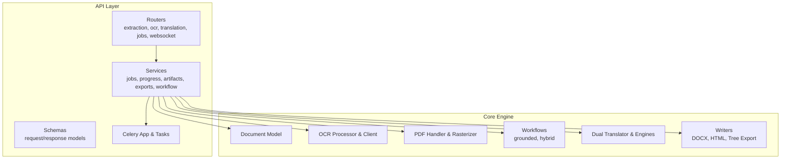
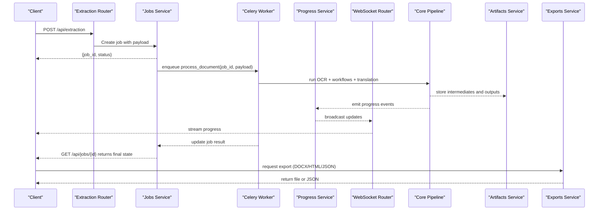
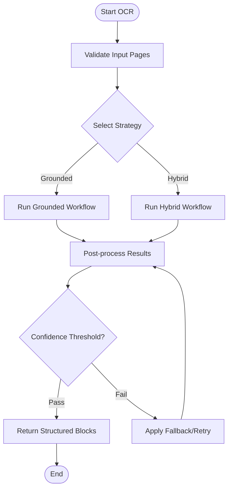
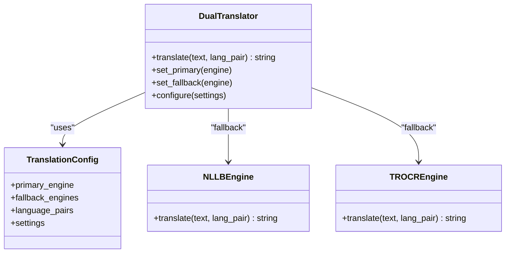
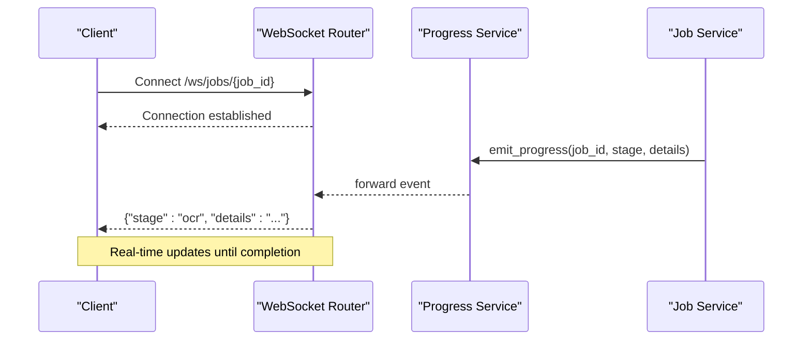
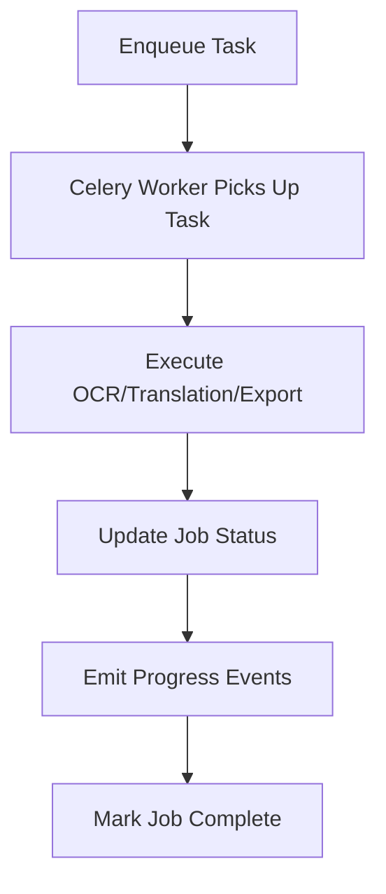
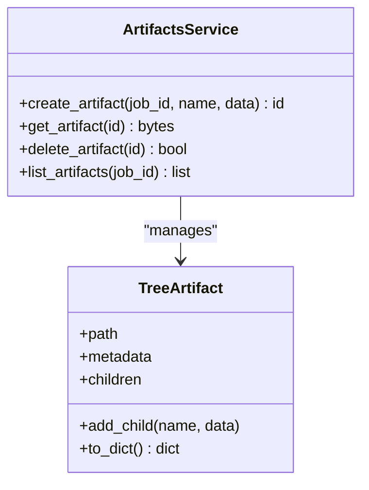
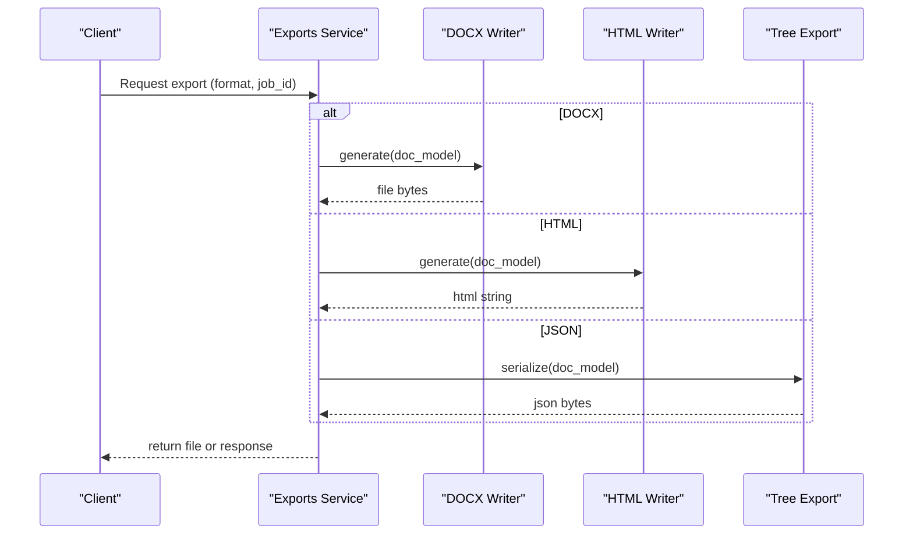
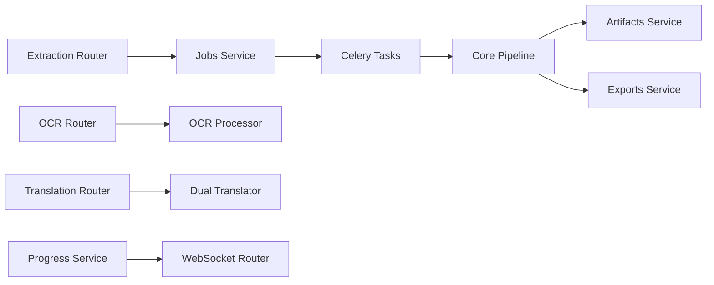

# Key Features and Capabilities

<cite>
**Referenced Files in This Document**
- [server.py](file://src/local_deepl/server.py)
- [pipeline.py](file://src/local_deepl/pipeline.py)
- [document.py](file://src/local_deepl/core/document.py)
- [ocr_processor.py](file://src/local_deepl/core/ocr/processor.py)
- [ocr_client.py](file://src/local_deepl/core/ocr/client.py)
- [resilience.py](file://src/local_deepl/core/ocr/resilience.py)
- [grounded_workflow.py](file://src/local_deepl/core/workflows/grounded.py)
- [hybrid_workflow.py](file://src/local_deepl/core/workflows/hybrid.py)
- [pdf_handler.py](file://src/local_deepl/core/pdf/handler.py)
- [pdf_rasterizer.py](file://src/local_deepl/core/pdf/rasterizer.py)
- [handwriting_preprocessor.py](file://src/local_deepl/core/handwriting_preprocessor.py)
- [dual_translator.py](file://src/local_deepl/core/dual_translator.py)
- [translation_config.py](file://src/local_deepl/core/translation_config.py)
- [nllb_engine.py](file://src/local_deepl/core/nllb_engine.py)
- [trocr_engine.py](file://src/local_deepl/core/trocr_engine.py)
- [jobs_service.py](file://src/local_deepl/api/services/jobs.py)
- [progress_service.py](file://src/local_deepl/api/services/progress.py)
- [websocket_router.py](file://src/local_deepl/api/routers/websocket.py)
- [celery_app.py](file://src/local_deepl/api/celery_app.py)
- [tasks.py](file://src/local_deepl/api/tasks.py)
- [artifacts_service.py](file://src/local_deepl/api/services/artifacts.py)
- [tree_artifact.py](file://src/local_deepl/api/services/tree_artifact.py)
- [document_exports.py](file://src/local_deepl/api/services/document_exports.py)
- [docx_writer.py](file://src/local_deepl/core/docx_writer.py)
- [html_writer.py](file://src/local_deepl/core/html_writer.py)
- [tree_export.py](file://src/local_deepl/core/tree_export.py)
- [extraction_router.py](file://src/local_deepl/api/routers/extraction.py)
- [ocr_router.py](file://src/local_deepl/api/routers/ocr.py)
- [translation_router.py](file://src/local_deepl/api/routers/translation.py)
- [jobs_router.py](file://src/local_deepl/api/routers/jobs.py)
- [common_schemas.py](file://src/local_deepl/api/schemas/requests.py)
</cite>

## Table of Contents
1. [Introduction](#introduction)
2. [Project Structure](#project-structure)
3. [Core Components](#core-components)
4. [Architecture Overview](#architecture-overview)
5. [Detailed Component Analysis](#detailed-component-analysis)
6. [Dependency Analysis](#dependency-analysis)
7. [Performance Considerations](#performance-considerations)
8. [Troubleshooting Guide](#troubleshooting-guide)
9. [Conclusion](#conclusion)

## Introduction
This document explains the key features and capabilities of LocalDeepL, focusing on multi-format document support, advanced OCR with grounded and hybrid strategies, translation services with DeepL integration and fallbacks, real-time WebSocket progress tracking, background job processing via Celery, artifact storage and management, and multiple export formats (DOCX, HTML, JSON). It provides purpose, implementation approach, configuration options, practical use cases, performance characteristics, scalability considerations, and integration patterns for each capability, with concrete references to code locations.

## Project Structure
LocalDeepL is organized into:
- API layer: routers, services, schemas, Celery app, and tasks
- Core engine: document model, OCR pipeline, PDF handling, workflows (grounded/hybrid), translation engines, writers, and utilities
- Static assets and resources for UI and dictionaries
- Tests and scripts for evaluation and debugging

**Diagram sources**
- [server.py](file://src/local_deepl/server.py)
- [extraction_router.py](file://src/local_deepl/api/routers/extraction.py)
- [ocr_router.py](file://src/local_deepl/api/routers/ocr.py)
- [translation_router.py](file://src/local_deepl/api/routers/translation.py)
- [jobs_router.py](file://src/local_deepl/api/routers/jobs.py)
- [websocket_router.py](file://src/local_deepl/api/routers/websocket.py)
- [jobs_service.py](file://src/local_deepl/api/services/jobs.py)
- [progress_service.py](file://src/local_deepl/api/services/progress.py)
- [artifacts_service.py](file://src/local_deepl/api/services/artifacts.py)
- [document_exports.py](file://src/local_deepl/api/services/document_exports.py)
- [celery_app.py](file://src/local_deepl/api/celery_app.py)
- [tasks.py](file://src/local_deepl/api/tasks.py)
- [document.py](file://src/local_deepl/core/document.py)
- [ocr_processor.py](file://src/local_deepl/core/ocr/processor.py)
- [ocr_client.py](file://src/local_deepl/core/ocr/client.py)
- [pdf_handler.py](file://src/local_deepl/core/pdf/handler.py)
- [pdf_rasterizer.py](file://src/local_deepl/core/pdf/rasterizer.py)
- [grounded_workflow.py](file://src/local_deepl/core/workflows/grounded.py)
- [hybrid_workflow.py](file://src/local_deepl/core/workflows/hybrid.py)
- [dual_translator.py](file://src/local_deepl/core/dual_translator.py)
- [translation_config.py](file://src/local_deepl/core/translation_config.py)
- [nllb_engine.py](file://src/local_deepl/core/nllb_engine.py)
- [trocr_engine.py](file://src/local_deepl/core/trocr_engine.py)
- [docx_writer.py](file://src/local_deepl/core/docx_writer.py)
- [html_writer.py](file://src/local_deepl/core/html_writer.py)
- [tree_export.py](file://src/local_deepl/core/tree_export.py)

**Section sources**
- [server.py](file://src/local_deepl/server.py)
- [pyproject.toml](file://pyproject.toml)

## Core Components
- Multi-format ingestion: PDF, images, handwritten text through PDF handler, rasterizer, and handwriting preprocessor
- Advanced OCR: processor and client with resilience and prompt-driven parsing; supports grounded and hybrid workflows
- Translation: dual translator with DeepL primary and NLLB/TROCR fallbacks; configurable engines and settings
- Background jobs: Celery-based task queue with progress tracking and WebSocket updates
- Artifact storage: tree-based artifact management for intermediate results and outputs
- Exports: DOCX, HTML, and JSON-like tree structures

**Section sources**
- [pdf_handler.py](file://src/local_deepl/core/pdf/handler.py)
- [pdf_rasterizer.py](file://src/local_deepl/core/pdf/rasterizer.py)
- [handwriting_preprocessor.py](file://src/local_deepl/core/handwriting_preprocessor.py)
- [ocr_processor.py](file://src/local_deepl/core/ocr/processor.py)
- [ocr_client.py](file://src/local_deepl/core/ocr/client.py)
- [resilience.py](file://src/local_deepl/core/ocr/resilience.py)
- [grounded_workflow.py](file://src/local_deepl/core/workflows/grounded.py)
- [hybrid_workflow.py](file://src/local_deepl/core/workflows/hybrid.py)
- [dual_translator.py](file://src/local_deepl/core/dual_translator.py)
- [translation_config.py](file://src/local_deepl/core/translation_config.py)
- [nllb_engine.py](file://src/local_deepl/core/nllb_engine.py)
- [trocr_engine.py](file://src/local_deepl/core/trocr_engine.py)
- [jobs_service.py](file://src/local_deepl/api/services/jobs.py)
- [progress_service.py](file://src/local_deepl/api/services/progress.py)
- [websocket_router.py](file://src/local_deepl/api/routers/websocket.py)
- [celery_app.py](file://src/local_deepl/api/celery_app.py)
- [tasks.py](file://src/local_deepl/api/tasks.py)
- [artifacts_service.py](file://src/local_deepl/api/services/artifacts.py)
- [tree_artifact.py](file://src/local_deepl/api/services/tree_artifact.py)
- [document_exports.py](file://src/local_deepl/api/services/document_exports.py)
- [docx_writer.py](file://src/local_deepl/core/docx_writer.py)
- [html_writer.py](file://src/local_deepl/core/html_writer.py)
- [tree_export.py](file://src/local_deepl/core/tree_export.py)

## Architecture Overview
The system exposes REST endpoints for extraction, OCR, translation, and job management. Requests are routed to services that orchestrate core components. Long-running operations are offloaded to Celery workers, which emit progress events broadcast via WebSockets. Artifacts are stored as a tree structure for traceability and reprocessing. Outputs can be exported to DOCX, HTML, or JSON-like trees.

**Diagram sources**
- [extraction_router.py](file://src/local_deepl/api/routers/extraction.py)
- [jobs_service.py](file://src/local_deepl/api/services/jobs.py)
- [celery_app.py](file://src/local_deepl/api/celery_app.py)
- [tasks.py](file://src/local_deepl/api/tasks.py)
- [progress_service.py](file://src/local_deepl/api/services/progress.py)
- [websocket_router.py](file://src/local_deepl/api/routers/websocket.py)
- [artifacts_service.py](file://src/local_deepl/api/services/artifacts.py)
- [document_exports.py](file://src/local_deepl/api/services/document_exports.py)

## Detailed Component Analysis

### Multi-Format Document Support (PDF, Images, Handwritten Text)
Purpose: Accept diverse inputs and normalize them into a unified document representation for downstream OCR and translation.

Implementation:
- PDF ingestion uses a handler to parse pages and a rasterizer to convert pages to images for OCR
- Image inputs are validated and normalized
- Handwritten text is preprocessed to improve OCR accuracy

Configuration:
- PDF rasterization parameters (resolution, color mode)
- Image preprocessing options (scaling, denoising)
- Handwriting-specific enhancements

Use cases:
- Scanned documents and books (PDF)
- Photographs and screenshots (images)
- Notes and forms with handwriting

Performance and scalability:
- Rasterization is CPU-bound; consider parallel page processing
- Preprocessing adds overhead but improves OCR quality

Integration points:
- Feeds into OCR processor and workflows

**Section sources**
- [pdf_handler.py](file://src/local_deepl/core/pdf/handler.py)
- [pdf_rasterizer.py](file://src/local_deepl/core/pdf/rasterizer.py)
- [handwriting_preprocessor.py](file://src/local_deepl/core/handwriting_preprocessor.py)

### Advanced OCR Processing (Grounded and Hybrid Strategies)
Purpose: Extract structured text with layout awareness and confidence metrics using both grounded and hybrid approaches.

Implementation:
- OCR processor coordinates client calls and post-processing
- Resilience layer handles retries and fallbacks
- Grounded workflow leverages spatial grounding for precise alignment
- Hybrid workflow combines multiple strategies for robustness

Configuration:
- OCR client settings (timeout, retry policy)
- Prompt templates and parsing rules
- Workflow selection and blending weights

Use cases:
- Complex layouts with tables and columns
- Mixed printed and handwritten content
- High-accuracy requirements for legal or medical documents

Performance and scalability:
- OCR is compute-intensive; batch processing and caching improve throughput
- Resilience prevents cascading failures under load

Integration points:
- Consumes rasterized pages and produces structured blocks for translation and export

**Diagram sources**
- [ocr_processor.py](file://src/local_deepl/core/ocr/processor.py)
- [ocr_client.py](file://src/local_deepl/core/ocr/client.py)
- [resilience.py](file://src/local_deepl/core/ocr/resilience.py)
- [grounded_workflow.py](file://src/local_deepl/core/workflows/grounded.py)
- [hybrid_workflow.py](file://src/local_deepl/core/workflows/hybrid.py)

**Section sources**
- [ocr_processor.py](file://src/local_deepl/core/ocr/processor.py)
- [ocr_client.py](file://src/local_deepl/core/ocr/client.py)
- [resilience.py](file://src/local_deepl/core/ocr/resilience.py)
- [grounded_workflow.py](file://src/local_deepl/core/workflows/grounded.py)
- [hybrid_workflow.py](file://src/local_deepl/core/workflows/hybrid.py)

### Translation Services (DeepL Integration and Fallback Mechanisms)
Purpose: Translate extracted text with high-quality machine translation while ensuring reliability through fallbacks.

Implementation:
- Dual translator selects primary (DeepL) and fallback engines (NLLB, TROCR)
- Translation config centralizes settings and routing logic
- Engines encapsulate specific translation backends

Configuration:
- API keys and endpoints for DeepL
- Fallback thresholds and engine priorities
- Language pairs and output formatting

Use cases:
- Multilingual document processing
- Offline or constrained environments using local engines
- Cost-sensitive scenarios with selective fallback

Performance and scalability:
- DeepL offers low latency; local engines may be slower
- Caching translations and batching requests improves efficiency

Integration points:
- Receives structured text from OCR and writes translated content into the document model

**Diagram sources**
- [dual_translator.py](file://src/local_deepl/core/dual_translator.py)
- [translation_config.py](file://src/local_deepl/core/translation_config.py)
- [nllb_engine.py](file://src/local_deepl/core/nllb_engine.py)
- [trocr_engine.py](file://src/local_deepl/core/trocr_engine.py)

**Section sources**
- [dual_translator.py](file://src/local_deepl/core/dual_translator.py)
- [translation_config.py](file://src/local_deepl/core/translation_config.py)
- [nllb_engine.py](file://src/local_deepl/core/nllb_engine.py)
- [trocr_engine.py](file://src/local_deepl/core/trocr_engine.py)

### Real-Time WebSocket Communication for Progress Tracking
Purpose: Provide live updates on long-running jobs such as OCR and translation.

Implementation:
- WebSocket router manages connections and broadcasts messages
- Progress service emits events tied to job IDs
- Clients subscribe to channels and receive incremental updates

Configuration:
- WebSocket endpoint paths and authentication
- Event schema and filtering options

Use cases:
- Dashboard displays showing processing stages
- User feedback during large document batches

Performance and scalability:
- Use efficient message serialization and connection pooling
- Consider scaling WebSocket servers horizontally with shared backends

Integration points:
- Connected to jobs service and Celery tasks for event emission

**Diagram sources**
- [websocket_router.py](file://src/local_deepl/api/routers/websocket.py)
- [progress_service.py](file://src/local_deepl/api/services/progress.py)
- [jobs_service.py](file://src/local_deepl/api/services/jobs.py)

**Section sources**
- [websocket_router.py](file://src/local_deepl/api/routers/websocket.py)
- [progress_service.py](file://src/local_deepl/api/services/progress.py)

### Background Job Processing with Celery
Purpose: Offload heavy tasks to workers to keep the API responsive and scalable.

Implementation:
- Celery app defines queues and worker configurations
- Tasks implement document processing steps (OCR, translation, export)
- Jobs service tracks lifecycle and status

Configuration:
- Broker URL and backend settings
- Task routing and concurrency limits
- Retry policies and timeouts

Use cases:
- Batch processing of large PDFs
- Asynchronous translation pipelines
- Scheduled maintenance tasks

Performance and scalability:
- Tune worker concurrency based on CPU/GPU availability
- Use separate queues for I/O-bound vs CPU-bound tasks

Integration points:
- Invoked by routers and services; publishes progress events

**Diagram sources**
- [celery_app.py](file://src/local_deepl/api/celery_app.py)
- [tasks.py](file://src/local_deepl/api/tasks.py)
- [jobs_service.py](file://src/local_deepl/api/services/jobs.py)

**Section sources**
- [celery_app.py](file://src/local_deepl/api/celery_app.py)
- [tasks.py](file://src/local_deepl/api/tasks.py)
- [jobs_service.py](file://src/local_deepl/api/services/jobs.py)

### Artifact Storage and Management
Purpose: Persist intermediate and final artifacts for traceability, auditing, and reprocessing.

Implementation:
- Artifacts service manages creation, retrieval, and deletion
- Tree artifact structure organizes files and metadata hierarchically
- Linked to job IDs for easy lookup

Configuration:
- Storage backend (local filesystem or cloud)
- Retention policies and cleanup schedules

Use cases:
- Debugging failed jobs with intermediate outputs
- Re-running specific stages without full reprocessing
- Auditing document transformations

Performance and scalability:
- Use efficient serialization and compression for large artifacts
- Implement chunked uploads for large files

Integration points:
- Called by core pipeline and export services

**Diagram sources**
- [artifacts_service.py](file://src/local_deepl/api/services/artifacts.py)
- [tree_artifact.py](file://src/local_deepl/api/services/tree_artifact.py)

**Section sources**
- [artifacts_service.py](file://src/local_deepl/api/services/artifacts.py)
- [tree_artifact.py](file://src/local_deepl/api/services/tree_artifact.py)

### Multiple Export Formats (DOCX, HTML, JSON)
Purpose: Produce user-friendly outputs in various formats for consumption by downstream systems.

Implementation:
- DOCX writer generates Word documents preserving structure
- HTML writer creates web-ready markup
- Tree export serializes internal document model to JSON-like structures

Configuration:
- Formatting options (styles, fonts, margins)
- Content inclusion (metadata, images, tables)

Use cases:
- Publishing reports (DOCX)
- Web display (HTML)
- Programmatic analysis (JSON)

Performance and scalability:
- Stream large documents to avoid memory spikes
- Cache generated templates where applicable

Integration points:
- Triggered by export service after job completion

**Diagram sources**
- [document_exports.py](file://src/local_deepl/api/services/document_exports.py)
- [docx_writer.py](file://src/local_deepl/core/docx_writer.py)
- [html_writer.py](file://src/local_deepl/core/html_writer.py)
- [tree_export.py](file://src/local_deepl/core/tree_export.py)

**Section sources**
- [document_exports.py](file://src/local_deepl/api/services/document_exports.py)
- [docx_writer.py](file://src/local_deepl/core/docx_writer.py)
- [html_writer.py](file://src/local_deepl/core/html_writer.py)
- [tree_export.py](file://src/local_deepl/core/tree_export.py)

## Dependency Analysis
Key dependencies include:
- Routers depend on services for business logic
- Services orchestrate core components (OCR, translation, exporters)
- Celery tasks execute long-running operations asynchronously
- WebSocket router depends on progress service for event broadcasting
- Artifacts service persists data used by exporters and debug tools

**Diagram sources**
- [extraction_router.py](file://src/local_deepl/api/routers/extraction.py)
- [ocr_router.py](file://src/local_deepl/api/routers/ocr.py)
- [translation_router.py](file://src/local_deepl/api/routers/translation.py)
- [jobs_service.py](file://src/local_deepl/api/services/jobs.py)
- [tasks.py](file://src/local_deepl/api/tasks.py)
- [progress_service.py](file://src/local_deepl/api/services/progress.py)
- [websocket_router.py](file://src/local_deepl/api/routers/websocket.py)
- [artifacts_service.py](file://src/local_deepl/api/services/artifacts.py)
- [document_exports.py](file://src/local_deepl/api/services/document_exports.py)

**Section sources**
- [extraction_router.py](file://src/local_deepl/api/routers/extraction.py)
- [ocr_router.py](file://src/local_deepl/api/routers/ocr.py)
- [translation_router.py](file://src/local_deepl/api/routers/translation.py)
- [jobs_service.py](file://src/local_deepl/api/services/jobs.py)
- [tasks.py](file://src/local_deepl/api/tasks.py)
- [progress_service.py](file://src/local_deepl/api/services/progress.py)
- [websocket_router.py](file://src/local_deepl/api/routers/websocket.py)
- [artifacts_service.py](file://src/local_deepl/api/services/artifacts.py)
- [document_exports.py](file://src/local_deepl/api/services/document_exports.py)

## Performance Considerations
- OCR and rasterization are CPU-intensive; scale workers horizontally and tune concurrency
- Translation latency depends on engine choice; prefer DeepL for speed, local engines for offline use
- WebSocket updates should be lightweight; avoid sending large payloads per event
- Artifact storage should use efficient serialization and compression for large files
- Batch processing reduces overhead; cache repeated translations and OCR results

[No sources needed since this section provides general guidance]

## Troubleshooting Guide
Common issues and resolutions:
- OCR failures: Check resilience settings, retry policies, and input quality
- Translation errors: Verify API keys, language pairs, and fallback configuration
- WebSocket disconnects: Ensure stable connections and proper event routing
- Celery worker crashes: Inspect logs, adjust memory limits, and monitor resource usage
- Artifact corruption: Validate storage backend permissions and integrity checks

**Section sources**
- [resilience.py](file://src/local_deepl/core/ocr/resilience.py)
- [translation_config.py](file://src/local_deepl/core/translation_config.py)
- [websocket_router.py](file://src/local_deepl/api/routers/websocket.py)
- [celery_app.py](file://src/local_deepl/api/celery_app.py)
- [artifacts_service.py](file://src/local_deepl/api/services/artifacts.py)

## Conclusion
LocalDeepL provides a comprehensive suite for document processing, combining multi-format ingestion, advanced OCR, robust translation, real-time progress tracking, background job execution, artifact management, and flexible exports. Its modular architecture enables scalability and customization, making it suitable for diverse use cases ranging from simple scans to complex multilingual workflows.

[No sources needed since this section summarizes without analyzing specific files]