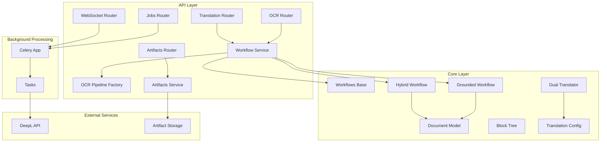
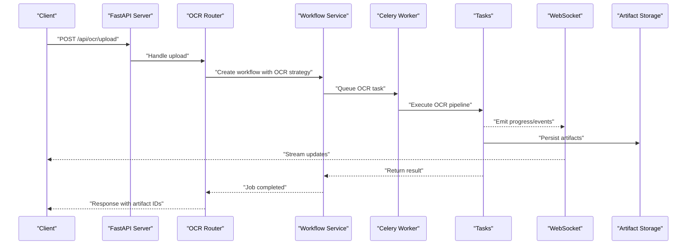
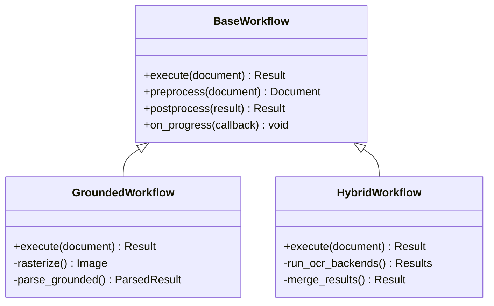
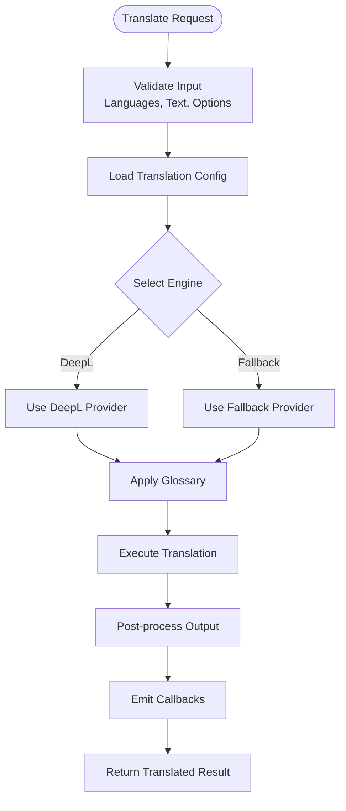
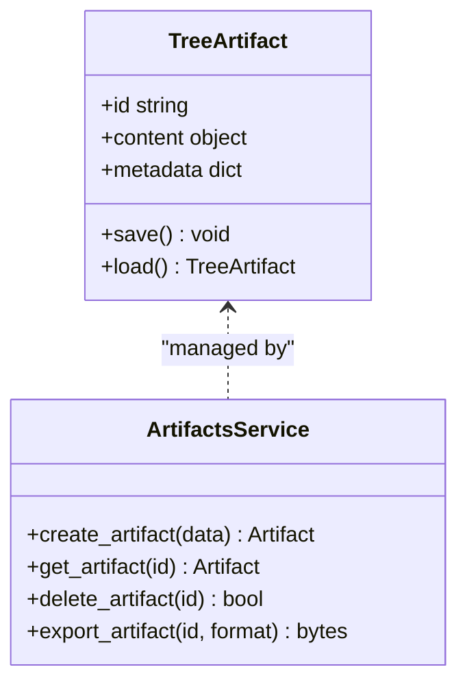
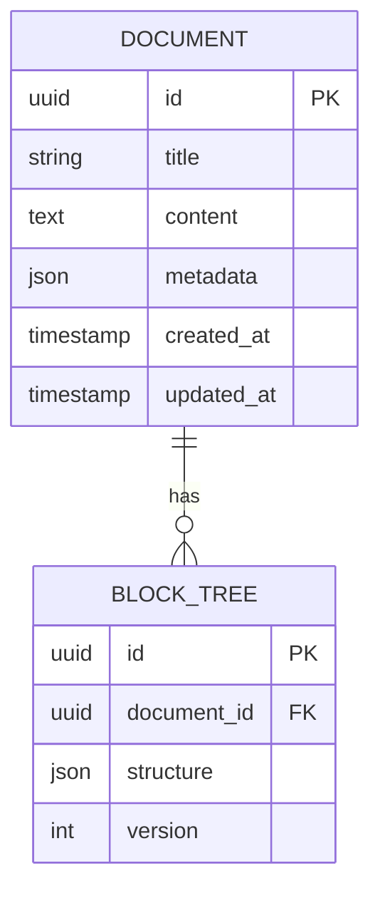
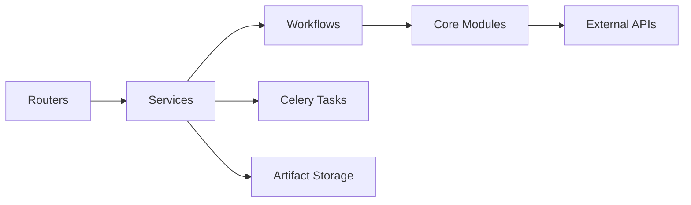

# Project Overview

<cite>
**Referenced Files in This Document**
- [README.md](file://README.md)
- [ARCHITECTURE.md](file://ARCHITECTURE.md)
- [server.py](file://src/local_deepl/server.py)
- [celery_app.py](file://src/local_deepl/api/celery_app.py)
- [tasks.py](file://src/local_deepl/api/tasks.py)
- [websocket.py](file://src/local_deepl/api/routers/websocket.py)
- [ocr.py](file://src/local_deepl/api/routers/ocr.py)
- [translation.py](file://src/local_deepl/api/routers/translation.py)
- [artifacts.py](file://src/local_deepl/api/routers/artifacts.py)
- [jobs.py](file://src/local_deepl/api/routers/jobs.py)
- [workflow.py](file://src/local_deepl/api/services/workflow.py)
- [ocr_pipeline_factory.py](file://src/local_deepl/api/services/ocr_pipeline_factory.py)
- [grounded.py](file://src/local_deepl/core/workflows/grounded.py)
- [hybrid.py](file://src/local_deepl/core/workflows/hybrid.py)
- [base.py](file://src/local_deepl/core/workflows/base.py)
- [dual_translator.py](file://src/local_deepl/core/dual_translator.py)
- [translation_config.py](file://src/local_deepl/core/translation_config.py)
- [document.py](file://src/local_deepl/core/document.py)
- [block_tree.py](file://src/local_deepl/core/block_tree.py)
- [tree_artifact.py](file://src/local_deepl/api/services/tree_artifact.py)
- [artifacts_service.py](file://src/local_deepl/api/services/artifacts.py)
</cite>

## Table of Contents
1. [Introduction](#introduction)
2. [Project Structure](#project-structure)
3. [Core Components](#core-components)
4. [Architecture Overview](#architecture-overview)
5. [Detailed Component Analysis](#detailed-component-analysis)
6. [Dependency Analysis](#dependency-analysis)
7. [Performance Considerations](#performance-considerations)
8. [Troubleshooting Guide](#troubleshooting-guide)
9. [Conclusion](#conclusion)

## Introduction
LocalDeepL is a sophisticated OCR and document processing service with translation capabilities. It ingests multi-format documents (PDFs, images, and handwritten text), performs grounded OCR to extract structured content, and provides translation workflows powered by DeepL integration. The system exposes a FastAPI web API, uses Celery for background job processing, and communicates progress and events via real-time WebSocket channels. Users can orchestrate end-to-end workflows—uploading documents, running OCR, translating results, and retrieving artifacts—through REST endpoints and live updates.

Key concepts:
- Grounded OCR: extraction that preserves spatial relationships and structure, enabling accurate downstream processing and export.
- Workflows: composable pipelines that combine OCR, preprocessing, postprocessing, and translation steps.
- Artifacts: persistent outputs such as extracted text, bounding boxes, intermediate trees, and exported files.
- Processing pipeline: the sequence of processors and stages applied to a document from ingestion to final output.

Common use cases:
- Upload a PDF or image, run OCR, and receive structured text with grounding information.
- Translate extracted content using DeepL while preserving structure and metadata.
- Stream progress and events in real time via WebSocket during long-running jobs.
- Retrieve artifacts like processed documents, translations, and intermediate representations.

**Section sources**
- [README.md](file://README.md)
- [ARCHITECTURE.md](file://ARCHITECTURE.md)

## Project Structure
LocalDeepL organizes functionality into clear layers:
- API layer (FastAPI routers and services) for HTTP/WebSocket endpoints and request handling.
- Core layer (workflows, OCR, PDF handling, translation engines, and data models) for business logic.
- Utilities and resources for shared helpers, dictionaries, and static assets.
- Scripts for development, evaluation, and debugging.
- Tests and fixtures validating behavior across components.

**Diagram sources**
- [server.py](file://src/local_deepl/server.py)
- [celery_app.py](file://src/local_deepl/api/celery_app.py)
- [tasks.py](file://src/local_deepl/api/tasks.py)
- [websocket.py](file://src/local_deepl/api/routers/websocket.py)
- [ocr.py](file://src/local_deepl/api/routers/ocr.py)
- [translation.py](file://src/local_deepl/api/routers/translation.py)
- [artifacts.py](file://src/local_deepl/api/routers/artifacts.py)
- [jobs.py](file://src/local_deepl/api/routers/jobs.py)
- [workflow.py](file://src/local_deepl/api/services/workflow.py)
- [ocr_pipeline_factory.py](file://src/local_deepl/api/services/ocr_pipeline_factory.py)
- [grounded.py](file://src/local_deepl/core/workflows/grounded.py)
- [hybrid.py](file://src/local_deepl/core/workflows/hybrid.py)
- [base.py](file://src/local_deepl/core/workflows/base.py)
- [dual_translator.py](file://src/local_deepl/core/dual_translator.py)
- [translation_config.py](file://src/local_deepl/core/translation_config.py)
- [document.py](file://src/local_deepl/core/document.py)
- [block_tree.py](file://src/local_deepl/core/block_tree.py)
- [tree_artifact.py](file://src/local_deepl/api/services/tree_artifact.py)
- [artifacts_service.py](file://src/local_deepl/api/services/artifacts.py)

**Section sources**
- [server.py](file://src/local_deepl/server.py)
- [ARCHITECTURE.md](file://ARCHITECTURE.md)

## Core Components
- FastAPI Web Framework: Exposes REST endpoints for OCR, translation, artifacts, and job management; serves static UI assets.
- Celery Background Processing: Offloads heavy tasks (OCR, translation, exports) to workers; supports retries and monitoring.
- Multi-format Support: Handles PDFs, images, and handwritten text through specialized preprocessors and OCR backends.
- Real-time WebSocket Communication: Streams progress, events, and partial results to clients during long-running operations.
- Workflows: Pluggable pipelines combining OCR strategies (grounded, hybrid) with preprocessing/postprocessing steps.
- Translation Services: Integrates DeepL via dual translator and configuration modules; supports glossaries and callbacks.
- Artifact Storage: Persists intermediate and final outputs (text, trees, exports) for retrieval and reuse.

Practical examples:
- Document upload and OCR: POST to the OCR router with a file; receive a job ID; monitor progress via WebSocket; retrieve results and artifacts.
- Translation workflow: Submit extracted text with source/target languages; optionally provide glossary; receive translated output with structure preserved.
- Artifact retrieval: Fetch generated artifacts by ID; download exported documents or intermediate trees.

**Section sources**
- [ocr.py](file://src/local_deepl/api/routers/ocr.py)
- [translation.py](file://src/local_deepl/api/routers/translation.py)
- [artifacts.py](file://src/local_deepl/api/routers/artifacts.py)
- [jobs.py](file://src/local_deepl/api/routers/jobs.py)
- [websocket.py](file://src/local_deepl/api/routers/websocket.py)
- [celery_app.py](file://src/local_deepl/api/celery_app.py)
- [tasks.py](file://src/local_deepl/api/tasks.py)
- [workflow.py](file://src/local_deepl/api/services/workflow.py)
- [ocr_pipeline_factory.py](file://src/local_deepl/api/services/ocr_pipeline_factory.py)
- [grounded.py](file://src/local_deepl/core/workflows/grounded.py)
- [hybrid.py](file://src/local_deepl/core/workflows/hybrid.py)
- [base.py](file://src/local_deepl/core/workflows/base.py)
- [dual_translator.py](file://src/local_deepl/core/dual_translator.py)
- [translation_config.py](file://src/local_deepl/core/translation_config.py)
- [tree_artifact.py](file://src/local_deepl/api/services/tree_artifact.py)
- [artifacts_service.py](file://src/local_deepl/api/services/artifacts.py)

## Architecture Overview
The system follows a layered architecture:
- API Layer: FastAPI routers handle requests, validate inputs, and delegate to services.
- Services Layer: Orchestrates workflows, manages artifacts, and coordinates Celery tasks.
- Core Layer: Implements document models, block trees, OCR processors, translation engines, and workflow strategies.
- Background Processing: Celery executes long-running tasks asynchronously with progress reporting.
- External Integrations: DeepL for translation; storage backends for artifacts; optional LLM clients.

**Diagram sources**
- [server.py](file://src/local_deepl/server.py)
- [ocr.py](file://src/local_deepl/api/routers/ocr.py)
- [workflow.py](file://src/local_deepl/api/services/workflow.py)
- [celery_app.py](file://src/local_deepl/api/celery_app.py)
- [tasks.py](file://src/local_deepl/api/tasks.py)
- [websocket.py](file://src/local_deepl/api/routers/websocket.py)
- [artifacts_service.py](file://src/local_deepl/api/services/artifacts.py)

## Detailed Component Analysis

### OCR Processing and Workflows
LocalDeepL implements flexible OCR workflows:
- Grounded workflow: extracts text with precise spatial grounding, preserving layout and structure.
- Hybrid workflow: combines multiple OCR strategies to improve accuracy on varied inputs (digital text, images, handwriting).
- Base workflow: defines common interfaces and lifecycle hooks for preprocessing, processing, and postprocessing.

**Diagram sources**
- [base.py](file://src/local_deepl/core/workflows/base.py)
- [grounded.py](file://src/local_deepl/core/workflows/grounded.py)
- [hybrid.py](file://src/local_deepl/core/workflows/hybrid.py)

**Section sources**
- [base.py](file://src/local_deepl/core/workflows/base.py)
- [grounded.py](file://src/local_deepl/core/workflows/grounded.py)
- [hybrid.py](file://src/local_deepl/core/workflows/hybrid.py)
- [workflow.py](file://src/local_deepl/api/services/workflow.py)
- [ocr_pipeline_factory.py](file://src/local_deepl/api/services/ocr_pipeline_factory.py)

### Translation Services and DeepL Integration
Translation is handled by a dual translator that abstracts backend providers and integrates DeepL:
- Configuration module centralizes settings, credentials, and fallback strategies.
- Glossary support allows domain-specific terminology injection.
- Callbacks enable custom actions during translation (logging, caching, validation).

**Diagram sources**
- [dual_translator.py](file://src/local_deepl/core/dual_translator.py)
- [translation_config.py](file://src/local_deepl/core/translation_config.py)
- [translation.py](file://src/local_deepl/api/routers/translation.py)

**Section sources**
- [dual_translator.py](file://src/local_deepl/core/dual_translator.py)
- [translation_config.py](file://src/local_deepl/core/translation_config.py)
- [translation.py](file://src/local_deepl/api/routers/translation.py)

### Artifacts Management
Artifacts store intermediate and final outputs:
- Tree artifacts capture hierarchical structures (block trees) for rich document representation.
- Services manage CRUD operations, persistence, and retrieval.
- Exporters generate downloadable formats (DOCX, HTML, etc.).

**Diagram sources**
- [tree_artifact.py](file://src/local_deepl/api/services/tree_artifact.py)
- [artifacts_service.py](file://src/local_deepl/api/services/artifacts.py)
- [artifacts.py](file://src/local_deepl/api/routers/artifacts.py)

**Section sources**
- [tree_artifact.py](file://src/local_deepl/api/services/tree_artifact.py)
- [artifacts_service.py](file://src/local_deepl/api/services/artifacts.py)
- [artifacts.py](file://src/local_deepl/api/routers/artifacts.py)

### Data Models and Structure
Core data models represent documents and their structures:
- Document model encapsulates raw content, metadata, and extracted text.
- Block tree represents hierarchical layout elements (paragraphs, tables, headings).
- Alignment utilities ensure consistency between original and processed content.

**Diagram sources**
- [document.py](file://src/local_deepl/core/document.py)
- [block_tree.py](file://src/local_deepl/core/block_tree.py)

**Section sources**
- [document.py](file://src/local_deepl/core/document.py)
- [block_tree.py](file://src/local_deepl/core/block_tree.py)

## Dependency Analysis
LocalDeepL’s dependencies are organized to promote modularity and testability:
- API routers depend on services for business logic.
- Services coordinate workflows and Celery tasks.
- Core modules implement independent algorithms and data models.
- External integrations (DeepL, storage) are abstracted behind interfaces.

**Diagram sources**
- [ocr.py](file://src/local_deepl/api/routers/ocr.py)
- [translation.py](file://src/local_deepl/api/routers/translation.py)
- [workflow.py](file://src/local_deepl/api/services/workflow.py)
- [celery_app.py](file://src/local_deepl/api/celery_app.py)
- [tasks.py](file://src/local_deepl/api/tasks.py)
- [dual_translator.py](file://src/local_deepl/core/dual_translator.py)
- [artifacts_service.py](file://src/local_deepl/api/services/artifacts.py)

**Section sources**
- [ARCHITECTURE.md](file://ARCHITECTURE.md)
- [server.py](file://src/local_deepl/server.py)

## Performance Considerations
- Asynchronous Processing: Use Celery to offload CPU-intensive OCR and translation tasks, preventing API bottlenecks.
- Caching: Cache frequent translations and OCR results where appropriate to reduce redundant computations.
- Streaming: Leverage WebSocket for real-time progress updates without blocking client connections.
- Resource Management: Optimize memory usage when rasterizing PDFs and processing large images.
- Concurrency: Tune Celery worker pools and queue priorities based on workload characteristics.

[No sources needed since this section provides general guidance]

## Troubleshooting Guide
Common issues and resolutions:
- OCR failures: Check input format compatibility, preprocessing steps, and OCR backend availability.
- Translation errors: Verify API credentials, rate limits, and language pair support.
- WebSocket disconnections: Ensure proper reconnection logic and event handling on the client side.
- Artifact retrieval: Confirm artifact IDs and storage backend connectivity.

Debugging tools:
- Development scripts for inspecting OCR outputs, visualizing bounding boxes, and comparing results.
- Logging and metrics collection for performance analysis and error tracking.

**Section sources**
- [tasks.py](file://src/local_deepl/api/tasks.py)
- [websocket.py](file://src/local_deepl/api/routers/websocket.py)
- [artifacts_service.py](file://src/local_deepl/api/services/artifacts.py)

## Conclusion
LocalDeepL provides a robust, extensible platform for OCR and document processing with translation capabilities. Its modular architecture, grounded OCR strategies, and real-time communication make it suitable for diverse use cases ranging from simple text extraction to complex document workflows. Developers can leverage its well-defined interfaces and services to build custom pipelines, integrate additional backends, and scale processing efficiently.

[No sources needed since this section summarizes without analyzing specific files]