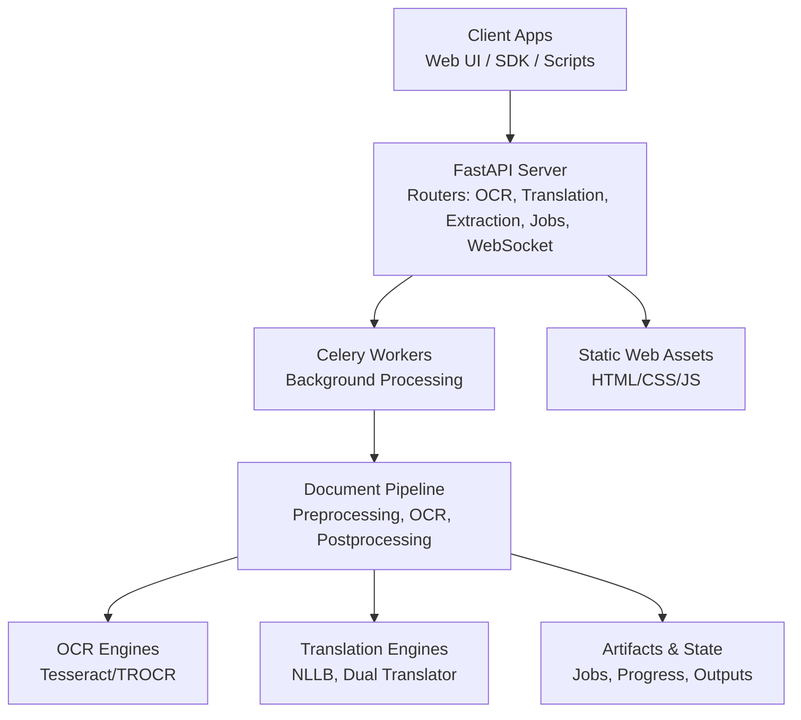
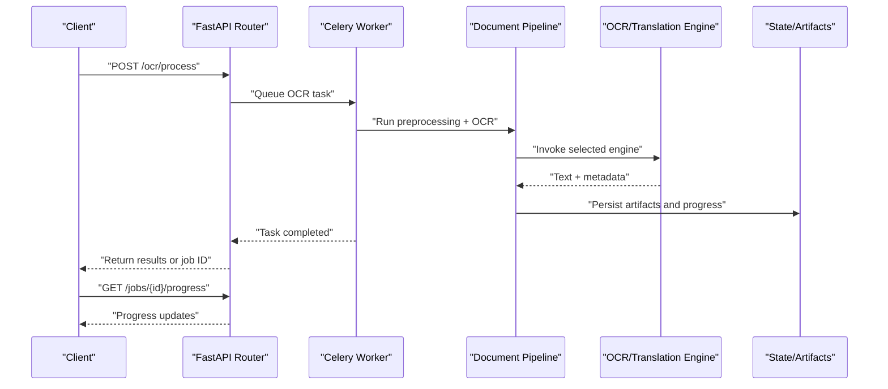
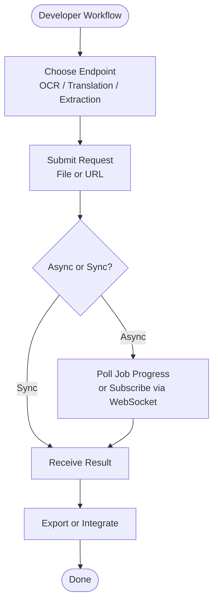
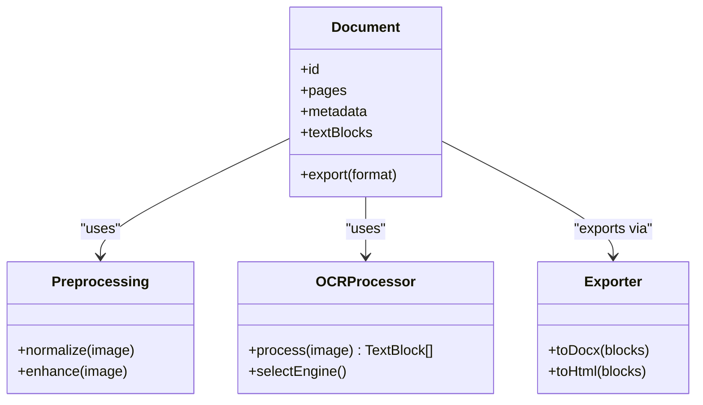
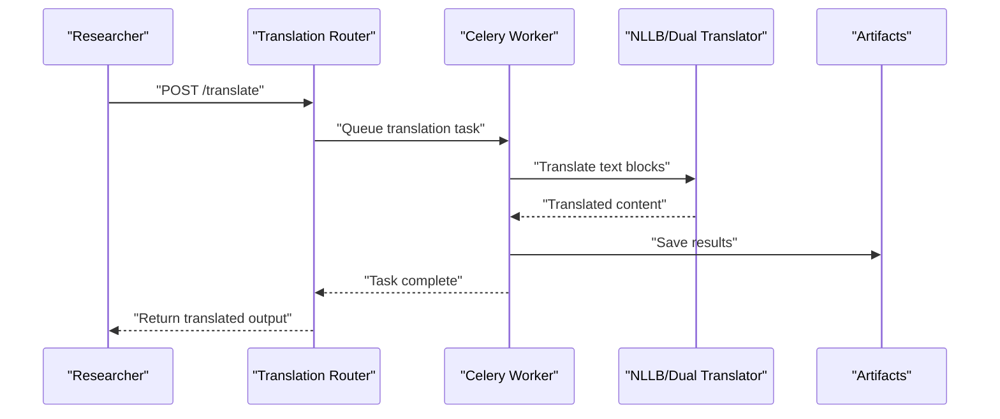
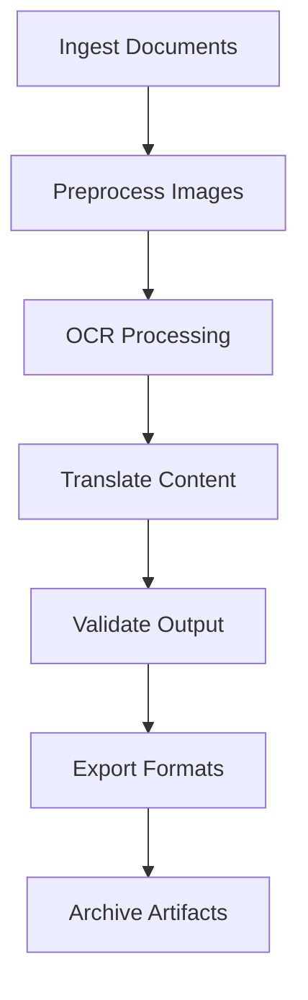
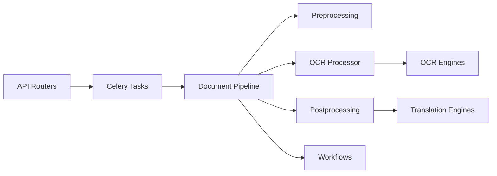

# Target Audience and Use Cases

<cite>
**Referenced Files in This Document**
- [README.md](file://README.md)
- [ARCHITECTURE.md](file://ARCHITECTURE.md)
- [server.py](file://src/local_deepl/server.py)
- [celery_app.py](file://src/local_deepl/api/celery_app.py)
- [tasks.py](file://src/local_deepl/api/tasks.py)
- [ocr.py](file://src/local_deepl/api/routers/ocr.py)
- [translation.py](file://src/local_deepl/api/routers/translation.py)
- [extraction.py](file://src/local_deepl/api/routers/extraction.py)
- [jobs.py](file://src/local_deepl/api/routers/jobs.py)
- [websocket.py](file://src/local_deepl/api/routers/websocket.py)
- [pipeline.py](file://src/local_deepl/pipeline.py)
- [document.py](file://src/local_deepl/core/document.py)
- [preprocessing.py](file://src/local_deepl/core/preprocessing.py)
- [handwriting_preprocessor.py](file://src/local_deepl/core/handwriting_preprocessor.py)
- [pdf_handler.py](file://src/local_deepl/core/pdf/handler.py)
- [pdf_rasterizer.py](file://src/local_deepl/core/pdf/rasterizer.py)
- [ocr_client.py](file://src/local_deepl/core/ocr/client.py)
- [ocr_processor.py](file://src/local_deepl/core/ocr/processor.py)
- [nllb_engine.py](file://src/local_deepl/core/nllb_engine.py)
- [trocr_engine.py](file://src/local_deepl/core/trocr_engine.py)
- [dual_translator.py](file://src/local_deepl/core/dual_translator.py)
- [workflow_base.py](file://src/local_deepl/core/workflows/base.py)
- [workflow_hybrid.py](file://src/local_deepl/core/workflows/hybrid.py)
- [workflow_grounded.py](file://src/local_deepl/core/workflows/grounded.py)
- [compose.yaml](file://compose.yaml)
- [Dockerfile](file://Dockerfile)
- [pyproject.toml](file://pyproject.toml)
</cite>

## Table of Contents
1. [Introduction](#introduction)
2. [Project Structure](#project-structure)
3. [Core Components](#core-components)
4. [Architecture Overview](#architecture-overview)
5. [Detailed Component Analysis](#detailed-component-analysis)
6. [Dependency Analysis](#dependency-analysis)
7. [Performance Considerations](#performance-considerations)
8. [Troubleshooting Guide](#troubleshooting-guide)
9. [Conclusion](#conclusion)
10. [Appendices](#appendices)

## Introduction
This document defines the target audiences and common use cases for LocalDeepL, a local-first OCR and translation platform that supports multilingual documents, images, PDFs, and handwritten notes. It explains how different user types can integrate with the system, what outcomes they can expect, and which deployment models fit their environments—from development to production.

## Project Structure
LocalDeepL exposes an HTTP API for OCR, extraction, translation, and job management, backed by asynchronous task processing and modular OCR/translation engines. The static web UI provides a workspace for interactive workflows.

**Diagram sources**
- [server.py](file://src/local_deepl/server.py)
- [celery_app.py](file://src/local_deepl/api/celery_app.py)
- [tasks.py](file://src/local_deepl/api/tasks.py)
- [ocr.py](file://src/local_deepl/api/routers/ocr.py)
- [translation.py](file://src/local_deepl/api/routers/translation.py)
- [extraction.py](file://src/local_deepl/api/routers/extraction.py)
- [jobs.py](file://src/local_deepl/api/routers/jobs.py)
- [websocket.py](file://src/local_deepl/api/routers/websocket.py)
- [pipeline.py](file://src/local_deepl/pipeline.py)

**Section sources**
- [README.md](file://README.md)
- [ARCHITECTURE.md](file://ARCHITECTURE.md)
- [server.py](file://src/local_deepl/server.py)
- [compose.yaml](file://compose.yaml)
- [Dockerfile](file://Dockerfile)
- [pyproject.toml](file://pyproject.toml)

## Core Components
- API Routers: Provide endpoints for OCR, translation, extraction, jobs, and real-time updates via WebSocket.
- Task Queue: Celery-based workers handle long-running tasks asynchronously.
- Document Pipeline: Orchestrates preprocessing, OCR, postprocessing, and export.
- OCR Engines: Pluggable backends including Tesseract and TROCR.
- Translation Engines: NLLB and dual translator for multilingual support.
- Workflows: Base, hybrid, and grounded workflows for flexible processing strategies.
- PDF Handling: Rasterization and handler utilities for PDF inputs.
- Preprocessing: Image normalization and handwriting-specific preprocessing.

**Section sources**
- [ocr.py](file://src/local_deepl/api/routers/ocr.py)
- [translation.py](file://src/local_deepl/api/routers/translation.py)
- [extraction.py](file://src/local_deepl/api/routers/extraction.py)
- [jobs.py](file://src/local_deepl/api/routers/jobs.py)
- [websocket.py](file://src/local_deepl/api/routers/websocket.py)
- [celery_app.py](file://src/local_deepl/api/celery_app.py)
- [tasks.py](file://src/local_deepl/api/tasks.py)
- [pipeline.py](file://src/local_deepl/pipeline.py)
- [document.py](file://src/local_deepl/core/document.py)
- [preprocessing.py](file://src/local_deepl/core/preprocessing.py)
- [handwriting_preprocessor.py](file://src/local_deepl/core/handwriting_preprocessor.py)
- [pdf_handler.py](file://src/local_deepl/core/pdf/handler.py)
- [pdf_rasterizer.py](file://src/local_deepl/core/pdf/rasterizer.py)
- [ocr_client.py](file://src/local_deepl/core/ocr/client.py)
- [ocr_processor.py](file://src/local_deepl/core/ocr/processor.py)
- [nllb_engine.py](file://src/local_deepl/core/nllb_engine.py)
- [trocr_engine.py](file://src/local_deepl/core/trocr_engine.py)
- [dual_translator.py](file://src/local_deepl/core/dual_translator.py)
- [workflow_base.py](file://src/local_deepl/core/workflows/base.py)
- [workflow_hybrid.py](file://src/local_deepl/core/workflows/hybrid.py)
- [workflow_grounded.py](file://src/local_deepl/core/workflows/grounded.py)

## Architecture Overview
LocalDeepL follows a modular architecture:
- HTTP layer (FastAPI) exposes REST endpoints and WebSocket channels.
- Background processing uses Celery for scalability and resilience.
- Document pipeline composes preprocessing, OCR, and postprocessing steps.
- Pluggable engines allow swapping OCR and translation backends.
- Workflows define end-to-end strategies for different document types.

**Diagram sources**
- [ocr.py](file://src/local_deepl/api/routers/ocr.py)
- [tasks.py](file://src/local_deepl/api/tasks.py)
- [pipeline.py](file://src/local_deepl/pipeline.py)
- [jobs.py](file://src/local_deepl/api/routers/jobs.py)
- [websocket.py](file://src/local_deepl/api/routers/websocket.py)

## Detailed Component Analysis

### Developers Integrating OCR Services
- Integration approach: Use the FastAPI endpoints for OCR, translation, and extraction. For batch operations, submit jobs and poll progress or subscribe via WebSocket.
- Expected outcomes: Structured text outputs, confidence scores, bounding boxes, and optional translations.
- Typical workflow: Upload image/PDF → select OCR engine → receive structured output → optionally translate or export.

**Diagram sources**
- [ocr.py](file://src/local_deepl/api/routers/ocr.py)
- [translation.py](file://src/local_deepl/api/routers/translation.py)
- [extraction.py](file://src/local_deepl/api/routers/extraction.py)
- [jobs.py](file://src/local_deepl/api/routers/jobs.py)
- [websocket.py](file://src/local_deepl/api/routers/websocket.py)

**Section sources**
- [ocr.py](file://src/local_deepl/api/routers/ocr.py)
- [translation.py](file://src/local_deepl/api/routers/translation.py)
- [extraction.py](file://src/local_deepl/api/routers/extraction.py)
- [jobs.py](file://src/local_deepl/api/routers/jobs.py)
- [websocket.py](file://src/local_deepl/api/routers/websocket.py)
- [pipeline.py](file://src/local_deepl/pipeline.py)

### Businesses Requiring Document Digitization
- Use case: Scan paper documents, convert to searchable text, and maintain layout fidelity.
- Expected outcomes: High-quality OCR text, page-level structure, and export formats (e.g., DOCX, HTML).
- Integration approach: Batch upload via jobs; configure OCR settings per document type; automate exports.

**Diagram sources**
- [document.py](file://src/local_deepl/core/document.py)
- [preprocessing.py](file://src/local_deepl/core/preprocessing.py)
- [ocr_processor.py](file://src/local_deepl/core/ocr/processor.py)

**Section sources**
- [document.py](file://src/local_deepl/core/document.py)
- [preprocessing.py](file://src/local_deepl/core/preprocessing.py)
- [ocr_processor.py](file://src/local_deepl/core/ocr/processor.py)
- [pdf_handler.py](file://src/local_deepl/core/pdf/handler.py)
- [pdf_rasterizer.py](file://src/local_deepl/core/pdf/rasterizer.py)

### Researchers Working With Multilingual Documents
- Use case: Process multilingual PDFs and images; extract text and translate across languages.
- Expected outcomes: Accurate multilingual OCR and translation with language detection and glossary support.
- Integration approach: Configure language parameters; use translation routers; leverage NLLB or dual translator engines.

**Diagram sources**
- [translation.py](file://src/local_deepl/api/routers/translation.py)
- [tasks.py](file://src/local_deepl/api/tasks.py)
- [nllb_engine.py](file://src/local_deepl/core/nllb_engine.py)
- [dual_translator.py](file://src/local_deepl/core/dual_translator.py)

**Section sources**
- [translation.py](file://src/local_deepl/api/routers/translation.py)
- [nllb_engine.py](file://src/local_deepl/core/nllb_engine.py)
- [dual_translator.py](file://src/local_deepl/core/dual_translator.py)
- [tasks.py](file://src/local_deepl/api/tasks.py)

### Organizations Needing Automated Translation Workflows
- Use case: Build pipelines that ingest documents, perform OCR, then translate and export.
- Expected outcomes: Consistent, auditable workflows with progress tracking and error handling.
- Integration approach: Use workflows (hybrid/grounded), job management, and WebSocket for live updates.

**Diagram sources**
- [workflow_base.py](file://src/local_deepl/core/workflows/base.py)
- [workflow_hybrid.py](file://src/local_deepl/core/workflows/hybrid.py)
- [workflow_grounded.py](file://src/local_deepl/core/workflows/grounded.py)
- [jobs.py](file://src/local_deepl/api/routers/jobs.py)
- [websocket.py](file://src/local_deepl/api/routers/websocket.py)

**Section sources**
- [workflow_base.py](file://src/local_deepl/core/workflows/base.py)
- [workflow_hybrid.py](file://src/local_deepl/core/workflows/hybrid.py)
- [workflow_grounded.py](file://src/local_deepl/core/workflows/grounded.py)
- [jobs.py](file://src/local_deepl/api/routers/jobs.py)
- [websocket.py](file://src/local_deepl/api/routers/websocket.py)

## Dependency Analysis
LocalDeepL’s components are loosely coupled through well-defined interfaces:
- Routers depend on services and task queues.
- Pipeline orchestrates preprocessing, OCR, and postprocessing modules.
- Engines are pluggable and interchangeable.
- Workflows compose multiple steps into reusable processes.

**Diagram sources**
- [ocr.py](file://src/local_deepl/api/routers/ocr.py)
- [translation.py](file://src/local_deepl/api/routers/translation.py)
- [tasks.py](file://src/local_deepl/api/tasks.py)
- [pipeline.py](file://src/local_deepl/pipeline.py)
- [preprocessing.py](file://src/local_deepl/core/preprocessing.py)
- [ocr_processor.py](file://src/local_deepl/core/ocr/processor.py)
- [nllb_engine.py](file://src/local_deepl/core/nllb_engine.py)
- [trocr_engine.py](file://src/local_deepl/core/trocr_engine.py)
- [workflow_base.py](file://src/local_deepl/core/workflows/base.py)

**Section sources**
- [tasks.py](file://src/local_deepl/api/tasks.py)
- [pipeline.py](file://src/local_deepl/pipeline.py)
- [preprocessing.py](file://src/local_deepl/core/preprocessing.py)
- [ocr_processor.py](file://src/local_deepl/core/ocr/processor.py)
- [nllb_engine.py](file://src/local_deepl/core/nllb_engine.py)
- [trocr_engine.py](file://src/local_deepl/core/trocr_engine.py)
- [workflow_base.py](file://src/local_deepl/core/workflows/base.py)

## Performance Considerations
- Asynchronous processing: Use Celery workers to handle large batches without blocking the API.
- Engine selection: Choose OCR engines based on document quality and language requirements.
- Caching and artifacts: Persist intermediate results to avoid recomputation.
- Resource scaling: Deploy workers horizontally for throughput; tune concurrency per worker.

[No sources needed since this section provides general guidance]

## Troubleshooting Guide
- Common issues:
  - OCR failures due to low-quality images: Apply preprocessing enhancements.
  - Translation errors: Verify language codes and engine availability.
  - Job timeouts: Increase worker concurrency or adjust task limits.
- Debugging tools:
  - WebSocket for live progress and error messages.
  - Artifact inspection to review intermediate outputs.
  - Logging and metrics from Celery workers.

**Section sources**
- [websocket.py](file://src/local_deepl/api/routers/websocket.py)
- [tasks.py](file://src/local_deepl/api/tasks.py)
- [preprocessing.py](file://src/local_deepl/core/preprocessing.py)
- [nllb_engine.py](file://src/local_deepl/core/nllb_engine.py)
- [trocr_engine.py](file://src/local_deepl/core/trocr_engine.py)

## Conclusion
LocalDeepL serves developers, businesses, researchers, and organizations by providing a flexible, local-first OCR and translation platform. Its modular architecture supports diverse deployment models and workflows, enabling everything from simple scans to complex multilingual pipelines.

[No sources needed since this section summarizes without analyzing specific files]

## Appendices

### Deployment Models
- Development: Run locally with FastAPI server and in-memory state for quick iteration.
- Staging: Containerized setup with Docker Compose for testing integrations.
- Production: Scaled Celery workers, persistent storage, and security middleware.

**Section sources**
- [compose.yaml](file://compose.yaml)
- [Dockerfile](file://Dockerfile)
- [pyproject.toml](file://pyproject.toml)
- [server.py](file://src/local_deepl/server.py)