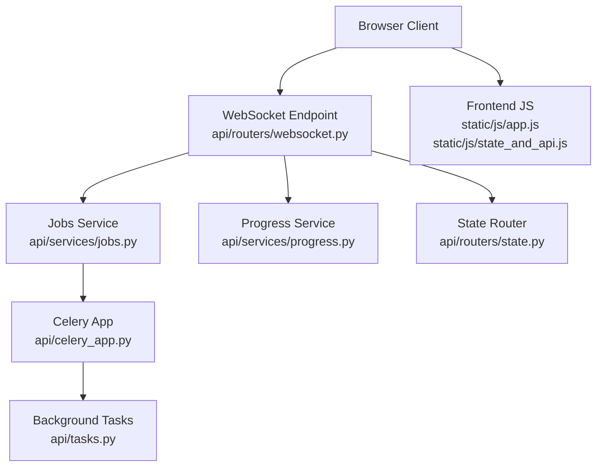
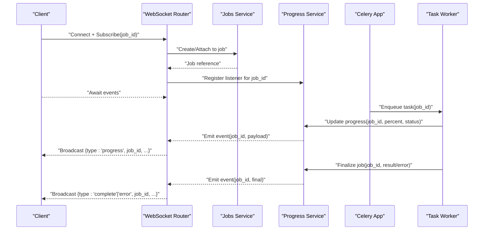
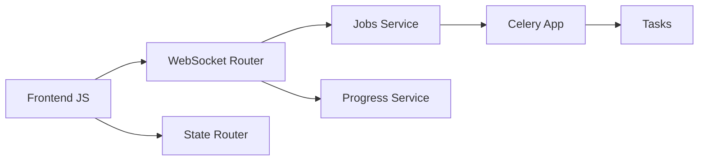

# Real-time Communication

<cite>
**Referenced Files in This Document**
- [server.py](file://src/local_deepl/server.py)
- [websocket.py](file://src/local_deepl/api/routers/websocket.py)
- [jobs.py](file://src/local_deepl/api/services/jobs.py)
- [progress.py](file://src/local_deepl/api/services/progress.py)
- [tasks.py](file://src/local_deepl/api/tasks.py)
- [celery_app.py](file://src/local_deepl/api/celery_app.py)
- [state.py](file://src/local_deepl/api/routers/state.py)
- [app.js](file://src/local_deepl/static/js/app.js)
- [state_and_api.js](file://src/local_deepl/static/js/state_and_api.js)
- [test_websocket_handler.py](file://tests/test_websocket_handler.py)
</cite>

## Table of Contents
1. [Introduction](#introduction)
2. [Project Structure](#project-structure)
3. [Core Components](#core-components)
4. [Architecture Overview](#architecture-overview)
5. [Detailed Component Analysis](#detailed-component-analysis)
6. [Dependency Analysis](#dependency-analysis)
7. [Performance Considerations](#performance-considerations)
8. [Troubleshooting Guide](#troubleshooting-guide)
9. [Conclusion](#conclusion)
10. [Appendices](#appendices)

## Introduction
This document explains LocalDeepL’s WebSocket-based real-time communication system. It covers connection handling, message formats, event types, state management, progress tracking for long-running operations, callback mechanisms, and client-server protocols. It also provides guidance on resilience, reconnection logic, message ordering guarantees, debugging techniques, and performance optimization for high-concurrency scenarios.

## Project Structure
LocalDeepL exposes a WebSocket endpoint under the API routers and integrates with background job execution via Celery. The server wires up routes, manages connections, and bridges job progress to connected clients. The frontend maintains WebSocket state and subscribes to events to update the UI.

**Diagram sources**
- [websocket.py](file://src/local_deepl/api/routers/websocket.py)
- [jobs.py](file://src/local_deepl/api/services/jobs.py)
- [progress.py](file://src/local_deepl/api/services/progress.py)
- [celery_app.py](file://src/local_deepl/api/celery_app.py)
- [tasks.py](file://src/local_deepl/api/tasks.py)
- [state.py](file://src/local_deepl/api/routers/state.py)
- [app.js](file://src/local_deepl/static/js/app.js)
- [state_and_api.js](file://src/local_deepl/static/js/state_and_api.js)

**Section sources**
- [server.py](file://src/local_deepl/server.py)
- [websocket.py](file://src/local_deepl/api/routers/websocket.py)
- [jobs.py](file://src/local_deepl/api/services/jobs.py)
- [progress.py](file://src/local_deepl/api/services/progress.py)
- [tasks.py](file://src/local_deepl/api/tasks.py)
- [celery_app.py](file://src/local_deepl/api/celery_app.py)
- [state.py](file://src/local_deepl/api/routers/state.py)
- [app.js](file://src/local_deepl/static/js/app.js)
- [state_and_api.js](file://src/local_deepl/static/js/state_and_api.js)

## Core Components
- WebSocket router: Accepts connections, authenticates (if applicable), binds channels or rooms per session/job, and forwards messages between clients and services.
- Jobs service: Creates and tracks background jobs, exposes lifecycle methods, and emits status updates.
- Progress service: Maintains per-job progress state and publishes incremental updates.
- Celery app and tasks: Execute long-running work asynchronously and report progress back through the progress service.
- State router: Provides REST endpoints for current state snapshots and health checks.
- Frontend JavaScript: Manages WebSocket lifecycle, subscribes to events, and renders progress/status.

Key responsibilities:
- Connection lifecycle: open, subscribe, publish, unsubscribe, close.
- Event-driven updates: job start, progress ticks, completion, error.
- Message ordering: ensure per-session ordering and idempotency where needed.
- Resilience: handle disconnects, retries, and reconnect strategies.

**Section sources**
- [websocket.py](file://src/local_deepl/api/routers/websocket.py)
- [jobs.py](file://src/local_deepl/api/services/jobs.py)
- [progress.py](file://src/local_deepl/api/services/progress.py)
- [tasks.py](file://src/local_deepl/api/tasks.py)
- [celery_app.py](file://src/local_deepl/api/celery_app.py)
- [state.py](file://src/local_deepl/api/routers/state.py)
- [app.js](file://src/local_deepl/static/js/app.js)
- [state_and_api.js](file://src/local_deepl/static/js/state_and_api.js)

## Architecture Overview
The real-time architecture couples WebSocket sessions with asynchronous job execution. Clients connect via WebSocket, subscribe to job-specific channels, and receive progress updates as background tasks run. The server acts as a bridge between WebSocket clients and Celery workers.

**Diagram sources**
- [websocket.py](file://src/local_deepl/api/routers/websocket.py)
- [jobs.py](file://src/local_deepl/api/services/jobs.py)
- [progress.py](file://src/local_deepl/api/services/progress.py)
- [tasks.py](file://src/local_deepl/api/tasks.py)
- [celery_app.py](file://src/local_deepl/api/celery_app.py)

## Detailed Component Analysis

### WebSocket Router
Responsibilities:
- Establish and manage WebSocket connections.
- Authenticate and scope sessions.
- Bind clients to job channels and forward messages.
- Handle subscription/unsubscription and cleanup on disconnect.

Message flow:
- Client sends a subscribe message with a job identifier.
- Server acknowledges and begins forwarding progress events for that job.
- On disconnect, subscriptions are released and resources cleaned up.

Error handling:
- Invalid messages return structured errors.
- Unavailable jobs return appropriate status codes/messages.
- Network errors trigger graceful disconnect and client-side reconnection prompts.

Resilience:
- Heartbeat/ping-pong to detect dead connections.
- Queue buffering for transient spikes; drop policy defined by service configuration.

**Section sources**
- [websocket.py](file://src/local_deepl/api/routers/websocket.py)

### Jobs Service
Responsibilities:
- Create jobs and map them to Celery tasks.
- Track job lifecycle states (pending, running, completed, failed).
- Provide APIs for status queries and cancellation if supported.

Integration:
- Emits job events to the progress service.
- Ensures idempotent creation and safe attachment to existing jobs.

**Section sources**
- [jobs.py](file://src/local_deepl/api/services/jobs.py)

### Progress Service
Responsibilities:
- Maintain per-job progress state (percent, stage, metadata).
- Publish events to subscribers when progress changes.
- Persist last known state for recovery and snapshot retrieval.

Event model:
- Incremental progress updates with monotonic percent values.
- Finalization events carrying success/failure outcomes.

Ordering guarantees:
- Events are published in order per job.
- Consumers should handle out-of-order delivery gracefully.

**Section sources**
- [progress.py](file://src/local_deepl/api/services/progress.py)

### Celery App and Tasks
Responsibilities:
- Define and execute long-running tasks.
- Report progress back to the progress service at intervals.
- Handle exceptions and propagate errors to clients via WebSocket.

Reliability:
- Retry policies for transient failures.
- Dead-letter handling for unrecoverable tasks.

**Section sources**
- [celery_app.py](file://src/local_deepl/api/celery_app.py)
- [tasks.py](file://src/local_deepl/api/tasks.py)

### State Router
Responsibilities:
- Expose REST endpoints for current system state and health.
- Allow clients to fetch latest job statuses without WebSocket.

Use cases:
- Initial page load state synchronization.
- Fallback when WebSocket is unavailable.

**Section sources**
- [state.py](file://src/local_deepl/api/routers/state.py)

### Frontend JavaScript
Responsibilities:
- Manage WebSocket lifecycle (connect, subscribe, reconnect).
- Parse incoming events and update application state.
- Render progress bars and notifications.

Patterns:
- Centralized event bus for decoupling UI components.
- Debounced updates for high-frequency progress messages.
- Reconnection with exponential backoff and jitter.

**Section sources**
- [app.js](file://src/local_deepl/static/js/app.js)
- [state_and_api.js](file://src/local_deepl/static/js/state_and_api.js)

## Dependency Analysis
The WebSocket router depends on the jobs and progress services to coordinate real-time updates. Background tasks rely on Celery for execution and reporting. The frontend depends on both WebSocket and REST endpoints for robustness.

**Diagram sources**
- [websocket.py](file://src/local_deepl/api/routers/websocket.py)
- [jobs.py](file://src/local_deepl/api/services/jobs.py)
- [progress.py](file://src/local_deepl/api/services/progress.py)
- [celery_app.py](file://src/local_deepl/api/celery_app.py)
- [tasks.py](file://src/local_deepl/api/tasks.py)
- [state.py](file://src/local_deepl/api/routers/state.py)
- [app.js](file://src/local_deepl/static/js/app.js)
- [state_and_api.js](file://src/local_deepl/static/js/state_and_api.js)

**Section sources**
- [websocket.py](file://src/local_deepl/api/routers/websocket.py)
- [jobs.py](file://src/local_deepl/api/services/jobs.py)
- [progress.py](file://src/local_deepl/api/services/progress.py)
- [celery_app.py](file://src/local_deepl/api/celery_app.py)
- [tasks.py](file://src/local_deepl/api/tasks.py)
- [state.py](file://src/local_deepl/api/routers/state.py)
- [app.js](file://src/local_deepl/static/js/app.js)
- [state_and_api.js](file://src/local_deepl/static/js/state_and_api.js)

## Performance Considerations
- Batch progress updates: Coalesce frequent ticks into periodic snapshots to reduce network overhead.
- Connection pooling: Use persistent connections and avoid frequent reconnects.
- Backpressure: Implement rate limiting on event emission and consumer-side throttling.
- Memory management: Clean up subscriptions promptly on disconnect to prevent leaks.
- Horizontal scaling: Ensure shared state (progress store) is accessible across worker nodes.

[No sources needed since this section provides general guidance]

## Troubleshooting Guide
Common issues and resolutions:
- Connection drops: Verify heartbeat settings and network stability; implement client-side reconnection with backoff.
- Missing events: Check subscription scope and job IDs; confirm progress service persistence and event publishing.
- Out-of-order updates: Enforce monotonic percent checks and deduplicate events on the client.
- High CPU usage: Reduce update frequency, enable batching, and profile task execution paths.
- Debugging: Enable verbose logs on WebSocket router and progress service; capture payloads for analysis.

Validation and tests:
- Use dedicated tests to simulate disconnects, rapid progress updates, and error conditions.

**Section sources**
- [test_websocket_handler.py](file://tests/test_websocket_handler.py)

## Conclusion
LocalDeepL’s real-time communication leverages WebSockets to deliver low-latency progress updates for background jobs. The design separates concerns across WebSocket routing, job orchestration, and progress publishing, enabling scalable and resilient operation. Proper client implementation, careful event handling, and performance tuning ensure a smooth user experience even under high concurrency.

[No sources needed since this section summarizes without analyzing specific files]

## Appendices

### WebSocket Message Formats
- Subscribe: Includes job identifier and optional filters.
- Progress: Contains job identifier, percent, stage, and timestamp.
- Complete: Indicates successful completion with result metadata.
- Error: Reports failure details and recovery options.

[No sources needed since this section provides general guidance]

### Client Implementation Example
Steps:
- Connect to WebSocket endpoint.
- Send subscribe message with job ID.
- Listen for progress, complete, and error events.
- Update UI and handle reconnection on disconnect.

[No sources needed since this section provides general guidance]

### Error Handling Strategies
- Validate all incoming messages and reject malformed ones.
- Return structured error responses with actionable information.
- Log context-rich diagnostics for troubleshooting.

[No sources needed since this section provides general guidance]