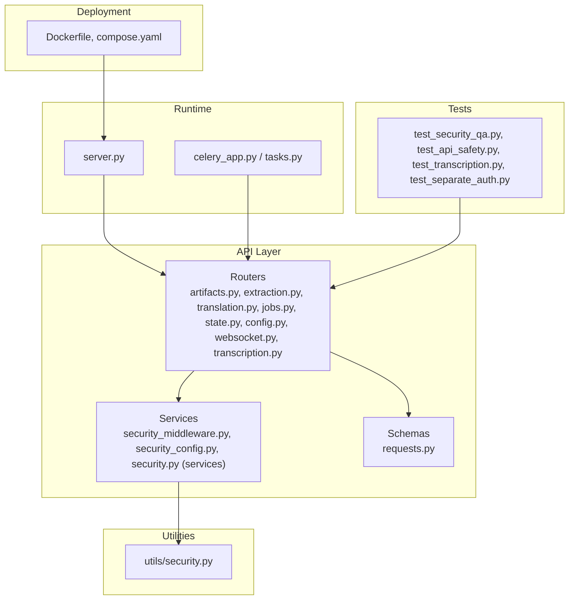
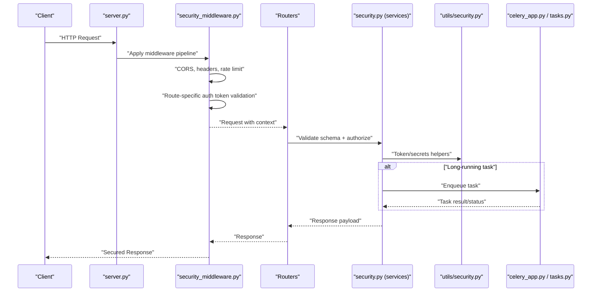
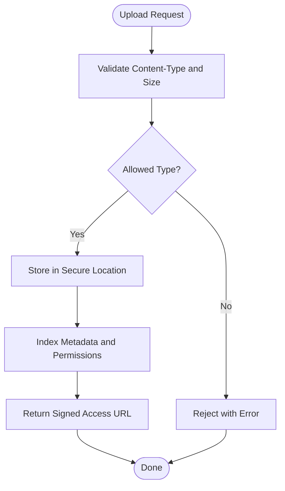
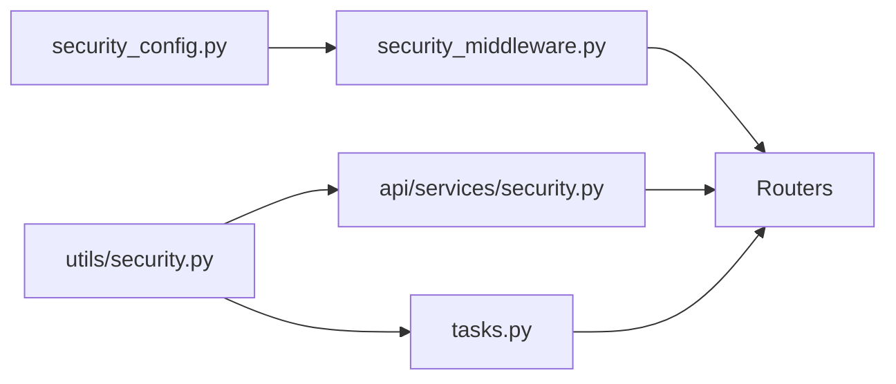

# Security & Compliance

<cite>
**Referenced Files in This Document**
- [server.py](file://src/omniscribe/server.py)
- [security_middleware.py](file://src/omniscribe/api/services/security_middleware.py)
- [security_config.py](file://src/omniscribe/api/services/security_config.py)
- [transcription.py](file://src/omniscribe/api/routers/transcription.py)
- [test_transcription.py](file://tests/test_transcription.py)
- [test_separate_auth.py](file://tests/test_separate_auth.py)
</cite>

## Update Summary
**Changes Made**
- Updated Authentication and Authorization section to document the new transcription-specific authentication token
- Enhanced Security Middleware section with transcription route support
- Added configuration examples for OMNISCRIBE_TRANSCRIPTION_AUTH_TOKEN
- Updated architecture diagrams to reflect the four-token authentication system
- Added production hardening guidance for transcription route security

## Table of Contents
1. [Introduction](#introduction)
2. [Project Structure](#project-structure)
3. [Core Components](#core-components)
4. [Architecture Overview](#architecture-overview)
5. [Detailed Component Analysis](#detailed-component-analysis)
6. [Dependency Analysis](#dependency-analysis)
7. [Performance Considerations](#performance-considerations)
8. [Troubleshooting Guide](#troubleshooting-guide)
9. [Conclusion](#conclusion)
10. [Appendices](#appendices)

## Introduction
This document describes OmniScribe's security and compliance features with a focus on enterprise-grade protection and audit capabilities. It explains authentication and authorization mechanisms, input validation, secure file handling, middleware implementation, CORS configuration, API rate limiting, audit logging, encryption at rest and in transit, and privacy compliance considerations. It also provides production hardening guidance, access control policies, monitoring setup, vulnerability assessment and penetration testing guidelines, and incident response procedures.

## Project Structure
Security-related functionality is implemented across the API services layer, utilities, routers, and runtime configuration:
- Security services and middleware under api/services
- Utility-level helpers under utils
- Routers that handle requests and files
- Application entrypoint and server configuration
- Tests validating security behavior
- Containerization and orchestration for deployment posture



**Diagram sources**
- [server.py](file://src/omniscribe/server.py)
- [security_middleware.py](file://src/omniscribe/api/services/security_middleware.py)
- [security_config.py](file://src/omniscribe/api/services/security_config.py)
- [transcription.py](file://src/omniscribe/api/routers/transcription.py)
- [test_transcription.py](file://tests/test_transcription.py)
- [test_separate_auth.py](file://tests/test_separate_auth.py)

## Core Components
- Security middleware: Centralizes request/response processing for headers, CORS, rate limiting, and security controls.
- Security configuration: Provides typed settings for enabling/disabling features such as CORS origins, allowed methods, and rate limits.
- Security utilities: Shared helpers for token handling, secrets management, and safe operations used by services and routers.
- Router-level enforcement: Each router validates inputs via Pydantic schemas and applies service-layer checks before executing business logic.
- Background job security: Celery app and tasks enforce isolation and safe execution boundaries for long-running workloads.

Key responsibilities:
- Authentication and authorization hooks with per-route token support
- Input validation and sanitization
- Secure file upload/download flows
- Audit event emission and correlation IDs
- Rate limiting and throttling
- CORS policy enforcement

**Section sources**
- [security_middleware.py](file://src/omniscribe/api/services/security_middleware.py)
- [security_config.py](file://src/omniscribe/api/services/security_config.py)
- [transcription.py](file://src/omniscribe/api/routers/transcription.py)

## Architecture Overview
The application follows a layered architecture where HTTP/WebSocket endpoints are handled by routers, which delegate to services. Security middleware sits close to the ASGI/HTTP boundary to enforce cross-cutting concerns. Configuration is centralized and consumed by both middleware and services.



**Diagram sources**
- [server.py](file://src/omniscribe/server.py)
- [security_middleware.py](file://src/omniscribe/api/services/security_middleware.py)
- [security_config.py](file://src/omniscribe/api/services/security_config.py)

## Detailed Component Analysis

### Security Middleware
Responsibilities:
- Enforce CORS policies based on configured origins, methods, and headers.
- Apply rate limiting per client or endpoint.
- Inject security headers and correlation identifiers for tracing.
- Normalize and validate incoming requests prior to routing.
- **Updated**: Support for four independent authentication tokens with per-route precedence.

Configuration:
- Controlled via security configuration module; enables toggles for CORS, allowed hosts, and rate-limit thresholds.
- **Updated**: Four-token authentication system supporting global, OCR, translation, and transcription-specific tokens.

Operational notes:
- Middleware should be registered early in the server startup to protect all routes.
- Ensure consistent correlation ID propagation to downstream services and background tasks.
- **Updated**: Route classification supports `/api/transcribe`, `/api/models/transcription`, and `/api/config/transcription` paths.

**Section sources**
- [security_middleware.py](file://src/omniscribe/api/services/security_middleware.py)
- [security_config.py](file://src/omniscribe/api/services/security_config.py)
- [server.py](file://src/omniscribe/server.py)

### Security Configuration
Responsibilities:
- Provide strongly-typed settings for security features (CORS, rate limiting, secrets).
- Centralize environment-driven overrides for production deployments.
- Expose defaults suitable for development while allowing strict production values.
- **Updated**: Support for OMNISCRIBE_TRANSCRIPTION_AUTH_TOKEN environment variable.

Production guidance:
- Pin explicit allowed origins and methods.
- Configure rate limits appropriate for your workload and SLAs.
- Avoid defaulting to permissive modes in production.
- **Updated**: Use separate tokens for each service route group for enhanced security isolation.

**Section sources**
- [security_config.py](file://src/omniscribe/api/services/security_config.py)

### Security Services and Utilities
Responsibilities:
- Token verification and session management helpers.
- Secrets retrieval from secure stores or environment variables.
- Safe cryptographic operations and hashing utilities.
- Common validation and sanitization routines reused across routers.

Integration points:
- Used by routers during authorization and by services for data protection.
- Background tasks consume these utilities to ensure consistent security posture.

**Section sources**
- [security_config.py](file://src/omniscribe/api/services/security_config.py)

### Router-Level Security and Input Validation
Responsibilities:
- Validate request payloads using Pydantic schemas to prevent malformed or malicious inputs.
- Enforce authorization checks before accessing resources.
- Handle file uploads safely, including type checks, size limits, and storage path validation.

Examples of protected endpoints:
- Artifacts: secure listing, retrieval, and deletion with access checks.
- Extraction and Translation: validated inputs and controlled resource access.
- Jobs and State: authenticated access to job lifecycle and status.
- WebSocket: secure connection establishment and message validation.
- **Updated**: Transcription routes: `/api/transcribe`, `/api/models/transcription`, `/api/config/transcription` with dedicated authentication.

**Section sources**
- [transcription.py](file://src/omniscribe/api/routers/transcription.py)
- [test_transcription.py](file://tests/test_transcription.py)

### Background Job Security
Responsibilities:
- Isolate worker processes and restrict filesystem/network access.
- Validate task payloads and parameters before execution.
- Propagate correlation IDs and audit context into tasks.

Operational notes:
- Use dedicated queues and worker profiles for sensitive workloads.
- Rotate credentials and tokens accessible to workers regularly.

**Section sources**
- [server.py](file://src/omniscribe/server.py)

### File Upload and Download Security
Practices:
- Validate content types and magic bytes; reject unexpected formats.
- Enforce maximum file sizes and chunked processing for large files.
- Sanitize filenames and store files outside web roots with randomized paths.
- Generate signed URLs or short-lived tokens for download access.
- Scan uploaded artifacts with antivirus/malware scanners when available.

Recommended flow:


[No diagram sources needed since this diagram shows conceptual workflow]

**Section sources**
- [transcription.py](file://src/omniscribe/api/routers/transcription.py)

### Authentication and Authorization
Mechanisms:
- **Updated**: Four-token authentication system with per-route precedence:
  - Global token (`OMNISCRIBE_AUTH_TOKEN`) for fallback authentication
  - OCR token (`OMNISCRIBE_OCR_AUTH_TOKEN`) for OCR routes
  - Translation token (`OMNISCRIBE_TRANSLATION_AUTH_TOKEN`) for translation routes  
  - **New**: Transcription token (`OMNISCRIBE_TRANSCRIPTION_AUTH_TOKEN`) for transcription routes
- Role- or scope-based authorization enforced at router/service boundaries.
- Session and credential handling through secure utilities.

Best practices:
- Require strong tokens and rotate frequently.
- Scope permissions narrowly per user or service account.
- Log authorization decisions for auditability.
- **Updated**: Use separate tokens for different service groups to minimize blast radius.

**Section sources**
- [security_middleware.py](file://src/omniscribe/api/services/security_middleware.py)
- [security_config.py](file://src/omniscribe/api/services/security_config.py)
- [transcription.py](file://src/omniscribe/api/routers/transcription.py)
- [test_transcription.py](file://tests/test_transcription.py)

### CORS Configuration
Controls:
- Whitelist allowed origins, methods, and headers.
- Disable preflight caching unless necessary.
- Restrict credentials sharing to trusted origins only.

Production guidance:
- Explicitly enumerate allowed origins.
- Avoid wildcard patterns in production.

**Section sources**
- [security_middleware.py](file://src/omniscribe/api/services/security_middleware.py)
- [security_config.py](file://src/omniscribe/api/services/security_config.py)

### API Rate Limiting
Capabilities:
- Per-client or per-endpoint throttling to mitigate abuse.
- Configurable windows and burst allowances.
- Consistent responses for rate-limited requests.

Implementation tips:
- Use IP or token-based identity for accurate limits.
- Integrate with distributed rate limiting for multi-instance deployments.

**Section sources**
- [security_middleware.py](file://src/omniscribe/api/services/security_middleware.py)
- [security_config.py](file://src/omniscribe/api/services/security_config.py)

### Audit Logging and Observability
Features:
- Emit structured audit events for authz decisions, file operations, and job lifecycles.
- Correlation IDs propagated across requests and tasks for end-to-end tracing.
- Sensitive fields redacted automatically.

Recommendations:
- Forward logs to a centralized SIEM or log aggregation system.
- Retain logs according to compliance requirements.

**Section sources**
- [security_middleware.py](file://src/omniscribe/api/services/security_middleware.py)

### Data Encryption
At Rest:
- Encrypt sensitive volumes or object stores used by the application.
- Manage keys via a KMS or secret manager.

In Transit:
- Enforce TLS termination at the edge or reverse proxy.
- Validate certificates and prefer modern cipher suites.

**Section sources**
- [server.py](file://src/omniscribe/server.py)

### Privacy and Compliance
Considerations:
- Minimize collection of personal data; apply data retention policies.
- Support data subject requests by providing export/delete capabilities for stored artifacts.
- Maintain records of processing activities and consent where applicable.

[No sources needed since this section provides general guidance]

## Dependency Analysis
Security components depend on configuration and shared utilities, while routers and background tasks integrate with them at runtime.



**Diagram sources**
- [security_config.py](file://src/omniscribe/api/services/security_config.py)
- [security_middleware.py](file://src/omniscribe/api/services/security_middleware.py)
- [server.py](file://src/omniscribe/server.py)

## Performance Considerations
- Keep middleware lightweight; avoid heavy I/O in request path.
- Use efficient rate limiting backends (in-memory for single instance, Redis for clusters).
- Stream large files and process in chunks to reduce memory pressure.
- Cache non-sensitive metadata judiciously and invalidate on updates.

[No sources needed since this section provides general guidance]

## Troubleshooting Guide
Common issues and diagnostics:
- CORS failures: Verify origin/method/header allowlists and browser preflight behavior.
- Rate limiting spikes: Inspect client identity resolution and window configuration.
- Auth errors: Check token format, expiration, and issuer validation.
- **Updated**: Transcription auth failures: Verify OMNISCRIBE_TRANSCRIPTION_AUTH_TOKEN is set correctly for transcription routes.
- File upload rejections: Confirm content-type checks and size limits.
- Task failures: Review correlation IDs and worker logs for context.

Validation tests:
- Security QA and API safety tests exercise core protections and can guide remediation.
- **Updated**: Transcription authentication tests verify route-specific token enforcement.

**Section sources**
- [test_transcription.py](file://tests/test_transcription.py)
- [test_separate_auth.py](file://tests/test_separate_auth.py)

## Conclusion
OmniScribe implements a layered security model with middleware-enforced controls, robust input validation, secure file handling, and integration points for audit and observability. The enhanced four-token authentication system provides granular access control across different service routes. By configuring CORS, rate limits, encryption appropriately, and following the operational guidance herein, organizations can deploy an enterprise-grade, compliant service.

[No sources needed since this section summarizes without analyzing specific files]

## Appendices

### Production Hardening Checklist
- Enable HTTPS/TLS termination and pin certificates.
- Set strict CORS allowlists and disable unnecessary methods.
- Configure rate limits per client and endpoint.
- **Updated**: Set separate authentication tokens for each service route group:
  - `OMNISCRIBE_AUTH_TOKEN` for global fallback
  - `OMNISCRIBE_OCR_AUTH_TOKEN` for OCR routes
  - `OMNISCRIBE_TRANSLATION_AUTH_TOKEN` for translation routes
  - `OMNISCRIBE_TRANSCRIPTION_AUTH_TOKEN` for transcription routes
- Use least-privilege service accounts and rotate secrets regularly.
- Run workers in isolated environments with minimal filesystem access.
- Enable structured audit logging and forward to SIEM.
- Back up encrypted data and test restoration procedures.

### Vulnerability Assessment and Penetration Testing Guidelines
- Perform static and dynamic analysis regularly; address findings promptly.
- Test authentication bypass, authorization flaws, and input validation gaps.
- **Updated**: Verify transcription route authentication with OMNISCRIBE_TRANSCRIPTION_AUTH_TOKEN.
- Validate file upload defenses against polymorphic and oversized payloads.
- Assess background job integrity and parameter injection risks.
- Review container images and base layers for known CVEs.

### Incident Response Procedures
- Detect: Monitor auth failures, rate limit triggers, and anomalous file operations.
- Contain: Revoke compromised tokens, isolate affected workers, and block abusive IPs.
- Eradicate: Patch vulnerabilities, rotate secrets, and remove malicious artifacts.
- Recover: Restore from verified backups and validate integrity.
- Lessons Learned: Update policies, add detections, and refine configurations.

### Environment Variables Reference
**Updated**: Complete list of security-related environment variables:

| Variable | Description | Default | Example |
|----------|-------------|---------|---------|
| `OMNISCRIBE_AUTH_TOKEN` | Global authentication token | None | `your-global-secret-here` |
| `OMNISCRIBE_OCR_AUTH_TOKEN` | OCR-specific authentication token | None | `your-ocr-secret-here` |
| `OMNISCRIBE_TRANSLATION_AUTH_TOKEN` | Translation-specific authentication token | None | `your-translation-secret-here` |
| `OMNISCRIBE_TRANSCRIPTION_AUTH_TOKEN` | **New**: Transcription-specific authentication token | None | `your-transcription-secret-here` |
| `OMNISCRIBE_CORS_ORIGINS` | Comma-separated allowed origins | Empty | `https://example.com,https://app.example.com` |
| `OMNISCRIBE_MAX_UPLOAD_MB` | Maximum upload size in MB | 10240 | `100` |
| `OMNISCRIBE_RATE_LIMIT_PER_MIN` | Requests per minute per IP | None | `60` |

**Section sources**
- [security_config.py](file://src/omniscribe/api/services/security_config.py)
- [test_separate_auth.py](file://tests/test_separate_auth.py)

### Transcription Route Authentication Examples
**New**: Configuration examples for transcription route security:

```bash
# Set transcription-specific authentication token
export OMNISCRIBE_TRANSCRIPTION_AUTH_TOKEN="your-transcription-secret-here"

# Or use separate tokens for all services
export OMNISCRIBE_AUTH_TOKEN="global-secret"
export OMNISCRIBE_OCR_AUTH_TOKEN="ocr-secret"
export OMNISCRIBE_TRANSLATION_AUTH_TOKEN="translation-secret"
export OMNISCRIBE_TRANSCRIPTION_AUTH_TOKEN="transcription-secret"
```

```python
# Programmatic configuration
from omniscribe.api.services.security_config import SecuritySettings

settings = SecuritySettings.from_env()
print(f"Transcription auth enabled: {settings.transcription_auth_enabled}")
print(f"Any auth enabled: {settings.any_auth_enabled}")
```

**Section sources**
- [security_config.py](file://src/omniscribe/api/services/security_config.py)
- [transcription.py](file://src/omniscribe/api/routers/transcription.py)
- [test_transcription.py](file://tests/test_transcription.py)