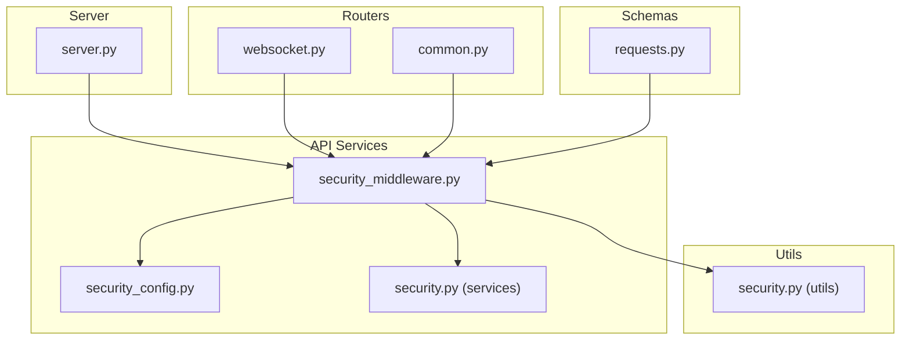
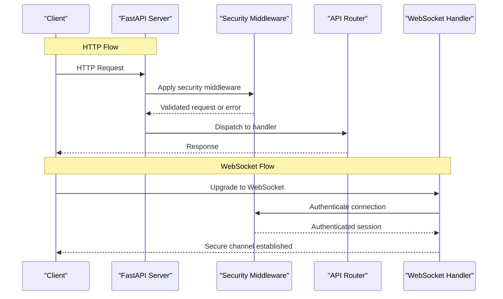
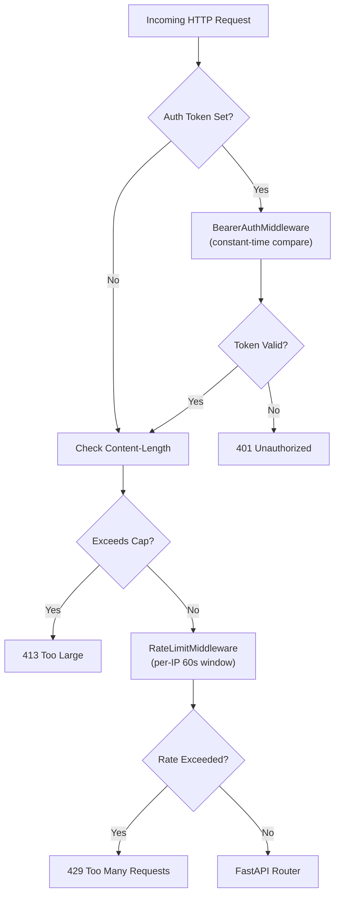
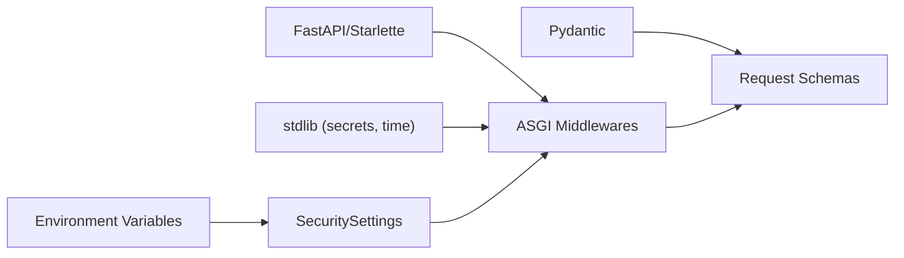

# Security and Authentication

<cite>
**Referenced Files in This Document**
- [server.py](file://src/local_deepl/server.py)
- [security_middleware.py](file://src/local_deepl/api/services/security_middleware.py)
- [security_config.py](file://src/local_deepl/api/services/security_config.py)
- [security.py](file://src/local_deepl/api/services/security.py)
- [security.py](file://src/local_deepl/utils/security.py)
- [websocket.py](file://src/local_deepl/api/routers/websocket.py)
- [common.py](file://src/local_deepl/api/routers/common.py)
- [requests.py](file://src/local_deepl/api/schemas/requests.py)
- [test_security_qa.py](file://tests/test_security_qa.py)
</cite>

## Table of Contents
1. [Introduction](#introduction)
2. [Project Structure](#project-structure)
3. [Core Components](#core-components)
4. [Architecture Overview](#architecture-overview)
5. [Detailed Component Analysis](#detailed-component-analysis)
6. [Dependency Analysis](#dependency-analysis)
7. [Performance Considerations](#performance-considerations)
8. [Troubleshooting Guide](#troubleshooting-guide)
9. [Conclusion](#conclusion)
10. [Appendices](#appendices)

## Introduction
This document explains the security and authentication system implemented in the project. It covers security middleware, input validation, access control patterns, authentication methods, authorization rules, and configuration options for rate limiting, CORS policies, and secure headers. It also documents how these mechanisms integrate with API endpoints and WebSocket connections, and provides guidance on custom middleware development and integration with external authentication providers.

## Project Structure
Security-related functionality is primarily located under:
- API services: security middleware, configuration, and shared utilities
- Utils: additional security helpers
- Routers: endpoint definitions and WebSocket handling
- Schemas: request/response models used for validation
- Tests: security-focused tests

**Diagram sources**
- [server.py](file://src/local_deepl/server.py)
- [security_middleware.py](file://src/local_deepl/api/services/security_middleware.py)
- [security_config.py](file://src/local_deepl/api/services/security_config.py)
- [security.py](file://src/local_deepl/api/services/security.py)
- [security.py](file://src/local_deepl/utils/security.py)
- [websocket.py](file://src/local_deepl/api/routers/websocket.py)
- [common.py](file://src/local_deepl/api/routers/common.py)
- [requests.py](file://src/local_deepl/api/schemas/requests.py)

**Section sources**
- [server.py](file://src/local_deepl/server.py)
- [security_middleware.py](file://src/local_deepl/api/services/security_middleware.py)
- [security_config.py](file://src/local_deepl/api/services/security_config.py)
- [security.py](file://src/local_deepl/api/services/security.py)
- [security.py](file://src/local_deepl/utils/security.py)
- [websocket.py](file://src/local_deepl/api/routers/websocket.py)
- [common.py](file://src/local_deepl/api/routers/common.py)
- [requests.py](file://src/local_deepl/api/schemas/requests.py)

## Core Components
- Security Middleware: Centralizes cross-cutting concerns such as rate limiting, CORS, secure headers, request logging, and optional authentication checks.
- Security Configuration: Provides structured settings for rate limits, allowed origins, header policies, and other security parameters.
- Shared Security Utilities: Helper functions for token parsing, signature verification, and safe operations used across services and routers.
- Request Validation: Pydantic schemas enforce structure and constraints on incoming requests.
- Access Control: Authorization logic applied within or before route handlers to restrict resource access based on identity and roles.
- WebSocket Security: Connection-level authentication and per-message validation where applicable.

**Section sources**
- [security_middleware.py](file://src/local_deepl/api/services/security_middleware.py)
- [security_config.py](file://src/local_deepl/api/services/security_config.py)
- [security.py](file://src/local_deepl/api/services/security.py)
- [security.py](file://src/local_deepl/utils/security.py)
- [requests.py](file://src/local_deepl/api/schemas/requests.py)
- [websocket.py](file://src/local_deepl/api/routers/websocket.py)

## Architecture Overview
The security architecture follows a layered approach:
- Server initialization wires up the security middleware early in the application lifecycle.
- Requests traverse the middleware stack, which enforces rate limits, validates headers, applies CORS, and performs authentication checks when enabled.
- Route handlers receive validated payloads and perform authorization checks using shared utilities.
- WebSocket connections are secured at connection establishment and can validate messages per frame.

**Diagram sources**
- [server.py](file://src/local_deepl/server.py)
- [security_middleware.py](file://src/local_deepl/api/services/security_middleware.py)
- [websocket.py](file://src/local_deepl/api/routers/websocket.py)

## Detailed Component Analysis

### Security Middleware (ASGI Layer)
The security stack consists of three thin ASGI middlewares wired by `server.create_app()`. They run *before* FastAPI routing — no per-router boilerplate.

**BearerAuthMiddleware**
- When `LOCAL_DEEPL_AUTH_TOKEN` is set, rejects every HTTP request whose `Authorization: Bearer <token>` header does not match.
- Uses `secrets.compare_digest` for constant-time comparison (timing-attack safe).
- WebSocket traffic is passed through; channel-level token binding is enforced separately in `api/routers/websocket.py`.
- Unset token = open access (local-desktop default).

**MaxUploadSizeMiddleware**
- Rejects HTTP requests whose `Content-Length` exceeds `LOCAL_DEEPL_MAX_UPLOAD_MB` (default 100 MB, hard ceiling 1024 MB).
- Rejection happens *before* any body is read — the server never buffers an oversized upload.

**RateLimitMiddleware**
- Per-IP sliding window (60s), in-memory and process-local.
- Configured via `LOCAL_DEEPL_RATE_LIMIT_PER_MIN`.
- Behind multiple uvicorn workers the effective cap is `per_minute × workers`.
- Suitable for personal / single-process deployments; multi-worker needs a shared store.

**Diagram sources**
- [security_middleware.py](file://src/local_deepl/api/services/security_middleware.py)
- [security_config.py](file://src/local_deepl/api/services/security_config.py)

**Section sources**
- [security_middleware.py](file://src/local_deepl/api/services/security_middleware.py)
- [security_config.py](file://src/local_deepl/api/services/security_config.py)

### Security Configuration (Environment-Driven)
All knobs are environment-driven via `SecuritySettings.from_env()` so the same codebase runs in "personal/local-only" mode (no env vars needed) or "exposed to untrusted users" mode.

| Environment Variable | Default | Purpose |
|---|---|---|
| `LOCAL_DEEPL_AUTH_TOKEN` | unset (open) | Bearer token required on all HTTP routes |
| `LOCAL_DEEPL_CORS_ORIGINS` | unset (no CORS) | Comma-separated allowed origins |
| `LOCAL_DEEPL_MAX_UPLOAD_MB` | 100 | Upload size cap (hard ceiling 1024) |
| `LOCAL_DEEPL_RATE_LIMIT_PER_MIN` | unset (no limit) | Per-IP requests per 60s window |

Defaults match the historical "localhost dev" posture: no auth, no CORS, no size cap beyond Starlette's defaults, no rate limit.

**Section sources**
- [security_config.py](file://src/local_deepl/api/services/security_config.py)

### Shared Security Utilities
Common helpers include:
- Token parsing and validation against expected formats and claims.
- Signature verification for signed payloads or headers.
- Safe string sanitization and encoding normalization.
- Utility functions for generating secure random values and timestamps.

These utilities are consumed by middleware and routers to avoid duplication and ensure consistent behavior.

**Section sources**
- [security.py](file://src/local_deepl/api/services/security.py)
- [security.py](file://src/local_deepl/utils/security.py)

### Input Validation Mechanisms
Validation is performed using Pydantic schemas:
- Define request models with required fields, types, and constraints.
- Use validators to enforce business rules beyond basic typing.
- Return standardized error responses for invalid inputs.

Integration points:
- Routers declare schema dependencies for request bodies and query parameters.
- Middleware may perform lightweight pre-validation for common fields (e.g., content-type).

Example usage patterns:
- Endpoint declares a Pydantic model for JSON body.
- Query parameter model enforces allowed values and ranges.
- File upload endpoints validate MIME types and sizes.

**Section sources**
- [requests.py](file://src/local_deepl/api/schemas/requests.py)

### Access Control Model
LocalDeepL uses a single shared bearer token model — there is no RBAC, no per-user accounts, and no role hierarchy. This matches the product's local-desktop / single-user deployment target.

- When `LOCAL_DEEPL_AUTH_TOKEN` is set, every HTTP route requires `Authorization: Bearer <token>`.
- WebSocket channels enforce token binding per-channel in `api/routers/websocket.py` (not via the ASGI middleware).
- SSRF protection (`utils/security.py`) validates outbound URL targets; `ALLOW_SSRF_LOCAL=true` is the local-dev default. Set it to `false` when exposing the server to untrusted users.
- Opaque artifact IDs and per-request tokens prevent enumeration of other users' results.

**Section sources**
- [security.py](file://src/local_deepl/api/services/security.py)
- [common.py](file://src/local_deepl/api/routers/common.py)

### Authentication Method
LocalDeepL supports exactly one authentication method: a static opaque bearer token.

- Set `LOCAL_DEEPL_AUTH_TOKEN` to any secret string to enable auth.
- The middleware extracts the `Authorization: Bearer <token>` header and compares via `secrets.compare_digest` (constant-time).
- No JWT, no token expiration, no refresh flow, no external identity provider integration.
- Unset = open access (the local-desktop default).

This is intentionally minimal — the product targets a single user on a local machine or a trusted LAN.

**Section sources**
- [security_middleware.py](file://src/local_deepl/api/services/security_middleware.py)
- [security.py](file://src/local_deepl/api/services/security.py)

### WebSocket Security
Connection-level security:
- Authenticate during handshake using tokens or signed URLs.
- Establish per-session state with identity and permissions.

Message-level validation:
- Validate message schemas and commands.
- Enforce rate limits and action permissions per message.

Error handling:
- Close connections on invalid or unauthorized messages.
- Emit structured events for monitoring and auditing.

**Section sources**
- [websocket.py](file://src/local_deepl/api/routers/websocket.py)

## Dependency Analysis
Security components depend on:
- Python standard library (`secrets`, `time`, `collections.deque`) for constant-time compare and rate-limit windowing.
- FastAPI/Starlette for ASGI middleware composition and request/response handling.
- Pydantic for request schema validation.
- Environment variables for all configuration (no config files).

**Diagram sources**
- [server.py](file://src/local_deepl/server.py)
- [security_middleware.py](file://src/local_deepl/api/services/security_middleware.py)
- [requests.py](file://src/local_deepl/api/schemas/requests.py)
- [security.py](file://src/local_deepl/api/services/security.py)
- [security.py](file://src/local_deepl/utils/security.py)

**Section sources**
- [server.py](file://src/local_deepl/server.py)
- [security_middleware.py](file://src/local_deepl/api/services/security_middleware.py)
- [requests.py](file://src/local_deepl/api/schemas/requests.py)
- [security.py](file://src/local_deepl/api/services/security.py)
- [security.py](file://src/local_deepl/utils/security.py)

## Performance Considerations
- Rate limiting should be efficient, using in-memory counters or Redis-backed stores depending on scale.
- Avoid heavy cryptographic operations on hot paths; cache verified tokens where appropriate.
- Minimize logging overhead by sampling or filtering sensitive data.
- Use connection pooling for external identity provider calls.
- Profile middleware impact and tune thresholds to balance security and latency.

[No sources needed since this section provides general guidance]

## Troubleshooting Guide
Common issues and resolutions:
- 401 Unauthorized: Invalid or missing credentials; verify token format and issuer.
- 403 Forbidden: Insufficient permissions; check role and scope assignments.
- 429 Too Many Requests: Rate limit exceeded; adjust limits or investigate abuse.
- CORS errors: Ensure origin and methods are allowed; inspect browser console logs.
- WebSocket disconnects: Validate handshake token and message schemas; review server logs.

Diagnostic steps:
- Enable detailed request logging in middleware.
- Inspect security configuration for misconfigurations.
- Reproduce with minimal payloads to isolate validation failures.
- Use test suites focused on security scenarios.

**Section sources**
- [test_security_qa.py](file://tests/test_security_qa.py)

## Conclusion
The security and authentication system integrates middleware-driven protections, robust input validation, and flexible authorization patterns. By configuring rate limits, CORS policies, and secure headers, and by implementing strong authentication flows, the application maintains a secure posture across HTTP and WebSocket channels. Continuous testing and auditing help identify and remediate vulnerabilities proactively.

[No sources needed since this section summarizes without analyzing specific files]

## Appendices

### Implementing Custom Security Middleware
Steps:
- Create a middleware class or function that wraps request processing.
- Inject configuration from security settings.
- Perform checks (auth, rate limit, headers) and short-circuit on failure.
- Attach contextual information to the request for downstream consumers.
- Register the middleware during server initialization.

Best practices:
- Keep middleware fast and deterministic.
- Fail closed on unexpected errors.
- Provide clear error responses and audit logs.

**Section sources**
- [security_middleware.py](file://src/local_deepl/api/services/security_middleware.py)
- [server.py](file://src/local_deepl/server.py)

### SSRF Protection and Outbound URL Validation
The `utils/security.py` module validates outbound URL targets before the server makes any HTTP call to user-supplied endpoints (e.g., `LLM_API_BASE`).

- `ALLOW_SSRF_LOCAL=true` (default) permits localhost/private-range targets for local development.
- Set `ALLOW_SSRF_LOCAL=false` when exposing the server to untrusted users to block requests to private IP ranges, link-local addresses, and loopback.
- This guards against server-side request forgery when the VLM endpoint URL is configurable.

**Section sources**
- [security.py](file://src/local_deepl/utils/security.py)
- [security_config.py](file://src/local_deepl/api/services/security_config.py)