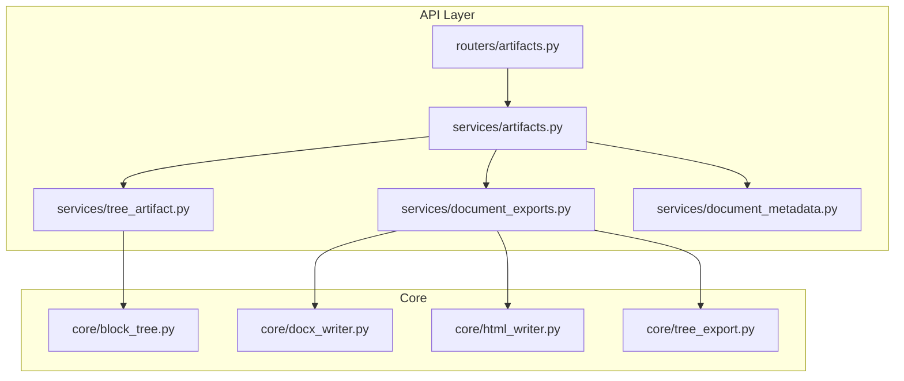
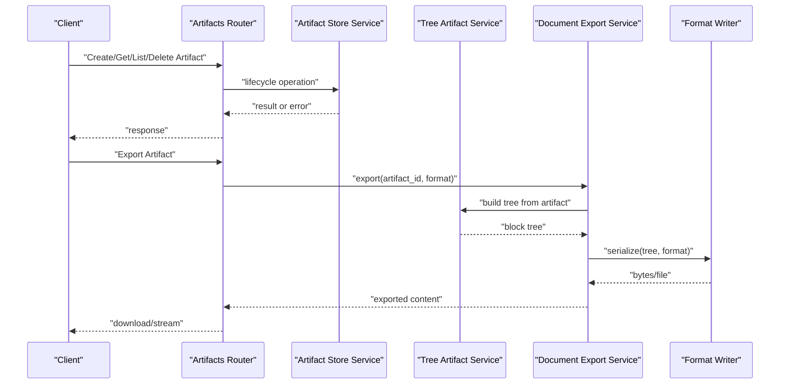
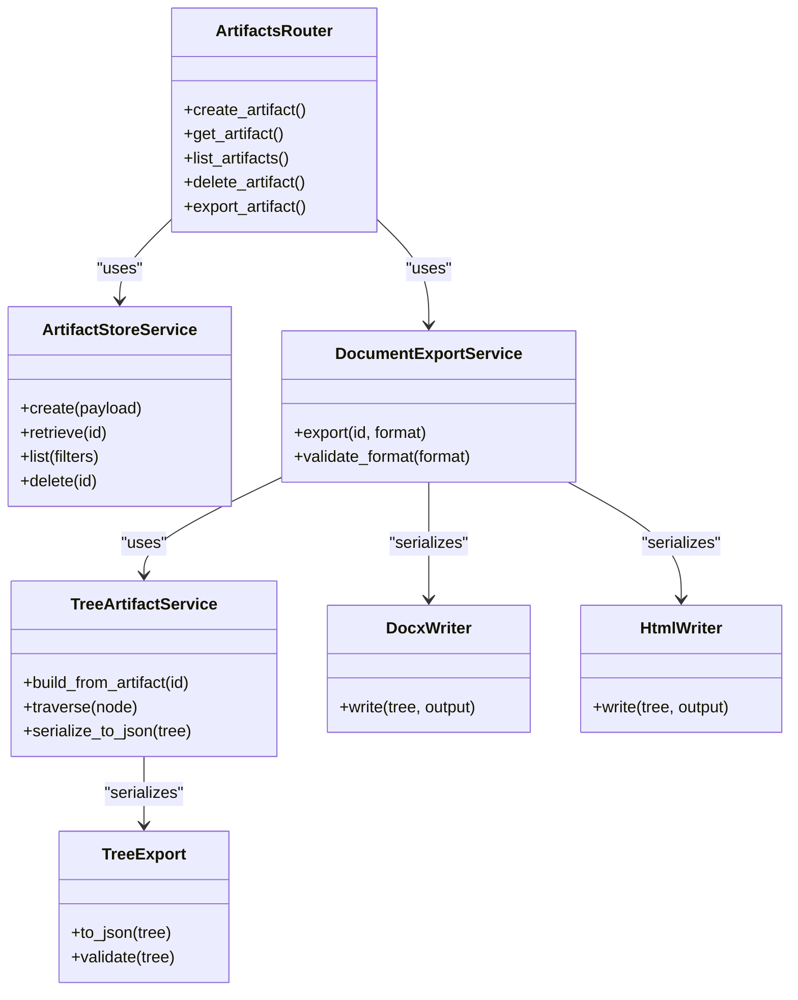

# Storage and Artifacts

<cite>
**Referenced Files in This Document**
- [artifacts.py](file://src/local_deepl/api/routers/artifacts.py)
- [artifacts.py](file://src/local_deepl/api/services/artifacts.py)
- [tree_artifact.py](file://src/local_deepl/api/services/tree_artifact.py)
- [document_exports.py](file://src/local_deepl/api/services/document_exports.py)
- [document_metadata.py](file://src/local_deepl/api/services/document_metadata.py)
- [block_tree.py](file://src/local_deepl/core/block_tree.py)
- [docx_writer.py](file://src/local_deepl/core/docx_writer.py)
- [html_writer.py](file://src/local_deepl/core/html_writer.py)
- [tree_export.py](file://src/local_deepl/core/tree_export.py)
- [test_artifact_store.py](file://tests/test_artifact_store.py)
- [test_tree_artifact_json.py](file://tests/test_tree_artifact_json.py)
</cite>

## Table of Contents
1. [Introduction](#introduction)
2. [Project Structure](#project-structure)
3. [Core Components](#core-components)
4. [Architecture Overview](#architecture-overview)
5. [Detailed Component Analysis](#detailed-component-analysis)
6. [Dependency Analysis](#dependency-analysis)
7. [Performance Considerations](#performance-considerations)
8. [Troubleshooting Guide](#troubleshooting-guide)
9. [Conclusion](#conclusion)
10. [Appendices](#appendices)

## Introduction
This document explains LocalDeepL’s storage and artifact management system with a focus on how processed documents, OCR results, and intermediate files are persisted and accessed. It details the tree artifact system for hierarchical document representation, metadata handling, and export capabilities across DOCX, HTML, JSON, and custom formats. It also covers storage backend configuration, file organization strategies, cleanup policies, and guidance for extending export formats and implementing custom artifact handlers.

## Project Structure
The artifact subsystem spans API routers, services, core writers, and tests:
- API layer exposes endpoints to create, retrieve, list, and delete artifacts and to export documents.
- Services implement artifact lifecycle logic, tree-based document structures, metadata, and export orchestration.
- Core modules provide writers and exporters for specific formats and tree serialization.
- Tests validate behavior and format round-trips.

**Diagram sources**
- [artifacts.py](file://src/local_deepl/api/routers/artifacts.py)
- [artifacts.py](file://src/local_deepl/api/services/artifacts.py)
- [tree_artifact.py](file://src/local_deepl/api/services/tree_artifact.py)
- [document_exports.py](file://src/local_deepl/api/services/document_exports.py)
- [document_metadata.py](file://src/local_deepl/api/services/document_metadata.py)
- [block_tree.py](file://src/local_deepl/core/block_tree.py)
- [docx_writer.py](file://src/local_deepl/core/docx_writer.py)
- [html_writer.py](file://src/local_deepl/core/html_writer.py)
- [tree_export.py](file://src/local_deepl/core/tree_export.py)

**Section sources**
- [artifacts.py](file://src/local_deepl/api/routers/artifacts.py)
- [artifacts.py](file://src/local_deepl/api/services/artifacts.py)
- [tree_artifact.py](file://src/local_deepl/api/services/tree_artifact.py)
- [document_exports.py](file://src/local_deepl/api/services/document_exports.py)
- [document_metadata.py](file://src/local_deepl/api/services/document_metadata.py)
- [block_tree.py](file://src/local_deepl/core/block_tree.py)
- [docx_writer.py](file://src/local_deepl/core/docx_writer.py)
- [html_writer.py](file://src/local_deepl/core/html_writer.py)
- [tree_export.py](file://src/local_deepl/core/tree_export.py)

## Core Components
- Artifact Store Service: Manages creation, retrieval, listing, and deletion of artifacts; coordinates persistence and versioning.
- Tree Artifact Service: Builds and manipulates hierarchical representations of documents using block trees; supports serialization and export.
- Document Export Service: Orchestrates exporting artifacts into multiple formats (DOCX, HTML, JSON, custom).
- Document Metadata Service: Reads/writes structured metadata associated with artifacts and documents.
- Block Tree Core: Provides the data model for hierarchical blocks (sections, paragraphs, tables, images) used by the tree artifact system.
- Writers/Exporters: Concrete implementations for DOCX, HTML, and generic tree export utilities.

Key responsibilities:
- Artifact lifecycle operations with consistent IDs and paths.
- Hierarchical structure modeling via block trees.
- Format-specific serialization through dedicated writers.
- Metadata binding to artifacts for searchability and provenance.

**Section sources**
- [artifacts.py](file://src/local_deepl/api/services/artifacts.py)
- [tree_artifact.py](file://src/local_deepl/api/services/tree_artifact.py)
- [document_exports.py](file://src/local_deepl/api/services/document_exports.py)
- [document_metadata.py](file://src/local_deepl/api/services/document_metadata.py)
- [block_tree.py](file://src/local_deepl/core/block_tree.py)
- [docx_writer.py](file://src/local_deepl/core/docx_writer.py)
- [html_writer.py](file://src/local_deepl/core/html_writer.py)
- [tree_export.py](file://src/local_deepl/core/tree_export.py)

## Architecture Overview
The artifact system is organized as a layered architecture:
- API Router receives requests and delegates to services.
- Services encapsulate business logic and coordinate with core components.
- Core components implement data models and format-specific writers.
- Tests ensure correctness and compatibility across formats.

**Diagram sources**
- [artifacts.py](file://src/local_deepl/api/routers/artifacts.py)
- [artifacts.py](file://src/local_deepl/api/services/artifacts.py)
- [tree_artifact.py](file://src/local_deepl/api/services/tree_artifact.py)
- [document_exports.py](file://src/local_deepl/api/services/document_exports.py)
- [docx_writer.py](file://src/local_deepl/core/docx_writer.py)
- [html_writer.py](file://src/local_deepl/core/html_writer.py)

## Detailed Component Analysis

### Artifact Store Service
Responsibilities:
- Create artifacts with unique identifiers and persistent storage paths.
- Retrieve artifacts by ID or path, including partial reads where supported.
- List artifacts with filters (type, tags, timestamps).
- Delete artifacts and associated files safely.

Typical operations:
- Create: Accepts payload describing artifact type and content; returns artifact metadata and location.
- Retrieve: Returns artifact content or metadata based on request parameters.
- List: Supports pagination and filtering.
- Delete: Removes artifact files and cleans up references.

Error handling:
- Validates input payloads and artifact existence.
- Handles I/O errors and permission issues with clear messages.
- Ensures atomicity where possible during creation/deletion.

**Section sources**
- [artifacts.py](file://src/local_deepl/api/services/artifacts.py)
- [test_artifact_store.py](file://tests/test_artifact_store.py)

### Tree Artifact Service
Responsibilities:
- Build hierarchical block trees from artifacts (OCR results, processed text, layout info).
- Provide methods to traverse, modify, and serialize trees.
- Support conversion between internal block models and external formats.

Data model:
- Root node representing the document.
- Child nodes for sections, paragraphs, tables, images, and other elements.
- Metadata attached to nodes for provenance and processing state.

Operations:
- Build: Construct tree from raw OCR/layout data.
- Traverse: Iterate over nodes with depth-first or breadth-first strategies.
- Serialize: Convert tree to JSON or writer-specific structures.

**Section sources**
- [tree_artifact.py](file://src/local_deepl/api/services/tree_artifact.py)
- [block_tree.py](file://src/local_deepl/core/block_tree.py)
- [test_tree_artifact_json.py](file://tests/test_tree_artifact_json.py)

### Document Export Service
Responsibilities:
- Orchestrate exports to DOCX, HTML, JSON, and custom formats.
- Coordinate tree building and writer invocation.
- Stream large outputs efficiently when needed.

Supported formats:
- DOCX: Uses dedicated writer to produce Office Open XML documents.
- HTML: Generates web-friendly markup with embedded assets if applicable.
- JSON: Serializes tree structure and metadata for programmatic consumption.
- Custom: Extensible interface for specialized formats.

Export flow:
- Validate artifact and requested format.
- Build tree artifact if not already present.
- Invoke appropriate writer to serialize content.
- Return bytes or file handle to client.

**Section sources**
- [document_exports.py](file://src/local_deepl/api/services/document_exports.py)
- [docx_writer.py](file://src/local_deepl/core/docx_writer.py)
- [html_writer.py](file://src/local_deepl/core/html_writer.py)
- [tree_export.py](file://src/local_deepl/core/tree_export.py)

### Document Metadata Service
Responsibilities:
- Read and write metadata associated with artifacts and documents.
- Maintain consistency between artifact content and metadata fields.
- Support queries by metadata keys for discovery and filtering.

Metadata schema:
- Document-level fields (title, author, language, timestamps).
- Processing fields (source, pipeline version, confidence scores).
- Custom fields extensible via key-value pairs.

**Section sources**
- [document_metadata.py](file://src/local_deepl/api/services/document_metadata.py)

### Writers and Export Utilities
- DOCX Writer: Converts block trees into Office-compatible structures, preserving headings, lists, tables, and images.
- HTML Writer: Produces semantic HTML with styling hooks and asset embedding options.
- Tree Export Utilities: Common helpers for serializing block trees to JSON and validating structure.

**Section sources**
- [docx_writer.py](file://src/local_deepl/core/docx_writer.py)
- [html_writer.py](file://src/local_deepl/core/html_writer.py)
- [tree_export.py](file://src/local_deepl/core/tree_export.py)

## Dependency Analysis
The artifact system exhibits clear separation of concerns:
- Routers depend only on service interfaces.
- Services depend on core models and writers.
- Writers are independent and focused on format-specific serialization.
- Tests validate cross-cutting behaviors and format fidelity.

**Diagram sources**
- [artifacts.py](file://src/local_deepl/api/routers/artifacts.py)
- [artifacts.py](file://src/local_deepl/api/services/artifacts.py)
- [tree_artifact.py](file://src/local_deepl/api/services/tree_artifact.py)
- [document_exports.py](file://src/local_deepl/api/services/document_exports.py)
- [docx_writer.py](file://src/local_deepl/core/docx_writer.py)
- [html_writer.py](file://src/local_deepl/core/html_writer.py)
- [tree_export.py](file://src/local_deepl/core/tree_export.py)

**Section sources**
- [artifacts.py](file://src/local_deepl/api/routers/artifacts.py)
- [artifacts.py](file://src/local_deepl/api/services/artifacts.py)
- [tree_artifact.py](file://src/local_deepl/api/services/tree_artifact.py)
- [document_exports.py](file://src/local_deepl/api/services/document_exports.py)
- [docx_writer.py](file://src/local_deepl/core/docx_writer.py)
- [html_writer.py](file://src/local_deepl/core/html_writer.py)
- [tree_export.py](file://src/local_deepl/core/tree_export.py)

## Performance Considerations
- Streaming exports: For large documents, prefer streaming responses to avoid memory spikes.
- Lazy tree construction: Build block trees on-demand rather than eagerly for all artifacts.
- Caching: Cache frequently accessed metadata and small artifacts in memory or disk cache.
- Batch operations: When listing or deleting many artifacts, batch I/O calls to reduce overhead.
- Compression: Consider compressing intermediate files and archived exports to save space.

[No sources needed since this section provides general guidance]

## Troubleshooting Guide
Common issues and resolutions:
- Artifact not found: Verify artifact ID and permissions; check store logs for deletion events.
- Export failure: Ensure required dependencies for the target format are installed; validate tree structure before writing.
- Metadata mismatch: Re-sync metadata after artifact updates; run validation routines.
- Disk space errors: Monitor storage usage; implement cleanup policies to remove temporary files.

Operational checks:
- Confirm storage backend connectivity and quotas.
- Validate file paths and permissions for artifact directories.
- Inspect error logs from writers and export service.

**Section sources**
- [artifacts.py](file://src/local_deepl/api/services/artifacts.py)
- [document_exports.py](file://src/local_deepl/api/services/document_exports.py)
- [document_metadata.py](file://src/local_deepl/api/services/document_metadata.py)

## Conclusion
LocalDeepL’s artifact and storage system provides a robust foundation for managing processed documents, OCR results, and intermediate files. The tree artifact model enables flexible hierarchical representation and powerful export capabilities across multiple formats. By following the outlined architecture and best practices, teams can extend formats, implement custom handlers, and maintain efficient, reliable storage workflows.

[No sources needed since this section summarizes without analyzing specific files]

## Appendices

### Example Operations
- Create an artifact: Submit a payload with artifact type and content; receive metadata and storage path.
- Retrieve an artifact: Use artifact ID to fetch content or metadata; support partial reads where applicable.
- List artifacts: Apply filters such as type, tags, or date ranges; paginate results.
- Delete an artifact: Remove artifact files and clean up references; confirm deletion status.
- Export to DOCX: Request export with format DOCX; receive downloadable file.
- Export to HTML: Request export with format HTML; receive markup suitable for web display.
- Export to JSON: Request export with format JSON; receive serialized tree and metadata.

[No sources needed since this section provides general guidance]

### Storage Backend Configuration
- Configure base storage directory and naming conventions.
- Set retention policies for temporary and archived artifacts.
- Enable compression and encryption at rest if required.
- Define access controls and audit logging for artifact operations.

[No sources needed since this section provides general guidance]

### File Organization Strategies
- Organize artifacts by type and date for easy navigation.
- Separate intermediate files from final exports.
- Use consistent naming schemes for traceability.
- Maintain manifest files for inventory and recovery.

[No sources needed since this section provides general guidance]

### Cleanup Policies
- Implement automated cleanup for expired or unused artifacts.
- Enforce size limits per user or project.
- Archive old artifacts to cold storage.
- Provide manual override for critical artifacts.

[No sources needed since this section provides general guidance]

### Extending Export Formats
- Implement a new writer adhering to the writer interface.
- Register the writer with the export service.
- Add format validation and tests for round-trip fidelity.
- Document supported features and limitations.

[No sources needed since this section provides general guidance]

### Custom Artifact Handlers
- Define handler classes for specialized document types.
- Integrate handlers into the artifact store lifecycle.
- Provide metadata schemas and validation rules.
- Test handlers with representative samples.

[No sources needed since this section provides general guidance]