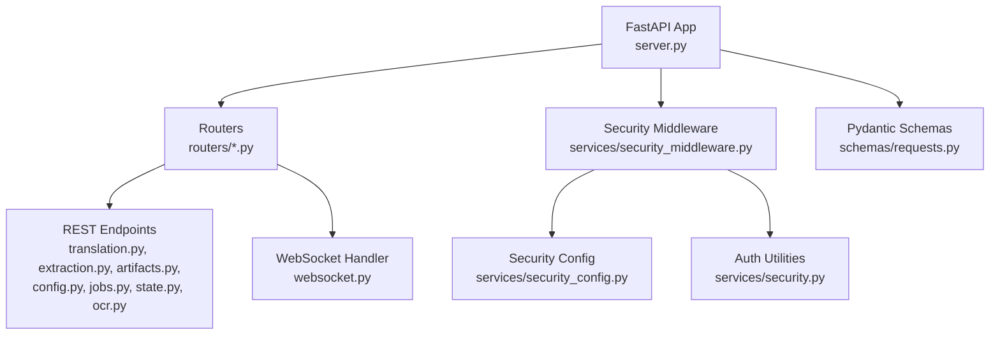
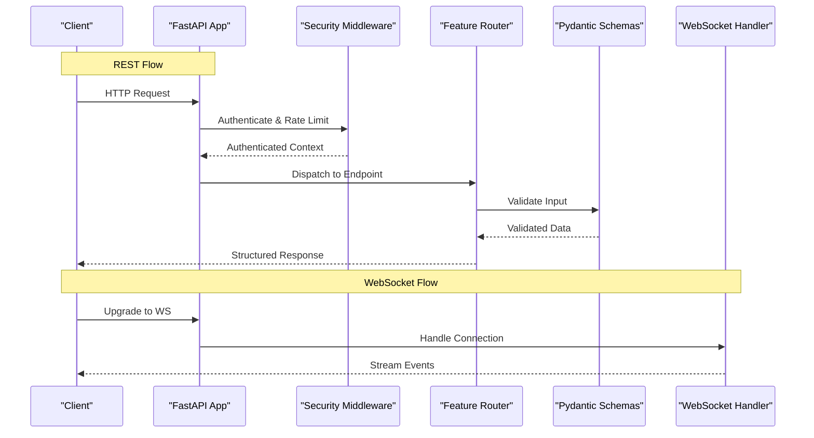
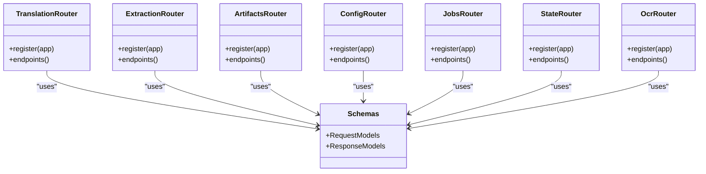
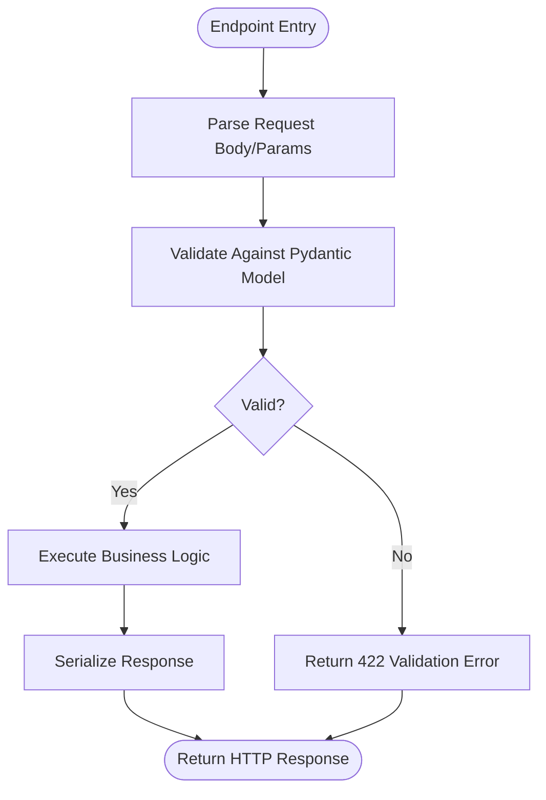
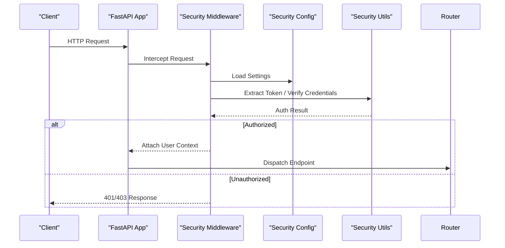
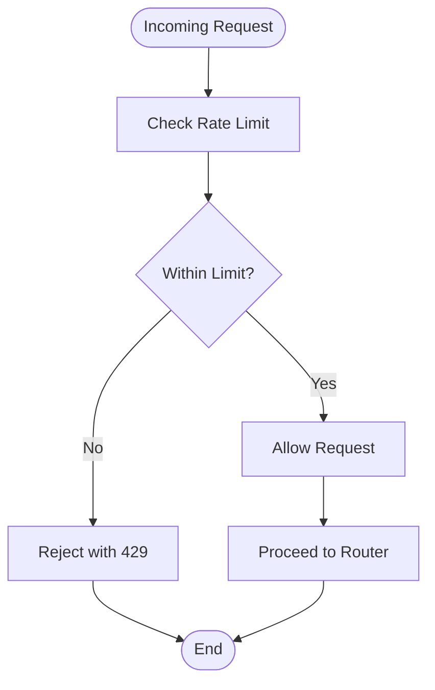
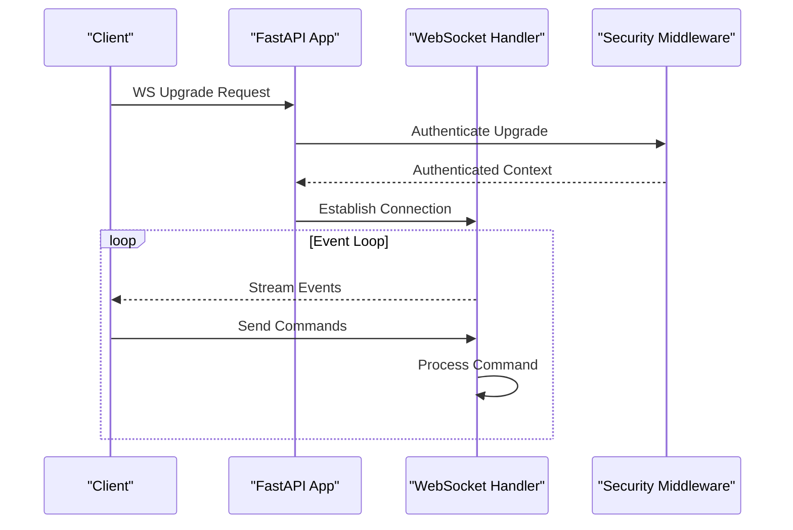
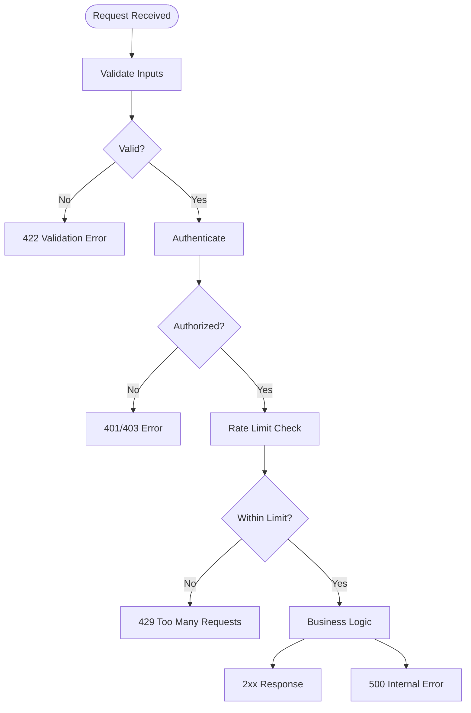
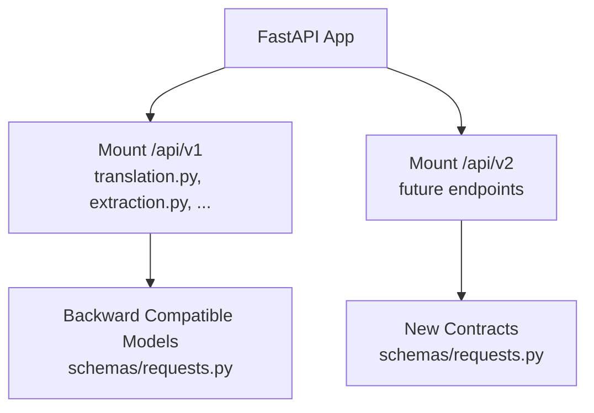
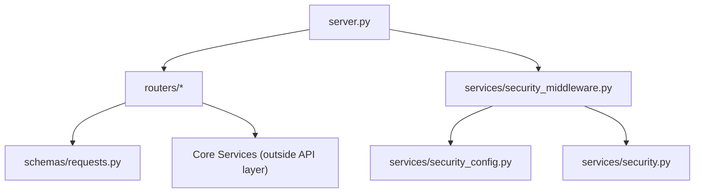

# API Layer Architecture

<cite>
**Referenced Files in This Document**
- [server.py](file://src/local_deepl/server.py)
- [routers/translation.py](file://src/local_deepl/api/routers/translation.py)
- [routers/extraction.py](file://src/local_deepl/api/routers/extraction.py)
- [routers/artifacts.py](file://src/local_deepl/api/routers/artifacts.py)
- [routers/config.py](file://src/local_deepl/api/routers/config.py)
- [routers/jobs.py](file://src/local_deepl/api/routers/jobs.py)
- [routers/state.py](file://src/local_deepl/api/routers/state.py)
- [routers/ocr.py](file://src/local_deepl/api/routers/ocr.py)
- [routers/websocket.py](file://src/local_deepl/api/routers/websocket.py)
- [schemas/requests.py](file://src/local_deepl/api/schemas/requests.py)
- [services/security_middleware.py](file://src/local_deepl/api/services/security_middleware.py)
- [services/security_config.py](file://src/local_deepl/api/services/security_config.py)
- [services/security.py](file://src/local_deepl/api/services/security.py)
</cite>

## Table of Contents
1. [Introduction](#introduction)
2. [Project Structure](#project-structure)
3. [Core Components](#core-components)
4. [Architecture Overview](#architecture-overview)
5. [Detailed Component Analysis](#detailed-component-analysis)
6. [Dependency Analysis](#dependency-analysis)
7. [Performance Considerations](#performance-considerations)
8. [Troubleshooting Guide](#troubleshooting-guide)
9. [Conclusion](#conclusion)

## Introduction
This document describes the API layer architecture of LocalDeepL, focusing on the FastAPI router structure, request/response handling patterns, and endpoint organization. It explains how REST endpoints are separated from WebSocket handlers, how Pydantic schemas are used for validation, and how errors and responses are formatted. It also covers authentication middleware integration, rate limiting implementation, security considerations, and the API versioning strategy with backward compatibility approaches.

## Project Structure
The API layer is organized under src/local_deepl/api:
- routers: Feature-based route modules (translation, extraction, artifacts, config, jobs, state, ocr, websocket).
- schemas: Pydantic models for request/response validation.
- services: Cross-cutting concerns including security middleware, configuration, and utilities.
- server.py: Application factory and wiring of routers, middleware, and lifecycle hooks.

**Diagram sources**
- [server.py](file://src/local_deepl/server.py)
- [routers/translation.py](file://src/local_deepl/api/routers/translation.py)
- [routers/extraction.py](file://src/local_deepl/api/routers/extraction.py)
- [routers/artifacts.py](file://src/local_deepl/api/routers/artifacts.py)
- [routers/config.py](file://src/local_deepl/api/routers/config.py)
- [routers/jobs.py](file://src/local_deepl/api/routers/jobs.py)
- [routers/state.py](file://src/local_deepl/api/routers/state.py)
- [routers/ocr.py](file://src/local_deepl/api/routers/ocr.py)
- [routers/websocket.py](file://src/local_deepl/api/routers/websocket.py)
- [services/security_middleware.py](file://src/local_deepl/api/services/security_middleware.py)
- [services/security_config.py](file://src/local_deepl/api/services/security_config.py)
- [services/security.py](file://src/local_deepl/api/services/security.py)
- [schemas/requests.py](file://src/local_deepl/api/schemas/requests.py)

**Section sources**
- [server.py](file://src/local_deepl/server.py)

## Core Components
- Router modules encapsulate feature-specific endpoints. Each module defines a FastAPI APIRouter and mounts it to the main app.
- Request validation uses Pydantic models defined in schemas/requests.py. These models are referenced by endpoint signatures and path/query parameters.
- Security middleware provides authentication checks and optional rate limiting before requests reach routers.
- WebSocket handler implements real-time communication separate from REST endpoints.

Key responsibilities:
- Routers: Define HTTP methods, validate inputs via Pydantic, orchestrate business logic, and return structured responses.
- Services: Provide reusable functionality such as security checks, configuration access, and shared utilities.
- Schemas: Centralize data contracts for requests and responses.

**Section sources**
- [routers/translation.py](file://src/local_deepl/api/routers/translation.py)
- [routers/extraction.py](file://src/local_deepl/api/routers/extraction.py)
- [routers/artifacts.py](file://src/local_deepl/api/routers/artifacts.py)
- [routers/config.py](file://src/local_deepl/api/routers/config.py)
- [routers/jobs.py](file://src/local_deepl/api/routers/jobs.py)
- [routers/state.py](file://src/local_deepl/api/routers/state.py)
- [routers/ocr.py](file://src/local_deepl/api/routers/ocr.py)
- [routers/websocket.py](file://src/local_deepl/api/routers/websocket.py)
- [schemas/requests.py](file://src/local_deepl/api/schemas/requests.py)
- [services/security_middleware.py](file://src/local_deepl/api/services/security_middleware.py)
- [services/security_config.py](file://src/local_deepl/api/services/security_config.py)
- [services/security.py](file://src/local_deepl/api/services/security.py)

## Architecture Overview
The API layer follows a layered approach:
- FastAPI application wires routers and middleware.
- Security middleware intercepts requests for authentication and rate limiting.
- Routers handle REST endpoints; a dedicated WebSocket router handles streaming events.
- Pydantic schemas enforce request/response contracts.

**Diagram sources**
- [server.py](file://src/local_deepl/server.py)
- [services/security_middleware.py](file://src/local_deepl/api/services/security_middleware.py)
- [routers/translation.py](file://src/local_deepl/api/routers/translation.py)
- [routers/websocket.py](file://src/local_deepl/api/routers/websocket.py)
- [schemas/requests.py](file://src/local_deepl/api/schemas/requests.py)

## Detailed Component Analysis

### REST Router Organization
Each feature has its own router module:
- translation.py: Translation-related endpoints.
- extraction.py: Extraction-related endpoints.
- artifacts.py: Artifact management endpoints.
- config.py: Configuration endpoints.
- jobs.py: Job lifecycle endpoints.
- state.py: State inspection endpoints.
- ocr.py: OCR pipeline endpoints.

Patterns:
- Endpoints declare typed parameters using Pydantic models from schemas/requests.py.
- Responses are returned as standard Python types or Pydantic models, allowing FastAPI to serialize them consistently.
- Error paths raise exceptions that map to standardized HTTP error codes.

**Diagram sources**
- [routers/translation.py](file://src/local_deepl/api/routers/translation.py)
- [routers/extraction.py](file://src/local_deepl/api/routers/extraction.py)
- [routers/artifacts.py](file://src/local_deepl/api/routers/artifacts.py)
- [routers/config.py](file://src/local_deepl/api/routers/config.py)
- [routers/jobs.py](file://src/local_deepl/api/routers/jobs.py)
- [routers/state.py](file://src/local_deepl/api/routers/state.py)
- [routers/ocr.py](file://src/local_deepl/api/routers/ocr.py)
- [schemas/requests.py](file://src/local_deepl/api/schemas/requests.py)

**Section sources**
- [routers/translation.py](file://src/local_deepl/api/routers/translation.py)
- [routers/extraction.py](file://src/local_deepl/api/routers/extraction.py)
- [routers/artifacts.py](file://src/local_deepl/api/routers/artifacts.py)
- [routers/config.py](file://src/local_deepl/api/routers/config.py)
- [routers/jobs.py](file://src/local_deepl/api/routers/jobs.py)
- [routers/state.py](file://src/local_deepl/api/routers/state.py)
- [routers/ocr.py](file://src/local_deepl/api/routers/ocr.py)
- [schemas/requests.py](file://src/local_deepl/api/schemas/requests.py)

### Request Validation with Pydantic Schemas
- All request bodies, path parameters, and query parameters are validated against Pydantic models in schemas/requests.py.
- Validation errors produce consistent HTTP 422 responses with detailed field-level messages.
- Optional fields and defaults are declared within models to support flexible APIs.

**Diagram sources**
- [schemas/requests.py](file://src/local_deepl/api/schemas/requests.py)
- [routers/translation.py](file://src/local_deepl/api/routers/translation.py)

**Section sources**
- [schemas/requests.py](file://src/local_deepl/api/schemas/requests.py)

### Authentication Middleware Integration
- The security middleware wraps requests to perform authentication checks before routing.
- It integrates with security configuration and utilities to extract tokens, verify credentials, and attach user context to the request.
- Unauthorized requests receive standardized HTTP 401/403 responses.

**Diagram sources**
- [services/security_middleware.py](file://src/local_deepl/api/services/security_middleware.py)
- [services/security_config.py](file://src/local_deepl/api/services/security_config.py)
- [services/security.py](file://src/local_deepl/api/services/security.py)

**Section sources**
- [services/security_middleware.py](file://src/local_deepl/api/services/security_middleware.py)
- [services/security_config.py](file://src/local_deepl/api/services/security_config.py)
- [services/security.py](file://src/local_deepl/api/services/security.py)

### Rate Limiting Implementation
- Rate limiting is implemented within the security middleware to throttle requests per client or IP.
- Limits can be configured via security configuration and applied globally or per-endpoint.
- Exceeded limits result in HTTP 429 responses with retry guidance.

**Diagram sources**
- [services/security_middleware.py](file://src/local_deepl/api/services/security_middleware.py)
- [services/security_config.py](file://src/local_deepl/api/services/security_config.py)

**Section sources**
- [services/security_middleware.py](file://src/local_deepl/api/services/security_middleware.py)
- [services/security_config.py](file://src/local_deepl/api/services/security_config.py)

### WebSocket Handlers
- WebSocket endpoints are isolated in a dedicated router to manage real-time connections.
- The handler manages connection lifecycle, message parsing, and event streaming.
- Authentication and authorization can be enforced at connection upgrade time.

**Diagram sources**
- [routers/websocket.py](file://src/local_deepl/api/routers/websocket.py)
- [services/security_middleware.py](file://src/local_deepl/api/services/security_middleware.py)

**Section sources**
- [routers/websocket.py](file://src/local_deepl/api/routers/websocket.py)

### Error Handling Strategies
- Validation errors: HTTP 422 with detailed field errors from Pydantic.
- Authentication failures: HTTP 401/403 from security middleware.
- Rate limit exceeded: HTTP 429 with retry-after guidance.
- Internal errors: HTTP 500 with sanitized messages; logs include stack traces for debugging.

**Diagram sources**
- [services/security_middleware.py](file://src/local_deepl/api/services/security_middleware.py)
- [schemas/requests.py](file://src/local_deepl/api/schemas/requests.py)

**Section sources**
- [services/security_middleware.py](file://src/local_deepl/api/services/security_middleware.py)
- [schemas/requests.py](file://src/local_deepl/api/schemas/requests.py)

### Response Formatting
- Responses are serialized automatically by FastAPI based on return types and Pydantic models.
- Consistent envelope structures can be enforced via response models or custom encoders if needed.
- Content-Type headers are set appropriately for JSON and file downloads.

**Section sources**
- [routers/translation.py](file://src/local_deepl/api/routers/translation.py)
- [routers/artifacts.py](file://src/local_deepl/api/routers/artifacts.py)
- [schemas/requests.py](file://src/local_deepl/api/schemas/requests.py)

### API Versioning Strategy and Backward Compatibility
- Versioning is managed by mounting routers under a versioned prefix (for example, /api/v1) in the application factory.
- Backward compatibility is maintained by:
  - Keeping deprecated endpoints available during transition periods.
  - Using Pydantic models with optional fields and defaults to accept legacy payloads.
  - Returning deprecation warnings in response headers when clients use older versions.
- Migration guides should document changes between major versions.

**Diagram sources**
- [server.py](file://src/local_deepl/server.py)
- [routers/translation.py](file://src/local_deepl/api/routers/translation.py)
- [schemas/requests.py](file://src/local_deepl/api/schemas/requests.py)

**Section sources**
- [server.py](file://src/local_deepl/server.py)

## Dependency Analysis
The API layer dependencies are centered around FastAPI, Pydantic, and the security middleware. Routers depend on schemas for validation and may call into core services for business logic.

**Diagram sources**
- [server.py](file://src/local_deepl/server.py)
- [routers/translation.py](file://src/local_deepl/api/routers/translation.py)
- [schemas/requests.py](file://src/local_deepl/api/schemas/requests.py)
- [services/security_middleware.py](file://src/local_deepl/api/services/security_middleware.py)
- [services/security_config.py](file://src/local_deepl/api/services/security_config.py)
- [services/security.py](file://src/local_deepl/api/services/security.py)

**Section sources**
- [server.py](file://src/local_deepl/server.py)
- [routers/translation.py](file://src/local_deepl/api/routers/translation.py)
- [schemas/requests.py](file://src/local_deepl/api/schemas/requests.py)
- [services/security_middleware.py](file://src/local_deepl/api/services/security_middleware.py)
- [services/security_config.py](file://src/local_deepl/api/services/security_config.py)
- [services/security.py](file://src/local_deepl/api/services/security.py)

## Performance Considerations
- Use streaming responses for large outputs (for example, artifact downloads) to reduce memory pressure.
- Apply rate limiting to protect backend resources and ensure fair usage.
- Cache frequently accessed configuration and static data where appropriate.
- Avoid heavy synchronous operations in request handlers; offload long-running tasks to background workers.

[No sources needed since this section provides general guidance]

## Troubleshooting Guide
Common issues and resolutions:
- Validation errors (422): Inspect request payload against Pydantic models in schemas/requests.py. Ensure required fields are present and types match.
- Authentication failures (401/403): Verify token presence and correctness; check security middleware configuration and secrets.
- Rate limit exceeded (429): Reduce request frequency or adjust limits in security configuration.
- WebSocket disconnects: Confirm authentication at upgrade time and network stability; review event stream logic in websocket.py.

**Section sources**
- [services/security_middleware.py](file://src/local_deepl/api/services/security_middleware.py)
- [services/security_config.py](file://src/local_deepl/api/services/security_config.py)
- [routers/websocket.py](file://src/local_deepl/api/routers/websocket.py)
- [schemas/requests.py](file://src/local_deepl/api/schemas/requests.py)

## Conclusion
LocalDeepL’s API layer is organized around feature-based routers, strict request validation via Pydantic, and a centralized security middleware for authentication and rate limiting. REST endpoints and WebSocket handlers are clearly separated, and versioning is achieved through mounted prefixes. The design emphasizes consistency, security, and maintainability while supporting backward compatibility across API versions.