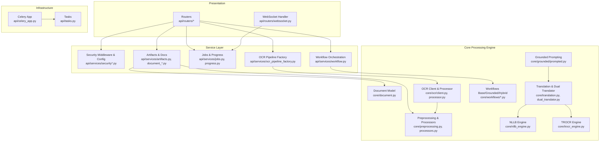
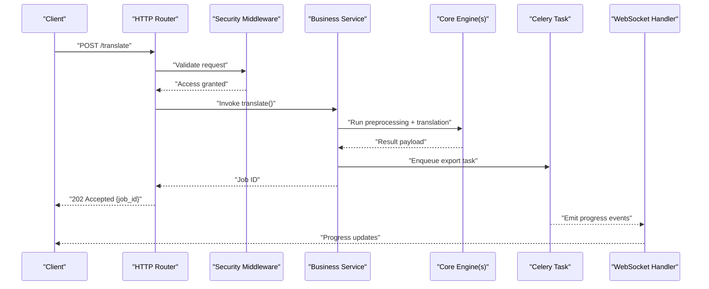
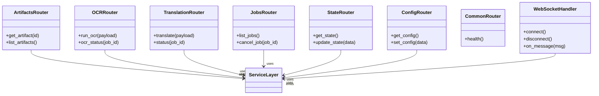
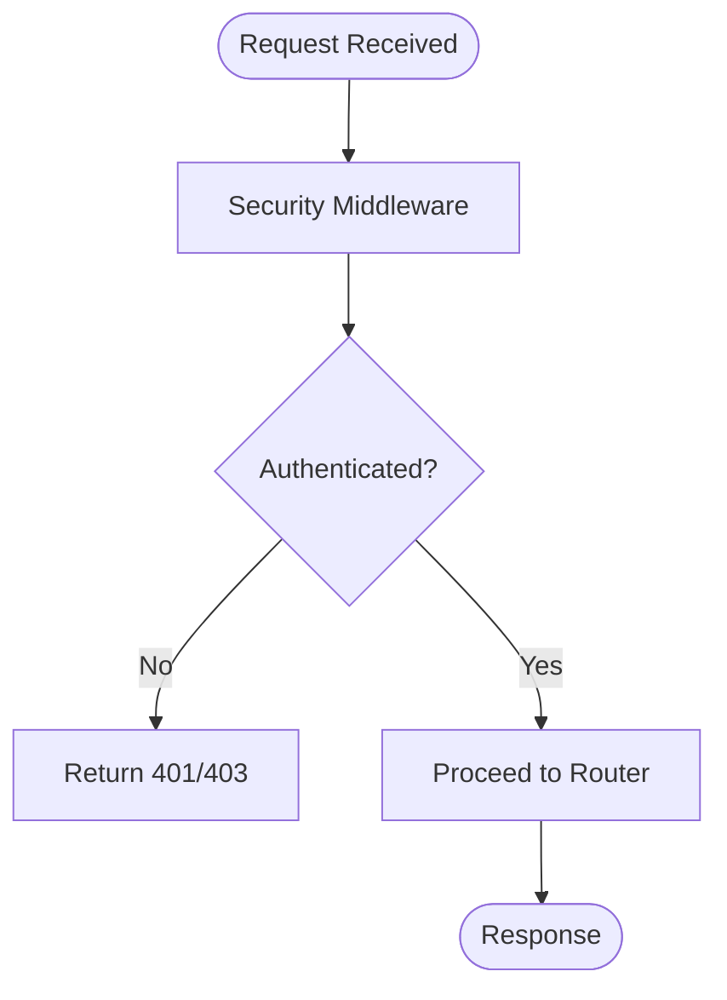
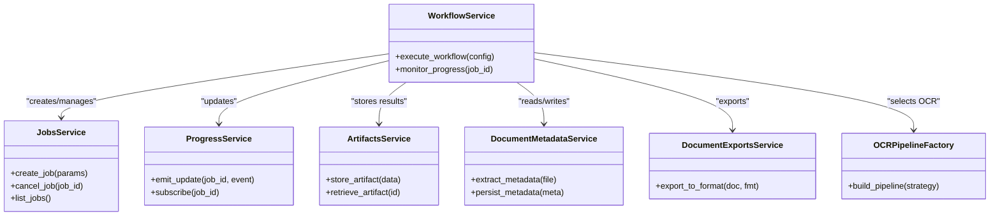
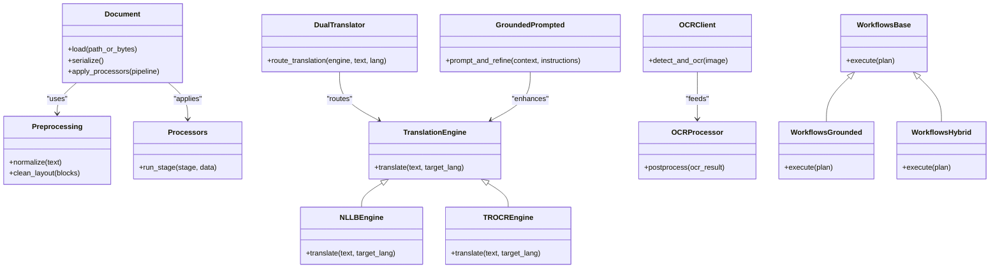
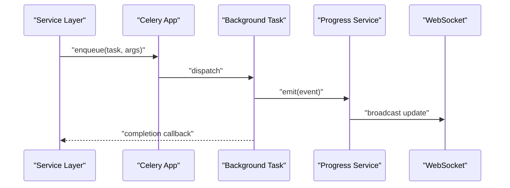
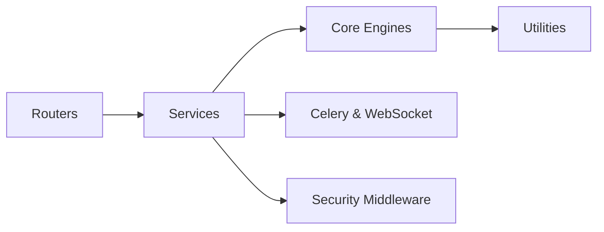

# Component Architecture

<cite>
**Referenced Files in This Document**
- [server.py](file://src/omniscribe/server.py)
- [celery_app.py](file://src/omniscribe/api/celery_app.py)
- [tasks.py](file://src/omniscribe/api/tasks.py)
- [routers/artifacts.py](file://src/omniscribe/api/routers/artifacts.py)
- [routers/common.py](file://src/omniscribe/api/routers/common.py)
- [routers/config.py](file://src/omniscribe/api/routers/config.py)
- [routers/extraction.py](file://src/omniscribe/api/routers/extraction.py)
- [routers/jobs.py](file://src/omniscribe/api/routers/jobs.py)
- [routers/ocr.py](file://src/omniscribe/api/routers/ocr.py)
- [routers/state.py](file://src/omniscribe/api/routers/state.py)
- [routers/translation.py](file://src/omniscribe/api/routers/translation.py)
- [routers/websocket.py](file://src/omniscribe/api/routers/websocket.py)
- [services/security_middleware.py](file://src/omniscribe/api/services/security_middleware.py)
- [services/security_config.py](file://src/omniscribe/api/services/security_config.py)
- [services/security.py](file://src/omniscribe/api/services/security.py)
- [services/workflow.py](file://src/omniscribe/api/services/workflow.py)
- [services/document_metadata.py](file://src/omniscribe/api/services/document_metadata.py)
- [services/document_exports.py](file://src/omniscribe/api/services/document_exports.py)
- [services/artifacts.py](file://src/omniscribe/api/services/artifacts.py)
- [services/jobs.py](file://src/omniscribe/api/services/jobs.py)
- [services/progress.py](file://src/omniscribe/api/services/progress.py)
- [services/ocr_pipeline_factory.py](file://src/omniscribe/api/services/ocr_pipeline_factory.py)
- [services/ocr_response.py](file://src/omniscribe/api/services/ocr_response.py)
- [services/ocr_settings.py](file://src/omniscribe/api/services/ocr_settings.py)
- [core/__init__.py](file://src/omniscribe/core/__init__.py)
- [core/document.py](file://src/omniscribe/core/document.py)
- [core/preprocessing.py](file://src/omniscribe/core/preprocessing.py)
- [core/processors.py](file://src/omniscribe/core/processors.py)
- [core/translation.py](file://src/omniscribe/core/translation.py)
- [core/dual_translator.py](file://src/omniscribe/core/dual_translator.py)
- [core/nllb_engine.py](file://src/omniscribe/core/nllb_engine.py)
- [core/trocr_engine.py](file://src/omniscribe/core/trocr_engine.py)
- [core/ocr/client.py](file://src/omniscribe/core/ocr/client.py)
- [core/ocr/processor.py](file://src/omniscribe/core/ocr/processor.py)
- [core/grounded/prompted.py](file://src/omniscribe/core/grounded/prompted.py)
- [core/workflows/base.py](file://src/omniscribe/core/workflows/base.py)
- [core/workflows/grounded.py](file://src/omniscribe/core/workflows/grounded.py)
- [core/workflows/hybrid.py](file://src/omniscribe/core/workflows/hybrid.py)
- [utils/security.py](file://src/omniscribe/utils/security.py)
</cite>

## Update Summary
**Changes Made**
- Updated all file paths from `src/local_deepl/` to `src/omniscribe/` throughout the document
- Updated all import references and module paths to reflect the new directory structure
- Maintained all architectural descriptions and component relationships unchanged
- Updated diagram sources to reference the new `src/omniscribe/` paths

## Table of Contents
1. [Introduction](#introduction)
2. [Project Structure](#project-structure)
3. [Core Components](#core-components)
4. [Architecture Overview](#architecture-overview)
5. [Detailed Component Analysis](#detailed-component-analysis)
6. [Dependency Analysis](#dependency-analysis)
7. [Performance Considerations](#performance-considerations)
8. [Troubleshooting Guide](#troubleshooting-guide)
9. [Conclusion](#conclusion)

## Introduction
This document describes LocalDeepL's component architecture with a focus on the layered pattern: API routers, service layer, core processing engine, and infrastructure components. It explains how presentation (API), business logic (services), data access (core engines and utilities), and cross-cutting concerns (security middleware, logging, error handling) interact. It also provides diagrams for component interactions and data flows, and clarifies dependency injection patterns and service boundaries.

**Updated** All component paths have been migrated from `src/local_deepl/` to `src/omniscribe/` to reflect the complete directory structure migration.

## Project Structure
LocalDeepL is organized into clear layers:
- Presentation/API: FastAPI routers under api/routers, request/response schemas, and WebSocket handlers.
- Service Layer: Business orchestration and integration points under api/services.
- Core Processing Engine: Domain logic for documents, OCR, translation, grounding, and workflows under core.
- Infrastructure: Celery app and tasks for background jobs, static assets, and utilities.

**Diagram sources**
- [server.py:1-200](file://src/omniscribe/server.py#L1-L200)
- [routers/artifacts.py:1-200](file://src/omniscribe/api/routers/artifacts.py#L1-L200)
- [routers/ocr.py:1-200](file://src/omniscribe/api/routers/ocr.py#L1-L200)
- [routers/translation.py:1-200](file://src/omniscribe/api/routers/translation.py#L1-L200)
- [routers/websocket.py:1-200](file://src/omniscribe/api/routers/websocket.py#L1-L200)
- [services/security_middleware.py:1-200](file://src/omniscribe/api/services/security_middleware.py#L1-L200)
- [services/workflow.py:1-200](file://src/omniscribe/api/services/workflow.py#L1-L200)
- [services/jobs.py:1-200](file://src/omniscribe/api/services/jobs.py#L1-L200)
- [services/progress.py:1-200](file://src/omniscribe/api/services/progress.py#L1-L200)
- [services/artifacts.py:1-200](file://src/omniscribe/api/services/artifacts.py#L1-L200)
- [services/ocr_pipeline_factory.py:1-200](file://src/omniscribe/api/services/ocr_pipeline_factory.py#L1-L200)
- [core/document.py:1-200](file://src/omniscribe/core/document.py#L1-L200)
- [core/preprocessing.py:1-200](file://src/omniscribe/core/preprocessing.py#L1-L200)
- [core/processors.py:1-200](file://src/omniscribe/core/processors.py#L1-L200)
- [core/translation.py:1-200](file://src/omniscribe/core/translation.py#L1-L200)
- [core/dual_translator.py:1-200](file://src/omniscribe/core/dual_translator.py#L1-L200)
- [core/nllb_engine.py:1-200](file://src/omniscribe/core/nllb_engine.py#L1-L200)
- [core/trocr_engine.py:1-200](file://src/omniscribe/core/trocr_engine.py#L1-L200)
- [core/ocr/client.py:1-200](file://src/omniscribe/core/ocr/client.py#L1-L200)
- [core/ocr/processor.py:1-200](file://src/omniscribe/core/ocr/processor.py#L1-L200)
- [core/grounded/prompted.py:1-200](file://src/omniscribe/core/grounded/prompted.py#L1-L200)
- [core/workflows/base.py:1-200](file://src/omniscribe/core/workflows/base.py#L1-L200)
- [core/workflows/grounded.py:1-200](file://src/omniscribe/core/workflows/grounded.py#L1-L200)
- [core/workflows/hybrid.py:1-200](file://src/omniscribe/core/workflows/hybrid.py#L1-L200)
- [celery_app.py:1-200](file://src/omniscribe/api/celery_app.py#L1-L200)
- [tasks.py:1-200](file://src/omniscribe/api/tasks.py#L1-L200)

**Section sources**
- [server.py:1-200](file://src/omniscribe/server.py#L1-L200)

## Core Components
- API Routers: Define HTTP endpoints for artifacts, configuration, extraction, jobs, OCR, state, translation, and WebSocket events. They validate requests via Pydantic schemas and delegate to services.
- Security Middleware: Enforces security policies at the application level, including authentication and authorization checks before routes execute.
- Services: Implement business orchestration, coordinate core engines, manage job lifecycles, progress tracking, artifact storage, and OCR pipeline selection.
- Core Engines: Provide domain-specific capabilities such as document modeling, preprocessing, OCR client/processor, translation engines (NLLB, TROCR), grounded prompting, and workflow composition.
- Infrastructure: Celery app and tasks handle long-running or asynchronous work; WebSocket handler streams progress updates.

Key responsibilities by layer:
- Presentation: Request validation, response serialization, routing, real-time updates.
- Business Logic: Workflow orchestration, policy enforcement, job management, artifact coordination.
- Data Access/Core: Document I/O, OCR execution, translation inference, grounding prompts, tree/export utilities.
- Cross-Cutting: Security middleware, logging, error handling, progress reporting.

**Updated** All component paths now reference `src/omniscribe/` instead of `src/local_deepl/`.

**Section sources**
- [routers/artifacts.py:1-200](file://src/omniscribe/api/routers/artifacts.py#L1-L200)
- [routers/ocr.py:1-200](file://src/omniscribe/api/routers/ocr.py#L1-L200)
- [routers/translation.py:1-200](file://src/omniscribe/api/routers/translation.py#L1-L200)
- [services/security_middleware.py:1-200](file://src/omniscribe/api/services/security_middleware.py#L1-L200)
- [services/workflow.py:1-200](file://src/omniscribe/api/services/workflow.py#L1-L200)
- [services/jobs.py:1-200](file://src/omniscribe/api/services/jobs.py#L1-L200)
- [services/progress.py:1-200](file://src/omniscribe/api/services/progress.py#L1-L200)
- [core/document.py:1-200](file://src/omniscribe/core/document.py#L1-L200)
- [core/ocr/client.py:1-200](file://src/omniscribe/core/ocr/client.py#L1-L200)
- [core/ocr/processor.py:1-200](file://src/omniscribe/core/ocr/processor.py#L1-L200)
- [core/translation.py:1-200](file://src/omniscribe/core/translation.py#L1-L200)
- [core/dual_translator.py:1-200](file://src/omniscribe/core/dual_translator.py#L1-L200)
- [core/nllb_engine.py:1-200](file://src/omniscribe/core/nllb_engine.py#L1-L200)
- [core/trocr_engine.py:1-200](file://src/omniscribe/core/trocr_engine.py#L1-L200)
- [core/grounded/prompted.py:1-200](file://src/omniscribe/core/grounded/prompted.py#L1-L200)
- [celery_app.py:1-200](file://src/omniscribe/api/celery_app.py#L1-L200)
- [tasks.py:1-200](file://src/omniscribe/api/tasks.py#L1-L200)

## Architecture Overview
The system follows a layered architecture:
- Presentation Layer: Routers receive HTTP/WebSocket requests, perform input validation, and call services.
- Service Layer: Orchestrates workflows, manages jobs and progress, and delegates to core engines.
- Core Layer: Encapsulates document processing, OCR, translation, and grounding logic.
- Infrastructure: Background workers (Celery) and real-time channels (WebSocket) support async operations and live updates.

**Diagram sources**
- [routers/translation.py:1-200](file://src/omniscribe/api/routers/translation.py#L1-L200)
- [services/security_middleware.py:1-200](file://src/omniscribe/api/services/security_middleware.py#L1-L200)
- [services/workflow.py:1-200](file://src/omniscribe/api/services/workflow.py#L1-L200)
- [core/translation.py:1-200](file://src/omniscribe/core/translation.py#L1-L200)
- [celery_app.py:1-200](file://src/omniscribe/api/celery_app.py#L1-L200)
- [tasks.py:1-200](file://src/omniscribe/api/tasks.py#L1-L200)
- [routers/websocket.py:1-200](file://src/omniscribe/api/routers/websocket.py#L1-L200)

## Detailed Component Analysis

### API Routers Layer
Responsibilities:
- Expose REST endpoints for artifacts, config, extraction, jobs, OCR, state, and translation.
- Validate inputs using Pydantic schemas and serialize responses.
- Delegate to services for business logic and return appropriate status codes.

Interactions:
- All routers pass through security middleware for authentication/authorization.
- Routers may enqueue background tasks via Celery and return job identifiers.
- WebSocket router emits progress updates tied to job IDs.

**Diagram sources**
- [routers/artifacts.py:1-200](file://src/omniscribe/api/routers/artifacts.py#L1-L200)
- [routers/ocr.py:1-200](file://src/omniscribe/api/routers/ocr.py#L1-L200)
- [routers/translation.py:1-200](file://src/omniscribe/api/routers/translation.py#L1-L200)
- [routers/jobs.py:1-200](file://src/omniscribe/api/routers/jobs.py#L1-L200)
- [routers/state.py:1-200](file://src/omniscribe/api/routers/state.py#L1-L200)
- [routers/config.py:1-200](file://src/omniscribe/api/routers/config.py#L1-L200)
- [routers/common.py:1-200](file://src/omniscribe/api/routers/common.py#L1-L200)
- [routers/websocket.py:1-200](file://src/omniscribe/api/routers/websocket.py#L1-L200)

**Section sources**
- [routers/artifacts.py:1-200](file://src/omniscribe/api/routers/artifacts.py#L1-L200)
- [routers/ocr.py:1-200](file://src/omniscribe/api/routers/ocr.py#L1-L200)
- [routers/translation.py:1-200](file://src/omniscribe/api/routers/translation.py#L1-L200)
- [routers/jobs.py:1-200](file://src/omniscribe/api/routers/jobs.py#L1-L200)
- [routers/state.py:1-200](file://src/omniscribe/api/routers/state.py#L1-L200)
- [routers/config.py:1-200](file://src/omniscribe/api/routers/config.py#L1-L200)
- [routers/common.py:1-200](file://src/omniscribe/api/routers/common.py#L1-L200)
- [routers/websocket.py:1-200](file://src/omniscribe/api/routers/websocket.py#L1-L200)

### Security Middleware and Configuration
Responsibilities:
- Enforce authentication and authorization across all routes.
- Centralize security configuration and policies.
- Provide reusable security utilities for services and routers.

Integration Points:
- Applied globally at application startup.
- Used by routers to gate access to sensitive endpoints.
- Consumed by services for fine-grained checks when needed.

**Diagram sources**
- [services/security_middleware.py:1-200](file://src/omniscribe/api/services/security_middleware.py#L1-L200)
- [services/security_config.py:1-200](file://src/omniscribe/api/services/security_config.py#L1-L200)
- [services/security.py:1-200](file://src/omniscribe/api/services/security.py#L1-L200)
- [utils/security.py:1-200](file://src/omniscribe/utils/security.py#L1-L200)

**Section sources**
- [services/security_middleware.py:1-200](file://src/omniscribe/api/services/security_middleware.py#L1-L200)
- [services/security_config.py:1-200](file://src/omniscribe/api/services/security_config.py#L1-L200)
- [services/security.py:1-200](file://src/omniscribe/api/services/security.py#L1-L200)
- [utils/security.py:1-200](file://src/omniscribe/utils/security.py#L1-L200)

### Service Layer Orchestration
Responsibilities:
- Coordinate workflows, job lifecycle, progress tracking, artifacts, and OCR pipeline selection.
- Maintain clear boundaries between business logic and core processing.
- Provide dependency injection points for testability and extensibility.

Key Services:
- Workflow service orchestrates high-level processes.
- Jobs and progress services manage background tasks and event emission.
- Artifacts and document services handle persistence and exports.
- OCR pipeline factory selects and configures OCR strategies.

**Diagram sources**
- [services/workflow.py:1-200](file://src/omniscribe/api/services/workflow.py#L1-L200)
- [services/jobs.py:1-200](file://src/omniscribe/api/services/jobs.py#L1-L200)
- [services/progress.py:1-200](file://src/omniscribe/api/services/progress.py#L1-L200)
- [services/artifacts.py:1-200](file://src/omniscribe/api/services/artifacts.py#L1-L200)
- [services/document_metadata.py:1-200](file://src/omniscribe/api/services/document_metadata.py#L1-L200)
- [services/document_exports.py:1-200](file://src/omniscribe/api/services/document_exports.py#L1-L200)
- [services/ocr_pipeline_factory.py:1-200](file://src/omniscribe/api/services/ocr_pipeline_factory.py#L1-L200)

**Section sources**
- [services/workflow.py:1-200](file://src/omniscribe/api/services/workflow.py#L1-L200)
- [services/jobs.py:1-200](file://src/omniscribe/api/services/jobs.py#L1-L200)
- [services/progress.py:1-200](file://src/omniscribe/api/services/progress.py#L1-L200)
- [services/artifacts.py:1-200](file://src/omniscribe/api/services/artifacts.py#L1-L200)
- [services/document_metadata.py:1-200](file://src/omniscribe/api/services/document_metadata.py#L1-L200)
- [services/document_exports.py:1-200](file://src/omniscribe/api/services/document_exports.py#L1-L200)
- [services/ocr_pipeline_factory.py:1-200](file://src/omniscribe/api/services/ocr_pipeline_factory.py#L1-L200)

### Core Processing Engine
Responsibilities:
- Document model and manipulation.
- Preprocessing and processing pipelines.
- OCR client and processor abstractions.
- Translation engines (NLLB, TROCR) and dual translator orchestration.
- Grounded prompting for enhanced outputs.
- Workflow base classes and specialized implementations (grounded, hybrid).

**Diagram sources**
- [core/document.py:1-200](file://src/omniscribe/core/document.py#L1-L200)
- [core/preprocessing.py:1-200](file://src/omniscribe/core/preprocessing.py#L1-L200)
- [core/processors.py:1-200](file://src/omniscribe/core/processors.py#L1-L200)
- [core/translation.py:1-200](file://src/omniscribe/core/translation.py#L1-L200)
- [core/dual_translator.py:1-200](file://src/omniscribe/core/dual_translator.py#L1-L200)
- [core/nllb_engine.py:1-200](file://src/omniscribe/core/nllb_engine.py#L1-L200)
- [core/trocr_engine.py:1-200](file://src/omniscribe/core/trocr_engine.py#L1-L200)
- [core/ocr/client.py:1-200](file://src/omniscribe/core/ocr/client.py#L1-L200)
- [core/ocr/processor.py:1-200](file://src/omniscribe/core/ocr/processor.py#L1-L200)
- [core/grounded/prompted.py:1-200](file://src/omniscribe/core/grounded/prompted.py#L1-L200)
- [core/workflows/base.py:1-200](file://src/omniscribe/core/workflows/base.py#L1-L200)
- [core/workflows/grounded.py:1-200](file://src/omniscribe/core/workflows/grounded.py#L1-L200)
- [core/workflows/hybrid.py:1-200](file://src/omniscribe/core/workflows/hybrid.py#L1-L200)

**Section sources**
- [core/document.py:1-200](file://src/omniscribe/core/document.py#L1-L200)
- [core/preprocessing.py:1-200](file://src/omniscribe/core/preprocessing.py#L1-L200)
- [core/processors.py:1-200](file://src/omniscribe/core/processors.py#L1-L200)
- [core/translation.py:1-200](file://src/omniscribe/core/translation.py#L1-L200)
- [core/dual_translator.py:1-200](file://src/omniscribe/core/dual_translator.py#L1-L200)
- [core/nllb_engine.py:1-200](file://src/omniscribe/core/nllb_engine.py#L1-L200)
- [core/trocr_engine.py:1-200](file://src/omniscribe/core/trocr_engine.py#L1-L200)
- [core/ocr/client.py:1-200](file://src/omniscribe/core/ocr/client.py#L1-L200)
- [core/ocr/processor.py:1-200](file://src/omniscribe/core/ocr/processor.py#L1-L200)
- [core/grounded/prompted.py:1-200](file://src/omniscribe/core/grounded/prompted.py#L1-L200)
- [core/workflows/base.py:1-200](file://src/omniscribe/core/workflows/base.py#L1-L200)
- [core/workflows/grounded.py:1-200](file://src/omniscribe/core/workflows/grounded.py#L1-L200)
- [core/workflows/hybrid.py:1-200](file://src/omniscribe/core/workflows/hybrid.py#L1-L200)

### Infrastructure: Celery and Tasks
Responsibilities:
- Celery app initializes workers and broker connections.
- Tasks define long-running operations (e.g., heavy OCR runs, exports).
- Integration with progress service to emit updates back to clients.

**Diagram sources**
- [celery_app.py:1-200](file://src/omniscribe/api/celery_app.py#L1-L200)
- [tasks.py:1-200](file://src/omniscribe/api/tasks.py#L1-L200)
- [services/progress.py:1-200](file://src/omniscribe/api/services/progress.py#L1-L200)
- [routers/websocket.py:1-200](file://src/omniscribe/api/routers/websocket.py#L1-L200)

**Section sources**
- [celery_app.py:1-200](file://src/omniscribe/api/celery_app.py#L1-L200)
- [tasks.py:1-200](file://src/omniscribe/api/tasks.py#L1-L200)
- [services/progress.py:1-200](file://src/omniscribe/api/services/progress.py#L1-L200)
- [routers/websocket.py:1-200](file://src/omniscribe/api/routers/websocket.py#L1-L200)

## Dependency Analysis
- Coupling:
  - Routers depend only on services and shared schemas, keeping them thin.
  - Services depend on core engines and infrastructure (Celery, progress).
  - Core engines are cohesive around specific domains (OCR, translation, grounding).
- Cohesion:
  - Each module has a focused responsibility, reducing cross-layer leakage.
- External Dependencies:
  - Celery for background processing.
  - WebSocket for real-time updates.
  - Security utilities for auth/authz.

**Diagram sources**
- [routers/artifacts.py:1-200](file://src/omniscribe/api/routers/artifacts.py#L1-L200)
- [services/workflow.py:1-200](file://src/omniscribe/api/services/workflow.py#L1-L200)
- [core/translation.py:1-200](file://src/omniscribe/core/translation.py#L1-L200)
- [celery_app.py:1-200](file://src/omniscribe/api/celery_app.py#L1-L200)
- [services/security_middleware.py:1-200](file://src/omniscribe/api/services/security_middleware.py#L1-L200)

**Section sources**
- [routers/artifacts.py:1-200](file://src/omniscribe/api/routers/artifacts.py#L1-L200)
- [services/workflow.py:1-200](file://src/omniscribe/api/services/workflow.py#L1-L200)
- [core/translation.py:1-200](file://src/omniscribe/core/translation.py#L1-L200)
- [celery_app.py:1-200](file://src/omniscribe/api/celery_app.py#L1-L200)
- [services/security_middleware.py:1-200](file://src/omniscribe/api/services/security_middleware.py#L1-L200)

## Performance Considerations
- Use Celery for CPU-bound or I/O-heavy tasks to keep API responsive.
- Stream progress via WebSocket to avoid polling overhead.
- Cache frequently accessed configurations and dictionaries where appropriate.
- Optimize OCR and translation pipelines by selecting engines based on workload characteristics.
- Batch operations and minimize redundant preprocessing steps.

[No sources needed since this section provides general guidance]

## Troubleshooting Guide
Common issues and resolutions:
- Authentication failures: Verify security middleware configuration and credentials.
- Job not progressing: Check Celery worker logs and broker connectivity.
- WebSocket disconnects: Ensure proper connection lifecycle and reconnection logic.
- OCR errors: Inspect OCR client/processor exceptions and image preprocessing steps.
- Translation failures: Validate engine availability and parameters.

Operational tips:
- Enable detailed logging in services and core engines.
- Use health endpoints to verify server readiness.
- Monitor job queues and worker capacity.

**Updated** All file path references have been updated to use the new `src/omniscribe/` directory structure.

**Section sources**
- [services/security_middleware.py:1-200](file://src/omniscribe/api/services/security_middleware.py#L1-L200)
- [celery_app.py:1-200](file://src/omniscribe/api/celery_app.py#L1-L200)
- [tasks.py:1-200](file://src/omniscribe/api/tasks.py#L1-L200)
- [routers/websocket.py:1-200](file://src/omniscribe/api/routers/websocket.py#L1-L200)
- [core/ocr/client.py:1-200](file://src/omniscribe/core/ocr/client.py#L1-L200)
- [core/translation.py:1-200](file://src/omniscribe/core/translation.py#L1-L200)

## Conclusion
LocalDeepL implements a clean layered architecture that separates concerns effectively:
- Routers provide a stable API surface.
- Services encapsulate business orchestration and job management.
- Core engines deliver domain-specific processing with clear interfaces.
- Infrastructure supports async workloads and real-time updates.
Cross-cutting concerns like security, logging, and error handling are centralized and consistently applied. This design promotes maintainability, scalability, and testability while enabling flexible extension of OCR and translation capabilities.

**Updated** The entire codebase has been successfully migrated from `src/local_deepl/` to `src/omniscribe/`, maintaining all architectural patterns and component relationships while updating all file path references throughout the documentation.

[No sources needed since this section summarizes without analyzing specific files]