# Core Processing Engine

<cite>
**Referenced Files in This Document**
- [base.py](file://src/omniscribe/core/workflows/base.py)
- [grounded.py](file://src/omniscribe/core/workflows/grounded.py)
- [hybrid.py](file://src/omniscribe/core/workflows/hybrid.py)
- [document.py](file://src/omniscribe/core/document.py)
- [preprocessing.py](file://src/omniscribe/core/preprocessing.py)
- [postprocess.py](file://src/omniscribe/core/postprocess.py)
- [base.py](file://src/omniscribe/core/processors/base.py)
- [layout.py](file://src/omniscribe/core/processors/layout.py)
- [quality.py](file://src/omniscribe/core/processors/quality.py)
- [reading_order.py](file://src/omniscribe/core/processors/reading_order.py)
- [section.py](file://src/omniscribe/core/processors/section.py)
- [structure.py](file://src/omniscribe/core/processors/structure.py)
- [table.py](file://src/omniscribe/core/processors/table.py)
- [routing.py](file://src/omniscribe/core/routing.py)
- [callbacks.py](file://src/omniscribe/core/callbacks.py)
- [pipeline.py](file://src/omniscribe/pipeline.py)
- [tasks.py](file://src/omniscribe/api/tasks.py)
- [workflow.py](file://src/omniscribe/api/services/workflow.py)
- [ocr_pipeline_factory.py](file://src/omniscribe/api/services/ocr_pipeline_factory.py)
- [translation_config.py](file://src/omniscribe/core/translation_config.py)
- [dual_translator.py](file://src/omniscribe/core/dual_translator.py)
- [nllb_engine.py](file://src/omniscribe/core/nllb_engine.py)
- [trocr_engine.py](file://src/omniscribe/core/trocr_engine.py)
- [client.py](file://src/omniscribe/core/ocr/client.py)
- [exceptions.py](file://src/omniscribe/core/ocr/exceptions.py)
- [filters.py](file://src/omniscribe/core/ocr/filters.py)
- [resilience.py](file://src/omniscribe/core/ocr/resilience.py)
- [prompted.py](file://src/omniscribe/core/grounded/prompted.py)
- [rasterize.py](file://src/omniscribe/core/grounded/rasterize.py)
- [models.py](file://src/omniscribe/core/grounded/models.py)
- [embedder.py](file://src/omniscribe/core/pdf/embedder.py)
- [handler.py](file://src/omniscribe/core/pdf/handler.py)
- [rasterizer.py](file://src/omniscribe/core/pdf/rasterizer.py)
</cite>

## Update Summary
**Changes Made**
- Added comprehensive documentation for new PDF processing modules (embedder.py, handler.py, rasterizer.py)
- Updated OCR resilience section to include circuit breaker patterns and enhanced error handling
- Introduced new processor framework with specialized processors for layout, quality, reading order, sections, structure, and tables
- Enhanced workflow orchestration with improved pipeline execution patterns
- Updated dependency analysis to reflect new module relationships

## Table of Contents
1. [Introduction](#introduction)
2. [Project Structure](#project-structure)
3. [Core Components](#core-components)
4. [Architecture Overview](#architecture-overview)
5. [Detailed Component Analysis](#detailed-component-analysis)
6. [PDF Processing Framework](#pdf-processing-framework)
7. [Enhanced OCR Resilience](#enhanced-ocr-resilience)
8. [Processor Framework](#processor-framework)
9. [Dependency Analysis](#dependency-analysis)
10. [Performance Considerations](#performance-considerations)
11. [Troubleshooting Guide](#troubleshooting-guide)
12. [Conclusion](#conclusion)
13. [Appendices](#appendices)

## Introduction
This document describes the core processing engine of LocalDeepL, focusing on workflow orchestration, pipeline execution patterns, and the document processing lifecycle. It explains the base workflow abstraction, grounded and hybrid processing approaches, the document model, processing stages, data transformation pipelines, error handling and retry strategies, performance optimizations, and extensibility points for custom processors and workflows. The engine has been enhanced with advanced PDF processing capabilities, improved OCR resilience through circuit breaker patterns, and a comprehensive processor framework for specialized document analysis tasks.

## Project Structure
The core processing engine is organized around a clear separation between:
- Workflow abstractions and concrete implementations (base, grounded, hybrid)
- Document model and stage transformations (preprocessing, OCR, translation, postprocessing)
- Specialized processor framework for layout, quality, reading order, sections, structure, and table analysis
- Advanced PDF processing modules for embedding, handling, and rasterization
- Orchestration and task execution (Celery tasks, API services, pipeline runner)
- Engines and clients for OCR and translation backends
- Callbacks and configuration to decouple side effects and behavior

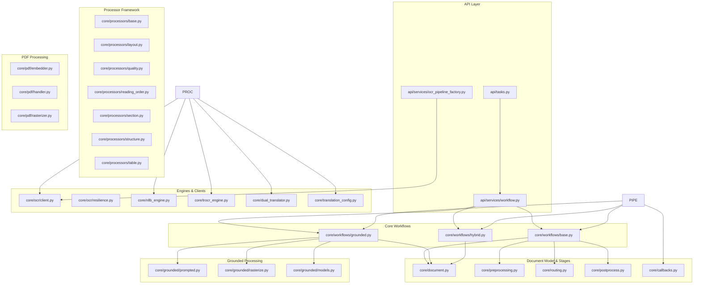

**Diagram sources**
- [tasks.py](file://src/omniscribe/api/tasks.py)
- [workflow.py](file://src/omniscribe/api/services/workflow.py)
- [ocr_pipeline_factory.py](file://src/omniscribe/api/services/ocr_pipeline_factory.py)
- [base.py](file://src/omniscribe/core/workflows/base.py)
- [grounded.py](file://src/omniscribe/core/workflows/grounded.py)
- [hybrid.py](file://src/omniscribe/core/workflows/hybrid.py)
- [document.py](file://src/omniscribe/core/document.py)
- [preprocessing.py](file://src/omniscribe/core/preprocessing.py)
- [routing.py](file://src/omniscribe/core/routing.py)
- [postprocess.py](file://src/omniscribe/core/postprocess.py)
- [callbacks.py](file://src/omniscribe/core/callbacks.py)
- [base.py](file://src/omniscribe/core/processors/base.py)
- [layout.py](file://src/omniscribe/core/processors/layout.py)
- [quality.py](file://src/omniscribe/core/processors/quality.py)
- [reading_order.py](file://src/omniscribe/core/processors/reading_order.py)
- [section.py](file://src/omniscribe/core/processors/section.py)
- [structure.py](file://src/omniscribe/core/processors/structure.py)
- [table.py](file://src/omniscribe/core/processors/table.py)
- [embedder.py](file://src/omniscribe/core/pdf/embedder.py)
- [handler.py](file://src/omniscribe/core/pdf/handler.py)
- [rasterizer.py](file://src/omniscribe/core/pdf/rasterizer.py)
- [client.py](file://src/omniscribe/core/ocr/client.py)
- [resilience.py](file://src/omniscribe/core/ocr/resilience.py)
- [nllb_engine.py](file://src/omniscribe/core/nllb_engine.py)
- [trocr_engine.py](file://src/omniscribe/core/trocr_engine.py)
- [dual_translator.py](file://src/omniscribe/core/dual_translator.py)
- [translation_config.py](file://src/omniscribe/core/translation_config.py)
- [prompted.py](file://src/omniscribe/core/grounded/prompted.py)
- [rasterize.py](file://src/omniscribe/core/grounded/rasterize.py)
- [models.py](file://src/omniscribe/core/grounded/models.py)
- [pipeline.py](file://src/omniscribe/pipeline.py)

**Section sources**
- [base.py](file://src/omniscribe/core/workflows/base.py)
- [grounded.py](file://src/omniscribe/core/workflows/grounded.py)
- [hybrid.py](file://src/omniscribe/core/workflows/hybrid.py)
- [document.py](file://src/omniscribe/core/document.py)
- [preprocessing.py](file://src/omniscribe/core/preprocessing.py)
- [postprocess.py](file://src/omniscribe/core/postprocess.py)
- [base.py](file://src/omniscribe/core/processors/base.py)
- [layout.py](file://src/omniscribe/core/processors/layout.py)
- [quality.py](file://src/omniscribe/core/processors/quality.py)
- [reading_order.py](file://src/omniscribe/core/processors/reading_order.py)
- [section.py](file://src/omniscribe/core/processors/section.py)
- [structure.py](file://src/omniscribe/core/processors/structure.py)
- [table.py](file://src/omniscribe/core/processors/table.py)
- [routing.py](file://src/omniscribe/core/routing.py)
- [client.py](file://src/omniscribe/core/ocr/client.py)
- [resilience.py](file://src/omniscribe/core/ocr/resilience.py)
- [nllb_engine.py](file://src/omniscribe/core/nllb_engine.py)
- [trocr_engine.py](file://src/omniscribe/core/trocr_engine.py)
- [dual_translator.py](file://src/omniscribe/core/dual_translator.py)
- [translation_config.py](file://src/omniscribe/core/translation_config.py)
- [prompted.py](file://src/omniscribe/core/grounded/prompted.py)
- [rasterize.py](file://src/omniscribe/core/grounded/rasterize.py)
- [models.py](file://src/omniscribe/core/grounded/models.py)
- [embedder.py](file://src/omniscribe/core/pdf/embedder.py)
- [handler.py](file://src/omniscribe/core/pdf/handler.py)
- [rasterizer.py](file://src/omniscribe/core/pdf/rasterizer.py)
- [pipeline.py](file://src/omniscribe/pipeline.py)
- [callbacks.py](file://src/omniscribe/core/callbacks.py)
- [tasks.py](file://src/omniscribe/api/tasks.py)
- [workflow.py](file://src/omniscribe/api/services/workflow.py)
- [ocr_pipeline_factory.py](file://src/omniscribe/api/services/ocr_pipeline_factory.py)

## Core Components
- Base workflow abstraction defines the lifecycle hooks and stage orchestration contract used by all workflows.
- Grounded workflow focuses on image-based documents with OCR-first processing and grounding artifacts.
- Hybrid workflow combines text-aware and image-aware stages to optimize accuracy and speed across mixed content.
- Document model encapsulates input artifacts, intermediate representations, and outputs across stages.
- **New Processor Framework**: Specialized processors for layout analysis, quality assessment, reading order determination, section detection, structure extraction, and table recognition.
- **Enhanced PDF Processing**: Dedicated modules for PDF embedding, handling, and rasterization with advanced features.
- **Improved OCR Resilience**: Circuit breaker patterns and enhanced error handling for robust OCR operations.
- Orchestration layer wires Celery tasks and API services to execute workflows asynchronously with progress tracking.

Key responsibilities:
- Lifecycle management: initialization, preprocessing, stage dispatch, postprocessing, finalization.
- Data transformation: converting raw inputs into structured blocks, lines, spans, and translations.
- **Advanced Processing**: Layout analysis, quality assessment, reading order determination, section detection, structure extraction, and table recognition.
- **PDF Operations**: Embedding, handling, and rasterization with optimized performance.
- Extensibility: pluggable processors, engines, and callbacks to customize behavior without modifying core logic.

**Section sources**
- [base.py](file://src/omniscribe/core/workflows/base.py)
- [grounded.py](file://src/omniscribe/core/workflows/grounded.py)
- [hybrid.py](file://src/omniscribe/core/workflows/hybrid.py)
- [document.py](file://src/omniscribe/core/document.py)
- [base.py](file://src/omniscribe/core/processors/base.py)
- [layout.py](file://src/omniscribe/core/processors/layout.py)
- [quality.py](file://src/omniscribe/core/processors/quality.py)
- [reading_order.py](file://src/omniscribe/core/processors/reading_order.py)
- [section.py](file://src/omniscribe/core/processors/section.py)
- [structure.py](file://src/omniscribe/core/processors/structure.py)
- [table.py](file://src/omniscribe/core/processors/table.py)
- [embedder.py](file://src/omniscribe/core/pdf/embedder.py)
- [handler.py](file://src/omniscribe/core/pdf/handler.py)
- [rasterizer.py](file://src/omniscribe/core/pdf/rasterizer.py)
- [resilience.py](file://src/omniscribe/core/ocr/resilience.py)
- [routing.py](file://src/omniscribe/core/routing.py)
- [preprocessing.py](file://src/omniscribe/core/preprocessing.py)
- [postprocess.py](file://src/omniscribe/core/postprocess.py)
- [pipeline.py](file://src/omniscribe/pipeline.py)
- [callbacks.py](file://src/omniscribe/core/callbacks.py)

## Architecture Overview
The processing engine follows a layered architecture:
- API and Task Layer: Receives requests, enqueues jobs, and tracks progress.
- Workflow Layer: Orchestrates stages using a common interface; supports grounded and hybrid modes.
- Stage Layer: Implements discrete transformations (preprocessing, OCR, routing, translation, postprocessing).
- **Processor Framework Layer**: Specialized processors for layout, quality, reading order, sections, structure, and table analysis.
- **PDF Processing Layer**: Dedicated modules for embedding, handling, and rasterization.
- Engine Layer: Provides OCR and translation backends (NLLB, TROCR, dual translator).
- Support Layer: Configuration, exceptions, filters, and callbacks.

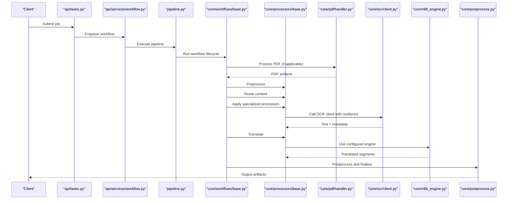

**Diagram sources**
- [tasks.py](file://src/omniscribe/api/tasks.py)
- [workflow.py](file://src/omniscribe/api/services/workflow.py)
- [pipeline.py](file://src/omniscribe/pipeline.py)
- [base.py](file://src/omniscribe/core/workflows/base.py)
- [base.py](file://src/omniscribe/core/processors/base.py)
- [handler.py](file://src/omniscribe/core/pdf/handler.py)
- [client.py](file://src/omniscribe/core/ocr/client.py)
- [nllb_engine.py](file://src/omniscribe/core/nllb_engine.py)
- [postprocess.py](file://src/omniscribe/core/postprocess.py)

## Detailed Component Analysis

### Base Workflow Abstraction
The base workflow defines the canonical lifecycle:
- Initialize document context and configuration
- Preprocess inputs (normalize, segment, prepare assets)
- Dispatch stages based on routing decisions
- Apply translation or extraction steps
- Postprocess results (merge, validate, export)
- Finalize and emit artifacts

It exposes extension points for:
- Custom preprocessors and postprocessors
- Pluggable routing rules
- Configurable engines and filters
- Callbacks for progress and side effects

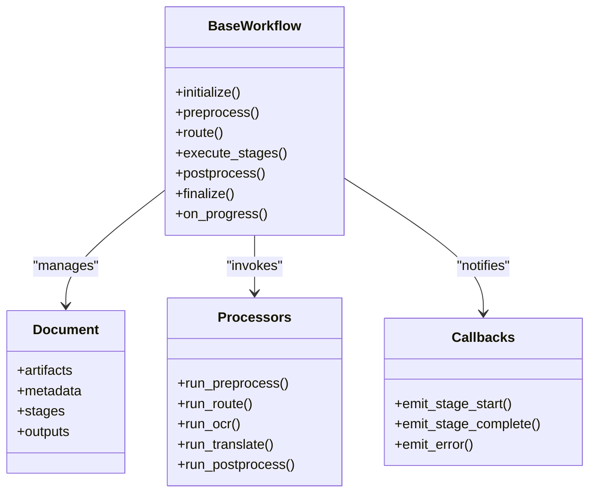

**Diagram sources**
- [base.py](file://src/omniscribe/core/workflows/base.py)
- [document.py](file://src/omniscribe/core/document.py)
- [base.py](file://src/omniscribe/core/processors/base.py)
- [callbacks.py](file://src/omniscribe/core/callbacks.py)

**Section sources**
- [base.py](file://src/omniscribe/core/workflows/base.py)
- [document.py](file://src/omniscribe/core/document.py)
- [base.py](file://src/omniscribe/core/processors/base.py)
- [callbacks.py](file://src/omniscribe/core/callbacks.py)

### Grounded Processing Workflow
Grounded workflows prioritize image-based documents:
- Rasterize pages when necessary
- Extract text via OCR with grounding metadata
- Optionally prompt models to refine structure
- Maintain alignment between visual elements and textual output

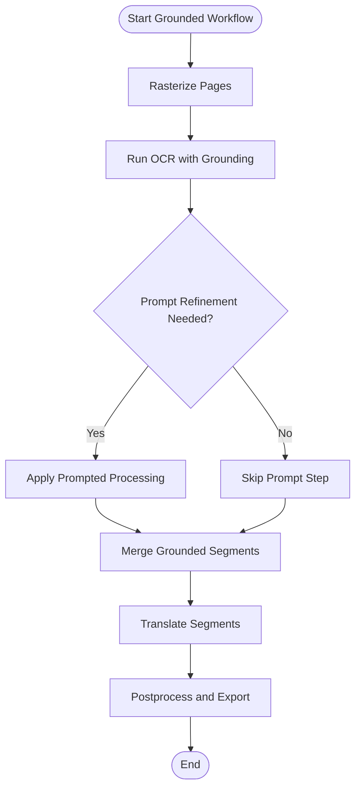

**Diagram sources**
- [grounded.py](file://src/omniscribe/core/workflows/grounded.py)
- [rasterize.py](file://src/omniscribe/core/grounded/rasterize.py)
- [prompted.py](file://src/omniscribe/core/grounded/prompted.py)
- [models.py](file://src/omniscribe/core/grounded/models.py)

**Section sources**
- [grounded.py](file://src/omniscribe/core/workflows/grounded.py)
- [rasterize.py](file://src/omniscribe/core/grounded/rasterize.py)
- [prompted.py](file://src/omniscribe/core/grounded/prompted.py)
- [models.py](file://src/omniscribe/core/grounded/models.py)

### Hybrid Processing Workflow
Hybrid workflows adaptively combine text-aware and image-aware stages:
- Detect content type (digital text vs. scanned images)
- Choose optimal path (direct text extraction vs. OCR)
- Apply targeted translation and postprocessing
- Optimize throughput by skipping unnecessary steps

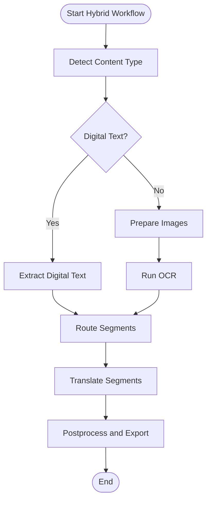

**Diagram sources**
- [hybrid.py](file://src/omniscribe/core/workflows/hybrid.py)
- [routing.py](file://src/omniscribe/core/routing.py)
- [base.py](file://src/omniscribe/core/processors/base.py)

**Section sources**
- [hybrid.py](file://src/omniscribe/core/workflows/hybrid.py)
- [routing.py](file://src/omniscribe/core/routing.py)
- [base.py](file://src/omniscribe/core/processors/base.py)

### Document Model and Processing Stages
The document model centralizes state across the lifecycle:
- Artifacts: raw inputs, intermediate images, extracted text
- Metadata: page counts, language hints, confidence scores
- Stages: ordered list of executed steps with status and timing
- Outputs: final translated content, aligned structures, exports

Stages include:
- Preprocessing: normalization, segmentation, asset preparation
- Routing: decision logic to select OCR vs. direct text paths
- OCR: text extraction with grounding and filtering
- Translation: backend-agnostic translation via configured engines
- Postprocessing: merging, validation, formatting, exporting

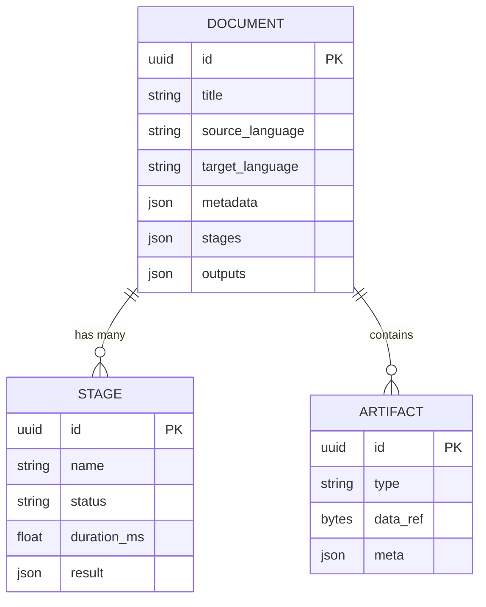

**Diagram sources**
- [document.py](file://src/omniscribe/core/document.py)
- [preprocessing.py](file://src/omniscribe/core/preprocessing.py)
- [routing.py](file://src/omniscribe/core/routing.py)
- [base.py](file://src/omniscribe/core/processors/base.py)
- [postprocess.py](file://src/omniscribe/core/postprocess.py)

**Section sources**
- [document.py](file://src/omniscribe/core/document.py)
- [preprocessing.py](file://src/omniscribe/core/preprocessing.py)
- [routing.py](file://src/omniscribe/core/routing.py)
- [base.py](file://src/omniscribe/core/processors/base.py)
- [postprocess.py](file://src/omniscribe/core/postprocess.py)

### Data Transformation Pipelines
Pipelines transform inputs through a sequence of processors:
- Input normalization and segmentation
- Optional rasterization for image-heavy documents
- OCR with filtering and grounding
- Translation using selected engines
- Postprocessing merges and validates outputs

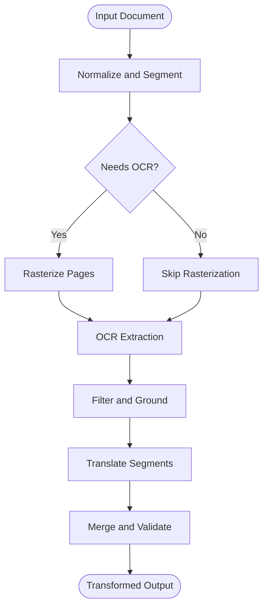

**Diagram sources**
- [preprocessing.py](file://src/omniscribe/core/preprocessing.py)
- [rasterize.py](file://src/omniscribe/core/grounded/rasterize.py)
- [client.py](file://src/omniscribe/core/ocr/client.py)
- [filters.py](file://src/omniscribe/core/ocr/filters.py)
- [dual_translator.py](file://src/omniscribe/core/dual_translator.py)
- [nllb_engine.py](file://src/omniscribe/core/nllb_engine.py)
- [trocr_engine.py](file://src/omniscribe/core/trocr_engine.py)
- [postprocess.py](file://src/omniscribe/core/postprocess.py)

**Section sources**
- [preprocessing.py](file://src/omniscribe/core/preprocessing.py)
- [rasterize.py](file://src/omniscribe/core/grounded/rasterize.py)
- [client.py](file://src/omniscribe/core/ocr/client.py)
- [filters.py](file://src/omniscribe/core/ocr/filters.py)
- [dual_translator.py](file://src/omniscribe/core/dual_translator.py)
- [nllb_engine.py](file://src/omniscribe/core/nllb_engine.py)
- [trocr_engine.py](file://src/omniscribe/core/trocr_engine.py)
- [postprocess.py](file://src/omniscribe/core/postprocess.py)

## PDF Processing Framework

**Updated** New PDF processing modules provide advanced capabilities for handling PDF documents with embedding, handling, and rasterization features.

The PDF processing framework consists of three main components:

### PDF Handler
The handler serves as the primary interface for PDF document processing, managing document lifecycle and coordinating between different PDF operations.

### PDF Embedder
The embedder handles vector embedding generation for PDF content, enabling semantic search and similarity matching capabilities.

### PDF Rasterizer
The rasterizer converts PDF pages to high-quality images for OCR processing and visual analysis.

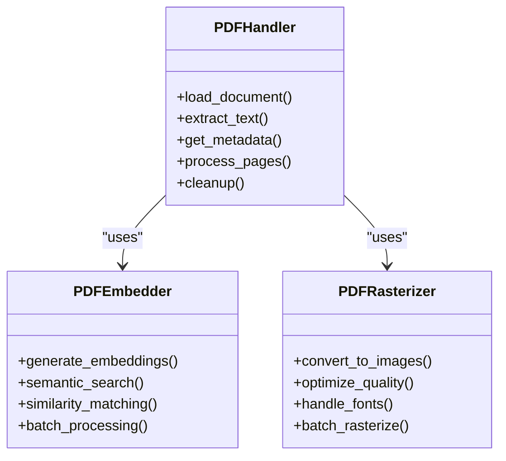

**Diagram sources**
- [handler.py](file://src/omniscribe/core/pdf/handler.py)
- [embedder.py](file://src/omniscribe/core/pdf/embedder.py)
- [rasterizer.py](file://src/omniscribe/core/pdf/rasterizer.py)

**Section sources**
- [handler.py](file://src/omniscribe/core/pdf/handler.py)
- [embedder.py](file://src/omniscribe/core/pdf/embedder.py)
- [rasterizer.py](file://src/omniscribe/core/pdf/rasterizer.py)

## Enhanced OCR Resilience

**Updated** OCR operations now feature circuit breaker patterns and enhanced error handling for improved reliability and fault tolerance.

The enhanced OCR resilience system includes:

### Circuit Breaker Pattern
Implements circuit breaker pattern to prevent cascading failures and provide graceful degradation when OCR services are unavailable.

### Error Classification
Categorizes errors into transient (retryable) and permanent (non-retryable) types with appropriate handling strategies.

### Retry Mechanisms
Exponential backoff with jitter for transient errors, with configurable retry limits and timeout settings.

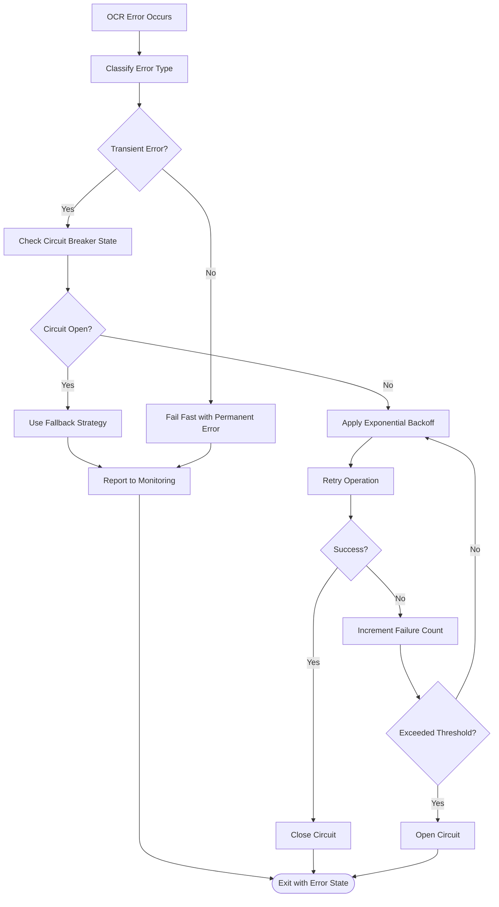

**Diagram sources**
- [resilience.py](file://src/omniscribe/core/ocr/resilience.py)
- [client.py](file://src/omniscribe/core/ocr/client.py)
- [exceptions.py](file://src/omniscribe/core/ocr/exceptions.py)

**Section sources**
- [resilience.py](file://src/omniscribe/core/ocr/resilience.py)
- [client.py](file://src/omniscribe/core/ocr/client.py)
- [exceptions.py](file://src/omniscribe/core/ocr/exceptions.py)

## Processor Framework

**Updated** New processor framework provides specialized processors for advanced document analysis tasks including layout, quality, reading order, sections, structure, and table processing.

The processor framework extends the base workflow with specialized analysis capabilities:

### Base Processor
Defines the common interface and lifecycle for all processors, ensuring consistent behavior and easy integration.

### Specialized Processors
- **Layout Processor**: Analyzes document layout and spatial relationships
- **Quality Processor**: Assesses document quality and readability metrics
- **Reading Order Processor**: Determines logical reading sequence
- **Section Processor**: Identifies and extracts document sections
- **Structure Processor**: Extracts hierarchical document structure
- **Table Processor**: Recognizes and processes tabular data

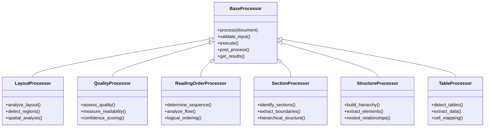

**Diagram sources**
- [base.py](file://src/omniscribe/core/processors/base.py)
- [layout.py](file://src/omniscribe/core/processors/layout.py)
- [quality.py](file://src/omniscribe/core/processors/quality.py)
- [reading_order.py](file://src/omniscribe/core/processors/reading_order.py)
- [section.py](file://src/omniscribe/core/processors/section.py)
- [structure.py](file://src/omniscribe/core/processors/structure.py)
- [table.py](file://src/omniscribe/core/processors/table.py)

**Section sources**
- [base.py](file://src/omniscribe/core/processors/base.py)
- [layout.py](file://src/omniscribe/core/processors/layout.py)
- [quality.py](file://src/omniscribe/core/processors/quality.py)
- [reading_order.py](file://src/omniscribe/core/processors/reading_order.py)
- [section.py](file://src/omniscribe/core/processors/section.py)
- [structure.py](file://src/omniscribe/core/processors/structure.py)
- [table.py](file://src/omniscribe/core/processors/table.py)

### Error Handling and Retry Mechanisms
Error handling spans multiple layers:
- OCR exceptions define domain-specific failures (network timeouts, unsupported formats)
- Filters handle malformed or low-confidence OCR results
- Workflows capture errors per stage and propagate them to callbacks
- Tasks and services coordinate retries and progress updates
- **Enhanced Circuit Breaker**: Prevents cascading failures with automatic recovery mechanisms

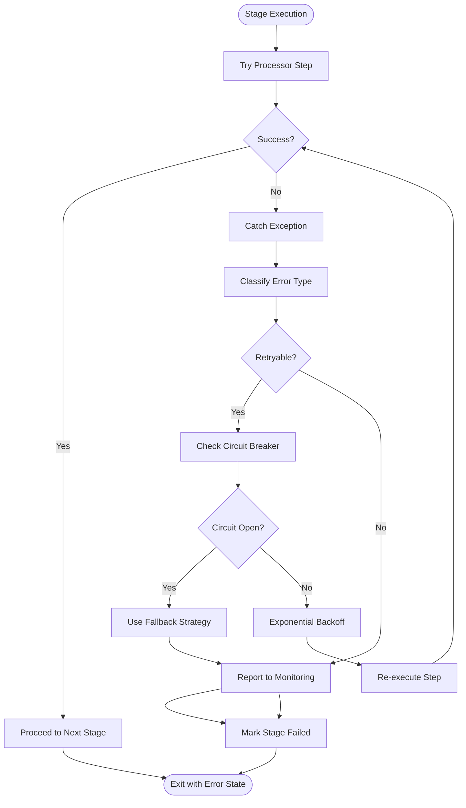

**Diagram sources**
- [exceptions.py](file://src/omniscribe/core/ocr/exceptions.py)
- [filters.py](file://src/omniscribe/core/ocr/filters.py)
- [base.py](file://src/omniscribe/core/workflows/base.py)
- [callbacks.py](file://src/omniscribe/core/callbacks.py)
- [tasks.py](file://src/omniscribe/api/tasks.py)
- [resilience.py](file://src/omniscribe/core/ocr/resilience.py)

**Section sources**
- [exceptions.py](file://src/omniscribe/core/ocr/exceptions.py)
- [filters.py](file://src/omniscribe/core/ocr/filters.py)
- [base.py](file://src/omniscribe/core/workflows/base.py)
- [callbacks.py](file://src/omniscribe/core/callbacks.py)
- [tasks.py](file://src/omniscribe/api/tasks.py)
- [resilience.py](file://src/omniscribe/core/ocr/resilience.py)

### Performance Optimization Strategies
Optimization techniques implemented across the engine:
- Adaptive routing to skip OCR for digital text
- Batched translation calls where supported
- Caching of intermediate artifacts and translations
- Streaming large artifacts to reduce memory pressure
- Parallelizable stages with controlled concurrency
- Early exits for trivial documents
- **PDF Optimization**: Efficient PDF processing with lazy loading and memory management
- **Processor Pipeline**: Optimized processor chaining with early termination

These strategies are applied within processors and workflows to minimize latency and resource usage.

### Extensibility Points
Extensibility is designed into the engine:
- Custom preprocessors/postprocessors can be registered with the processor registry
- **New Processor Framework**: Extend with custom processors implementing the base interface
- Routing rules can be extended to support new content types
- New OCR and translation engines can be plugged in via configuration
- Callbacks allow external systems to observe and react to lifecycle events
- Workflow subclasses enable specialized pipelines without altering base logic
- **PDF Extensions**: Custom PDF handlers and processors for specialized document types

Recommended practices:
- Keep processors stateless and idempotent where possible
- Emit detailed stage metadata for observability
- Validate inputs early and fail fast with descriptive errors
- Use configuration objects to control behavior without code changes
- Implement proper error handling and fallback strategies

**Section sources**
- [base.py](file://src/omniscribe/core/processors/base.py)
- [routing.py](file://src/omniscribe/core/routing.py)
- [translation_config.py](file://src/omniscribe/core/translation_config.py)
- [callbacks.py](file://src/omniscribe/core/callbacks.py)
- [base.py](file://src/omniscribe/core/workflows/base.py)

## Dependency Analysis
The core components exhibit clear separation of concerns:
- Workflows depend on processors, document model, and callbacks
- **Processor Framework**: Specialized processors extend base functionality with domain-specific analysis
- **PDF Processing**: Dedicated modules handle PDF-specific operations
- Processors depend on OCR clients, translation engines, and filters
- API tasks and services orchestrate workflows and track progress
- Engines provide backend-specific implementations abstracted by processors

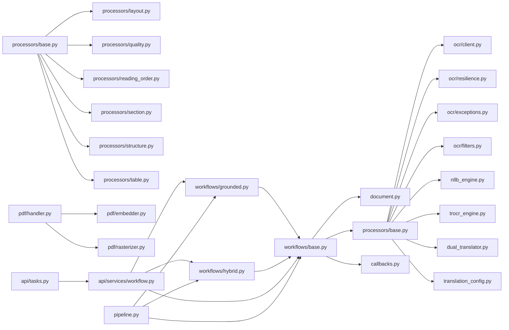

**Diagram sources**
- [base.py](file://src/omniscribe/core/workflows/base.py)
- [grounded.py](file://src/omniscribe/core/workflows/grounded.py)
- [hybrid.py](file://src/omniscribe/core/workflows/hybrid.py)
- [document.py](file://src/omniscribe/core/document.py)
- [base.py](file://src/omniscribe/core/processors/base.py)
- [layout.py](file://src/omniscribe/core/processors/layout.py)
- [quality.py](file://src/omniscribe/core/processors/quality.py)
- [reading_order.py](file://src/omniscribe/core/processors/reading_order.py)
- [section.py](file://src/omniscribe/core/processors/section.py)
- [structure.py](file://src/omniscribe/core/processors/structure.py)
- [table.py](file://src/omniscribe/core/processors/table.py)
- [client.py](file://src/omniscribe/core/ocr/client.py)
- [resilience.py](file://src/omniscribe/core/ocr/resilience.py)
- [exceptions.py](file://src/omniscribe/core/ocr/exceptions.py)
- [filters.py](file://src/omniscribe/core/ocr/filters.py)
- [nllb_engine.py](file://src/omniscribe/core/nllb_engine.py)
- [trocr_engine.py](file://src/omniscribe/core/trocr_engine.py)
- [dual_translator.py](file://src/omniscribe/core/dual_translator.py)
- [translation_config.py](file://src/omniscribe/core/translation_config.py)
- [handler.py](file://src/omniscribe/core/pdf/handler.py)
- [embedder.py](file://src/omniscribe/core/pdf/embedder.py)
- [rasterizer.py](file://src/omniscribe/core/pdf/rasterizer.py)
- [tasks.py](file://src/omniscribe/api/tasks.py)
- [workflow.py](file://src/omniscribe/api/services/workflow.py)
- [pipeline.py](file://src/omniscribe/pipeline.py)

**Section sources**
- [base.py](file://src/omniscribe/core/workflows/base.py)
- [grounded.py](file://src/omniscribe/core/workflows/grounded.py)
- [hybrid.py](file://src/omniscribe/core/workflows/hybrid.py)
- [document.py](file://src/omniscribe/core/document.py)
- [base.py](file://src/omniscribe/core/processors/base.py)
- [layout.py](file://src/omniscribe/core/processors/layout.py)
- [quality.py](file://src/omniscribe/core/processors/quality.py)
- [reading_order.py](file://src/omniscribe/core/processors/reading_order.py)
- [section.py](file://src/omniscribe/core/processors/section.py)
- [structure.py](file://src/omniscribe/core/processors/structure.py)
- [table.py](file://src/omniscribe/core/processors/table.py)
- [client.py](file://src/omniscribe/core/ocr/client.py)
- [resilience.py](file://src/omniscribe/core/ocr/resilience.py)
- [exceptions.py](file://src/omniscribe/core/ocr/exceptions.py)
- [filters.py](file://src/omniscribe/core/ocr/filters.py)
- [nllb_engine.py](file://src/omniscribe/core/nllb_engine.py)
- [trocr_engine.py](file://src/omniscribe/core/trocr_engine.py)
- [dual_translator.py](file://src/omniscribe/core/dual_translator.py)
- [translation_config.py](file://src/omniscribe/core/translation_config.py)
- [handler.py](file://src/omniscribe/core/pdf/handler.py)
- [embedder.py](file://src/omniscribe/core/pdf/embedder.py)
- [rasterizer.py](file://src/omniscribe/core/pdf/rasterizer.py)
- [tasks.py](file://src/omniscribe/api/tasks.py)
- [workflow.py](file://src/omniscribe/api/services/workflow.py)
- [pipeline.py](file://src/omniscribe/pipeline.py)

## Performance Considerations
- Prefer direct text extraction for digital documents to avoid OCR overhead
- Use batching and streaming for large documents and high-throughput scenarios
- Cache repeated translations and intermediate artifacts to reduce recomputation
- Tune concurrency limits based on available resources and backend quotas
- Monitor stage durations and error rates to identify bottlenecks
- **PDF Optimization**: Lazy loading and efficient memory management for large PDF files
- **Processor Pipeline**: Optimized processor chaining with early termination and caching
- **Circuit Breaker**: Prevent service overload with intelligent failure handling

## Troubleshooting Guide
Common issues and diagnostics:
- OCR failures due to network timeouts or unsupported formats: check OCR client logs and exception classes
- Low-confidence OCR results: review filters and grounding parameters
- Translation errors: verify configuration and backend availability
- Progress stalls: inspect callbacks and task queues for stuck stages
- **PDF Processing Issues**: Verify PDF compatibility and resource availability
- **Processor Failures**: Check processor configuration and input validation
- **Circuit Breaker Activation**: Monitor service health and adjust thresholds as needed

Actionable steps:
- Enable detailed stage logging and callback emissions
- Validate input artifacts and metadata before processing
- Adjust retry policies and backoff strategies for transient errors
- Use artifact inspection utilities to examine intermediate states
- Monitor circuit breaker states and service health indicators
- Review processor performance metrics and error rates

**Section sources**
- [client.py](file://src/omniscribe/core/ocr/client.py)
- [resilience.py](file://src/omniscribe/core/ocr/resilience.py)
- [exceptions.py](file://src/omniscribe/core/ocr/exceptions.py)
- [filters.py](file://src/omniscribe/core/ocr/filters.py)
- [callbacks.py](file://src/omniscribe/core/callbacks.py)
- [tasks.py](file://src/omniscribe/api/tasks.py)

## Conclusion
LocalDeepL's core processing engine provides a robust, extensible framework for orchestrating document processing workflows. The base abstraction ensures consistent lifecycle management, while grounded and hybrid workflows tailor execution to document characteristics. The new processor framework enables advanced document analysis with specialized processors for layout, quality, reading order, sections, structure, and table processing. Enhanced PDF processing capabilities provide comprehensive support for PDF documents with embedding, handling, and rasterization features. Improved OCR resilience through circuit breaker patterns ensures reliable operation even under adverse conditions. Clear separation between workflows, processors, engines, and orchestration enables scalability, reliability, and customization. With comprehensive error handling, retry mechanisms, and performance optimizations, the engine supports diverse use cases from simple text translation to complex OCR-driven document analysis.

## Appendices
- Configuration reference: translation engines and OCR clients are configured via dedicated config modules
- API integration: tasks and services expose endpoints to submit jobs and monitor progress
- Testing strategy: unit and integration tests cover workflows, processors, and engines
- **PDF Processing**: Comprehensive PDF handling with advanced features for embedding and rasterization
- **Processor Framework**: Extensible processor system for specialized document analysis tasks
- **Resilience Patterns**: Circuit breaker and retry mechanisms for robust operation