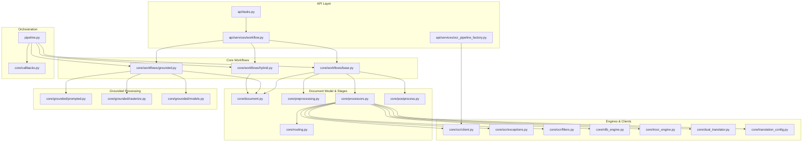
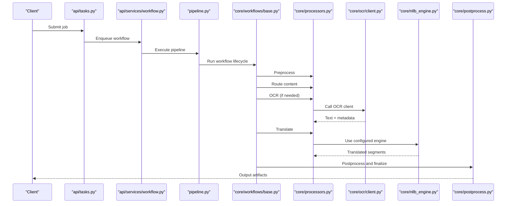
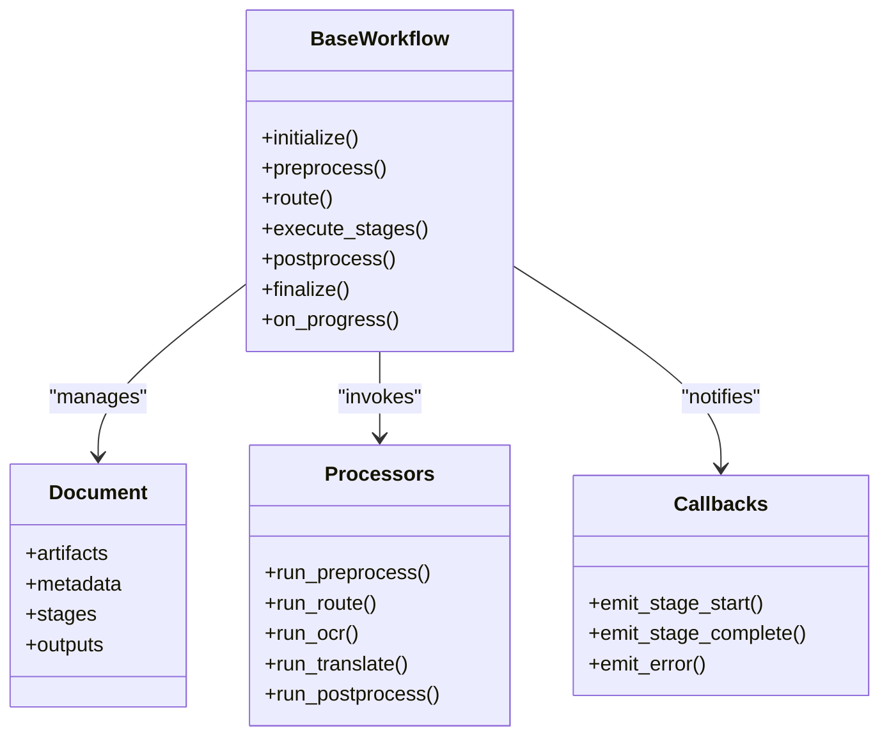
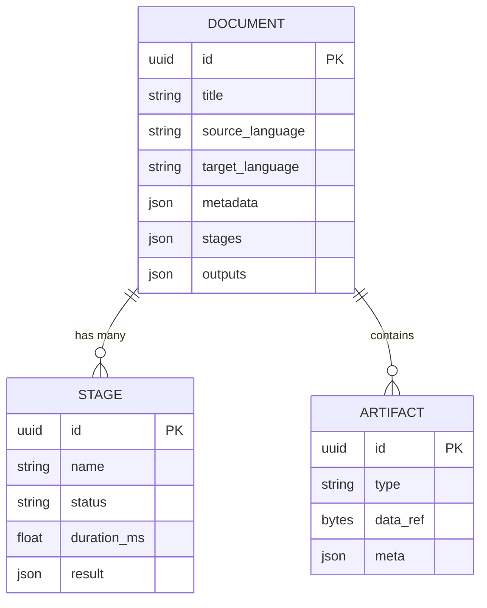
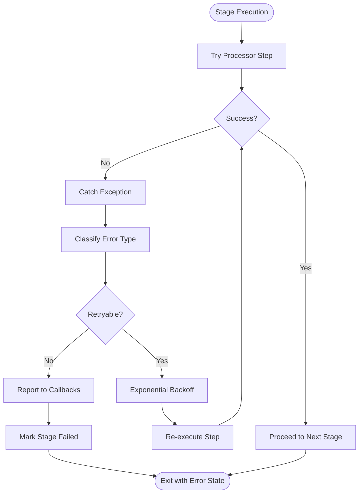
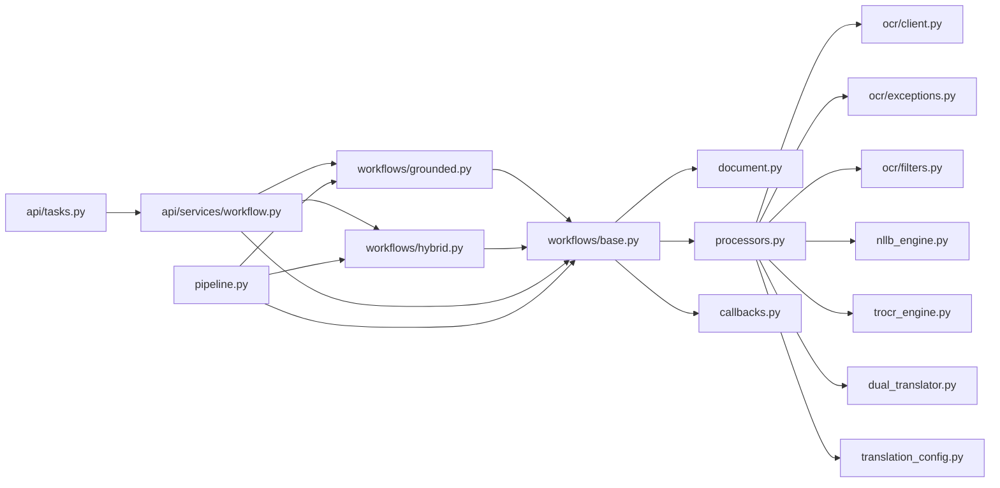

# Core Processing Engine

<cite>
**Referenced Files in This Document**
- [base.py](file://src/local_deepl/core/workflows/base.py)
- [grounded.py](file://src/local_deepl/core/workflows/grounded.py)
- [hybrid.py](file://src/local_deepl/core/workflows/hybrid.py)
- [document.py](file://src/local_deepl/core/document.py)
- [preprocessing.py](file://src/local_deepl/core/preprocessing.py)
- [postprocess.py](file://src/local_deepl/core/postprocess.py)
- [processors.py](file://src/local_deepl/core/processors.py)
- [routing.py](file://src/local_deepl/core/routing.py)
- [callbacks.py](file://src/local_deepl/core/callbacks.py)
- [pipeline.py](file://src/local_deepl/pipeline.py)
- [tasks.py](file://src/local_deepl/api/tasks.py)
- [workflow.py](file://src/local_deepl/api/services/workflow.py)
- [ocr_pipeline_factory.py](file://src/local_deepl/api/services/ocr_pipeline_factory.py)
- [translation_config.py](file://src/local_deepl/core/translation_config.py)
- [dual_translator.py](file://src/local_deepl/core/dual_translator.py)
- [nllb_engine.py](file://src/local_deepl/core/nllb_engine.py)
- [trocr_engine.py](file://src/local_deepl/core/trocr_engine.py)
- [client.py](file://src/local_deepl/core/ocr/client.py)
- [exceptions.py](file://src/local_deepl/core/ocr/exceptions.py)
- [filters.py](file://src/local_deepl/core/ocr/filters.py)
- [prompted.py](file://src/local_deepl/core/grounded/prompted.py)
- [rasterize.py](file://src/local_deepl/core/grounded/rasterize.py)
- [models.py](file://src/local_deepl/core/grounded/models.py)
</cite>

## Table of Contents
1. [Introduction](#introduction)
2. [Project Structure](#project-structure)
3. [Core Components](#core-components)
4. [Architecture Overview](#architecture-overview)
5. [Detailed Component Analysis](#detailed-component-analysis)
6. [Dependency Analysis](#dependency-analysis)
7. [Performance Considerations](#performance-considerations)
8. [Troubleshooting Guide](#troubleshooting-guide)
9. [Conclusion](#conclusion)
10. [Appendices](#appendices)

## Introduction
This document describes the core processing engine of LocalDeepL, focusing on workflow orchestration, pipeline execution patterns, and the document processing lifecycle. It explains the base workflow abstraction, grounded and hybrid processing approaches, the document model, processing stages, data transformation pipelines, error handling and retry strategies, performance optimizations, and extensibility points for custom processors and workflows.

## Project Structure
The core processing engine is organized around a clear separation between:
- Workflow abstractions and concrete implementations (base, grounded, hybrid)
- Document model and stage transformations (preprocessing, OCR, translation, postprocessing)
- Orchestration and task execution (Celery tasks, API services, pipeline runner)
- Engines and clients for OCR and translation backends
- Callbacks and configuration to decouple side effects and behavior

**Diagram sources**
- [tasks.py](file://src/local_deepl/api/tasks.py)
- [workflow.py](file://src/local_deepl/api/services/workflow.py)
- [ocr_pipeline_factory.py](file://src/local_deepl/api/services/ocr_pipeline_factory.py)
- [base.py](file://src/local_deepl/core/workflows/base.py)
- [grounded.py](file://src/local_deepl/core/workflows/grounded.py)
- [hybrid.py](file://src/local_deepl/core/workflows/hybrid.py)
- [document.py](file://src/local_deepl/core/document.py)
- [preprocessing.py](file://src/local_deepl/core/preprocessing.py)
- [processors.py](file://src/local_deepl/core/processors.py)
- [routing.py](file://src/local_deepl/core/routing.py)
- [postprocess.py](file://src/local_deepl/core/postprocess.py)
- [client.py](file://src/local_deepl/core/ocr/client.py)
- [exceptions.py](file://src/local_deepl/core/ocr/exceptions.py)
- [filters.py](file://src/local_deepl/core/ocr/filters.py)
- [nllb_engine.py](file://src/local_deepl/core/nllb_engine.py)
- [trocr_engine.py](file://src/local_deepl/core/trocr_engine.py)
- [dual_translator.py](file://src/local_deepl/core/dual_translator.py)
- [translation_config.py](file://src/local_deepl/core/translation_config.py)
- [prompted.py](file://src/local_deepl/core/grounded/prompted.py)
- [rasterize.py](file://src/local_deepl/core/grounded/rasterize.py)
- [models.py](file://src/local_deepl/core/grounded/models.py)
- [pipeline.py](file://src/local_deepl/pipeline.py)
- [callbacks.py](file://src/local_deepl/core/callbacks.py)

**Section sources**
- [base.py](file://src/local_deepl/core/workflows/base.py)
- [grounded.py](file://src/local_deepl/core/workflows/grounded.py)
- [hybrid.py](file://src/local_deepl/core/workflows/hybrid.py)
- [document.py](file://src/local_deepl/core/document.py)
- [preprocessing.py](file://src/local_deepl/core/preprocessing.py)
- [postprocess.py](file://src/local_deepl/core/postprocess.py)
- [processors.py](file://src/local_deepl/core/processors.py)
- [routing.py](file://src/local_deepl/core/routing.py)
- [client.py](file://src/local_deepl/core/ocr/client.py)
- [exceptions.py](file://src/local_deepl/core/ocr/exceptions.py)
- [filters.py](file://src/local_deepl/core/ocr/filters.py)
- [nllb_engine.py](file://src/local_deepl/core/nllb_engine.py)
- [trocr_engine.py](file://src/local_deepl/core/trocr_engine.py)
- [dual_translator.py](file://src/local_deepl/core/dual_translator.py)
- [translation_config.py](file://src/local_deepl/core/translation_config.py)
- [prompted.py](file://src/local_deepl/core/grounded/prompted.py)
- [rasterize.py](file://src/local_deepl/core/grounded/rasterize.py)
- [models.py](file://src/local_deepl/core/grounded/models.py)
- [pipeline.py](file://src/local_deepl/pipeline.py)
- [callbacks.py](file://src/local_deepl/core/callbacks.py)
- [tasks.py](file://src/local_deepl/api/tasks.py)
- [workflow.py](file://src/local_deepl/api/services/workflow.py)
- [ocr_pipeline_factory.py](file://src/local_deepl/api/services/ocr_pipeline_factory.py)

## Core Components
- Base workflow abstraction defines the lifecycle hooks and stage orchestration contract used by all workflows.
- Grounded workflow focuses on image-based documents with OCR-first processing and grounding artifacts.
- Hybrid workflow combines text-aware and image-aware stages to optimize accuracy and speed across mixed content.
- Document model encapsulates input artifacts, intermediate representations, and outputs across stages.
- Processors implement discrete steps (OCR, routing, translation, postprocessing) and are configurable via engines and filters.
- Orchestration layer wires Celery tasks and API services to execute workflows asynchronously with progress tracking.

Key responsibilities:
- Lifecycle management: initialization, preprocessing, stage dispatch, postprocessing, finalization.
- Data transformation: converting raw inputs into structured blocks, lines, spans, and translations.
- Extensibility: pluggable processors, engines, and callbacks to customize behavior without modifying core logic.

**Section sources**
- [base.py](file://src/local_deepl/core/workflows/base.py)
- [grounded.py](file://src/local_deepl/core/workflows/grounded.py)
- [hybrid.py](file://src/local_deepl/core/workflows/hybrid.py)
- [document.py](file://src/local_deepl/core/document.py)
- [processors.py](file://src/local_deepl/core/processors.py)
- [routing.py](file://src/local_deepl/core/routing.py)
- [preprocessing.py](file://src/local_deepl/core/preprocessing.py)
- [postprocess.py](file://src/local_deepl/core/postprocess.py)
- [pipeline.py](file://src/local_deepl/pipeline.py)
- [callbacks.py](file://src/local_deepl/core/callbacks.py)

## Architecture Overview
The processing engine follows a layered architecture:
- API and Task Layer: Receives requests, enqueues jobs, and tracks progress.
- Workflow Layer: Orchestrates stages using a common interface; supports grounded and hybrid modes.
- Stage Layer: Implements discrete transformations (preprocessing, OCR, routing, translation, postprocessing).
- Engine Layer: Provides OCR and translation backends (NLLB, TROCR, dual translator).
- Support Layer: Configuration, exceptions, filters, and callbacks.

**Diagram sources**
- [tasks.py](file://src/local_deepl/api/tasks.py)
- [workflow.py](file://src/local_deepl/api/services/workflow.py)
- [pipeline.py](file://src/local_deepl/pipeline.py)
- [base.py](file://src/local_deepl/core/workflows/base.py)
- [processors.py](file://src/local_deepl/core/processors.py)
- [client.py](file://src/local_deepl/core/ocr/client.py)
- [nllb_engine.py](file://src/local_deepl/core/nllb_engine.py)
- [postprocess.py](file://src/local_deepl/core/postprocess.py)

## Detailed Component Analysis

### Base Workflow Abstraction
The base workflow defines the canonical lifecycle:
- Initialize document context and configuration
- Preprocess inputs (normalize, segment, prepare assets)
- Dispatch stages based on routing decisions
- Apply translation or extraction steps
- Postprocess results (merge, validate, export)
- Finalize and emit artifacts

It exposes extension points for:
- Custom preprocessors and postprocessors
- Pluggable routing rules
- Configurable engines and filters
- Callbacks for progress and side effects

**Diagram sources**
- [base.py](file://src/local_deepl/core/workflows/base.py)
- [document.py](file://src/local_deepl/core/document.py)
- [processors.py](file://src/local_deepl/core/processors.py)
- [callbacks.py](file://src/local_deepl/core/callbacks.py)

**Section sources**
- [base.py](file://src/local_deepl/core/workflows/base.py)
- [document.py](file://src/local_deepl/core/document.py)
- [processors.py](file://src/local_deepl/core/processors.py)
- [callbacks.py](file://src/local_deepl/core/callbacks.py)

### Grounded Processing Workflow
Grounded workflows prioritize image-based documents:
- Rasterize pages when necessary
- Extract text via OCR with grounding metadata
- Optionally prompt models to refine structure
- Maintain alignment between visual elements and textual output

**Diagram sources**
- [grounded.py](file://src/local_deepl/core/workflows/grounded.py)
- [rasterize.py](file://src/local_deepl/core/grounded/rasterize.py)
- [prompted.py](file://src/local_deepl/core/grounded/prompted.py)
- [models.py](file://src/local_deepl/core/grounded/models.py)

**Section sources**
- [grounded.py](file://src/local_deepl/core/workflows/grounded.py)
- [rasterize.py](file://src/local_deepl/core/grounded/rasterize.py)
- [prompted.py](file://src/local_deepl/core/grounded/prompted.py)
- [models.py](file://src/local_deepl/core/grounded/models.py)

### Hybrid Processing Workflow
Hybrid workflows adaptively combine text-aware and image-aware stages:
- Detect content type (digital text vs. scanned images)
- Choose optimal path (direct text extraction vs. OCR)
- Apply targeted translation and postprocessing
- Optimize throughput by skipping unnecessary steps

**Diagram sources**
- [hybrid.py](file://src/local_deepl/core/workflows/hybrid.py)
- [routing.py](file://src/local_deepl/core/routing.py)
- [processors.py](file://src/local_deepl/core/processors.py)

**Section sources**
- [hybrid.py](file://src/local_deepl/core/workflows/hybrid.py)
- [routing.py](file://src/local_deepl/core/routing.py)
- [processors.py](file://src/local_deepl/core/processors.py)

### Document Model and Processing Stages
The document model centralizes state across the lifecycle:
- Artifacts: raw inputs, intermediate images, extracted text
- Metadata: page counts, language hints, confidence scores
- Stages: ordered list of executed steps with status and timing
- Outputs: final translated content, aligned structures, exports

Stages include:
- Preprocessing: normalization, segmentation, asset preparation
- Routing: decision logic to select OCR vs. direct text paths
- OCR: text extraction with grounding and filtering
- Translation: backend-agnostic translation via configured engines
- Postprocessing: merging, validation, formatting, exporting

**Diagram sources**
- [document.py](file://src/local_deepl/core/document.py)
- [preprocessing.py](file://src/local_deepl/core/preprocessing.py)
- [routing.py](file://src/local_deepl/core/routing.py)
- [processors.py](file://src/local_deepl/core/processors.py)
- [postprocess.py](file://src/local_deepl/core/postprocess.py)

**Section sources**
- [document.py](file://src/local_deepl/core/document.py)
- [preprocessing.py](file://src/local_deepl/core/preprocessing.py)
- [routing.py](file://src/local_deepl/core/routing.py)
- [processors.py](file://src/local_deepl/core/processors.py)
- [postprocess.py](file://src/local_deepl/core/postprocess.py)

### Data Transformation Pipelines
Pipelines transform inputs through a sequence of processors:
- Input normalization and segmentation
- Optional rasterization for image-heavy documents
- OCR with filtering and grounding
- Translation using selected engines
- Postprocessing merges and validates outputs

**Diagram sources**
- [preprocessing.py](file://src/local_deepl/core/preprocessing.py)
- [rasterize.py](file://src/local_deepl/core/grounded/rasterize.py)
- [client.py](file://src/local_deepl/core/ocr/client.py)
- [filters.py](file://src/local_deepl/core/ocr/filters.py)
- [dual_translator.py](file://src/local_deepl/core/dual_translator.py)
- [nllb_engine.py](file://src/local_deepl/core/nllb_engine.py)
- [trocr_engine.py](file://src/local_deepl/core/trocr_engine.py)
- [postprocess.py](file://src/local_deepl/core/postprocess.py)

**Section sources**
- [preprocessing.py](file://src/local_deepl/core/preprocessing.py)
- [rasterize.py](file://src/local_deepl/core/grounded/rasterize.py)
- [client.py](file://src/local_deepl/core/ocr/client.py)
- [filters.py](file://src/local_deepl/core/ocr/filters.py)
- [dual_translator.py](file://src/local_deepl/core/dual_translator.py)
- [nllb_engine.py](file://src/local_deepl/core/nllb_engine.py)
- [trocr_engine.py](file://src/local_deepl/core/trocr_engine.py)
- [postprocess.py](file://src/local_deepl/core/postprocess.py)

### Error Handling and Retry Mechanisms
Error handling spans multiple layers:
- OCR exceptions define domain-specific failures (network timeouts, unsupported formats)
- Filters handle malformed or low-confidence OCR results
- Workflows capture errors per stage and propagate them to callbacks
- Tasks and services coordinate retries and progress updates

**Diagram sources**
- [exceptions.py](file://src/local_deepl/core/ocr/exceptions.py)
- [filters.py](file://src/local_deepl/core/ocr/filters.py)
- [base.py](file://src/local_deepl/core/workflows/base.py)
- [callbacks.py](file://src/local_deepl/core/callbacks.py)
- [tasks.py](file://src/local_deepl/api/tasks.py)

**Section sources**
- [exceptions.py](file://src/local_deepl/core/ocr/exceptions.py)
- [filters.py](file://src/local_deepl/core/ocr/filters.py)
- [base.py](file://src/local_deepl/core/workflows/base.py)
- [callbacks.py](file://src/local_deepl/core/callbacks.py)
- [tasks.py](file://src/local_deepl/api/tasks.py)

### Performance Optimization Strategies
Optimization techniques implemented across the engine:
- Adaptive routing to skip OCR for digital text
- Batched translation calls where supported
- Caching of intermediate artifacts and translations
- Streaming large artifacts to reduce memory pressure
- Parallelizable stages with controlled concurrency
- Early exits for trivial documents

These strategies are applied within processors and workflows to minimize latency and resource usage.

[No sources needed since this section provides general guidance]

### Extensibility Points
Extensibility is designed into the engine:
- Custom preprocessors/postprocessors can be registered with the processor registry
- Routing rules can be extended to support new content types
- New OCR and translation engines can be plugged in via configuration
- Callbacks allow external systems to observe and react to lifecycle events
- Workflow subclasses enable specialized pipelines without altering base logic

Recommended practices:
- Keep processors stateless and idempotent where possible
- Emit detailed stage metadata for observability
- Validate inputs early and fail fast with descriptive errors
- Use configuration objects to control behavior without code changes

**Section sources**
- [processors.py](file://src/local_deepl/core/processors.py)
- [routing.py](file://src/local_deepl/core/routing.py)
- [translation_config.py](file://src/local_deepl/core/translation_config.py)
- [callbacks.py](file://src/local_deepl/core/callbacks.py)
- [base.py](file://src/local_deepl/core/workflows/base.py)

## Dependency Analysis
The core components exhibit clear separation of concerns:
- Workflows depend on processors, document model, and callbacks
- Processors depend on OCR clients, translation engines, and filters
- API tasks and services orchestrate workflows and track progress
- Engines provide backend-specific implementations abstracted by processors

**Diagram sources**
- [base.py](file://src/local_deepl/core/workflows/base.py)
- [grounded.py](file://src/local_deepl/core/workflows/grounded.py)
- [hybrid.py](file://src/local_deepl/core/workflows/hybrid.py)
- [document.py](file://src/local_deepl/core/document.py)
- [processors.py](file://src/local_deepl/core/processors.py)
- [client.py](file://src/local_deepl/core/ocr/client.py)
- [exceptions.py](file://src/local_deepl/core/ocr/exceptions.py)
- [filters.py](file://src/local_deepl/core/ocr/filters.py)
- [nllb_engine.py](file://src/local_deepl/core/nllb_engine.py)
- [trocr_engine.py](file://src/local_deepl/core/trocr_engine.py)
- [dual_translator.py](file://src/local_deepl/core/dual_translator.py)
- [translation_config.py](file://src/local_deepl/core/translation_config.py)
- [tasks.py](file://src/local_deepl/api/tasks.py)
- [workflow.py](file://src/local_deepl/api/services/workflow.py)
- [pipeline.py](file://src/local_deepl/pipeline.py)

**Section sources**
- [base.py](file://src/local_deepl/core/workflows/base.py)
- [grounded.py](file://src/local_deepl/core/workflows/grounded.py)
- [hybrid.py](file://src/local_deepl/core/workflows/hybrid.py)
- [document.py](file://src/local_deepl/core/document.py)
- [processors.py](file://src/local_deepl/core/processors.py)
- [client.py](file://src/local_deepl/core/ocr/client.py)
- [exceptions.py](file://src/local_deepl/core/ocr/exceptions.py)
- [filters.py](file://src/local_deepl/core/ocr/filters.py)
- [nllb_engine.py](file://src/local_deepl/core/nllb_engine.py)
- [trocr_engine.py](file://src/local_deepl/core/trocr_engine.py)
- [dual_translator.py](file://src/local_deepl/core/dual_translator.py)
- [translation_config.py](file://src/local_deepl/core/translation_config.py)
- [tasks.py](file://src/local_deepl/api/tasks.py)
- [workflow.py](file://src/local_deepl/api/services/workflow.py)
- [pipeline.py](file://src/local_deepl/pipeline.py)

## Performance Considerations
- Prefer direct text extraction for digital documents to avoid OCR overhead
- Use batching and streaming for large documents and high-throughput scenarios
- Cache repeated translations and intermediate artifacts to reduce recomputation
- Tune concurrency limits based on available resources and backend quotas
- Monitor stage durations and error rates to identify bottlenecks

[No sources needed since this section provides general guidance]

## Troubleshooting Guide
Common issues and diagnostics:
- OCR failures due to network timeouts or unsupported formats: check OCR client logs and exception classes
- Low-confidence OCR results: review filters and grounding parameters
- Translation errors: verify configuration and backend availability
- Progress stalls: inspect callbacks and task queues for stuck stages

Actionable steps:
- Enable detailed stage logging and callback emissions
- Validate input artifacts and metadata before processing
- Adjust retry policies and backoff strategies for transient errors
- Use artifact inspection utilities to examine intermediate states

**Section sources**
- [client.py](file://src/local_deepl/core/ocr/client.py)
- [exceptions.py](file://src/local_deepl/core/ocr/exceptions.py)
- [filters.py](file://src/local_deepl/core/ocr/filters.py)
- [callbacks.py](file://src/local_deepl/core/callbacks.py)
- [tasks.py](file://src/local_deepl/api/tasks.py)

## Conclusion
LocalDeepL’s core processing engine provides a robust, extensible framework for orchestrating document processing workflows. The base abstraction ensures consistent lifecycle management, while grounded and hybrid workflows tailor execution to document characteristics. Clear separation between workflows, processors, engines, and orchestration enables scalability, reliability, and customization. With comprehensive error handling, retry mechanisms, and performance optimizations, the engine supports diverse use cases from simple text translation to complex OCR-driven document analysis.

[No sources needed since this section summarizes without analyzing specific files]

## Appendices
- Configuration reference: translation engines and OCR clients are configured via dedicated config modules
- API integration: tasks and services expose endpoints to submit jobs and monitor progress
- Testing strategy: unit and integration tests cover workflows, processors, and engines

[No sources needed since this section provides general guidance]