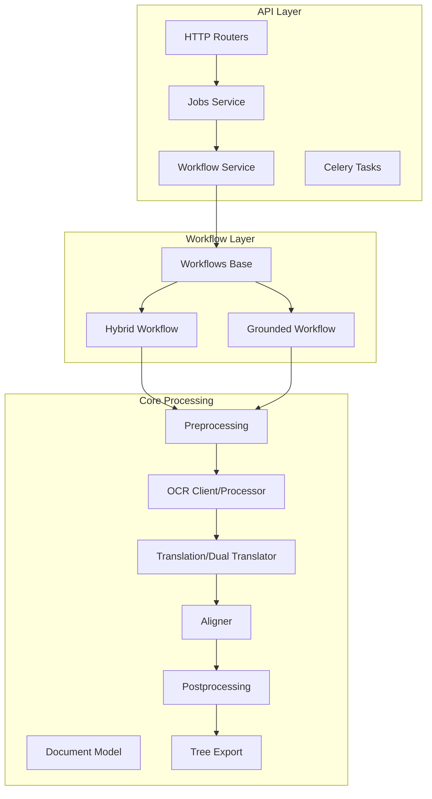
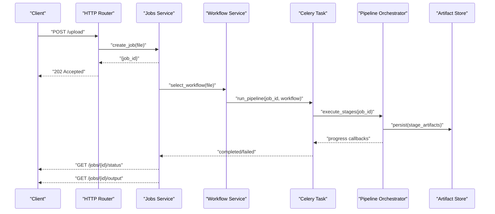
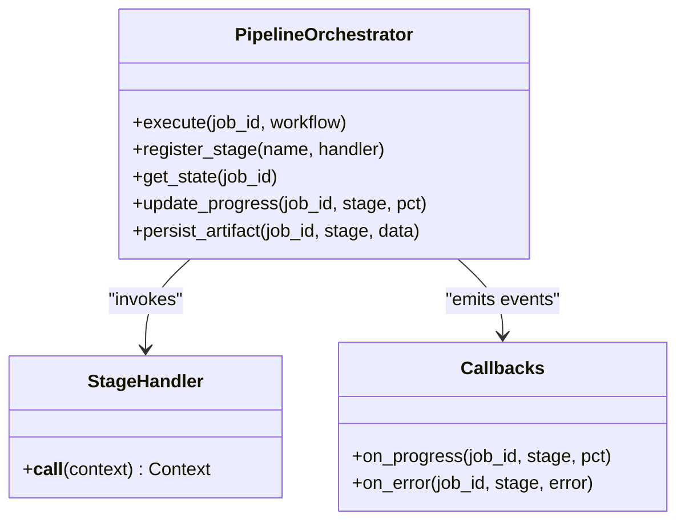
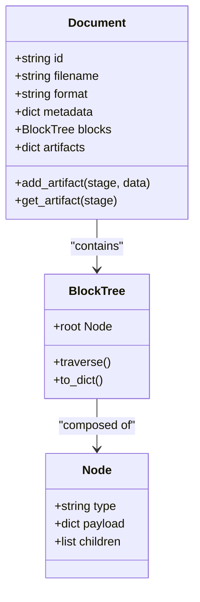
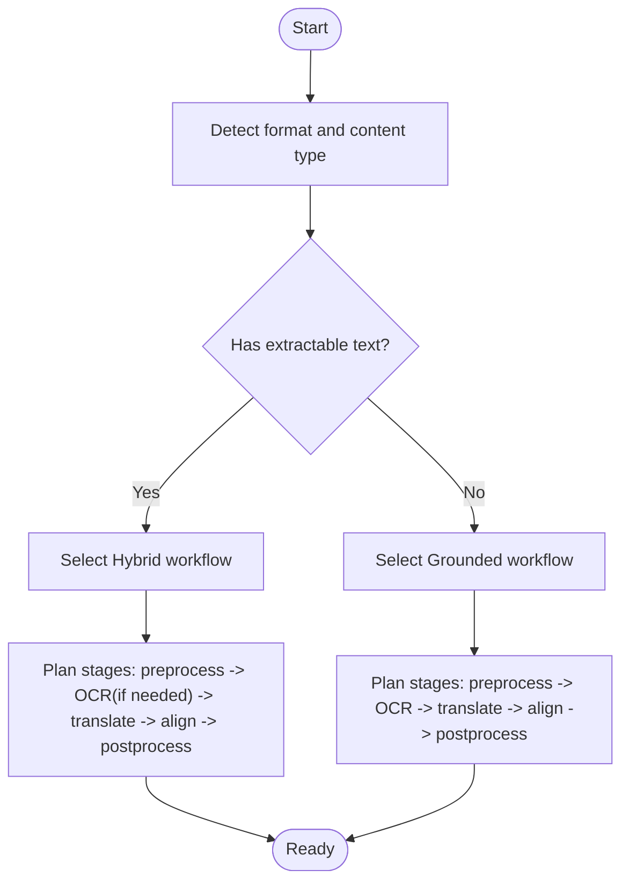
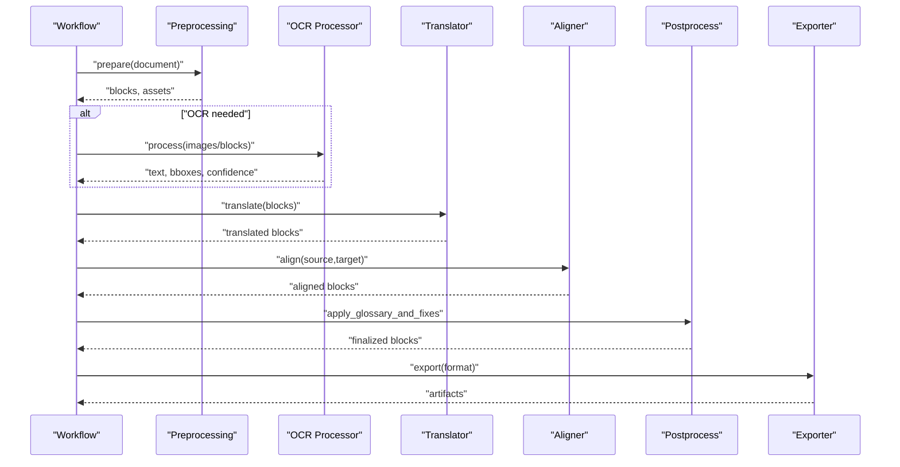
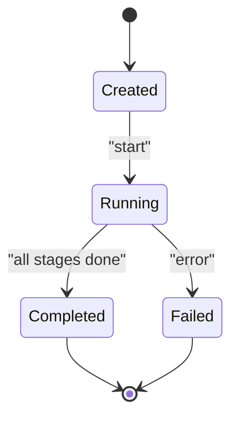
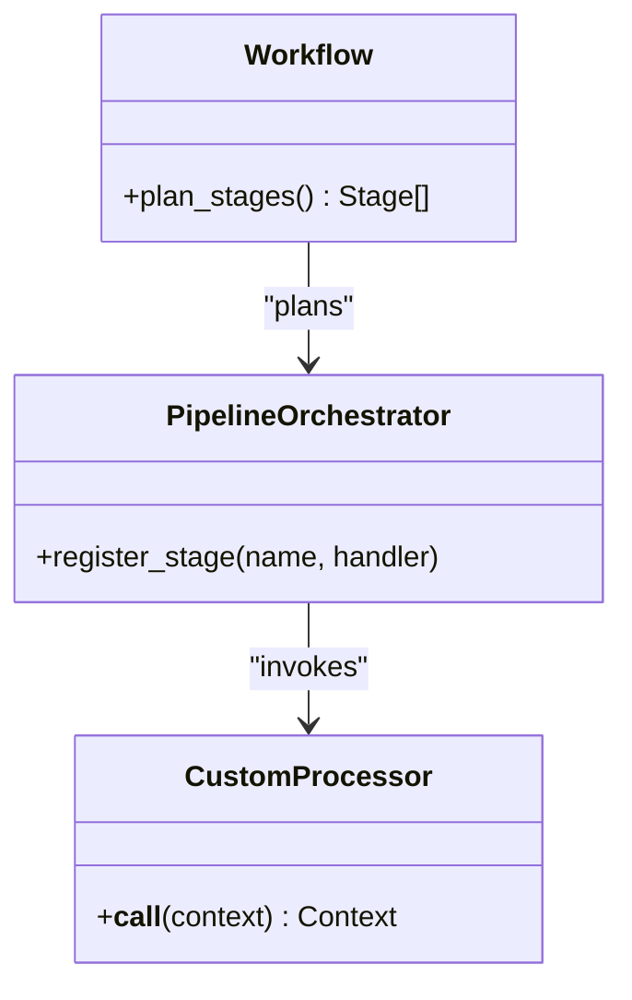
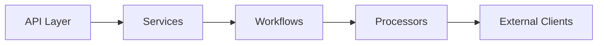

# Document Processing Pipeline

<cite>
**Referenced Files in This Document**
- [pipeline.py](file://src/local_deepl/pipeline.py)
- [server.py](file://src/local_deepl/server.py)
- [document.py](file://src/local_deepl/core/document.py)
- [processors.py](file://src/local_deepl/core/processors.py)
- [preprocessing.py](file://src/local_deepl/core/preprocessing.py)
- [postprocess.py](file://src/local_deepl/core/postprocess.py)
- [routing.py](file://src/local_deepl/core/routing.py)
- [workflows/base.py](file://src/local_deepl/core/workflows/base.py)
- [workflows/hybrid.py](file://src/local_deepl/core/workflows/hybrid.py)
- [workflows/grounded.py](file://src/local_deepl/core/workflows/grounded.py)
- [api/services/workflow.py](file://src/local_deepl/api/services/workflow.py)
- [api/services/jobs.py](file://src/local_deepl/api/services/jobs.py)
- [api/tasks.py](file://src/local_deepl/api/tasks.py)
- [core/ocr/client.py](file://src/local_deepl/core/ocr/client.py)
- [core/ocr/processor.py](file://src/local_deepl/core/ocr/processor.py)
- [core/translation.py](file://src/local_deepl/core/translation.py)
- [core/dual_translator.py](file://src/local_deepl/core/dual_translator.py)
- [core/block_tree.py](file://src/local_deepl/core/block_tree.py)
- [core/aligner.py](file://src/local_deepl/core/aligner.py)
- [core/tree_export.py](file://src/local_deepl/core/tree_export.py)
</cite>

## Table of Contents
1. [Introduction](#introduction)
2. [Project Structure](#project-structure)
3. [Core Components](#core-components)
4. [Architecture Overview](#architecture-overview)
5. [Detailed Component Analysis](#detailed-component-analysis)
6. [Dependency Analysis](#dependency-analysis)
7. [Performance Considerations](#performance-considerations)
8. [Troubleshooting Guide](#troubleshooting-guide)
9. [Conclusion](#conclusion)
10. [Appendices](#appendices)

## Introduction
This document explains LocalDeepL’s document processing pipeline architecture and end-to-end flow from upload through processing to output generation. It covers the execution model, stage-based processing, data transformation between stages, document model structure, metadata handling, state management, processor selection algorithms, format detection, error recovery mechanisms, performance optimization strategies, and how to extend the pipeline with custom processors and modified stages.

## Project Structure
The pipeline spans multiple layers:
- API layer: HTTP/WebSocket endpoints, job orchestration, and progress reporting.
- Workflow layer: Stage orchestration and routing logic for different processing modes (OCR, grounded, hybrid).
- Core processing: Document model, preprocessing, OCR, translation, alignment, postprocessing, and export.
- Utilities: Tree structures, exporters, and shared helpers.

**Diagram sources**
- [server.py](file://src/local_deepl/server.py)
- [api/services/workflow.py](file://src/local_deepl/api/services/workflow.py)
- [api/services/jobs.py](file://src/local_deepl/api/services/jobs.py)
- [api/tasks.py](file://src/local_deepl/api/tasks.py)
- [core/workflows/base.py](file://src/local_deepl/core/workflows/base.py)
- [core/workflows/hybrid.py](file://src/local_deepl/core/workflows/hybrid.py)
- [core/workflows/grounded.py](file://src/local_deepl/core/workflows/grounded.py)
- [core/document.py](file://src/local_deepl/core/document.py)
- [core/preprocessing.py](file://src/local_deepl/core/preprocessing.py)
- [core/ocr/client.py](file://src/local_deepl/core/ocr/client.py)
- [core/ocr/processor.py](file://src/local_deepl/core/ocr/processor.py)
- [core/translation.py](file://src/local_deepl/core/translation.py)
- [core/dual_translator.py](file://src/local_deepl/core/dual_translator.py)
- [core/aligner.py](file://src/local_deepl/core/aligner.py)
- [core/postprocess.py](file://src/local_deepl/core/postprocess.py)
- [core/tree_export.py](file://src/local_deepl/core/tree_export.py)

**Section sources**
- [server.py](file://src/local_deepl/server.py)
- [api/services/workflow.py](file://src/local_deepl/api/services/workflow.py)
- [api/services/jobs.py](file://src/local_deepl/api/services/jobs.py)
- [api/tasks.py](file://src/local_deepl/api/tasks.py)
- [core/workflows/base.py](file://src/local_deepl/core/workflows/base.py)
- [core/workflows/hybrid.py](file://src/local_deepl/core/workflows/hybrid.py)
- [core/workflows/grounded.py](file://src/local_deepl/core/workflows/grounded.py)
- [core/document.py](file://src/local_deepl/core/document.py)
- [core/preprocessing.py](file://src/local_deepl/core/preprocessing.py)
- [core/ocr/client.py](file://src/local_deepl/core/ocr/client.py)
- [core/ocr/processor.py](file://src/local_deepl/core/ocr/processor.py)
- [core/translation.py](file://src/local_deepl/core/translation.py)
- [core/dual_translator.py](file://src/local_deepl/core/dual_translator.py)
- [core/aligner.py](file://src/local_deepl/core/aligner.py)
- [core/postprocess.py](file://src/local_deepl/core/postprocess.py)
- [core/tree_export.py](file://src/local_deepl/core/tree_export.py)

## Core Components
- Pipeline orchestrator: Coordinates stages, manages state transitions, and persists artifacts across steps.
- Document model: Central representation carrying content, blocks, metadata, and intermediate results.
- Workflows: Strategy patterns that select and sequence stages based on input characteristics.
- Processors: Pluggable units for preprocessing, OCR, translation, alignment, and postprocessing.
- Job service: Manages long-running jobs, progress updates, and result retrieval.
- Task runner: Executes pipeline stages asynchronously via Celery.

Key responsibilities:
- Format detection and processor selection.
- Stage gating and conditional execution.
- Metadata enrichment and validation.
- Error capture and retry/recovery hooks.
- Progress tracking and artifact storage.

**Section sources**
- [pipeline.py](file://src/local_deepl/pipeline.py)
- [core/document.py](file://src/local_deepl/core/document.py)
- [core/workflows/base.py](file://src/local_deepl/core/workflows/base.py)
- [core/processors.py](file://src/local_deepl/core/processors.py)
- [api/services/jobs.py](file://src/local_deepl/api/services/jobs.py)
- [api/tasks.py](file://src/local_deepl/api/tasks.py)

## Architecture Overview
End-to-end flow:
- Upload: Client uploads a file; server validates and creates a job.
- Routing: Based on detected format and configuration, choose a workflow (hybrid or grounded).
- Stages: Preprocess -> OCR (if needed) -> Translate -> Align -> Postprocess -> Export.
- Output: Persist artifacts and return structured results; stream progress via WebSocket.

**Diagram sources**
- [server.py](file://src/local_deepl/server.py)
- [api/services/jobs.py](file://src/local_deepl/api/services/jobs.py)
- [api/services/workflow.py](file://src/local_deepl/api/services/workflow.py)
- [api/tasks.py](file://src/local_deepl/api/tasks.py)
- [pipeline.py](file://src/local_deepl/pipeline.py)

## Detailed Component Analysis

### Pipeline Orchestrator
Responsibilities:
- Define stage graph and execution order.
- Manage per-job state and artifacts.
- Invoke callbacks for progress and errors.
- Handle retries and fallbacks.

**Diagram sources**
- [pipeline.py](file://src/local_deepl/pipeline.py)
- [core/callbacks.py](file://src/local_deepl/core/callbacks.py)

**Section sources**
- [pipeline.py](file://src/local_deepl/pipeline.py)

### Document Model and Metadata
The document model encapsulates:
- Raw input references and normalized content.
- Block tree structure for layout-aware processing.
- Per-stage outputs (OCR text, translations, alignments).
- Metadata: filename, format, language hints, page counts, timestamps.

**Diagram sources**
- [core/document.py](file://src/local_deepl/core/document.py)
- [core/block_tree.py](file://src/local_deepl/core/block_tree.py)

**Section sources**
- [core/document.py](file://src/local_deepl/core/document.py)
- [core/block_tree.py](file://src/local_deepl/core/block_tree.py)

### Processor Selection and Format Detection
Selection algorithm:
- Detect input format (PDF, DOCX, images, etc.).
- Determine if OCR is required (image-only pages, scanned PDFs).
- Choose workflow:
  - Hybrid: Text extraction when available, OCR fallback for image regions.
  - Grounded: Layout-preserving processing with grounding information.

**Diagram sources**
- [core/routing.py](file://src/local_deepl/core/routing.py)
- [core/workflows/hybrid.py](file://src/local_deepl/core/workflows/hybrid.py)
- [core/workflows/grounded.py](file://src/local_deepl/core/workflows/grounded.py)

**Section sources**
- [core/routing.py](file://src/local_deepl/core/routing.py)
- [core/workflows/hybrid.py](file://src/local_deepl/core/workflows/hybrid.py)
- [core/workflows/grounded.py](file://src/local_deepl/core/workflows/grounded.py)

### Stage-Based Processing and Data Transformation
Stages and transformations:
- Preprocessing: Normalize inputs, split into blocks, compute page/image assets.
- OCR: Extract text from images/scanned pages; attach confidence and bounding boxes.
- Translation: Translate text segments while preserving structure; dual translator ensures consistency.
- Alignment: Reconcile source and target layouts; update block coordinates and anchors.
- Postprocessing: Apply glossaries, fix formatting, merge adjacent segments.
- Export: Serialize to desired formats (DOCX, HTML, JSON tree).

**Diagram sources**
- [core/preprocessing.py](file://src/local_deepl/core/preprocessing.py)
- [core/ocr/processor.py](file://src/local_deepl/core/ocr/processor.py)
- [core/ocr/client.py](file://src/local_deepl/core/ocr/client.py)
- [core/translation.py](file://src/local_deepl/core/translation.py)
- [core/dual_translator.py](file://src/local_deepl/core/dual_translator.py)
- [core/aligner.py](file://src/local_deepl/core/aligner.py)
- [core/postprocess.py](file://src/local_deepl/core/postprocess.py)
- [core/tree_export.py](file://src/local_deepl/core/tree_export.py)

**Section sources**
- [core/preprocessing.py](file://src/local_deepl/core/preprocessing.py)
- [core/ocr/processor.py](file://src/local_deepl/core/ocr/processor.py)
- [core/ocr/client.py](file://src/local_deepl/core/ocr/client.py)
- [core/translation.py](file://src/local_deepl/core/translation.py)
- [core/dual_translator.py](file://src/local_deepl/core/dual_translator.py)
- [core/aligner.py](file://src/local_deepl/core/aligner.py)
- [core/postprocess.py](file://src/local_deepl/core/postprocess.py)
- [core/tree_export.py](file://src/local_deepl/core/tree_export.py)

### State Management and Artifacts
- Job state machine: created -> running -> completed | failed.
- Per-stage artifacts stored under job namespace for replay and inspection.
- Progress emitted at stage boundaries and within long-running operations.

**Diagram sources**
- [api/services/jobs.py](file://src/local_deepl/api/services/jobs.py)
- [api/tasks.py](file://src/local_deepl/api/tasks.py)

**Section sources**
- [api/services/jobs.py](file://src/local_deepl/api/services/jobs.py)
- [api/tasks.py](file://src/local_deepl/api/tasks.py)

### Extending the Pipeline with Custom Processors
To add a new stage:
- Implement a callable processor adhering to the expected interface (input context -> transformed context).
- Register the processor with the pipeline or workflow.
- Optionally integrate with progress callbacks and artifact persistence.
- Update routing/workflow planning to include your stage where appropriate.

**Diagram sources**
- [core/processors.py](file://src/local_deepl/core/processors.py)
- [pipeline.py](file://src/local_deepl/pipeline.py)
- [core/workflows/base.py](file://src/local_deepl/core/workflows/base.py)

**Section sources**
- [core/processors.py](file://src/local_deepl/core/processors.py)
- [pipeline.py](file://src/local_deepl/pipeline.py)
- [core/workflows/base.py](file://src/local_deepl/core/workflows/base.py)

## Dependency Analysis
High-level dependencies:
- API depends on services and tasks.
- Services depend on workflows and job state.
- Workflows depend on core processors and utilities.
- Core processors depend on external clients (OCR, LLM/translation engines).

**Diagram sources**
- [server.py](file://src/local_deepl/server.py)
- [api/services/workflow.py](file://src/local_deepl/api/services/workflow.py)
- [api/services/jobs.py](file://src/local_deepl/api/services/jobs.py)
- [api/tasks.py](file://src/local_deepl/api/tasks.py)
- [core/workflows/base.py](file://src/local_deepl/core/workflows/base.py)
- [core/ocr/client.py](file://src/local_deepl/core/ocr/client.py)
- [core/translation.py](file://src/local_deepl/core/translation.py)

**Section sources**
- [server.py](file://src/local_deepl/server.py)
- [api/services/workflow.py](file://src/local_deepl/api/services/workflow.py)
- [api/services/jobs.py](file://src/local_deepl/api/services/jobs.py)
- [api/tasks.py](file://src/local_deepl/api/tasks.py)
- [core/workflows/base.py](file://src/local_deepl/core/workflows/base.py)
- [core/ocr/client.py](file://src/local_deepl/core/ocr/client.py)
- [core/translation.py](file://src/local_deepl/core/translation.py)

## Performance Considerations
- Parallelize independent stages (e.g., OCR per page/image) using task queues.
- Cache repeated computations (e.g., OCR results, translation lookups).
- Stream large artifacts and avoid loading entire documents into memory.
- Use efficient block traversal and incremental updates during alignment.
- Tune batch sizes for translation and OCR to balance throughput and latency.
- Enable compression for persisted artifacts where applicable.

[No sources needed since this section provides general guidance]

## Troubleshooting Guide
Common issues and remedies:
- OCR failures: Check client connectivity, retry with backoff, fall back to lower resolution or different engine.
- Translation timeouts: Increase timeout limits, reduce batch size, enable dual translator fallback.
- Alignment mismatches: Validate coordinate systems, ensure consistent block IDs, inspect confidence scores.
- Artifact corruption: Verify serialization format, re-run failing stages with saved inputs.
- Progress not updating: Ensure callbacks are wired and Celery worker logs are inspected.

Operational checks:
- Inspect job status and last stage.
- Retrieve stage artifacts for debugging.
- Review error logs and stack traces from workers.

**Section sources**
- [api/services/jobs.py](file://src/local_deepl/api/services/jobs.py)
- [api/tasks.py](file://src/local_deepl/api/tasks.py)
- [core/ocr/client.py](file://src/local_deepl/core/ocr/client.py)
- [core/translation.py](file://src/local_deepl/core/translation.py)
- [core/aligner.py](file://src/local_deepl/core/aligner.py)

## Conclusion
LocalDeepL’s pipeline is a modular, stage-based system orchestrated by workflows that adapt to document characteristics. The design emphasizes clear separation of concerns, pluggable processors, robust state and artifact management, and extensibility for custom processing needs. By following the extension guidelines and leveraging performance and troubleshooting practices, teams can tailor the pipeline to diverse document types and operational requirements.

## Appendices

### Example: Modifying Processing Stages
- Add a new stage after translation to normalize terminology before alignment.
- Integrate a quality check stage to gate downstream processing based on confidence thresholds.
- Customize exporter to produce additional formats or embed provenance metadata.

**Section sources**
- [core/workflows/base.py](file://src/local_deepl/core/workflows/base.py)
- [core/tree_export.py](file://src/local_deepl/core/tree_export.py)
- [core/postprocess.py](file://src/local_deepl/core/postprocess.py)