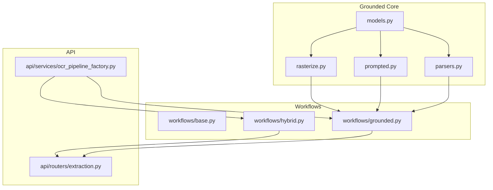
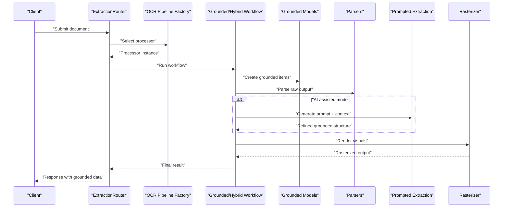
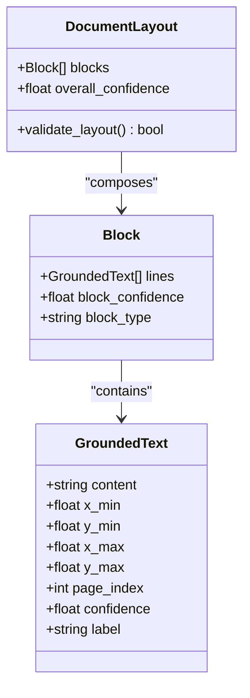
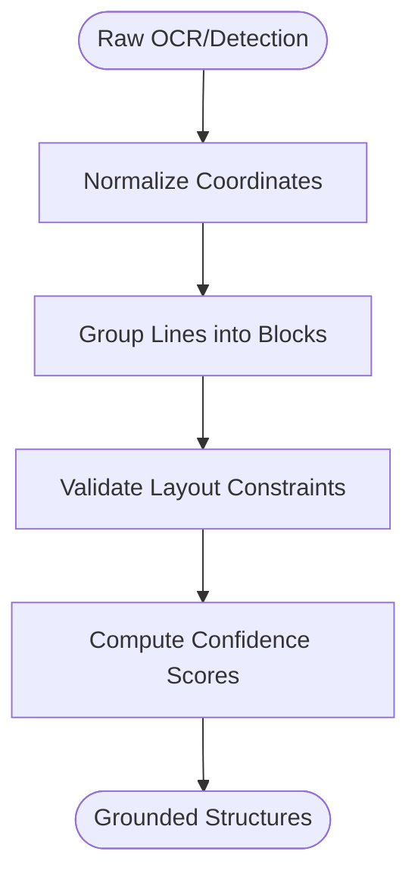
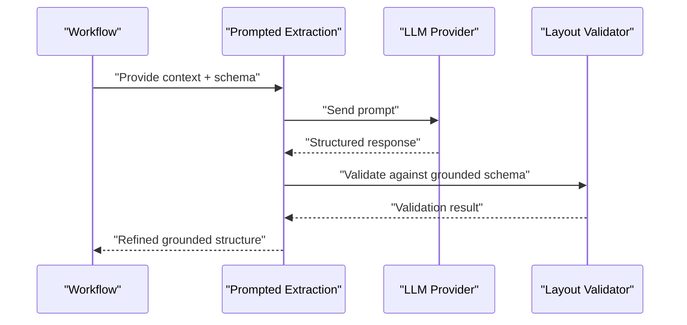
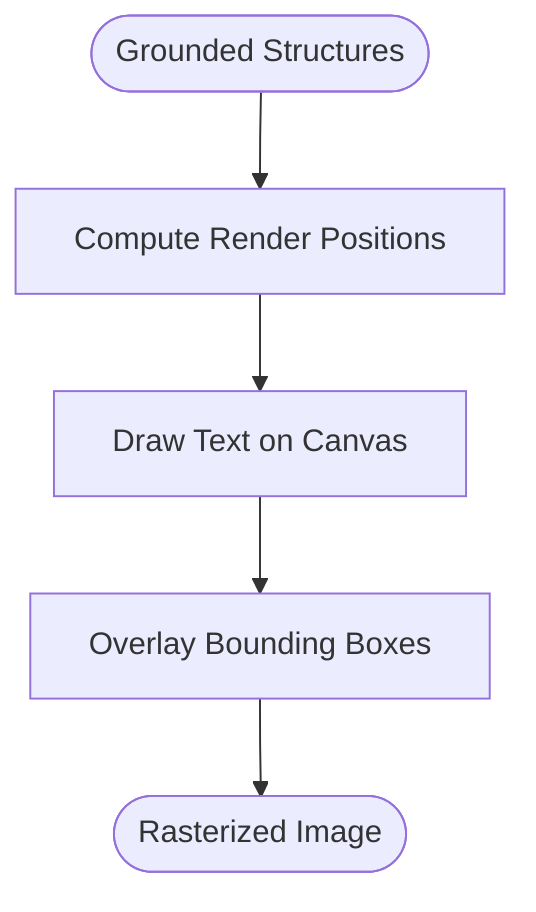
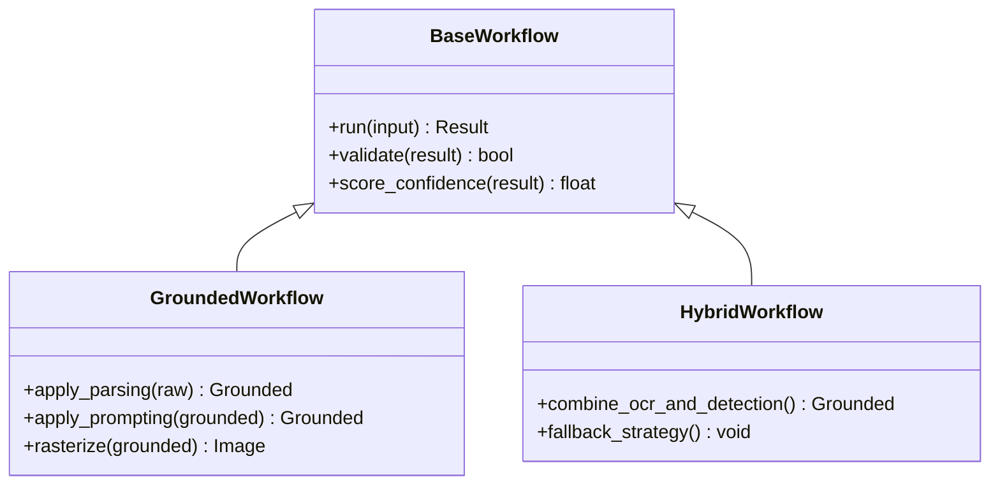
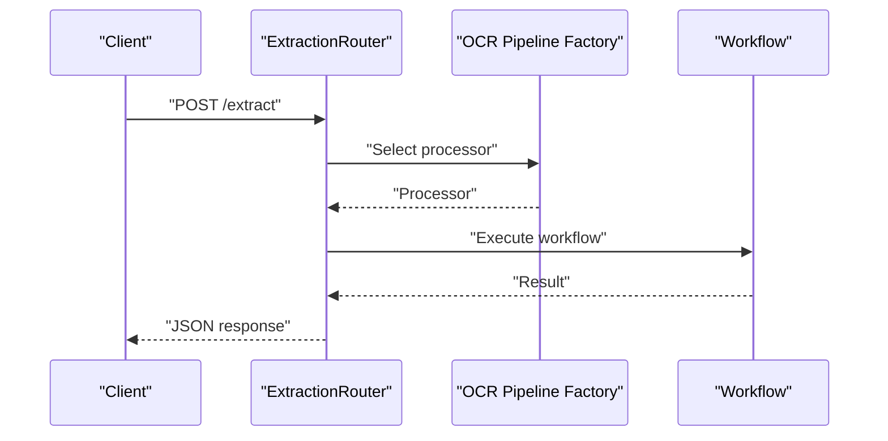
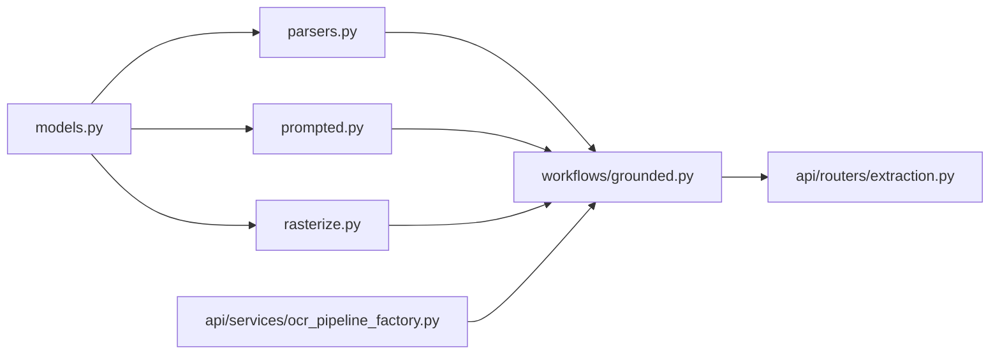

# Grounded Text Extraction

<cite>
**Referenced Files in This Document**
- [models.py](file://src/local_deepl/core/grounded/models.py)
- [parsers.py](file://src/local_deepl/core/grounded/parsers.py)
- [prompted.py](file://src/local_deepl/core/grounded/prompted.py)
- [rasterize.py](file://src/local_deepl/core/grounded/rasterize.py)
- [grounded.py](file://src/local_deepl/core/workflows/grounded.py)
- [hybrid.py](file://src/local_deepl/core/workflows/hybrid.py)
- [base.py](file://src/local_deepl/core/workflows/base.py)
- [extraction.py](file://src/local_deepl/api/routers/extraction.py)
- [ocr_pipeline_factory.py](file://src/local_deepl/api/services/ocr_pipeline_factory.py)
- [test_grounded.py](file://tests/test_grounded.py)
- [test_workflows_grounded.py](file://tests/test_workflows_grounded.py)
</cite>

## Table of Contents
1. [Introduction](#introduction)
2. [Project Structure](#project-structure)
3. [Core Components](#core-components)
4. [Architecture Overview](#architecture-overview)
5. [Detailed Component Analysis](#detailed-component-analysis)
6. [Dependency Analysis](#dependency-analysis)
7. [Performance Considerations](#performance-considerations)
8. [Troubleshooting Guide](#troubleshooting-guide)
9. [Conclusion](#conclusion)
10. [Appendices](#appendices)

## Introduction
This document explains LocalDeepL’s grounded text extraction system, which performs spatial-aware text extraction that preserves document layout and positioning information. It covers:
- The grounded models used to represent text with coordinates
- Parsing mechanisms for extracting structured content
- The prompting system for AI-assisted extraction
- Rasterization for converting extracted text back to visual representations
- Confidence scoring, layout validation, and integration with the broader processing pipeline
- Examples of customizing extraction prompts and optimizing for specific document layouts

The goal is to provide both a conceptual overview and code-level insights so you can understand, customize, and extend the system effectively.

## Project Structure
The grounded text extraction functionality is implemented under src/local_deepl/core/grounded and integrated via workflows and API services. Key modules include:
- Grounded data models and parsing utilities
- Prompt-driven extraction logic
- Rasterization utilities for visual reconstruction
- Workflow orchestration for end-to-end pipelines
- API endpoints and service wiring for external access

**Diagram sources**
- [models.py](file://src/local_deepl/core/grounded/models.py)
- [parsers.py](file://src/local_deepl/core/grounded/parsers.py)
- [prompted.py](file://src/local_deepl/core/grounded/prompted.py)
- [rasterize.py](file://src/local_deepl/core/grounded/rasterize.py)
- [grounded.py](file://src/local_deepl/core/workflows/grounded.py)
- [hybrid.py](file://src/local_deepl/core/workflows/hybrid.py)
- [base.py](file://src/local_deepl/core/workflows/base.py)
- [extraction.py](file://src/local_deepl/api/routers/extraction.py)
- [ocr_pipeline_factory.py](file://src/local_deepl/api/services/ocr_pipeline_factory.py)

**Section sources**
- [models.py](file://src/local_deepl/core/grounded/models.py)
- [parsers.py](file://src/local_deepl/core/grounded/parsers.py)
- [prompted.py](file://src/local_deepl/core/grounded/prompted.py)
- [rasterize.py](file://src/local_deepl/core/grounded/rasterize.py)
- [grounded.py](file://src/local_deepl/core/workflows/grounded.py)
- [hybrid.py](file://src/local_deepl/core/workflows/hybrid.py)
- [base.py](file://src/local_deepl/core/workflows/base.py)
- [extraction.py](file://src/local_deepl/api/routers/extraction.py)
- [ocr_pipeline_factory.py](file://src/local_deepl/api/services/ocr_pipeline_factory.py)

## Core Components
- Grounded models define how text elements are represented with spatial coordinates and metadata (e.g., bounding boxes, confidence scores). These models serve as the canonical representation throughout the pipeline.
- Parsers transform raw OCR or detection outputs into grounded structures, aligning text spans with their positions and grouping them into logical blocks.
- Prompted extraction leverages an LLM to refine or reconstruct structured content while preserving grounding information. Prompts can be customized per document type or layout.
- Rasterization converts grounded text back into visual form by rendering text at specified coordinates, enabling verification and downstream visualization.
- Workflows orchestrate the end-to-end process, integrating OCR, grounding, parsing, prompting, and rasterization steps. They also handle confidence scoring and layout validation.
- API layer exposes extraction capabilities through REST endpoints and integrates with the OCR pipeline factory to select appropriate processors.

**Section sources**
- [models.py](file://src/local_deepl/core/grounded/models.py)
- [parsers.py](file://src/local_deepl/core/grounded/parsers.py)
- [prompted.py](file://src/local_deepl/core/grounded/prompted.py)
- [rasterize.py](file://src/local_deepl/core/grounded/rasterize.py)
- [grounded.py](file://src/local_deepl/core/workflows/grounded.py)
- [hybrid.py](file://src/local_deepl/core/workflows/hybrid.py)
- [base.py](file://src/local_deepl/core/workflows/base.py)
- [extraction.py](file://src/local_deepl/api/routers/extraction.py)
- [ocr_pipeline_factory.py](file://src/local_deepl/api/services/ocr_pipeline_factory.py)

## Architecture Overview
The grounded extraction architecture follows a layered design:
- Input layer accepts images or PDFs and routes them to OCR or hybrid processors
- Processing layer applies OCR, grounding, parsing, and optional LLM prompting
- Output layer produces grounded structures and optionally rasterized visuals
- Validation and confidence scoring ensure quality and consistency
- API endpoints expose these capabilities to clients

**Diagram sources**
- [extraction.py](file://src/local_deepl/api/routers/extraction.py)
- [ocr_pipeline_factory.py](file://src/local_deepl/api/services/ocr_pipeline_factory.py)
- [grounded.py](file://src/local_deepl/core/workflows/grounded.py)
- [hybrid.py](file://src/local_deepl/core/workflows/hybrid.py)
- [models.py](file://src/local_deepl/core/grounded/models.py)
- [parsers.py](file://src/local_deepl/core/grounded/parsers.py)
- [prompted.py](file://src/local_deepl/core/grounded/prompted.py)
- [rasterize.py](file://src/local_deepl/core/grounded/rasterize.py)

## Detailed Component Analysis

### Grounded Models
The grounded models define the canonical representation for text with spatial coordinates. Typical attributes include:
- Text content
- Bounding box coordinates (x_min, y_min, x_max, y_max)
- Page or image index
- Confidence score
- Optional semantic labels (e.g., heading, paragraph, table cell)

These models enable consistent handling across parsing, prompting, and rasterization.

**Diagram sources**
- [models.py](file://src/local_deepl/core/grounded/models.py)

**Section sources**
- [models.py](file://src/local_deepl/core/grounded/models.py)

### Parsers
Parsers convert raw OCR or detection outputs into grounded structures. Responsibilities include:
- Aligning text spans with bounding boxes
- Grouping lines into blocks
- Normalizing coordinate systems
- Assigning initial confidence scores
- Validating basic layout constraints (e.g., non-overlapping blocks)

**Diagram sources**
- [parsers.py](file://src/local_deepl/core/grounded/parsers.py)

**Section sources**
- [parsers.py](file://src/local_deepl/core/grounded/parsers.py)

### Prompted Extraction
Prompted extraction uses an LLM to refine or reconstruct structured content while preserving grounding. Key aspects:
- Constructing prompts tailored to document types and layouts
- Injecting contextual information (e.g., existing grounded hints)
- Ensuring output adheres to grounded model schema
- Post-processing to validate and reconcile LLM outputs with spatial constraints

**Diagram sources**
- [prompted.py](file://src/local_deepl/core/grounded/prompted.py)
- [grounded.py](file://src/local_deepl/core/workflows/grounded.py)

**Section sources**
- [prompted.py](file://src/local_deepl/core/grounded/prompted.py)
- [grounded.py](file://src/local_deepl/core/workflows/grounded.py)

### Rasterization
Rasterization converts grounded text back into visual representations by rendering text at specified coordinates. Use cases include:
- Visual verification of extraction accuracy
- Debugging alignment issues
- Generating annotated previews

**Diagram sources**
- [rasterize.py](file://src/local_deepl/core/grounded/rasterize.py)

**Section sources**
- [rasterize.py](file://src/local_deepl/core/grounded/rasterize.py)

### Workflows Integration
Workflows orchestrate the end-to-end process, selecting processors, running OCR, applying grounding, parsing, optional prompting, and rasterization. They also manage confidence scoring and layout validation.

**Diagram sources**
- [base.py](file://src/local_deepl/core/workflows/base.py)
- [grounded.py](file://src/local_deepl/core/workflows/grounded.py)
- [hybrid.py](file://src/local_deepl/core/workflows/hybrid.py)

**Section sources**
- [base.py](file://src/local_deepl/core/workflows/base.py)
- [grounded.py](file://src/local_deepl/core/workflows/grounded.py)
- [hybrid.py](file://src/local_deepl/core/workflows/hybrid.py)

### API Layer Integration
The API exposes extraction endpoints and integrates with the OCR pipeline factory to select appropriate processors based on input characteristics.

**Diagram sources**
- [extraction.py](file://src/local_deepl/api/routers/extraction.py)
- [ocr_pipeline_factory.py](file://src/local_deepl/api/services/ocr_pipeline_factory.py)

**Section sources**
- [extraction.py](file://src/local_deepl/api/routers/extraction.py)
- [ocr_pipeline_factory.py](file://src/local_deepl/api/services/ocr_pipeline_factory.py)

## Dependency Analysis
The grounded extraction system has clear dependency boundaries:
- Grounded models are foundational and consumed by parsers, prompted extraction, and rasterization
- Parsers depend on models and may rely on preprocessing utilities
- Prompted extraction depends on models and LLM providers
- Rasterization depends on models and image rendering libraries
- Workflows orchestrate dependencies and enforce validation and scoring
- API layer depends on workflows and factory selection logic

**Diagram sources**
- [models.py](file://src/local_deepl/core/grounded/models.py)
- [parsers.py](file://src/local_deepl/core/grounded/parsers.py)
- [prompted.py](file://src/local_deepl/core/grounded/prompted.py)
- [rasterize.py](file://src/local_deepl/core/grounded/rasterize.py)
- [grounded.py](file://src/local_deepl/core/workflows/grounded.py)
- [extraction.py](file://src/local_deepl/api/routers/extraction.py)
- [ocr_pipeline_factory.py](file://src/local_deepl/api/services/ocr_pipeline_factory.py)

**Section sources**
- [models.py](file://src/local_deepl/core/grounded/models.py)
- [parsers.py](file://src/local_deepl/core/grounded/parsers.py)
- [prompted.py](file://src/local_deepl/core/grounded/prompted.py)
- [rasterize.py](file://src/local_deepl/core/grounded/rasterize.py)
- [grounded.py](file://src/local_deepl/core/workflows/grounded.py)
- [extraction.py](file://src/local_deepl/api/routers/extraction.py)
- [ocr_pipeline_factory.py](file://src/local_deepl/api/services/ocr_pipeline_factory.py)

## Performance Considerations
- Coordinate normalization should be efficient; avoid repeated conversions
- Grouping lines into blocks benefits from spatial clustering algorithms
- LLM prompting introduces latency; cache prompts and responses where possible
- Rasterization can be optimized by batching draws and minimizing canvas operations
- Confidence scoring should leverage heuristics to reduce unnecessary reprocessing
- Workflow fallback strategies prevent bottlenecks when components fail

[No sources needed since this section provides general guidance]

## Troubleshooting Guide
Common issues and resolutions:
- Misaligned bounding boxes: Verify coordinate normalization and scaling factors
- Low confidence scores: Adjust OCR thresholds or improve preprocessing
- Prompted extraction errors: Ensure schema compliance and provide clearer prompts
- Rasterization artifacts: Check font rendering settings and canvas dimensions
- Workflow failures: Inspect validation logs and fallback paths

Use tests to validate behavior:
- Unit tests for grounded components
- Integration tests for workflows and API endpoints

**Section sources**
- [test_grounded.py](file://tests/test_grounded.py)
- [test_workflows_grounded.py](file://tests/test_workflows_grounded.py)

## Conclusion
LocalDeepL’s grounded text extraction system provides a robust, spatial-aware approach to preserving document layout and positioning. By combining grounded models, parsing, AI-assisted prompting, and rasterization within orchestrated workflows, it delivers high-quality structured outputs suitable for diverse document types. Customizable prompts and optimization strategies enable adaptation to specific layouts and use cases.

[No sources needed since this section summarizes without analyzing specific files]

## Appendices

### Customizing Extraction Prompts
- Define document-specific schemas and examples in prompts
- Include contextual hints such as known headings or table structures
- Iterate on prompts based on validation feedback and confidence scores

### Optimizing for Specific Document Layouts
- Tune grouping thresholds for dense or sparse layouts
- Adjust rasterization parameters for better visual fidelity
- Select appropriate processors via the OCR pipeline factory based on input characteristics

[No sources needed since this section provides general guidance]