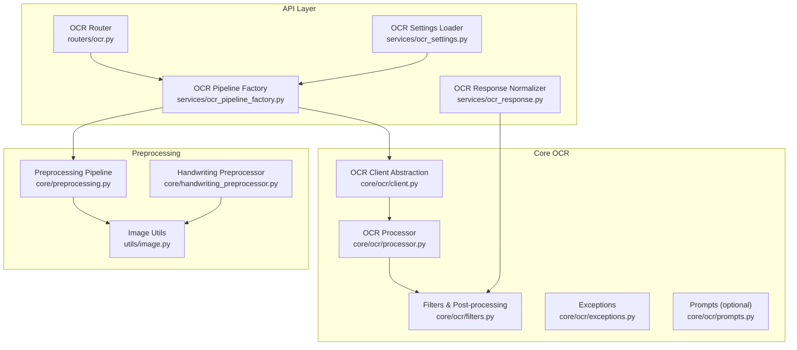
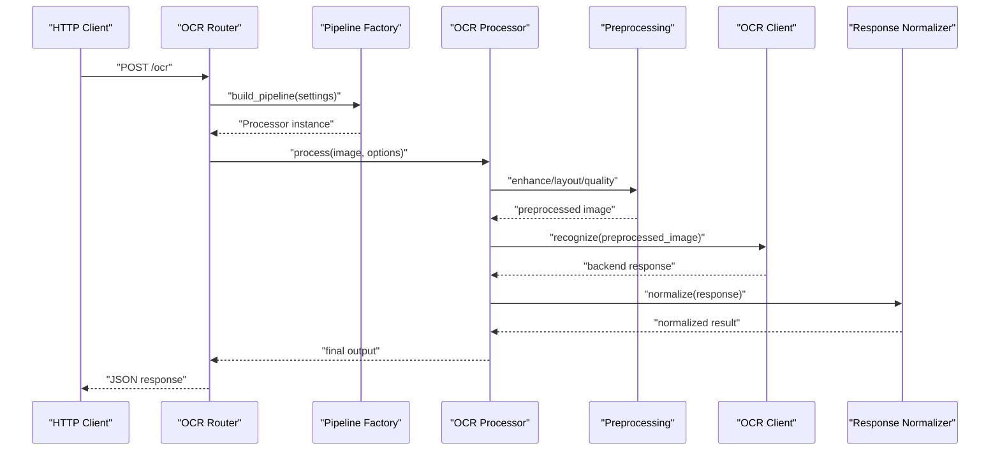
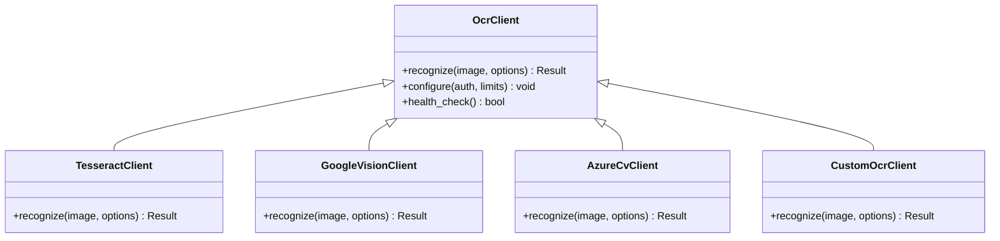
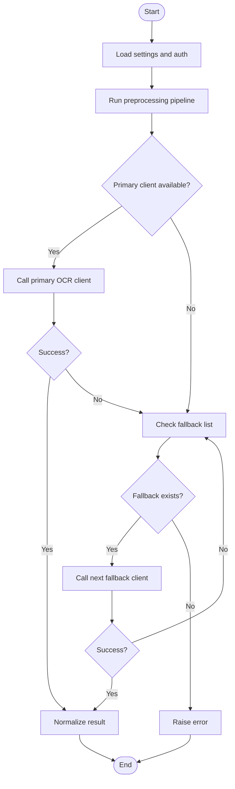
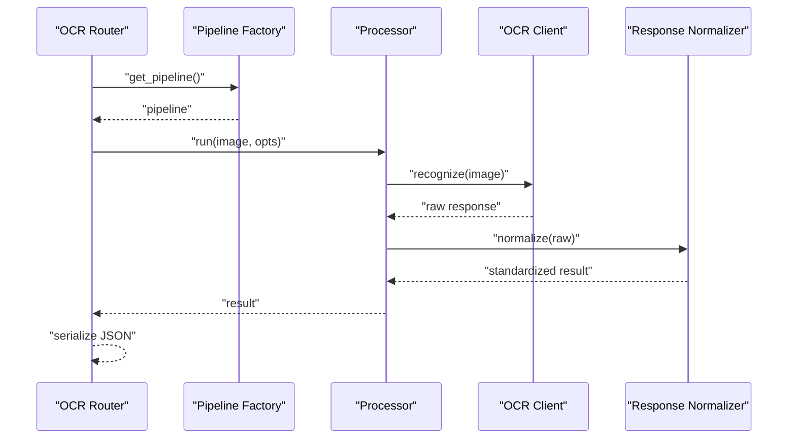
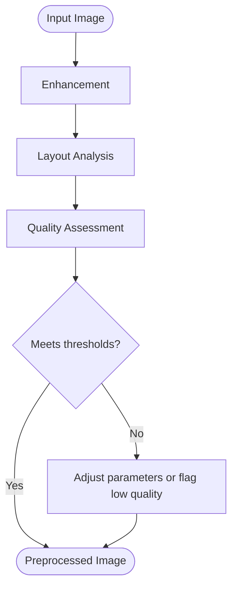
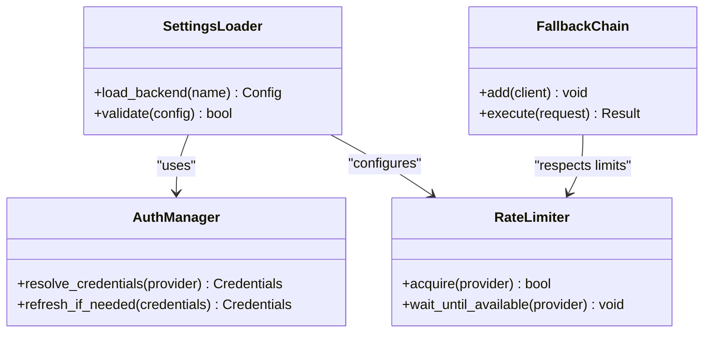
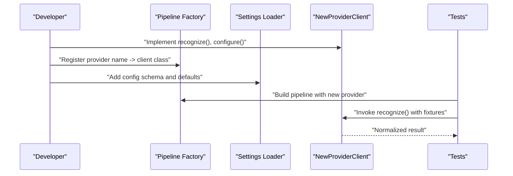
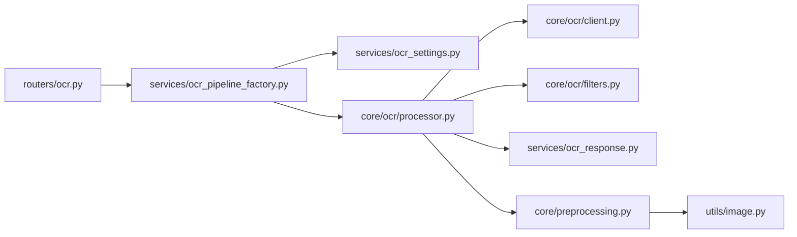

# OCR Engine Integration

<cite>
**Referenced Files in This Document**
- [src/local_deepl/core/ocr/client.py](file://src/local_deepl/core/ocr/client.py)
- [src/local_deepl/core/ocr/processor.py](file://src/local_deepl/core/ocr/processor.py)
- [src/local_deepl/core/ocr/filters.py](file://src/local_deepl/core/ocr/filters.py)
- [src/local_deepl/core/ocr/prompts.py](file://src/local_deepl/core/ocr/prompts.py)
- [src/local_deepl/core/ocr/exceptions.py](file://src/local_deepl/core/ocr/exceptions.py)
- [src/local_deepl/api/services/ocr_pipeline_factory.py](file://src/local_deepl/api/services/ocr_pipeline_factory.py)
- [src/local_deepl/api/services/ocr_response.py](file://src/local_deepl/api/services/ocr_response.py)
- [src/local_deepl/api/services/ocr_settings.py](file://src/local_deepl/api/services/ocr_settings.py)
- [src/local_deepl/api/routers/ocr.py](file://src/local_deepl/api/routers/ocr.py)
- [src/local_deepl/core/preprocessing.py](file://src/local_deepl/core/preprocessing.py)
- [src/local_deepl/core/handwriting_preprocessor.py](file://src/local_deepl/core/handwriting_preprocessor.py)
- [src/local_deepl/utils/image.py](file://src/local_deepl/utils/image.py)
- [tests/test_ocr.py](file://tests/test_ocr.py)
</cite>

## Table of Contents
1. [Introduction](#introduction)
2. [Project Structure](#project-structure)
3. [Core Components](#core-components)
4. [Architecture Overview](#architecture-overview)
5. [Detailed Component Analysis](#detailed-component-analysis)
6. [Dependency Analysis](#dependency-analysis)
7. [Performance Considerations](#performance-considerations)
8. [Troubleshooting Guide](#troubleshooting-guide)
9. [Conclusion](#conclusion)
10. [Appendices](#appendices)

## Introduction
This document explains LocalDeepL’s pluggable OCR engine integration system. It covers the client abstraction for multiple backends (Tesseract, Google Vision, Azure Computer Vision, and custom engines), request/response handling, result normalization, preprocessing pipeline (image enhancement, layout analysis, quality assessment), configuration options, authentication setup, rate limiting, fallback mechanisms, and guidance for integrating new providers and optimizing accuracy for specific document types.

## Project Structure
The OCR subsystem is organized into:
- Core OCR abstractions and processors under src/local_deepl/core/ocr
- API services that wire pipelines and responses under src/local_deepl/api/services
- HTTP router exposing OCR endpoints under src/local_deepl/api/routers
- Preprocessing utilities under src/local_deepl/core and utils
- Tests validating behavior under tests

**Diagram sources**
- [src/local_deepl/api/routers/ocr.py](file://src/local_deepl/api/routers/ocr.py)
- [src/local_deepl/api/services/ocr_pipeline_factory.py](file://src/local_deepl/api/services/ocr_pipeline_factory.py)
- [src/local_deepl/api/services/ocr_response.py](file://src/local_deepl/api/services/ocr_response.py)
- [src/local_deepl/api/services/ocr_settings.py](file://src/local_deepl/api/services/ocr_settings.py)
- [src/local_deepl/core/ocr/client.py](file://src/local_deepl/core/ocr/client.py)
- [src/local_deepl/core/ocr/processor.py](file://src/local_deepl/core/ocr/processor.py)
- [src/local_deepl/core/ocr/filters.py](file://src/local_deepl/core/ocr/filters.py)
- [src/local_deepl/core/ocr/exceptions.py](file://src/local_deepl/core/ocr/exceptions.py)
- [src/local_deepl/core/ocr/prompts.py](file://src/local_deepl/core/ocr/prompts.py)
- [src/local_deepl/core/preprocessing.py](file://src/local_deepl/core/preprocessing.py)
- [src/local_deepl/core/handwriting_preprocessor.py](file://src/local_deepl/core/handwriting_preprocessor.py)
- [src/local_deepl/utils/image.py](file://src/local_deepl/utils/image.py)

**Section sources**
- [src/local_deepl/api/routers/ocr.py](file://src/local_deepl/api/routers/ocr.py)
- [src/local_deepl/api/services/ocr_pipeline_factory.py](file://src/local_deepl/api/services/ocr_pipeline_factory.py)
- [src/local_deepl/api/services/ocr_response.py](file://src/local_deepl/api/services/ocr_response.py)
- [src/local_deepl/api/services/ocr_settings.py](file://src/local_deepl/api/services/ocr_settings.py)
- [src/local_deepl/core/ocr/client.py](file://src/local_deepl/core/ocr/client.py)
- [src/local_deepl/core/ocr/processor.py](file://src/local_deepl/core/ocr/processor.py)
- [src/local_deepl/core/ocr/filters.py](file://src/local_deepl/core/ocr/filters.py)
- [src/local_deepl/core/ocr/exceptions.py](file://src/local_deepl/core/ocr/exceptions.py)
- [src/local_deepl/core/ocr/prompts.py](file://src/local_deepl/core/ocr/prompts.py)
- [src/local_deepl/core/preprocessing.py](file://src/local_deepl/core/preprocessing.py)
- [src/local_deepl/core/handwriting_preprocessor.py](file://src/local_deepl/core/handwriting_preprocessor.py)
- [src/local_deepl/utils/image.py](file://src/local_deepl/utils/image.py)

## Core Components
- OCR Client Abstraction: Defines a unified interface to call different OCR backends and normalize their outputs.
- OCR Processor: Orchestrates preprocessing, backend calls, filtering, and post-processing steps.
- Filters: Applies heuristics and rules to refine OCR results (e.g., confidence thresholds, noise removal).
- Exceptions: Custom error types for upstream failures, timeouts, and invalid responses.
- Prompts: Optional prompt templates used by LLM-assisted refinement or grounding flows.
- Pipeline Factory: Builds an OCR pipeline from settings, selecting the active backend(s) and fallbacks.
- Response Normalizer: Converts backend-specific payloads into a consistent internal representation.
- Settings Loader: Loads and validates configuration for each OCR provider.
- Preprocessing: Image enhancement, layout analysis, and quality assessment prior to OCR.
- Handwriting Preprocessor: Specialized enhancements for handwritten documents.
- Image Utils: Shared image operations used across preprocessing and OCR.

**Section sources**
- [src/local_deepl/core/ocr/client.py](file://src/local_deepl/core/ocr/client.py)
- [src/local_deepl/core/ocr/processor.py](file://src/local_deepl/core/ocr/processor.py)
- [src/local_deepl/core/ocr/filters.py](file://src/local_deepl/core/ocr/filters.py)
- [src/local_deepl/core/ocr/exceptions.py](file://src/local_deepl/core/ocr/exceptions.py)
- [src/local_deepl/core/ocr/prompts.py](file://src/local_deepl/core/ocr/prompts.py)
- [src/local_deepl/api/services/ocr_pipeline_factory.py](file://src/local_deepl/api/services/ocr_pipeline_factory.py)
- [src/local_deepl/api/services/ocr_response.py](file://src/local_deepl/api/services/ocr_response.py)
- [src/local_deepl/api/services/ocr_settings.py](file://src/local_deepl/api/services/ocr_settings.py)
- [src/local_deeepl/core/preprocessing.py](file://src/local_deepl/core/preprocessing.py)
- [src/local_deepl/core/handwriting_preprocessor.py](file://src/local_deepl/core/handwriting_preprocessor.py)
- [src/local_deepl/utils/image.py](file://src/local_deepl/utils/image.py)

## Architecture Overview
The OCR flow starts at the API router, which delegates to a pipeline factory configured via settings. The factory constructs a processor that runs preprocessing, invokes the selected OCR client(s), applies filters, and normalizes results.

**Diagram sources**
- [src/local_deepl/api/routers/ocr.py](file://src/local_deepl/api/routers/ocr.py)
- [src/local_deepl/api/services/ocr_pipeline_factory.py](file://src/local_deepl/api/services/ocr_pipeline_factory.py)
- [src/local_deepl/core/ocr/processor.py](file://src/local_deepl/core/ocr/processor.py)
- [src/local_deepl/core/preprocessing.py](file://src/local_deepl/core/preprocessing.py)
- [src/local_deepl/core/ocr/client.py](file://src/local_deepl/core/ocr/client.py)
- [src/local_deepl/api/services/ocr_response.py](file://src/local_deepl/api/services/ocr_response.py)

## Detailed Component Analysis

### OCR Client Abstraction
The client layer defines a uniform interface for OCR backends. Implementations encapsulate provider-specific requests, authentication, retries, and response parsing. The abstraction ensures the rest of the system remains decoupled from provider details.

Key responsibilities:
- Unified recognize() method signature
- Provider-specific request building and response parsing
- Authentication and token management
- Rate limiting and retry/backoff policies
- Error mapping to common exception types

**Diagram sources**
- [src/local_deepl/core/ocr/client.py](file://src/local_deepl/core/ocr/client.py)

**Section sources**
- [src/local_deepl/core/ocr/client.py](file://src/local_deepl/core/ocr/client.py)

### OCR Processor
The processor coordinates the full OCR workflow:
- Invokes preprocessing (enhancement, layout analysis, quality assessment)
- Calls one or more OCR clients with optional fallbacks
- Applies filters to refine results
- Produces normalized output

**Diagram sources**
- [src/local_deepl/core/ocr/processor.py](file://src/local_deepl/core/ocr/processor.py)
- [src/local_deepl/api/services/ocr_pipeline_factory.py](file://src/local_deepl/api/services/ocr_pipeline_factory.py)
- [src/local_deepl/core/ocr/filters.py](file://src/local_deepl/core/ocr/filters.py)
- [src/local_deepl/core/ocr/exceptions.py](file://src/local_deepl/core/ocr/exceptions.py)

**Section sources**
- [src/local_deepl/core/ocr/processor.py](file://src/local_deepl/core/ocr/processor.py)
- [src/local_deepl/api/services/ocr_pipeline_factory.py](file://src/local_deepl/api/services/ocr_pipeline_factory.py)
- [src/local_deepl/core/ocr/filters.py](file://src/local_deepl/core/ocr/filters.py)
- [src/local_deepl/core/ocr/exceptions.py](file://src/local_deepl/core/ocr/exceptions.py)

### Request/Response Handling and Normalization
- Request handling: The router accepts images and OCR options, builds context, and delegates to the pipeline factory and processor.
- Response normalization: Backend-specific payloads are converted into a consistent schema including text blocks, bounding boxes, confidence scores, and metadata.

**Diagram sources**
- [src/local_deepl/api/routers/ocr.py](file://src/local_deepl/api/routers/ocr.py)
- [src/local_deepl/api/services/ocr_pipeline_factory.py](file://src/local_deepl/api/services/ocr_pipeline_factory.py)
- [src/local_deepl/core/ocr/processor.py](file://src/local_deepl/core/ocr/processor.py)
- [src/local_deepl/core/ocr/client.py](file://src/local_deepl/core/ocr/client.py)
- [src/local_deepl/api/services/ocr_response.py](file://src/local_deepl/api/services/ocr_response.py)

**Section sources**
- [src/local_deepl/api/routers/ocr.py](file://src/local_deepl/api/routers/ocr.py)
- [src/local_deepl/api/services/ocr_response.py](file://src/local_deepl/api/services/ocr_response.py)

### Preprocessing Pipeline
The preprocessing stage prepares images for optimal OCR performance:
- Enhancement: contrast adjustment, denoising, deskewing, binarization
- Layout analysis: page segmentation, column detection, region isolation
- Quality assessment: blur/sharpness checks, resolution validation, skew estimation

**Diagram sources**
- [src/local_deepl/core/preprocessing.py](file://src/local_deepl/core/preprocessing.py)
- [src/local_deepl/core/handwriting_preprocessor.py](file://src/local_deepl/core/handwriting_preprocessor.py)
- [src/local_deepl/utils/image.py](file://src/local_deepl/utils/image.py)

**Section sources**
- [src/local_deepl/core/preprocessing.py](file://src/local_deepl/core/preprocessing.py)
- [src/local_deepl/core/handwriting_preprocessor.py](file://src/local_deepl/core/handwriting_preprocessor.py)
- [src/local_deepl/utils/image.py](file://src/local_deepl/utils/image.py)

### Configuration, Authentication, Rate Limiting, and Fallbacks
- Configuration: Centralized settings loader provides per-backend options (languages, modes, endpoints).
- Authentication: Provider credentials are loaded securely and injected into client instances.
- Rate Limiting: Clients enforce per-provider quotas and backoff strategies.
- Fallbacks: Processor attempts primary client then iterates through configured fallbacks on failure.

**Diagram sources**
- [src/local_deepl/api/services/ocr_settings.py](file://src/local_deepl/api/services/ocr_settings.py)
- [src/local_deepl/core/ocr/client.py](file://src/local_deepl/core/ocr/client.py)
- [src/local_deepl/core/ocr/processor.py](file://src/local_deepl/core/ocr/processor.py)

**Section sources**
- [src/local_deepl/api/services/ocr_settings.py](file://src/local_deepl/api/services/ocr_settings.py)
- [src/local_deepl/core/ocr/client.py](file://src/local_deepl/core/ocr/client.py)
- [src/local_deepl/core/ocr/processor.py](file://src/local_deepl/core/ocr/processor.py)

### Integrating a New OCR Provider
Steps to add a new backend:
1. Implement a new client class conforming to the OCR client interface.
2. Register the client in the pipeline factory so it can be selected by name.
3. Add configuration keys and authentication fields in the settings loader.
4. Optionally extend filters or prompts if your provider requires special handling.
5. Add tests to validate request/response mapping and error paths.

**Diagram sources**
- [src/local_deepl/api/services/ocr_pipeline_factory.py](file://src/local_deepl/api/services/ocr_pipeline_factory.py)
- [src/local_deepl/api/services/ocr_settings.py](file://src/local_deepl/api/services/ocr_settings.py)
- [src/local_deepl/core/ocr/client.py](file://src/local_deepl/core/ocr/client.py)
- [tests/test_ocr.py](file://tests/test_ocr.py)

**Section sources**
- [src/local_deepl/api/services/ocr_pipeline_factory.py](file://src/local_deepl/api/services/ocr_pipeline_factory.py)
- [src/local_deepl/api/services/ocr_settings.py](file://src/local_deepl/api/services/ocr_settings.py)
- [src/local_deepl/core/ocr/client.py](file://src/local_deepl/core/ocr/client.py)
- [tests/test_ocr.py](file://tests/test_ocr.py)

### Optimizing OCR Accuracy for Specific Document Types
- Printed documents: Use high-resolution scans, deskew, binarization, and language packs tuned for print fonts.
- Handwritten documents: Apply handwriting preprocessor, adaptive thresholding, and cursive-friendly models.
- Forms and tables: Enable layout analysis to isolate fields and table regions; consider post-processing to reconstruct structure.
- Low-quality inputs: Increase preprocessing robustness (denoise, contrast stretch), and enable fallback to stronger cloud providers.

[No sources needed since this section provides general guidance]

## Dependency Analysis
The OCR subsystem depends on:
- API layer for routing and orchestration
- Core OCR abstractions for backend independence
- Preprocessing and image utilities for input preparation
- Settings and response modules for configuration and normalization

**Diagram sources**
- [src/local_deepl/api/routers/ocr.py](file://src/local_deepl/api/routers/ocr.py)
- [src/local_deepl/api/services/ocr_pipeline_factory.py](file://src/local_deepl/api/services/ocr_pipeline_factory.py)
- [src/local_deepl/api/services/ocr_settings.py](file://src/local_deepl/api/services/ocr_settings.py)
- [src/local_deepl/core/ocr/processor.py](file://src/local_deepl/core/ocr/processor.py)
- [src/local_deepl/core/ocr/client.py](file://src/local_deepl/core/ocr/client.py)
- [src/local_deepl/core/ocr/filters.py](file://src/local_deepl/core/ocr/filters.py)
- [src/local_deepl/api/services/ocr_response.py](file://src/local_deepl/api/services/ocr_response.py)
- [src/local_deepl/core/preprocessing.py](file://src/local_deepl/core/preprocessing.py)
- [src/local_deepl/utils/image.py](file://src/local_deepl/utils/image.py)

**Section sources**
- [src/local_deepl/api/routers/ocr.py](file://src/local_deepl/api/routers/ocr.py)
- [src/local_deepl/api/services/ocr_pipeline_factory.py](file://src/local_deepl/api/services/ocr_pipeline_factory.py)
- [src/local_deepl/core/ocr/processor.py](file://src/local_deepl/core/ocr/processor.py)
- [src/local_deepl/core/ocr/client.py](file://src/local_deepl/core/ocr/client.py)
- [src/local_deepl/core/ocr/filters.py](file://src/local_deepl/core/ocr/filters.py)
- [src/local_deepl/api/services/ocr_response.py](file://src/local_deepl/api/services/ocr_response.py)
- [src/local_deepl/core/preprocessing.py](file://src/local_deepl/core/preprocessing.py)
- [src/local_deepl/utils/image.py](file://src/local_deepl/utils/image.py)

## Performance Considerations
- Prefer local OCR for speed when acceptable; use cloud backends for higher accuracy on difficult inputs.
- Cache frequent preprocessing outcomes for identical inputs to avoid recomputation.
- Tune preprocessing thresholds based on document characteristics to reduce false positives.
- Use concurrency carefully; respect provider rate limits and implement exponential backoff.
- Monitor latency and error rates per backend to inform dynamic fallback decisions.

[No sources needed since this section provides general guidance]

## Troubleshooting Guide
Common issues and remedies:
- Authentication failures: Verify credentials and scopes; ensure tokens refresh correctly.
- Rate limit errors: Reduce throughput, increase backoff, or rotate between providers.
- Poor accuracy: Improve preprocessing (deskew, denoise), adjust languages/models, or switch to a stronger backend.
- Timeouts: Increase timeouts for large images or slow networks; split pages if necessary.
- Invalid responses: Inspect raw provider payloads and update normalization logic accordingly.

**Section sources**
- [src/local_deepl/core/ocr/exceptions.py](file://src/local_deepl/core/ocr/exceptions.py)
- [src/local_deepl/core/ocr/client.py](file://src/local_deepl/core/ocr/client.py)
- [src/local_deepl/core/ocr/processor.py](file://src/local_deepl/core/ocr/processor.py)
- [src/local_deepl/api/services/ocr_response.py](file://src/local_deepl/api/services/ocr_response.py)

## Conclusion
LocalDeepL’s OCR integration provides a clean, extensible architecture that abstracts multiple backends behind a unified interface. With robust preprocessing, configurable settings, resilient fallbacks, and standardized responses, teams can integrate new providers quickly and optimize accuracy for diverse document types while maintaining operational reliability.

[No sources needed since this section summarizes without analyzing specific files]

## Appendices

### Example Endpoints and Options
- Endpoint: POST /ocr
- Inputs: image data, OCR options (language, mode, fallback list)
- Outputs: normalized OCR result with text, bounding boxes, confidence, and metadata

[No sources needed since this section provides general guidance]