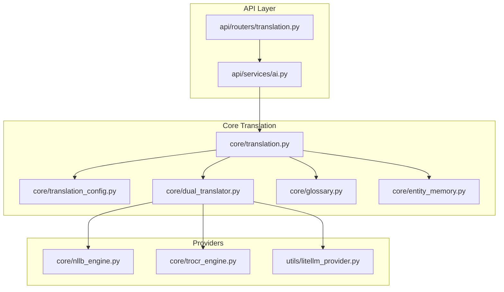
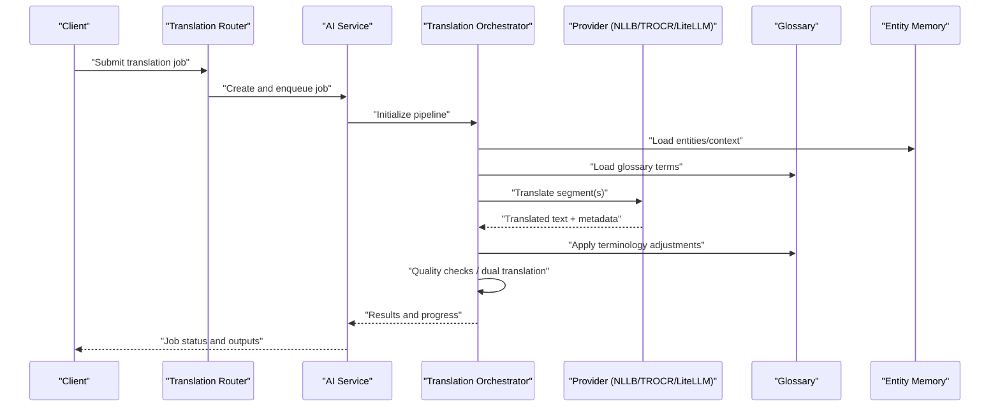
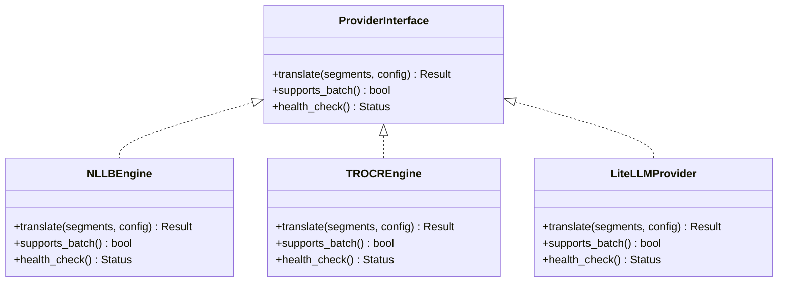
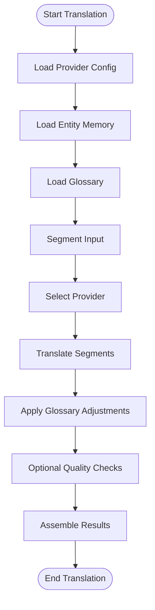
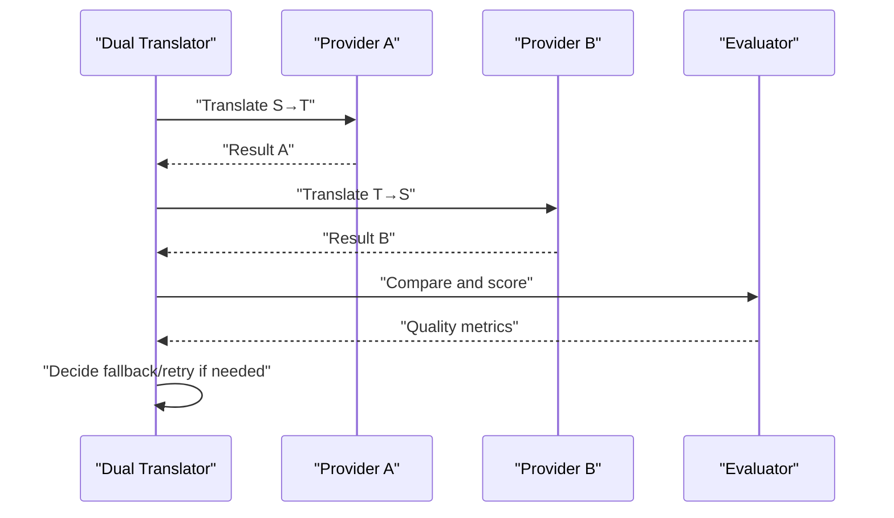
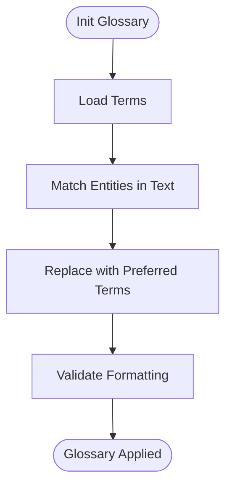
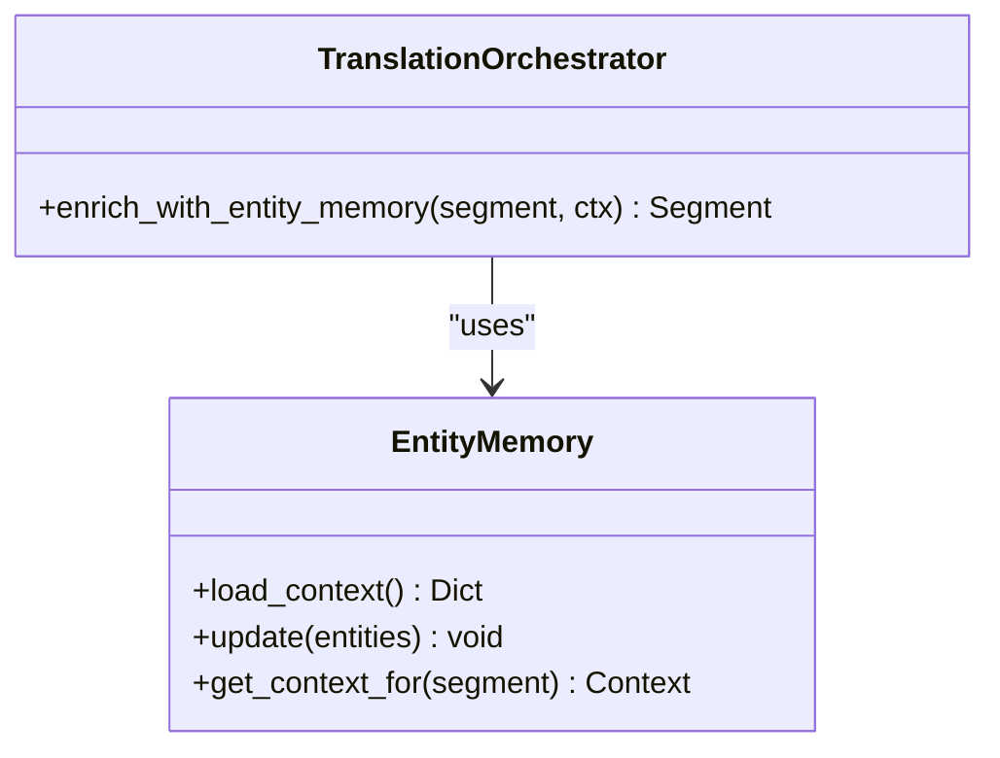
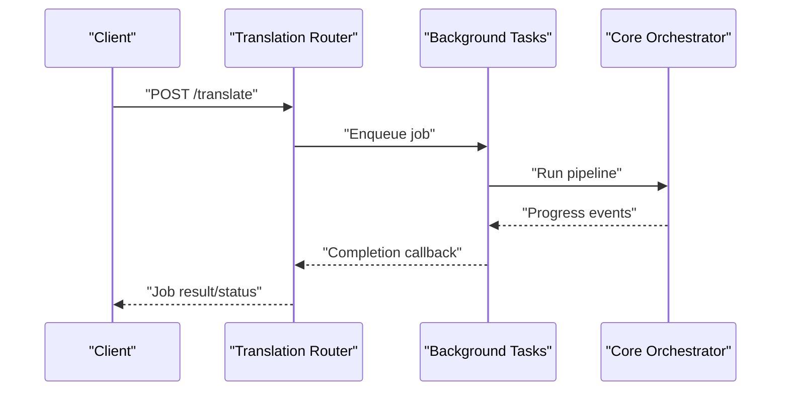
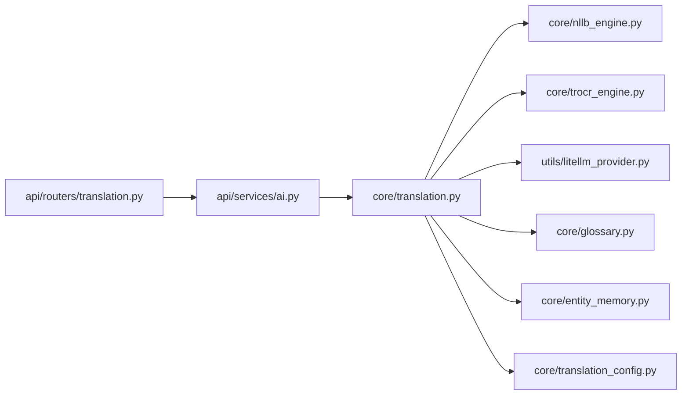

# Translation Services

<cite>
**Referenced Files in This Document**
- [translation.py](file://src/local_deepl/core/translation.py)
- [nllb_engine.py](file://src/local_deepl/core/nllb_engine.py)
- [trocr_engine.py](file://src/local_deepl/core/trocr_engine.py)
- [dual_translator.py](file://src/local_deepl/core/dual_translator.py)
- [glossary.py](file://src/local_deepl/core/glossary.py)
- [entity_memory.py](file://src/local_deepl/core/entity_memory.py)
- [translation_config.py](file://src/local_deepl/core/translation_config.py)
- [litellm_provider.py](file://src/local_deepl/utils/litellm_provider.py)
- [translation.py](file://src/local_deepl/api/routers/translation.py)
- [ai.py](file://src/local_deepl/api/services/ai.py)
</cite>

## Table of Contents
1. [Introduction](#introduction)
2. [Project Structure](#project-structure)
3. [Core Components](#core-components)
4. [Architecture Overview](#architecture-overview)
5. [Detailed Component Analysis](#detailed-component-analysis)
6. [Dependency Analysis](#dependency-analysis)
7. [Performance Considerations](#performance-considerations)
8. [Troubleshooting Guide](#troubleshooting-guide)
9. [Conclusion](#conclusion)
10. [Appendices](#appendices)

## Introduction
This document explains LocalDeepL’s translation service architecture with a focus on the pluggable provider system, translation pipeline, context preservation, entity recognition for terminology consistency, and the dual translator approach for bidirectional translation and quality assessment. It also covers configuration options for local models (NLLB), cloud APIs (OpenAI, Anthropic via LiteLLM), specialized engines (TROCR), performance tuning, batch processing, glossary integration, and guidance for implementing custom providers and optimizing domain-specific quality.

## Project Structure
The translation subsystem is primarily implemented under src/local_deepl/core and integrates with API routers and services:
- Core translation orchestration and provider interfaces
- Provider implementations for NLLB and TROCR
- Dual translator for bidirectional translation and quality checks
- Glossary and entity memory for terminology consistency
- Configuration model for providers
- LiteLLM-based provider for OpenAI/Anthropic
- API endpoints and AI service wiring

**Diagram sources**
- [translation.py](file://src/local_deepl/api/routers/translation.py)
- [ai.py](file://src/local_deepl/api/services/ai.py)
- [translation_config.py](file://src/local_deepl/core/translation_config.py)
- [translation.py](file://src/local_deepl/core/translation.py)
- [dual_translator.py](file://src/local_deepl/core/dual_translator.py)
- [glossary.py](file://src/local_deepl/core/glossary.py)
- [entity_memory.py](file://src/local_deepl/core/entity_memory.py)
- [nllb_engine.py](file://src/local_deepl/core/nllb_engine.py)
- [trocr_engine.py](file://src/local_deepl/core/trocr_engine.py)
- [litellm_provider.py](file://src/local_deepl/utils/litellm_provider.py)

**Section sources**
- [translation.py](file://src/local_deepl/api/routers/translation.py)
- [ai.py](file://src/local_deepl/api/services/ai.py)
- [translation_config.py](file://src/local_deepl/core/translation_config.py)
- [translation.py](file://src/local_deepl/core/translation.py)
- [dual_translator.py](file://src/local_deepl/core/dual_translator.py)
- [glossary.py](file://src/local_deepl/core/glossary.py)
- [entity_memory.py](file://src/local_deepl/core/entity_memory.py)
- [nllb_engine.py](file://src/local_deepl/core/nllb_engine.py)
- [trocr_engine.py](file://src/local_deepl/core/trocr_engine.py)
- [litellm_provider.py](file://src/local_deepl/utils/litellm_provider.py)

## Core Components
- Pluggable provider interface and registry: Defines how providers are discovered and selected at runtime.
- NLLB engine: Local neural machine translation using NLLB models.
- TROCR engine: Specialized OCR-to-text engine used as a translation-like path for image/text extraction.
- Dual translator: Orchestrates bidirectional translation and optional quality assessment.
- Glossary: Terminology enforcement and post-processing alignment.
- Entity memory: Contextual entity tracking to preserve consistent terminology across segments.
- Configuration: Typed settings for provider selection, parameters, and behavior.
- LiteLLM provider: Cloud API access to OpenAI/Anthropic through a unified interface.

Key responsibilities:
- Provider abstraction and routing
- Segment-level translation with context and glossary
- Bidirectional translation and scoring
- Batched processing and progress reporting
- Error handling and retries per provider

**Section sources**
- [translation.py](file://src/local_deepl/core/translation.py)
- [nllb_engine.py](file://src/local_deepl/core/nllb_engine.py)
- [trocr_engine.py](file://src/local_deepl/core/trocr_engine.py)
- [dual_translator.py](file://src/local_deepl/core/dual_translator.py)
- [glossary.py](file://src/local_deepl/core/glossary.py)
- [entity_memory.py](file://src/local_deepl/core/entity_memory.py)
- [translation_config.py](file://src/local_deepl/core/translation_config.py)
- [litellm_provider.py](file://src/local_deepl/utils/litellm_provider.py)

## Architecture Overview
The translation pipeline composes multiple stages:
- Input normalization and segmentation
- Context enrichment from entity memory and glossary
- Provider selection based on configuration
- Translation execution with batching and concurrency controls
- Post-processing including glossary application and quality checks
- Output assembly and progress updates

**Diagram sources**
- [translation.py](file://src/local_deepl/api/routers/translation.py)
- [ai.py](file://src/local_deepl/api/services/ai.py)
- [translation.py](file://src/local_deepl/core/translation.py)
- [glossary.py](file://src/local_deepl/core/glossary.py)
- [entity_memory.py](file://src/local_deepl/core/entity_memory.py)
- [nllb_engine.py](file://src/local_deepl/core/nllb_engine.py)
- [trocr_engine.py](file://src/local_deepl/core/trocr_engine.py)
- [litellm_provider.py](file://src/local_deepl/utils/litellm_provider.py)

## Detailed Component Analysis

### Pluggable Provider System
- Provider interface defines a uniform contract for translate operations, including input normalization, output formatting, and error signaling.
- Registry maps provider names to concrete implementations and supports dynamic selection via configuration.
- Providers include:
  - NLLB engine for local translation
  - TROCR engine for OCR-driven text generation
  - LiteLLM provider for OpenAI/Anthropic APIs

**Diagram sources**
- [nllb_engine.py](file://src/local_deepl/core/nllb_engine.py)
- [trocr_engine.py](file://src/local_deepl/core/trocr_engine.py)
- [litellm_provider.py](file://src/local_deepl/utils/litellm_provider.py)

**Section sources**
- [nllb_engine.py](file://src/local_deepl/core/nllb_engine.py)
- [trocr_engine.py](file://src/local_deepl/core/trocr_engine.py)
- [litellm_provider.py](file://src/local_deepl/utils/litellm_provider.py)

### Translation Pipeline and Context Preservation
- Segmentation splits documents into manageable units while preserving structure.
- Context enrichment loads entity memory and glossary entries to maintain terminology consistency.
- The orchestrator applies glossary rules after provider translation and before final output assembly.
- Progress callbacks report stage completion and errors.

**Diagram sources**
- [translation.py](file://src/local_deepl/core/translation.py)
- [glossary.py](file://src/local_deepl/core/glossary.py)
- [entity_memory.py](file://src/local_deepl/core/entity_memory.py)
- [translation_config.py](file://src/local_deepl/core/translation_config.py)

**Section sources**
- [translation.py](file://src/local_deepl/core/translation.py)
- [glossary.py](file://src/local_deepl/core/glossary.py)
- [entity_memory.py](file://src/local_deepl/core/entity_memory.py)
- [translation_config.py](file://src/local_deepl/core/translation_config.py)

### Dual Translator Approach
- Performs translations in both directions (source→target and target→source).
- Compares outputs to detect inconsistencies and estimate quality.
- Can trigger re-translation or fallbacks when quality thresholds are not met.

**Diagram sources**
- [dual_translator.py](file://src/local_deepl/core/dual_translator.py)

**Section sources**
- [dual_translator.py](file://src/local_deepl/core/dual_translator.py)

### Glossary Integration
- Loads term mappings and applies them during post-processing.
- Supports case-insensitive matching and preserves surrounding formatting.
- Integrates with entity memory to prioritize recognized entities.

**Diagram sources**
- [glossary.py](file://src/local_deepl/core/glossary.py)

**Section sources**
- [glossary.py](file://src/local_deepl/core/glossary.py)

### Entity Recognition and Memory
- Tracks named entities and domain-specific terms across segments.
- Maintains consistency by referencing previously seen entities.
- Feeds context into the translation pipeline to improve terminology fidelity.

**Diagram sources**
- [entity_memory.py](file://src/local_deepl/core/entity_memory.py)
- [translation.py](file://src/local_deepl/core/translation.py)

**Section sources**
- [entity_memory.py](file://src/local_deepl/core/entity_memory.py)
- [translation.py](file://src/local_deepl/core/translation.py)

### Configuration Options
- Provider selection and parameters (model IDs, endpoints, keys)
- Batch size and concurrency limits
- Quality thresholds and fallback strategies
- Glossary paths and entity memory persistence

Typical configuration categories:
- Providers: NLLB, TROCR, LiteLLM (OpenAI/Anthropic)
- Pipeline: batching, retries, timeouts
- Quality: dual translation flags, thresholds
- Glossary: file paths, update policies
- Logging and diagnostics

**Section sources**
- [translation_config.py](file://src/local_deepl/core/translation_config.py)

### API Integration
- REST endpoints accept translation jobs with provider selection and options.
- Background tasks process batches and emit progress updates.
- AI service wires router requests to core translation orchestrators.

**Diagram sources**
- [translation.py](file://src/local_deepl/api/routers/translation.py)
- [ai.py](file://src/local_deepl/api/services/ai.py)

**Section sources**
- [translation.py](file://src/local_deepl/api/routers/translation.py)
- [ai.py](file://src/local_deepl/api/services/ai.py)

## Dependency Analysis
- Core translation depends on provider implementations and shared utilities.
- API layer depends on core orchestrators and background task infrastructure.
- LiteLLM provider abstracts cloud API calls, decoupling provider specifics.

**Diagram sources**
- [translation.py](file://src/local_deepl/api/routers/translation.py)
- [ai.py](file://src/local_deepl/api/services/ai.py)
- [translation.py](file://src/local_deepl/core/translation.py)
- [nllb_engine.py](file://src/local_deepl/core/nllb_engine.py)
- [trocr_engine.py](file://src/local_deepl/core/trocr_engine.py)
- [litellm_provider.py](file://src/local_deepl/utils/litellm_provider.py)
- [glossary.py](file://src/local_deepl/core/glossary.py)
- [entity_memory.py](file://src/local_deepl/core/entity_memory.py)
- [translation_config.py](file://src/local_deepl/core/translation_config.py)

**Section sources**
- [translation.py](file://src/local_deepl/api/routers/translation.py)
- [ai.py](file://src/local_deepl/api/services/ai.py)
- [translation.py](file://src/local_deepl/core/translation.py)
- [nllb_engine.py](file://src/local_deepl/core/nllb_engine.py)
- [trocr_engine.py](file://src/local_deepl/core/trocr_engine.py)
- [litellm_provider.py](file://src/local_deepl/utils/litellm_provider.py)
- [glossary.py](file://src/local_deepl/core/glossary.py)
- [entity_memory.py](file://src/local_deepl/core/entity_memory.py)
- [translation_config.py](file://src/local_deepl/core/translation_config.py)

## Performance Considerations
- Batch size tuning: Increase batch sizes for throughput; reduce for latency-sensitive workloads.
- Concurrency limits: Control parallel provider calls to avoid resource saturation.
- Model warm-up: Preload NLLB models to reduce first-request latency.
- Caching: Cache frequent glossary and entity contexts to minimize I/O overhead.
- Retry/backoff: Configure provider-specific retry policies for transient failures.
- Streaming responses: Use progress events for long-running jobs to improve UX.

[No sources needed since this section provides general guidance]

## Troubleshooting Guide
Common issues and resolutions:
- Provider initialization failures: Verify credentials and endpoint URLs; check health checks.
- Out-of-memory errors: Reduce batch size and concurrency; ensure GPU memory availability for NLLB.
- Glossary conflicts: Review term precedence and regex patterns; validate entity matches.
- Quality threshold triggers: Inspect dual translation scores; adjust thresholds or switch providers.
- API rate limits: Implement exponential backoff and request throttling.

**Section sources**
- [nllb_engine.py](file://src/local_deepl/core/nllb_engine.py)
- [trocr_engine.py](file://src/local_deepl/core/trocr_engine.py)
- [litellm_provider.py](file://src/local_deepl/utils/litellm_provider.py)
- [glossary.py](file://src/local_deepl/core/glossary.py)
- [dual_translator.py](file://src/local_deepl/core/dual_translator.py)

## Conclusion
LocalDeepL’s translation service offers a flexible, pluggable architecture that supports local models, cloud APIs, and specialized engines. The dual translator approach enhances reliability and quality assessment, while glossary and entity memory ensure terminology consistency. With configurable batching, concurrency, and provider options, the system can be tuned for diverse domains and performance requirements. Custom providers can be integrated by adhering to the provider interface and registering them within the configuration.

[No sources needed since this section summarizes without analyzing specific files]

## Appendices

### Implementing a Custom Translation Provider
Steps:
- Implement the provider interface methods for translation, batch support, and health checks.
- Register the provider in the configuration registry.
- Provide configuration fields for model selection, endpoints, and authentication.
- Add unit tests covering normal flows, edge cases, and error conditions.

Best practices:
- Normalize inputs and outputs to match the orchestrator expectations.
- Return structured results including confidence or metadata where available.
- Handle timeouts and network errors gracefully with retries.

**Section sources**
- [translation.py](file://src/local_deepl/core/translation.py)
- [translation_config.py](file://src/local_deepl/core/translation_config.py)

### Optimizing Domain-Specific Quality
- Curate a domain glossary with preferred terms and synonyms.
- Enrich entity memory with domain-specific entities and aliases.
- Use dual translation to detect inconsistencies and enforce stricter thresholds.
- Fine-tune provider parameters (temperature, top-p) for deterministic outputs when appropriate.
- Evaluate with reference corpora and iterate on glossary and prompts.

**Section sources**
- [glossary.py](file://src/local_deepl/core/glossary.py)
- [entity_memory.py](file://src/local_deepl/core/entity_memory.py)
- [dual_translator.py](file://src/local_deepl/core/dual_translator.py)