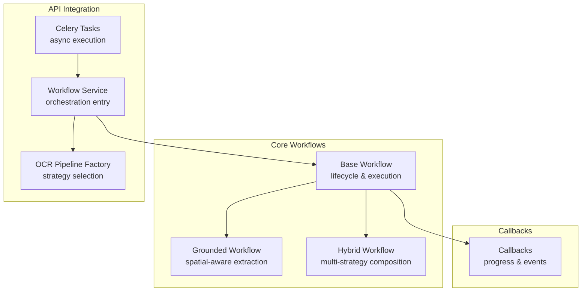
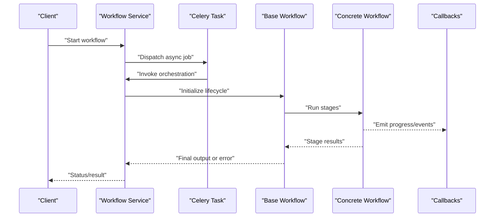
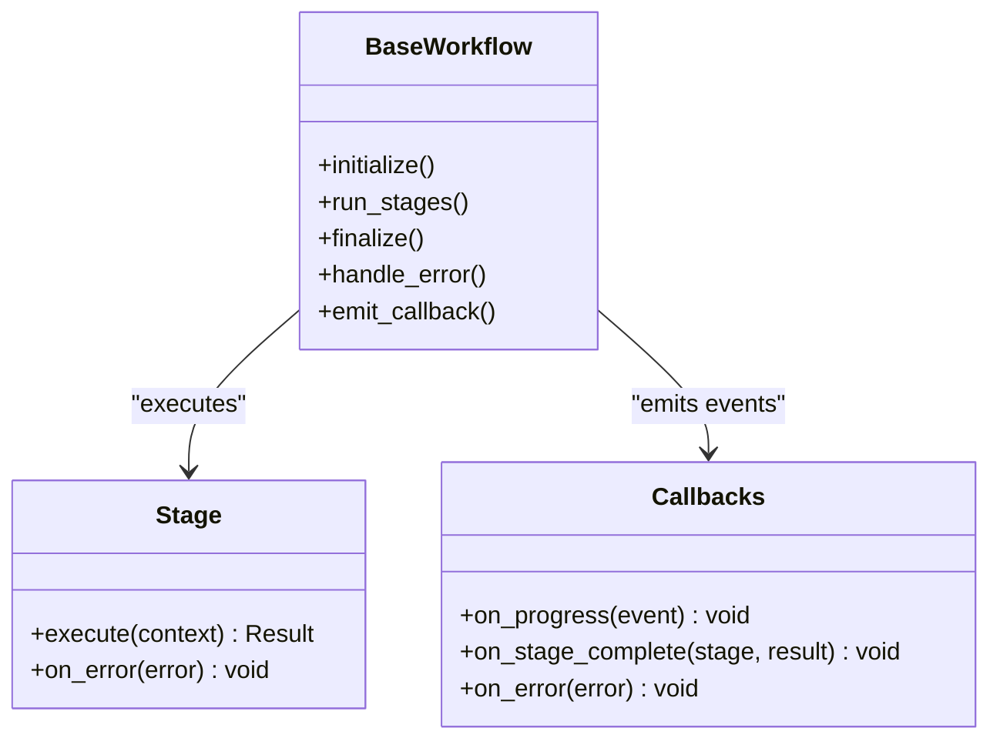
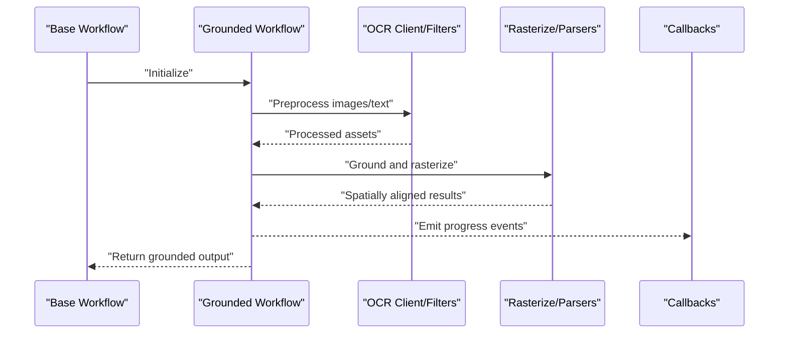
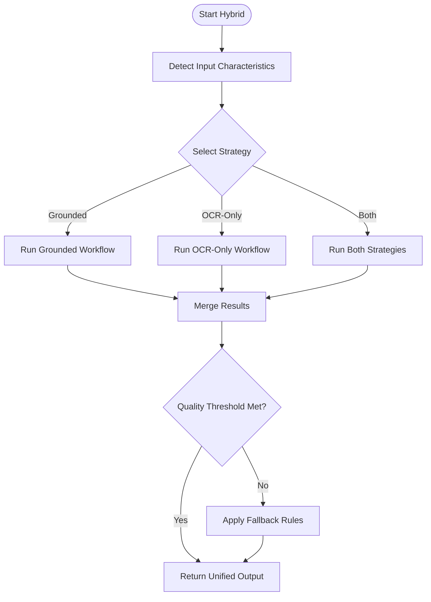
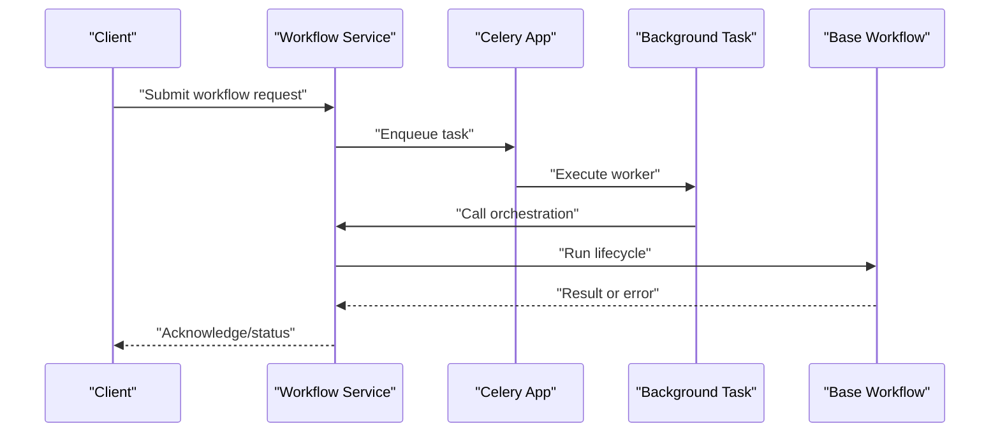
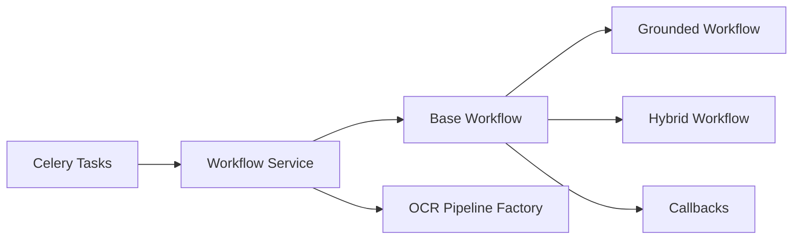

# Workflow Orchestration

<cite>
**Referenced Files in This Document**
- [base.py](file://src/local_deepl/core/workflows/base.py)
- [grounded.py](file://src/local_deepl/core/workflows/grounded.py)
- [hybrid.py](file://src/local_deepl/core/workflows/hybrid.py)
- [callbacks.py](file://src/local_deepl/core/callbacks.py)
- [workflow.py](file://src/local_deepl/api/services/workflow.py)
- [ocr_pipeline_factory.py](file://src/local_deepl/api/services/ocr_pipeline_factory.py)
- [tasks.py](file://src/local_deepl/api/tasks.py)
- [celery_app.py](file://src/local_deepl/api/celery_app.py)
- [test_workflows_base.py](file://tests/test_workflows_base.py)
- [test_workflows_grounded.py](file://tests/test_workflows_grounded.py)
- [test_workflows_hybrid.py](file://tests/test_workflows_hybrid.py)
</cite>

## Table of Contents
1. [Introduction](#introduction)
2. [Project Structure](#project-structure)
3. [Core Components](#core-components)
4. [Architecture Overview](#architecture-overview)
5. [Detailed Component Analysis](#detailed-component-analysis)
6. [Dependency Analysis](#dependency-analysis)
7. [Performance Considerations](#performance-considerations)
8. [Troubleshooting Guide](#troubleshooting-guide)
9. [Conclusion](#conclusion)
10. [Appendices](#appendices)

## Introduction
This document explains LocalDeepL’s workflow orchestration system with a focus on:
- The base workflow abstraction pattern and lifecycle management
- How workflows are defined, composed, and executed
- The grounded workflow for spatial-aware text extraction
- The hybrid workflow that combines multiple processing approaches
- Error handling strategies, callback mechanisms, and extensibility points
- Practical guidance for implementing new workflow types and integrating with existing pipelines

The goal is to provide both conceptual clarity and code-level traceability so you can confidently extend or customize the system.

## Project Structure
The workflow orchestration lives under core/workflows and integrates with API services and background tasks. Key areas:
- Base abstraction and execution engine
- Concrete workflow implementations (grounded, hybrid)
- Callbacks for progress and events
- API service wiring and Celery task integration
- Tests validating behavior and contracts

**Diagram sources**
- [base.py](file://src/local_deepl/core/workflows/base.py)
- [grounded.py](file://src/local_deepl/core/workflows/grounded.py)
- [hybrid.py](file://src/local_deepl/core/workflows/hybrid.py)
- [callbacks.py](file://src/local_deepl/core/callbacks.py)
- [workflow.py](file://src/local_deepl/api/services/workflow.py)
- [ocr_pipeline_factory.py](file://src/local_deepl/api/services/ocr_pipeline_factory.py)
- [tasks.py](file://src/local_deepl/api/tasks.py)

**Section sources**
- [base.py](file://src/local_deepl/core/workflows/base.py)
- [grounded.py](file://src/local_deepl/core/workflows/grounded.py)
- [hybrid.py](file://src/local_deepl/core/workflows/hybrid.py)
- [callbacks.py](file://src/local_deepl/core/callbacks.py)
- [workflow.py](file://src/local_deepl/api/services/workflow.py)
- [ocr_pipeline_factory.py](file://src/local_deepl/api/services/ocr_pipeline_factory.py)
- [tasks.py](file://src/local_deepl/api/tasks.py)

## Core Components
- Base workflow abstraction: defines the lifecycle, stage execution model, error propagation, and callback hooks.
- Grounded workflow: implements spatial-aware text extraction using grounding primitives and rasterization utilities.
- Hybrid workflow: composes multiple strategies (e.g., OCR-based and grounded) and merges results.
- Callbacks: decoupled eventing for progress updates and diagnostics.
- API service: orchestrates workflow execution, including async dispatch via Celery.
- OCR pipeline factory: selects appropriate strategy based on input characteristics.

Key responsibilities:
- Lifecycle: initialize stages, run them in order, handle failures, finalize outputs.
- Composition: combine multiple processors or strategies into a single coherent flow.
- Extensibility: define custom stages and workflows by extending the base.

**Section sources**
- [base.py](file://src/local_deepl/core/workflows/base.py)
- [grounded.py](file://src/local_deepl/core/workflows/grounded.py)
- [hybrid.py](file://src/local_deepl/core/workflows/hybrid.py)
- [callbacks.py](file://src/local_deepl/core/callbacks.py)
- [workflow.py](file://src/local_deepl/api/services/workflow.py)
- [ocr_pipeline_factory.py](file://src/local_deepl/api/services/ocr_pipeline_factory.py)

## Architecture Overview
At runtime, an API request triggers a workflow through the service layer, which may schedule it as a Celery task. The base workflow manages stage execution and callbacks; concrete workflows implement domain-specific logic.

**Diagram sources**
- [workflow.py](file://src/local_deepl/api/services/workflow.py)
- [tasks.py](file://src/local_deepl/api/tasks.py)
- [celery_app.py](file://src/local_deepl/api/celery_app.py)
- [base.py](file://src/local_deepl/core/workflows/base.py)
- [grounded.py](file://src/local_deepl/core/workflows/grounded.py)
- [hybrid.py](file://src/local_deepl/core/workflows/hybrid.py)
- [callbacks.py](file://src/local_deepl/core/callbacks.py)

## Detailed Component Analysis

### Base Workflow Abstraction
Responsibilities:
- Define the execution lifecycle: setup, stage iteration, error handling, teardown.
- Provide extension points for custom stages and result aggregation.
- Integrate callbacks for progress and diagnostics.
- Enforce consistent error semantics across all workflow implementations.

Lifecycle highlights:
- Initialization: validate inputs, prepare resources, set up callbacks.
- Stage execution: iterate over configured stages, propagate errors, capture intermediate results.
- Finalization: aggregate outputs, emit completion events, release resources.

Extensibility:
- Implement custom stages by adhering to the base interface.
- Override lifecycle hooks if needed for specialized behaviors.

Error handling:
- Centralized error propagation ensures uniform failure reporting.
- Supports retryable vs non-retryable distinctions at the stage level.

Callback mechanism:
- Decoupled event emission allows observers to track progress without tight coupling.

**Section sources**
- [base.py](file://src/local_deepl/core/workflows/base.py)
- [callbacks.py](file://src/local_deepl/core/callbacks.py)
- [test_workflows_base.py](file://tests/test_workflows_base.py)

#### Class Diagram: Base Workflow and Stages

**Diagram sources**
- [base.py](file://src/local_deepl/core/workflows/base.py)
- [callbacks.py](file://src/local_deepl/core/callbacks.py)

### Grounded Workflow (Spatial-Aware Extraction)
Purpose:
- Perform text extraction with spatial grounding, preserving layout information.
- Combine OCR-like detection with grounding models and rasterization utilities.

Key aspects:
- Uses grounded parsing and rasterization components to align extracted text with coordinates.
- Integrates with OCR clients and filters when applicable.
- Emits detailed progress events reflecting multi-stage processing.

Integration points:
- Leverages OCR client and filters for preprocessing/postprocessing.
- Works with the base workflow’s lifecycle and callbacks.

**Section sources**
- [grounded.py](file://src/local_deepl/core/workflows/grounded.py)
- [callbacks.py](file://src/local_deepl/core/callbacks.py)
- [test_workflows_grounded.py](file://tests/test_workflows_grounded.py)

#### Sequence Diagram: Grounded Workflow Execution

**Diagram sources**
- [grounded.py](file://src/local_deepl/core/workflows/grounded.py)
- [callbacks.py](file://src/local_deepl/core/callbacks.py)

### Hybrid Workflow (Multi-Strategy Composition)
Purpose:
- Combine multiple processing strategies (e.g., grounded and OCR-only) to improve robustness.
- Merge and reconcile outputs from different approaches.

Key aspects:
- Orchestrates parallel or sequential runs of constituent workflows.
- Applies merging rules to unify results while preserving confidence metrics.
- Provides fallback paths when one strategy fails or yields low-quality results.

Composition patterns:
- Strategy selection based on input characteristics via the OCR pipeline factory.
- Aggregation of partial results with conflict resolution.

**Section sources**
- [hybrid.py](file://src/local_deepl/core/workflows/hybrid.py)
- [ocr_pipeline_factory.py](file://src/local_deepl/api/services/ocr_pipeline_factory.py)
- [test_workflows_hybrid.py](file://tests/test_workflows_hybrid.py)

#### Flowchart: Hybrid Strategy Selection and Merging

**Diagram sources**
- [hybrid.py](file://src/local_deepl/core/workflows/hybrid.py)
- [ocr_pipeline_factory.py](file://src/local_deepl/api/services/ocr_pipeline_factory.py)

### API Service and Background Execution
Responsibilities:
- Expose orchestration endpoints and manage job lifecycles.
- Dispatch long-running workflows to Celery workers.
- Coordinate progress updates and status reporting.

Integration:
- Uses the OCR pipeline factory to choose strategies.
- Relies on callbacks to surface progress to clients.

**Section sources**
- [workflow.py](file://src/local_deepl/api/services/workflow.py)
- [ocr_pipeline_factory.py](file://src/local_deepl/api/services/ocr_pipeline_factory.py)
- [tasks.py](file://src/local_deepl/api/tasks.py)
- [celery_app.py](file://src/local_deepl/api/celery_app.py)

#### Sequence Diagram: API-to-Celery Orchestration

**Diagram sources**
- [workflow.py](file://src/local_deepl/api/services/workflow.py)
- [tasks.py](file://src/local_deepl/api/tasks.py)
- [celery_app.py](file://src/local_deepl/api/celery_app.py)

## Dependency Analysis
The workflow system exhibits clear separation between orchestration, implementation, and integration layers.

**Diagram sources**
- [base.py](file://src/local_deepl/core/workflows/base.py)
- [grounded.py](file://src/local_deepl/core/workflows/grounded.py)
- [hybrid.py](file://src/local_deepl/core/workflows/hybrid.py)
- [callbacks.py](file://src/local_deepl/core/callbacks.py)
- [workflow.py](file://src/local_deepl/api/services/workflow.py)
- [ocr_pipeline_factory.py](file://src/local_deepl/api/services/ocr_pipeline_factory.py)
- [tasks.py](file://src/local_deepl/api/tasks.py)

**Section sources**
- [base.py](file://src/local_deepl/core/workflows/base.py)
- [grounded.py](file://src/local_deepl/core/workflows/grounded.py)
- [hybrid.py](file://src/local_deepl/core/workflows/hybrid.py)
- [callbacks.py](file://src/local_deepl/core/callbacks.py)
- [workflow.py](file://src/local_deepl/api/services/workflow.py)
- [ocr_pipeline_factory.py](file://src/local_deepl/api/services/ocr_pipeline_factory.py)
- [tasks.py](file://src/local_deepl/api/tasks.py)

## Performance Considerations
- Prefer parallel execution where safe (e.g., independent strategies in hybrid mode).
- Cache intermediate artifacts to avoid recomputation.
- Stream progress updates to reduce memory pressure and improve responsiveness.
- Tune OCR and grounding parameters per input type to balance accuracy and speed.
- Use Celery workers with appropriate concurrency settings for throughput.

[No sources needed since this section provides general guidance]

## Troubleshooting Guide
Common issues and strategies:
- Missing dependencies: ensure OCR clients and grounding libraries are installed and configured.
- Timeout errors: adjust Celery task timeouts and stage durations.
- Memory spikes: monitor intermediate artifacts; consider chunking large documents.
- Callback not firing: verify callback registration and event emission points.
- Strategy mismatch: review pipeline factory selection logic and input characteristics.

Validation references:
- Base workflow tests confirm lifecycle and error propagation.
- Grounded workflow tests validate spatial alignment and rasterization outcomes.
- Hybrid workflow tests check strategy composition and merging behavior.

**Section sources**
- [test_workflows_base.py](file://tests/test_workflows_base.py)
- [test_workflows_grounded.py](file://tests/test_workflows_grounded.py)
- [test_workflows_hybrid.py](file://tests/test_workflows_hybrid.py)

## Conclusion
LocalDeepL’s workflow orchestration provides a robust, extensible foundation for document processing:
- A clean base abstraction standardizes lifecycle and error handling.
- Grounded and hybrid workflows address diverse extraction needs.
- Callbacks and Celery integration enable responsive, scalable execution.
- Clear extension points allow custom workflows and strategies to integrate seamlessly.

[No sources needed since this section summarizes without analyzing specific files]

## Appendices

### Implementing a New Workflow Type
Steps:
- Extend the base workflow to define your stage sequence and result aggregation.
- Implement custom stages adhering to the base interface.
- Register your workflow with the API service or pipeline factory as appropriate.
- Emit callbacks for progress and diagnostics.
- Add tests covering lifecycle, error paths, and expected outputs.

Reference locations:
- Base workflow definition and hooks
- Callback interface and usage
- API service wiring and factory selection
- Example tests for validation patterns

**Section sources**
- [base.py](file://src/local_deepl/core/workflows/base.py)
- [callbacks.py](file://src/local_deepl/core/callbacks.py)
- [workflow.py](file://src/local_deepl/api/services/workflow.py)
- [ocr_pipeline_factory.py](file://src/local_deepl/api/services/ocr_pipeline_factory.py)
- [test_workflows_base.py](file://tests/test_workflows_base.py)