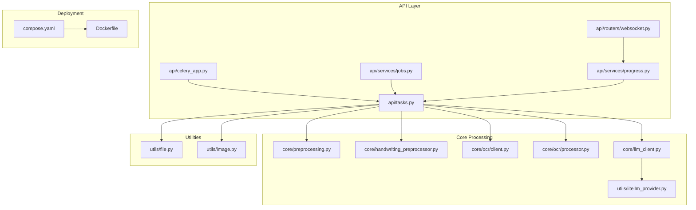
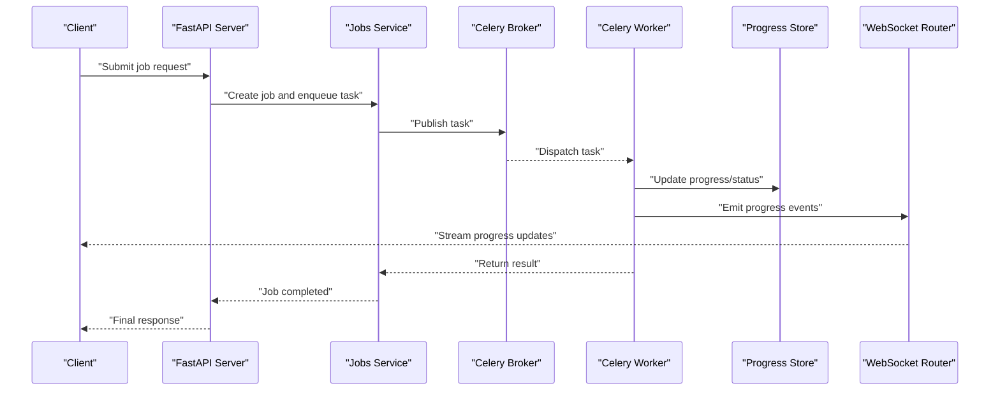
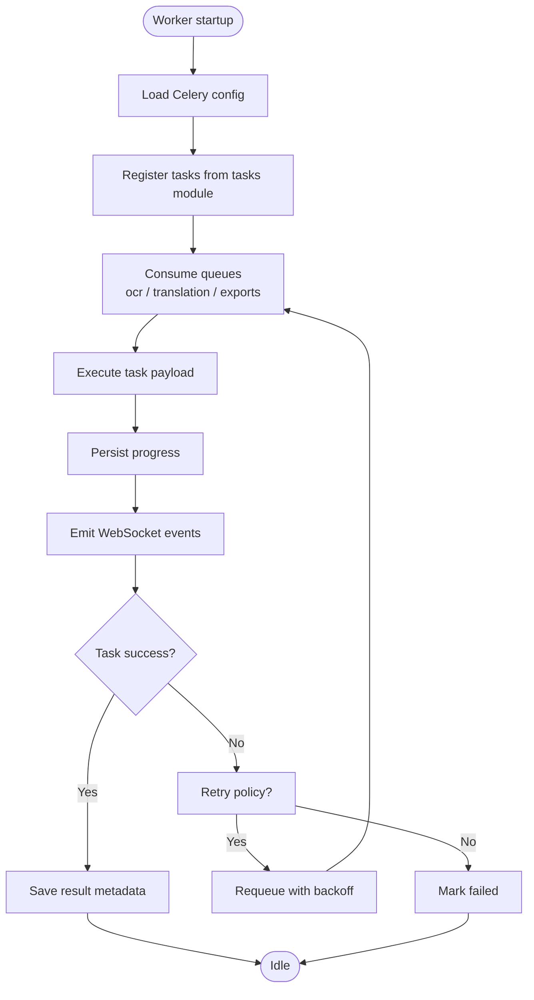
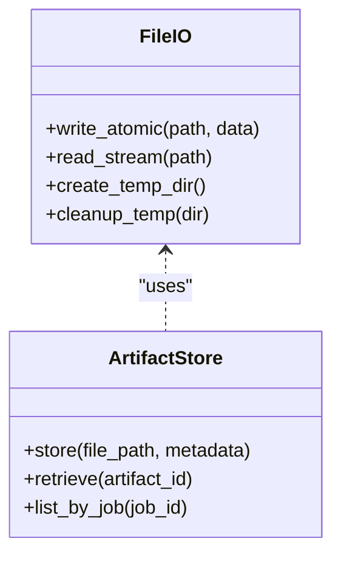
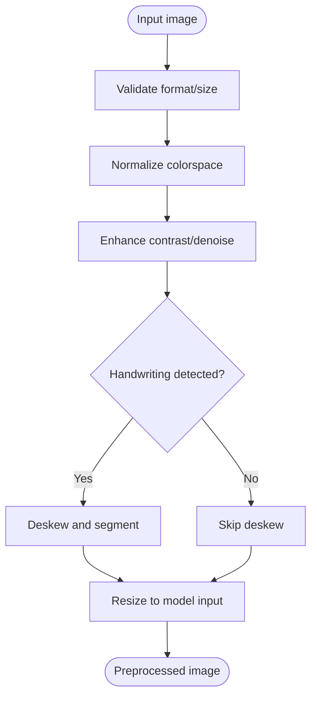
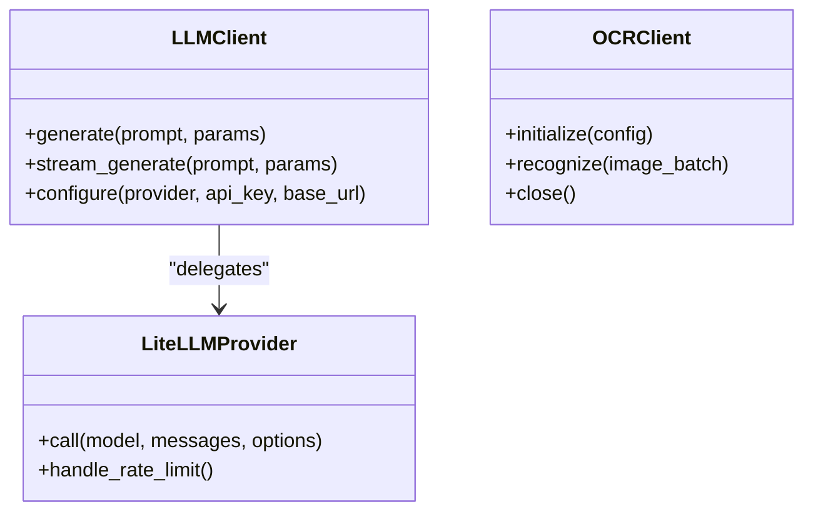
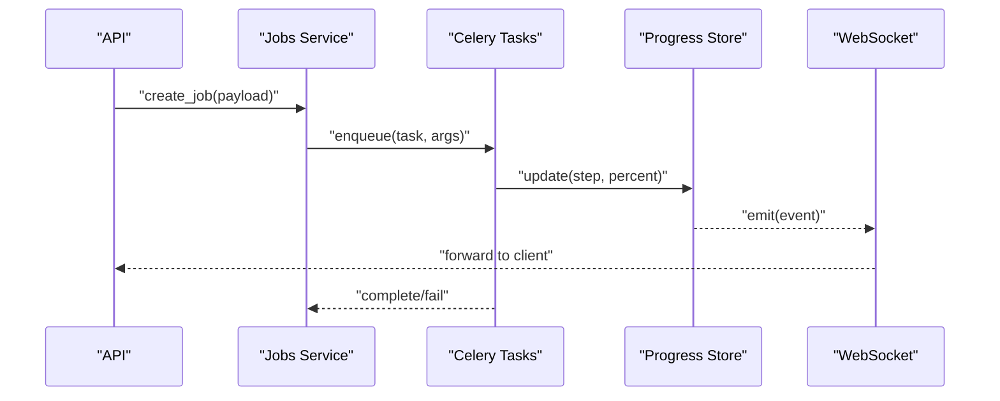
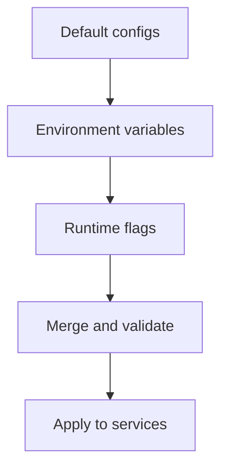
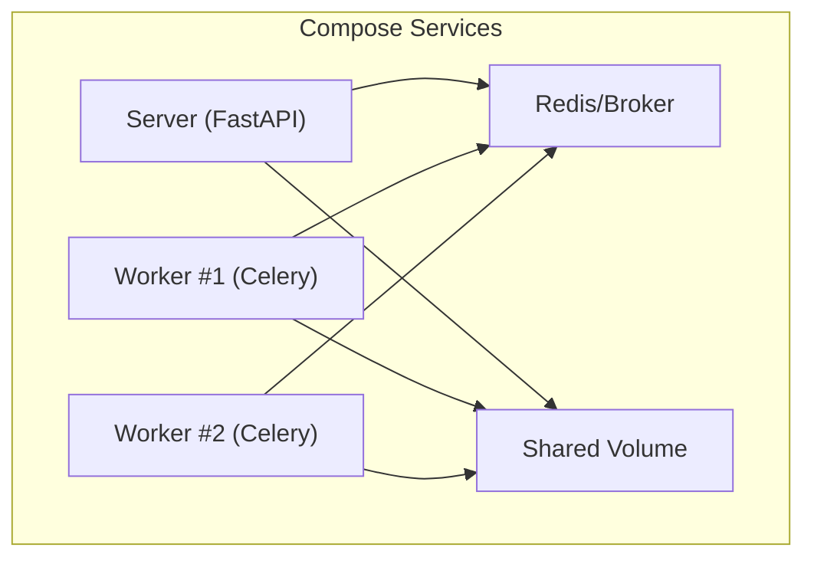
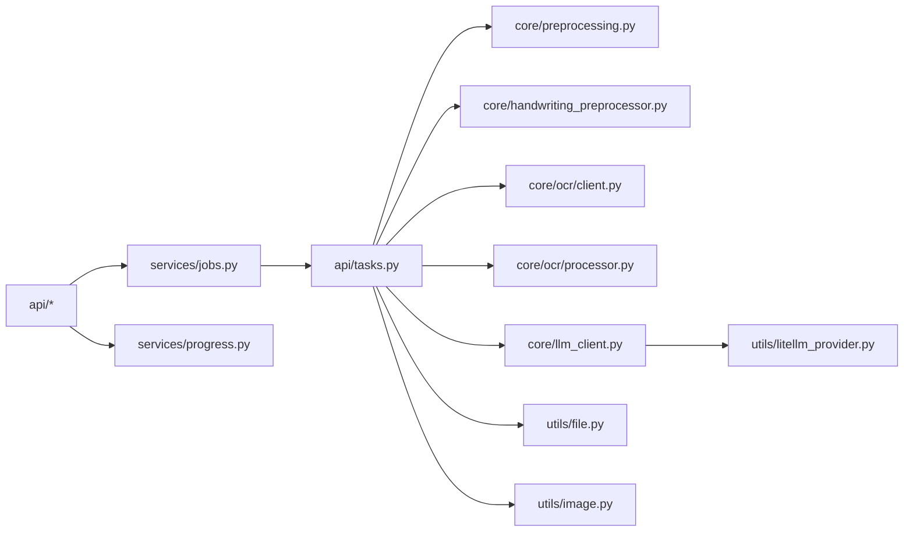

# Infrastructure Components

<cite>
**Referenced Files in This Document**
- [celery_app.py](file://src/local_deepl/api/celery_app.py)
- [tasks.py](file://src/local_deepl/api/tasks.py)
- [server.py](file://src/local_deepl/server.py)
- [pipeline.py](file://src/local_deepl/pipeline.py)
- [file.py](file://src/local_deepl/utils/file.py)
- [image.py](file://src/local_deepl/utils/image.py)
- [llm_client.py](file://src/local_deepl/core/llm_client.py)
- [litellm_provider.py](file://src/local_deepl/utils/litellm_provider.py)
- [preprocessing.py](file://src/local_deepl/core/preprocessing.py)
- [handwriting_preprocessor.py](file://src/local_deepl/core/handwriting_preprocessor.py)
- [ocr/client.py](file://src/local_deepl/core/ocr/client.py)
- [ocr/processor.py](file://src/local_deepl/core/ocr/processor.py)
- [translation_config.py](file://src/local_deepl/core/translation_config.py)
- [security_config.py](file://src/local_deepl/api/services/security_config.py)
- [jobs.py](file://src/local_deepl/api/services/jobs.py)
- [progress.py](file://src/local_deepl/api/services/progress.py)
- [websocket.py](file://src/local_deepl/api/routers/websocket.py)
- [compose.yaml](file://compose.yaml)
- [Dockerfile](file://Dockerfile)
</cite>

## Table of Contents
1. [Introduction](#introduction)
2. [Project Structure](#project-structure)
3. [Core Components](#core-components)
4. [Architecture Overview](#architecture-overview)
5. [Detailed Component Analysis](#detailed-component-analysis)
6. [Dependency Analysis](#dependency-analysis)
7. [Performance Considerations](#performance-considerations)
8. [Troubleshooting Guide](#troubleshooting-guide)
9. [Conclusion](#conclusion)
10. [Appendices](#appendices)

## Introduction
This document describes LocalDeepL’s infrastructure components with a focus on the background task system, file handling utilities, image processing capabilities, and external service clients. It explains how tasks are queued and executed by Celery workers, how files and images are processed, and how LLM and OCR clients are abstracted for flexible provider integration. Configuration management, environment-specific settings, deployment considerations, monitoring, logging, and debugging are also covered to help operators run robust, scalable pipelines.

## Project Structure
LocalDeepL organizes infrastructure-related code under:
- API layer (FastAPI routers, services, Celery app and tasks)
- Core processing modules (OCR, translation, preprocessing, workflows)
- Utilities (file I/O, image processing, LLM client abstraction)
- Deployment artifacts (Dockerfile, Compose)

**Diagram sources**
- [celery_app.py](file://src/local_deepl/api/celery_app.py)
- [tasks.py](file://src/local_deepl/api/tasks.py)
- [jobs.py](file://src/local_deepl/api/services/jobs.py)
- [progress.py](file://src/local_deepl/api/services/progress.py)
- [websocket.py](file://src/local_deepl/api/routers/websocket.py)
- [preprocessing.py](file://src/local_deepl/core/preprocessing.py)
- [handwriting_preprocessor.py](file://src/local_deepl/core/handwriting_preprocessor.py)
- [ocr/client.py](file://src/local_deepl/core/ocr/client.py)
- [ocr/processor.py](file://src/local_deepl/core/ocr/processor.py)
- [llm_client.py](file://src/local_deepl/core/llm_client.py)
- [litellm_provider.py](file://src/local_deepl/utils/litellm_provider.py)
- [file.py](file://src/local_deepl/utils/file.py)
- [image.py](file://src/local_deepl/utils/image.py)
- [compose.yaml](file://compose.yaml)
- [Dockerfile](file://Dockerfile)

**Section sources**
- [celery_app.py](file://src/local_deepl/api/celery_app.py)
- [tasks.py](file://src/local_deepl/api/tasks.py)
- [server.py](file://src/local_deepl/server.py)
- [pipeline.py](file://src/local_deepl/pipeline.py)
- [compose.yaml](file://compose.yaml)
- [Dockerfile](file://Dockerfile)

## Core Components
- Celery application and worker configuration: centralizes broker/backend setup, concurrency, and task routing.
- Background tasks: encapsulate long-running jobs such as OCR, translation, and artifact generation.
- File and image utilities: provide safe I/O, temporary storage, and image preprocessing operations.
- External service clients: abstract LLM providers via LiteLLM and manage OCR client lifecycles.
- Job orchestration and progress tracking: coordinate job lifecycle, persist state, and stream updates over WebSockets.

**Section sources**
- [celery_app.py](file://src/local_deepl/api/celery_app.py)
- [tasks.py](file://src/local_deepl/api/tasks.py)
- [file.py](file://src/local_deepl/utils/file.py)
- [image.py](file://src/local_deepl/utils/image.py)
- [llm_client.py](file://src/local_deepl/core/llm_client.py)
- [litellm_provider.py](file://src/local_deepl/utils/litellm_provider.py)
- [jobs.py](file://src/local_deepl/api/services/jobs.py)
- [progress.py](file://src/local_deepl/api/services/progress.py)
- [websocket.py](file://src/local_deepl/api/routers/websocket.py)

## Architecture Overview
The system uses FastAPI to expose HTTP/WebSocket endpoints that enqueue Celery tasks. Workers execute these tasks using shared resources (files, models, caches). Progress is persisted and broadcast to clients.

**Diagram sources**
- [server.py](file://src/local_deepl/server.py)
- [jobs.py](file://src/local_deepl/api/services/jobs.py)
- [celery_app.py](file://src/local_deepl/api/celery_app.py)
- [tasks.py](file://src/local_deepl/api/tasks.py)
- [progress.py](file://src/local_deepl/api/services/progress.py)
- [websocket.py](file://src/local_deepl/api/routers/websocket.py)

## Detailed Component Analysis

### Celery Background Task System
- Application initialization: configures broker URL, backend, serialization, and concurrency options.
- Task registration: defines long-running tasks for OCR, translation, and artifact export.
- Routing and queues: separates CPU-bound and I/O-bound workloads into dedicated queues.
- Worker process management: supports multiple workers per queue, autoscaling hints, and graceful shutdown.
- Distributed patterns: idempotent task design, retry policies, and result persistence.

**Diagram sources**
- [celery_app.py](file://src/local_deepl/api/celery_app.py)
- [tasks.py](file://src/local_deepl/api/tasks.py)
- [progress.py](file://src/local_deepl/api/services/progress.py)
- [websocket.py](file://src/local_deepl/api/routers/websocket.py)

**Section sources**
- [celery_app.py](file://src/local_deepl/api/celery_app.py)
- [tasks.py](file://src/local_deepl/api/tasks.py)
- [jobs.py](file://src/local_deepl/api/services/jobs.py)
- [progress.py](file://src/local_deepl/api/services/progress.py)
- [websocket.py](file://src/local_deepl/api/routers/websocket.py)

### File Handling Utilities
- Safe I/O: atomic writes, temp directories, and cleanup hooks to avoid partial outputs.
- Path normalization and validation: prevent traversal and ensure sandboxed access.
- Streaming uploads/downloads: chunked reads/writes for large documents.
- Artifact storage: versioned paths and metadata indexing for retrieval.

**Diagram sources**
- [file.py](file://src/local_deepl/utils/file.py)

**Section sources**
- [file.py](file://src/local_deepl/utils/file.py)

### Image Processing Capabilities
- Preprocessing pipeline: resizing, denoising, contrast enhancement, and binarization.
- Handwriting-specific transforms: skew correction, stroke normalization, and segmentation aids.
- Batch operations: parallelized transforms with memory limits and fallbacks.
- Output formats: standardized intermediates for OCR engines.

**Diagram sources**
- [image.py](file://src/local_deepl/utils/image.py)
- [handwriting_preprocessor.py](file://src/local_deepl/core/handwriting_preprocessor.py)
- [preprocessing.py](file://src/local_deepl/core/preprocessing.py)

**Section sources**
- [image.py](file://src/local_deepl/utils/image.py)
- [handwriting_preprocessor.py](file://src/local_deepl/core/handwriting_preprocessor.py)
- [preprocessing.py](file://src/local_deepl/core/preprocessing.py)

### External Service Clients
- LLM client abstraction: unified interface for multiple providers via LiteLLM.
- Provider configuration: dynamic selection based on environment variables and feature flags.
- Rate limiting and retries: exponential backoff and circuit breaker patterns.
- OCR client: manages session, credentials, and endpoint selection; integrates with processors.

**Diagram sources**
- [llm_client.py](file://src/local_deepl/core/llm_client.py)
- [litellm_provider.py](file://src/local_deepl/utils/litellm_provider.py)
- [ocr/client.py](file://src/local_deepl/core/ocr/client.py)
- [ocr/processor.py](file://src/local_deepl/core/ocr/processor.py)

**Section sources**
- [llm_client.py](file://src/local_deepl/core/llm_client.py)
- [litellm_provider.py](file://src/local_deepl/utils/litellm_provider.py)
- [ocr/client.py](file://src/local_deepl/core/ocr/client.py)
- [ocr/processor.py](file://src/local_deepl/core/ocr/processor.py)

### Job Orchestration and Progress Tracking
- Job creation: validates inputs, assigns IDs, persists initial state.
- Task dispatch: enqueues appropriate Celery task with priority and routing.
- Progress store: thread-safe updates with timestamps and step markers.
- WebSocket broadcasting: real-time progress events to clients.

**Diagram sources**
- [jobs.py](file://src/local_deepl/api/services/jobs.py)
- [progress.py](file://src/local_deepl/api/services/progress.py)
- [websocket.py](file://src/local_deepl/api/routers/websocket.py)
- [tasks.py](file://src/local_deepl/api/tasks.py)

**Section sources**
- [jobs.py](file://src/local_deepl/api/services/jobs.py)
- [progress.py](file://src/local_deepl/api/services/progress.py)
- [websocket.py](file://src/local_deepl/api/routers/websocket.py)
- [tasks.py](file://src/local_deepl/api/tasks.py)

### Configuration Management and Environment-Specific Settings
- Translation configuration: model selection, language pairs, and output formatting.
- Security configuration: CORS, authentication, and rate-limiting toggles.
- Environment overrides: precedence rules for defaults, env vars, and runtime flags.
- Feature flags: enable/disable experimental features without redeploy.

**Diagram sources**
- [translation_config.py](file://src/local_deepl/core/translation_config.py)
- [security_config.py](file://src/local_deepl/api/services/security_config.py)

**Section sources**
- [translation_config.py](file://src/local_deepl/core/translation_config.py)
- [security_config.py](file://src/local_deepl/api/services/security_config.py)

### Deployment Considerations
- Containerization: single-process server and separate worker processes.
- Compose orchestration: define services, networks, volumes, and scaling.
- Resource limits: CPU/memory constraints for workers and GPU-enabled nodes.
- Health checks: readiness/liveness probes for Kubernetes or Docker Swarm.

**Diagram sources**
- [compose.yaml](file://compose.yaml)
- [Dockerfile](file://Dockerfile)

**Section sources**
- [compose.yaml](file://compose.yaml)
- [Dockerfile](file://Dockerfile)

## Dependency Analysis
Key dependencies among infrastructure components:
- API depends on jobs and progress services to orchestrate tasks and report status.
- Tasks depend on core processing modules (preprocessing, OCR, translation) and utilities (file, image).
- LLM client delegates to LiteLLM provider for multi-provider support.
- Deployment manifests bind services together and share persistent volumes.

**Diagram sources**
- [jobs.py](file://src/local_deepl/api/services/jobs.py)
- [progress.py](file://src/local_deepl/api/services/progress.py)
- [tasks.py](file://src/local_deepl/api/tasks.py)
- [preprocessing.py](file://src/local_deepl/core/preprocessing.py)
- [handwriting_preprocessor.py](file://src/local_deepl/core/handwriting_preprocessor.py)
- [ocr/client.py](file://src/local_deepl/core/ocr/client.py)
- [ocr/processor.py](file://src/local_deepl/core/ocr/processor.py)
- [llm_client.py](file://src/local_deepl/core/llm_client.py)
- [litellm_provider.py](file://src/local_deepl/utils/litellm_provider.py)
- [file.py](file://src/local_deepl/utils/file.py)
- [image.py](file://src/local_deepl/utils/image.py)

**Section sources**
- [jobs.py](file://src/local_deepl/api/services/jobs.py)
- [tasks.py](file://src/local_deepl/api/tasks.py)
- [preprocessing.py](file://src/local_deepl/core/preprocessing.py)
- [handwriting_preprocessor.py](file://src/local_deepl/core/handwriting_preprocessor.py)
- [ocr/client.py](file://src/local_deepl/core/ocr/client.py)
- [ocr/processor.py](file://src/local_deepl/core/ocr/processor.py)
- [llm_client.py](file://src/local_deepl/core/llm_client.py)
- [litellm_provider.py](file://src/local_deepl/utils/litellm_provider.py)
- [file.py](file://src/local_deepl/utils/file.py)
- [image.py](file://src/local_deepl/utils/image.py)

## Performance Considerations
- Queue partitioning: route heavy OCR tasks to dedicated queues to avoid starvation.
- Concurrency tuning: set worker concurrency based on CPU/GPU availability and memory footprint.
- Batch processing: group small images to reduce overhead and improve throughput.
- Caching: cache model instances and intermediate results where safe.
- Backpressure: apply rate limits at the API layer and within clients to protect downstream services.

[No sources needed since this section provides general guidance]

## Troubleshooting Guide
- Celery diagnostics: inspect broker connectivity, queue lengths, and worker logs.
- Task failures: review retry policies, error payloads, and dead-letter queues.
- Progress stalls: verify progress store persistence and WebSocket connections.
- File issues: check permissions, disk space, and temp directory cleanup.
- LLM/OCR errors: validate credentials, quotas, and endpoint reachability.

**Section sources**
- [celery_app.py](file://src/local_deepl/api/celery_app.py)
- [tasks.py](file://src/local_deepl/api/tasks.py)
- [progress.py](file://src/local_deepl/api/services/progress.py)
- [websocket.py](file://src/local_deepl/api/routers/websocket.py)
- [file.py](file://src/local_deepl/utils/file.py)
- [llm_client.py](file://src/local_deepl/core/llm_client.py)
- [ocr/client.py](file://src/local_deepl/core/ocr/client.py)

## Conclusion
LocalDeepL’s infrastructure combines a resilient Celery-based task system with modular processing components and flexible client abstractions. By separating concerns across queues, workers, and services, it achieves scalability and maintainability. Proper configuration, observability, and deployment practices ensure reliable operation across environments.

[No sources needed since this section summarizes without analyzing specific files]

## Appendices
- Quick start: spin up server and workers using Compose, configure environment variables, and submit jobs via API.
- Scaling: add worker replicas per queue and monitor broker metrics.
- Security: enforce authentication, restrict CORS, and rotate secrets regularly.

[No sources needed since this section provides general guidance]