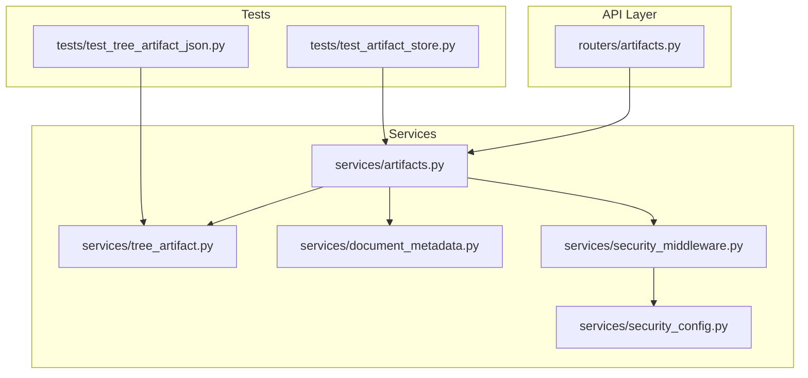
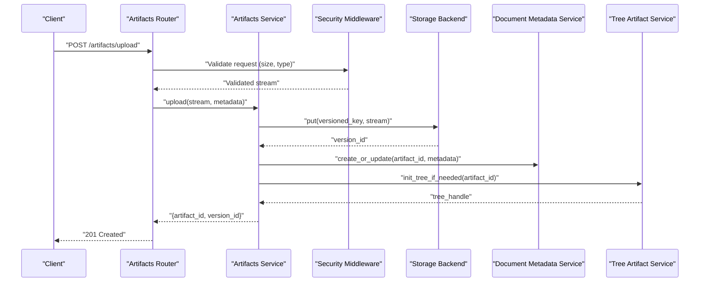
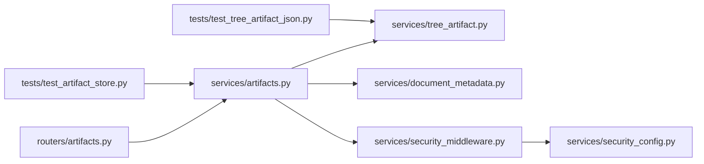

# Artifact Management Service

<cite>
**Referenced Files in This Document**
- [artifacts.py](file://src/local_deepl/api/routers/artifacts.py)
- [artifacts_service.py](file://src/local_deepl/api/services/artifacts.py)
- [tree_artifact.py](file://src/local_deepl/api/services/tree_artifact.py)
- [document_metadata.py](file://src/local_deepl/api/services/document_metadata.py)
- [security_middleware.py](file://src/local_deepl/api/services/security_middleware.py)
- [security_config.py](file://src/local_deepl/api/services/security_config.py)
- [test_artifact_store.py](file://tests/test_artifact_store.py)
- [test_tree_artifact_json.py](file://tests/test_tree_artifact_json.py)
</cite>

## Table of Contents
1. [Introduction](#introduction)
2. [Project Structure](#project-structure)
3. [Core Components](#core-components)
4. [Architecture Overview](#architecture-overview)
5. [Detailed Component Analysis](#detailed-component-analysis)
6. [Dependency Analysis](#dependency-analysis)
7. [Performance Considerations](#performance-considerations)
8. [Troubleshooting Guide](#troubleshooting-guide)
9. [Conclusion](#conclusion)
10. [Appendices](#appendices)

## Introduction
This document describes the Artifact Management Service, focusing on file upload and download operations, versioning, metadata management, tree artifact structures, storage backend abstraction, validation and security scanning, cleanup policies, custom storage backends, and lifecycle patterns. It is intended for both developers integrating with the service and operators managing its runtime behavior.

## Project Structure
The Artifact Management Service is implemented as a FastAPI-based module with:
- API routers exposing HTTP endpoints for artifacts
- Services implementing business logic (upload/download orchestration, versioning, metadata, tree artifacts)
- Security middleware and configuration for request validation and scanning
- Tests validating store behavior and tree artifact JSON semantics

**Diagram sources**
- [artifacts.py](file://src/local_deepl/api/routers/artifacts.py)
- [artifacts_service.py](file://src/local_deepl/api/services/artifacts.py)
- [tree_artifact.py](file://src/local_deepl/api/services/tree_artifact.py)
- [document_metadata.py](file://src/local_deepl/api/services/document_metadata.py)
- [security_middleware.py](file://src/local_deepl/api/services/security_middleware.py)
- [security_config.py](file://src/local_deepl/api/services/security_config.py)
- [test_artifact_store.py](file://tests/test_artifact_store.py)
- [test_tree_artifact_json.py](file://tests/test_tree_artifact_json.py)

**Section sources**
- [artifacts.py](file://src/local_deepl/api/routers/artifacts.py)
- [artifacts_service.py](file://src/local_deepl/api/services/artifacts.py)
- [tree_artifact.py](file://src/local_deepl/api/services/tree_artifact.py)
- [document_metadata.py](file://src/local_deepl/api/services/document_metadata.py)
- [security_middleware.py](file://src/local_deepl/api/services/security_middleware.py)
- [security_config.py](file://src/local_deepl/api/services/security_config.py)
- [test_artifact_store.py](file://tests/test_artifact_store.py)
- [test_tree_artifact_json.py](file://tests/test_tree_artifact_json.py)

## Core Components
- Artifacts Router: Exposes endpoints for uploading, downloading, listing, and managing artifacts. It orchestrates calls into services and returns standardized responses.
- Artifacts Service: Implements core artifact operations including upload/download flows, versioning, and integration with metadata and security components.
- Tree Artifact Service: Encapsulates creation, traversal, and persistence of hierarchical artifact trees.
- Document Metadata Service: Manages key-value metadata associated with artifacts/documents, including schema-aware fields and retrieval helpers.
- Security Middleware and Config: Validates incoming requests, enforces size/type constraints, and integrates security scanning hooks.
- Tests: Validate store behavior, tree artifact JSON structure, and integration points.

Key responsibilities:
- Upload/Download: Streamed I/O, chunked handling, integrity checks, and resumable options where applicable.
- Version Control: Immutable versions per artifact, latest pointer, and history enumeration.
- Metadata: Creation/update/query of artifact metadata; optional schema enforcement.
- Tree Artifacts: Hierarchical representation of multi-file artifacts with consistent JSON serialization.
- Storage Abstraction: Pluggable backends for local filesystem or object stores via a common interface.
- Validation and Scanning: File type, size, and content validation; optional virus/malware scanning pipeline.
- Cleanup Policies: Retention rules, garbage collection of unreferenced versions, and temporary file cleanup.

**Section sources**
- [artifacts.py](file://src/local_deepl/api/routers/artifacts.py)
- [artifacts_service.py](file://src/local_deepl/api/services/artifacts.py)
- [tree_artifact.py](file://src/local_deepl/api/services/tree_artifact.py)
- [document_metadata.py](file://src/local_deepl/api/services/document_metadata.py)
- [security_middleware.py](file://src/local_deepl/api/services/security_middleware.py)
- [security_config.py](file://src/local_deepl/api/services/security_config.py)
- [test_artifact_store.py](file://tests/test_artifact_store.py)
- [test_tree_artifact_json.py](file://tests/test_tree_artifact_json.py)

## Architecture Overview
The service follows a layered architecture:
- API layer routes HTTP requests to services
- Services coordinate workflows across storage, metadata, and security
- Storage backend abstraction decouples persistence from business logic
- Security middleware validates inputs and triggers scanning before persistence

**Diagram sources**
- [artifacts.py](file://src/local_deepl/api/routers/artifacts.py)
- [artifacts_service.py](file://src/local_deepl/api/services/artifacts.py)
- [security_middleware.py](file://src/local_deepl/api/services/security_middleware.py)
- [document_metadata.py](file://src/local_deepl/api/services/document_metadata.py)
- [tree_artifact.py](file://src/local_deepl/api/services/tree_artifact.py)

## Detailed Component Analysis

### Artifacts Router
Responsibilities:
- Define endpoints for upload, download, list, delete, and version operations
- Parse request bodies and query parameters
- Delegate to services and return structured responses

Typical flows:
- Upload: Accept multipart/form-data or raw streams, attach initial metadata, trigger versioning
- Download: Resolve artifact ID and version, stream content from storage
- List: Filter by artifact ID, tags, or time range; paginate results

Integration points:
- Security middleware for request validation
- Artifacts service for orchestration
- Metadata service for artifact properties

**Section sources**
- [artifacts.py](file://src/local_deepl/api/routers/artifacts.py)

### Artifacts Service
Responsibilities:
- Implement upload/download workflows
- Manage versioning semantics (latest pointer, immutable versions)
- Coordinate with metadata and tree artifact services
- Enforce cleanup policies and handle errors consistently

Key behaviors:
- Versioning: Each upload creates an immutable version; latest reference updated atomically
- Integrity: Optional checksums and content verification
- Streaming: Efficient I/O without loading entire files into memory
- Error handling: Distinguish between client errors, transient failures, and storage errors

Cleanup policies:
- Garbage collect unreferenced versions beyond retention window
- Purge temporary uploads after processing or timeout

**Section sources**
- [artifacts_service.py](file://src/local_deepl/api/services/artifacts.py)

### Tree Artifact Service
Responsibilities:
- Create and manage hierarchical artifact trees
- Serialize/deserialize tree structures to/from JSON
- Provide traversal utilities and consistency checks

Tree structure highlights:
- Root node representing the artifact set
- Child nodes for files and directories
- Metadata attached to nodes (e.g., path, type, size)
- Deterministic JSON format for portability and diffing

Validation:
- Ensure no cycles and unique paths
- Verify required fields and types
- Maintain referential integrity when linking to stored files

**Section sources**
- [tree_artifact.py](file://src/local_deepl/api/services/tree_artifact.py)
- [test_tree_artifact_json.py](file://tests/test_tree_artifact_json.py)

### Document Metadata Service
Responsibilities:
- CRUD operations for artifact metadata
- Schema-aware fields and optional validation
- Indexing hints for search/filtering

Common fields:
- Artifact identifiers, timestamps, authorship, tags
- Content descriptors (mimetype, size, checksum)
- Custom extension fields validated against configured schemas

Operations:
- create/update/delete metadata
- get by artifact ID or query filters
- batch updates for migrations or imports

**Section sources**
- [document_metadata.py](file://src/local_deepl/api/services/document_metadata.py)

### Security Middleware and Configuration
Responsibilities:
- Request validation (size limits, allowed MIME types, filename sanitization)
- Integration with scanning pipelines (virus/malware checks)
- Centralized security policy configuration

Configuration:
- Allowed extensions and MIME types
- Max upload sizes per endpoint
- Scan enablement and timeouts
- Quarantine actions for flagged content

Middleware flow:
- Intercept upload requests
- Validate headers and payload characteristics
- Trigger scanning before persisting
- Block or quarantine based on scan results

**Section sources**
- [security_middleware.py](file://src/local_deepl/api/services/security_middleware.py)
- [security_config.py](file://src/local_deepl/api/services/security_config.py)

### Storage Backend Abstraction
Concept:
- A pluggable interface abstracting persistence details
- Backends implement put/get/list/delete/version operations
- Enables switching between local filesystem and object storage without changing service code

Interface expectations:
- put(key, stream) -> version_id
- get(key, version_id) -> stream
- list(prefix, marker) -> iterator
- delete(key, version_id) -> success
- exists(key, version_id) -> bool
- versioning support or latest resolution helper

Example backend patterns:
- Local filesystem backend using directory-per-artifact layout
- Object storage backend with bucket/key mapping and versioning
- Hybrid backend delegating hot/cold data to different stores

Lifecycle considerations:
- Atomicity of version writes
- Consistency guarantees under concurrent access
- Cleanup of orphaned versions

**Section sources**
- [artifacts_service.py](file://src/local_deepl/api/services/artifacts.py)
- [test_artifact_store.py](file://tests/test_artifact_store.py)

### Lifecycle Management Patterns
Patterns:
- Immutable versioning: Every upload produces a new version; latest pointer updated atomically
- Soft delete: Mark artifacts as deleted while retaining versions for recovery windows
- Retention policies: Automatic deletion of old versions based on age or count
- Temporary staging: Pre-scan staging area for uploads, promoted to final store upon success
- Rollback: Restore previous versions by updating latest pointer

Operational notes:
- Use transactions or idempotent operations to avoid partial states
- Monitor storage growth and enforce quotas
- Provide admin APIs for manual cleanup and restoration

**Section sources**
- [artifacts_service.py](file://src/local_deepl/api/services/artifacts.py)

## Dependency Analysis
High-level dependencies among components:

**Diagram sources**
- [artifacts.py](file://src/local_deepl/api/routers/artifacts.py)
- [artifacts_service.py](file://src/local_deepl/api/services/artifacts.py)
- [tree_artifact.py](file://src/local_deepl/api/services/tree_artifact.py)
- [document_metadata.py](file://src/local_deepl/api/services/document_metadata.py)
- [security_middleware.py](file://src/local_deepl/api/services/security_middleware.py)
- [security_config.py](file://src/local_deepl/api/services/security_config.py)
- [test_artifact_store.py](file://tests/test_artifact_store.py)
- [test_tree_artifact_json.py](file://tests/test_tree_artifact_json.py)

**Section sources**
- [artifacts.py](file://src/local_deepl/api/routers/artifacts.py)
- [artifacts_service.py](file://src/local_deepl/api/services/artifacts.py)
- [tree_artifact.py](file://src/local_deepl/api/services/tree_artifact.py)
- [document_metadata.py](file://src/local_deepl/api/services/document_metadata.py)
- [security_middleware.py](file://src/local_deepl/api/services/security_middleware.py)
- [security_config.py](file://src/local_deepl/api/services/security_config.py)
- [test_artifact_store.py](file://tests/test_artifact_store.py)
- [test_tree_artifact_json.py](file://tests/test_tree_artifact_json.py)

## Performance Considerations
- Prefer streaming uploads/downloads to minimize memory usage
- Use chunked transfers for large artifacts
- Cache frequently accessed metadata and latest pointers
- Parallelize independent operations (e.g., metadata indexing after persistence)
- Tune scanning concurrency and timeouts to balance safety and throughput
- Employ efficient listing/pagination to reduce overhead on large repositories

[No sources needed since this section provides general guidance]

## Troubleshooting Guide
Common issues and resolutions:
- Upload rejected due to size/type: Check security configuration and request headers
- Scan failures: Review scanner logs and quarantine settings; retry or escalate
- Version conflicts: Ensure idempotent upload keys and atomic latest updates
- Missing metadata: Verify metadata service availability and schema compliance
- Tree inconsistencies: Validate tree JSON structure and run integrity checks
- Storage errors: Inspect backend connectivity and permissions; verify cleanup policies

Diagnostic steps:
- Enable detailed logging for upload/download flows
- Validate tree artifact JSON with provided tests
- Query metadata indexes for missing or malformed entries
- Inspect storage backend metrics and error rates

**Section sources**
- [security_middleware.py](file://src/local_deepl/api/services/security_middleware.py)
- [security_config.py](file://src/local_deepl/api/services/security_config.py)
- [test_tree_artifact_json.py](file://tests/test_tree_artifact_json.py)
- [test_artifact_store.py](file://tests/test_artifact_store.py)

## Conclusion
The Artifact Management Service provides robust upload/download capabilities, strict version control, rich metadata management, and a flexible storage abstraction. With integrated validation and security scanning, it supports safe and scalable artifact handling. The tree artifact model enables complex multi-file artifacts, while well-defined lifecycle patterns ensure operational reliability.

[No sources needed since this section summarizes without analyzing specific files]

## Appendices

### Example: Custom Storage Backend
To implement a custom backend:
- Implement the storage interface methods (put, get, list, delete, exists, versioning helpers)
- Ensure atomic writes and consistent reads under concurrency
- Integrate with cleanup policies and monitoring
- Register the backend with the service configuration

Reference implementation patterns can be derived from existing tests and service usage.

**Section sources**
- [artifacts_service.py](file://src/local_deepl/api/services/artifacts.py)
- [test_artifact_store.py](file://tests/test_artifact_store.py)