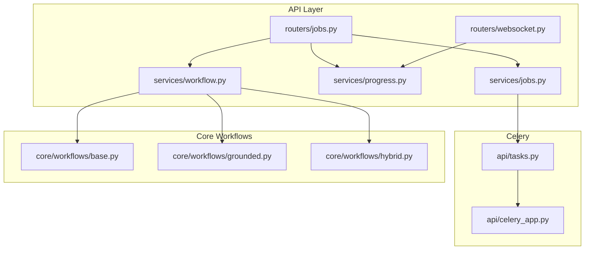
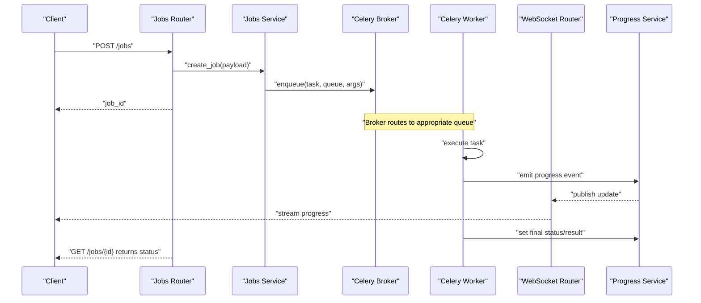
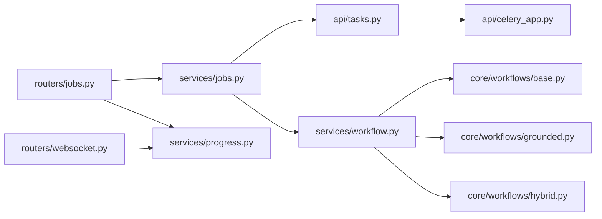

# Job Management Service

<cite>
**Referenced Files in This Document**
- [celery_app.py](file://src/local_deepl/api/celery_app.py)
- [tasks.py](file://src/local_deepl/api/tasks.py)
- [jobs.py](file://src/local_deepl/api/routers/jobs.py)
- [jobs_service.py](file://src/local_deepl/api/services/jobs.py)
- [progress_service.py](file://src/local_deepl/api/services/progress.py)
- [websocket_router.py](file://src/local_deepl/api/routers/websocket.py)
- [server.py](file://src/local_deepl/server.py)
- [workflow_service.py](file://src/local_deepl/api/services/workflow.py)
- [base_workflow.py](file://src/local_deepl/core/workflows/base.py)
- [grounded_workflow.py](file://src/local_deepl/core/workflows/grounded.py)
- [hybrid_workflow.py](file://src/local_deepl/core/workflows/hybrid.py)
- [pyproject.toml](file://pyproject.toml)
- [compose.yaml](file://compose.yaml)
</cite>

## Table of Contents
1. [Introduction](#introduction)
2. [Project Structure](#project-structure)
3. [Core Components](#core-components)
4. [Architecture Overview](#architecture-overview)
5. [Detailed Component Analysis](#detailed-component-analysis)
6. [Dependency Analysis](#dependency-analysis)
7. [Performance Considerations](#performance-considerations)
8. [Troubleshooting Guide](#troubleshooting-guide)
9. [Conclusion](#conclusion)
10. [Appendices](#appendices)

## Introduction
This document describes the Job Management Service that powers background task processing using Celery. It explains how jobs are created, tracked, retried, and coordinated across workers; how queues are configured and scaled; and how progress is surfaced to clients via WebSockets. It also covers integration with the workflow engine for long-running document processing pipelines.

## Project Structure
The job management service spans API routers, services, Celery app configuration, and core workflows:
- API layer exposes HTTP endpoints for job creation and status queries, plus a WebSocket endpoint for live progress updates.
- Services encapsulate business logic for job lifecycle, progress tracking, and orchestration.
- Celery app defines the broker/backend and worker configuration.
- Tasks define the actual background work units.
- Core workflows implement reusable processing steps that can be invoked from tasks.

**Diagram sources**
- [jobs.py](file://src/local_deepl/api/routers/jobs.py)
- [websocket_router.py](file://src/local_deepl/api/routers/websocket.py)
- [jobs_service.py](file://src/local_deepl/api/services/jobs.py)
- [progress_service.py](file://src/local_deepl/api/services/progress.py)
- [workflow_service.py](file://src/local_deepl/api/services/workflow.py)
- [celery_app.py](file://src/local_deepl/api/celery_app.py)
- [tasks.py](file://src/local_deepl/api/tasks.py)
- [base_workflow.py](file://src/local_deepl/core/workflows/base.py)
- [grounded_workflow.py](file://src/local_deepl/core/workflows/grounded.py)
- [hybrid_workflow.py](file://src/local_deepl/core/workflows/hybrid.py)

**Section sources**
- [server.py](file://src/local_deepl/server.py)
- [pyproject.toml](file://pyproject.toml)
- [compose.yaml](file://compose.yaml)

## Core Components
- Celery application: Initializes the Celery instance, configures broker and backend, and discovers tasks.
- Task definitions: Declare background jobs, including retries, time limits, and result handling.
- Jobs router: Exposes endpoints to create jobs and query their status.
- Jobs service: Orchestrates job creation, persistence, and coordination with Celery.
- Progress service: Manages per-job progress events and provides real-time updates.
- WebSocket router: Streams progress updates to connected clients.
- Workflow service: Invokes workflow engines (grounded/hybrid) within tasks or as part of job execution.
- Core workflows: Implement reusable processing stages used by tasks.

Key responsibilities:
- Job lifecycle: Create -> Enqueue -> Execute -> Update Status/Progress -> Complete/Fail -> Retry if applicable.
- Queue routing: Assign tasks to specific queues based on workload type.
- Worker coordination: Scale horizontally by running multiple workers subscribed to queues.
- Monitoring: Use Celery monitoring tools and expose progress via WebSockets.

**Section sources**
- [celery_app.py](file://src/local_deepl/api/celery_app.py)
- [tasks.py](file://src/local_deepl/api/tasks.py)
- [jobs.py](file://src/local_deepl/api/routers/jobs.py)
- [jobs_service.py](file://src/local_deepl/api/services/jobs.py)
- [progress_service.py](file://src/local_deepl/api/services/progress.py)
- [websocket_router.py](file://src/local_deepl/api/routers/websocket.py)
- [workflow_service.py](file://src/local_deepl/api/services/workflow.py)
- [base_workflow.py](file://src/local_deepl/core/workflows/base.py)
- [grounded_workflow.py](file://src/local_deepl/core/workflows/grounded.py)
- [hybrid_workflow.py](file://src/local_deepl/core/workflows/hybrid.py)

## Architecture Overview
The system uses a producer-consumer pattern:
- The API server enqueues jobs into message queues backed by a broker.
- One or more Celery workers consume tasks from queues and execute them.
- Results and progress are persisted and exposed through APIs and WebSockets.

**Diagram sources**
- [jobs.py](file://src/local_deepl/api/routers/jobs.py)
- [jobs_service.py](file://src/local_deepl/api/services/jobs.py)
- [tasks.py](file://src/local_deepl/api/tasks.py)
- [progress_service.py](file://src/local_deepl/api/services/progress.py)
- [websocket_router.py](file://src/local_deepl/api/routers/websocket.py)

## Detailed Component Analysis

### Celery Application and Configuration
Responsibilities:
- Initialize Celery app with broker URL and result backend.
- Configure task serialization, timezone, and concurrency settings.
- Auto-discover tasks from the package.

Configuration highlights:
- Broker and backend URLs sourced from environment variables.
- Optional queue-specific settings and routing keys.
- Worker command-line flags for scaling and performance tuning.

Operational notes:
- Use separate queues for CPU-bound vs I/O-bound tasks.
- Tune concurrency and prefetch count based on resource constraints.
- Persist results only when needed to reduce backend load.

**Section sources**
- [celery_app.py](file://src/local_deepl/api/celery_app.py)
- [pyproject.toml](file://pyproject.toml)
- [compose.yaml](file://compose.yaml)

### Task Definitions
Responsibilities:
- Define Celery tasks for background processing.
- Specify retry policies, time limits, and error handling.
- Emit progress updates and set final statuses.

Patterns:
- Use exponential backoff for transient failures.
- Guard against idempotency issues by checking existing artifacts before reprocessing.
- Publish granular progress events to support UI feedback.

Error handling:
- Catch domain exceptions and map to user-friendly statuses.
- Log stack traces for diagnostics while avoiding sensitive data leakage.

**Section sources**
- [tasks.py](file://src/local_deepl/api/tasks.py)

### Jobs Router and Service
Responsibilities:
- Accept job creation requests and validate inputs.
- Delegate to the jobs service to persist metadata and enqueue tasks.
- Provide endpoints to query job status and details.

Job lifecycle:
- Creation: Validate payload, generate unique job ID, persist initial state.
- Enqueue: Dispatch to appropriate queue with routing key.
- Status polling: Return current status and summary.
- Completion: Finalize result references and cleanup temporary resources.

Idempotency and safety:
- Prevent duplicate job submissions for identical inputs.
- Ensure safe cancellation where supported by underlying tasks.

**Section sources**
- [jobs.py](file://src/local_deepl/api/routers/jobs.py)
- [jobs_service.py](file://src/local_deepl/api/services/jobs.py)

### Progress Service and WebSocket Streaming
Responsibilities:
- Store and retrieve per-job progress events.
- Broadcast updates to connected WebSocket clients.
- Support efficient querying for recent progress deltas.

Design considerations:
- Use a fast store for high-frequency updates (e.g., in-memory or Redis).
- Throttle broadcasts to avoid overwhelming clients.
- Maintain a bounded history to prevent unbounded growth.

Client integration:
- Clients connect to the WebSocket endpoint and subscribe to job-specific channels.
- Real-time updates include percentage complete, stage names, and optional messages.

**Section sources**
- [progress_service.py](file://src/local_deepl/api/services/progress.py)
- [websocket_router.py](file://src/local_deepl/api/routers/websocket.py)

### Workflow Integration
Responsibilities:
- Orchestrate multi-stage workflows inside tasks.
- Compose grounded and hybrid workflows for different document types.
- Surface intermediate results and errors to the job status.

Workflow patterns:
- Base workflow defines common hooks and lifecycle methods.
- Grounded workflow focuses on OCR + grounding steps.
- Hybrid workflow combines multiple strategies and selects best output.

Integration points:
- Tasks invoke the workflow service with job context and parameters.
- Progress events are emitted at each stage boundary.
- Errors are captured and mapped to actionable statuses.

**Section sources**
- [workflow_service.py](file://src/local_deepl/api/services/workflow.py)
- [base_workflow.py](file://src/local_deepl/core/workflows/base.py)
- [grounded_workflow.py](file://src/local_deepl/core/workflows/grounded.py)
- [hybrid_workflow.py](file://src/local_deepl/core/workflows/hybrid.py)

### Example: Custom Job Implementation
To add a new background job:
- Define a new Celery task with appropriate retries and time limits.
- Emit progress events at meaningful milestones.
- Persist final results and mark the job completed or failed.
- Optionally route to a dedicated queue for isolation and scaling.

Best practices:
- Keep tasks small and focused; compose larger processes via workflow services.
- Avoid blocking operations; use async I/O where possible.
- Make tasks idempotent to safely retry.

**Section sources**
- [tasks.py](file://src/local_deepl/api/tasks.py)
- [workflow_service.py](file://src/local_deepl/api/services/workflow.py)

## Dependency Analysis
High-level dependencies:
- API routers depend on services for business logic.
- Services depend on Celery tasks and progress storage.
- Tasks depend on core workflows for domain processing.
- Configuration is centralized in the Celery app and environment.

**Diagram sources**
- [jobs.py](file://src/local_deepl/api/routers/jobs.py)
- [websocket_router.py](file://src/local_deepl/api/routers/websocket.py)
- [jobs_service.py](file://src/local_deepl/api/services/jobs.py)
- [progress_service.py](file://src/local_deepl/api/services/progress.py)
- [tasks.py](file://src/local_deepl/api/tasks.py)
- [celery_app.py](file://src/local_deepl/api/celery_app.py)
- [workflow_service.py](file://src/local_deepl/api/services/workflow.py)
- [base_workflow.py](file://src/local_deepl/core/workflows/base.py)
- [grounded_workflow.py](file://src/local_deepl/core/workflows/grounded.py)
- [hybrid_workflow.py](file://src/local_deepl/core/workflows/hybrid.py)

**Section sources**
- [server.py](file://src/local_deepl/server.py)

## Performance Considerations
- Queue design: Separate queues for CPU-heavy and I/O-heavy tasks to allow independent scaling.
- Concurrency: Adjust worker concurrency and prefetched tasks based on task characteristics.
- Result backend: Disable persistent results for short-lived tasks to reduce overhead.
- Progress updates: Batch or throttle progress emissions to minimize write amplification.
- Backpressure: Use rate limiting and circuit breakers around external calls.
- Horizontal scaling: Run multiple workers per queue behind a load balancer or process manager.

[No sources needed since this section provides general guidance]

## Troubleshooting Guide
Common issues and resolutions:
- Broker connectivity: Verify broker URL and network access; check credentials and firewall rules.
- Result backend errors: Ensure backend is reachable and properly configured; consider disabling results for non-critical tasks.
- Stuck jobs: Inspect worker logs and Celery Flower metrics; check for deadlocks or long-running tasks.
- Memory leaks: Monitor worker memory usage; restart workers periodically if necessary.
- WebSocket disconnects: Implement client-side reconnect logic with exponential backoff.

Diagnostic tips:
- Enable detailed logging in workers for task entry, progress, and exit.
- Use Celery inspection commands to list active tasks and worker stats.
- Correlate job IDs across API logs, worker logs, and WebSocket events.

**Section sources**
- [celery_app.py](file://src/local_deepl/api/celery_app.py)
- [tasks.py](file://src/local_deepl/api/tasks.py)
- [websocket_router.py](file://src/local_deepl/api/routers/websocket.py)

## Conclusion
The Job Management Service provides a robust foundation for asynchronous processing using Celery. It separates concerns between API, services, tasks, and workflows, enabling scalable and observable background work. With clear queue strategies, retry policies, and real-time progress streaming, it supports complex document processing workflows while remaining maintainable and extensible.

[No sources needed since this section summarizes without analyzing specific files]

## Appendices

### Configuration Options
- Broker and backend URLs: Set via environment variables consumed by the Celery app.
- Queue routing: Define routing keys and bind tasks to queues for isolation.
- Worker scaling: Control number of workers and concurrency via deployment manifests or CLI flags.
- Monitoring: Integrate with Celery Flower and Prometheus exporters for observability.

**Section sources**
- [celery_app.py](file://src/local_deepl/api/celery_app.py)
- [compose.yaml](file://compose.yaml)
- [pyproject.toml](file://pyproject.toml)

### Operational Commands
- Start workers: Launch one or more workers bound to specific queues.
- Check status: Query job endpoints and WebSocket streams for live updates.
- Scale out: Add additional workers to increase throughput.

**Section sources**
- [compose.yaml](file://compose.yaml)
- [server.py](file://src/local_deepl/server.py)