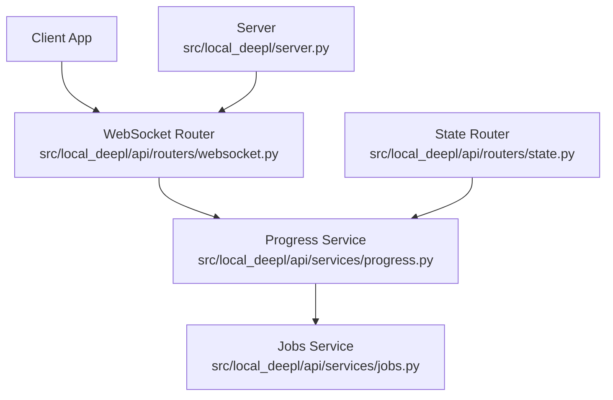
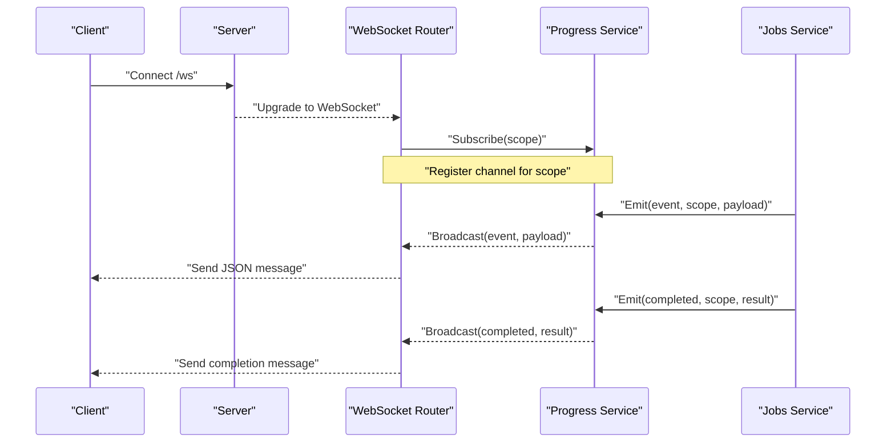
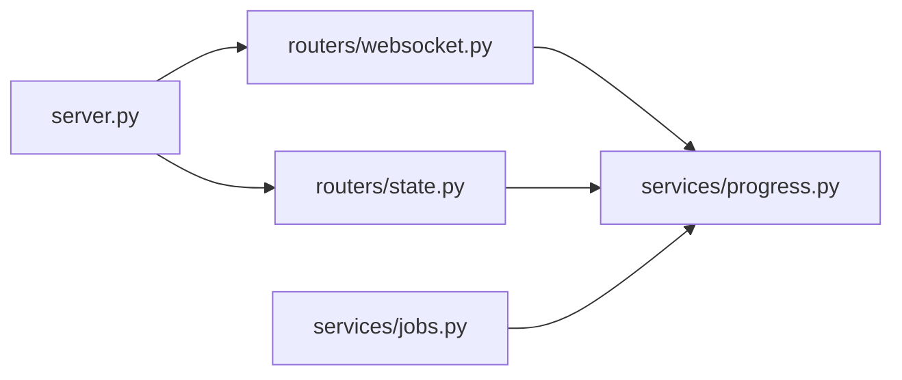

# Progress Tracking Service

<cite>
**Referenced Files in This Document**
- [websocket.py](file://src/local_deepl/api/routers/websocket.py)
- [progress.py](file://src/local_deepl/api/services/progress.py)
- [jobs.py](file://src/local_deepl/api/services/jobs.py)
- [state.py](file://src/local_deepl/api/routers/state.py)
- [server.py](file://src/local_deepl/server.py)
- [test_websocket_handler.py](file://tests/test_websocket_handler.py)
- [test_jobs_progress_services.py](file://tests/test_jobs_progress_services.py)
</cite>

## Table of Contents
1. [Introduction](#introduction)
2. [Project Structure](#project-structure)
3. [Core Components](#core-components)
4. [Architecture Overview](#architecture-overview)
5. [Detailed Component Analysis](#detailed-component-analysis)
6. [Dependency Analysis](#dependency-analysis)
7. [Performance Considerations](#performance-considerations)
8. [Troubleshooting Guide](#troubleshooting-guide)
9. [Conclusion](#conclusion)
10. [Appendices](#appendices)

## Introduction
This document describes the Progress Tracking Service that provides real-time progress updates over WebSocket connections. It explains the event-driven architecture, client-server communication patterns, progress state management, event broadcasting, and connection lifecycle handling. It also covers WebSocket message formats, error handling, reconnection strategies, and examples for custom progress events and client integration patterns.

## Project Structure
The Progress Tracking Service is implemented as part of the API layer with a dedicated WebSocket router and a service module for progress state and broadcasting. The server wires up routers and mounts the WebSocket endpoint. Tests validate behavior for both the WebSocket handler and the progress services.

**Diagram sources**
- [websocket.py](file://src/local_deepl/api/routers/websocket.py)
- [progress.py](file://src/local_deepl/api/services/progress.py)
- [jobs.py](file://src/local_deepl/api/services/jobs.py)
- [state.py](file://src/local_deepl/api/routers/state.py)
- [server.py](file://src/local_deepl/server.py)

**Section sources**
- [websocket.py](file://src/local_deepl/api/routers/websocket.py)
- [progress.py](file://src/local_deepl/api/services/progress.py)
- [jobs.py](file://src/local_deepl/api/services/jobs.py)
- [state.py](file://src/local_deepl/api/routers/state.py)
- [server.py](file://src/local_deepl/server.py)

## Core Components
- WebSocket Router: Accepts client connections, manages per-client channels, subscribes to progress events, and forwards messages to clients.
- Progress Service: Owns progress state keyed by job or task identifiers, publishes progress events, and maintains subscriber lists for fan-out.
- Jobs Service: Orchestrates long-running jobs and emits progress updates through the Progress Service.
- State Router: Provides HTTP endpoints to query current progress state for clients without WebSocket support.
- Server: Wires routers and mounts the WebSocket endpoint at a configured path.

Key responsibilities:
- Connection lifecycle: accept, subscribe, publish, unsubscribe, close.
- Event model: typed events with payloads describing step, percentage, status, and metadata.
- Fan-out: broadcast to all subscribers of a given scope (job/task).
- Persistence: expose latest state via HTTP for polling or snapshotting.

**Section sources**
- [websocket.py](file://src/local_deepl/api/routers/websocket.py)
- [progress.py](file://src/local_deepl/api/services/progress.py)
- [jobs.py](file://src/local_deepl/api/services/jobs.py)
- [state.py](file://src/local_deepl/api/routers/state.py)
- [server.py](file://src/local_deepl/server.py)

## Architecture Overview
The system follows an event-driven pattern where producers (jobs/workflows) emit progress events into the Progress Service. Consumers (clients) connect via WebSocket and subscribe to specific scopes. The Progress Service fans out events to all active subscribers. An HTTP state interface allows non-WebSocket clients to poll progress snapshots.

**Diagram sources**
- [websocket.py](file://src/local_deepl/api/routers/websocket.py)
- [progress.py](file://src/local_deepl/api/services/progress.py)
- [jobs.py](file://src/local_deepl/api/services/jobs.py)
- [server.py](file://src/local_deepl/server.py)

## Detailed Component Analysis

### WebSocket Router
Responsibilities:
- Handle WebSocket handshake and upgrade.
- Maintain per-client channels and subscription maps keyed by scope.
- Forward incoming messages from clients if needed (e.g., acks or control).
- Broadcast outbound messages from the Progress Service to subscribed clients.
- Clean up subscriptions on disconnect.

Connection lifecycle:
- On connect: register client channel and default subscriptions based on request parameters.
- On message: route to appropriate handlers (e.g., subscribe/unsubscribe, ping/pong).
- On disconnect: remove client channel and release resources.

Error handling:
- Gracefully handle malformed messages and I/O errors.
- Ensure cleanup even when errors occur during send/receive.

Reconnection strategy:
- Clients should implement exponential backoff with jitter and reconnect to the same scope.
- Use last known state via HTTP snapshot to avoid missing events during reconnection.

Message format (client-to-server):
- Type: string identifying action (e.g., "subscribe", "unsubscribe", "ping").
- Scope: string or object identifying the job/task.
- Payload: optional data depending on type.

Message format (server-to-client):
- Type: string identifying event (e.g., "progress", "completed", "error").
- Scope: string or object identifying the job/task.
- Payload: structured progress details (step, percent, status, metadata).

**Section sources**
- [websocket.py](file://src/local_deepl/api/routers/websocket.py)
- [test_websocket_handler.py](file://tests/test_websocket_handler.py)

### Progress Service
Responsibilities:
- Maintain current progress state per scope.
- Publish events to subscribers.
- Manage subscriber registry and fan-out.
- Provide read accessors for HTTP state queries.

Data model:
- Scope: unique identifier for a job or task.
- State: current snapshot including step, percent complete, status, and metadata.
- Subscribers: set of channels associated with a scope.

Operations:
- Update(state, scope): mutate state and notify subscribers.
- Subscribe(channel, scope): add channel to scope’s subscriber list.
- Unsubscribe(channel, scope): remove channel from scope’s subscriber list.
- GetState(scope): return current snapshot for HTTP polling.

Concurrency:
- Thread-safe updates and broadcasts to prevent race conditions.
- Backpressure considerations: drop or buffer events under high load.

**Section sources**
- [progress.py](file://src/local_deepl/api/services/progress.py)
- [test_jobs_progress_services.py](file://tests/test_jobs_progress_services.py)

### Jobs Service
Responsibilities:
- Orchestrate long-running tasks.
- Emit progress events through the Progress Service.
- Signal completion or failure states.

Integration:
- Calls Progress Service methods to update state and broadcast events.
- Ensures consistent state transitions (e.g., pending -> running -> completed).

**Section sources**
- [jobs.py](file://src/local_deepl/api/services/jobs.py)
- [test_jobs_progress_services.py](file://tests/test_jobs_progress_services.py)

### State Router
Responsibilities:
- Expose HTTP endpoints to retrieve current progress state for a given scope.
- Serve snapshots for clients without WebSocket support or during reconnection.

Endpoints:
- GET /api/state/{scope}: returns current state snapshot.

Use cases:
- Initial state fetch before WebSocket connection.
- Fallback polling when WebSocket is unavailable.

**Section sources**
- [state.py](file://src/local_deepl/api/routers/state.py)

### Server Wiring
Responsibilities:
- Mount routers and WebSocket endpoint.
- Configure lifespan and shutdown hooks.
- Initialize shared services (e.g., Progress Service instance).

Mounting:
- HTTP routes under /api.
- WebSocket route under /ws.

**Section sources**
- [server.py](file://src/local_deepl/server.py)

## Dependency Analysis
The following diagram shows how components depend on each other:

**Diagram sources**
- [server.py](file://src/local_deepl/server.py)
- [websocket.py](file://src/local_deepl/api/routers/websocket.py)
- [state.py](file://src/local_deepl/api/routers/state.py)
- [progress.py](file://src/local_deepl/api/services/progress.py)
- [jobs.py](file://src/local_deepl/api/services/jobs.py)

**Section sources**
- [server.py](file://src/local_deepl/server.py)
- [websocket.py](file://src/local_deepl/api/routers/websocket.py)
- [state.py](file://src/local_deepl/api/routers/state.py)
- [progress.py](file://src/local_deepl/api/services/progress.py)
- [jobs.py](file://src/local_deepl/api/services/jobs.py)

## Performance Considerations
- Fan-out efficiency: maintain indexed subscriber maps by scope to minimize broadcast cost.
- Message batching: consider coalescing frequent updates to reduce network overhead.
- Backpressure: apply rate limiting or adaptive throttling on high-frequency events.
- Memory management: prune stale scopes and inactive subscribers promptly.
- Concurrency: use thread-safe structures and avoid holding locks during I/O.

[No sources needed since this section provides general guidance]

## Troubleshooting Guide
Common issues and resolutions:
- No progress updates: verify client subscription scope matches job scope; check server logs for broadcast errors.
- Frequent disconnects: ensure stable network and implement client-side retry with exponential backoff.
- Stale state after reconnect: fetch snapshot via HTTP state endpoint before subscribing.
- High CPU usage: review event frequency and consider batching or throttling.

Diagnostic steps:
- Inspect WebSocket frames for correct message types and scopes.
- Query HTTP state endpoint to confirm server-side state consistency.
- Review tests for expected behaviors and edge cases.

**Section sources**
- [test_websocket_handler.py](file://tests/test_websocket_handler.py)
- [test_jobs_progress_services.py](file://tests/test_jobs_progress_services.py)

## Conclusion
The Progress Tracking Service delivers real-time progress updates using a clean event-driven design. The WebSocket router handles connection lifecycles and fan-out, while the Progress Service centralizes state and broadcasting. The Jobs Service integrates seamlessly by emitting events, and the State Router offers HTTP fallbacks. With robust error handling and clear reconnection strategies, clients can reliably track long-running operations.

[No sources needed since this section summarizes without analyzing specific files]

## Appendices

### WebSocket Message Formats
Client-to-server:
- subscribe: {type: "subscribe", scope: "..."}
- unsubscribe: {type: "unsubscribe", scope: "..."}
- ping: {type: "ping"}

Server-to-client:
- progress: {type: "progress", scope: "...", payload: {step, percent, status, metadata}}
- completed: {type: "completed", scope: "...", payload: {result}}
- error: {type: "error", scope: "...", payload: {message}}

### Reconnection Strategy
- Implement exponential backoff with jitter.
- On reconnect, fetch snapshot via HTTP state endpoint.
- Re-subscribe to required scopes immediately after connection.

### Custom Progress Events
- Extend event types with domain-specific fields in payload.
- Ensure backward compatibility by keeping core fields (type, scope, payload).
- Validate payloads on both producer and consumer sides.

### Client Integration Patterns
- Connect to WebSocket, subscribe to scope(s), and render progress UI.
- Handle completion and error events to finalize UI state.
- Fall back to HTTP polling if WebSocket is unavailable.

[No sources needed since this section provides general guidance]