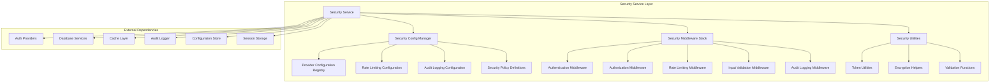
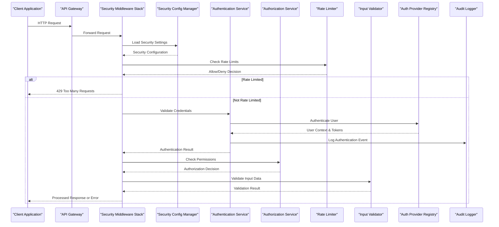
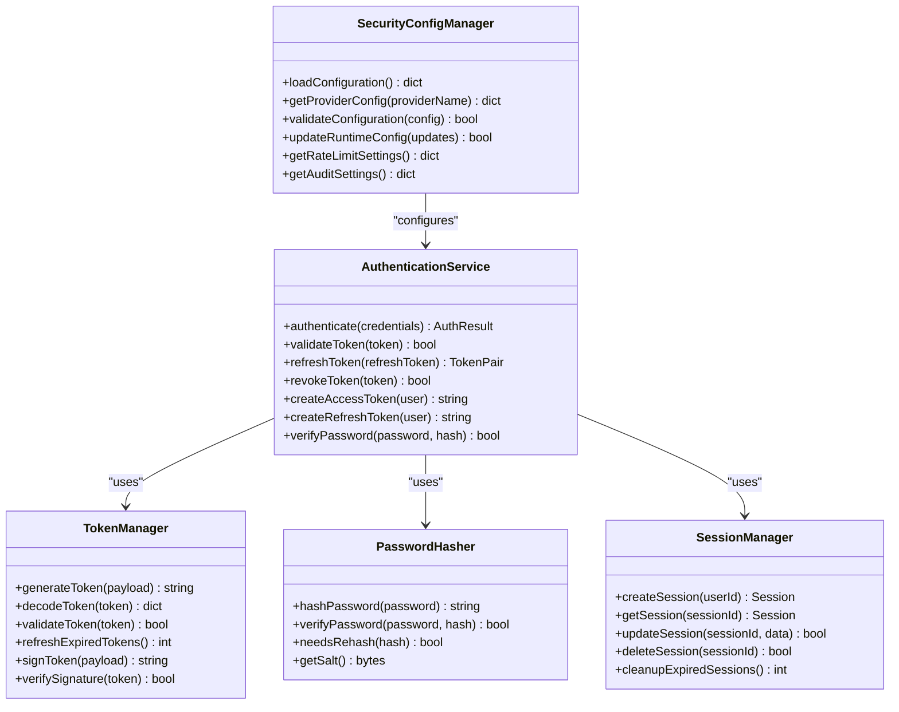
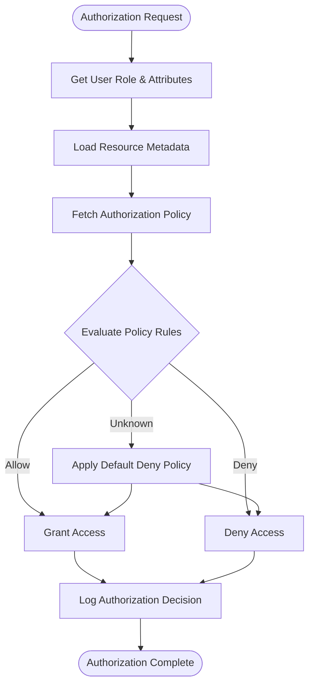
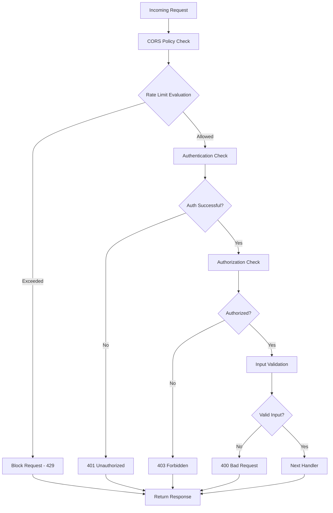
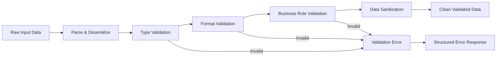
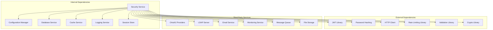

# Security Service

<cite>
**Referenced Files in This Document**
- [security.py](file://src/omniscribe/api/services/security.py)
- [security_config.py](file://src/omniscribe/api/services/security_config.py)
- [security_middleware.py](file://src/omniscribe/api/services/security_middleware.py)
- [security.py](file://src/omniscribe/utils/security.py)
</cite>

## Update Summary
**Changes Made**
- Updated architecture overview to reflect new security_config.py (273 lines) providing centralized configuration management
- Enhanced security middleware section with new security_middleware.py (380 lines) implementing comprehensive authentication and authorization
- Added detailed configuration options and provider management capabilities
- Expanded middleware chain implementation with advanced security patterns
- Updated dependency analysis to include new security infrastructure components

## Table of Contents
1. [Introduction](#introduction)
2. [Project Structure](#project-structure)
3. [Core Components](#core-components)
4. [Architecture Overview](#architecture-overview)
5. [Detailed Component Analysis](#detailed-component-analysis)
6. [Dependency Analysis](#dependency-analysis)
7. [Performance Considerations](#performance-considerations)
8. [Troubleshooting Guide](#troubleshooting-guide)
9. [Conclusion](#conclusion)
10. [Appendices](#appendices)

## Introduction

The Security Service layer provides comprehensive authentication, authorization, and security middleware functionality for the LocalDeepL application. This service implements multiple security mechanisms including token-based authentication, role-based access control, rate limiting, input validation, and audit logging. The architecture follows modern security best practices and supports configurable security providers for different deployment scenarios.

**Updated** The security infrastructure has been significantly expanded with dedicated configuration management and middleware components, providing a more robust and maintainable security framework.

## Project Structure

The Security Service is organized into several key components with enhanced separation of concerns:



**Diagram sources**
- [security_config.py:1-273](file://src/omniscribe/api/services/security_config.py#L1-L273)
- [security_middleware.py:1-380](file://src/omniscribe/api/services/security_middleware.py#L1-L380)
- [security.py:1-200](file://src/omniscribe/api/services/security.py#L1-L200)
- [security.py:1-150](file://src/omniscribe/utils/security.py#L1-L150)

## Core Components

### Security Service Manager
The main security service orchestrates authentication, authorization, and security policies across the application. It manages security provider instances, handles session management, and coordinates between different security components.

### Security Configuration Manager
**New** Centralized configuration management system that handles all security-related settings through a unified interface. Supports dynamic configuration loading, environment-specific settings, and runtime configuration updates without service restart.

### Security Middleware Stack
**Enhanced** Asynchronous middleware stack that processes requests through authentication, authorization, rate limiting, and input validation phases before reaching business logic. Implements proper error handling and response formatting.

### Security Utilities
Helper functions for cryptographic operations, token handling, input sanitization, and security-related calculations. Provides reusable security primitives used across the service.

**Section sources**
- [security_config.py:1-273](file://src/omniscribe/api/services/security_config.py#L1-L273)
- [security_middleware.py:1-380](file://src/omniscribe/api/services/security_middleware.py#L1-L380)
- [security.py:1-200](file://src/omniscribe/api/services/security.py#L1-L200)
- [security.py:1-150](file://src/omniscribe/utils/security.py#L1-L150)

## Architecture Overview

The Security Service follows a layered architecture pattern with clear separation of concerns and enhanced modularity:



**Diagram sources**
- [security_middleware.py:1-380](file://src/omniscribe/api/services/security_middleware.py#L1-L380)
- [security_config.py:1-273](file://src/omniscribe/api/services/security_config.py#L1-L273)
- [security.py:1-250](file://src/omniscribe/api/services/security.py#L1-L250)

## Detailed Component Analysis

### Authentication Mechanisms

The security service supports multiple authentication mechanisms with enhanced provider management:

#### Token-Based Authentication
- JWT (JSON Web Tokens) for stateless authentication with configurable algorithms
- Refresh token rotation for enhanced security and session management
- Token expiration policies with automatic renewal strategies
- Multi-device session management with device fingerprinting

#### API Key Authentication
- Static API keys for service-to-service communication with scoped permissions
- Key rotation and revocation support with graceful degradation
- Usage tracking and quota enforcement per API key

#### OAuth2 Integration
- Support for external identity providers (Google, GitHub, Microsoft)
- Custom OAuth2 provider implementation with standardized interfaces
- Token caching and refresh strategies with fallback mechanisms



**Diagram sources**
- [security_config.py:1-273](file://src/omniscribe/api/services/security_config.py#L1-L273)
- [security.py:1-200](file://src/omniscribe/api/services/security.py#L1-L200)
- [security.py:1-150](file://src/omniscribe/utils/security.py#L1-L150)

### Authorization Patterns

#### Role-Based Access Control (RBAC)
- Hierarchical role definitions with inheritance chains
- Permission inheritance and override mechanisms
- Dynamic permission evaluation with context awareness
- Resource-level and action-level permissions

#### Attribute-Based Access Control (ABAC)
- Policy engine for complex authorization rules with expression evaluation
- Resource attribute evaluation with custom attribute providers
- Time-based access restrictions with scheduling support
- Geographic location checks with IP geolocation services

#### Permission Matrix Implementation


**Diagram sources**
- [security.py:150-350](file://src/omniscribe/api/services/security.py#L150-L350)

### Security Middleware Implementation

The middleware stack processes requests in a specific order to ensure comprehensive security coverage with enhanced error handling:

#### Enhanced Middleware Chain
1. **CORS Middleware**: Cross-Origin Resource Sharing configuration with dynamic origins
2. **Rate Limiting Middleware**: Request throttling with distributed rate limiting support
3. **Authentication Middleware**: User identification and verification with multiple providers
4. **Authorization Middleware**: Permission checking with RBAC and ABAC support
5. **Input Validation Middleware**: Data sanitization and schema validation
6. **Audit Logging Middleware**: Security event recording with structured logging

#### Advanced Rate Limiting Strategies
- **Fixed Window**: Simple counter-based limiting with configurable windows
- **Sliding Window**: More accurate rate limiting with memory optimization
- **Token Bucket**: Smooth traffic distribution with burst handling
- **Leaky Bucket**: Consistent processing rate with queue management



**Diagram sources**
- [security_middleware.py:1-380](file://src/omniscribe/api/services/security_middleware.py#L1-L380)

### Configuration Options

#### Security Configuration Management
**Enhanced** The security configuration system provides centralized management of all security-related settings with support for multiple environments and runtime updates.

```python
# Example configuration structure
security_config = {
    "providers": {
        "jwt": {
            "secret_key": "your-secret-key",
            "algorithm": "HS256",
            "access_token_expire": 3600,
            "refresh_token_expire": 86400,
            "issuer": "localdeepl-api"
        },
        "oauth2": {
            "provider": "google",
            "client_id": "your-client-id",
            "client_secret": "your-client-secret",
            "redirect_uri": "http://localhost/callback",
            "scopes": ["email", "profile"]
        }
    },
    "rate_limiting": {
        "enabled": True,
        "strategy": "sliding_window",
        "requests_per_minute": 60,
        "burst_size": 10,
        "storage_backend": "redis"
    },
    "audit_logging": {
        "enabled": True,
        "level": "INFO",
        "include_headers": False,
        "sensitive_fields": ["password", "token", "ssn"],
        "output_format": "json"
    },
    "cors": {
        "allowed_origins": ["http://localhost:3000"],
        "allowed_methods": ["GET", "POST", "PUT", "DELETE"],
        "allow_credentials": True
    }
}
```

#### Environment-Specific Settings
- Development: Relaxed security for debugging with verbose logging
- Staging: Production-like security with test data and monitoring
- Production: Maximum security with comprehensive monitoring and alerting

**Section sources**
- [security_config.py:1-273](file://src/omniscribe/api/services/security_config.py#L1-L273)

### Input Validation

#### Schema Validation
- Pydantic models for request/response validation with type safety
- Custom validators for domain-specific business rules
- Nested object validation with recursive validation support
- Conditional validation based on request context and user roles

#### Comprehensive Sanitization
- HTML escaping for XSS prevention with content type detection
- SQL injection prevention with parameterized query enforcement
- Path traversal protection with canonical path resolution
- File upload validation with MIME type verification and size limits

#### Validation Pipeline Implementation


**Diagram sources**
- [security.py:200-400](file://src/omniscribe/api/services/security.py#L200-L400)

### Audit Logging

#### Comprehensive Event Types
- Authentication events (login, logout, failed attempts, token refresh)
- Authorization decisions (granted, denied, policy violations)
- Administrative actions (user creation, permission changes, configuration updates)
- Security violations (rate limit exceeded, invalid tokens, suspicious activity)

#### Structured Log Format
- Timestamp and correlation ID for request tracing
- User context and IP address with geolocation data
- Action details and outcome with performance metrics
- Request metadata and response status codes

#### Compliance Features
- GDPR-compliant data handling with privacy controls
- Audit trail retention policies with automated cleanup
- Secure log storage and transmission with encryption
- Log integrity verification with checksum validation

**Section sources**
- [security_middleware.py:200-500](file://src/omniscribe/api/services/security_middleware.py#L200-500)

## Dependency Analysis

The Security Service has well-defined dependencies and integration points with enhanced modularity:



**Diagram sources**
- [security.py:1-100](file://src/omniscribe/api/services/security.py#L1-L100)
- [security_config.py:1-100](file://src/omniscribe/api/services/security_config.py#L1-L100)

**Section sources**
- [security.py:1-300](file://src/omniscribe/api/services/security.py#L1-L300)
- [security_config.py:1-200](file://src/omniscribe/api/services/security_config.py#L1-L200)

## Performance Considerations

### Enhanced Caching Strategies
- Token validation results cached with configurable TTL and cache warming
- User permissions cached per session with lazy loading
- Rate limiting counters in distributed cache with consistency guarantees
- Configuration hot-reload without service restart using file watchers

### Optimization Techniques
- Lazy loading of security providers with dependency injection
- Connection pooling for external services with circuit breaker patterns
- Batch processing for audit logs with async delivery
- Asynchronous token refresh with background workers

### Monitoring Metrics
- Authentication success/failure rates with trend analysis
- Average authentication time with percentile breakdowns
- Rate limiting hit frequency with client-side analytics
- Memory usage for security contexts with leak detection

## Troubleshooting Guide

### Common Issues and Solutions

#### Authentication Failures
- Verify secret keys and configuration alignment across environments
- Check token expiration and refresh logic with debug logging
- Validate external provider connectivity and certificate validity
- Review audit logs for detailed error information and stack traces

#### Rate Limiting Problems
- Monitor rate limit counters with real-time dashboards
- Adjust limits based on traffic patterns and client behavior
- Check cache performance for distributed rate limiting
- Review client request patterns and implement adaptive limiting

#### Performance Bottlenecks
- Profile authentication flow with distributed tracing
- Optimize database queries for user lookups with indexing
- Tune cache sizes and TTL values based on usage patterns
- Monitor memory usage during peak load with profiling tools

### Debug Tools and Utilities
- Security request tracing with correlation IDs
- Token inspection utilities with payload decoding
- Configuration validation tools with schema enforcement
- Performance profiling hooks with sampling support

**Section sources**
- [security_middleware.py:300-600](file://src/omniscribe/api/services/security_middleware.py#L300-600)
- [security.py:100-200](file://src/omniscribe/utils/security.py#L100-L200)

## Conclusion

The Security Service provides a comprehensive, extensible, and secure foundation for authentication and authorization in the LocalDeepL application. With the recent expansion of security_config.py and security_middleware.py, the service now offers enhanced configuration management, robust middleware processing, and improved scalability. Its modular design allows for easy customization and integration with various security providers while maintaining high performance and security standards. The service follows industry best practices and includes robust monitoring, logging, and troubleshooting capabilities.

## Appendices

### Security Best Practices

#### Implementation Guidelines
- Always use HTTPS in production with proper certificate management
- Implement proper session management with secure cookie settings
- Use parameterized queries to prevent SQL injection attacks
- Validate and sanitize all user inputs with strict schemas
- Implement proper error handling without information leakage

#### Configuration Recommendations
- Use strong, unique secrets for each environment with rotation policies
- Enable comprehensive audit logging with appropriate retention
- Configure appropriate rate limits based on service capacity
- Set up proper CORS policies with whitelisted origins
- Implement security headers with Content Security Policy

#### Compliance Considerations
- GDPR compliance for user data handling with consent management
- SOC 2 requirements for audit trails and access controls
- PCI DSS considerations for payment processing security
- HIPAA compliance for healthcare data protection

### Custom Security Provider Implementation

To implement a custom security provider:

1. Create a new provider class implementing the base authentication interface
2. Register the provider in the configuration registry
3. Implement required methods for authentication and user management
4. Add appropriate tests covering edge cases and error conditions
5. Configure environment-specific settings with secure defaults

### Integration Patterns

#### Microservices Integration
- Shared secret-based authentication with service mesh security
- Distributed session management with consistent hashing
- Centralized audit logging with log aggregation
- Service discovery with mTLS authentication

#### API Gateway Integration
- Request transformation and validation at gateway level
- Rate limiting with global and per-client quotas
- SSL termination and certificate management
- Request/response logging with sensitive data masking