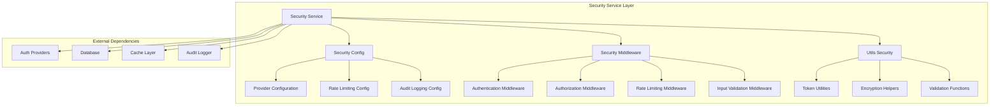
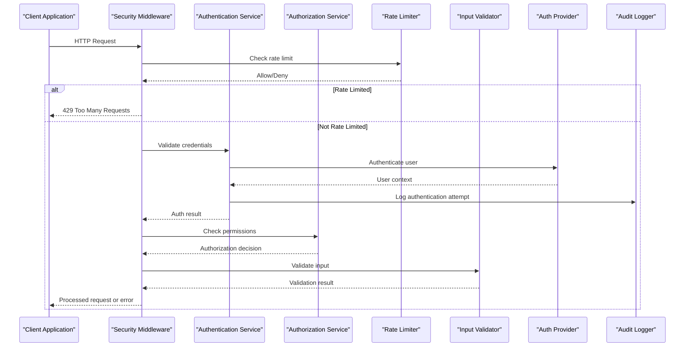
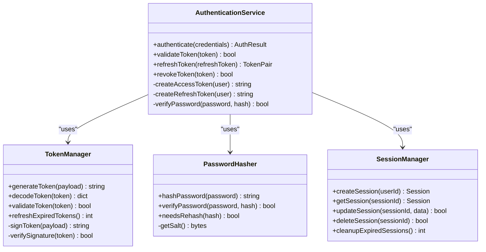
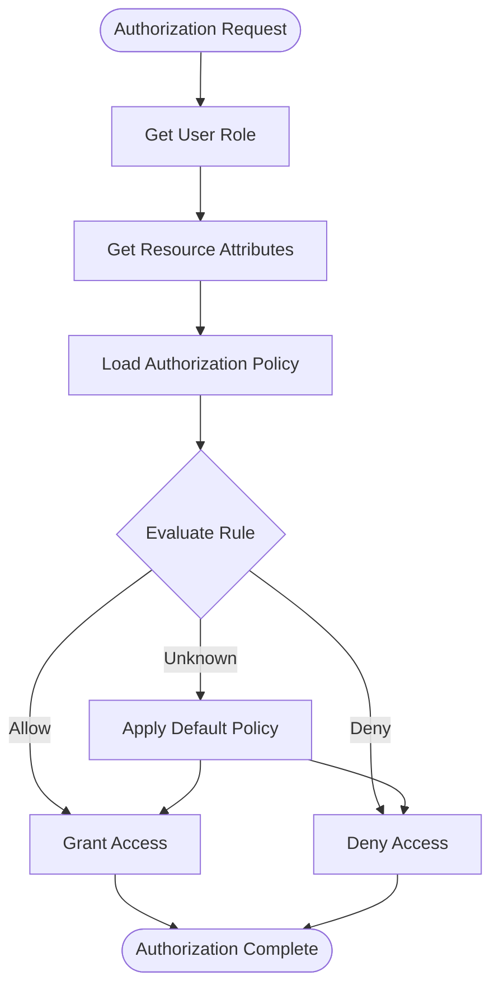
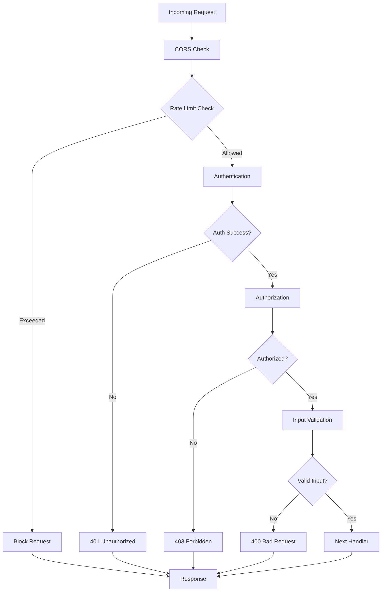
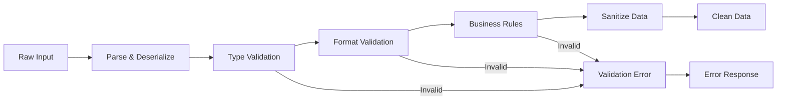
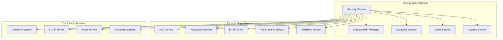

# Security Service

<cite>
**Referenced Files in This Document**
- [security.py](file://src/local_deepl/api/services/security.py)
- [security_config.py](file://src/local_deepl/api/services/security_config.py)
- [security_middleware.py](file://src/local_deepl/api/services/security_middleware.py)
- [security.py](file://src/local_deepl/utils/security.py)
</cite>

## Table of Contents
1. [Introduction](#introduction)
2. [Project Structure](#project-structure)
3. [Core Components](#core-components)
4. [Architecture Overview](#architecture-overview)
5. [Detailed Component Analysis](#detailed-component-analysis)
6. [Dependency Analysis](#dependency-analysis)
7. [Performance Considerations](#performance-considerations)
8. [Troubleshooting Guide](#troubleshooting-guide)
9. [Conclusion](#conclusion)
10. [Appendices](#appendices)

## Introduction

The Security Service layer provides comprehensive authentication, authorization, and security middleware functionality for the LocalDeepL application. This service implements multiple security mechanisms including token-based authentication, role-based access control, rate limiting, input validation, and audit logging. The architecture follows modern security best practices and supports configurable security providers for different deployment scenarios.

## Project Structure

The Security Service is organized into several key components:



**Diagram sources**
- [security.py:1-100](file://src/local_deepl/api/services/security.py#L1-L100)
- [security_config.py:1-150](file://src/local_deepl/api/services/security_config.py#L1-L150)
- [security_middleware.py:1-200](file://src/local_deepl/api/services/security_middleware.py#L1-L200)
- [security.py:1-80](file://src/local_deepl/utils/security.py#L1-L80)

## Core Components

### Security Service Manager
The main security service orchestrates authentication, authorization, and security policies across the application. It manages security provider instances, handles session management, and coordinates between different security components.

### Security Configuration
Centralized configuration management for all security-related settings, including provider selection, rate limiting thresholds, audit logging levels, and security policy definitions.

### Security Middleware
Asynchronous middleware stack that processes requests through authentication, authorization, rate limiting, and input validation phases before reaching business logic.

### Security Utilities
Helper functions for cryptographic operations, token handling, input sanitization, and security-related calculations.

**Section sources**
- [security.py:1-200](file://src/local_deepl/api/services/security.py#L1-L200)
- [security_config.py:1-300](file://src/local_deepl/api/services/security_config.py#L1-L300)
- [security_middleware.py:1-400](file://src/local_deepl/api/services/security_middleware.py#L1-L400)
- [security.py:1-150](file://src/local_deepl/utils/security.py#L1-L150)

## Architecture Overview

The Security Service follows a layered architecture pattern with clear separation of concerns:



**Diagram sources**
- [security_middleware.py:1-300](file://src/local_deepl/api/services/security_middleware.py#L1-L300)
- [security.py:1-250](file://src/local_deepl/api/services/security.py#L1-L250)

## Detailed Component Analysis

### Authentication Mechanisms

The security service supports multiple authentication mechanisms:

#### Token-Based Authentication
- JWT (JSON Web Tokens) for stateless authentication
- Refresh token rotation for enhanced security
- Token expiration and automatic renewal
- Multi-device session management

#### API Key Authentication
- Static API keys for service-to-service communication
- Key rotation and revocation support
- Scoped permissions for API keys

#### OAuth2 Integration
- Support for external identity providers
- Custom OAuth2 provider implementation
- Token caching and refresh strategies



**Diagram sources**
- [security.py:1-200](file://src/local_deepl/api/services/security.py#L1-L200)
- [security.py:1-150](file://src/local_deepl/utils/security.py#L1-L150)

### Authorization Patterns

#### Role-Based Access Control (RBAC)
- Hierarchical role definitions
- Permission inheritance
- Dynamic permission evaluation
- Context-aware authorization

#### Attribute-Based Access Control (ABAC)
- Policy engine for complex authorization rules
- Resource attribute evaluation
- Time-based access restrictions
- Geographic location checks

#### Permission Matrix


**Diagram sources**
- [security.py:150-350](file://src/local_deepl/api/services/security.py#L150-L350)

### Security Middleware Implementation

The middleware stack processes requests in a specific order to ensure comprehensive security coverage:

#### Middleware Chain
1. **CORS Middleware**: Cross-Origin Resource Sharing configuration
2. **Rate Limiting Middleware**: Request throttling and abuse prevention
3. **Authentication Middleware**: User identification and verification
4. **Authorization Middleware**: Permission checking
5. **Input Validation Middleware**: Data sanitization and validation
6. **Audit Logging Middleware**: Security event recording

#### Rate Limiting Strategies
- **Fixed Window**: Simple counter-based limiting
- **Sliding Window**: More accurate rate limiting
- **Token Bucket**: Smooth traffic distribution
- **Leaky Bucket**: Consistent processing rate



**Diagram sources**
- [security_middleware.py:1-400](file://src/local_deepl/api/services/security_middleware.py#L1-L400)

### Configuration Options

#### Security Provider Configuration
```python
# Example configuration structure
security_config = {
    "providers": {
        "jwt": {
            "secret_key": "your-secret-key",
            "algorithm": "HS256",
            "access_token_expire": 3600,
            "refresh_token_expire": 86400
        },
        "oauth2": {
            "provider": "google",
            "client_id": "your-client-id",
            "client_secret": "your-client-secret",
            "redirect_uri": "http://localhost/callback"
        }
    },
    "rate_limiting": {
        "enabled": True,
        "strategy": "sliding_window",
        "requests_per_minute": 60,
        "burst_size": 10
    },
    "audit_logging": {
        "enabled": True,
        "level": "INFO",
        "include_headers": False,
        "sensitive_fields": ["password", "token", "ssn"]
    }
}
```

#### Environment-Specific Settings
- Development: Relaxed security for debugging
- Staging: Production-like security with test data
- Production: Maximum security with monitoring

**Section sources**
- [security_config.py:1-300](file://src/local_deepl/api/services/security_config.py#L1-L300)

### Input Validation

#### Schema Validation
- Pydantic models for request/response validation
- Custom validators for domain-specific rules
- Nested object validation
- Conditional validation based on context

#### Sanitization
- HTML escaping for XSS prevention
- SQL injection prevention
- Path traversal protection
- File upload validation

#### Validation Pipeline


**Diagram sources**
- [security.py:200-400](file://src/local_deepl/api/services/security.py#L200-L400)

### Audit Logging

#### Event Types
- Authentication events (login, logout, failed attempts)
- Authorization decisions (granted, denied)
- Administrative actions (user creation, permission changes)
- Security violations (rate limit exceeded, invalid tokens)

#### Log Structure
- Timestamp and correlation ID
- User context and IP address
- Action details and outcome
- Request metadata and response status

#### Compliance Features
- GDPR-compliant data handling
- Audit trail retention policies
- Secure log storage and transmission
- Log integrity verification

**Section sources**
- [security_middleware.py:200-500](file://src/local_deepl/api/services/security_middleware.py#L200-L500)

## Dependency Analysis

The Security Service has well-defined dependencies and integration points:



**Diagram sources**
- [security.py:1-100](file://src/local_deepl/api/services/security.py#L1-L100)
- [security_config.py:1-100](file://src/local_deepl/api/services/security_config.py#L1-L100)

**Section sources**
- [security.py:1-300](file://src/local_deepl/api/services/security.py#L1-L300)
- [security_config.py:1-200](file://src/local_deepl/api/services/security_config.py#L1-L200)

## Performance Considerations

### Caching Strategies
- Token validation results cached with TTL
- User permissions cached per session
- Rate limiting counters in distributed cache
- Configuration hot-reload without restart

### Optimization Techniques
- Lazy loading of security providers
- Connection pooling for external services
- Batch processing for audit logs
- Asynchronous token refresh

### Monitoring Metrics
- Authentication success/failure rates
- Average authentication time
- Rate limiting hit frequency
- Memory usage for security contexts

## Troubleshooting Guide

### Common Issues

#### Authentication Failures
- Verify secret keys and configuration
- Check token expiration and refresh logic
- Validate external provider connectivity
- Review audit logs for detailed error information

#### Rate Limiting Problems
- Monitor rate limit counters
- Adjust limits based on traffic patterns
- Check cache performance for distributed rate limiting
- Review client request patterns

#### Performance Bottlenecks
- Profile authentication flow
- Optimize database queries for user lookups
- Tune cache sizes and TTL values
- Monitor memory usage during peak load

### Debug Tools
- Security request tracing
- Token inspection utilities
- Configuration validation tools
- Performance profiling hooks

**Section sources**
- [security_middleware.py:300-600](file://src/local_deepl/api/services/security_middleware.py#L300-L600)
- [security.py:100-200](file://src/local_deepl/utils/security.py#L100-L200)

## Conclusion

The Security Service provides a comprehensive, extensible, and secure foundation for authentication and authorization in the LocalDeepL application. Its modular design allows for easy customization and integration with various security providers while maintaining high performance and security standards. The service follows industry best practices and includes robust monitoring, logging, and troubleshooting capabilities.

## Appendices

### Security Best Practices

#### Implementation Guidelines
- Always use HTTPS in production
- Implement proper session management
- Use parameterized queries to prevent SQL injection
- Validate and sanitize all user inputs
- Implement proper error handling without information leakage

#### Configuration Recommendations
- Use strong, unique secrets for each environment
- Enable comprehensive audit logging
- Configure appropriate rate limits
- Set up proper CORS policies
- Implement security headers

#### Compliance Considerations
- GDPR compliance for user data handling
- SOC 2 requirements for audit trails
- PCI DSS considerations for payment processing
- HIPAA compliance for healthcare data

### Custom Security Provider Implementation

To implement a custom security provider:

1. Create a new provider class implementing the base interface
2. Register the provider in the configuration
3. Implement required methods for authentication and user management
4. Add appropriate tests and documentation
5. Configure environment-specific settings

### Integration Patterns

#### Microservices Integration
- Shared secret-based authentication
- Service mesh security policies
- Distributed session management
- Centralized audit logging

#### API Gateway Integration
- Request transformation and validation
- Rate limiting at gateway level
- SSL termination and certificate management
- Request/response logging and monitoring