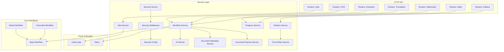
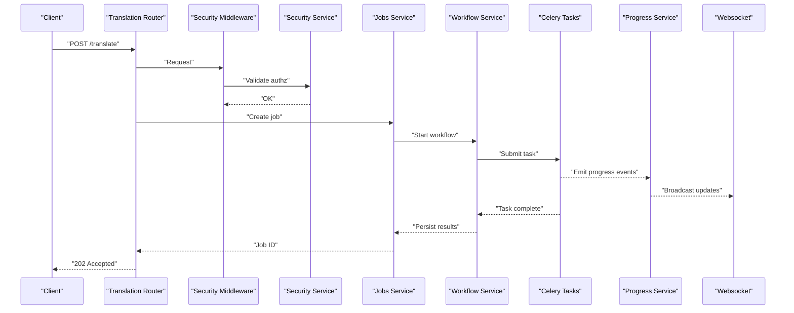
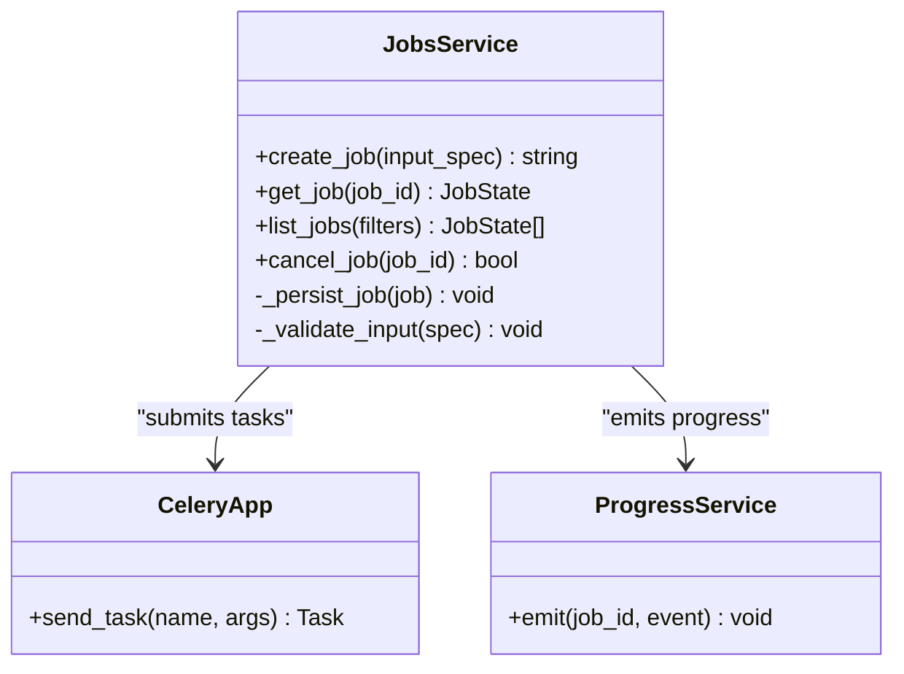
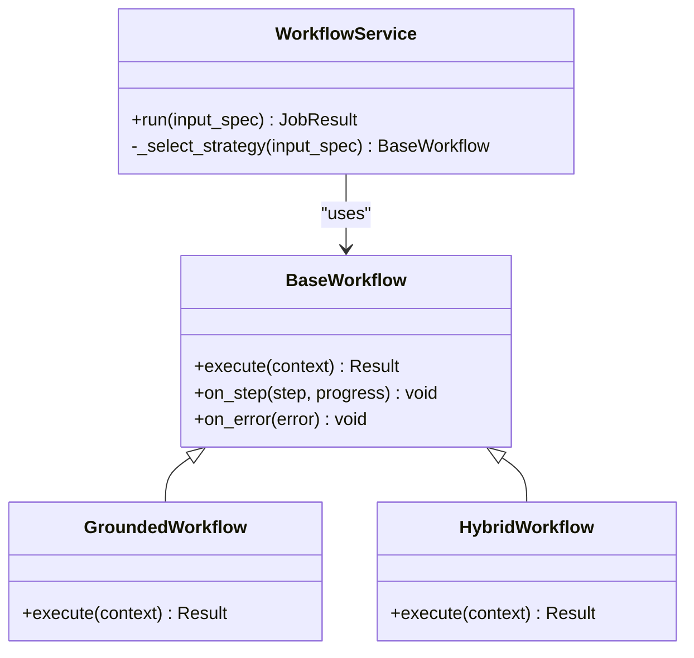
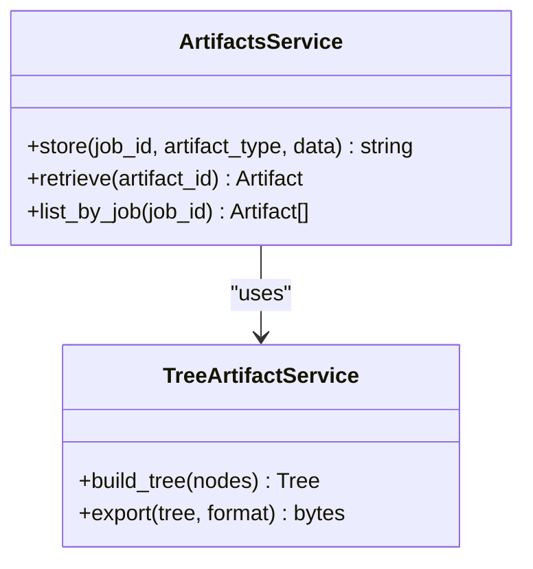
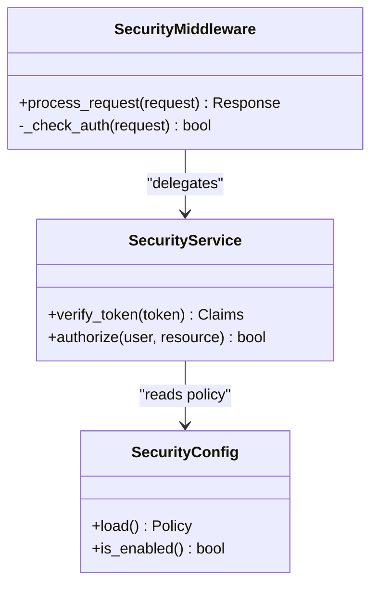
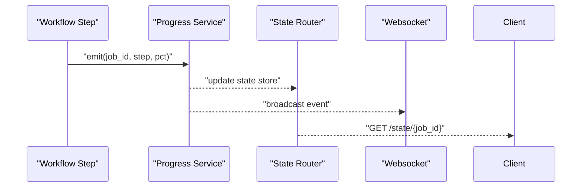
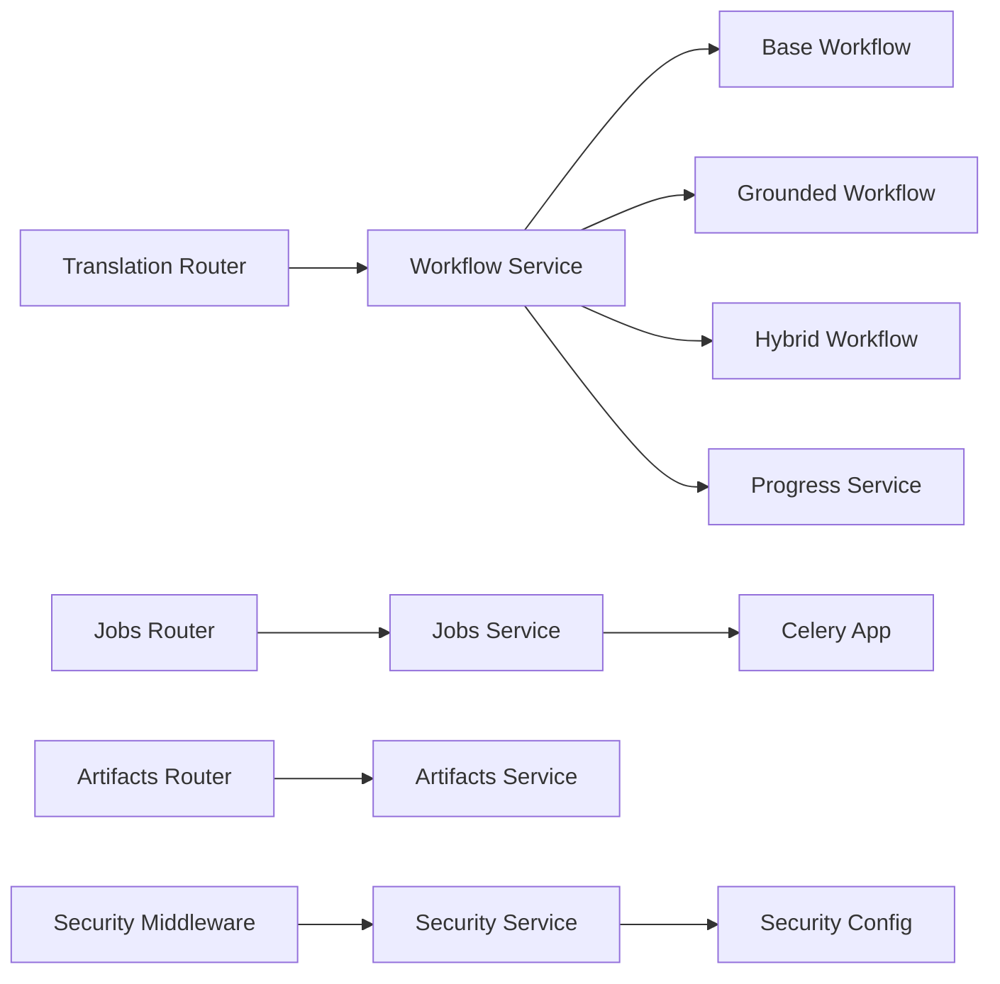

# Service Layer Architecture

<cite>
**Referenced Files in This Document**
- [server.py](file://src/local_deepl/server.py)
- [celery_app.py](file://src/local_deepl/api/celery_app.py)
- [tasks.py](file://src/local_deepl/api/tasks.py)
- [jobs.py](file://src/local_deepl/api/routers/jobs.py)
- [artifacts.py](file://src/local_deepl/api/routers/artifacts.py)
- [translation.py](file://src/local_deepl/api/routers/translation.py)
- [extraction.py](file://src/local_deepl/api/routers/extraction.py)
- [ocr.py](file://src/local_deepl/api/routers/ocr.py)
- [state.py](file://src/local_deepl/api/routers/state.py)
- [websocket.py](file://src/local_deepl/api/routers/websocket.py)
- [jobs_service.py](file://src/local_deepl/api/services/jobs.py)
- [artifacts_service.py](file://src/local_deepl/api/services/artifacts.py)
- [workflow_service.py](file://src/local_deepl/api/services/workflow.py)
- [progress_service.py](file://src/local_deepl/api/services/progress.py)
- [security_service.py](file://src/local_deepl/api/services/security.py)
- [security_config.py](file://src/local_deepl/api/services/security_config.py)
- [security_middleware.py](file://src/local_deepl/api/services/security_middleware.py)
- [ai_service.py](file://src/local_deepl/api/services/ai.py)
- [document_metadata_service.py](file://src/local_deepl/api/services/document_metadata.py)
- [document_exports_service.py](file://src/local_deepl/api/services/document_exports.py)
- [tree_artifact_service.py](file://src/local_deepl/api/services/tree_artifact.py)
- [base_workflow.py](file://src/local_deepl/core/workflows/base.py)
- [grounded_workflow.py](file://src/local_deepl/core/workflows/grounded.py)
- [hybrid_workflow.py](file://src/local_deepl/core/workflows/hybrid.py)
- [conftest.py](file://tests/conftest.py)
- [test_jobs_progress_services.py](file://tests/test_jobs_progress_services.py)
- [test_security_qa.py](file://tests/test_security_qa.py)
- [test_workflows_base.py](file://tests/test_workflows_base.py)
- [test_workflows_grounded.py](file://tests/test_workflows_grounded.py)
- [test_workflows_hybrid.py](file://tests/test_workflows_hybrid.py)
</cite>

## Table of Contents
1. [Introduction](#introduction)
2. [Project Structure](#project-structure)
3. [Core Components](#core-components)
4. [Architecture Overview](#architecture-overview)
5. [Detailed Component Analysis](#detailed-component-analysis)
6. [Dependency Analysis](#dependency-analysis)
7. [Performance Considerations](#performance-considerations)
8. [Troubleshooting Guide](#troubleshooting-guide)
9. [Conclusion](#conclusion)
10. [Appendices](#appendices)

## Introduction
This document describes the service layer architecture of LocalDeepL, focusing on business logic abstraction, service composition patterns, and dependency management. It explains job management, workflow orchestration, artifact handling, security services, progress tracking, and cross-cutting concerns such as middleware and configuration. It also covers interface definitions, error propagation, transactional boundaries, and testing strategies including mocking approaches.

## Project Structure
The service layer is organized under src/local_deepl/api/services and integrates with FastAPI routers, Celery tasks, and core workflow implementations:

- Routers expose HTTP endpoints and delegate to services.
- Services encapsulate business logic and coordinate workflows, artifacts, jobs, and security.
- Core workflows define reusable processing pipelines (grounded, hybrid).
- Celery app and tasks provide asynchronous execution for long-running operations.
- Security middleware and configuration enforce access control and policy.
- Progress service provides real-time status updates via websockets.

**Diagram sources**
- [server.py](file://src/local_deepl/server.py)
- [jobs.py](file://src/local_deepl/api/routers/jobs.py)
- [artifacts.py](file://src/local_deepl/api/routers/artifacts.py)
- [translation.py](file://src/local_deepl/api/routers/translation.py)
- [extraction.py](file://src/local_deepl/api/routers/extraction.py)
- [ocr.py](file://src/local_deepl/api/routers/ocr.py)
- [state.py](file://src/local_deepl/api/routers/state.py)
- [websocket.py](file://src/local_deepl/api/routers/websocket.py)
- [jobs_service.py](file://src/local_deepl/api/services/jobs.py)
- [artifacts_service.py](file://src/local_deepl/api/services/artifacts.py)
- [workflow_service.py](file://src/local_deepl/api/services/workflow.py)
- [progress_service.py](file://src/local_deepl/api/services/progress.py)
- [security_service.py](file://src/local_deepl/api/services/security.py)
- [security_middleware.py](file://src/local_deepl/api/services/security_middleware.py)
- [security_config.py](file://src/local_deepl/api/services/security_config.py)
- [ai_service.py](file://src/local_deepl/api/services/ai.py)
- [document_metadata_service.py](file://src/local_deepl/api/services/document_metadata.py)
- [document_exports_service.py](file://src/local_deepl/api/services/document_exports.py)
- [tree_artifact_service.py](file://src/local_deepl/api/services/tree_artifact.py)
- [base_workflow.py](file://src/local_deepl/core/workflows/base.py)
- [grounded_workflow.py](file://src/local_deepl/core/workflows/grounded.py)
- [hybrid_workflow.py](file://src/local_deepl/core/workflows/hybrid.py)
- [celery_app.py](file://src/local_deepl/api/celery_app.py)
- [tasks.py](file://src/local_deepl/api/tasks.py)

**Section sources**
- [server.py](file://src/local_deepl/server.py)
- [jobs.py](file://src/local_deepl/api/routers/jobs.py)
- [artifacts.py](file://src/local_deepl/api/routers/artifacts.py)
- [translation.py](file://src/local_deepl/api/routers/translation.py)
- [extraction.py](file://src/local_deepl/api/routers/extraction.py)
- [ocr.py](file://src/local_deepl/api/routers/ocr.py)
- [state.py](file://src/local_deepl/api/routers/state.py)
- [websocket.py](file://src/local_deepl/api/routers/websocket.py)
- [jobs_service.py](file://src/local_deepl/api/services/jobs.py)
- [artifacts_service.py](file://src/local_deepl/api/services/artifacts.py)
- [workflow_service.py](file://src/local_deepl/api/services/workflow.py)
- [progress_service.py](file://src/local_deepl/api/services/progress.py)
- [security_service.py](file://src/local_deepl/api/services/security.py)
- [security_middleware.py](file://src/local_deepl/api/services/security_middleware.py)
- [security_config.py](file://src/local_deepl/api/services/security_config.py)
- [ai_service.py](file://src/local_deepl/api/services/ai.py)
- [document_metadata_service.py](file://src/local_deepl/api/services/document_metadata.py)
- [document_exports_service.py](file://src/local_deepl/api/services/document_exports.py)
- [tree_artifact_service.py](file://src/local_deepl/api/services/tree_artifact.py)
- [base_workflow.py](file://src/local_deepl/core/workflows/base.py)
- [grounded_workflow.py](file://src/local_deepl/core/workflows/grounded.py)
- [hybrid_workflow.py](file://src/local_deepl/core/workflows/hybrid.py)
- [celery_app.py](file://src/local_deepl/api/celery_app.py)
- [tasks.py](file://src/local_deepl/api/tasks.py)

## Core Components
- Job Management Service: Creates, queries, and manages lifecycle of translation/extraction jobs; coordinates async task submission and result retrieval.
- Workflow Orchestration Service: Composes multi-step pipelines using base workflow abstractions; selects grounded or hybrid strategies based on input characteristics.
- Artifact Handling Services: Persist and retrieve artifacts (documents, trees, exports); ensure consistent storage semantics and versioning.
- Security Service and Middleware: Enforce authentication, authorization, and policy checks across requests; centralize configuration.
- Progress Service: Publishes granular progress events and exposes them via state endpoints and websockets.
- AI Service: Encapsulates LLM calls and provider selection for grounding and hybrid workflows.
- Document Metadata and Export Services: Manage metadata extraction and export formats.

Key responsibilities and interactions are defined by service interfaces and composed within routers and tasks.

**Section sources**
- [jobs_service.py](file://src/local_deepl/api/services/jobs.py)
- [workflow_service.py](file://src/local_deepl/api/services/workflow.py)
- [artifacts_service.py](file://src/local_deepl/api/services/artifacts.py)
- [tree_artifact_service.py](file://src/local_deepl/api/services/tree_artifact.py)
- [security_service.py](file://src/local_deepl/api/services/security.py)
- [security_middleware.py](file://src/local_deepl/api/services/security_middleware.py)
- [security_config.py](file://src/local_deepl/api/services/security_config.py)
- [progress_service.py](file://src/local_deepl/api/services/progress.py)
- [ai_service.py](file://src/local_deepl/api/services/ai.py)
- [document_metadata_service.py](file://src/local_deepl/api/services/document_metadata.py)
- [document_exports_service.py](file://src/local_deepl/api/services/document_exports.py)

## Architecture Overview
The service layer follows a layered architecture:
- HTTP routers accept requests, validate inputs, and call services.
- Services implement business logic, orchestrate workflows, and manage artifacts.
- Core workflows provide composable steps for OCR, grounding, translation, and post-processing.
- Celery executes long-running tasks asynchronously; progress is emitted to the progress service and broadcast via websockets.
- Security middleware intercepts requests to enforce policies before reaching routers.

**Diagram sources**
- [translation.py](file://src/local_deepl/api/routers/translation.py)
- [security_middleware.py](file://src/local_deepl/api/services/security_middleware.py)
- [security_service.py](file://src/local_deepl/api/services/security.py)
- [jobs_service.py](file://src/local_deepl/api/services/jobs.py)
- [workflow_service.py](file://src/local_deepl/api/services/workflow.py)
- [tasks.py](file://src/local_deepl/api/tasks.py)
- [progress_service.py](file://src/local_deepl/api/services/progress.py)
- [websocket.py](file://src/local_deepl/api/routers/websocket.py)

## Detailed Component Analysis

### Job Management Service
Responsibilities:
- Create jobs with unique identifiers and initial states.
- Track job lifecycle: queued, running, completed, failed.
- Provide query APIs for job status and results.
- Coordinate with workflow service and Celery tasks.

Interface highlights:
- create_job(input_spec) -> job_id
- get_job(job_id) -> job_state
- list_jobs(filters) -> job_list
- cancel_job(job_id) -> bool

Error propagation:
- Returns structured errors for invalid inputs, not found, and permission denied.
- Wraps Celery exceptions into domain-level errors.

Transaction management:
- Ensures atomic creation of job records and initial progress entries.
- Uses rollback on failure during persistence.

**Diagram sources**
- [jobs_service.py](file://src/local_deepl/api/services/jobs.py)
- [celery_app.py](file://src/local_deepl/api/celery_app.py)
- [progress_service.py](file://src/local_deepl/api/services/progress.py)

**Section sources**
- [jobs_service.py](file://src/local_deepl/api/services/jobs.py)
- [celery_app.py](file://src/local_deepl/api/celery_app.py)
- [progress_service.py](file://src/local_deepl/api/services/progress.py)

### Workflow Orchestration Service
Responsibilities:
- Select appropriate workflow strategy (grounded vs hybrid).
- Compose steps: preprocessing, OCR, grounding, translation, postprocessing.
- Manage callbacks and progress emission.
- Handle retries and error recovery.

Composition patterns:
- Strategy pattern for selecting grounded or hybrid workflows.
- Pipeline pattern for stepwise processing.
- Observer pattern for progress callbacks.

**Diagram sources**
- [workflow_service.py](file://src/local_deepl/api/services/workflow.py)
- [base_workflow.py](file://src/local_deepl/core/workflows/base.py)
- [grounded_workflow.py](file://src/local_deepl/core/workflows/grounded.py)
- [hybrid_workflow.py](file://src/local_deepl/core/workflows/hybrid.py)

**Section sources**
- [workflow_service.py](file://src/local_deepl/api/services/workflow.py)
- [base_workflow.py](file://src/local_deepl/core/workflows/base.py)
- [grounded_workflow.py](file://src/local_deepl/core/workflows/grounded.py)
- [hybrid_workflow.py](file://src/local_deepl/core/workflows/hybrid.py)

### Artifact Handling Services
Responsibilities:
- Store and retrieve artifacts (documents, tree structures, exports).
- Ensure consistency between artifact versions and job results.
- Provide efficient listing and filtering.

Services:
- Artifacts Service: high-level artifact operations.
- Tree Artifact Service: specialized handling for hierarchical artifacts.

**Diagram sources**
- [artifacts_service.py](file://src/local_deepl/api/services/artifacts.py)
- [tree_artifact_service.py](file://src/local_deepl/api/services/tree_artifact.py)

**Section sources**
- [artifacts_service.py](file://src/local_deepl/api/services/artifacts.py)
- [tree_artifact_service.py](file://src/local_deepl/api/services/tree_artifact.py)

### Security Service and Middleware
Responsibilities:
- Validate tokens and enforce role-based access.
- Centralize security configuration.
- Intercept requests to protect endpoints.

Patterns:
- Middleware pattern for request interception.
- Configuration-driven policy enforcement.

**Diagram sources**
- [security_middleware.py](file://src/local_deepl/api/services/security_middleware.py)
- [security_service.py](file://src/local_deepl/api/services/security.py)
- [security_config.py](file://src/local_deepl/api/services/security_config.py)

**Section sources**
- [security_middleware.py](file://src/local_deepl/api/services/security_middleware.py)
- [security_service.py](file://src/local_deepl/api/services/security.py)
- [security_config.py](file://src/local_deepl/api/services/security_config.py)

### Progress Tracking Mechanisms
Responsibilities:
- Emit granular progress events per job.
- Broadcast updates via websockets.
- Provide state queries for clients.

Flow:
- Workflow steps emit progress events.
- Progress service persists and broadcasts.
- State router exposes current status.

**Diagram sources**
- [progress_service.py](file://src/local_deepl/api/services/progress.py)
- [state.py](file://src/local_deepl/api/routers/state.py)
- [websocket.py](file://src/local_deepl/api/routers/websocket.py)

**Section sources**
- [progress_service.py](file://src/local_deepl/api/services/progress.py)
- [state.py](file://src/local_deepl/api/routers/state.py)
- [websocket.py](file://src/local_deepl/api/routers/websocket.py)

### Cross-Cutting Concerns
- Logging and metrics: centralized logging in services and tasks.
- Error normalization: consistent error shapes across services.
- Configuration loading: environment-driven settings for security and workflows.
- Dependency injection: services receive dependencies explicitly for testability.

[No sources needed since this section provides general guidance]

## Dependency Analysis
Service dependencies are explicit and minimal:
- Routers depend on services only.
- Services depend on core workflows, Celery app, and utility services.
- Security middleware depends on security service and config.
- Progress service is used by workflows and exposed via routers.

**Diagram sources**
- [translation.py](file://src/local_deepl/api/routers/translation.py)
- [jobs.py](file://src/local_deepl/api/routers/jobs.py)
- [artifacts.py](file://src/local_deepl/api/routers/artifacts.py)
- [workflow_service.py](file://src/local_deepl/api/services/workflow.py)
- [jobs_service.py](file://src/local_deepl/api/services/jobs.py)
- [artifacts_service.py](file://src/local_deepl/api/services/artifacts.py)
- [progress_service.py](file://src/local_deepl/api/services/progress.py)
- [security_middleware.py](file://src/local_deepl/api/services/security_middleware.py)
- [security_service.py](file://src/local_deepl/api/services/security.py)
- [security_config.py](file://src/local_deepl/api/services/security_config.py)
- [base_workflow.py](file://src/local_deepl/core/workflows/base.py)
- [grounded_workflow.py](file://src/local_deepl/core/workflows/grounded.py)
- [hybrid_workflow.py](file://src/local_deepl/core/workflows/hybrid.py)
- [celery_app.py](file://src/local_deepl/api/celery_app.py)

**Section sources**
- [translation.py](file://src/local_deepl/api/routers/translation.py)
- [jobs.py](file://src/local_deepl/api/routers/jobs.py)
- [artifacts.py](file://src/local_deepl/api/routers/artifacts.py)
- [workflow_service.py](file://src/local_deepl/api/services/workflow.py)
- [jobs_service.py](file://src/local_deepl/api/services/jobs.py)
- [artifacts_service.py](file://src/local_deepl/api/services/artifacts.py)
- [progress_service.py](file://src/local_deepl/api/services/progress.py)
- [security_middleware.py](file://src/local_deepl/api/services/security_middleware.py)
- [security_service.py](file://src/local_deepl/api/services/security.py)
- [security_config.py](file://src/local_deepl/api/services/security_config.py)
- [base_workflow.py](file://src/local_deepl/core/workflows/base.py)
- [grounded_workflow.py](file://src/local_deepl/core/workflows/grounded.py)
- [hybrid_workflow.py](file://src/local_deepl/core/workflows/hybrid.py)
- [celery_app.py](file://src/local_deepl/api/celery_app.py)

## Performance Considerations
- Asynchronous execution: Use Celery for CPU-bound and I/O-heavy steps to avoid blocking HTTP responses.
- Streaming progress: Emit frequent small progress events to keep clients updated without heavy payloads.
- Artifact caching: Cache frequently accessed artifacts and metadata to reduce disk I/O.
- Workflow optimization: Choose grounded workflow for text-heavy documents; hybrid for mixed content to balance accuracy and speed.
- Resource limits: Configure Celery concurrency and memory limits per worker type.

[No sources needed since this section provides general guidance]

## Troubleshooting Guide
Common issues and resolutions:
- Job stuck in queued state: Check Celery workers and task queues; verify task submission logs.
- Progress not updating: Ensure progress service emits events at each workflow step; confirm websocket connections are active.
- Security failures: Validate token format and permissions; review security config and middleware logs.
- Artifact retrieval errors: Verify artifact IDs and storage backend availability; check permissions.

Diagnostic utilities:
- State endpoint for job details.
- Websocket client for live progress.
- Security QA tests for policy validation.

**Section sources**
- [state.py](file://src/local_deepl/api/routers/state.py)
- [websocket.py](file://src/local_deepl/api/routers/websocket.py)
- [test_security_qa.py](file://tests/test_security_qa.py)

## Conclusion
LocalDeepL’s service layer cleanly separates HTTP concerns from business logic through well-defined services. Job management, workflow orchestration, artifact handling, security, and progress tracking are modular and composable. The design supports asynchronous execution, robust error propagation, and clear testing strategies. Adopting these patterns ensures maintainability and scalability as features evolve.

[No sources needed since this section summarizes without analyzing specific files]

## Appendices

### Service Interface Definitions
- Jobs Service: create_job, get_job, list_jobs, cancel_job.
- Workflow Service: run, select_strategy, handle_callbacks.
- Artifacts Service: store, retrieve, list_by_job.
- Tree Artifact Service: build_tree, export.
- Security Service: verify_token, authorize.
- Progress Service: emit, get_status.

[No sources needed since this section lists interfaces conceptually]

### Error Propagation Patterns
- Normalize exceptions into domain-specific error objects.
- Include contextual information (job_id, step, message).
- Surface user-friendly messages while preserving detailed logs.

[No sources needed since this section provides general guidance]

### Transaction Management
- Atomic job creation with initial progress entry.
- Rollback on persistence failures.
- Idempotent task completion handlers.

[No sources needed since this section provides general guidance]

### Testing Strategies and Mocking Approaches
- Unit tests for services with mocked dependencies (Celery, progress, artifacts).
- Integration tests for routers invoking services and verifying responses.
- Workflow tests covering base, grounded, and hybrid strategies.
- Security tests validating middleware and policy enforcement.

Example test files:
- conftest.py for shared fixtures.
- test_jobs_progress_services.py for job and progress behavior.
- test_security_qa.py for security validations.
- test_workflows_base.py, test_workflows_grounded.py, test_workflows_hybrid.py for workflow strategies.

**Section sources**
- [conftest.py](file://tests/conftest.py)
- [test_jobs_progress_services.py](file://tests/test_jobs_progress_services.py)
- [test_security_qa.py](file://tests/test_security_qa.py)
- [test_workflows_base.py](file://tests/test_workflows_base.py)
- [test_workflows_grounded.py](file://tests/test_workflows_grounded.py)
- [test_workflows_hybrid.py](file://tests/test_workflows_hybrid.py)