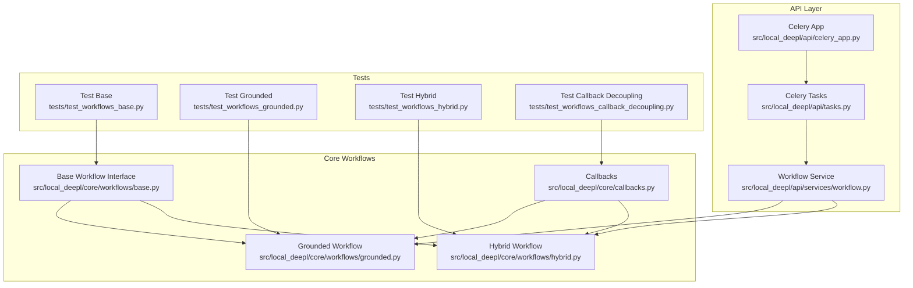
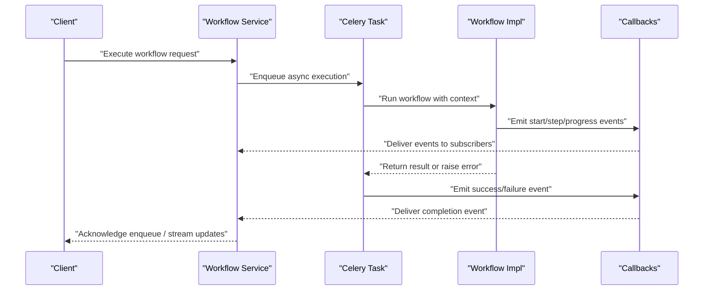
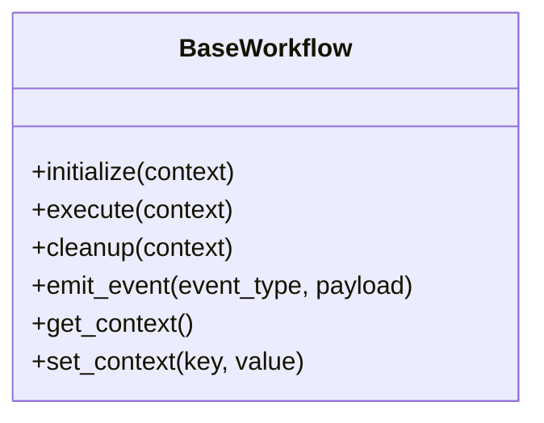
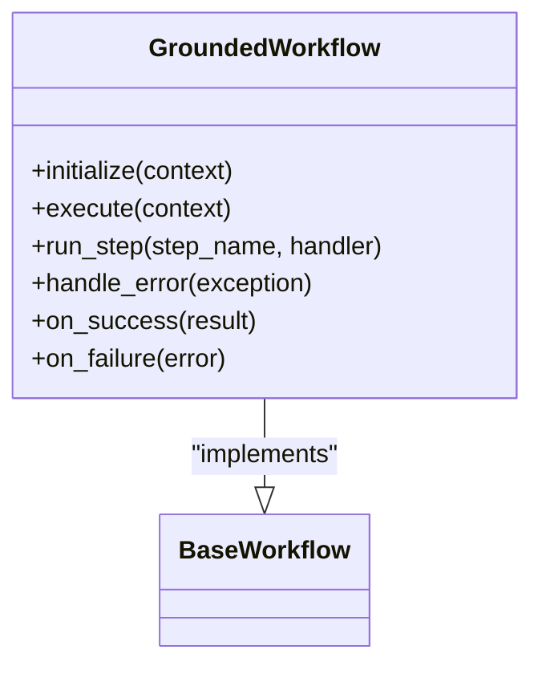
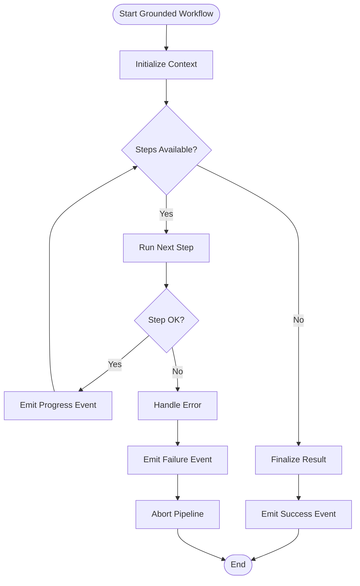
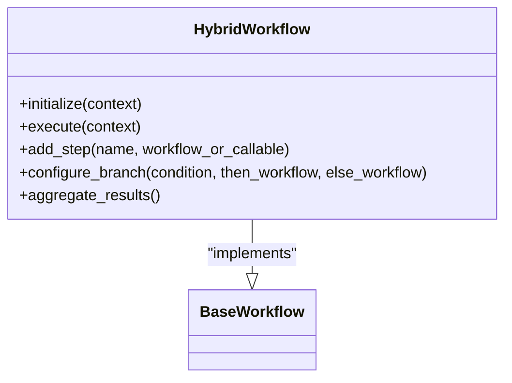
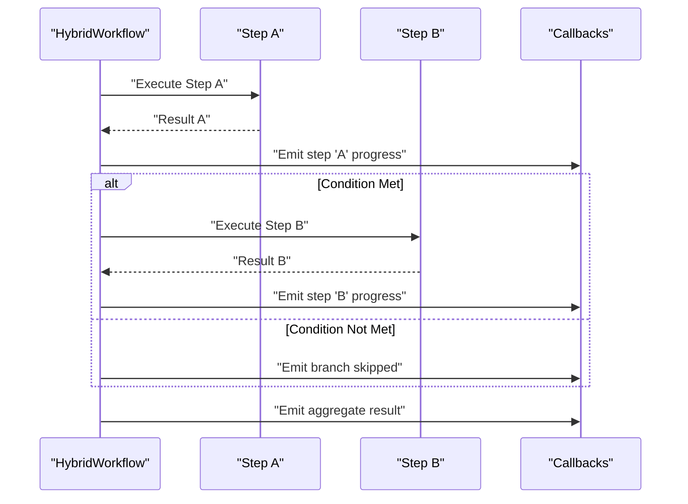
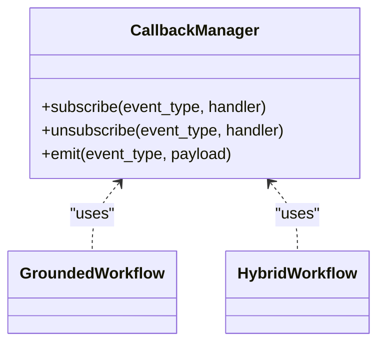
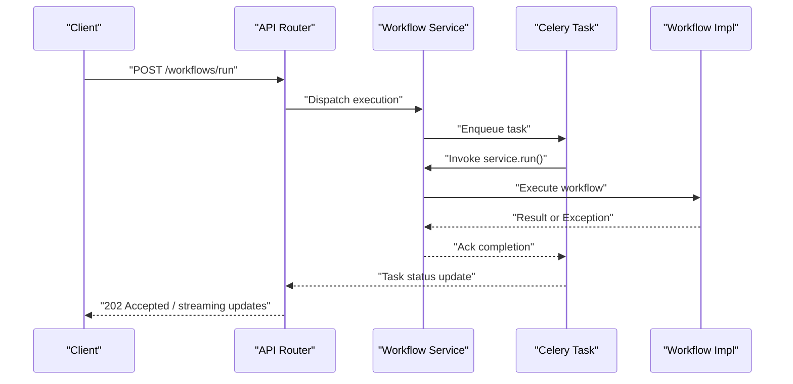
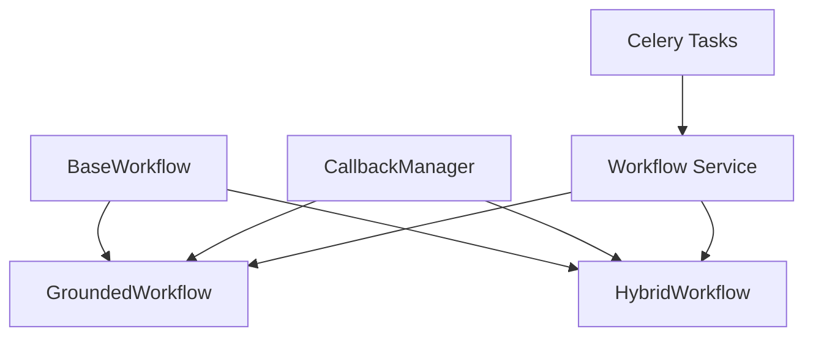

# Workflow Orchestration Service

<cite>
**Referenced Files in This Document**
- [base.py](file://src/local_deepl/core/workflows/base.py)
- [grounded.py](file://src/local_deepl/core/workflows/grounded.py)
- [hybrid.py](file://src/local_deepl/core/workflows/hybrid.py)
- [callbacks.py](file://src/local_deepl/core/callbacks.py)
- [workflow.py](file://src/local_deepl/api/services/workflow.py)
- [tasks.py](file://src/local_deepl/api/tasks.py)
- [celery_app.py](file://src/local_deepl/api/celery_app.py)
- [test_workflows_base.py](file://tests/test_workflows_base.py)
- [test_workflows_grounded.py](file://tests/test_workflows_grounded.py)
- [test_workflows_hybrid.py](file://tests/test_workflows_hybrid.py)
- [test_workflows_callback_decoupling.py](file://tests/test_workflows_callback_decoupling.py)
</cite>

## Table of Contents
1. [Introduction](#introduction)
2. [Project Structure](#project-structure)
3. [Core Components](#core-components)
4. [Architecture Overview](#architecture-overview)
5. [Detailed Component Analysis](#detailed-component-analysis)
6. [Dependency Analysis](#dependency-analysis)
7. [Performance Considerations](#performance-considerations)
8. [Troubleshooting Guide](#troubleshooting-guide)
9. [Conclusion](#conclusion)
10. [Appendices](#appendices)

## Introduction
This document explains the Workflow Orchestration Service, focusing on its pluggable workflow architecture, composition patterns, and execution context management. It documents the base workflow interface, grounded workflow implementation, and hybrid workflow strategies. It also covers workflow state management, error propagation, callback mechanisms, and provides guidance for developing custom workflows and integrating them with the document processing pipeline.

## Project Structure
The workflow orchestration service is implemented under the core workflows module and exposed via API services and background tasks. The key files are:
- Base workflow interface and shared abstractions
- Grounded workflow implementation
- Hybrid workflow strategy combining multiple steps
- Callback system for decoupled eventing
- API service wiring and Celery task integration
- Tests validating behavior and contract compliance

**Diagram sources**
- [base.py](file://src/local_deepl/core/workflows/base.py)
- [grounded.py](file://src/local_deepl/core/workflows/grounded.py)
- [hybrid.py](file://src/local_deepl/core/workflows/hybrid.py)
- [callbacks.py](file://src/local_deepl/core/callbacks.py)
- [workflow.py](file://src/local_deepl/api/services/workflow.py)
- [tasks.py](file://src/local_deepl/api/tasks.py)
- [celery_app.py](file://src/local_deepl/api/celery_app.py)
- [test_workflows_base.py](file://tests/test_workflows_base.py)
- [test_workflows_grounded.py](file://tests/test_workflows_grounded.py)
- [test_workflows_hybrid.py](file://tests/test_workflows_hybrid.py)
- [test_workflows_callback_decoupling.py](file://tests/test_workflows_callback_decoupling.py)

**Section sources**
- [base.py](file://src/local_deepl/core/workflows/base.py)
- [grounded.py](file://src/local_deepl/core/workflows/grounded.py)
- [hybrid.py](file://src/local_deepl/core/workflows/hybrid.py)
- [callbacks.py](file://src/local_deepl/core/callbacks.py)
- [workflow.py](file://src/local_deepl/api/services/workflow.py)
- [tasks.py](file://src/local_deepl/api/tasks.py)
- [celery_app.py](file://src/local_deepl/api/celery_app.py)
- [test_workflows_base.py](file://tests/test_workflows_base.py)
- [test_workflows_grounded.py](file://tests/test_workflows_grounded.py)
- [test_workflows_hybrid.py](file://tests/test_workflows_hybrid.py)
- [test_workflows_callback_decoupling.py](file://tests/test_workflows_callback_decoupling.py)

## Core Components
- Base workflow interface: Defines the contract for all workflows, including lifecycle hooks, execution context access, and standardized error handling.
- Grounded workflow: Implements a concrete workflow that operates on grounded document structures, providing step-by-step processing with robust callbacks and state transitions.
- Hybrid workflow: Composes multiple sub-steps or strategies into a single executable unit, enabling flexible pipelines such as OCR + translation + post-processing.
- Callback system: Provides decoupled event emission and subscription to workflow events (start, step, progress, success, failure), allowing external observers without tight coupling.
- API service and tasks: Expose workflow execution through an API service and run them asynchronously via Celery tasks, ensuring scalability and resilience.

Key responsibilities:
- Pluggability: New workflows can be added by implementing the base interface.
- Composition: Hybrid workflows combine smaller steps into complex pipelines.
- Context management: Execution context is passed consistently across steps and callbacks.
- Error propagation: Errors are captured and propagated up the call stack while emitting failure callbacks.
- Observability: Callbacks enable progress tracking and audit trails.

**Section sources**
- [base.py](file://src/local_deepl/core/workflows/base.py)
- [grounded.py](file://src/local_deepl/core/workflows/grounded.py)
- [hybrid.py](file://src/local_deepl/core/workflows/hybrid.py)
- [callbacks.py](file://src/local_deepl/core/callbacks.py)
- [workflow.py](file://src/local_deepl/api/services/workflow.py)
- [tasks.py](file://src/local_deepl/api/tasks.py)
- [celery_app.py](file://src/local_deepl/api/celery_app.py)

## Architecture Overview
The orchestration architecture separates concerns between workflow definitions, execution context, and asynchronous dispatch. The API layer invokes the workflow service, which delegates to specific workflow implementations. Background tasks execute workflows off the request path, leveraging Celery for reliability and scaling.

**Diagram sources**
- [workflow.py](file://src/local_deepl/api/services/workflow.py)
- [tasks.py](file://src/local_deepl/api/tasks.py)
- [celery_app.py](file://src/local_deepl/api/celery_app.py)
- [callbacks.py](file://src/local_deepl/core/callbacks.py)
- [grounded.py](file://src/local_deepl/core/workflows/grounded.py)
- [hybrid.py](file://src/local_deepl/core/workflows/hybrid.py)

## Detailed Component Analysis

### Base Workflow Interface
The base workflow defines the standard contract for all workflows:
- Lifecycle methods: initialization, execution entry point, cleanup
- Execution context: shared data and configuration accessible during steps
- Error handling: consistent exception semantics and propagation
- Callback integration: emits lifecycle and step events

**Diagram sources**
- [base.py](file://src/local_deepl/core/workflows/base.py)

**Section sources**
- [base.py](file://src/local_deepl/core/workflows/base.py)
- [test_workflows_base.py](file://tests/test_workflows_base.py)

### Grounded Workflow Implementation
The grounded workflow implements the base interface to process grounded document structures. It orchestrates a sequence of steps, manages state transitions, and integrates with the callback system for observability.

Execution flow highlights:
- Step registration and ordered execution
- State transitions per step (pending -> running -> completed/failed)
- Error capture and propagation with failure callbacks
- Success aggregation and finalization

**Diagram sources**
- [grounded.py](file://src/local_deepl/core/workflows/grounded.py)
- [callbacks.py](file://src/local_deepl/core/callbacks.py)

**Section sources**
- [grounded.py](file://src/local_deepl/core/workflows/grounded.py)
- [test_workflows_grounded.py](file://tests/test_workflows_grounded.py)

### Hybrid Workflow Strategy
The hybrid workflow composes multiple sub-workflows or steps into a single executable unit. It supports conditional branching, parallelism where applicable, and unified error handling.

Composition patterns:
- Sequential chaining of steps
- Conditional branching based on context flags
- Aggregation of intermediate results
- Unified error propagation across branches

**Diagram sources**
- [hybrid.py](file://src/local_deepl/core/workflows/hybrid.py)
- [callbacks.py](file://src/local_deepl/core/callbacks.py)

**Section sources**
- [hybrid.py](file://src/local_deepl/core/workflows/hybrid.py)
- [test_workflows_hybrid.py](file://tests/test_workflows_hybrid.py)

### Callback Mechanisms
The callback system enables decoupled eventing across workflows and services. It supports:
- Event types: start, step, progress, success, failure
- Subscribers: external observers (logging, metrics, UI updates)
- Delivery guarantees: synchronous emission within workflow execution; asynchronous delivery via API service if needed

**Diagram sources**
- [callbacks.py](file://src/local_deepl/core/callbacks.py)
- [grounded.py](file://src/local_deepl/core/workflows/grounded.py)
- [hybrid.py](file://src/local_deepl/core/workflows/hybrid.py)

**Section sources**
- [callbacks.py](file://src/local_deepl/core/callbacks.py)
- [test_workflows_callback_decoupling.py](file://tests/test_workflows_callback_decoupling.py)

### API Service and Task Integration
The API service exposes workflow execution endpoints and enqueues Celery tasks for asynchronous processing. Tasks invoke the workflow service, which runs the selected workflow implementation and returns results or errors.

**Diagram sources**
- [workflow.py](file://src/local_deepl/api/services/workflow.py)
- [tasks.py](file://src/local_deepl/api/tasks.py)
- [celery_app.py](file://src/local_deepl/api/celery_app.py)

**Section sources**
- [workflow.py](file://src/local_deepl/api/services/workflow.py)
- [tasks.py](file://src/local_deepl/api/tasks.py)
- [celery_app.py](file://src/local_deepl/api/celery_app.py)

## Dependency Analysis
The workflow components exhibit clear separation of concerns:
- Base workflow defines the contract used by grounded and hybrid implementations
- Callback manager is a dependency for both grounded and hybrid workflows
- API service depends on workflow implementations and Celery tasks
- Tests validate contracts and behaviors independently

**Diagram sources**
- [base.py](file://src/local_deepl/core/workflows/base.py)
- [grounded.py](file://src/local_deepl/core/workflows/grounded.py)
- [hybrid.py](file://src/local_deepl/core/workflows/hybrid.py)
- [callbacks.py](file://src/local_deepl/core/callbacks.py)
- [workflow.py](file://src/local_deepl/api/services/workflow.py)
- [tasks.py](file://src/local_deepl/api/tasks.py)

**Section sources**
- [base.py](file://src/local_deepl/core/workflows/base.py)
- [grounded.py](file://src/local_deepl/core/workflows/grounded.py)
- [hybrid.py](file://src/local_deepl/core/workflows/hybrid.py)
- [callbacks.py](file://src/local_deepl/core/callbacks.py)
- [workflow.py](file://src/local_deepl/api/services/workflow.py)
- [tasks.py](file://src/local_deepl/api/tasks.py)

## Performance Considerations
- Asynchronous execution: Use Celery tasks to avoid blocking HTTP requests and improve throughput.
- Step granularity: Keep steps small and focused to enable better progress reporting and easier retries.
- Context sharing: Minimize heavy object copying in execution context; prefer references and lazy loading.
- Callback efficiency: Avoid expensive operations in callback handlers; consider batching or async delivery for high-frequency events.
- Resource cleanup: Ensure resources are released in cleanup hooks to prevent leaks during long-running workflows.

[No sources needed since this section provides general guidance]

## Troubleshooting Guide
Common issues and resolutions:
- Missing callbacks: Verify subscribers are registered before workflow execution and that event names match expected types.
- Error propagation failures: Ensure exceptions are raised consistently and caught at appropriate boundaries; check failure callbacks are emitted.
- Stuck workflows: Inspect step completion events and progress emissions; confirm no infinite loops or unhandled conditions.
- Task failures: Review Celery logs and task status updates; ensure proper serialization of inputs and outputs.

Validation points from tests:
- Base workflow contract adherence
- Grounded workflow step execution and error handling
- Hybrid workflow composition and branching logic
- Callback decoupling and event delivery

**Section sources**
- [test_workflows_base.py](file://tests/test_workflows_base.py)
- [test_workflows_grounded.py](file://tests/test_workflows_grounded.py)
- [test_workflows_hybrid.py](file://tests/test_workflows_hybrid.py)
- [test_workflows_callback_decoupling.py](file://tests/test_workflows_callback_decoupling.py)

## Conclusion
The Workflow Orchestration Service provides a robust, pluggable foundation for building and composing document processing workflows. Its base interface ensures consistency, while grounded and hybrid implementations offer practical strategies for sequential and composite pipelines. The callback system enables decoupled observability, and the API/task integration delivers scalable execution. By following the documented patterns, developers can extend the system with custom workflows and integrate seamlessly with the broader document processing pipeline.

[No sources needed since this section summarizes without analyzing specific files]

## Appendices

### Custom Workflow Development Checklist
- Implement the base workflow interface and override lifecycle methods
- Manage execution context using provided setters/getters
- Emit lifecycle and step events via the callback manager
- Handle errors explicitly and propagate them consistently
- Add unit tests covering normal paths, error paths, and edge cases
- Integrate with the API service and Celery tasks for production use

**Section sources**
- [base.py](file://src/local_deepl/core/workflows/base.py)
- [callbacks.py](file://src/local_deepl/core/callbacks.py)
- [workflow.py](file://src/local_deepl/api/services/workflow.py)
- [tasks.py](file://src/local_deepl/api/tasks.py)