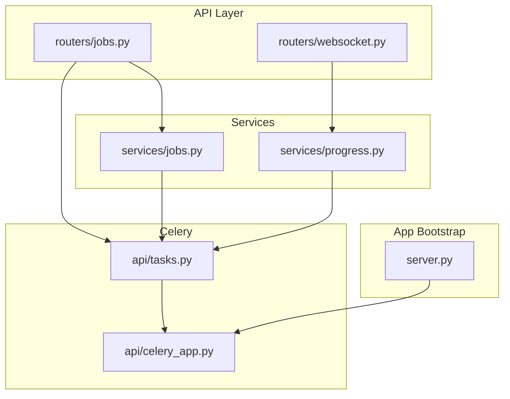
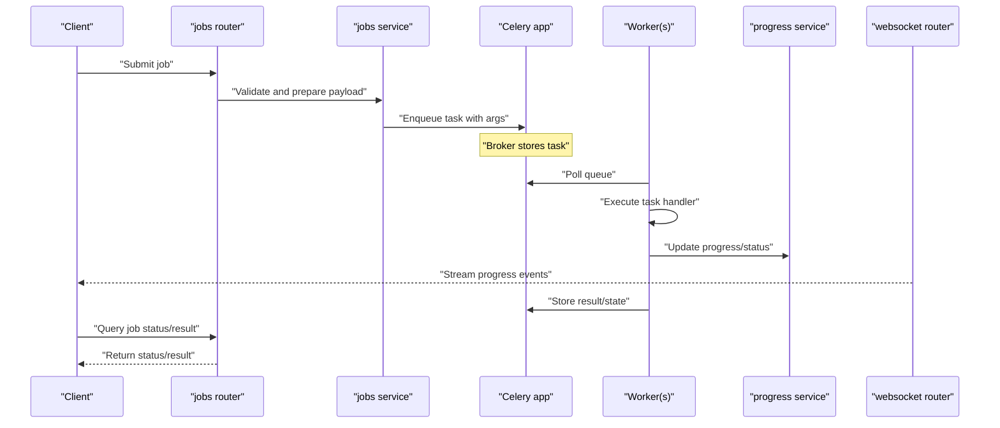
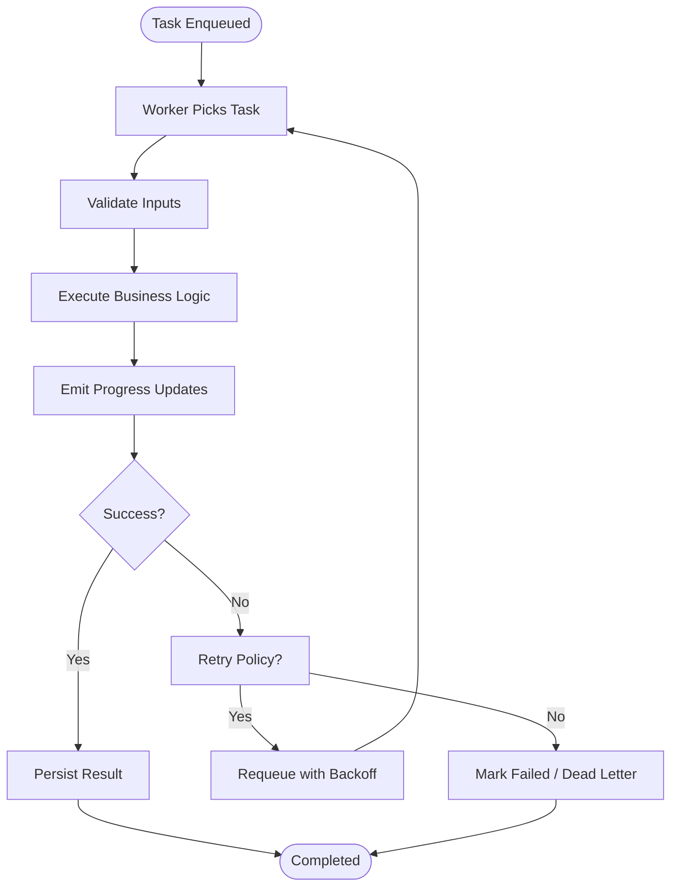
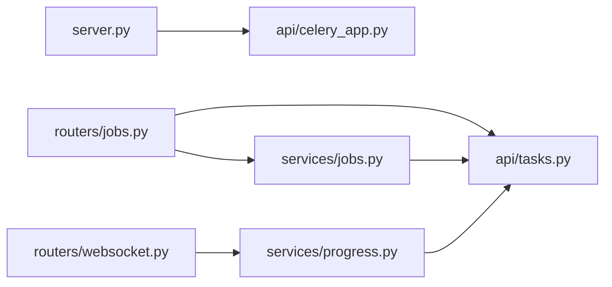

# Background Job Queue

<cite>
**Referenced Files in This Document**
- [celery_app.py](file://src/local_deepl/api/celery_app.py)
- [tasks.py](file://src/local_deepl/api/tasks.py)
- [jobs.py](file://src/local_deepl/api/routers/jobs.py)
- [jobs_service.py](file://src/local_deepl/api/services/jobs.py)
- [progress_service.py](file://src/local_deepl/api/services/progress.py)
- [websocket_router.py](file://src/local_deepl/api/routers/websocket.py)
- [server.py](file://src/local_deepl/server.py)
</cite>

## Table of Contents
1. [Introduction](#introduction)
2. [Project Structure](#project-structure)
3. [Core Components](#core-components)
4. [Architecture Overview](#architecture-overview)
5. [Detailed Component Analysis](#detailed-component-analysis)
6. [Dependency Analysis](#dependency-analysis)
7. [Performance Considerations](#performance-considerations)
8. [Troubleshooting Guide](#troubleshooting-guide)
9. [Conclusion](#conclusion)

## Introduction
This document explains the background job queue system implemented with Celery. It covers how jobs are created, enqueued, assigned to workers, and executed end-to-end. It also documents task serialization, retry mechanisms, failure handling, monitoring, progress tracking, result persistence, scaling strategies, load balancing across queues, and performance tuning. The goal is to provide both a high-level understanding and actionable guidance for operators and developers.

## Project Structure
The background job system spans API routers (job submission), services (business logic and state management), Celery app and tasks (queueing and execution), and WebSocket endpoints (real-time updates).

**Diagram sources**
- [jobs.py](file://src/local_deepl/api/routers/jobs.py)
- [jobs_service.py](file://src/local_deepl/api/services/jobs.py)
- [progress_service.py](file://src/local_deepl/api/services/progress.py)
- [websocket_router.py](file://src/local_deepl/api/routers/websocket.py)
- [celery_app.py](file://src/local_deepl/api/celery_app.py)
- [tasks.py](file://src/local_deepl/api/tasks.py)
- [server.py](file://src/local_deepl/server.py)

**Section sources**
- [server.py](file://src/local_deepl/server.py)
- [celery_app.py](file://src/local_deepl/api/celery_app.py)
- [tasks.py](file://src/local_deepl/api/tasks.py)
- [jobs.py](file://src/local_deepl/api/routers/jobs.py)
- [jobs_service.py](file://src/local_deepl/api/services/jobs.py)
- [progress_service.py](file://src/local_deepl/api/services/progress.py)
- [websocket_router.py](file://src/local_deepl/api/routers/websocket.py)

## Core Components
- Celery application: Initializes the broker, backend, and worker configuration.
- Task definitions: Declare long-running or CPU-bound work units that Celery executes.
- Job submission router: Accepts client requests, validates inputs, persists job metadata, and enqueues tasks.
- Services: Encapsulate business logic for job lifecycle, progress aggregation, and result storage.
- WebSocket router: Streams real-time progress and status updates to clients.
- Server bootstrap: Wires up routes and ensures Celery app is available to workers and API processes.

Key responsibilities:
- Enqueueing: Convert request payloads into serializable task arguments and dispatch via Celery.
- Execution: Workers pull tasks from queues, execute handlers, update progress, and persist results.
- Monitoring: Expose status and progress through REST and WebSocket interfaces.
- Reliability: Implement retries, error classification, and dead-lettering where applicable.

**Section sources**
- [celery_app.py](file://src/local_deepl/api/celery_app.py)
- [tasks.py](file://src/local_deepl/api/tasks.py)
- [jobs.py](file://src/local_deepl/api/routers/jobs.py)
- [jobs_service.py](file://src/local_deepl/api/services/jobs.py)
- [progress_service.py](file://src/local_deepl/api/services/progress.py)
- [websocket_router.py](file://src/local_deepl/api/routers/websocket.py)
- [server.py](file://src/local_deepl/server.py)

## Architecture Overview
The system follows a producer-consumer pattern:
- Producers: API routers and services enqueue tasks using Celery.
- Broker: Message broker holds queued tasks until workers consume them.
- Consumers: One or more Celery workers process tasks concurrently.
- Backend: Stores task states, results, and progress.
- Real-time updates: WebSocket endpoint streams progress to clients.

**Diagram sources**
- [jobs.py](file://src/local_deepl/api/routers/jobs.py)
- [jobs_service.py](file://src/local_deepl/api/services/jobs.py)
- [celery_app.py](file://src/local_deepl/api/celery_app.py)
- [tasks.py](file://src/local_deepl/api/tasks.py)
- [progress_service.py](file://src/local_deepl/api/services/progress.py)
- [websocket_router.py](file://src/local_deepl/api/routers/websocket.py)

## Detailed Component Analysis

### Celery Application Configuration
Responsibilities:
- Initialize Celery instance with broker URL, result backend, and worker settings.
- Configure task serialization format and concurrency options.
- Provide shared configuration consumed by both API and worker processes.

Operational notes:
- Ensure broker connectivity and backend availability before starting workers.
- Tune concurrency and prefetch limits based on workload characteristics.

**Section sources**
- [celery_app.py](file://src/local_deepl/api/celery_app.py)

### Task Definitions and Execution Lifecycle
Responsibilities:
- Define Celery tasks that encapsulate unit-of-work.
- Handle input validation, resource acquisition, and cleanup.
- Emit periodic progress updates and handle exceptions consistently.

Lifecycle highlights:
- Enqueue: Producer calls task.apply_async with routing and retry options.
- Dispatch: Broker delivers to an available worker.
- Execute: Worker invokes task handler; updates progress and results.
- Complete: Result stored in backend; consumers can poll or subscribe via WebSocket.

**Diagram sources**
- [tasks.py](file://src/local_deepl/api/tasks.py)
- [progress_service.py](file://src/local_deepl/api/services/progress.py)

**Section sources**
- [tasks.py](file://src/local_deepl/api/tasks.py)
- [progress_service.py](file://src/local_deepl/api/services/progress.py)

### Job Submission and Routing
Responsibilities:
- Accept job creation requests, validate schemas, and persist initial job metadata.
- Route tasks to appropriate queues based on type or priority.
- Return immediate acknowledgment to clients with job identifiers.

Routing considerations:
- Use dedicated queues for heavy vs. light tasks.
- Apply routing rules to balance load across specialized workers.

**Section sources**
- [jobs.py](file://src/local_deepl/api/routers/jobs.py)
- [jobs_service.py](file://src/local_deepl/api/services/jobs.py)

### Progress Tracking and Real-Time Updates
Responsibilities:
- Aggregate per-task progress and expose it via REST and WebSocket.
- Push incremental updates to connected clients without polling overhead.

Implementation patterns:
- Workers call progress service to record steps and percentages.
- WebSocket router fans out events to subscribers for a given job.

**Section sources**
- [progress_service.py](file://src/local_deepl/api/services/progress.py)
- [websocket_router.py](file://src/local_deepl/api/routers/websocket.py)

### Result Persistence and Retrieval
Responsibilities:
- Store final outputs and metadata in a durable backend.
- Provide endpoints to retrieve completed results and audit history.

Design notes:
- Separate transient progress data from final results.
- Ensure idempotent writes when reprocessing failed tasks.

**Section sources**
- [jobs_service.py](file://src/local_deepl/api/services/jobs.py)
- [progress_service.py](file://src/local_deepl/api/services/progress.py)

### Server Bootstrap and Integration
Responsibilities:
- Initialize application components and ensure Celery app is discoverable.
- Register routers and configure middleware.

Integration points:
- API server imports Celery app to enqueue tasks.
- Worker processes import the same app to execute tasks.

**Section sources**
- [server.py](file://src/local_deepl/server.py)
- [celery_app.py](file://src/local_deepl/api/celery_app.py)

## Dependency Analysis
High-level dependencies between modules:

**Diagram sources**
- [server.py](file://src/local_deepl/server.py)
- [celery_app.py](file://src/local_deepl/api/celery_app.py)
- [jobs.py](file://src/local_deepl/api/routers/jobs.py)
- [jobs_service.py](file://src/local_deepl/api/services/jobs.py)
- [tasks.py](file://src/local_deepl/api/tasks.py)
- [progress_service.py](file://src/local_deepl/api/services/progress.py)
- [websocket_router.py](file://src/local_deepl/api/routers/websocket.py)

**Section sources**
- [server.py](file://src/local_deepl/server.py)
- [celery_app.py](file://src/local_deepl/api/celery_app.py)
- [jobs.py](file://src/local_deepl/api/routers/jobs.py)
- [jobs_service.py](file://src/local_deepl/api/services/jobs.py)
- [tasks.py](file://src/local_deepl/api/tasks.py)
- [progress_service.py](file://src/local_deepl/api/services/progress.py)
- [websocket_router.py](file://src/local_deepl/api/routers/websocket.py)

## Performance Considerations
- Concurrency and Prefetch:
  - Adjust worker concurrency and prefetch multiplier to match CPU/memory profile and I/O characteristics.
  - For CPU-bound tasks, set concurrency close to CPU cores; for I/O-bound tasks, increase concurrency moderately.
- Queue Partitioning:
  - Use separate queues for different job types to prevent starvation and enable targeted scaling.
- Serialization:
  - Choose efficient serialization formats and avoid large payloads; prefer references to persisted artifacts.
- Result Backend:
  - Select a backend optimized for write throughput and durability; consider TTLs for ephemeral results.
- Scaling Workers:
  - Horizontal scaling: run multiple worker processes or hosts per queue.
  - Vertical scaling: tune memory and CPU allocation per worker.
- Throughput Optimization:
  - Batch small tasks if feasible at the producer level.
  - Avoid excessive logging during hot paths; use structured logs and sampling.
- Backpressure:
  - Monitor queue depth and worker utilization; auto-scale workers based on metrics.

[No sources needed since this section provides general guidance]

## Troubleshooting Guide
Common issues and resolutions:
- Broker Connectivity:
  - Symptoms: Workers fail to start or cannot pick up tasks.
  - Actions: Verify broker URL, network access, credentials, and firewall rules.
- Result Backend Errors:
  - Symptoms: Task states not updated or results missing.
  - Actions: Check backend connection, permissions, and disk space; verify TTL policies.
- Stalled or Slow Tasks:
  - Symptoms: Long-running tasks exceed timeouts or appear stuck.
  - Actions: Inspect worker logs, add progress checkpoints, adjust soft/hard time limits, and review resource contention.
- Memory Leaks:
  - Symptoms: Worker memory grows over time.
  - Actions: Enable periodic worker restarts, profile allocations, and release resources explicitly.
- Queue Imbalance:
  - Symptoms: Some queues backlog while others idle.
  - Actions: Redistribute tasks across queues, scale specific queues independently, and review routing rules.
- Retry Storms:
  - Symptoms: Rapid re-enqueue after failures.
  - Actions: Implement exponential backoff, circuit breakers, and classify transient vs. permanent errors.

**Section sources**
- [celery_app.py](file://src/local_deepl/api/celery_app.py)
- [tasks.py](file://src/local_deepl/api/tasks.py)
- [progress_service.py](file://src/local_deepl/api/services/progress.py)

## Conclusion
The Celery-based background job system separates producers and consumers, enabling scalable and resilient processing. By carefully configuring queues, workers, and the result backend, and by implementing robust progress tracking and real-time updates, the system supports high-throughput workloads with clear observability. Use the troubleshooting and performance sections to maintain stability and optimize throughput under varying loads.