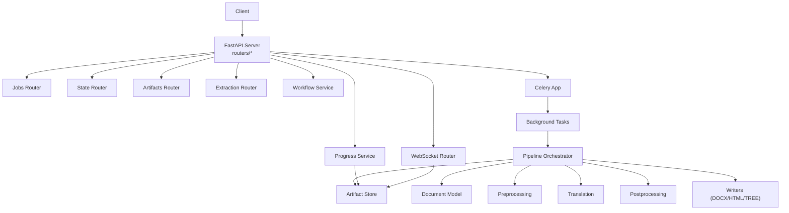
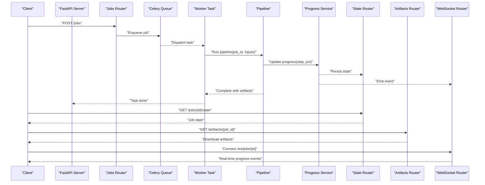
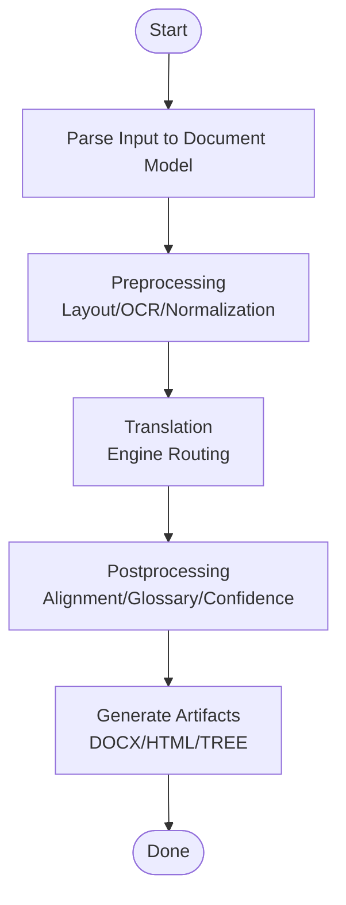
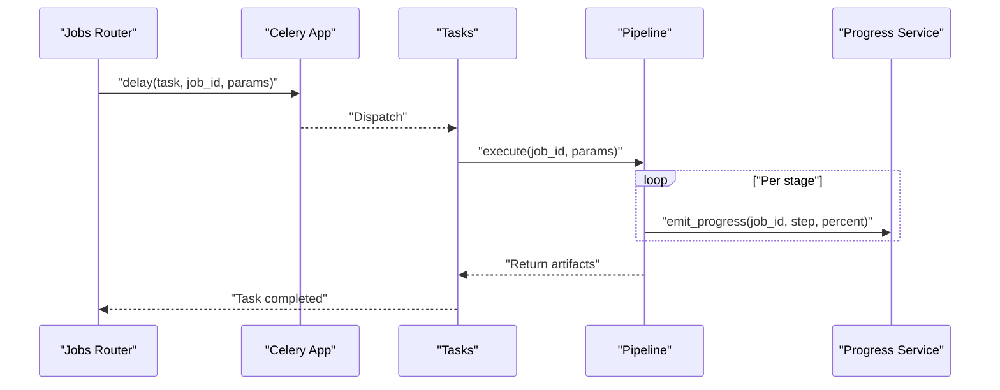
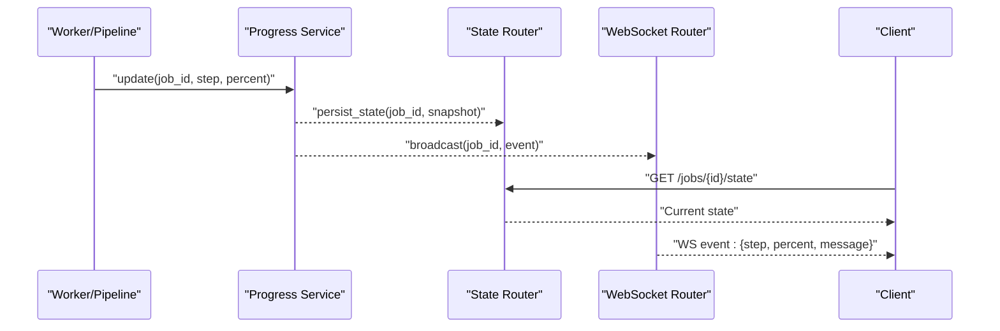
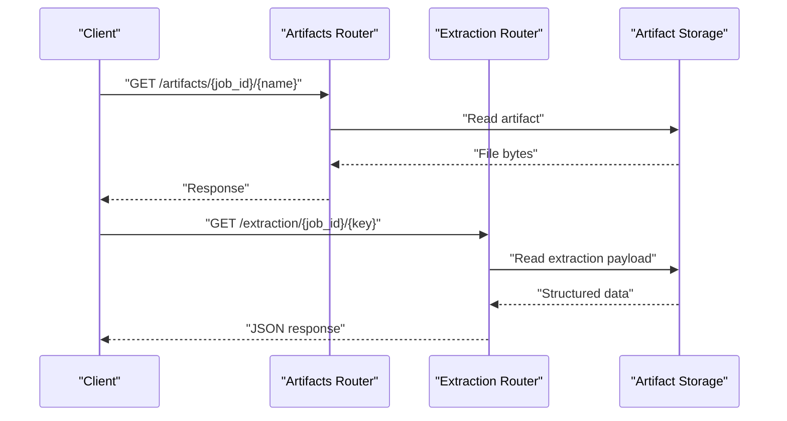
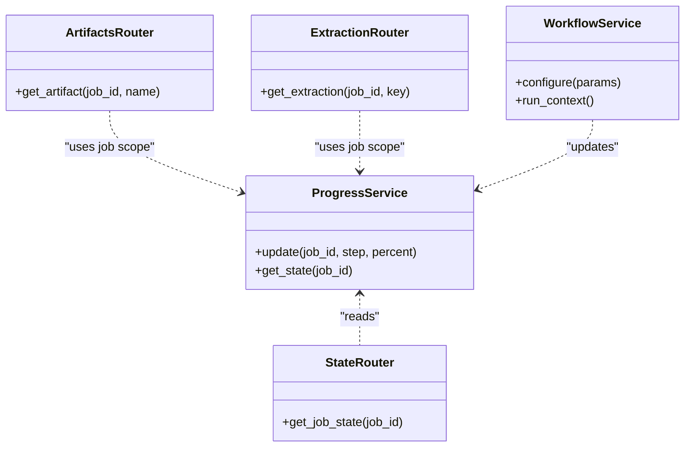
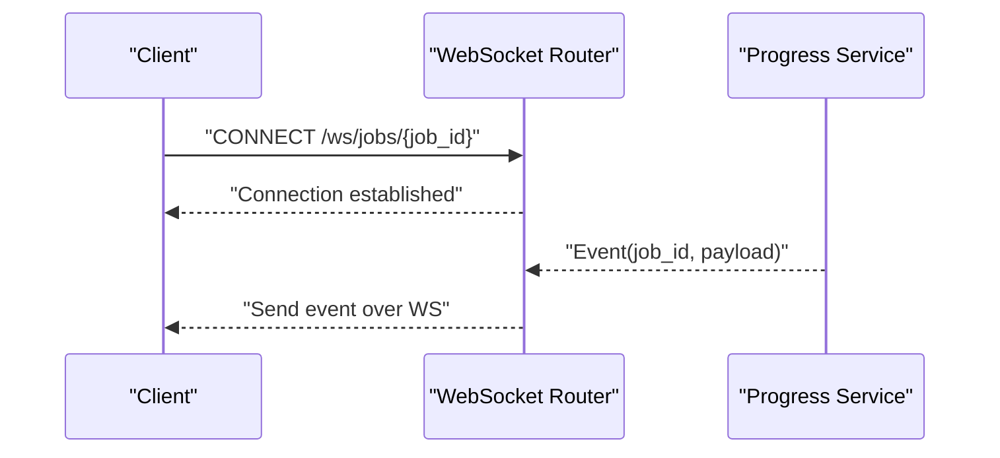
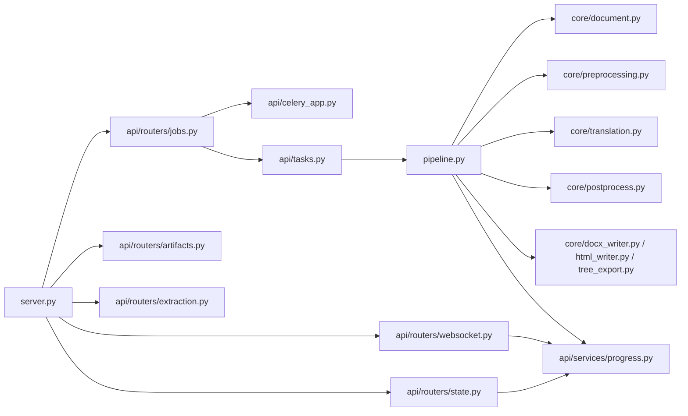

# Data Flow Architecture

<cite>
**Referenced Files in This Document**
- [server.py](file://src/local_deepl/server.py)
- [celery_app.py](file://src/local_deepl/api/celery_app.py)
- [tasks.py](file://src/local_deepl/api/tasks.py)
- [jobs.py](file://src/local_deepl/api/routers/jobs.py)
- [state.py](file://src/local_deepl/api/routers/state.py)
- [websocket.py](file://src/local_deepl/api/routers/websocket.py)
- [progress.py](file://src/local_deepl/api/services/progress.py)
- [workflow.py](file://src/local_deepl/api/services/workflow.py)
- [pipeline.py](file://src/local_deepl/pipeline.py)
- [document.py](file://src/local_deepl/core/document.py)
- [preprocessing.py](file://src/local_deepl/core/preprocessing.py)
- [translation.py](file://src/local_deepl/core/translation.py)
- [postprocess.py](file://src/local_deepl/core/postprocess.py)
- [docx_writer.py](file://src/local_deepl/core/docx_writer.py)
- [html_writer.py](file://src/local_deepl/core/html_writer.py)
- [tree_export.py](file://src/local_deepl/core/tree_export.py)
- [artifacts.py](file://src/local_deepl/api/routers/artifacts.py)
- [extraction.py](file://src/local_deepl/api/routers/extraction.py)
</cite>

## Table of Contents
1. [Introduction](#introduction)
2. [Project Structure](#project-structure)
3. [Core Components](#core-components)
4. [Architecture Overview](#architecture-overview)
5. [Detailed Component Analysis](#detailed-component-analysis)
6. [Dependency Analysis](#dependency-analysis)
7. [Performance Considerations](#performance-considerations)
8. [Troubleshooting Guide](#troubleshooting-guide)
9. [Conclusion](#conclusion)

## Introduction
This document describes LocalDeepL’s data flow architecture, focusing on the complete lifecycle of a document from upload through processing to result delivery. It explains the document processing pipeline, background job queue flow, and real-time progress tracking mechanisms. It also covers data persistence strategies, caching considerations, state management across distributed components, and WebSocket communication patterns for client-server synchronization.

## Project Structure
LocalDeepL is organized into:
- API layer (FastAPI routers, services, Celery app and tasks)
- Core processing modules (document model, preprocessing, translation, postprocessing, writers)
- Pipeline orchestration module
- Static assets and utilities

**Diagram sources**
- [server.py](file://src/local_deepl/server.py)
- [jobs.py](file://src/local_deepl/api/routers/jobs.py)
- [state.py](file://src/local_deepl/api/routers/state.py)
- [websocket.py](file://src/local_deepl/api/routers/websocket.py)
- [artifacts.py](file://src/local_deepl/api/routers/artifacts.py)
- [extraction.py](file://src/local_deepl/api/routers/extraction.py)
- [progress.py](file://src/local_deepl/api/services/progress.py)
- [workflow.py](file://src/local_deepl/api/services/workflow.py)
- [celery_app.py](file://src/local_deepl/api/celery_app.py)
- [tasks.py](file://src/local_deepl/api/tasks.py)
- [pipeline.py](file://src/local_deepl/pipeline.py)
- [document.py](file://src/local_deepl/core/document.py)
- [preprocessing.py](file://src/local_deepl/core/preprocessing.py)
- [translation.py](file://src/local_deepl/core/translation.py)
- [postprocess.py](file://src/local_deepl/core/postprocess.py)
- [docx_writer.py](file://src/local_deepl/core/docx_writer.py)
- [html_writer.py](file://src/local_deepl/core/html_writer.py)
- [tree_export.py](file://src/local_deepl/core/tree_export.py)

**Section sources**
- [server.py](file://src/local_deepl/server.py)
- [jobs.py](file://src/local_deepl/api/routers/jobs.py)
- [state.py](file://src/local_deepl/api/routers/state.py)
- [websocket.py](file://src/local_deepl/api/routers/websocket.py)
- [artifacts.py](file://src/local_deepl/api/routers/artifacts.py)
- [extraction.py](file://src/local_deepl/api/routers/extraction.py)
- [progress.py](file://src/local_deepl/api/services/progress.py)
- [workflow.py](file://src/local_deepl/api/services/workflow.py)
- [celery_app.py](file://src/local_deepl/api/celery_app.py)
- [tasks.py](file://src/local_deepl/api/tasks.py)
- [pipeline.py](file://src/local_deepl/pipeline.py)
- [document.py](file://src/local_deepl/core/document.py)
- [preprocessing.py](file://src/local_deepl/core/preprocessing.py)
- [translation.py](file://src/local_deepl/core/translation.py)
- [postprocess.py](file://src/local_deepl/core/postprocess.py)
- [docx_writer.py](file://src/local_deepl/core/docx_writer.py)
- [html_writer.py](file://src/local_deepl/core/html_writer.py)
- [tree_export.py](file://src/local_deepl/core/tree_export.py)

## Core Components
- FastAPI server and routers: expose REST endpoints for jobs, state, artifacts, extraction, and WebSocket events.
- Celery application and tasks: execute long-running document processing off the request thread.
- Pipeline orchestrator: coordinates document parsing, preprocessing, translation, postprocessing, and artifact generation.
- Progress service: persists and serves job progress updates.
- Workflow service: encapsulates workflow configuration and execution context.
- Core models and processors: represent documents, perform transformations, and write outputs.

Key responsibilities:
- Ingestion and validation at the API layer.
- Background execution via Celery with durable task state.
- Stepwise transformation with intermediate artifacts persisted.
- Real-time progress updates via persistent store and WebSocket broadcast.

**Section sources**
- [server.py](file://src/local_deepl/server.py)
- [jobs.py](file://src/local_deepl/api/routers/jobs.py)
- [state.py](file://src/local_deepl/api/routers/state.py)
- [websocket.py](file://src/local_deepl/api/routers/websocket.py)
- [celery_app.py](file://src/local_deepl/api/celery_app.py)
- [tasks.py](file://src/local_deepl/api/tasks.py)
- [pipeline.py](file://src/local_deepl/pipeline.py)
- [progress.py](file://src/local_deepl/api/services/progress.py)
- [workflow.py](file://src/local_deepl/api/services/workflow.py)

## Architecture Overview
The system follows an event-driven, queue-backed architecture:
- Clients submit jobs via REST.
- The server enqueues a Celery task with job metadata.
- Workers process the document through a staged pipeline, persisting artifacts and progress.
- Clients poll job state or subscribe to WebSocket events for live updates.
- Final artifacts are served via dedicated endpoints.

**Diagram sources**
- [jobs.py](file://src/local_deepl/api/routers/jobs.py)
- [celery_app.py](file://src/local_deepl/api/celery_app.py)
- [tasks.py](file://src/local_deepl/api/tasks.py)
- [pipeline.py](file://src/local_deepl/pipeline.py)
- [progress.py](file://src/local_deepl/api/services/progress.py)
- [state.py](file://src/local_deepl/api/routers/state.py)
- [artifacts.py](file://src/local_deepl/api/routers/artifacts.py)
- [websocket.py](file://src/local_deepl/api/routers/websocket.py)

## Detailed Component Analysis

### Document Processing Pipeline
The pipeline transforms a document through well-defined stages:
- Parse and normalize input into a canonical Document model.
- Preprocess pages/blocks (layout analysis, OCR if needed).
- Translate content using configured engines.
- Postprocess results (alignment, glossary, confidence scoring).
- Generate artifacts (DOCX, HTML, tree export).

**Diagram sources**
- [document.py](file://src/local_deepl/core/document.py)
- [preprocessing.py](file://src/local_deepl/core/preprocessing.py)
- [translation.py](file://src/local_deepl/core/translation.py)
- [postprocess.py](file://src/local_deepl/core/postprocess.py)
- [docx_writer.py](file://src/local_deepl/core/docx_writer.py)
- [html_writer.py](file://src/local_deepl/core/html_writer.py)
- [tree_export.py](file://src/local_deepl/core/tree_export.py)
- [pipeline.py](file://src/local_deepl/pipeline.py)

**Section sources**
- [pipeline.py](file://src/local_deepl/pipeline.py)
- [document.py](file://src/local_deepl/core/document.py)
- [preprocessing.py](file://src/local_deepl/core/preprocessing.py)
- [translation.py](file://src/local_deepl/core/translation.py)
- [postprocess.py](file://src/local_deepl/core/postprocess.py)
- [docx_writer.py](file://src/local_deepl/core/docx_writer.py)
- [html_writer.py](file://src/local_deepl/core/html_writer.py)
- [tree_export.py](file://src/local_deepl/core/tree_export.py)

### Background Job Queue Flow
- The jobs router accepts submission requests and enqueues a Celery task with job parameters.
- A worker picks up the task and invokes the pipeline orchestrator.
- The pipeline writes intermediate and final artifacts to storage and emits progress updates.
- Completion status is recorded for clients to query.

**Diagram sources**
- [jobs.py](file://src/local_deepl/api/routers/jobs.py)
- [celery_app.py](file://src/local_deepl/api/celery_app.py)
- [tasks.py](file://src/local_deepl/api/tasks.py)
- [pipeline.py](file://src/local_deepl/pipeline.py)
- [progress.py](file://src/local_deepl/api/services/progress.py)

**Section sources**
- [jobs.py](file://src/local_deepl/api/routers/jobs.py)
- [celery_app.py](file://src/local_deepl/api/celery_app.py)
- [tasks.py](file://src/local_deepl/api/tasks.py)
- [pipeline.py](file://src/local_deepl/pipeline.py)
- [progress.py](file://src/local_deepl/api/services/progress.py)

### Real-Time Progress Tracking
- The progress service persists per-job progress snapshots (step, percentage, message).
- The state router exposes job state for polling.
- The WebSocket router subscribes to progress events and forwards them to connected clients.

**Diagram sources**
- [progress.py](file://src/local_deepl/api/services/progress.py)
- [state.py](file://src/local_deepl/api/routers/state.py)
- [websocket.py](file://src/local_deepl/api/routers/websocket.py)

**Section sources**
- [progress.py](file://src/local_deepl/api/services/progress.py)
- [state.py](file://src/local_deepl/api/routers/state.py)
- [websocket.py](file://src/local_deepl/api/routers/websocket.py)

### Artifact Delivery and Extraction
- Artifacts router serves generated files (DOCX, HTML, tree exports) by job ID.
- Extraction router provides structured access to intermediate representations for inspection or downstream use.

**Diagram sources**
- [artifacts.py](file://src/local_deepl/api/routers/artifacts.py)
- [extraction.py](file://src/local_deepl/api/routers/extraction.py)

**Section sources**
- [artifacts.py](file://src/local_deepl/api/routers/artifacts.py)
- [extraction.py](file://src/local_deepl/api/routers/extraction.py)

### Data Persistence and State Management
- Job state and progress are persisted by the progress service, enabling reliable polling and recovery.
- Artifacts and extraction payloads are stored under job-scoped locations for retrieval.
- The workflow service maintains execution context and configuration used during processing.

**Diagram sources**
- [progress.py](file://src/local_deepl/api/services/progress.py)
- [state.py](file://src/local_deepl/api/routers/state.py)
- [artifacts.py](file://src/local_deepl/api/routers/artifacts.py)
- [extraction.py](file://src/local_deepl/api/routers/extraction.py)
- [workflow.py](file://src/local_deepl/api/services/workflow.py)

**Section sources**
- [progress.py](file://src/local_deepl/api/services/progress.py)
- [state.py](file://src/local_deepl/api/routers/state.py)
- [artifacts.py](file://src/local_deepl/api/routers/artifacts.py)
- [extraction.py](file://src/local_deepl/api/routers/extraction.py)
- [workflow.py](file://src/local_deepl/api/services/workflow.py)

### WebSocket Communication Patterns
- Clients connect to a WebSocket endpoint scoped by job ID.
- The server broadcasts progress events as they occur.
- Clients can combine polling and WebSocket for robust synchronization.

**Diagram sources**
- [websocket.py](file://src/local_deepl/api/routers/websocket.py)
- [progress.py](file://src/local_deepl/api/services/progress.py)

**Section sources**
- [websocket.py](file://src/local_deepl/api/routers/websocket.py)
- [progress.py](file://src/local_deepl/api/services/progress.py)

## Dependency Analysis
High-level dependencies between major components:

**Diagram sources**
- [server.py](file://src/local_deepl/server.py)
- [jobs.py](file://src/local_deepl/api/routers/jobs.py)
- [state.py](file://src/local_deepl/api/routers/state.py)
- [websocket.py](file://src/local_deepl/api/routers/websocket.py)
- [artifacts.py](file://src/local_deepl/api/routers/artifacts.py)
- [extraction.py](file://src/local_deepl/api/routers/extraction.py)
- [celery_app.py](file://src/local_deepl/api/celery_app.py)
- [tasks.py](file://src/local_deepl/api/tasks.py)
- [pipeline.py](file://src/local_deepl/pipeline.py)
- [document.py](file://src/local_deepl/core/document.py)
- [preprocessing.py](file://src/local_deepl/core/preprocessing.py)
- [translation.py](file://src/local_deepl/core/translation.py)
- [postprocess.py](file://src/local_deepl/core/postprocess.py)
- [docx_writer.py](file://src/local_deepl/core/docx_writer.py)
- [html_writer.py](file://src/local_deepl/core/html_writer.py)
- [tree_export.py](file://src/local_deepl/core/tree_export.py)
- [progress.py](file://src/local_deepl/api/services/progress.py)

**Section sources**
- [server.py](file://src/local_deepl/server.py)
- [jobs.py](file://src/local_deepl/api/routers/jobs.py)
- [state.py](file://src/local_deepl/api/routers/state.py)
- [websocket.py](file://src/local_deepl/api/routers/websocket.py)
- [artifacts.py](file://src/local_deepl/api/routers/artifacts.py)
- [extraction.py](file://src/local_deepl/api/routers/extraction.py)
- [celery_app.py](file://src/local_deepl/api/celery_app.py)
- [tasks.py](file://src/local_deepl/api/tasks.py)
- [pipeline.py](file://src/local_deepl/pipeline.py)
- [document.py](file://src/local_deepl/core/document.py)
- [preprocessing.py](file://src/local_deepl/core/preprocessing.py)
- [translation.py](file://src/local_deepl/core/translation.py)
- [postprocess.py](file://src/local_deepl/core/postprocess.py)
- [docx_writer.py](file://src/local_deepl/core/docx_writer.py)
- [html_writer.py](file://src/local_deepl/core/html_writer.py)
- [tree_export.py](file://src/local_deepl/core/tree_export.py)
- [progress.py](file://src/local_deepl/api/services/progress.py)

## Performance Considerations
- Offload heavy work to Celery workers to keep the API responsive.
- Persist progress incrementally to avoid large in-memory state.
- Stream artifacts when possible; prefer chunked responses for large files.
- Cache frequently accessed static resources and dictionary lookups where applicable.
- Use connection pooling for external services (OCR/LLM) and respect rate limits.

[No sources needed since this section provides general guidance]

## Troubleshooting Guide
- If progress does not update, verify that the progress service is writing snapshots and that the WebSocket router is broadcasting events.
- For missing artifacts, confirm that the artifact storage path is accessible and that the artifacts router resolves the correct job-scoped location.
- When jobs stall, inspect Celery worker logs and ensure tasks are being dispatched and acknowledged.
- For WebSocket issues, check that clients connect to the correct job-scoped endpoint and that the server is emitting events for the given job ID.

**Section sources**
- [progress.py](file://src/local_deepl/api/services/progress.py)
- [websocket.py](file://src/local_deepl/api/routers/websocket.py)
- [artifacts.py](file://src/local_deepl/api/routers/artifacts.py)
- [tasks.py](file://src/local_deepl/api/tasks.py)

## Conclusion
LocalDeepL’s data flow architecture separates concerns cleanly: the API layer handles ingestion and exposure, Celery manages asynchronous processing, the pipeline orchestrates transformations, and the progress/WebSocket subsystem enables real-time visibility. This design supports scalable, observable document processing with durable state and artifact delivery.