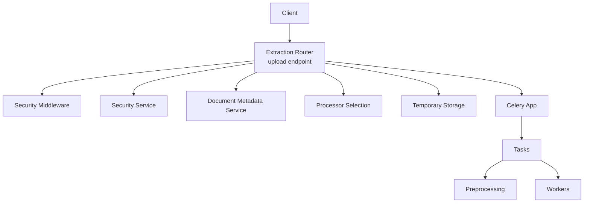
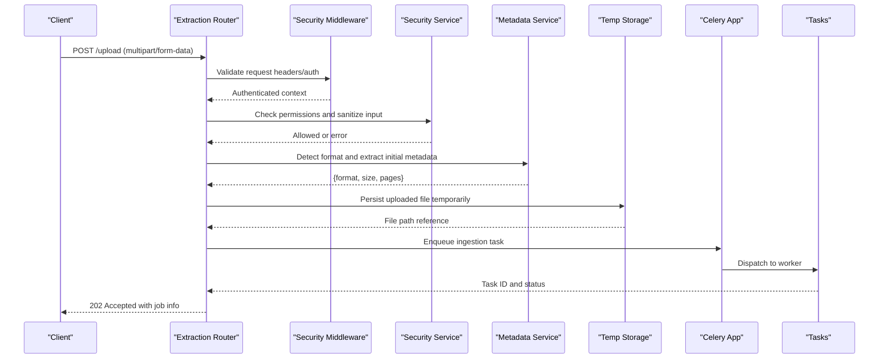
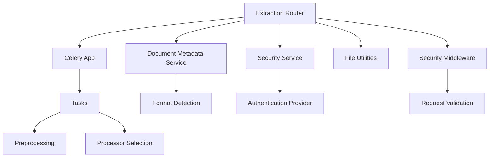

# Document Ingestion Flow

<cite>
**Referenced Files in This Document**
- [server.py](file://src/local_deepl/server.py)
- [routers/extraction.py](file://src/local_deepl/api/routers/extraction.py)
- [routers/jobs.py](file://src/local_deepl/api/routers/jobs.py)
- [services/document_metadata.py](file://src/local_deepl/api/services/document_metadata.py)
- [services/security.py](file://src/local_deepl/api/services/security.py)
- [services/security_middleware.py](file://src/local_deepl/api/services/security_middleware.py)
- [core/preprocessing.py](file://src/local_deepl/core/preprocessing.py)
- [core/processors.py](file://src/local_deepl/core/processors.py)
- [utils/file.py](file://src/local_deepl/utils/file.py)
- [celery_app.py](file://src/local_deepl/api/celery_app.py)
- [tasks.py](file://src/local_deepl/api/tasks.py)
</cite>

## Table of Contents
1. [Introduction](#introduction)
2. [Project Structure](#project-structure)
3. [Core Components](#core-components)
4. [Architecture Overview](#architecture-overview)
5. [Detailed Component Analysis](#detailed-component-analysis)
6. [Dependency Analysis](#dependency-analysis)
7. [Performance Considerations](#performance-considerations)
8. [Troubleshooting Guide](#troubleshooting-guide)
9. [Conclusion](#conclusion)

## Introduction
This document explains the document ingestion flow in LocalDeepL, covering how documents are uploaded, validated, routed through the processing pipeline, and prepared for downstream tasks. It details file format detection, temporary storage handling, initial metadata extraction, supported formats, size limitations, preprocessing steps, error handling, validation rules, and security checks. Sequence diagrams illustrate the end-to-end process from client request to document readiness.

## Project Structure
The ingestion flow spans API routers, services, core preprocessing, utilities, and background task execution:
- API layer exposes endpoints for upload and job management.
- Services handle security, metadata extraction, and orchestration.
- Core modules perform preprocessing and processor selection.
- Utilities provide file helpers.
- Background workers execute long-running tasks via Celery.

[No sources needed since this diagram shows conceptual workflow, not actual code structure]

## Core Components
- Upload router: Receives multipart uploads, validates requests, and initiates processing.
- Security middleware/service: Enforces authentication, authorization, and input sanitization.
- Metadata service: Extracts initial document metadata (type, size, page count where applicable).
- Processor selection: Chooses appropriate processors based on detected file type.
- Temporary storage: Persists uploaded files safely during ingestion.
- Celery integration: Offloads heavy work to background tasks.
- Preprocessing: Applies initial transformations before main processing.

**Section sources**
- [routers/extraction.py](file://src/local_deepl/api/routers/extraction.py)
- [routers/jobs.py](file://src/local_deepl/api/routers/jobs.py)
- [services/security_middleware.py](file://src/local_deepl/api/services/security_middleware.py)
- [services/security.py](file://src/local_deepl/api/services/security.py)
- [services/document_metadata.py](file://src/local_deepl/api/services/document_metadata.py)
- [core/processors.py](file://src/local_deepl/core/processors.py)
- [core/preprocessing.py](file://src/local_deepl/core/preprocessing.py)
- [utils/file.py](file://src/local_deepl/utils/file.py)
- [celery_app.py](file://src/local_deepl/api/celery_app.py)
- [tasks.py](file://src/local_deepl/api/tasks.py)

## Architecture Overview
The ingestion architecture follows a layered approach with clear separation of concerns:
- HTTP entry points validate and route requests.
- Security layers enforce access control and input safety.
- Metadata extraction informs routing and preprocessing.
- Processor selection determines the processing path.
- Temporary storage ensures safe handling of inputs.
- Celery tasks execute long-running operations asynchronously.

**Diagram sources**
- [routers/extraction.py](file://src/local_deepl/api/routers/extraction.py)
- [services/security_middleware.py](file://src/local_deepl/api/services/security_middleware.py)
- [services/security.py](file://src/local_deepl/api/services/security.py)
- [services/document_metadata.py](file://src/local_deepl/api/services/document_metadata.py)
- [celery_app.py](file://src/local_deepl/api/celery_app.py)
- [tasks.py](file://src/local_deepl/api/tasks.py)

## Detailed Component Analysis

### Upload Endpoint and Request Handling
The upload endpoint accepts multipart form data containing the document file. It performs:
- Content-type validation for multipart/form-data
- File presence and basic sanity checks
- Integration with security middleware for authentication
- Delegation to metadata extraction for format detection

Key responsibilities:
- Parse multipart payload
- Validate required fields
- Initialize processing workflow
- Return immediate acknowledgment with job tracking

**Section sources**
- [routers/extraction.py](file://src/local_deepl/api/routers/extraction.py)
- [routers/jobs.py](file://src/local_deepl/api/routers/jobs.py)

### Security Middleware and Service
Security is enforced at multiple levels:
- Middleware validates authentication tokens and request integrity
- Service layer applies authorization policies and input sanitization
- Rate limiting and abuse prevention mechanisms

Security checks include:
- Token validation and expiration
- Permission verification for upload actions
- Input sanitization to prevent injection attacks
- Size limit enforcement at the gateway level

**Section sources**
- [services/security_middleware.py](file://src/local_deepl/api/services/security_middleware.py)
- [services/security.py](file://src/local_deepl/api/services/security.py)

### File Format Detection and Metadata Extraction
Format detection occurs early in the pipeline:
- MIME type analysis from file headers
- Extension-based fallback detection
- Content inspection for binary vs text files
- Initial metadata extraction including size, page count (for PDFs), and language hints

Supported formats are determined by available processors and libraries:
- PDF documents
- Word documents (.docx)
- Plain text files (.txt)
- Image files for OCR processing (.png, .jpg, .jpeg)
- HTML documents (.html, .htm)

**Section sources**
- [services/document_metadata.py](file://src/local_deepl/api/services/document_metadata.py)
- [core/processors.py](file://src/local_deepl/core/processors.py)

### Temporary Storage Handling
Uploaded files are stored temporarily during ingestion:
- Secure temporary directory creation
- Unique filename generation to prevent conflicts
- Automatic cleanup after processing completion
- Access controls to prevent unauthorized file access

Storage considerations:
- Disk space monitoring and quota enforcement
- Atomic file operations to prevent corruption
- Path traversal protection
- Encryption at rest for sensitive documents

**Section sources**
- [utils/file.py](file://src/local_deepl/utils/file.py)

### Processor Selection and Routing
Based on detected format, the system selects appropriate processors:
- Text processors for plain text and HTML
- PDF processors for document layout analysis
- OCR processors for image files
- Specialized handlers for specific document types

Selection criteria:
- File format compatibility
- Available processing capabilities
- Quality requirements and accuracy needs
- Performance constraints

**Section sources**
- [core/processors.py](file://src/local_deepl/core/processors.py)

### Background Processing with Celery
Long-running ingestion tasks are offloaded to Celery workers:
- Task queuing with priority support
- Worker pool management for scalability
- Progress tracking and status updates
- Error handling and retry mechanisms

Task lifecycle:
- Task submission and acknowledgment
- Execution in isolated worker processes
- Result persistence and retrieval
- Cleanup of temporary resources

**Section sources**
- [celery_app.py](file://src/local_deepl/api/celery_app.py)
- [tasks.py](file://src/local_deepl/api/tasks.py)

### Preprocessing Pipeline
Before main processing begins, documents undergo initial preprocessing:
- File validation and integrity checks
- Character encoding normalization
- Layout analysis for complex documents
- Resource optimization (image compression, font embedding)
- Security scanning for malicious content

Preprocessing steps vary by format:
- PDF: Font extraction, image optimization
- Images: Resolution adjustment, noise reduction
- Text: Encoding detection, whitespace normalization
- HTML: CSS/JS stripping, resource loading

**Section sources**
- [core/preprocessing.py](file://src/local_deepl/core/preprocessing.py)

## Dependency Analysis
The ingestion flow has well-defined dependencies between components:

**Diagram sources**
- [routers/extraction.py](file://src/local_deepl/api/routers/extraction.py)
- [services/security_middleware.py](file://src/local_deepl/api/services/security_middleware.py)
- [services/security.py](file://src/local_deepl/api/services/security.py)
- [services/document_metadata.py](file://src/local_deepl/api/services/document_metadata.py)
- [utils/file.py](file://src/local_deepl/utils/file.py)
- [celery_app.py](file://src/local_deepl/api/celery_app.py)
- [tasks.py](file://src/local_deepl/api/tasks.py)
- [core/preprocessing.py](file://src/local_deepl/core/preprocessing.py)
- [core/processors.py](file://src/local_deepl/core/processors.py)

**Section sources**
- [server.py](file://src/local_deepl/server.py)

## Performance Considerations
- Asynchronous processing prevents blocking the main application thread
- Chunked file uploads support large document handling
- Memory-mapped file access reduces memory footprint for large files
- Parallel processing across multiple workers improves throughput
- Caching of frequently accessed metadata reduces redundant computations
- Connection pooling for external services minimizes latency

Optimization strategies:
- Lazy loading of heavy dependencies
- Streaming processing for large documents
- Efficient file format detection without full content parsing
- Batch processing for multiple small files
- Resource cleanup to prevent memory leaks

## Troubleshooting Guide
Common issues and their resolutions:

Upload failures:
- Verify authentication credentials and token validity
- Check file size limits and format support
- Ensure sufficient disk space in temporary storage
- Review network connectivity and timeout settings

Processing errors:
- Inspect worker logs for specific error messages
- Validate file integrity and format compatibility
- Check resource availability (memory, CPU, disk)
- Review dependency versions and library compatibility

Security issues:
- Verify CORS configuration for web clients
- Check permission scopes and access controls
- Monitor rate limiting and abuse detection
- Audit file access patterns and permissions

Error handling patterns:
- Graceful degradation when optional features fail
- Comprehensive logging with contextual information
- User-friendly error messages with actionable guidance
- Retry mechanisms for transient failures

**Section sources**
- [services/security.py](file://src/local_deepl/api/services/security.py)
- [tasks.py](file://src/local_deepl/api/tasks.py)

## Conclusion
The LocalDeepL document ingestion flow provides a robust, secure, and scalable foundation for processing diverse document formats. The modular architecture enables easy extension and maintenance while ensuring high performance and reliability. Key strengths include comprehensive security measures, flexible format support, asynchronous processing capabilities, and detailed error handling. The system is designed to handle both simple text documents and complex multi-format workflows efficiently.