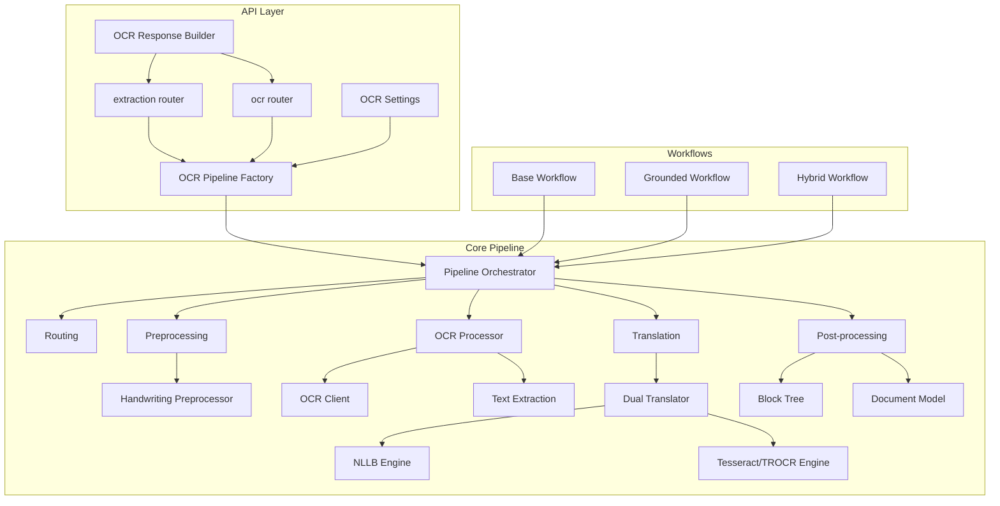
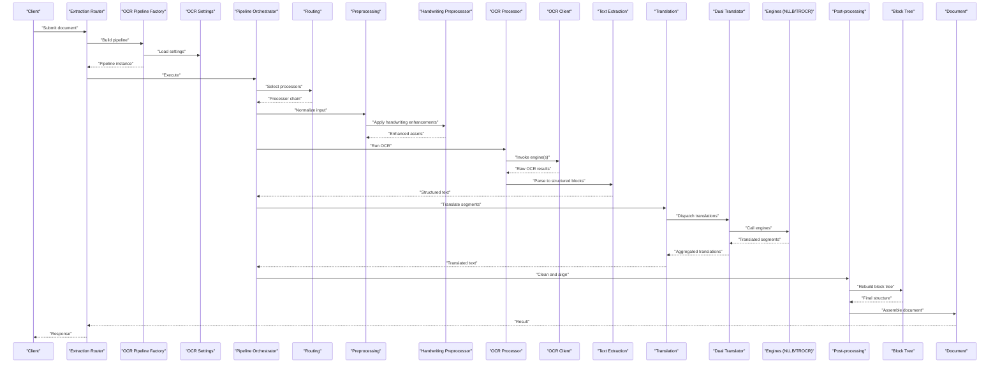
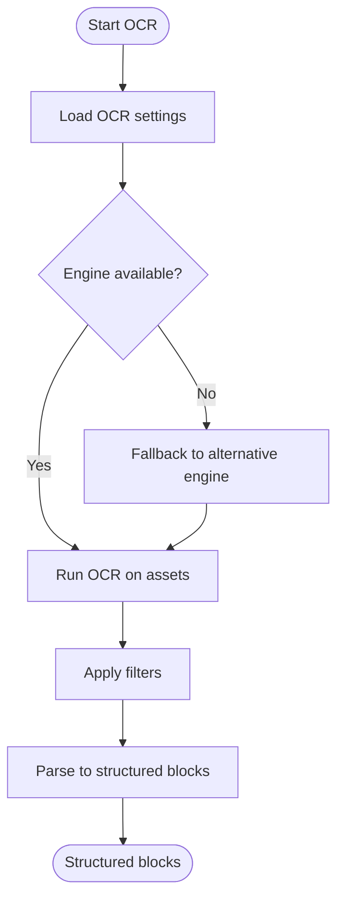
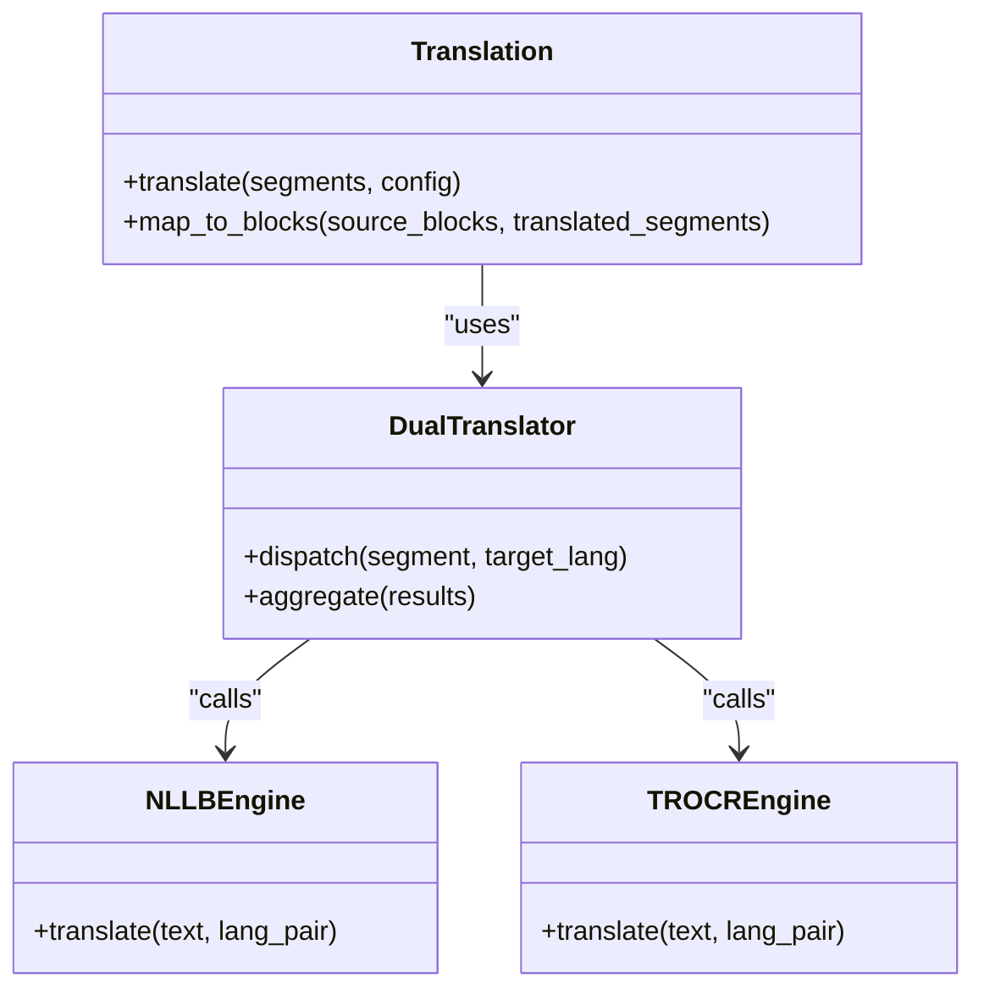
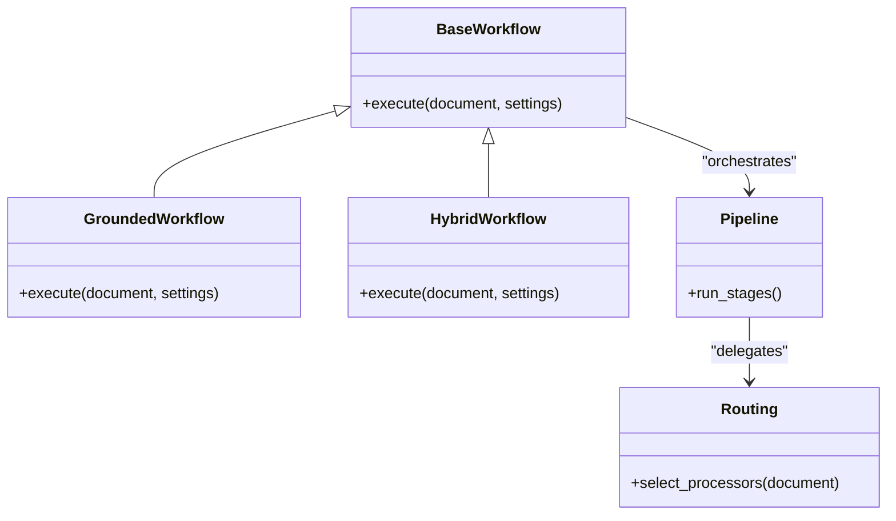
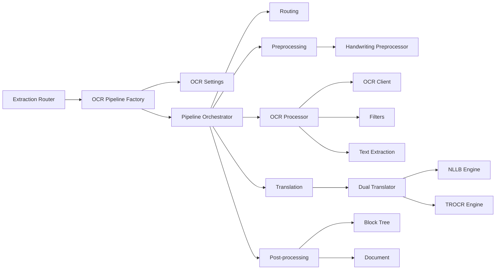

# Document Processing Stages

<cite>
**Referenced Files in This Document**
- [pipeline.py](file://src/local_deepl/pipeline.py)
- [preprocessing.py](file://src/local_deepl/core/preprocessing.py)
- [handwriting_preprocessor.py](file://src/local_deepl/core/handwriting_preprocessor.py)
- [ocr/processor.py](file://src/local_deepl/core/ocr/processor.py)
- [ocr/client.py](file://src/local_deepl/core/ocr/client.py)
- [ocr/filters.py](file://src/local_deepl/core/ocr/filters.py)
- [postprocess.py](file://src/local_deepl/core/postprocess.py)
- [translation.py](file://src/local_deepl/core/translation.py)
- [dual_translator.py](file://src/local_deepl/core/dual_translator.py)
- [nllb_engine.py](file://src/local_deepl/core/nllb_engine.py)
- [trocr_engine.py](file://src/local_deepl/core/trocr_engine.py)
- [routing.py](file://src/local_deepl/core/routing.py)
- [document.py](file://src/local_deepl/core/document.py)
- [block_tree.py](file://src/local_deepl/core/block_tree.py)
- [grounded/models.py](file://src/local_deepl/core/grounded/models.py)
- [grounded/parsers.py](file://src/local_deepl/core/grounded/parsers.py)
- [workflows/base.py](file://src/local_deepl/core/workflows/base.py)
- [workflows/grounded.py](file://src/local_deepl/core/workflows/grounded.py)
- [workflows/hybrid.py](file://src/local_deepl/core/workflows/hybrid.py)
- [api/services/ocr_pipeline_factory.py](file://src/local_deepl/api/services/ocr_pipeline_factory.py)
- [api/services/ocr_settings.py](file://src/local_deepl/api/services/ocr_settings.py)
- [api/services/ocr_response.py](file://src/local_deepl/api/services/ocr_response.py)
- [api/routers/extraction.py](file://src/local_deepl/api/routers/extraction.py)
- [api/routers/ocr.py](file://src/local_deepl/api/routers/ocr.py)
- [core/__init__.py](file://src/local_deepl/core/__init__.py)
</cite>

## Table of Contents
1. [Introduction](#introduction)
2. [Project Structure](#project-structure)
3. [Core Components](#core-components)
4. [Architecture Overview](#architecture-overview)
5. [Detailed Component Analysis](#detailed-component-analysis)
6. [Dependency Analysis](#dependency-analysis)
7. [Performance Considerations](#performance-considerations)
8. [Troubleshooting Guide](#troubleshooting-guide)
9. [Conclusion](#conclusion)
10. [Appendices](#appendices)

## Introduction
This document explains the sequential stages that transform a raw document into translated, structured output. The pipeline covers input validation, format detection, preprocessing (including handwriting-specific steps), OCR processing, text extraction, translation, and post-processing. It also documents data transformations at each stage, error handling mechanisms, configuration options, and how different document types flow through processors based on their characteristics.

## Project Structure
The document processing logic is implemented under src/local_deepl with clear separation between core processing modules, API services, and workflows:
- Core processing modules implement the pipeline stages and models.
- API services orchestrate pipeline execution and expose endpoints.
- Workflows encapsulate end-to-end strategies for different document types.

**Diagram sources**
- [api/routers/extraction.py](file://src/local_deepl/api/routers/extraction.py)
- [api/routers/ocr.py](file://src/local_deepl/api/routers/ocr.py)
- [api/services/ocr_pipeline_factory.py](file://src/local_deepl/api/services/ocr_pipeline_factory.py)
- [api/services/ocr_settings.py](file://src/local_deepl/api/services/ocr_settings.py)
- [api/services/ocr_response.py](file://src/local_deepl/api/services/ocr_response.py)
- [pipeline.py](file://src/local_deepl/pipeline.py)
- [routing.py](file://src/local_deepl/core/routing.py)
- [preprocessing.py](file://src/local_deepl/core/preprocessing.py)
- [handwriting_preprocessor.py](file://src/local_deepl/core/handwriting_preprocessor.py)
- [ocr/processor.py](file://src/local_deepl/core/ocr/processor.py)
- [ocr/client.py](file://src/local_deepl/core/ocr/client.py)
- [translation.py](file://src/local_deepl/core/translation.py)
- [dual_translator.py](file://src/local_deepl/core/dual_translator.py)
- [nllb_engine.py](file://src/local_deepl/core/nllb_engine.py)
- [trocr_engine.py](file://src/local_deepl/core/trocr_engine.py)
- [postprocess.py](file://src/local_deepl/core/postprocess.py)
- [block_tree.py](file://src/local_deepl/core/block_tree.py)
- [document.py](file://src/local_deepl/core/document.py)
- [workflows/base.py](file://src/local_deepl/core/workflows/base.py)
- [workflows/grounded.py](file://src/local_deepl/core/workflows/grounded.py)
- [workflows/hybrid.py](file://src/local_deepl/core/workflows/hybrid.py)

**Section sources**
- [pipeline.py](file://src/local_deepl/pipeline.py)
- [core/__init__.py](file://src/local_deepl/core/__init__.py)

## Core Components
- Pipeline orchestrator: coordinates stage execution, manages state, and applies routing decisions.
- Routing: selects appropriate processors based on document type and content characteristics.
- Preprocessing: normalizes inputs, prepares images/text, and applies handwriting-specific enhancements.
- OCR processor: integrates OCR engines and filters to extract text and layout information.
- Text extraction: converts OCR results into structured blocks and trees.
- Translation: translates extracted text using dual translator and pluggable engines.
- Post-processing: cleans up text, aligns structure, and builds final document artifacts.
- Workflows: encapsulate end-to-end strategies for grounded and hybrid processing paths.

**Section sources**
- [pipeline.py](file://src/local_deepl/pipeline.py)
- [routing.py](file://src/local_deepl/core/routing.py)
- [preprocessing.py](file://src/local_deepl/core/preprocessing.py)
- [handwriting_preprocessor.py](file://src/local_deepl/core/handwriting_preprocessor.py)
- [ocr/processor.py](file://src/local_deepl/core/ocr/processor.py)
- [ocr/client.py](file://src/local_deepl/core/ocr/client.py)
- [ocr/filters.py](file://src/local_deepl/core/ocr/filters.py)
- [translation.py](file://src/local_deepl/core/translation.py)
- [dual_translator.py](file://src/local_deepl/core/dual_translator.py)
- [nllb_engine.py](file://src/local_deepl/core/nllb_engine.py)
- [trocr_engine.py](file://src/local_deepl/core/trocr_engine.py)
- [postprocess.py](file://src/local_deepl/core/postprocess.py)
- [block_tree.py](file://src/local_deepl/core/block_tree.py)
- [document.py](file://src/local_deepl/core/document.py)
- [workflows/base.py](file://src/local_deepl/core/workflows/base.py)
- [workflows/grounded.py](file://src/local_deepl/core/workflows/grounded.py)
- [workflows/hybrid.py](file://src/local_deepl/core/workflows/hybrid.py)

## Architecture Overview
The system exposes API endpoints that build an OCR pipeline via a factory, then execute it through a workflow. The pipeline stages are modular and configurable, allowing different processors to be selected based on document characteristics.

**Diagram sources**
- [api/routers/extraction.py](file://src/local_deepl/api/routers/extraction.py)
- [api/services/ocr_pipeline_factory.py](file://src/local_deepl/api/services/ocr_pipeline_factory.py)
- [api/services/ocr_settings.py](file://src/local_deepl/api/services/ocr_settings.py)
- [pipeline.py](file://src/local_deepl/pipeline.py)
- [routing.py](file://src/local_deepl/core/routing.py)
- [preprocessing.py](file://src/local_deepl/core/preprocessing.py)
- [handwriting_preprocessor.py](file://src/local_deepl/core/handwriting_preprocessor.py)
- [ocr/processor.py](file://src/local_deepl/core/ocr/processor.py)
- [ocr/client.py](file://src/local_deepl/core/ocr/client.py)
- [translation.py](file://src/local_deepl/core/translation.py)
- [dual_translator.py](file://src/local_deepl/core/dual_translator.py)
- [nllb_engine.py](file://src/local_deepl/core/nllb_engine.py)
- [trocr_engine.py](file://src/local_deepl/core/trocr_engine.py)
- [postprocess.py](file://src/local_deepl/core/postprocess.py)
- [block_tree.py](file://src/local_deepl/core/block_tree.py)
- [document.py](file://src/local_deepl/core/document.py)

## Detailed Component Analysis

### Stage 1: Input Validation and Format Detection
- Responsibilities:
  - Validate incoming requests and attachments.
  - Detect document format (image, PDF, digital text).
  - Normalize inputs for downstream stages.
- Data transformation:
  - Raw bytes or multipart form data -> validated payload with detected format metadata.
- Error handling:
  - Reject unsupported formats; return actionable errors.
- Configuration:
  - Allowed MIME types and size limits configured at API layer.

**Section sources**
- [api/routers/extraction.py](file://src/local_deepl/api/routers/extraction.py)
- [api/routers/ocr.py](file://src/local_deepl/api/routers/ocr.py)
- [api/services/ocr_response.py](file://src/local_deepl/api/services/ocr_response.py)

### Stage 2: Preprocessing and Handwriting Enhancement
- Responsibilities:
  - Normalize images (resize, denoise, contrast).
  - Prepare text for OCR or direct parsing.
  - Apply handwriting-specific enhancements when needed.
- Data transformation:
  - Normalized images/text assets ready for OCR or extraction.
- Error handling:
  - Graceful fallback if enhancement fails; continue with best-effort assets.
- Configuration:
  - Preprocessing parameters (e.g., thresholds, scaling) and handwriting flags.

**Section sources**
- [preprocessing.py](file://src/local_deepl/core/preprocessing.py)
- [handwriting_preprocessor.py](file://src/local_deepl/core/handwriting_preprocessor.py)

### Stage 3: OCR Processing and Text Extraction
- Responsibilities:
  - Run OCR engines (e.g., Tesseract/TROCR) via client abstraction.
  - Filter and refine OCR outputs.
  - Convert raw OCR results into structured blocks and trees.
- Data transformation:
  - Images -> OCR results -> structured blocks with positions and confidence.
- Error handling:
  - Engine failures handled by client; retries or fallback engines supported.
- Configuration:
  - OCR engine selection, language packs, filter rules, and confidence thresholds.

**Diagram sources**
- [ocr/processor.py](file://src/local_deepl/core/ocr/processor.py)
- [ocr/client.py](file://src/local_deepl/core/ocr/client.py)
- [ocr/filters.py](file://src/local_deepl/core/ocr/filters.py)
- [api/services/ocr_settings.py](file://src/local_deepl/api/services/ocr_settings.py)

**Section sources**
- [ocr/processor.py](file://src/local_deepl/core/ocr/processor.py)
- [ocr/client.py](file://src/local_deepl/core/ocr/client.py)
- [ocr/filters.py](file://src/local_deepl/core/ocr/filters.py)

### Stage 4: Translation
- Responsibilities:
  - Translate extracted text segments.
  - Use dual translator to dispatch to multiple engines.
  - Aggregate translations and maintain alignment with source structure.
- Data transformation:
  - Structured blocks -> translated blocks preserving hierarchy and metadata.
- Error handling:
  - Per-segment translation errors handled; partial results returned with warnings.
- Configuration:
  - Target languages, engine selection, glossary usage, and batching options.

**Diagram sources**
- [translation.py](file://src/local_deepl/core/translation.py)
- [dual_translator.py](file://src/local_deepl/core/dual_translator.py)
- [nllb_engine.py](file://src/local_deepl/core/nllb_engine.py)
- [trocr_engine.py](file://src/local_deepl/core/trocr_engine.py)

**Section sources**
- [translation.py](file://src/local_deepl/core/translation.py)
- [dual_translator.py](file://src/local_deepl/core/dual_translator.py)
- [nllb_engine.py](file://src/local_deepl/core/nllb_engine.py)
- [trocr_engine.py](file://src/local_deepl/core/trocr_engine.py)

### Stage 5: Post-processing and Document Assembly
- Responsibilities:
  - Clean and normalize translated text.
  - Rebuild block tree and align with original structure.
  - Assemble final document model and artifacts.
- Data transformation:
  - Translated blocks -> cleaned blocks -> final document with metadata.
- Error handling:
  - Structural inconsistencies corrected where possible; warnings logged.
- Configuration:
  - Cleaning rules, alignment tolerances, and export options.

**Section sources**
- [postprocess.py](file://src/local_deepl/core/postprocess.py)
- [block_tree.py](file://src/local_deepl/core/block_tree.py)
- [document.py](file://src/local_deepl/core/document.py)

### Stage 6: Routing and Workflow Orchestration
- Responsibilities:
  - Route documents to appropriate processors based on type and content.
  - Orchestrate end-to-end workflows (base, grounded, hybrid).
- Data transformation:
  - Document metadata -> processor selection -> workflow execution plan.
- Error handling:
  - Fallback workflows and processors when primary path fails.
- Configuration:
  - Routing rules, workflow preferences, and feature flags.

**Diagram sources**
- [workflows/base.py](file://src/local_deepl/core/workflows/base.py)
- [workflows/grounded.py](file://src/local_deepl/core/workflows/grounded.py)
- [workflows/hybrid.py](file://src/local_deepl/core/workflows/hybrid.py)
- [routing.py](file://src/local_deepl/core/routing.py)
- [pipeline.py](file://src/local_deepl/pipeline.py)

**Section sources**
- [routing.py](file://src/local_deepl/core/routing.py)
- [workflows/base.py](file://src/local_deepl/core/workflows/base.py)
- [workflows/grounded.py](file://src/local_deepl/core/workflows/grounded.py)
- [workflows/hybrid.py](file://src/local_deepl/core/workflows/hybrid.py)
- [pipeline.py](file://src/local_deepl/pipeline.py)

### Stage 7: API Integration and Response Building
- Responsibilities:
  - Build pipelines from settings and execute them.
  - Construct standardized responses including progress and artifacts.
- Data transformation:
  - Request payloads -> pipeline execution -> response objects.
- Error handling:
  - Consistent error shapes and status codes.
- Configuration:
  - Settings loaded per request or persisted.

**Section sources**
- [api/services/ocr_pipeline_factory.py](file://src/local_deepl/api/services/ocr_pipeline_factory.py)
- [api/services/ocr_settings.py](file://src/local_deepl/api/services/ocr_settings.py)
- [api/services/ocr_response.py](file://src/local_deepl/api/services/ocr_response.py)
- [api/routers/extraction.py](file://src/local_deepl/api/routers/extraction.py)
- [api/routers/ocr.py](file://src/local_deepl/api/routers/ocr.py)

## Dependency Analysis
The following diagram highlights key dependencies among core components involved in document processing.

**Diagram sources**
- [api/routers/extraction.py](file://src/local_deepl/api/routers/extraction.py)
- [api/services/ocr_pipeline_factory.py](file://src/local_deepl/api/services/ocr_pipeline_factory.py)
- [api/services/ocr_settings.py](file://src/local_deepl/api/services/ocr_settings.py)
- [pipeline.py](file://src/local_deepl/pipeline.py)
- [routing.py](file://src/local_deepl/core/routing.py)
- [preprocessing.py](file://src/local_deepl/core/preprocessing.py)
- [handwriting_preprocessor.py](file://src/local_deepl/core/handwriting_preprocessor.py)
- [ocr/processor.py](file://src/local_deepl/core/ocr/processor.py)
- [ocr/client.py](file://src/local_deepl/core/ocr/client.py)
- [ocr/filters.py](file://src/local_deepl/core/ocr/filters.py)
- [translation.py](file://src/local_deepl/core/translation.py)
- [dual_translator.py](file://src/local_deepl/core/dual_translator.py)
- [nllb_engine.py](file://src/local_deepl/core/nllb_engine.py)
- [trocr_engine.py](file://src/local_deepl/core/trocr_engine.py)
- [postprocess.py](file://src/local_deepl/core/postprocess.py)
- [block_tree.py](file://src/local_deepl/core/block_tree.py)
- [document.py](file://src/local_deepl/core/document.py)

**Section sources**
- [pipeline.py](file://src/local_deepl/pipeline.py)
- [core/__init__.py](file://src/local_deepl/core/__init__.py)

## Performance Considerations
- Batch translation to reduce overhead and improve throughput.
- Cache OCR results for identical inputs when feasible.
- Use lightweight preprocessing for simple documents; enable handwriting enhancements only when necessary.
- Prefer faster OCR engines for large volumes; fall back to higher-quality engines selectively.
- Stream responses and artifacts to minimize memory pressure.

[No sources needed since this section provides general guidance]

## Troubleshooting Guide
Common issues and resolutions:
- Unsupported format: Ensure file type is allowed and within size limits.
- OCR engine failure: Check engine availability and credentials; verify fallback configuration.
- Partial translation: Inspect segment-level errors and retry failed segments.
- Structural misalignment: Review post-processing alignment tolerances and block tree reconstruction.

**Section sources**
- [api/services/ocr_response.py](file://src/local_deepl/api/services/ocr_response.py)
- [ocr/client.py](file://src/local_deepl/core/ocr/client.py)
- [translation.py](file://src/local_deepl/core/translation.py)
- [postprocess.py](file://src/local_deepl/core/postprocess.py)

## Conclusion
The document processing pipeline is modular and configurable, supporting diverse document types through routing and workflow orchestration. Each stage transforms data predictably, with robust error handling and clear configuration points. By selecting appropriate processors and tuning settings, the system can efficiently handle images, scanned PDFs, handwritten notes, and digital text.

[No sources needed since this section summarizes without analyzing specific files]

## Appendices

### Example Flows by Document Type
- Image-based document:
  - Input validation -> Preprocessing -> OCR -> Text extraction -> Translation -> Post-processing -> Document assembly.
- Scanned PDF:
  - Input validation -> Page rasterization -> Preprocessing -> OCR -> Text extraction -> Translation -> Post-processing -> Document assembly.
- Digital text:
  - Input validation -> Direct text parsing -> Optional translation -> Post-processing -> Document assembly.
- Handwritten note:
  - Input validation -> Handwriting preprocessing -> OCR with specialized engine -> Text extraction -> Translation -> Post-processing -> Document assembly.

[No sources needed since this section provides conceptual examples]